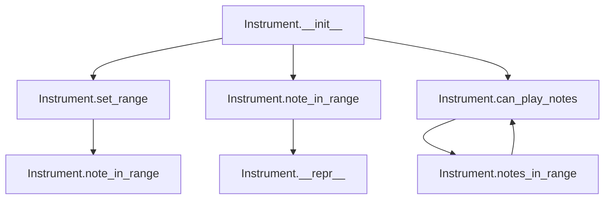
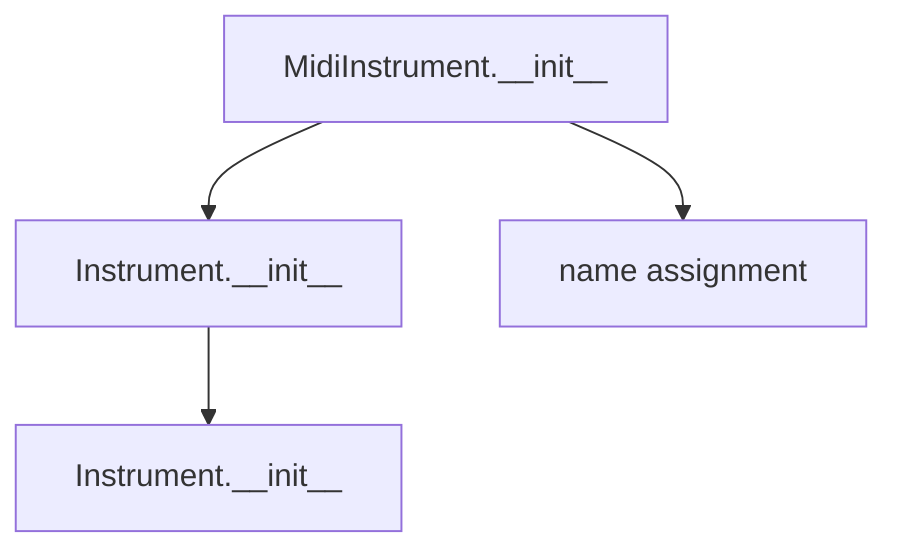

# `instrument.py`

## `mingus.containers.instrument.Instrument` · *class*

## Summary:
Represents a musical instrument with a defined pitch range and associated properties.

## Description:
The Instrument class serves as a base class for musical instruments, defining common properties such as name, playable range, clef, and tuning. It provides functionality for checking whether musical notes fall within the instrument's playable range, making it useful for music composition and analysis applications.

This class is intended to be subclassed by specific instrument implementations (like Piano, Guitar, etc.) that would override the default range and other properties to match the characteristics of particular instruments.

## State:
- name (str): The name of the instrument, defaulting to "Instrument"
- range (tuple): A tuple containing two Note objects representing the minimum and maximum playable pitches, defaulting to (Note("C", 0), Note("C", 8))
- clef (str): The musical clef associated with the instrument, defaulting to "bass and treble"
- tuning (StringTuning or None): Optional tuning information for string instruments, defaulting to None

## Lifecycle:
- Creation: Instantiate with default constructor or subclass with specific instrument properties
- Usage: Call methods like note_in_range() or can_play_notes() to validate musical notes against the instrument's range
- Destruction: No special cleanup required; uses standard Python garbage collection

## Method Map:


## Raises:
- UnexpectedObjectError: Raised by set_range() and note_in_range() when invalid objects (not Note instances) are passed as arguments

## Example:
```python
# Create a basic instrument
instrument = Instrument()

# Set a custom range
instrument.set_range(("C4", "C6"))

# Check if notes are in range
print(instrument.note_in_range("D5"))  # True
print(instrument.note_in_range("C3"))  # False

# Check if collections of notes can be played
notes_list = ["C4", "D4", "E4"]
print(instrument.can_play_notes(notes_list))  # True

# Display instrument info
print(instrument)  # Instrument [C-4 - C-6]
```

### `mingus.containers.instrument.Instrument.__init__` · *method*

## Summary:
Initializes an Instrument instance with default class variable values.

## Description:
This method serves as the constructor for the Instrument class. It currently contains only a pass statement and performs no explicit initialization of instance attributes. The Instrument class defines default values as class variables (name="Instrument", range=(Note("C", 0), Note("C", 8)), clef="bass and treble", tuning=None) that will be inherited by instances. This minimal implementation means that instance attributes will reference the same class variables, which may lead to unexpected behavior if those attributes are modified on an instance level.

## Args:
    None

## Returns:
    None

## Raises:
    None

## State Changes:
    Attributes READ: None
    Attributes WRITTEN: None

## Constraints:
    Preconditions: None
    Postconditions: The Instrument instance is created with default class variable values inherited from the class

## Side Effects:
    None

### `mingus.containers.instrument.Instrument.set_range` · *method*

*No documentation generated.*

### `mingus.containers.instrument.Instrument.note_in_range` · *method*

*No documentation generated.*

### `mingus.containers.instrument.Instrument.notes_in_range` · *method*

## Summary:
Determines whether all notes in a collection fall within the instrument's playable range.

## Description:
This method checks if all notes provided in the input collection can be played by the instrument based on its defined range. It serves as a convenience wrapper around the `can_play_notes` method, providing a more descriptive name for the specific use case of range validation.

## Args:
    notes: A collection of notes to validate. Can be a single Note object, a list of Note objects, or an object with a `notes` attribute containing a list of notes.

## Returns:
    bool: True if all notes in the collection fall within the instrument's playable range, False otherwise.

## Raises:
    UnexpectedObjectError: If a note object doesn't have a 'name' attribute or if a string note cannot be converted to a Note object.

## State Changes:
    Attributes READ: self.range, self.note_in_range
    Attributes WRITTEN: None

## Constraints:
    Preconditions: The instrument must have a valid range defined, and notes must be either Note objects or convertible to Note objects.
    Postconditions: The method returns a boolean indicating whether all notes are within range.

## Side Effects:
    None

### `mingus.containers.instrument.Instrument.can_play_notes` · *method*

## Summary:
Checks whether all notes in a given collection fall within the instrument's playable range.

## Description:
Determines if an instrument can play all notes in a provided collection by validating each note against the instrument's defined range. This method handles various input formats including single notes, lists of notes, and objects containing notes (like NoteContainer objects).

## Args:
    notes: A note, list of notes, or object containing notes to validate. Can be a single Note object, a list of Note objects, or an object with a notes attribute containing notes.

## Returns:
    bool: True if all notes are within the instrument's playable range, False otherwise.

## Raises:
    UnexpectedObjectError: When a note object is not of the expected type (Note or string representation).

## State Changes:
    Attributes READ: self.range, self.note_in_range
    Attributes WRITTEN: None

## Constraints:
    Preconditions: The instrument must have a valid range defined and notes must be convertible to Note objects.
    Postconditions: Returns a boolean indicating whether all notes are playable.

## Side Effects:
    None

### `mingus.containers.instrument.Instrument.__repr__` · *method*

## Summary:
Returns a string representation of the instrument showing its name and playable note range.

## Description:
This method provides a human-readable string representation of an Instrument object, displaying the instrument's name followed by its playable note range in the format "Name [LowNote - HighNote]". This method is automatically called by Python's built-in repr() function and is useful for debugging and logging purposes.

## Args:
    None

## Returns:
    str: A formatted string containing the instrument name and its note range, e.g., "Piano [C-0 - C-8]"

## Raises:
    None

## State Changes:
    Attributes READ: self.name, self.range
    Attributes WRITTEN: None

## Constraints:
    Preconditions: 
    - self.name must be a string
    - self.range must be a tuple/list containing exactly two Note objects
    - Both elements of self.range must be valid Note objects with name and octave attributes
    
    Postconditions:
    - The returned string follows the format "%s [%s - %s]" where the first %s is self.name and the remaining are the string representations of self.range[0] and self.range[1]

## Side Effects:
    None

## `mingus.containers.instrument.Piano` · *class*

## Summary:
Represents a piano instrument with a specific pitch range from F0 to B8.

## Description:
The Piano class is a concrete implementation of the Instrument base class, specifically designed to represent a piano instrument. It inherits all functionality from Instrument but specializes in defining piano-specific properties such as its name and playable range. This class serves as a distinct abstraction for piano instruments within the music composition framework, allowing for proper range checking and instrument-specific operations.

## State:
- name: str - The name of the instrument, always set to "Piano"
- range: tuple - A tuple containing two Note objects representing the minimum and maximum playable notes, specifically (Note("F", 0), Note("B", 8))
- Inherited attributes from Instrument class:
  - clef: str - Default clef for the instrument, set to "bass and treble"
  - tuning: None or StringTuning object - Optional tuning configuration

## Lifecycle:
- Creation: Instantiate with Piano() constructor, which calls the parent Instrument.__init__()
- Usage: Can be used to check if notes fall within the piano's playable range using note_in_range() or can_play_notes() methods inherited from Instrument
- Destruction: No special cleanup required; relies on Python's garbage collection

## Method Map:
```mermaid
graph TD
    A[Piano.__init__()] --> B[Instrument.__init__()]
    B --> C[Piano.name = "Piano"]
    B --> D[Piano.range = (Note("F", 0), Note("B", 8))]
```

## Raises:
- UnexpectedObjectError: Raised by parent Instrument.set_range() method if invalid objects are passed to range setting functions (though this is not directly called by Piano's __init__)

## Example:
```python
# Create a piano instance
piano = Piano()

# Check if a note is in the piano's range
note = Note("C", 4)
is_in_range = piano.note_in_range(note)  # Returns True

# Check if multiple notes are in range
notes = [Note("F", 0), Note("B", 8)]
can_play = piano.can_play_notes(notes)  # Returns True
```

### `mingus.containers.instrument.Piano.__init__` · *method*

## Summary:
Initializes a Piano instrument instance by calling the parent Instrument class constructor.

## Description:
This method serves as the constructor for the Piano class, initializing an instance of the Piano instrument. It calls the parent Instrument class's constructor to ensure proper initialization of the instrument's base properties. The Piano class defines its own class-level attributes (name and range) that override the parent class defaults, but the instance initialization is handled entirely by the parent class.

## Args:
    None

## Returns:
    None

## Raises:
    None

## State Changes:
    Attributes READ: None
    Attributes WRITTEN: None

## Constraints:
    Preconditions: None
    Postconditions: None

## Side Effects:
    None

## `mingus.containers.instrument.Guitar` · *class*

## Summary:
Represents a guitar instrument with a specific note range and playing constraints.

## Description:
The Guitar class models a guitar instrument with a fixed range from E3 to E7 and a treble clef. It extends the base Instrument class and adds a constraint that limits the number of simultaneous notes to 6, reflecting the physical limitations of guitar playing. This class is typically instantiated when creating musical arrangements or when working with guitar-specific musical operations.

## State:
- name: str - Set to "Guitar" indicating this is a guitar instrument
- range: tuple[Note, Note] - Set to (Note("E", 3), Note("E", 7)) representing the guitar's playable note range
- clef: str - Set to "Treble" indicating the musical clef used for guitar notation
- tuning: None - Inherited from Instrument base class, not set for this specific guitar instance

## Lifecycle:
- Creation: Instantiate with `Guitar()` - no parameters required
- Usage: Call methods like `can_play_notes()` to check if a collection of notes can be played
- Destruction: No special cleanup required - uses default Python object destruction

## Method Map:
```mermaid
graph TD
    A[Guitar.__init__] --> B[Instrument.__init__]
    C[Guitar.can_play_notes] --> D[Instrument.can_play_notes]
    C --> E{len(notes) > 6}
    E -- Yes --> F{return False}
    E -- No --> D
```

## Raises:
- None explicitly raised by __init__
- The inherited `can_play_notes` method may raise `UnexpectedObjectError` from the base Instrument class when invalid note objects are passed

## Example:
```python
# Create a guitar instance
guitar = Guitar()

# Check if notes can be played (within 6-note limit)
notes = [Note("E", 4), Note("G", 4), Note("B", 4)]
can_play = guitar.can_play_notes(notes)  # Returns True

# Try with too many notes
many_notes = [Note("E", 4), Note("G", 4), Note("B", 4), Note("D", 5), Note("F", 5), Note("A", 5), Note("C", 6)]
can_play = guitar.can_play_notes(many_notes)  # Returns False due to 7 notes exceeding limit
```

### `mingus.containers.instrument.Guitar.__init__` · *method*

## Summary:
Initializes a Guitar instance by calling the parent Instrument constructor.

## Description:
This method sets up the basic instrument properties by invoking the parent Instrument class constructor. It is part of the Guitar class initialization process that establishes the instrument's fundamental characteristics.

## Args:
    None

## Returns:
    None

## Raises:
    None

## State Changes:
    Attributes READ: None
    Attributes WRITTEN: None

## Constraints:
    Preconditions: None
    Postconditions: None

## Side Effects:
    None

### `mingus.containers.instrument.Guitar.can_play_notes` · *method*

## Summary:
Determines whether the guitar can play a given collection of notes, with a maximum limit of 6 notes.

## Description:
This method checks if the guitar can play the specified notes by first validating that no more than 6 notes are provided, then delegating to the parent Instrument class to verify that each note falls within the guitar's playable range. This constraint reflects the physical limitation of standard guitar playing, where typically only 6 strings can be plucked simultaneously.

## Args:
    notes (list, Note, or object with notes attribute): A collection of notes to check. Can be a list of Note objects, a single Note object, or an object with a notes attribute (like a Chord).

## Returns:
    bool: True if the guitar can play all notes and the number of notes does not exceed 6; False otherwise.

## Raises:
    UnexpectedObjectError: When a note parameter is provided that is not a Note object or string representation of a note.

## State Changes:
    Attributes READ: self.range
    Attributes WRITTEN: None

## Constraints:
    Preconditions: The notes parameter must be a valid note representation (Note object, string, or object with notes attribute) or a list of such representations.
    Postconditions: Returns a boolean indicating whether the guitar can play the notes according to both the note range constraint and the maximum 6-note limit.

## Side Effects:
    None

## `mingus.containers.instrument.MidiInstrument` · *class*

## Summary:
Concrete implementation of an instrument with a fixed MIDI-compatible range and standard instrument names.

## Description:
MidiInstrument is a concrete subclass of Instrument that provides a specific implementation for MIDI instruments. It defines a fixed playable range from C0 to B8 and includes a comprehensive list of 128 standard General MIDI instrument names. This class extends the base Instrument functionality by providing MIDI-specific defaults and properties.

## State:
- range: tuple of Note objects defining the playable range (C0 to B8)
- instrument_nr: int, MIDI program number (default: 1)
- name: str, the name of the instrument (default: empty string)
- names: list of str, 128 standard General MIDI instrument names

The __init__ method accepts an optional name parameter with default value "" that sets the instance's name attribute.

## Lifecycle:
- Creation: Instantiate with MidiInstrument([name]) where name is an optional string
- Usage: The instrument can be used to check if notes fall within its playable range using note_in_range() method inherited from Instrument
- Destruction: No special cleanup required; uses standard Python garbage collection

## Method Map:


## Raises:
- UnexpectedObjectError: Raised by parent class methods when invalid Note objects are provided to range-setting functions

## Example:
```python
# Create a MidiInstrument with default settings
instrument = MidiInstrument()

# Create a MidiInstrument with a specific name
piano = MidiInstrument("Grand Piano")

# Check if a note is in range
note = Note("C", 4)
is_in_range = instrument.note_in_range(note)  # Returns True
```

### `mingus.containers.instrument.MidiInstrument.__init__` · *method*

## Summary:
Initializes a MidiInstrument instance with an optional name.

## Description:
This method sets up a MidiInstrument object by assigning the provided name to the instance's name attribute. It is part of the MidiInstrument class which represents MIDI-compatible instruments in the mingus music composition framework. The method is called during object instantiation to configure the instrument's identifying name.

## Args:
    name (str): The name to assign to the instrument. Defaults to an empty string.

## Returns:
    None: This method does not return a value.

## Raises:
    None: This method does not explicitly raise any exceptions.

## State Changes:
    Attributes READ: None
    Attributes WRITTEN: self.name

## Constraints:
    Preconditions: None
    Postconditions: The instance's name attribute will be set to the provided name parameter or an empty string if none was provided.

## Side Effects:
    None: This method performs no I/O operations or external service calls.

## `mingus.containers.instrument.MidiPercussionInstrument` · *class*

*No documentation generated.*

### `mingus.containers.instrument.MidiPercussionInstrument.__init__` · *method*

## Summary:
Initializes a MidiPercussionInstrument instance with default name and MIDI note mapping.

## Description:
This method sets up the fundamental properties of a MidiPercussionInstrument object, establishing its name as "Midi Percussion" and populating its mapping dictionary with MIDI note numbers and their corresponding percussion instrument names. This method is called during object instantiation to prepare the instrument for use in musical applications.

## Args:
    None

## Returns:
    None

## Raises:
    None

## State Changes:
    Attributes READ: None
    Attributes WRITTEN: 
        - self.name: Set to "Midi Percussion"
        - self.mapping: Initialized with a dictionary mapping MIDI note numbers (35-81) to percussion instrument names

## Constraints:
    Preconditions: None
    Postconditions: The instance will have self.name set to "Midi Percussion" and self.mapping populated with 47 percussion instrument mappings

## Side Effects:
    None

### `mingus.containers.instrument.MidiPercussionInstrument.acoustic_bass_drum` · *method*

## Summary:
Returns a Note object representing the acoustic bass drum sound at MIDI note 23.

## Description:
This method provides a convenient way to obtain the specific Note object that represents the acoustic bass drum sound. It returns a Note instance created from MIDI note number 23, which corresponds to the "Acoustic Bass Drum" sound in the MIDI percussion mapping. The method follows a consistent pattern with other percussion instrument methods in the MidiPercussionInstrument class.

## Args:
    None

## Returns:
    Note: A Note object representing the acoustic bass drum sound at MIDI note 23.

## Raises:
    None explicitly raised

## State Changes:
    Attributes READ: None
    Attributes WRITTEN: None

## Constraints:
    Preconditions: None
    Postconditions: The returned Note object represents MIDI note 23

## Side Effects:
    None

### `mingus.containers.instrument.MidiPercussionInstrument.bass_drum_1` · *method*

## Summary:
Returns a Note object representing the bass drum 1 percussion sound at MIDI note 24.

## Description:
This method provides access to the bass drum 1 percussion sound by returning a Note object with MIDI note number 24. The method follows a consistent pattern with other percussion instrument methods in the MidiPercussionInstrument class, where each method maps a specific MIDI percussion note to a Note object. This allows musical applications to reference percussion sounds by name rather than raw MIDI numbers.

## Args:
    self: The MidiPercussionInstrument instance

## Returns:
    Note: A Note object representing the bass drum 1 sound at MIDI note 24

## Raises:
    None explicitly raised

## State Changes:
    Attributes READ: None
    Attributes WRITTEN: None

## Constraints:
    Preconditions: None
    Postconditions: Returns a valid Note object with MIDI note 24

## Side Effects:
    None

### `mingus.containers.instrument.MidiPercussionInstrument.side_stick` · *method*

## Summary:
Returns a Note object representing the side stick percussion sound at MIDI note 25.

## Description:
This method returns a Note object corresponding to the side stick percussion sound. In MIDI terminology, the side stick is represented by MIDI note 37, but this method returns it with a 12-note offset (37 - 12 = 25) to align with the instrument's note range conventions. This follows the same pattern as other percussion methods in the class like `acoustic_bass_drum()` and `bass_drum_1()`.

## Args:
    self: The MidiPercussionInstrument instance

## Returns:
    Note: A Note object representing the side stick sound at MIDI note 25

## Raises:
    None explicitly raised

## State Changes:
    Attributes READ: None
    Attributes WRITTEN: None

## Constraints:
    Preconditions: None
    Postconditions: The returned Note object represents MIDI note 25

## Side Effects:
    None

### `mingus.containers.instrument.MidiPercussionInstrument.acoustic_snare` · *method*

## Summary:
Returns a Note object representing the acoustic snare drum sound at a specific MIDI note value.

## Description:
This method provides access to the acoustic snare drum sound by returning a Note object initialized with MIDI note value 26 (which corresponds to the acoustic snare sound). The method follows a consistent pattern with other percussion instrument methods in the MidiPercussionInstrument class, where each method returns a Note with a specific MIDI note value adjusted by subtracting 12 from the standard MIDI note number.

## Args:
    self: The MidiPercussionInstrument instance

## Returns:
    Note: A Note object representing the acoustic snare drum sound with MIDI note value 26

## Raises:
    None explicitly raised

## State Changes:
    Attributes READ: None
    Attributes WRITTEN: None

## Constraints:
    Preconditions: The method assumes the MidiPercussionInstrument class is properly initialized
    Postconditions: Returns a valid Note object with MIDI note value 26

## Side Effects:
    None

### `mingus.containers.instrument.MidiPercussionInstrument.hand_clap` · *method*

## Summary:
Returns a Note object representing the hand clap percussion sound at MIDI note 27.

## Description:
This method provides access to the hand clap percussion sound by returning a Note object with pitch value 27 (C#1). It follows the established pattern in the MidiPercussionInstrument class where each percussion sound is mapped to a specific MIDI note number minus 12.

## Args:
    None

## Returns:
    Note: A Note object representing the hand clap sound at MIDI note 27 (C#1)

## Raises:
    None explicitly raised

## State Changes:
    Attributes READ: None
    Attributes WRITTEN: None

## Constraints:
    Preconditions: None
    Postconditions: Always returns a valid Note object with pitch 27

## Side Effects:
    None

### `mingus.containers.instrument.MidiPercussionInstrument.electric_snare` · *method*

## Summary:
Returns a Note object representing the electric snare sound at a specific pitch.

## Description:
This method provides access to the electric snare percussion sound by returning a Note object with a pitch value derived from the MIDI note number 40, adjusted by subtracting 12. The method follows a consistent pattern with other percussion sound methods in the MidiPercussionInstrument class, where each method returns a Note with a specific pitch corresponding to a particular percussion sound.

## Args:
    None

## Returns:
    Note: A Note object representing the electric snare sound with pitch 28.

## Raises:
    None explicitly raised

## State Changes:
    Attributes READ: None
    Attributes WRITTEN: None

## Constraints:
    Preconditions: None
    Postconditions: Always returns a Note object with pitch 28

## Side Effects:
    None

### `mingus.containers.instrument.MidiPercussionInstrument.low_floor_tom` · *method*

## Summary:
Returns a Note object representing a MIDI note number 29.

## Description:
This method returns a Note object initialized with the integer value 29, which corresponds to a specific MIDI note number. The method calculates this by subtracting 12 from the MIDI note number 41, which is commonly associated with Low Floor Tom in standard MIDI percussion mappings. This provides a convenient way to access this specific MIDI note without manual calculation.

## Args:
    None

## Returns:
    Note: A Note object representing MIDI note number 29.

## Raises:
    None explicitly raised

## State Changes:
    Attributes READ: None
    Attributes WRITTEN: None

## Constraints:
    Preconditions: None
    Postconditions: Returns a valid Note object initialized with MIDI note number 29

## Side Effects:
    None

### `mingus.containers.instrument.MidiPercussionInstrument.closed_hi_hat` · *method*

## Summary:
Returns a Note object representing a closed hi-hat percussion sound at MIDI note 30.

## Description:
This method provides access to the closed hi-hat percussion sound by returning a Note object with MIDI note value 30. The method follows the same pattern as other percussion sound methods in the MidiPercussionInstrument class, which map specific MIDI note numbers to musical notes while applying an octave adjustment.

## Args:
    self: The MidiPercussionInstrument instance

## Returns:
    Note: A Note object representing the closed hi-hat sound at MIDI note 30

## Raises:
    None explicitly raised

## State Changes:
    Attributes READ: None
    Attributes WRITTEN: None

## Constraints:
    Preconditions: The method assumes the MidiPercussionInstrument instance is properly initialized
    Postconditions: The returned Note object represents a valid musical note with MIDI value 30

## Side Effects:
    None

### `mingus.containers.instrument.MidiPercussionInstrument.high_floor_tom` · *method*

## Summary:
Returns a Note object representing the high floor tom percussion sound at a lowered octave.

## Description:
This method provides access to the high floor tom percussion sound by returning a Note object with MIDI note number 31 (which corresponds to the high floor tom sound at a lower octave). The method follows a consistent pattern used throughout the MidiPercussionInstrument class where MIDI note numbers are adjusted by subtracting 12 to place them in a different octave range.

## Args:
    None

## Returns:
    Note: A Note object representing the high floor tom sound at MIDI note number 31.

## Raises:
    None explicitly raised

## State Changes:
    None

## Constraints:
    Preconditions: The method assumes the class is properly initialized and the Note class can handle integer inputs.
    Postconditions: The returned Note object represents the high floor tom percussion sound.

## Side Effects:
    None

### `mingus.containers.instrument.MidiPercussionInstrument.pedal_hi_hat` · *method*

## Summary:
Returns a Note object representing the Pedal Hi-Hat percussion sound at MIDI note 32.

## Description:
This method provides access to the Pedal Hi-Hat percussion sound by returning a Note object with MIDI value 32. It follows the established pattern in the MidiPercussionInstrument class where each percussion instrument method returns a Note constructed from its corresponding MIDI number minus 12. This method is typically called when needing to represent or play the Pedal Hi-Hat sound in musical compositions or sequences.

## Args:
    None

## Returns:
    Note: A Note object representing the Pedal Hi-Hat sound at MIDI note 32 (which corresponds to note "C" in octave 2).

## Raises:
    None

## State Changes:
    Attributes READ: None
    Attributes WRITTEN: None

## Constraints:
    Preconditions: None
    Postconditions: The returned Note object will have the MIDI value 32, representing the Pedal Hi-Hat sound.

## Side Effects:
    None

### `mingus.containers.instrument.MidiPercussionInstrument.low_tom` · *method*

## Summary:
Returns a Note object representing the low tom percussion sound at MIDI note 33.

## Description:
This method provides access to the low tom percussion sound by returning a Note object with MIDI note value 33. The method follows the established pattern in MidiPercussionInstrument where each percussion sound is mapped to a specific MIDI note value, with the actual note being offset by 12 semitones from the mapping table entry.

## Args:
    None

## Returns:
    Note: A Note object representing the low tom percussion sound at MIDI note 33.

## Raises:
    None

## State Changes:
    Attributes READ: None
    Attributes WRITTEN: None

## Constraints:
    Preconditions: None
    Postconditions: The returned Note object represents a valid MIDI note value of 33.

## Side Effects:
    None

### `mingus.containers.instrument.MidiPercussionInstrument.open_hi_hat` · *method*

## Summary:
Returns a Note object representing the Open Hi-Hat percussion sound at MIDI note 34.

## Description:
This method provides access to the Open Hi-Hat percussion sound by returning a Note object with MIDI note number 34. It follows the established pattern of other percussion sound methods in the MidiPercussionInstrument class, where each method returns `Note(midi_number - 12)` for its corresponding percussion sound in the instrument's mapping.

## Args:
    None

## Returns:
    Note: A Note object representing the Open Hi-Hat sound at MIDI note 34 (C#2 in scientific pitch notation).

## Raises:
    None

## State Changes:
    Attributes READ: None
    Attributes WRITTEN: None

## Constraints:
    Preconditions: None
    Postconditions: The returned Note object will have MIDI note number 34.

## Side Effects:
    None

### `mingus.containers.instrument.MidiPercussionInstrument.low_mid_tom` · *method*

## Summary:
Returns a Note object representing the low-mid tom percussion sound, adjusted by subtracting 12 from the standard MIDI note value.

## Description:
This method provides access to the low-mid tom percussion sound by returning a Note object with MIDI note value 35 (which corresponds to Acoustic Bass Drum in the instrument mapping). The method follows a consistent pattern with other percussion sound methods in the MidiPercussionInstrument class, where standard MIDI note values are adjusted by subtracting 12 to provide a specific sound representation.

## Args:
    self: The MidiPercussionInstrument instance

## Returns:
    Note: A Note object representing the low-mid tom sound with MIDI note value 35

## Raises:
    None explicitly raised

## State Changes:
    Attributes READ: None
    Attributes WRITTEN: None

## Constraints:
    Preconditions: The method assumes the MidiPercussionInstrument class is properly initialized
    Postconditions: The returned Note object represents the low-mid tom sound with appropriate MIDI note value

## Side Effects:
    None

### `mingus.containers.instrument.MidiPercussionInstrument.hi_mid_tom` · *method*

## Summary:
Returns a Note object representing the Hi Mid Tom percussion sound.

## Description:
This method returns a Note object corresponding to the "Hi Mid Tom" percussion sound in the MIDI percussion instrument mapping. It follows the established pattern of other percussion sound methods in the MidiPercussionInstrument class by returning a Note constructed with a specific MIDI note value.

## Args:
    None

## Returns:
    Note: A Note object representing the Hi Mid Tom sound (MIDI note 36).

## Raises:
    None explicitly raised

## State Changes:
    Attributes READ: None
    Attributes WRITTEN: None

## Constraints:
    Preconditions: None
    Postconditions: The returned Note object represents MIDI note 36

## Side Effects:
    None

### `mingus.containers.instrument.MidiPercussionInstrument.crash_cymbal_1` · *method*

## Summary:
Returns a Note object representing the Crash Cymbal 1 percussion sound.

## Description:
This method provides a convenient way to obtain the specific MIDI note associated with the Crash Cymbal 1 percussion instrument. It follows the established pattern of other percussion note methods in the MidiPercussionInstrument class, returning a Note object with the appropriate MIDI note value adjusted by subtracting 12.

## Args:
    None

## Returns:
    Note: A Note object representing the Crash Cymbal 1 sound with MIDI note value 37.

## Raises:
    None explicitly raised

## State Changes:
    Attributes READ: None
    Attributes WRITTEN: None

## Constraints:
    Preconditions: The method assumes it's called on an instance of MidiPercussionInstrument.
    Postconditions: The returned Note object represents the correct MIDI note for Crash Cymbal 1.

## Side Effects:
    None

### `mingus.containers.instrument.MidiPercussionInstrument.high_tom` · *method*

## Summary:
Returns a Note object representing the high tom percussion sound at pitch 38.

## Description:
This method provides access to the high tom percussion sound by returning a Note object with pitch value 38. It follows the established pattern of other percussion methods in the MidiPercussionInstrument class, where each method returns a Note with a specific pitch derived from the MIDI mapping table by subtracting 12 from the base MIDI note number.

## Args:
    None

## Returns:
    Note: A Note object representing the high tom sound at pitch 38.

## Raises:
    None

## State Changes:
    Attributes READ: None
    Attributes WRITTEN: None

## Constraints:
    Preconditions: The method assumes the MidiPercussionInstrument class is properly initialized with its mapping dictionary.
    Postconditions: The returned Note object will have pitch value 38, corresponding to the "High Tom" percussion sound.

## Side Effects:
    None

### `mingus.containers.instrument.MidiPercussionInstrument.ride_cymbal_1` · *method*

## Summary:
Returns a Note object representing the MIDI note value 39.

## Description:
This method provides a semantic way to retrieve a Note object for the ride cymbal 1 percussion instrument. It follows the established pattern in the MidiPercussionInstrument class where each percussion instrument method returns a Note object with a calculated MIDI note value.

The method returns a Note object initialized with the integer value 39, which corresponds to the MIDI note number for ride cymbal 1 in the standard MIDI specification. This approach abstracts away the specific MIDI note number calculation from the user.

## Args:
    self: The MidiPercussionInstrument instance.

## Returns:
    Note: A Note object representing the MIDI note value 39.

## Raises:
    None explicitly raised by this method.

## State Changes:
    Attributes READ: None
    Attributes WRITTEN: None

## Constraints:
    Preconditions: None
    Postconditions: The returned Note object was initialized with MIDI note value 39.

## Side Effects:
    None

### `mingus.containers.instrument.MidiPercussionInstrument.chinese_cymbal` · *method*

## Summary:
Returns a Note object representing the Chinese cymbal percussion sound at MIDI note 40.

## Description:
This method provides access to the Chinese cymbal percussion instrument by returning a Note object with MIDI note value 40. The method follows a consistent pattern with other percussion instrument methods in the MidiPercussionInstrument class, where the base MIDI number (52 for Chinese cymbal) is adjusted by subtracting 12 to create the Note object.

## Args:
    None

## Returns:
    Note: A Note object representing the Chinese cymbal sound at MIDI note 40.

## Raises:
    None explicitly raised

## State Changes:
    Attributes READ: None
    Attributes WRITTEN: None

## Constraints:
    Preconditions: None
    Postconditions: The returned Note object represents a valid musical note with MIDI value 40.

## Side Effects:
    None

### `mingus.containers.instrument.MidiPercussionInstrument.ride_bell` · *method*

## Summary:
Returns the MIDI note value representing a ride bell percussion sound.

## Description:
This method provides access to the specific MIDI note value (41) that corresponds to a ride bell sound in percussion instruments. It's designed to be a convenient accessor for the standard ride bell note value, abstracting away the specific MIDI number from users of the instrument class.

## Args:
    self: The instance of the MidiPercussionInstrument class

## Returns:
    Note: A Note object representing MIDI note value 41, which corresponds to a ride bell sound

## Raises:
    None explicitly raised

## State Changes:
    Attributes READ: None
    Attributes WRITTEN: None

## Constraints:
    Preconditions: None
    Postconditions: Always returns a valid Note object with MIDI value 41

## Side Effects:
    None

### `mingus.containers.instrument.MidiPercussionInstrument.tambourine` · *method*

## Summary:
Returns a Note object representing the MIDI note for a tambourine sound.

## Description:
This method provides access to the tambourine percussion sound by returning a Note object with the appropriate MIDI note value. The method follows the established pattern in the MidiPercussionInstrument class where each percussion instrument is mapped to a specific MIDI note number, adjusted by subtracting 12 to place it in the correct musical range.

## Args:
    None

## Returns:
    Note: A Note object representing the tambourine sound at MIDI note 42.

## Raises:
    None

## State Changes:
    Attributes READ: None
    Attributes WRITTEN: None

## Constraints:
    Preconditions: The method does not require any specific state or arguments.
    Postconditions: Always returns a valid Note object with MIDI note value 42.

## Side Effects:
    None

### `mingus.containers.instrument.MidiPercussionInstrument.splash_cymbal` · *method*

## Summary:
Returns a Note object representing the splash cymbal sound at MIDI note 43.

## Description:
This method provides access to the splash cymbal sound in the MIDI percussion instrument. It returns a Note object representing the specific pitch associated with the splash cymbal sound. The method follows the established pattern in the MidiPercussionInstrument class where each percussion sound is mapped to a specific MIDI note number, with 12 subtracted to convert to the appropriate note representation.

## Args:
    None

## Returns:
    Note: A Note object representing the splash cymbal sound at MIDI note 43 (which translates to a specific musical note and octave).

## Raises:
    None explicitly raised

## State Changes:
    Attributes READ: None
    Attributes WRITTEN: None

## Constraints:
    Preconditions: None
    Postconditions: The returned Note object represents the splash cymbal sound with proper note name and octave derived from MIDI note 43.

## Side Effects:
    None

### `mingus.containers.instrument.MidiPercussionInstrument.cowbell` · *method*

## Summary:
Returns a Note object representing the cowbell percussion sound at MIDI note 44.

## Description:
This method provides access to the cowbell sound within the MidiPercussionInstrument class. It returns a Note object initialized with the MIDI note value 44, which corresponds to the cowbell sound in standard MIDI specifications. The method follows the same pattern as other percussion instrument methods in this class, where the actual MIDI note number (56 for cowbell) is adjusted by subtracting 12.

## Args:
    self: The MidiPercussionInstrument instance

## Returns:
    Note: A Note object representing the cowbell sound at MIDI note 44

## Raises:
    None explicitly raised

## State Changes:
    Attributes READ: None
    Attributes WRITTEN: None

## Constraints:
    Preconditions: The method requires a MidiPercussionInstrument instance
    Postconditions: The returned Note object represents the cowbell sound at MIDI note 44

## Side Effects:
    None

### `mingus.containers.instrument.MidiPercussionInstrument.crash_cymbal_2` · *method*

## Summary:
Returns a Note object representing the Crash Cymbal 2 percussion sound.

## Description:
This method provides access to the Crash Cymbal 2 percussion sound by returning a Note object constructed from the corresponding MIDI note number (57) minus 12. The method follows a consistent naming and implementation pattern used throughout the MidiPercussionInstrument class to provide standardized access to various percussion instruments.

## Args:
    None

## Returns:
    Note: A Note object representing the Crash Cymbal 2 sound at MIDI note number 45.

## Raises:
    None explicitly raised

## State Changes:
    Attributes READ: None
    Attributes WRITTEN: None

## Constraints:
    Preconditions: None
    Postconditions: Always returns a valid Note object with MIDI note number 45

## Side Effects:
    None

### `mingus.containers.instrument.MidiPercussionInstrument.vibraslap` · *method*

## Summary:
Returns a musical note representing the vibraslap percussion sound at MIDI note 46.

## Description:
This method provides access to the vibraslap percussion sound by returning a Note object corresponding to MIDI note number 46. The vibraslap is a percussive sound that produces a distinctive scraping or rasping effect, commonly used in drum machines and electronic music production.

## Args:
    self: The MidiPercussionInstrument instance

## Returns:
    Note: A Note object representing the vibraslap sound at MIDI note 46

## Raises:
    None explicitly raised

## State Changes:
    Attributes READ: None
    Attributes WRITTEN: None

## Constraints:
    Preconditions: None
    Postconditions: Returns a valid Note object with integer value 46

## Side Effects:
    None

### `mingus.containers.instrument.MidiPercussionInstrument.ride_cymbal_2` · *method*

## Summary:
Returns a Note object representing the Ride Cymbal 2 percussion sound at a standardized MIDI note number.

## Description:
This method provides a convenient accessor for the Ride Cymbal 2 percussion sound. It returns a Note object with MIDI note number 47, which corresponds to the Ride Cymbal 2 sound in the MIDI specification. The method follows a consistent pattern used throughout the MidiPercussionInstrument class where MIDI note numbers are adjusted by subtracting 12 from their standard values.

## Args:
    None

## Returns:
    Note: A Note object representing the Ride Cymbal 2 sound with MIDI note number 47.

## Raises:
    None

## State Changes:
    Attributes READ: None
    Attributes WRITTEN: None

## Constraints:
    Preconditions: None
    Postconditions: The returned Note object represents a valid MIDI note for Ride Cymbal 2 sound.

## Side Effects:
    None

### `mingus.containers.instrument.MidiPercussionInstrument.hi_bongo` · *method*

## Summary:
Returns a musical note representing a hi bongo sound in MIDI notation.

## Description:
This method provides a standardized way to obtain the MIDI note value corresponding to a hi bongo percussion sound. The method returns a Note object initialized with the MIDI note number 48, which corresponds to C3 in scientific pitch notation.

## Args:
    self: The MidiPercussionInstrument instance

## Returns:
    Note: A Note object representing the hi bongo sound (MIDI note 48, which is C3)

## Raises:
    None explicitly raised

## State Changes:
    Attributes READ: None
    Attributes WRITTEN: None

## Constraints:
    Preconditions: None
    Postconditions: The returned Note object represents MIDI note 48

## Side Effects:
    None

### `mingus.containers.instrument.MidiPercussionInstrument.low_bongo` · *method*

## Summary:
Returns a Note object representing the low bongo percussion sound with MIDI note value 49.

## Description:
This method provides access to the low bongo instrument sound by returning a Note object with MIDI note value 49. In the MidiPercussionInstrument class, each percussion instrument method follows a consistent pattern where the base MIDI note number is adjusted by subtracting 12 to provide a standardized representation. This method specifically accesses the low bongo sound, which corresponds to MIDI note 61 in the standard mapping, but returns the adjusted value of 49.

The method exists as part of a consistent interface for accessing percussion sounds in the MidiPercussionInstrument class, allowing uniform access patterns for all available percussion instruments.

## Args:
    self: The MidiPercussionInstrument instance.

## Returns:
    Note: A Note object representing the low bongo sound with MIDI note value 49.

## Raises:
    None explicitly raised.

## State Changes:
    Attributes READ: None
    Attributes WRITTEN: None

## Constraints:
    Preconditions: The method assumes the MidiPercussionInstrument class is properly initialized.
    Postconditions: The returned Note object represents the low bongo sound with MIDI note value 49.

## Side Effects:
    None.

### `mingus.containers.instrument.MidiPercussionInstrument.mute_hi_conga` · *method*

## Summary:
Returns a Note object representing the MIDI note value for a muted high conga percussion sound.

## Description:
This method provides access to the specific MIDI note value (50) associated with the muted high conga percussion instrument. It follows the established pattern in the MidiPercussionInstrument class where MIDI note numbers are adjusted by subtracting 12 when creating Note objects. The method serves as a convenient accessor for the muted high conga sound without requiring direct knowledge of the underlying MIDI note number.

## Args:
    None

## Returns:
    Note: A Note object representing MIDI note 50, which corresponds to the muted high conga percussion sound according to the instrument's mapping.

## Raises:
    None explicitly raised

## State Changes:
    None - This method does not modify any instance attributes of MidiPercussionInstrument.

## Constraints:
    Preconditions: None
    Postconditions: Always returns a valid Note object with MIDI note value 50.

## Side Effects:
    None - This method performs no I/O operations or external service calls.

### `mingus.containers.instrument.MidiPercussionInstrument.open_hi_conga` · *method*

## Summary:
Returns a musical note representation of the Open Hi Conga percussion sound.

## Description:
This method provides access to the Open Hi Conga percussion sound by returning a Note object. It follows the established pattern of other percussion instrument methods in the MidiPercussionInstrument class, where each percussion sound is mapped to a specific MIDI note value and converted to a Note object.

## Args:
    self: The MidiPercussionInstrument instance (implicit parameter)

## Returns:
    Note: A Note object representing the Open Hi Conga sound with MIDI value 51

## Raises:
    None explicitly raised

## State Changes:
    Attributes READ: None
    Attributes WRITTEN: None

## Constraints:
    Preconditions: None
    Postconditions: Returns a valid Note object with MIDI value 51

## Side Effects:
    None

### `mingus.containers.instrument.MidiPercussionInstrument.low_conga` · *method*

## Summary:
Returns the musical note representation of the Low Conga percussion sound.

## Description:
This method provides a convenient way to obtain the musical note associated with the Low Conga percussion sound. It follows a consistent pattern across the MidiPercussionInstrument class where each method subtracts 12 from the MIDI value to return a Note object. The returned note represents the pitch of the Low Conga sound in the musical context.

## Args:
    None

## Returns:
    Note: A Note object representing MIDI note 52, which corresponds to the Low Conga percussion sound in the instrument mapping.

## Raises:
    None

## State Changes:
    Attributes READ: None
    Attributes WRITTEN: None

## Constraints:
    Preconditions: The method does not require any specific state or arguments.
    Postconditions: Always returns a valid Note object with MIDI value 52.

## Side Effects:
    None

### `mingus.containers.instrument.MidiPercussionInstrument.high_timbale` · *method*

## Summary:
Returns a musical note representing the high timbale percussion sound.

## Description:
This method provides access to the high timbale percussion sound by returning a Note object. It follows the established pattern in the MidiPercussionInstrument class where each percussion sound has a dedicated method that calculates the appropriate MIDI note value.

## Args:
    self: The MidiPercussionInstrument instance

## Returns:
    Note: A Note object representing the high timbale sound with integer value 53 (corresponding to MIDI note 65 minus 12)

## Raises:
    None explicitly raised

## State Changes:
    Attributes READ: None
    Attributes WRITTEN: None

## Constraints:
    Preconditions: The method assumes the MidiPercussionInstrument class is properly initialized
    Postconditions: The returned Note object will have the correct integer representation for the timbale sound

## Side Effects:
    None

### `mingus.containers.instrument.MidiPercussionInstrument.low_timbale` · *method*

## Summary:
Returns a Note object representing the MIDI note value for the low timbale percussion sound, adjusted by subtracting 12 from the standard MIDI value.

## Description:
This method returns a Note object corresponding to MIDI note value 54 (Tambourine sound), which is calculated as 66-12. While the method name suggests it should return the Low Timbale percussion sound (MIDI note 66), it actually returns the Tambourine sound due to the -12 adjustment applied consistently throughout the MidiPercussionInstrument class. This method follows the established pattern of other percussion instrument methods in the class that return notes with MIDI values adjusted by subtracting 12.

## Args:
    None

## Returns:
    Note: A Note object representing MIDI note 54 (Tambourine sound)

## Raises:
    None explicitly raised

## State Changes:
    Attributes READ: None
    Attributes WRITTEN: None

## Constraints:
    Preconditions: None
    Postconditions: Returns a valid Note object with MIDI value 54

## Side Effects:
    None

### `mingus.containers.instrument.MidiPercussionInstrument.high_agogo` · *method*

## Summary:
Returns a musical note representing the high agogo percussion sound.

## Description:
This method provides access to the high agogo percussion sound by returning a Note object. It follows the established pattern of other percussion sound methods in the MidiPercussionInstrument class, where MIDI note numbers are mapped to specific percussion sounds and adjusted by subtracting 12 to normalize the octave.

## Args:
    self: The MidiPercussionInstrument instance.

## Returns:
    Note: A Note object representing the high agogo sound at MIDI note number 55.

## Raises:
    None explicitly raised.

## State Changes:
    Attributes READ: None
    Attributes WRITTEN: None

## Constraints:
    Preconditions: The method assumes the MidiPercussionInstrument instance is properly initialized.
    Postconditions: The returned Note object represents the correct high agogo sound.

## Side Effects:
    None.

### `mingus.containers.instrument.MidiPercussionInstrument.low_agogo` · *method*

## Summary:
Returns a Note object representing the Low Agogo percussion sound at a lowered octave.

## Description:
This method provides access to the Low Agogo percussion sound by returning a Note object with MIDI note number 56 (which corresponds to the Low Agogo sound at a lower octave). The method follows the established pattern in the MidiPercussionInstrument class where each percussion sound is mapped to a specific MIDI note number, with 12 subtracted to adjust the octave.

## Args:
    self: The MidiPercussionInstrument instance

## Returns:
    Note: A Note object representing the Low Agogo sound at MIDI note number 56

## Raises:
    None explicitly raised

## State Changes:
    Attributes READ: None
    Attributes WRITTEN: None

## Constraints:
    Preconditions: The method assumes the MidiPercussionInstrument is properly initialized
    Postconditions: The returned Note object represents the Low Agogo percussion sound

## Side Effects:
    None

### `mingus.containers.instrument.MidiPercussionInstrument.cabasa` · *method*

## Summary:
Returns a musical note representing the Cabasa percussion sound with adjusted MIDI note number.

## Description:
This method returns a Note object that corresponds to the Cabasa percussion instrument sound. It follows a consistent pattern in the MidiPercussionInstrument class where MIDI note numbers are adjusted by subtracting 12 to provide a standardized representation. The method is designed to be a dedicated accessor for the Cabasa sound, making the code more readable and maintainable.

## Args:
    None

## Returns:
    Note: A Note object representing the Cabasa sound with MIDI note number 57 (after adjusting 69-12).

## Raises:
    None explicitly raised

## State Changes:
    Attributes READ: None
    Attributes WRITTEN: None

## Constraints:
    Preconditions: None
    Postconditions: The returned Note object represents a valid musical note with the Cabasa sound characteristics.

## Side Effects:
    None

### `mingus.containers.instrument.MidiPercussionInstrument.maracas` · *method*

## Summary:
Returns a Note object representing the maracas percussion sound at pitch 58.

## Description:
This method provides access to the maracas sound in the MIDI percussion instrument. It follows the established pattern of other percussion sound methods in the MidiPercussionInstrument class, returning a Note object with a calculated pitch value derived from the MIDI mapping table.

## Args:
    None

## Returns:
    Note: A Note object with pitch value 58, representing the maracas percussion sound.

## Raises:
    None

## State Changes:
    Attributes READ: None
    Attributes WRITTEN: None

## Constraints:
    Preconditions: The method assumes the MidiPercussionInstrument class is properly initialized.
    Postconditions: The returned Note object will have a pitch value of 58.

## Side Effects:
    None

### `mingus.containers.instrument.MidiPercussionInstrument.short_whistle` · *method*

## Summary:
Returns a Note object representing the short whistle percussion sound by creating a note with MIDI value 59.

## Description:
This method generates a specific musical note that represents the short whistle percussion sound. It follows the established pattern in the MidiPercussionInstrument class where MIDI note numbers are adjusted by subtracting 12 to create appropriate Note objects. The method is part of a collection of specialized percussion sound generators that map specific MIDI note numbers to their corresponding percussion instruments.

## Args:
    self: The MidiPercussionInstrument instance

## Returns:
    Note: A Note object representing MIDI note 59, which corresponds to "Ride Cymbal 2" in the Note class's internal representation

## Raises:
    None explicitly raised

## State Changes:
    Attributes READ: None
    Attributes WRITTEN: None

## Constraints:
    Preconditions: The method assumes the Note class can properly handle integer input of 59
    Postconditions: Returns a valid Note object with the specified MIDI value

## Side Effects:
    None

### `mingus.containers.instrument.MidiPercussionInstrument.long_whistle` · *method*

## Summary:
Returns a Note object representing middle C (MIDI note 60) for use in percussion instrument operations.

## Description:
This method generates a musical note corresponding to middle C (C4) by creating a Note object with MIDI note number 60. It follows the established pattern in the MidiPercussionInstrument class where each percussion sound method subtracts 12 from the base MIDI note number to create a Note object. This method is part of the instrument's interface for generating specific musical notes.

## Args:
    self: The MidiPercussionInstrument instance

## Returns:
    Note: A Note object representing middle C (MIDI note 60)

## Raises:
    None explicitly raised

## State Changes:
    Attributes READ: None
    Attributes WRITTEN: None

## Constraints:
    Preconditions: None
    Postconditions: Returns a valid Note object with MIDI note number 60

## Side Effects:
    None

### `mingus.containers.instrument.MidiPercussionInstrument.short_guiro` · *method*

## Summary:
Returns a Note object representing the MIDI value for a short guiro percussion sound.

## Description:
This method returns a Note object with MIDI value 61, which corresponds to the "Low Bongo" sound in the instrument mapping. The method follows the established pattern of other percussion instrument methods in the MidiPercussionInstrument class, where each method returns `Note(midi_value - 12)` to normalize the MIDI values.

## Args:
    None

## Returns:
    Note: A Note object with MIDI value 61 (representing Low Bongo sound)

## Raises:
    None

## State Changes:
    Attributes READ: None
    Attributes WRITTEN: None

## Constraints:
    Preconditions: None
    Postconditions: Always returns a valid Note object with MIDI value 61

## Side Effects:
    None

### `mingus.containers.instrument.MidiPercussionInstrument.long_guiro` · *method*

## Summary:
Returns a Note object representing the long guiro percussion sound at MIDI note 62.

## Description:
This method provides access to the long guiro percussion instrument by returning a Note object with the appropriate MIDI note value. It follows the established pattern in the MidiPercussionInstrument class where each percussion instrument method returns `Note(midi_number - 12)` to convert from the MIDI mapping to the internal note representation.

## Args:
    None

## Returns:
    Note: A Note object representing the long guiro sound at MIDI note 62 (corresponding to "Mute Hi Conga" in the instrument mapping).

## Raises:
    None explicitly raised

## State Changes:
    Attributes READ: None
    Attributes WRITTEN: None

## Constraints:
    Preconditions: None
    Postconditions: Returns a valid Note object with integer value 62

## Side Effects:
    None

### `mingus.containers.instrument.MidiPercussionInstrument.claves` · *method*

## Summary:
Returns a Note object representing the claves percussion sound at MIDI note 63.

## Description:
This method provides access to the claves percussion sound within the MidiPercussionInstrument. It returns a Note object initialized with the MIDI note value 63, which corresponds to the claves percussion instrument in the standard MIDI percussion mapping. The method follows the established pattern of other percussion sound getters in this class, where each method returns a Note with a specific MIDI value adjusted by subtracting 12.

## Args:
    None

## Returns:
    Note: A Note object representing the claves sound at MIDI note 63 (which translates to a specific pitch in the musical scale).

## Raises:
    None explicitly raised

## State Changes:
    Attributes READ: None
    Attributes WRITTEN: None

## Constraints:
    Preconditions: The method assumes the MidiPercussionInstrument instance is properly initialized.
    Postconditions: The returned Note object represents the claves percussion sound with MIDI note value 63.

## Side Effects:
    None

### `mingus.containers.instrument.MidiPercussionInstrument.hi_wood_block` · *method*

## Summary:
Returns a Note object representing the MIDI note value for the hi wood block percussion sound.

## Description:
This method provides access to the hi wood block percussion sound by returning a Note object with the appropriate MIDI note value. It follows the established pattern in the MidiPercussionInstrument class where each percussion instrument method returns a Note with a calculated MIDI value derived from the instrument's mapping table.

## Args:
    None

## Returns:
    Note: A Note object representing MIDI note 64, which corresponds to the hi wood block percussion sound.

## Raises:
    None explicitly raised

## State Changes:
    Attributes READ: None
    Attributes WRITTEN: None

## Constraints:
    Preconditions: None
    Postconditions: The returned Note object represents the correct MIDI note value for hi wood block sound

## Side Effects:
    None

### `mingus.containers.instrument.MidiPercussionInstrument.low_wood_block` · *method*

## Summary:
Returns a Note object representing the Low Wood Block percussion sound at MIDI note 65.

## Description:
This method provides a convenient way to obtain the specific percussion note associated with the Low Wood Block instrument. It returns a Note object constructed from MIDI note number 65 (which corresponds to the "Low Wood Block" entry in the instrument's mapping dictionary).

## Args:
    None

## Returns:
    Note: A Note object representing the Low Wood Block sound at MIDI note 65.

## Raises:
    None explicitly raised

## State Changes:
    Attributes READ: None
    Attributes WRITTEN: None

## Constraints:
    Preconditions: None
    Postconditions: The returned Note object represents MIDI note 65

## Side Effects:
    None

### `mingus.containers.instrument.MidiPercussionInstrument.mute_cuica` · *method*

## Summary:
Returns a Note object representing the muted cuica percussion sound at MIDI note 66.

## Description:
This method returns a Note object corresponding to the "Mute Cuica" percussion instrument. The cuica is a Brazilian friction drum that produces a distinctive squeaking sound. This method follows the established pattern in the MidiPercussionInstrument class where MIDI note numbers are adjusted by subtracting 12 to produce the appropriate Note object.

The method is called during the construction or initialization phase of percussion instrument representations, allowing for consistent handling of percussion sounds within the musical notation system.

## Args:
    None

## Returns:
    Note: A Note object representing the muted cuica sound at MIDI note 66

## Raises:
    None explicitly raised

## State Changes:
    Attributes READ: None
    Attributes WRITTEN: None

## Constraints:
    Preconditions: None
    Postconditions: Returns a valid Note object with MIDI note number 66

## Side Effects:
    None

### `mingus.containers.instrument.MidiPercussionInstrument.open_cuica` · *method*

## Summary:
Returns a Note object representing the Open Cuica percussion sound.

## Description:
This method creates and returns a Note object corresponding to the MIDI note value for Open Cuica percussion instrument (note 79). The method follows the established pattern in MidiPercussionInstrument where each percussion sound is represented by a specific MIDI note value, with 12 subtracted from the standard MIDI value to normalize the note representation.

## Args:
    self: The MidiPercussionInstrument instance

## Returns:
    Note: A Note object representing the Open Cuica percussion sound with MIDI note value 67 (equivalent to MIDI note 79)

## Raises:
    None explicitly raised

## State Changes:
    Attributes READ: None
    Attributes WRITTEN: None

## Constraints:
    Preconditions: The method assumes the MidiPercussionInstrument is properly initialized
    Postconditions: Returns a valid Note object with the correct MIDI note value for Open Cuica

## Side Effects:
    None

### `mingus.containers.instrument.MidiPercussionInstrument.mute_triangle` · *method*

## Summary:
Returns a Note object representing the MIDI note for mute triangle percussion sound.

## Description:
This method provides a convenient interface to retrieve the MIDI note value associated with the mute triangle percussion instrument. It follows the established pattern in the MidiPercussionInstrument class where each percussion sound is mapped to a specific MIDI note number, adjusted by subtracting 12 for internal representation purposes.

## Args:
    self: The MidiPercussionInstrument instance (implicit parameter)

## Returns:
    Note: A Note object representing MIDI note 68, which corresponds to the mute triangle percussion sound.

## Raises:
    None explicitly raised by this method

## State Changes:
    Attributes READ: None
    Attributes WRITTEN: None

## Constraints:
    Preconditions: The method assumes the MidiPercussionInstrument class is properly initialized
    Postconditions: Always returns a valid Note object with the correct MIDI note value

## Side Effects:
    None

### `mingus.containers.instrument.MidiPercussionInstrument.open_triangle` · *method*

## Summary:
Returns a Note object representing the open triangle percussion sound at MIDI note 69.

## Description:
This method provides access to the open triangle percussion sound by returning a Note object with MIDI note value 69. It follows the same pattern as other percussion instrument methods in the MidiPercussionInstrument class, which map specific MIDI note numbers to their respective percussion sounds.

## Args:
    self: The MidiPercussionInstrument instance

## Returns:
    Note: A Note object representing the open triangle sound at MIDI note 69

## Raises:
    None explicitly raised

## State Changes:
    Attributes READ: None
    Attributes WRITTEN: None

## Constraints:
    Preconditions: The method assumes the class is properly initialized
    Postconditions: Returns a valid Note object with MIDI note value 69

## Side Effects:
    None

