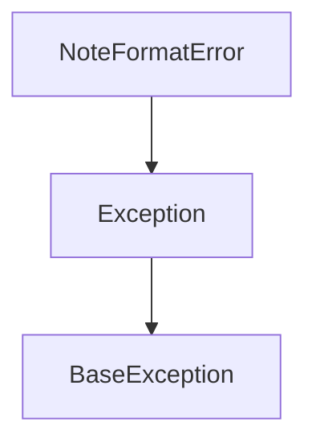
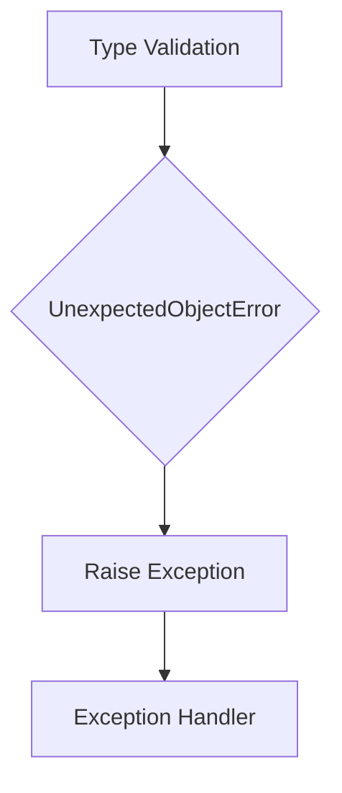

# `mt_exceptions.py`

## `mingus.containers.mt_exceptions.NoteFormatError` · *class*

## Summary:
Represents an exception raised when a note format is invalid or improperly formatted.

## Description:
The NoteFormatError exception is used to signal that a note object has been provided with incorrect formatting or structure. This exception is typically raised when working with musical notes in the mingus framework, particularly when the note representation doesn't conform to expected standards or conventions.

This class serves as a distinct abstraction to differentiate note format errors from other types of exceptions that might occur in the musical data processing pipeline, providing more specific error handling capabilities for note-related operations.

## State:
The class inherits all state from the base Exception class and contains no additional attributes or properties.

## Lifecycle:
Creation: Instances are created by raising the exception directly with `raise NoteFormatError("message")` or by calling the constructor with an optional error message.

Usage: The exception is typically raised during note validation or parsing operations when an invalid note format is detected.

Destruction: As with all Python exceptions, cleanup is handled automatically by the Python runtime when the exception propagates out of scope.

## Method Map:


## Raises:
The exception can be raised during note processing operations when:
- A note string is malformed (e.g., "C#b" instead of "Cb" or "C#")
- A note object lacks required components for proper representation
- Note duration or pitch information is incorrectly formatted
- Invalid note names or intervals are encountered

## Example:
```python
try:
    # Some operation that validates note format
    validate_note_format("invalid_note")
except NoteFormatError as e:
    print(f"Note format error occurred: {e}")
    # Handle the invalid note format appropriately
```

## `mingus.containers.mt_exceptions.UnexpectedObjectError` · *class*

## Summary:
Represents an exception raised when an unexpected object type is encountered during processing.

## Description:
This custom exception is designed to signal that an operation received an object of an unexpected or unsupported type. It serves as a specialized error handling mechanism for type validation failures in the mingus library's container processing system.

## State:
The class inherits all behavior from Python's built-in Exception class and maintains no additional instance attributes.

## Lifecycle:
- Creation: Instantiated like any standard Exception with optional message argument
- Usage: Raised during type checking operations when an object doesn't match expected types
- Destruction: Handled by standard Python exception mechanisms

## Method Map:


## Raises:
This exception is raised when type validation fails in container processing operations.

## Example:
```python
# Raising the exception
raise UnexpectedObjectError("Expected Note object, got Pitch object")

# Catching the exception
try:
    process_object(some_invalid_object)
except UnexpectedObjectError as e:
    print(f"Type error occurred: {e}")
```

## `mingus.containers.mt_exceptions.MeterFormatError` · *class*

## Summary:
Custom exception class representing formatting errors in meter specifications.

## Description:
MeterFormatError is a specialized exception type designed to indicate when a meter specification fails to meet required formatting conventions. This exception is raised when meter data (such as time signatures or rhythmic patterns) are malformed or improperly structured. The class serves as a distinct error type to allow targeted exception handling for meter-related validation failures.

## State:
The class inherits all state from Python's built-in Exception class and maintains no additional instance attributes. As a minimal exception subclass, it follows the standard Exception interface.

## Lifecycle:
Creation: Instances are created by calling the class constructor with optional error message arguments, e.g., MeterFormatError("Invalid meter format"). 
Usage: Typically raised during meter validation operations and caught by exception handlers in calling code.
Destruction: No special cleanup is required as the class inherits standard Python exception behavior.

## Method Map:
```mermaid
graph TD
    A[MeterFormatError()] --> B[Exception.__init__]
    A --> C[Exception.__str__]
    A --> D[Exception.__repr__]
```

## Raises:
This class itself does not raise any exceptions. It is designed to be raised by other code when meter format validation fails.

## Example:
```python
try:
    # Some operation that validates meter format
    validate_meter_format("4/4")
except MeterFormatError as e:
    print(f"Meter format error occurred: {e}")
```

## `mingus.containers.mt_exceptions.InstrumentRangeError` · *class*

## Summary:
Custom exception class representing errors related to instrument range violations in musical contexts.

## Description:
The InstrumentRangeError class is a specialized exception that should be raised when operations involving musical instruments exceed valid range constraints. This exception serves as a distinct error type to differentiate range-related issues from other potential exceptions in the musical container system. It is typically instantiated by validation functions or methods that check if musical notes, pitches, or ranges fall within acceptable limits for a given instrument.

## State:
This class has no instance attributes beyond those inherited from the base Exception class. It maintains the standard Exception behavior with message storage and traceback information.

## Lifecycle:
Creation: Instances are created by calling the class constructor with an optional error message string. Usage: The exception is raised during program execution when range validation fails. The exception propagates up the call stack until caught by appropriate exception handlers. Destruction: No special cleanup is required as Python handles exception object lifetime automatically.

## Method Map:
```mermaid
graph TD
    A[InstrumentRangeError()] --> B[Exception.__init__()]
    B --> C[Raise Exception]
```

## Raises:
This class itself does not raise any exceptions during instantiation. It inherits standard Exception behavior for construction and propagation.

## Example:
```python
# Raising the exception
try:
    # Some operation that exceeds instrument range
    if note_value > max_range:
        raise InstrumentRangeError("Note value exceeds maximum allowed range")
except InstrumentRangeError as e:
    print(f"Range violation occurred: {e}")
```

