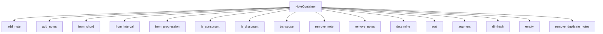

# `note_container.py`

## `mingus.containers.note_container.NoteContainer` · *class*

## Summary:
A container class for managing collections of Note objects with operations for adding, removing, transposing, and analyzing musical properties.

## Description:
NoteContainer serves as a collection manager for musical notes, providing methods to build, modify, and analyze sets of notes. It maintains notes in sorted order and provides musical analysis capabilities such as determining consonance/dissonance and chord types. The class supports various ways to construct note collections including from chords, intervals, and progressions.

## State:
- `notes`: list of Note objects managed by this container
  - Type: list[Note]
  - Valid range: Contains Note objects with valid musical properties
  - Invariant: Notes are maintained in sorted order after additions

## Lifecycle:
- Creation: Instantiate with optional initial notes via `__init__()` or use factory methods like `from_chord()`
- Usage: Add/remove notes with `add_note()`, `remove_note()`, or arithmetic operators (`+`, `-`)
- Destruction: No explicit cleanup required; relies on Python garbage collection

## Method Map:


## Raises:
- `UnexpectedObjectError`: When attempting to add an object that is not a Note instance

## Example:
```python
# Create container with initial notes
container = NoteContainer(['C', 'E', 'G'])

# Add notes using various methods
container.add_note('B')
container.from_chord('Am')  # Adds A minor chord

# Check musical properties
print(container.is_consonant())  # True for major/minor chords
print(container.determine())     # Determines chord type

# Transpose notes
container.transpose('P5')        # Transpose up a perfect fifth

# Remove notes
container.remove_note('C')
```

### `mingus.containers.note_container.NoteContainer.__init__` · *method*

## Summary:
Initializes a NoteContainer object with optional notes, clearing any existing notes and populating with the provided notes.

## Description:
The `__init__` method serves as the constructor for the NoteContainer class. It prepares the container for use by first clearing any existing notes and then adding the provided notes. This method ensures proper initialization regardless of whether notes are provided during instantiation. The method handles various input types for the notes parameter, including None, lists of notes, single notes, and note strings.

## Args:
    notes (list, Note, str, or None): A collection of notes to initialize the container with. Can be:
    - None: Creates an empty container
    - A list of notes, note strings, or mixed note representations
    - A single Note object
    - A note string representation

## Returns:
    None: This method does not return a value.

## Raises:
    UnexpectedObjectError: Raised by `add_notes()` when an object that is not a Note is passed to the container.

## State Changes:
    Attributes READ: None
    Attributes WRITTEN: 
    - self.notes: Set to an empty list via `empty()` call, then populated with provided notes via `add_notes()` call

## Constraints:
    Preconditions: None
    Postconditions: 
    - The container's notes attribute is initialized to an empty list
    - The container's notes attribute contains the provided notes after processing
    - The notes are sorted in ascending order due to the behavior of `add_note()`

## Side Effects:
    None: This method does not perform any I/O operations or mutate external objects.

### `mingus.containers.note_container.NoteContainer.empty` · *method*

## Summary:
Clears all notes from the note container by resetting the notes list to an empty list.

## Description:
The `empty` method removes all notes currently stored in the note container by setting the internal `notes` attribute to an empty list. This method is typically called before populating the container with new notes to ensure a clean slate. It is used internally by various factory methods such as `from_chord_shorthand`, `from_interval_shorthand`, and `from_progression_shorthand` to reset the container before building new note sequences.

## Args:
    None

## Returns:
    None

## Raises:
    None

## State Changes:
    Attributes READ: None
    Attributes WRITTEN: self.notes

## Constraints:
    Preconditions: None
    Postconditions: The `self.notes` attribute will be an empty list

## Side Effects:
    None

### `mingus.containers.note_container.NoteContainer.add_note` · *method*

## Summary:
Adds a note to the note container, ensuring uniqueness and maintaining sorted order.

## Description:
This method allows adding notes to a NoteContainer instance. It accepts either string representations of notes (like "C", "D#") or Note objects. When a string is provided, it automatically determines the appropriate octave based on existing notes in the container. The method ensures that duplicate notes are not added and maintains the notes in sorted order.

## Args:
    note (str or Note): Either a string representation of a note (e.g., "C", "D#") or a Note object to add to the container.
    octave (int, optional): The octave number to use when creating a Note from a string. If None, automatic octave determination is used.
    dynamics (dict, optional): Dynamics information for the note. Defaults to an empty dictionary.

## Returns:
    list[Note]: The updated list of notes in the container, sorted in ascending order.

## Raises:
    UnexpectedObjectError: When the note parameter is neither a string nor a Note object with a 'name' attribute.

## State Changes:
    Attributes READ: self.notes
    Attributes WRITTEN: self.notes

## Constraints:
    Preconditions: 
    - The note parameter must be either a string or a Note object with a 'name' attribute
    - If octave is provided, it must be a valid integer
    - If dynamics is provided, it must be a dictionary
    
    Postconditions:
    - The note is added to self.notes if it's not already present
    - The self.notes list remains sorted in ascending order
    - The returned list contains all notes in the container in sorted order

## Side Effects:
    None

### `mingus.containers.note_container.NoteContainer.add_notes` · *method*

## Summary:
Adds multiple notes to the NoteContainer, supporting various input formats including Note objects, note names, and collections of notes.

## Description:
This method provides a flexible interface for adding notes to a NoteContainer. It accepts various input types and processes them appropriately, delegating individual note addition to the `add_note` method. The method is designed to handle complex note specifications while maintaining the container's sorted order.

## Args:
    notes: Can be one of several types:
        - An object with a "notes" attribute (e.g., another NoteContainer)
        - An object with a "name" attribute (e.g., a Note object)
        - A string representing a note name
        - An iterable of notes or note specifications

## Returns:
    list[Note]: The updated list of notes in the container, sorted in ascending order

## Raises:
    UnexpectedObjectError: When a note object doesn't have a "name" attribute

## State Changes:
    Attributes READ: self.notes
    Attributes WRITTEN: self.notes

## Constraints:
    Preconditions:
        - The container must be properly initialized
        - Notes must be valid note representations
    Postconditions:
        - All notes in the input are added to the container
        - The container's notes list remains sorted
        - Duplicate notes are not added

## Side Effects:
    None

### `mingus.containers.note_container.NoteContainer.from_chord` · *method*

## Summary:
Initializes the note container with notes from a chord shorthand representation.

## Description:
Converts a chord shorthand string (like "C", "Gm", "Am7") into individual notes and populates the note container with those notes. This method clears any existing notes in the container before adding the new ones.

## Args:
    shorthand (str): A string representing a chord in shorthand notation. Examples include "C", "Gm", "Am7", "F#dim", etc.

## Returns:
    NoteContainer: The same NoteContainer instance, allowing for method chaining.

## Raises:
    NoteFormatError: If the shorthand contains an unrecognized note.
    FormatError: If the shorthand format is not recognized.

## State Changes:
    Attributes READ: None
    Attributes WRITTEN: self.notes (clears and repopulates with new notes)

## Constraints:
    Preconditions: The shorthand parameter must be a valid chord shorthand string.
    Postconditions: The note container will contain exactly the notes represented by the chord shorthand.

## Side Effects:
    Mutates the internal notes list of the NoteContainer instance.

### `mingus.containers.note_container.NoteContainer.from_chord_shorthand` · *method*

## Summary:
Initializes the note container with notes derived from a chord shorthand notation.

## Description:
Converts a chord shorthand string (like "Cmaj", "Am", "G7") into individual note representations and populates the note container with those notes. This method clears any existing notes in the container before adding the new ones. It serves as a convenient way to build a note container from standard chord notation.

## Args:
    shorthand (str): A chord shorthand notation string representing the desired chord (e.g., "Cmaj", "Am", "G7").

## Returns:
    NoteContainer: Returns self to enable method chaining.

## Raises:
    NoteFormatError: When the shorthand contains an unrecognized note or invalid format.
    FormatError: When the shorthand notation is not recognized or supported.

## State Changes:
    Attributes READ: None
    Attributes WRITTEN: self.notes

## Constraints:
    Preconditions: The shorthand parameter must be a valid chord shorthand string.
    Postconditions: The note container will contain exactly the notes represented by the shorthand chord.

## Side Effects:
    None

### `mingus.containers.note_container.NoteContainer.from_interval` · *method*

## Summary:
Creates a note container containing two notes separated by the specified interval.

## Description:
This method constructs a note container with a starting note and a second note that is transposed by the given interval. It serves as a convenient interface for building note containers from interval relationships. The method delegates to `from_interval_shorthand` which handles the actual creation logic.

## Args:
    startnote (Note or str): The starting note, either as a Note object or note name string.
    shorthand (str): The interval shorthand (e.g., 'M3', 'm7', 'P5') defining the interval size and quality.
    up (bool, optional): Direction of transposition. Defaults to True (upward).

## Returns:
    NoteContainer: The current instance with two notes added - the start note and the interval-transposed note.

## Raises:
    UnexpectedObjectError: When startnote is not a valid note representation.

## State Changes:
    Attributes READ: None
    Attributes WRITTEN: self.notes (cleared and populated with two notes)

## Constraints:
    Preconditions: 
    - startnote must be a valid note representation (Note object or string)
    - shorthand must be a valid interval shorthand string
    - The NoteContainer must be properly initialized
    
    Postconditions:
    - The container will contain exactly two notes
    - The notes will be sorted in ascending order
    - The second note will be transposed from the first by the specified interval

## Side Effects:
    None

### `mingus.containers.note_container.NoteContainer.from_interval_shorthand` · *method*

## Summary:
Creates a note container with two notes: a starting note and another note derived by transposing the starting note by the specified interval shorthand.

## Description:
This method populates the note container with exactly two notes - the original starting note and a second note created by transposing the starting note according to the provided interval shorthand. It's designed to easily construct intervals from shorthand notation (like "M3" for major third) while maintaining proper note properties such as octave and dynamics.

## Args:
    startnote (Note or str): The starting note, either as a Note object or string representation (e.g., "C", "D#4")
    shorthand (str): Interval shorthand notation (e.g., "M3", "m7", "P5")
    up (bool): Direction of transposition. True for upward transposition, False for downward. Defaults to True.

## Returns:
    NoteContainer: Returns self to enable method chaining.

## Raises:
    None explicitly raised, but may propagate exceptions from underlying methods like Note constructor or transpose.

## State Changes:
    Attributes READ: None
    Attributes WRITTEN: self.notes (replaced with new list containing two notes)

## Constraints:
    Preconditions: 
    - startnote must be a valid Note object or string representation of a note
    - shorthand must be a valid interval shorthand notation recognized by the intervals module
    - If startnote is a string, it must represent a valid note name
    
    Postconditions:
    - self.notes contains exactly two notes: the original startnote and the transposed note
    - Both notes maintain their original properties (octave, dynamics) except for the transposed note's pitch

## Side Effects:
    None

### `mingus.containers.note_container.NoteContainer.from_progression` · *method*

## Summary:
Initializes the note container with notes derived from a musical progression shorthand string.

## Description:
Converts a musical progression shorthand notation into chord notes and populates the note container with the first chord's notes. This method serves as a convenient interface for building note containers from progression strings, delegating the actual conversion to the internal `from_progression_shorthand` method.

## Args:
    shorthand (str): Musical progression shorthand notation (e.g., "I-V-vi-IV" for C major progression)
    key (str, optional): Musical key for the progression. Defaults to "C".

## Returns:
    NoteContainer or bool: Returns the NoteContainer instance if successful, or False if no chords could be generated from the shorthand.

## Raises:
    None explicitly raised, but may propagate exceptions from underlying methods like `from_progression_shorthand`.

## State Changes:
    Attributes READ: None
    Attributes WRITTEN: self.notes (cleared and repopulated with new notes)

## Constraints:
    Preconditions: The shorthand string must be a valid progression notation that can be parsed by the underlying progression system.
    Postconditions: The note container will contain notes from the first chord of the progression, or remain empty if no chords are generated.

## Side Effects:
    Mutates the internal state of the NoteContainer by clearing existing notes and adding new ones.

### `mingus.containers.note_container.NoteContainer.from_progression_shorthand` · *method*

## Summary:
Converts a musical progression shorthand string into chord notes and populates the note container with the first chord's notes.

## Description:
This method transforms a progression shorthand (like "I-V-vi-IV" in Roman numeral notation) into actual musical chords and adds the notes from the first chord to the container. It's designed to support musical progression notation commonly used in music theory and composition applications.

## Args:
    shorthand (str): A string representing a musical progression using Roman numeral notation (e.g., "I-V-vi-IV").
    key (str): The musical key for the progression, defaults to "C".

## Returns:
    NoteContainer or bool: Returns self (the NoteContainer instance) if successful, or False if the progression cannot be converted to chords.

## Raises:
    None explicitly raised, though underlying functions may raise exceptions.

## State Changes:
    Attributes READ: None
    Attributes WRITTEN: self.notes (modified via self.empty() and self.add_notes())

## Constraints:
    Preconditions: The shorthand string must be a valid progression notation that can be parsed by the progressions module.
    Postconditions: The note container will contain the notes from the first chord of the progression, or remain empty if conversion fails.

## Side Effects:
    Mutates the internal notes list of the NoteContainer instance.

### `mingus.containers.note_container.NoteContainer._consonance_test` · *method*

## Summary:
Tests whether all pairs of notes in the container satisfy a given consonance condition.

## Description:
This private method performs pairwise comparisons of all notes in the container using a provided test function. It evaluates whether every combination of two notes meets a specific consonance criterion defined by the test function. The method implements a systematic approach to check all note pairs by progressively removing the first note and comparing it with the remaining notes.

The method is designed to be reused by public methods like `is_consonant`, `is_perfect_consonant`, and `is_imperfect_consonant` that apply specific consonance tests to the notes in the container.

## Args:
    testfunc (callable): A function that takes note names as arguments and returns a boolean indicating if they meet the consonance condition
    param (any, optional): Additional parameter to pass to the test function. Defaults to None

## Returns:
    bool: True if all pairs of notes satisfy the test condition, False otherwise

## Raises:
    None explicitly raised

## State Changes:
    Attributes READ: self.notes
    Attributes WRITTEN: None

## Constraints:
    Preconditions: 
    - The container must have notes (self.notes should be iterable)
    - The testfunc must accept note names as arguments and return a boolean
    - When param is provided, testfunc must accept three arguments (note1, note2, param)
    
    Postconditions:
    - The method does not modify the state of the NoteContainer object
    - Returns a boolean value indicating the result of the consonance test

## Side Effects:
    None

### `mingus.containers.note_container.NoteContainer.is_consonant` · *method*

## Summary:
Determines whether all note pairs in the container form consonant intervals according to musical theory.

## Description:
This method evaluates whether every pair of notes in the NoteContainer forms a consonant interval. It leverages the container's internal `_consonance_test` method to systematically check all combinations of notes against the consonance criteria defined in `intervals.is_consonant`. This method is part of a broader consonance testing framework that includes perfect consonance, imperfect consonance, and dissonance checking capabilities.

## Args:
    include_fourths (bool): When True (default), includes perfect fourths as consonant intervals. When False, excludes them from the consonance calculation.

## Returns:
    bool: True if all note pairs in the container form consonant intervals, False otherwise.

## Raises:
    None explicitly raised by this method.

## State Changes:
    Attributes READ: self.notes
    Attributes WRITTEN: None

## Constraints:
    Preconditions: The NoteContainer must contain at least one note for meaningful evaluation.
    Postconditions: The method returns a boolean value indicating consonance status without modifying the container's state.

## Side Effects:
    None - this method performs no I/O operations or external service calls.

### `mingus.containers.note_container.NoteContainer.is_perfect_consonant` · *method*

## Summary:
Determines whether all note pairs in the container form perfect consonances according to music theory.

## Description:
This method evaluates whether every pair of notes in the NoteContainer forms a perfect consonance, which includes unison (0 semitones), perfect fifth (7 semitones), and optionally perfect fourth (5 semitones). The method uses the internal `_consonance_test` framework to systematically check all combinations of notes.

## Args:
    include_fourths (bool): When True (default), includes perfect fourths as perfect consonances. When False, only considers unison and perfect fifth as perfect consonances.

## Returns:
    bool: True if all note pairs form perfect consonances, False otherwise.

## Raises:
    None explicitly raised by this method.

## State Changes:
    Attributes READ: self.notes
    Attributes WRITTEN: None

## Constraints:
    Preconditions: The NoteContainer must contain at least one note for meaningful evaluation.
    Postconditions: Returns a boolean value indicating the perfect consonance status of all note pairs.

## Side Effects:
    None

### `mingus.containers.note_container.NoteContainer.is_imperfect_consonant` · *method*

## Summary:
Tests whether all note pairs in the container form imperfect consonant intervals (thirds and sixths).

## Description:
Determines if every pair of notes in the NoteContainer forms an imperfect consonant interval, which includes major and minor thirds and sixths. This method is part of a suite of consonance testing methods that help analyze harmonic properties of musical note collections. An imperfect consonance occurs when the interval between two notes is either a major third (4 semitones) or minor third (3 semitones), or a major sixth (9 semitones) or minor sixth (8 semitones).

## Args:
    None

## Returns:
    bool: True if all note pairs form imperfect consonants, False otherwise.

## Raises:
    None

## State Changes:
    Attributes READ: self.notes
    Attributes WRITTEN: None

## Constraints:
    Preconditions: The NoteContainer must contain at least two notes for meaningful testing.
    Postconditions: Returns a boolean value indicating the consonance property of all note pairs.

## Side Effects:
    None

### `mingus.containers.note_container.NoteContainer.is_dissonant` · *method*

## Summary:
Determines whether the note container contains dissonant intervals between its notes, optionally including perfect fourths in the consonance calculation.

## Description:
This method evaluates whether the collection of notes in the container forms dissonant intervals. It operates by negating the result of the `is_consonant` method, providing a convenient way to check for dissonance. The method allows controlling whether perfect fourths are considered consonant during the evaluation.

## Args:
    include_fourths (bool): When True, perfect fourths are treated as consonant intervals. When False (default), perfect fourths are treated as dissonant intervals.

## Returns:
    bool: True if the container contains dissonant intervals according to the specified criteria, False otherwise.

## Raises:
    None explicitly raised.

## State Changes:
    Attributes READ: self.notes
    Attributes WRITTEN: None

## Constraints:
    Preconditions: The object must be a valid NoteContainer instance with notes properly initialized.
    Postconditions: The method returns a boolean value indicating dissonance status without modifying the object's state.

## Side Effects:
    None.

### `mingus.containers.note_container.NoteContainer.remove_note` · *method*

## Summary:
Removes notes from the container that match the specified note name or Note object, with special handling for octave matching when removing by note name.

## Description:
This method filters the notes stored in the container, removing any that match the provided note specification. When the note parameter is a string (representing a note name), it removes all notes with matching note names. However, if an octave is specified (other than the default -1), notes with matching names but different octaves will be preserved. When the note parameter is a Note object, it removes exact matches. This method is part of the NoteContainer's note management functionality and is typically used during musical composition or analysis workflows where specific notes need to be removed from a collection.

## Args:
    note (str or Note): The note to remove, either as a note name string (e.g., "C", "D#") or as a Note object
    octave (int): Optional octave number to match when note is a string. Defaults to -1 (no octave filtering)

## Returns:
    list[Note]: A new list containing the remaining notes after removal

## Raises:
    None explicitly raised

## State Changes:
    Attributes READ: self.notes
    Attributes WRITTEN: self.notes

## Constraints:
    Preconditions: The container must have a notes attribute that is iterable
    Postconditions: self.notes will contain only notes that don't match the removal criteria

## Side Effects:
    None

### `mingus.containers.note_container.NoteContainer.remove_notes` · *method*

*No documentation generated.*

### `mingus.containers.note_container.NoteContainer.remove_duplicate_notes` · *method*

## Summary:
Removes duplicate notes from the note container and returns the deduplicated list.

## Description:
This method eliminates duplicate notes from the container's note collection by comparing notes based on their pitch (name and octave). It maintains the order of first occurrence of each unique note while modifying the container's internal note list in place.

## Args:
    None

## Returns:
    list[Note]: A list containing the unique notes from the container, preserving the order of first appearance.

## Raises:
    None

## State Changes:
    Attributes READ: self.notes
    Attributes WRITTEN: self.notes

## Constraints:
    Preconditions: The container must have a notes attribute that is iterable.
    Postconditions: The self.notes list will contain no duplicate notes, and will be sorted according to the Note comparison logic.

## Side Effects:
    None

### `mingus.containers.note_container.NoteContainer.sort` · *method*

## Summary:
Sorts the notes in the container in ascending order of pitch.

## Description:
This method arranges the Note objects stored in the container's notes attribute in ascending order based on their musical pitch. The sorting is performed in-place, modifying the internal notes list directly. This method is typically called after adding notes to ensure they are properly ordered.

## Args:
    None

## Returns:
    None

## Raises:
    None

## State Changes:
    Attributes READ: self.notes
    Attributes WRITTEN: self.notes

## Constraints:
    Preconditions: The notes attribute must be a list containing Note objects
    Postconditions: The notes list will be sorted in ascending order of pitch

## Side Effects:
    None

### `mingus.containers.note_container.NoteContainer.augment` · *method*

*No documentation generated.*

### `mingus.containers.note_container.NoteContainer.diminish` · *method*

## Summary:
Applies the diminishment operation to all notes in the container, lowering their pitch by a semitone.

## Description:
This method modifies each note in the container by applying the diminishment operation, which lowers the pitch of each note by one semitone. This is commonly used in music theory to create diminished chords or to reduce the tension in a musical passage.

## Args:
    None

## Returns:
    None

## Raises:
    None

## State Changes:
    Attributes READ: self.notes
    Attributes WRITTEN: self.notes (through modification of individual note objects)

## Constraints:
    Preconditions: The container must contain valid Note objects in self.notes
    Postconditions: All notes in self.notes will have been modified by their respective diminish() operations

## Side Effects:
    Mutates the individual Note objects contained within self.notes

### `mingus.containers.note_container.NoteContainer.determine` · *method*

## Summary:
Determines the chord type and quality from the notes contained in this container.

## Description:
This method analyzes the collection of notes stored in the NoteContainer and identifies what type of chord they form. It delegates the actual determination logic to the chords.determine function from the mingus.core.chords module. This method serves as a convenient interface to get chord information directly from a NoteContainer instance.

## Args:
    shorthand (bool): When True, returns chord information in shorthand notation. Defaults to False.

## Returns:
    list: A list containing information about the determined chord, typically including chord name and quality. The exact format depends on the shorthand parameter and the chord type.

## Raises:
    None explicitly raised by this method. Exceptions may be raised by the underlying chords.determine function.

## State Changes:
    Attributes READ: self.notes (through get_note_names())
    Attributes WRITTEN: None

## Constraints:
    Preconditions: The NoteContainer must contain at least one note.
    Postconditions: Returns a list describing the chord determined from the notes in the container.

## Side Effects:
    None

### `mingus.containers.note_container.NoteContainer.transpose` · *method*

*No documentation generated.*

### `mingus.containers.note_container.NoteContainer.get_note_names` · *method*

## Summary:
Returns a list of unique note names contained in this NoteContainer, preserving order of first appearance.

## Description:
Extracts the names of all notes in the container while ensuring no duplicate names are included in the returned list. This method is primarily used internally by other methods like `determine()` to analyze the musical content of the container.

## Args:
    None

## Returns:
    list[str]: A list of unique note name strings in the order of their first occurrence in the container's notes list.

## Raises:
    None

## State Changes:
    Attributes READ: self.notes
    Attributes WRITTEN: None

## Constraints:
    Preconditions: The NoteContainer must have a valid notes attribute that is iterable
    Postconditions: The returned list contains only unique note names and maintains the order of first appearance

## Side Effects:
    None

### `mingus.containers.note_container.NoteContainer.__repr__` · *method*

## Summary:
Returns a string representation of the NoteContainer's notes list, showing all contained notes in a readable format.

## Description:
This magic method provides the official string representation of a NoteContainer object. It delegates to Python's built-in string conversion of the internal `notes` list, which in turn calls each Note object's `__repr__` method to display individual notes in the format "'note-octave'".

## Args:
    None

## Returns:
    str: A string representation of the notes list, showing all contained notes in the format "[Note('C-4'), Note('E-4'), Note('G-4')]" or similar depending on the notes contained.

## Raises:
    None

## State Changes:
    Attributes READ: self.notes
    Attributes WRITTEN: None

## Constraints:
    Preconditions: The object must have a valid `notes` attribute that is iterable
    Postconditions: The returned string accurately represents the current state of notes in the container

## Side Effects:
    None

### `mingus.containers.note_container.NoteContainer.__getitem__` · *method*

*No documentation generated.*

### `mingus.containers.note_container.NoteContainer.__setitem__` · *method*

## Summary:
Enables bracket notation assignment for NoteContainer items, converting string values to Note objects.

## Description:
Implements Python's `__setitem__` magic method for the NoteContainer class. This allows using bracket notation (e.g., `container[index] = value`) to set notes in the container. String values are automatically converted to Note objects, providing a convenient interface for note manipulation.

## Args:
    item (int): Index position where the note should be stored
    value (str or Note): Note to store, either as string or Note object

## Returns:
    list[Note]: Updated notes list after assignment

## Raises:
    None explicitly raised, but Note constructor may raise exceptions for invalid inputs

## State Changes:
    Attributes READ: self.notes
    Attributes WRITTEN: self.notes

## Constraints:
    Preconditions: 
    - item must be a valid list index
    - value must be a string or Note object
    - self.notes must be initialized as a list
    
    Postconditions:
    - Value at specified index is replaced with provided note
    - String values are converted to Note objects before storage

## Side Effects:
    None

### `mingus.containers.note_container.NoteContainer.__add__` · *method*

## Summary:
Adds notes to the container and returns the container instance, enabling method chaining with the `+` operator.

## Description:
This special method implements the `+` operator for NoteContainer instances, allowing users to add notes to a container using the addition operator. It delegates to the `add_notes` method to handle various input formats and returns the container itself to support fluent interface patterns.

## Args:
    notes: Can be a single note, list of notes, NoteContainer, or string representation of notes to be added to the container

## Returns:
    NoteContainer: The same container instance with the new notes added, enabling method chaining

## Raises:
    UnexpectedObjectError: When attempting to add an object that is not a valid note representation

## State Changes:
    Attributes READ: None
    Attributes WRITTEN: self.notes (modified by add_notes call)

## Constraints:
    Preconditions: The notes parameter must be compatible with the add_notes method's expectations
    Postconditions: The container will contain all previously existing notes plus the newly added notes

## Side Effects:
    None

### `mingus.containers.note_container.NoteContainer.__sub__` · *method*

## Summary:
Removes specified notes from the container and returns the modified container.

## Description:
Implements the subtraction operator (-) for NoteContainer objects, allowing users to remove notes from a container using the `-` syntax. This method provides an intuitive way to subtract notes from a container, following Python's magic method conventions.

## Args:
    notes: Can be a single note (string or Note object), or a collection of notes to remove from the container.

## Returns:
    NoteContainer: Returns self to enable method chaining.

## Raises:
    None explicitly raised, but underlying remove_notes method may raise UnexpectedObjectError if invalid note objects are provided.

## State Changes:
    Attributes READ: self.notes
    Attributes WRITTEN: self.notes (modified by remove_notes)

## Constraints:
    Preconditions: The notes parameter must be compatible with the remove_notes method's expectations (strings, Note objects, or collections of these).
    Postconditions: The container will have the specified notes removed, and the same container instance is returned.

## Side Effects:
    Mutates the internal notes list of the container by removing specified notes.

### `mingus.containers.note_container.NoteContainer.__len__` · *method*

## Summary:
Returns the number of notes contained in this NoteContainer instance.

## Description:
This method implements Python's magic `__len__` protocol, allowing the built-in `len()` function to be used directly on NoteContainer instances. It provides a convenient way to determine how many notes are currently stored in the container.

## Args:
    None

## Returns:
    int: The number of Note objects currently stored in the `self.notes` list.

## Raises:
    None

## State Changes:
    Attributes READ: self.notes
    Attributes WRITTEN: None

## Constraints:
    Preconditions: The `self.notes` attribute must be a list-like object that supports the `len()` function.
    Postconditions: The method returns an integer representing the count of notes in the container.

## Side Effects:
    None

### `mingus.containers.note_container.NoteContainer.__eq__` · *method*

## Summary:
Determines if all notes in this container exist in another container.

## Description:
Implements the equality comparison operator (`==`) for NoteContainer objects. This method returns True if and only if every note in the current container exists in the other container. It performs a subset containment check where self ⊆ other.

This method is automatically invoked during equality comparisons such as `container1 == container2`. The implementation iterates through all notes in self and checks membership in other using the `in` operator. If any note from self is not found in other, the method immediately returns False. Otherwise, it returns True.

## Args:
    other (NoteContainer): Another NoteContainer instance to compare against

## Returns:
    bool: True if all notes in self are present in other, False otherwise

## Raises:
    None explicitly raised

## State Changes:
    Attributes READ: self.notes
    Attributes WRITTEN: None

## Constraints:
    Preconditions: 
    - other must support membership testing with the `in` operator (typically another NoteContainer)
    - self must be iterable (which it is via __getitem__ and __len__)

    Postconditions:
    - Returns boolean value indicating subset relationship
    - Does not modify either container's state

## Side Effects:
    None

