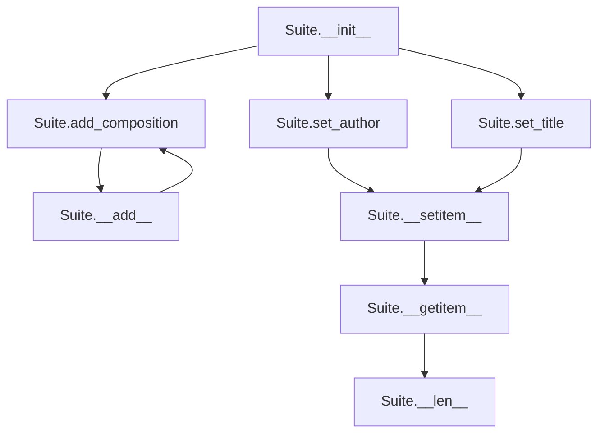

# `suite.py`

## `mingus.containers.suite.Suite` · *class*

## Summary:
A container class for organizing musical compositions into a suite with metadata.

## Description:
The Suite class serves as a container for grouping musical compositions together while maintaining metadata about the collection. It allows users to build a suite of compositions with identifying information such as title, subtitle, author, and email. The class provides methods for adding compositions, setting metadata, and accessing compositions through standard container operations.

This class acts as a distinct abstraction for organizing musical works, enforcing that only valid Composition objects can be added to the suite through type checking.

## State:
- title (str): The main title of the suite, defaults to "Untitled"
- subtitle (str): The subtitle of the suite, defaults to empty string
- author (str): The author of the suite, defaults to empty string
- email (str): The author's email address, defaults to empty string
- description (str): A description of the suite, defaults to empty string
- compositions (list): A list of Composition objects contained in the suite

The __init__ method takes no parameters and initializes all attributes with their default values.

## Lifecycle:
Creation: Instantiate with Suite() to create an empty suite with default metadata.
Usage: Add compositions using add_composition() or the + operator (via __add__), set metadata using set_title() and set_author(), access compositions via indexing (using __getitem__) and assignment (using __setitem__).
Destruction: No explicit cleanup required; Python's garbage collector handles memory management.

## Method Map:


## Raises:
- UnexpectedObjectError: Raised when attempting to add a non-Composition object using add_composition() or __setitem__() methods. Triggered when the object does not have a "tracks" attribute.

## Example:
```python
# Create a new suite
suite = Suite()

# Set suite metadata
suite.set_title("My Classical Collection", "A selection of classical pieces")
suite.set_author("John Doe", "john@example.com")

# Add compositions (assuming Composition objects exist)
composition1 = Composition()
composition2 = Composition()
suite.add_composition(composition1)
suite += composition2  # Using the __add__ operator

# Access compositions
print(len(suite))  # Number of compositions
first_comp = suite[0]  # Get first composition
suite[1] = composition1  # Replace second composition
```

### `mingus.containers.suite.Suite.__init__` · *method*

## Summary:
Initializes a Suite object with default attribute values for musical composition metadata and an empty compositions list.

## Description:
The Suite class represents a collection of musical compositions with metadata such as title, author, and description. This method initializes all instance attributes to their default values, ensuring the object is in a valid state upon creation. It serves as the constructor for the Suite class and prepares the object for storing musical compositions.

## Args:
    None

## Returns:
    None

## Raises:
    None

## State Changes:
    Attributes READ: None
    Attributes WRITTEN: 
    - self.title: Set to "Untitled"
    - self.subtitle: Set to ""
    - self.author: Set to ""
    - self.email: Set to ""
    - self.description: Set to ""
    - self.compositions: Set to []

## Constraints:
    Preconditions: None
    Postconditions: All instance attributes are initialized to their default values

## Side Effects:
    None

### `mingus.containers.suite.Suite.add_composition` · *method*

## Summary:
Adds a Composition object to the suite's collection of compositions.

## Description:
This method validates that the provided object is a valid Composition instance by checking for the presence of a "tracks" attribute, then appends it to the internal compositions list. This method enables fluent interface patterns by returning self for method chaining.

## Args:
    composition: A composition object to be added to the suite. Must have a "tracks" attribute to be considered a valid Composition.

## Returns:
    Suite: Returns self to enable method chaining.

## Raises:
    UnexpectedObjectError: When the provided object does not have a "tracks" attribute, indicating it is not a valid Composition object.

## State Changes:
    Attributes READ: None
    Attributes WRITTEN: self.compositions

## Constraints:
    Preconditions: The composition parameter must have a "tracks" attribute.
    Postconditions: The composition is appended to self.compositions list.

## Side Effects:
    None

### `mingus.containers.suite.Suite.set_author` · *method*

## Summary:
Sets the author name and email for the suite.

## Description:
Configures the author information for a Suite instance by setting the author name and optional email address. This method provides a clean interface for updating author metadata without direct attribute manipulation.

## Args:
    author (str): The name of the author to set.
    email (str): Optional email address of the author. Defaults to empty string.

## Returns:
    None: This method does not return any value.

## Raises:
    None: This method does not explicitly raise any exceptions.

## State Changes:
    Attributes READ: None
    Attributes WRITTEN: self.author, self.email

## Constraints:
    Preconditions: The Suite instance must be properly initialized.
    Postconditions: The self.author and self.email attributes will be updated to the provided values.

## Side Effects:
    None: This method only modifies the local object's attributes and has no external side effects.

### `mingus.containers.suite.Suite.set_title` · *method*

## Summary:
Sets the title and subtitle of the suite.

## Description:
Configures the main title and optional subtitle for the suite. This method provides a clean interface for updating the suite's identification metadata.

## Args:
    title (str): The primary title for the suite.
    subtitle (str, optional): The secondary subtitle for the suite. Defaults to empty string.

## Returns:
    None: This method does not return any value.

## Raises:
    None: This method does not explicitly raise any exceptions.

## State Changes:
    Attributes READ: None
    Attributes WRITTEN: self.title, self.subtitle

## Constraints:
    Preconditions: None
    Postconditions: The suite's title and subtitle attributes are updated to the provided values.

## Side Effects:
    None: This method only modifies the object's internal state and has no external side effects.

### `mingus.containers.suite.Suite.__len__` · *method*

## Summary:
Returns the number of compositions contained in the suite.

## Description:
This method implements Python's magic `__len__` protocol, allowing the built-in `len()` function to be called on Suite instances. It provides a convenient way to determine how many compositions are stored in the suite without having to manually iterate or access the underlying list.

## Args:
    None

## Returns:
    int: The number of Composition objects currently stored in the suite's compositions list.

## Raises:
    None

## State Changes:
    Attributes READ: self.compositions
    Attributes WRITTEN: None

## Constraints:
    Preconditions: The Suite instance must be properly initialized with a compositions attribute that behaves like a Python list.
    Postconditions: The method returns an integer representing the count of compositions, which is guaranteed to be non-negative.

## Side Effects:
    None

### `mingus.containers.suite.Suite.__getitem__` · *method*

*No documentation generated.*

### `mingus.containers.suite.Suite.__setitem__` · *method*

## Summary:
Sets a composition object at the specified index in the suite's compositions list, validating that the object has a tracks attribute.

## Description:
This method implements the Python magic method `__setitem__` to enable assignment operations like `suite[index] = composition`. It validates that the assigned object has a `tracks` attribute, ensuring only valid Composition objects are stored in the suite. This maintains data integrity by preventing invalid objects from being added to the compositions collection.

## Args:
    index (int): The index position in the compositions list where the composition should be stored
    value (object): The object to store at the specified index, which must have a tracks attribute

## Returns:
    None: This method does not return a value

## Raises:
    UnexpectedObjectError: When the value being assigned does not have a tracks attribute, indicating it's not a valid Composition object

## State Changes:
    Attributes READ: self.compositions
    Attributes WRITTEN: self.compositions

## Constraints:
    Preconditions: 
    - The index must be a valid integer index for the compositions list
    - The value must have a tracks attribute to be considered a valid Composition object
    
    Postconditions:
    - The compositions list will contain the provided value at the specified index
    - The value at the specified index will have the tracks attribute

## Side Effects:
    None: This method only modifies the internal compositions list and does not perform any I/O or external service calls

### `mingus.containers.suite.Suite.__add__` · *method*

## Summary:
Adds a composition to the suite using the + operator, enabling concatenation syntax.

## Description:
This special method enables the use of the `+` operator to add a composition to a Suite instance. It delegates to the `add_composition` method to perform the actual addition and validation. This method allows for fluent interface patterns where suites can be built incrementally using concatenation syntax.

## Args:
    composition: A musical composition object that must have a 'tracks' attribute (typically a mingus.containers.Composition instance)

## Returns:
    Suite: The current Suite instance, allowing for method chaining

## Raises:
    UnexpectedObjectError: When the provided composition object does not have a 'tracks' attribute, indicating it's not a valid Composition object

## State Changes:
    Attributes READ: self.compositions
    Attributes WRITTEN: self.compositions

## Constraints:
    Preconditions: The composition argument must be an object with a 'tracks' attribute
    Postconditions: The composition is appended to self.compositions list and the method returns self

## Side Effects:
    None

