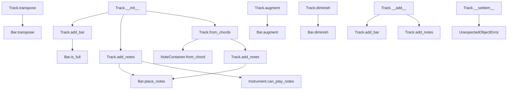

# `track.py`

## `mingus.containers.track.Track` · *class*

## Summary:
Represents a musical track composed of sequential bars, optionally associated with an instrument and tuning.

## Description:
The Track class serves as a container for musical bars, enabling construction of musical sequences. It can be associated with an instrument to validate note ranges and with a tuning for tablature support. Tracks are built incrementally by adding bars or notes, and support operations like transposition, augmentation, and diminishment of musical content. The class implements several special methods for convenient addition of musical elements.

## State:
- bars: list[Bar] - Collection of musical bars making up the track
- instrument: Instrument or None - Optional instrument for note validation
- name: str - Track name, defaults to "Untitled" for MIDI file identification
- tuning: Tuning or None - Tuning information for tablature support

## Lifecycle:
- Creation: Instantiate with optional instrument parameter
- Usage: Add bars or notes using add_bar() or add_notes(), or via overloaded + operator
- Destruction: No explicit cleanup required; relies on Python garbage collection

## Method Map:


## Raises:
- InstrumentRangeError: When attempting to add notes that exceed instrument's playable range
- UnexpectedObjectError: When attempting to set a bar with an object that doesn't have a 'bar' attribute

## Example:
```python
# Create a track with an instrument
from mingus.containers import Instrument
instrument = Instrument("Guitar")
track = Track(instrument)

# Add bars and notes
from mingus.containers import Bar
bar = Bar("C", (4, 4))
track.add_bar(bar)
track.add_notes("C4", 4)

# Or use the overloaded + operator
track += bar
track += "D4"

# Handle chords
chords = ["C", "G", "Am", "F"]
track.from_chords(chords)

# Manipulate the track
track.transpose("P5")
track.augment()

# Access bars
first_bar = track[0]
track[0] = bar  # Sets first bar to new bar
```

### `mingus.containers.track.Track.__init__` · *method*

## Summary:
Initializes a musical track with an empty collection of bars and optional instrument assignment.

## Description:
Creates a new Track instance with an empty list of musical bars and assigns an optional instrument. This constructor establishes the fundamental data structure for a musical track, allowing subsequent operations to add bars and notes to the track.

## Args:
    instrument (Instrument or None, optional): The musical instrument associated with this track. Defaults to None.

## Returns:
    None: This method does not return a value.

## Raises:
    None: This method does not explicitly raise exceptions.

## State Changes:
    Attributes READ: None
    Attributes WRITTEN: 
    - self.bars: Initialized as an empty list
    - self.instrument: Set to the provided instrument parameter or None

## Constraints:
    Preconditions: None
    Postconditions: 
    - self.bars is initialized as an empty list
    - self.instrument is set to the provided value or None

## Side Effects:
    None: This method performs no I/O operations or external service calls.

### `mingus.containers.track.Track.add_bar` · *method*

*No documentation generated.*

### `mingus.containers.track.Track.add_notes` · *method*

## Summary:
Places musical notes in the track's bar structure, creating new bars when necessary.

## Description:
This method adds notes to a track by placing them in the most recently created bar. If the current bar is full, it creates a new bar and places the notes there. The method validates that notes can be played by the assigned instrument if one exists, and handles default duration values. This is a core method in the music composition pipeline for building up musical content bar by bar.

## Args:
    note: The musical note(s) to add, which can be a string, NoteContainer, or list of notes
    duration (int, optional): The duration of the note(s). Defaults to 4 (quarter note)

## Returns:
    bool: True if the note was successfully placed in a bar, False if placement failed due to insufficient space

## Raises:
    InstrumentRangeError: When an instrument is assigned to the track and the note cannot be played by that instrument

## State Changes:
    Attributes READ: self.instrument, self.bars
    Attributes WRITTEN: self.bars (appends new Bar objects when needed)

## Constraints:
    Preconditions: 
    - The note parameter must be compatible with the NoteContainer system
    - If an instrument is assigned, it must be able to play the specified note
    - Duration must be a positive number
    
    Postconditions:
    - The note is placed in the most recent bar of the track
    - If the last bar is full, a new bar is created and the note is placed in it
    - The track maintains a valid bar structure

## Side Effects:
    - May create new Bar objects and append them to self.bars
    - Mutates the internal bar structure of the track
    - May raise InstrumentRangeError if instrument validation fails

### `mingus.containers.track.Track.get_notes` · *method*

## Summary:
Generates note information tuples from all bars in the track, yielding beat, duration, and notes for each musical event.

## Description:
This method provides a generator interface to iterate through all musical events (notes) stored in the track's bars. It flattens the hierarchical structure of bars and beats into a sequence of (beat, duration, notes) tuples, making it easy to process all musical events in chronological order without needing to manually manage nested loops.

The method is designed as a generator to efficiently handle large tracks without loading all data into memory simultaneously. It's particularly useful for analysis, transformation, or display operations that need to process each musical event individually.

## Args:
    None

## Returns:
    Generator[tuple[float, float, NoteContainer]]: A generator yielding tuples of (beat, duration, notes) for each musical event in the track, where:
    - beat (float): The position of the event within the bar (typically 0.0 to 1.0)
    - duration (float): The duration of the note/event (e.g., 1.0 for whole note, 0.5 for half note)
    - notes (NoteContainer): Container holding the actual musical notes for this event

## Raises:
    None explicitly raised

## State Changes:
    - Attributes READ: self.bars
    - Attributes WRITTEN: None

## Constraints:
    - Preconditions: The track must have a `bars` attribute containing iterable Bar objects
    - Postconditions: The generator will yield all (beat, duration, notes) tuples from all bars in the track

## Side Effects:
    None

### `mingus.containers.track.Track.from_chords` · *method*

## Summary:
Converts a list of chord shorthand strings into musical notes on the track, handling duration distribution and tuning.

## Description:
This method transforms chord shorthand notation (like "C", "G7", "Am") into actual musical notes and adds them to the track's bars. It supports nested lists for arpeggiated chords, None values for rests, and automatically applies instrument tuning when available. The method intelligently distributes note durations across bar boundaries when necessary.

## Args:
    chords (list): A list of chord shorthand strings or nested lists of chord shorthand strings. Can contain None values for rests.
    duration (int, optional): Base duration for each chord. Defaults to 1.

## Returns:
    Track: Returns self to allow method chaining.

## Raises:
    InstrumentRangeError: When a note in the chord cannot be played by the assigned instrument.
    FormatError: When an invalid chord shorthand string is encountered.
    NoteFormatError: When an invalid note is encountered in a chord.

## State Changes:
    Attributes READ: self.bars, self.instrument, self.tuning
    Attributes WRITTEN: self.bars (through add_notes calls)

## Constraints:
    Preconditions: 
    - The track must have a valid structure (bars array initialized)
    - Chord shorthand strings must be valid (e.g., "C", "Am", "G7")
    - Duration must be a positive number
    
    Postconditions:
    - All chords in the input list are added to the track's bars
    - The track maintains proper bar structure
    - Notes are distributed according to the specified duration

## Side Effects:
    - Modifies the track's bars by adding notes
    - May create new bars when existing bars are full
    - Can raise InstrumentRangeError if instrument constraints are violated
    - Calls external functions from mingus.core.value for duration calculations

### `mingus.containers.track.Track.get_tuning` · *method*

## Summary:
Returns the tuning information for the track, prioritizing instrument-specific tuning over track-level tuning.

## Description:
Retrieves the tuning configuration for this track. If the track has an instrument assigned and that instrument has a tuning defined, the instrument's tuning is returned. Otherwise, the track's own tuning setting is returned. This method provides a unified interface for accessing tuning information used in musical operations such as chord fingering.

## Args:
    None

## Returns:
    StringTuning or None: The tuning configuration for this track. Returns the instrument's tuning if available, otherwise returns the track's tuning. Returns None if neither has a tuning defined.

## Raises:
    None

## State Changes:
    Attributes READ: self.instrument, self.instrument.tuning, self.tuning
    Attributes WRITTEN: None

## Constraints:
    Preconditions: None
    Postconditions: The returned value is either a StringTuning object, None, or another tuning representation compatible with the rest of the system.

## Side Effects:
    None

### `mingus.containers.track.Track.set_tuning` · *method*

*No documentation generated.*

### `mingus.containers.track.Track.transpose` · *method*

## Summary:
Transposes all notes in all bars of the track by the specified interval, modifying the track in-place.

## Description:
This method applies a musical transposition to every note contained within all bars of the track. It operates recursively by calling the transpose method on each bar, which in turn calls transpose on each note container within the bar, ultimately transposing each individual note.

The transposition is performed using the mingus.core.intervals.from_shorthand function, which handles both diatonic intervals (1, 2, 3, 4, 5, 6, 7) and chromatic alterations (#, b).

## Args:
    interval (str): Musical interval shorthand (e.g., 'M2', 'm3', 'P5') specifying the transposition amount and quality.
    up (bool, optional): Direction of transposition. True for upward transposition, False for downward. Defaults to True.

## Returns:
    Track: Returns self to enable method chaining.

## Raises:
    None explicitly raised by this method, though underlying methods may raise exceptions from mingus.core.intervals or note handling.

## State Changes:
    Attributes READ: self.bars
    Attributes WRITTEN: Modifies notes within self.bars through recursive calls to bar.transpose(), which modifies individual notes.

## Constraints:
    Preconditions: The track must have bars containing notes that can be transposed.
    Postconditions: All notes in all bars of the track will be transposed by the specified interval in the specified direction.

## Side Effects:
    None - This method only modifies the internal state of notes within the track's bars.

### `mingus.containers.track.Track.augment` · *method*

## Summary:
Increases the pitch of all notes in the track by one semitone (augments them).

## Description:
This method recursively applies pitch augmentation to all notes contained within the track's bars. It iterates through each bar in the track and calls the bar's augment() method, which applies augment() to all note containers within each bar, ultimately raising the pitch of all contained notes by one semitone. This is commonly used to transpose musical passages up by a half-step.

## Args:
    None

## Returns:
    Track: Returns self to enable method chaining, allowing for fluent interface patterns.

## Raises:
    None explicitly raised by this method

## State Changes:
    Attributes READ: self.bars
    Attributes WRITTEN: None (modifies nested note objects but not self's direct attributes)

## Constraints:
    Preconditions: The track must contain bars with note containers containing notes.
    Postconditions: All notes in the track have been transposed up by one semitone (augmented).

## Side Effects:
    Mutates the pitch of all notes contained within the track's bars by increasing each note's pitch by one semitone.

### `mingus.containers.track.Track.diminish` · *method*

## Summary:
Reduces the duration of all musical elements in all bars of the track by half.

## Description:
This method applies the diminish operation to all bars in the track, which halves the duration of all notes and note containers contained within. It follows the same pattern as other transformation methods like `augment()` and `transpose()` in the Track class.

## Args:
    None

## Returns:
    Track: Returns self to enable method chaining.

## Raises:
    None explicitly raised

## State Changes:
    Attributes READ: self.bars
    Attributes WRITTEN: None (modifies contents of bars but not the bars attribute itself)

## Constraints:
    Preconditions: The track must have bars initialized (self.bars should be iterable)
    Postconditions: All musical elements in all bars have their durations halved

## Side Effects:
    None

### `mingus.containers.track.Track.__add__` · *method*

## Summary:
Enables the addition of musical elements to a track using the `+` operator, delegating to appropriate methods based on the type of element being added.

## Description:
This special method implements the `+` operator for Track objects, allowing users to append musical elements (bars, notes, or note containers) to a track in an intuitive way. Instead of calling explicit methods like `add_bar()` or `add_notes()`, developers can use the `+` operator with various musical objects. The method determines the appropriate action based on the object's attributes and type.

Known callers:
- Direct usage via `track + object` syntax in user code
- This method is part of the Track class's operator overloading implementation, enabling fluent interface patterns for musical composition

This logic is implemented as its own method rather than being inlined because it provides a clean abstraction layer that allows the Track class to support multiple musical element types through a single, consistent interface (`+` operator) while maintaining the specific implementation details in dedicated methods.

## Args:
    value: The musical element to add to the track. Can be:
        - A Bar object (has "bar" attribute) - adds the entire bar to the track
        - A NoteContainer or similar object (has "notes" attribute) - adds notes to the current bar or creates a new bar if needed
        - A string or object with "name" attribute (representing musical notes) - adds notes to the current bar or creates a new bar if needed

## Returns:
    Track: Returns self to enable method chaining, or the result of the delegated method call

## Raises:
    InstrumentRangeError: When attempting to add notes that are outside the range of the track's assigned instrument (raised by add_notes method)
    UnexpectedObjectError: When trying to assign a bar that doesn't have a "bar" attribute (raised by __setitem__ method when called internally)

## State Changes:
    Attributes READ: self.bars (accessed to determine if empty, to get last bar)
    Attributes WRITTEN: self.bars (appended with new bar or updated with new notes)

## Constraints:
    Preconditions: 
    - Track object must be initialized
    - Value must be a valid musical element (Bar, NoteContainer, or compatible note representation)
    
    Postconditions:
    - The track's bars list is modified appropriately
    - If adding notes to an empty track, a new bar is created
    - If adding notes to a full bar, a new bar is created
    - The method returns self for chaining

## Side Effects:
    None - This method only modifies the internal state of the Track object

### `mingus.containers.track.Track.test_integrity` · *method*

## Summary:
Checks whether all bars in the track (except the last one) are completely filled.

## Description:
This method validates the structural integrity of a musical track by ensuring that all bars except the final one are completely filled with notes according to their time signature. It's designed to verify that bars are properly completed before proceeding with operations that might depend on complete bar structures.

## Args:
    None

## Returns:
    bool: True if all bars except the last one are full, False otherwise.

## Raises:
    None

## State Changes:
    Attributes READ: self.bars
    Attributes WRITTEN: None

## Constraints:
    Preconditions: The track must have at least one bar (self.bars should not be empty).
    Postconditions: The method returns a boolean value indicating whether the track integrity constraint is satisfied.

## Side Effects:
    None

### `mingus.containers.track.Track.__eq__` · *method*

## Summary:
Compares two Track objects for equality by checking if all corresponding bars are equal, though with a critical implementation bug.

## Description:
This special method implements the equality comparison operator (`==`) for Track objects. It sequentially compares the bars of two tracks to determine if they are equivalent. When a Track object is compared to another object using the `==` operator, this method is automatically invoked.

## Args:
    other (object): Another object to compare against this track. Expected to be another Track instance.

## Returns:
    bool: True if all corresponding bars in both tracks are equal, False otherwise.

## Raises:
    AttributeError: If the other object does not have a bars attribute.
    IndexError: If the other object has fewer bars than this track (due to loop bounds).

## State Changes:
    Attributes READ: 
    - self.bars: The list of bars in this track
    - other.bars: The list of bars in the other track being compared

## Constraints:
    Preconditions:
    - Both tracks must have the same number of bars for meaningful comparison
    - The other object must have a bars attribute
    - All bars in both tracks must support equality comparison
    
    Postconditions:
    - Returns a boolean indicating whether the tracks are equal
    - Does not modify either track's state

## Side Effects:
    None: This method is read-only and does not mutate either track object.

## Implementation Details:
    The current implementation contains a critical bug where it only compares bars at indices 0 through len(self.bars) - 2, omitting the last bar at index len(self.bars) - 1. This means that even if all bars except the last one are identical, the method will return True incorrectly if the last bars differ. Additionally, there is no validation to ensure that the other object is a Track instance or that both tracks have the same number of bars, which could lead to runtime errors.

### `mingus.containers.track.Track.__getitem__` · *method*

## Summary:
Retrieves a Bar object from the track's collection of bars by index position.

## Description:
Provides indexed access to the bars contained within this track. This method enables iteration over bars and direct access to specific bar objects for manipulation or inspection. It implements Python's sequence protocol allowing the Track class to be used with standard indexing operations like `track[index]`.

## Args:
    index (int): The zero-based index position of the bar to retrieve. Negative indices are supported for reverse indexing.

## Returns:
    Bar: The Bar object at the specified index position.

## Raises:
    IndexError: When the index is out of range for the bars collection.

## State Changes:
    Attributes READ: self.bars
    Attributes WRITTEN: None

## Constraints:
    Preconditions: The index must be within the valid range [0, len(self.bars)) or [-len(self.bars), -1] for negative indices.
    Postconditions: The returned Bar object is a reference to the actual Bar object stored in self.bars, not a copy.

## Side Effects:
    None

### `mingus.containers.track.Track.__setitem__` · *method*

## Summary:
Sets a Bar object at the specified index in the track's bars collection, validating that the assigned object is a proper Bar instance.

## Description:
This method implements Python's `__setitem__` protocol, allowing direct assignment to track elements using bracket notation (e.g., `track[index] = bar`). It validates that the assigned value has a "bar" attribute, ensuring only valid Bar objects are stored in the track's bars collection. This validation prevents accidental assignment of incompatible objects that could break the track's integrity.

## Args:
    index (int): The position in the bars list where the Bar object should be placed
    value (object): The object to assign at the specified index

## Returns:
    None: This method does not return a value

## Raises:
    UnexpectedObjectError: When the provided value does not have a "bar" attribute, indicating it is not a valid Bar object

## State Changes:
    Attributes READ: self.bars
    Attributes WRITTEN: self.bars

## Constraints:
    Preconditions: 
    - The index must be a valid integer index for the self.bars list
    - The value must have a "bar" attribute (typically a Bar object)
    Postconditions:
    - The self.bars list will contain the provided value at the specified index
    - The value at the specified index will have a "bar" attribute

## Side Effects:
    None: This method only modifies the internal state of the Track object

### `mingus.containers.track.Track.__repr__` · *method*

## Summary:
Returns a string representation of the Track object showing its instrument and bars.

## Description:
This method implements the Python special method `__repr__` to provide a string representation of the Track object. It creates a list containing the track's instrument and bars, making it easy to visualize the track's structure during debugging or development.

## Args:
    None

## Returns:
    str: A string representation of the form '[instrument, bars]' where instrument is the track's instrument object and bars is a list of Bar objects.

## Raises:
    None

## State Changes:
    Attributes READ: self.instrument, self.bars
    Attributes WRITTEN: None

## Constraints:
    Preconditions: The Track object must have been initialized with valid instrument and bars attributes.
    Postconditions: The returned string representation accurately reflects the current state of the track's instrument and bars.

## Side Effects:
    None

### `mingus.containers.track.Track.__len__` · *method*

## Summary:
Returns the number of bars contained in the track.

## Description:
This method implements Python's `__len__` special method, enabling the use of the built-in `len()` function on Track instances. It provides a convenient way to determine how many bars are present in the musical track. This method is called internally by Python's `len()` function and is essential for making the Track class behave like a sequence type.

## Args:
    None

## Returns:
    int: The number of Bar objects currently stored in the track's bars list.

## Raises:
    None

## State Changes:
    Attributes READ: self.bars
    Attributes WRITTEN: None

## Constraints:
    Preconditions: The Track instance must be properly initialized with a bars attribute that behaves like a list.
    Postconditions: The method returns an integer representing the count of bars without modifying the track's state.

## Side Effects:
    None

