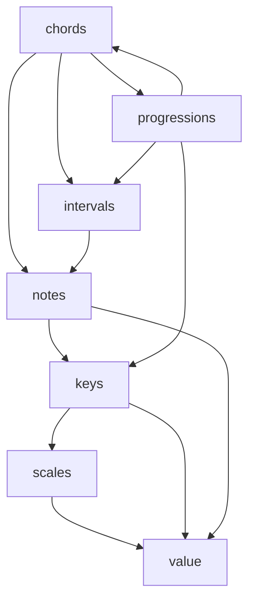

# `mingus.core`

## Tree:
```
core/
├── chords.py
├── intervals.py
├── keys.py
├── meter.py
├── mt_exceptions.py
├── notes.py
├── progressions.py
├── scales.py
└── value.py
```

## Role:
Provides fundamental music theory concepts and operations for analyzing and constructing musical elements including chords, intervals, keys, scales, and note manipulation.

## Description:
The core module serves as the foundational layer of the mingus music theory library, offering essential building blocks for musical analysis and composition. It provides tools for working with musical notes, intervals, chords, scales, keys, and rhythmic values. This module is used throughout the mingus library to support higher-level music processing and analysis capabilities.

Primary consumers include:
- The `mingus.containers` module for musical object creation
- The `mingus.midi` module for MIDI-related operations
- The `mingus.visual` module for musical notation rendering
- Various music analysis and composition applications

The cohesion of this module stems from its shared focus on fundamental music theory concepts and mathematical representations of musical elements.

## Components:
*   `chords`: Functions for creating, identifying, and manipulating musical chords
*   `intervals`: Operations for calculating and determining musical intervals between notes
*   `keys`: Tools for working with musical keys and key signatures
*   `meter`: Utilities for handling time signatures and meter concepts
*   `mt_exceptions`: Custom exception classes for music theory operations
*   `notes`: Basic note manipulation and validation utilities
*   `progressions`: Functions for analyzing and generating chord progressions
*   `scales`: Classes and functions for musical scales and modes
*   `value`: Rhythmic value calculations and tuplet operations



## Public API:
*   `chords.determine(chord, shorthand=False, no_inversions=False, no_polychords=False)` - Determines the type of chord from a list of notes
*   `intervals.determine(note1, note2, shorthand=False)` - Determines the interval between two notes
*   `keys.get_notes(key="C")` - Returns the notes in a given key
*   `progressions.determine(chord, key, shorthand=False)` - Identifies chord progressions in a key
*   `scales.determine(notes)` - Identifies scales that contain a given set of notes
*   `notes.is_valid_note(note)` - Validates if a note string is properly formatted
*   `value.determine(value)` - Determines rhythmic value properties

## Dependencies:
*   Internal imports: `mingus.core.intervals`, `mingus.core.keys`, `mingus.core.notes`, `mingus.core.progressions`, `mingus.core.scales`
*   External imports: `itertools`, `collections`, `six` (for compatibility)

## Constraints:
*   All note inputs must follow standard musical notation (e.g., "C", "D#", "Eb")
*   Chord determination functions expect lists of properly formatted note strings
*   Scale determination requires sets of notes in standard notation
*   Key operations assume valid key signatures (C, G, D, A, E, B, F#, F, Bb, Eb, Ab, Db, Gb, Cb)
*   Thread-safe for read-only operations; modifications to global caches require synchronization

---

## Files

- [`chords.py`](core/chords.md)
- [`intervals.py`](core/intervals.md)
- [`keys.py`](core/keys.md)
- [`meter.py`](core/meter.md)
- [`mt_exceptions.py`](core/mt_exceptions.md)
- [`notes.py`](core/notes.md)
- [`progressions.py`](core/progressions.md)
- [`scales.py`](core/scales.md)
- [`value.py`](core/value.md)

