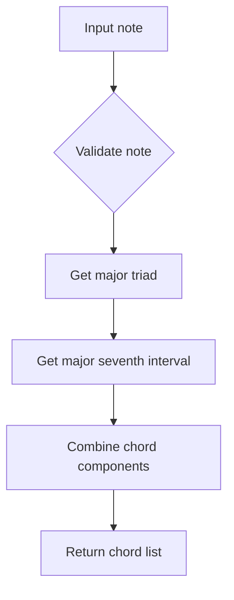
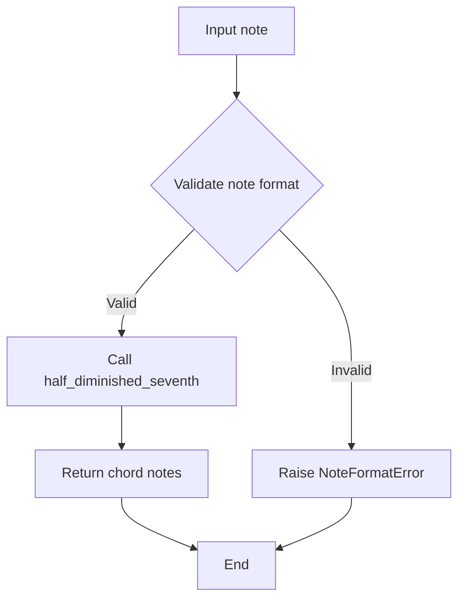
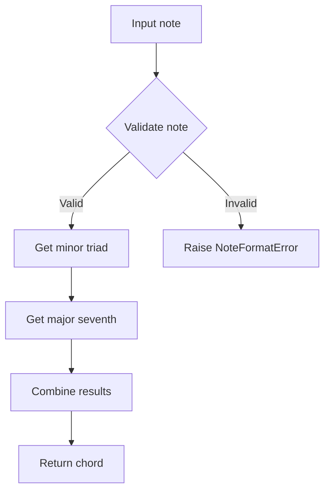
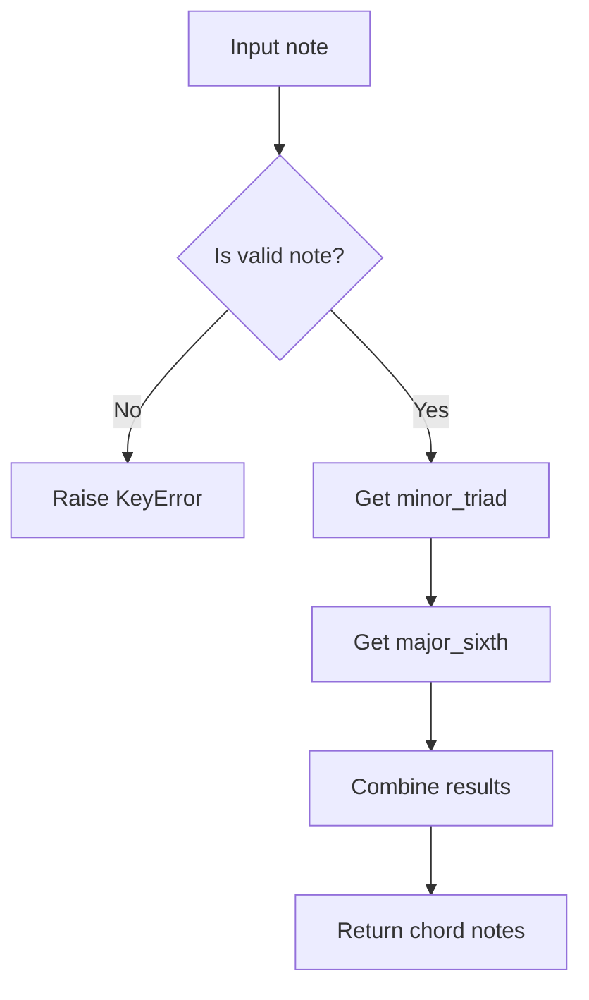
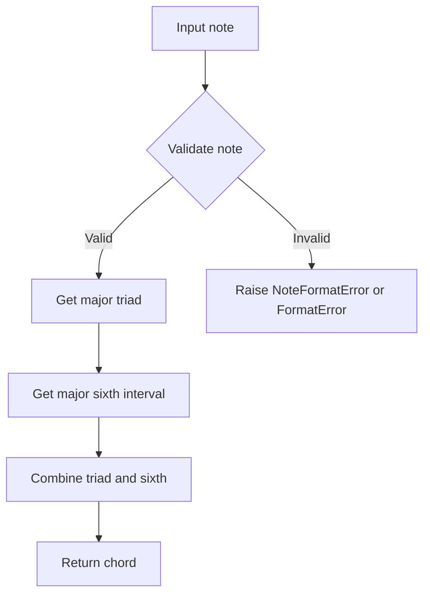

# `chords.py`

## `mingus.core.chords.triad` · *function*

## Summary:
Generates a musical triad by calculating the root note, third, and fifth intervals from a given note and key.

## Description:
Creates a triad by taking a root note and key, then computing the third and fifth intervals using the intervals module. This function encapsulates the logic for building a basic three-note chord structure, separating the concern of chord construction from other musical operations.

## Args:
    note (str): The root note of the triad (e.g., 'C', 'D#', 'Bb'). Must be a valid musical note.
    key (str): The musical key (e.g., 'C', 'G', 'A#') that determines the interval calculations. Must be a recognized musical key.

## Returns:
    list[str]: A list containing three note names representing the triad: [root_note, third, fifth]

## Raises:
    KeyError: When the provided note is not a valid musical note
    NoteFormatError: When the provided key is not a recognized musical key format

## Constraints:
    Preconditions:
        - The note parameter must be a valid musical note string (e.g., 'C', 'C#', 'Cb', 'Bb')
        - The key parameter must be a recognized musical key (e.g., 'C', 'G', 'A#', 'Eb')
    Postconditions:
        - The returned list always contains exactly three elements
        - All elements in the returned list are valid musical note names

## Side Effects:
    None

## Control Flow:
```mermaid
flowchart TD
    A[triad(note, key)] --> B{note validation}
    B -->|Invalid| C[raise KeyError]
    B -->|Valid| D{key validation}
    D -->|Invalid| E[raise NoteFormatError]
    D -->|Valid| F[get key notes]
    F --> G[calculate third interval]
    G --> H[calculate fifth interval]
    H --> I[return [note, third, fifth]]
```

## Examples:
    >>> triad('C', 'C')
    ['C', 'E', 'G']
    
    >>> triad('A', 'C')
    ['A', 'C', 'E']

## `mingus.core.chords.triads` · *function*

## Summary:
Generates all triads for a given musical key by creating chords from each note in the key.

## Description:
This function computes all triads (three-note chords) that can be formed using the notes of a given musical key. For each note in the key, it generates a triad consisting of that note as the root, plus the third and fifth intervals from the key. The function utilizes caching to avoid redundant computations when the same key is requested multiple times.

## Args:
    key (str): The musical key for which to generate triads (e.g., "C", "G#", "Fb").

## Returns:
    list[list[str]]: A list of triads, where each triad is represented as a list of three note strings (root, third, fifth).

## Raises:
    NoteFormatError: When the provided key string is not recognized as a valid musical key.

## Constraints:
    Preconditions:
        - The key parameter must be a valid musical key string
        - The key must be supported by the keys module's validation system
    
    Postconditions:
        - Returns a list of triads with consistent formatting
        - Each triad contains exactly three notes in standard musical notation

## Side Effects:
    - Accesses and potentially modifies a global cache (_triads_cache) to store computed results
    - Calls external functions from the keys module to validate and retrieve key information

## Control Flow:
```mermaid
flowchart TD
    A[triads(key)] --> B{Is key in cache?}
    B -- Yes --> C[Return cached result]
    B -- No --> D[Get notes in key]
    D --> E[Apply triad() to each note]
    E --> F[Cache results]
    F --> G[Return results]
```

## Examples:
```python
# Generate triads for C major
result = triads("C")
# Returns: [['C', 'E', 'G'], ['D', 'F#', 'A'], ['E', 'G#', 'B'], ...]

# Generate triads for G minor
result = triads("Gm")
# Returns: [['G', 'Bb', 'D'], ['A', 'C', 'E'], ['B', 'D', 'F#'], ...]
```

## `mingus.core.chords.major_triad` · *function*

## Summary:
Creates a major triad chord by combining a root note with its major third and perfect fifth intervals.

## Description:
Generates a list containing three musical notes that form a major triad: the root note, its major third interval, and its perfect fifth interval. This function encapsulates the core logic for constructing major triads in music theory applications.

## Args:
    note (str): A musical note represented as a string (e.g., "C", "D#", "Bb"). The note should be in standard musical notation format.

## Returns:
    list[str]: A list of three strings representing the notes in the major triad, ordered as [root_note, major_third, perfect_fifth].

## Raises:
    None explicitly defined in this function.

## Constraints:
    Preconditions:
        - The input note must be a valid musical note string in standard notation format
        - The note should be compatible with the mingus music theory library's interval calculations
    
    Postconditions:
        - The returned list always contains exactly three note strings
        - The first element is identical to the input note
        - The second element represents the major third interval of the input note
        - The third element represents the perfect fifth interval of the input note

## Side Effects:
    None

## Control Flow:
```mermaid
flowchart TD
    A[Input note] --> B[Get major third of note]
    B --> C[Get perfect fifth of note]
    C --> D[Return [note, major_third, perfect_fifth]]
```

## Examples:
    >>> major_triad("C")
    ['C', 'E', 'G']
    
    >>> major_triad("A#")
    ['A#', 'C##', 'F#']
```

## `mingus.core.chords.minor_triad` · *function*

## Summary:
Constructs a minor triad chord by combining a root note with its minor third and perfect fifth.

## Description:
Creates a list containing three notes that form a minor triad: the root note, the minor third above it, and the perfect fifth above it. This function encapsulates the core logic for building minor triads in musical notation.

## Args:
    note (str): A note represented as a string (e.g., "C", "D#", "Bb"). Must be a valid note format according to mingus conventions.

## Returns:
    list[str]: A list of three note strings representing the minor triad in the order [root, minor third, perfect fifth].

## Raises:
    NoteFormatError: If the input note is not in a valid format recognized by the mingus library.

## Constraints:
    Preconditions:
        - The input note must be a valid note string format supported by the mingus library
        - The note should not be None or empty
    
    Postconditions:
        - The returned list always contains exactly three note strings
        - The second element is always a minor third above the first
        - The third element is always a perfect fifth above the first

## Side Effects:
    None

## Control Flow:
```mermaid
flowchart TD
    A[Input note] --> B{Validate note format}
    B -- Valid --> C[Get minor third]
    C --> D[Get perfect fifth]
    D --> E[Return [note, minor_third, perfect_fifth]]
    B -- Invalid --> F[Raise NoteFormatError]
```

## Examples:
    >>> minor_triad("C")
    ['C', 'Eb', 'G']
    
    >>> minor_triad("A")
    ['A', 'C', 'E']

## `mingus.core.chords.diminished_triad` · *function*

## Summary
Returns a list containing a note and its minor third and minor fifth intervals.

## Description
Constructs a diminished triad by taking a root note and calculating its minor third and minor fifth intervals. This function performs mathematical operations to determine the appropriate note names for these intervals based on the input note. The resulting list contains exactly three notes in the order: root note, minor third, and minor fifth.

## Args
    note (str): A musical note string in standard notation (e.g., 'C', 'D#', 'Bb') that is valid for the mingus library's note handling system.

## Returns
    list[str]: A list of exactly three note strings representing the diminished triad: [root_note, minor_third, minor_fifth]. The minor third is 3 semitones above the root, and the minor fifth is 6 semitones above the root.

## Raises
    None explicitly raised by this function, though underlying interval calculations may raise exceptions for malformed note inputs.

## Constraints
    Preconditions:
        - The input note must be a valid note string recognized by the mingus library's note parsing system
        - The note should conform to standard musical notation conventions
        
    Postconditions:
        - The returned list always contains exactly three elements
        - All elements are valid note strings in the same format as the input note
        - The second element represents a note that is exactly 3 semitones higher than the first
        - The third element represents a note that is exactly 6 semitones higher than the first

## Side Effects
    None

## Control Flow
```mermaid
flowchart TD
    A[Input note] --> B[Calculate minor_third(note)]
    B --> C[Calculate minor_fifth(note)]
    C --> D[Return [note, minor_third, minor_fifth]]
```

## Examples
    >>> diminished_triad('C')
    ['C', 'Eb', 'Gb']
    
    >>> diminished_triad('A')
    ['A', 'C', 'Eb']
```

## `mingus.core.chords.augmented_triad` · *function*

## Summary:
Creates an augmented triad chord from a given note by combining the root note, major third, and augmented fifth intervals.

## Description:
Generates a list representing an augmented triad chord structure. An augmented triad consists of three notes: the root note, a major third interval above the root, and an augmented fifth interval above the root. This function encapsulates the logic for constructing such chords in music theory applications.

## Args:
    note (str): A musical note represented as a string (e.g., "C", "D#", "Bb"). Must be a valid note format according to the mingus library's note representation standards.

## Returns:
    list[str]: A list containing exactly three note strings representing the augmented triad: [root_note, major_third, augmented_fifth]. The returned list always contains exactly three elements in this specific order.

## Raises:
    NoteFormatError: If the input note string is not in a recognized format that can be processed by the underlying note manipulation functions.

## Constraints:
    Preconditions:
        - The input note must be a valid note string that can be parsed by the mingus note handling system
        - The note should follow standard musical notation conventions (e.g., "C", "C#", "Db", "Bb")
    
    Postconditions:
        - The returned list always contains exactly three elements
        - The first element is identical to the input note
        - The second element is the major third interval of the input note
        - The third element is the augmented fifth interval of the input note

## Side Effects:
    None: This function is pure and has no side effects. It only performs calculations and returns a result.

## Control Flow:
```mermaid
flowchart TD
    A[Input note] --> B{Validate note format}
    B -- Valid --> C[Get major third]
    B -- Invalid --> D[Raise NoteFormatError]
    C --> E[Get augmented fifth]
    E --> F[Return [note, major_third, augmented_fifth]]
```

## Examples:
    >>> augmented_triad("C")
    ['C', 'E', 'G#']
    
    >>> augmented_triad("A")
    ['A', 'C#', 'F#']
```

## `mingus.core.chords.seventh` · *function*

## Summary:
Generates a seventh chord by combining a triad with a seventh interval.

## Description:
Creates a seventh chord by first generating a triad from the given note and key, then appending the seventh interval of that note in the key. This function abstracts the process of building a seventh chord from its constituent intervals.

## Args:
    note (str): The root note of the chord (e.g., 'C', 'D#').
    key (str): The musical key (e.g., 'C', 'Gm').

## Returns:
    list[str]: A list containing four notes representing the seventh chord: root, third, fifth, and seventh.

## Raises:
    KeyError: When the provided note is not a valid note according to the notes module validation.

## Constraints:
    Preconditions:
        - The note must be a valid note string recognized by the notes module.
        - The key must be a valid key string recognized by the keys module.
    Postconditions:
        - The returned list always contains exactly four notes forming a seventh chord.
        - All notes in the returned list are valid note strings.

## Side Effects:
    None.

## Control Flow:
```mermaid
flowchart TD
    A[seventh(note, key)] --> B[triad(note, key)]
    B --> C[Get third and fifth intervals]
    C --> D[Append seventh(interval(note, key, 6))]
    D --> E[Return chord list]
```

## Examples:
    >>> seventh('C', 'C')
    ['C', 'E', 'G', 'B']
    >>> seventh('A', 'C')
    ['A', 'C#', 'E', 'G#']

## `mingus.core.chords.sevenths` · *function*

## Summary:
Generates all seventh chords for the notes in a given musical key, with caching for performance optimization.

## Description:
This function computes the complete set of seventh chords available in a specified musical key. It leverages an internal cache to avoid recomputing the same results for the same key, improving performance for repeated queries. For each note in the key, it calls the `seventh` function to construct a seventh chord built on that note.

## Args:
    key (str): The musical key for which to generate seventh chords. Should be a valid key name (e.g., 'C', 'Gm', 'F#') recognized by the keys module.

## Returns:
    list[list[str]]: A list of seventh chords, where each chord is represented as a list of four note names forming a seventh chord in the specified key. The order corresponds to the notes returned by keys.get_notes(key).

## Raises:
    KeyError: When the provided key is not a valid key according to the keys module validation.
    NoteFormatError: When the notes in the key cannot be processed due to format issues.

## Constraints:
    Preconditions:
    - The key parameter must be a valid musical key string recognized by the keys module
    - The global `_sevenths_cache` variable must be initialized as a dictionary-like object
    
    Postconditions:
    - Returns a list of lists containing exactly four note names for each seventh chord
    - The result is cached for future calls with the same key
    - Each inner list represents a complete seventh chord built on the corresponding note

## Side Effects:
    - Modifies the global `_sevenths_cache` dictionary by storing computed results for the key
    - No external I/O operations or state mutations beyond cache updates

## Control Flow:
```mermaid
flowchart TD
    A[sevenths called with key] --> B{key in cache?}
    B -- Yes --> C[Return cached result]
    B -- No --> D[Get all notes in key using keys.get_notes(key)]
    D --> E[For each note, compute seventh chord using seventh()]
    E --> F[Store result in _sevenths_cache[key]]
    F --> G[Return result]
```

## Examples:
    # Generate seventh chords for C major
    c_sevenths = sevenths('C')
    # Returns: [['C', 'E', 'G', 'B'], ['D', 'F', 'A', 'C'], ...]
    
    # Generate seventh chords for A minor
    a_sevenths = sevenths('Am')
    # Returns: [['A', 'C', 'E', 'G'], ['B', 'D', 'F#', 'A'], ...]

## `mingus.core.chords.major_seventh` · *function*

## Summary:
Constructs a major seventh chord from a given note by combining a major triad with a major seventh interval.

## Description:
Creates a major seventh chord by taking the root note and appending the major seventh interval to form a four-note chord. This function extracts the chord construction logic to enable reuse and maintain consistency in chord generation throughout the music library.

## Args:
    note (str): A string representing a musical note (e.g., "C", "D#", "Bb"). The note serves as the root of the major seventh chord.

## Returns:
    list[str]: A list containing four note strings representing the major seventh chord in the order: root, major third, perfect fifth, major seventh.

## Raises:
    None explicitly raised by this function, though underlying functions may raise FormatError or NoteFormatError from the mingus.core.mt_exceptions module if the note parameter is invalid.

## Constraints:
    Preconditions:
    - The note parameter must be a valid note string recognized by the mingus library
    - The note should follow standard musical note naming conventions (e.g., "C", "C#", "Db", "Bb")

    Postconditions:
    - The returned list always contains exactly four notes
    - The notes are arranged in the standard major seventh chord structure

## Side Effects:
    None

## Control Flow:


## Examples:
    >>> major_seventh("C")
    ['C', 'E', 'G', 'B']
    
    >>> major_seventh("A")
    ['A', 'C#', 'E', 'G#']

## `mingus.core.chords.minor_seventh` · *function*

## Summary:
Creates a minor seventh chord from a given note by combining a minor triad with a minor seventh interval.

## Description:
Generates a four-note minor seventh chord consisting of the root note, minor third, perfect fifth, and minor seventh intervals above the root. This function extracts the chord construction logic to ensure consistent chord formation while maintaining clean separation between triad and seventh interval generation.

## Args:
    note (str): The root note of the minor seventh chord (e.g., 'C', 'D#', 'Bb')

## Returns:
    list[str]: A list containing four note names representing the minor seventh chord in the order: root, minor third, perfect fifth, minor seventh

## Raises:
    NoteFormatError: When the input note is not properly formatted according to mingus conventions
    FormatError: When the note format is invalid or unsupported by the chord generation system

## Constraints:
    Preconditions: The input note must be a valid note string recognized by the mingus library
    Postconditions: The returned list always contains exactly four notes forming a proper minor seventh chord structure

## Side Effects:
    None

## Control Flow:
```mermaid
flowchart TD
    A[minor_seventh(note)] --> B{Validate note}
    B --> C[Get minor_triad(note)]
    C --> D[Get minor_seventh(interval)]
    D --> E[Combine results]
    E --> F[Return chord notes]
```

## Examples:
    >>> minor_seventh('C')
    ['C', 'Eb', 'G', 'Bb']
    
    >>> minor_seventh('A')
    ['A', 'C', 'E', 'G']

## `mingus.core.chords.dominant_seventh` · *function*

## Summary:
Returns a dominant seventh chord built from the specified note by combining a major triad with a minor seventh interval.

## Description:
This function constructs a dominant seventh chord, which consists of a major triad plus a minor seventh interval above the root note. The chord is commonly used in jazz and popular music to create tension that resolves naturally.

The function extracts the dominant seventh logic into its own reusable component to separate the concern of chord construction from other musical operations, making the code more modular and easier to test.

## Args:
    note (str): A musical note represented as a string (e.g., 'C', 'D#', 'Bb'). Must be a valid note format according to mingus conventions.

## Returns:
    list[str]: A list containing four note strings representing the dominant seventh chord in the order: root, major third, perfect fifth, minor seventh.

## Raises:
    NoteFormatError: If the input note is not in a valid format recognized by the mingus library.

## Constraints:
    Preconditions:
        - The input note must be a valid note string that can be processed by the underlying note and interval manipulation functions
        - The note must be compatible with the intervals module's processing capabilities
    
    Postconditions:
        - The returned list always contains exactly four elements
        - All elements in the returned list are valid note strings
        - The chord follows the standard dominant seventh formula: root + major third + perfect fifth + minor seventh

## Side Effects:
    None

## Control Flow:
```mermaid
flowchart TD
    A[dominant_seventh(note)] --> B[major_triad(note)]
    A --> C[intervals.minor_seventh(note)]
    B --> D[Combine results]
    C --> D
    D --> E[Return chord list]
```

## Examples:
    >>> dominant_seventh('C')
    ['C', 'E', 'G', 'Bb']
    
    >>> dominant_seventh('A')
    ['A', 'C#', 'E', 'G']

## `mingus.core.chords.half_diminished_seventh` · *function*

## Summary:
Returns a half-diminished seventh chord built from a given root note.

## Description:
Constructs a half-diminished seventh chord (also known as a minor seventh flat five chord) by combining a diminished triad with a minor seventh interval. This function extracts the logic for building this specific chord type into a reusable component, separating the chord construction concern from other chord manipulation logic.

## Args:
    note (str): The root note of the chord, represented as a string (e.g., 'C', 'D#', 'Bb').

## Returns:
    list[str]: A list containing four note strings representing the half-diminished seventh chord in the order: root, minor third, minor fifth, minor seventh.

## Raises:
    NoteFormatError: If the input note string is not properly formatted according to mingus conventions.

## Constraints:
    Preconditions: The input note must be a valid note string recognized by the mingus note parsing system.
    Postconditions: The returned list always contains exactly four notes forming a half-diminished seventh chord structure.

## Side Effects:
    None: This function is pure and has no side effects.

## Control Flow:
```mermaid
flowchart TD
    A[Input note] --> B[diminished_triad(note)]
    A --> C[intervals.minor_seventh(note)]
    B --> D[Concatenate results]
    C --> D
    D --> E[Return chord notes]
```

## Examples:
    >>> half_diminished_seventh('C')
    ['C', 'Eb', 'Gb', 'Bb']
    
    >>> half_diminished_seventh('A')
    ['A', 'C', 'Eb', 'G']

## `mingus.core.chords.minor_seventh_flat_five` · *function*

## Summary
Creates a half-diminished seventh chord (also known as a minor seventh flat five chord) from a given note.

## Description
This function generates a half-diminished seventh chord (m7♭5) by combining a diminished triad with a minor seventh interval. It serves as an alias for the `half_diminished_seventh` function and is commonly used in jazz harmony to represent chords with a flattened fifth and minor seventh.

The function is typically called when constructing chord progressions or analyzing jazz harmony where half-diminished seventh chords are needed.

## Args
    note (str): A musical note represented as a string (e.g., 'C', 'D#', 'Bb'). Must be a valid note format.

## Returns
    list[str]: A list containing four notes representing the half-diminished seventh chord:
        - Root note
        - Minor third above the root
        - Diminished fifth (flattened fifth) above the root
        - Minor seventh above the root

## Raises
    NoteFormatError: If the input note is not in a valid format recognized by the notes module.

## Constraints
    Preconditions:
        - The input note must be a valid note string that can be processed by the notes module
        - The note must be in a format compatible with the intervals module
    
    Postconditions:
        - Returns exactly four notes forming a half-diminished seventh chord
        - All returned notes are in proper musical pitch notation

## Side Effects
    None

## Control Flow


## Examples
```python
# Create a half-diminished seventh chord from C
chord = minor_seventh_flat_five('C')
# Returns ['C', 'Eb', 'Gb', 'Bb']

# Create a half-diminished seventh chord from G
chord = minor_seventh_flat_five('G')
# Returns ['G', 'Bb', 'Db', 'F']
```

## `mingus.core.chords.diminished_seventh` · *function*

## Summary:
Generates a diminished seventh chord by combining a diminished triad with a diminished minor seventh interval.

## Description:
Creates a diminished seventh chord, which consists of a diminished triad (minor third and minor fifth) plus a diminished minor seventh interval. This function extracts the logic for building a diminished seventh chord into a reusable component to avoid duplication in chord construction code.

## Args:
    note (str): The root note of the chord in standard musical notation (e.g., 'C', 'D#', 'Bb')

## Returns:
    list[str]: A list containing four note strings representing the diminished seventh chord:
        - The root note
        - The minor third interval above the root
        - The minor fifth interval above the root
        - The diminished minor seventh interval above the root

## Raises:
    NoteFormatError: If the input note string is malformed or invalid
    FormatError: If the note cannot be processed due to formatting issues

## Constraints:
    Preconditions:
        - The input note must be a valid musical note string
        - The note must be in a format recognized by the mingus library's note parsing system
    
    Postconditions:
        - The returned list always contains exactly four notes
        - All notes in the returned list are properly formatted according to the mingus convention

## Side Effects:
    None

## Control Flow:
```mermaid
flowchart TD
    A[Input note] --> B[diminished_triad(note)]
    B --> C[Concatenate with]
    C --> D[notes.diminish(intervals.minor_seventh(note)])
    D --> E[Return chord notes]
```

## Examples:
    >>> diminished_seventh('C')
    ['C', 'Eb', 'Gb', 'Bbb']
    
    >>> diminished_seventh('A')
    ['A', 'C', 'Eb', 'Gbb']

## `mingus.core.chords.minor_major_seventh` · *function*

## Summary
Creates a minor-major seventh chord by combining a minor triad with a major seventh interval.

## Description
This function constructs a minor-major seventh chord (also known as a mMaj7 chord) by taking a root note, building a minor triad from it, and adding a major seventh interval above the root. This chord type features a distinctive sound that combines the melancholy of the minor triad with the brightness of the major seventh interval.

The function is part of a collection of chord construction utilities that follow a consistent pattern of building chords from basic triads and extending them with additional intervals. It specifically implements the pattern where a minor triad is extended with a major seventh to form the mMaj7 chord.

## Args
    note (str): A musical note represented as a string (e.g., 'C', 'D#', 'Bb'). This serves as the root note for the chord.

## Returns
    list[str]: A list containing four note strings representing the minor-major seventh chord in the order: root, minor third, perfect fifth, and major seventh.

## Raises
    NoteFormatError: If the input note string is not in a valid format recognized by the underlying note parsing system.

## Constraints
    Preconditions:
        - The input note must be a valid musical note string that can be parsed by the notes module
        - The note must be in a format compatible with the intervals module's processing
    
    Postconditions:
        - The returned list always contains exactly four notes
        - The notes are arranged in the standard chord voicing order (root, third, fifth, seventh)
        - All notes are valid musical note representations

## Side Effects
    None: This function is pure and has no side effects. It only performs calculations and returns results.

## Control Flow


## Examples
    >>> minor_major_seventh('C')
    ['C', 'Eb', 'G', 'B']
    
    >>> minor_major_seventh('A')
    ['A', 'C', 'E', 'G#']

## `mingus.core.chords.minor_sixth` · *function*

## Summary:
Constructs a minor sixth chord from a given note by combining a minor triad with a major sixth interval.

## Description:
This function generates a minor sixth chord, which consists of a minor triad (root, minor third, perfect fifth) plus a major sixth interval above the root. The chord is commonly used in classical and popular music to create a melancholic yet resolved sound.

## Args:
    note (str): A valid musical note represented as a string (e.g., 'C', 'D#', 'Bb'). Must be a valid note format according to the mingus library conventions.

## Returns:
    list[str]: A list containing three note strings representing the minor sixth chord:
        - The root note
        - The minor third interval above the root
        - The major sixth interval above the root

## Raises:
    KeyError: If the input note is not a valid musical note format, as determined by the notes.is_valid_note() function from the mingus.core.notes module.

## Constraints:
    Preconditions:
        - The input note must be a valid note string recognized by the mingus library
        - The note must follow standard musical notation conventions (e.g., 'C', 'C#', 'Db', 'B')

    Postconditions:
        - The returned list always contains exactly three notes forming a minor sixth chord
        - All notes in the returned list are valid musical notes

## Side Effects:
    None: This function is pure and has no side effects.

## Control Flow:


## Examples:
```python
# Basic usage
chord = minor_sixth('C')
# Returns: ['C', 'Eb', 'A']

# Another example
chord = minor_sixth('G')
# Returns: ['G', 'Bb', 'E']
```

## `mingus.core.chords.major_sixth` · *function*

## Summary:
Returns a major sixth chord built on the specified note by combining a major triad with a major sixth interval.

## Description:
Creates a major sixth chord by first generating a major triad (root, major third, perfect fifth) and appending the major sixth interval above the root note. This function encapsulates the construction logic for major sixth chords in the musical notation system.

## Args:
    note (str): A musical note represented as a string (e.g., 'C', 'D#', 'Bb'). Must be a valid note format.

## Returns:
    list[str]: A list containing four notes representing the major sixth chord: [root, major third, perfect fifth, major sixth].

## Raises:
    NoteFormatError: If the input note is not in a valid format recognized by the system.
    FormatError: If there are issues with the formatting of the note string.

## Constraints:
    Preconditions: The input note must be a valid musical note string that can be processed by the underlying intervals and notes modules.
    Postconditions: The returned list always contains exactly four notes forming a major sixth chord structure.

## Side Effects:
    None: This function is pure and has no side effects.

## Control Flow:


## Examples:
    >>> major_sixth('C')
    ['C', 'E', 'G', 'A']
    >>> major_sixth('F#')
    ['F#', 'A#', 'C#', 'D#']

## `mingus.core.chords.dominant_sixth` · *function*

## Summary:
Constructs a dominant sixth chord by combining a major sixth with a minor seventh interval above the root note.

## Description:
This function generates a dominant sixth chord, which is commonly used in jazz and popular music. It builds upon the major sixth interval of a note and adds a minor seventh interval to create the characteristic sound of a dominant sixth chord. The function is designed to be a building block for more complex chord constructions and provides a clean abstraction for creating this specific chord type.

## Args:
    note (str): A musical note represented as a string (e.g., 'C', 'D#', 'Bb'). The note serves as the root of the chord.

## Returns:
    list[str]: A list containing three notes forming the dominant sixth chord:
        - The root note
        - The major sixth interval above the root (from major_sixth function)
        - The minor seventh interval above the root (from intervals.minor_seventh function)

## Raises:
    NoteFormatError: If the input note is not in a valid format recognized by the underlying note processing functions.

## Constraints:
    Preconditions:
        - The input note must be a valid musical note string that can be processed by the intervals module
    
    Postconditions:
        - The returned list contains exactly three notes in proper musical order
        - All notes are in the same octave as the input note

## Side Effects:
    None: This function is pure and has no side effects.

## Control Flow:
```mermaid
flowchart TD
    A[dominant_sixth(note)] --> B[major_sixth(note)]
    B --> C[Append minor_seventh(note)]
    C --> D[Return chord notes]
```

## Examples:
    >>> dominant_sixth('C')
    ['C', 'A', 'Bb']
    
    >>> dominant_sixth('F#')
    ['F#', 'D#', 'E']

## `mingus.core.chords.sixth_ninth` · *function*

*No documentation generated.*

## `mingus.core.chords.minor_ninth` · *function*

## Summary:
Constructs a minor ninth chord from a given note by combining a minor seventh chord with a major second interval.

## Description:
Creates a minor ninth chord by taking the notes of a minor seventh chord and adding the major second (ninth) interval above the root note. This function is part of the chord construction utilities in the mingus music theory library.

## Args:
    note (str): A note represented as a string (e.g., 'C', 'D#', 'Bb'). The note serves as the root of the minor ninth chord.

## Returns:
    list[str]: A list of notes representing the minor ninth chord, containing five notes in total:
        - The root note
        - Minor third interval above the root
        - Perfect fifth interval above the root
        - Minor seventh interval above the root
        - Major second (ninth) interval above the root

## Raises:
    NoteFormatError: If the input note is not in a valid format recognized by the notes module.

## Constraints:
    Preconditions:
        - The input note must be a valid note string that can be processed by the notes module
        - The note should be in a format compatible with the intervals module
    
    Postconditions:
        - The returned list contains exactly 5 notes forming a complete minor ninth chord
        - All notes are properly formatted according to the mingus conventions

## Side Effects:
    None

## Control Flow:
```mermaid
flowchart TD
    A[minor_ninth(note)] --> B[minor_seventh(note)]
    B --> C[minor_triad(note) + intervals.minor_seventh(note)]
    C --> D[Add major_second to result]
    D --> E[Return complete minor ninth chord]
```

## Examples:
    >>> minor_ninth('C')
    ['C', 'Eb', 'G', 'Bb', 'D']
    
    >>> minor_ninth('A')
    ['A', 'C', 'E', 'G', 'B']

## `mingus.core.chords.major_ninth` · *function*

## Summary:
Constructs a major ninth chord from a given note by combining a major seventh chord with a major second interval.

## Description:
This function generates a major ninth chord by first constructing a major seventh chord from the input note and then appending a major second interval above the root note. The major seventh chord consists of the root, major third, perfect fifth, and major seventh intervals, while the major ninth adds the major second interval (which is equivalent to the major second interval from the root note).

## Args:
    note (str): A musical note represented as a string (e.g., "C", "D#", "Bb"). The note serves as the root of the major ninth chord.

## Returns:
    list[str]: A list of four note strings representing the major ninth chord in the order: root, major third, perfect fifth, and major second (relative to the root). The returned notes are in the same format as the input note.

## Raises:
    NoteFormatError: If the input note string is malformed or invalid according to the music notation system.

## Constraints:
    Preconditions:
        - The input note must be a valid musical note string recognized by the mingus library
        - The note should follow standard Western musical notation conventions
    
    Postconditions:
        - The returned list contains exactly four notes forming a major ninth chord
        - All notes are properly formatted strings representing musical pitches

## Side Effects:
    None: This function is pure and does not cause any external state changes or I/O operations.

## Control Flow:
```mermaid
flowchart TD
    A[Input note] --> B[major_seventh(note)]
    B --> C[Get major seventh chord]
    C --> D[Add major second interval]
    D --> E[Return chord notes]
```

## Examples:
    >>> major_ninth("C")
    ['C', 'E', 'G', 'D']
    
    >>> major_ninth("A#")
    ['A#', 'C##', 'E#', 'F##']
```

## `mingus.core.chords.dominant_ninth` · *function*

## Summary:
Constructs a dominant ninth chord from a given note by combining a dominant seventh chord with a major second interval.

## Description:
This function generates a dominant ninth chord by extending the dominant seventh chord with a major second interval. The dominant ninth chord is commonly used in jazz and popular music, consisting of the root, major third, perfect fifth, minor seventh, and major second (ninth) intervals. This function serves as a building block for creating extended harmony in musical compositions.

## Args:
    note (str): A musical note represented as a string (e.g., 'C', 'D#', 'Bb'). The note serves as the root of the dominant ninth chord.

## Returns:
    list[str]: A list of notes representing the dominant ninth chord, containing five notes in total:
        - The root note
        - The major third interval above the root
        - The perfect fifth interval above the root
        - The minor seventh interval above the root
        - The major second interval above the root

## Raises:
    NoteFormatError: If the input note is not in a valid format recognized by the notes module.

## Constraints:
    Preconditions:
        - The input note must be a valid musical note string
        - The note must be compatible with the interval and chord construction functions in the module
    
    Postconditions:
        - The returned list contains exactly five notes forming a dominant ninth chord
        - All notes are properly formatted according to the module's conventions

## Side Effects:
    None

## Control Flow:
```mermaid
flowchart TD
    A[dominant_ninth called with note] --> B{Input validation}
    B --> C[Call dominant_seventh(note)]
    C --> D[Get major_second(note)]
    D --> E[Combine results]
    E --> F[Return chord notes]
```

## Examples:
    >>> dominant_ninth('C')
    ['C', 'E', 'G', 'Bb', 'D']
    # This creates a C dominant ninth chord: C-E-G-Bb-D
    
    >>> dominant_ninth('A')
    ['A', 'C#', 'E', 'G', 'B']
    # This creates an A dominant ninth chord: A-C#-E-G-B

## `mingus.core.chords.dominant_flat_ninth` · *function*

## Summary:
Constructs a dominant flat ninth chord by modifying the ninth interval of a dominant ninth chord to a minor second.

## Description:
This function creates a dominant flat ninth chord by taking an existing dominant ninth chord structure and replacing its ninth interval (at index 4) with a minor second interval from the same root note. This produces a chord commonly used in jazz harmony.

The function serves as a specialized chord construction utility that builds upon the existing dominant_ninth function to create a specific variant of the dominant ninth chord.

## Args:
    note (str or Note): The root note of the chord, typically represented as a string (e.g., 'C', 'G#') or Note object.

## Returns:
    list: A list containing the notes of the dominant flat ninth chord. The function modifies the fourth element (index 4) of the result from dominant_ninth(note) by replacing it with intervals.minor_second(note).

## Raises:
    NoteFormatError: If the input note is not in a valid format recognized by the notes module.

## Constraints:
    Preconditions:
        - The input note must be a valid musical note recognizable by the mingus library
        - The note parameter should be compatible with the intervals module's operations
    
    Postconditions:
        - Returns a list of notes with the same length as the dominant_ninth function output
        - The returned chord maintains the structure of a dominant ninth chord except for the modification of the ninth interval

## Side Effects:
    None: This function is pure and does not cause any external state changes or I/O operations.

## Control Flow:
```mermaid
flowchart TD
    A[dominant_flat_ninth(note)] --> B[Call dominant_ninth(note)]
    B --> C[Get dominant ninth chord structure]
    C --> D[Replace element at index 4 with minor_second(note)]
    D --> E[Return modified chord]
```

## Examples:
    >>> dominant_flat_ninth('C')
    # Returns a list where the 5th element (index 4) is replaced with Db
    # Result structure: [root, third, fifth, seventh, flat_ninth]

## `mingus.core.chords.dominant_sharp_ninth` · *function*

## Summary:
Constructs a dominant sharp ninth chord by augmenting the ninth interval of a dominant ninth chord.

## Description:
Creates a dominant sharp ninth chord by taking the dominant ninth of a given note and modifying the fifth degree (ninth interval) to be augmented (sharpened). This function is part of a chord construction hierarchy that builds increasingly complex chords from basic triads.

## Args:
    note (str): A musical note represented as a string (e.g., 'C', 'D#', 'Bb')

## Returns:
    list[str]: A list of notes representing the dominant sharp ninth chord, with the ninth interval sharpened

## Raises:
    NoteFormatError: If the input note is not in a valid format
    FormatError: If there are issues with the note formatting during chord construction

## Constraints:
    Preconditions:
        - The input note must be a valid musical note string
        - The note must be compatible with the interval and note manipulation functions
    
    Postconditions:
        - Returns a list of exactly 5 notes forming a dominant sharp ninth chord
        - The fifth degree (ninth interval) is augmented (sharpened) compared to a regular dominant ninth

## Side Effects:
    None

## Control Flow:
```mermaid
flowchart TD
    A[dominant_sharp_ninth(note)] --> B[Call dominant_ninth(note)]
    B --> C[Get dominant ninth chord]
    C --> D[Get major_second(interval)]
    D --> E[Augment the major_second]
    E --> F[Replace index 4 with augmented note]
    F --> G[Return modified chord]
```

## Examples:
    >>> dominant_sharp_ninth('C')
    ['C', 'E', 'G', 'Bb', 'D#']
    
    >>> dominant_sharp_ninth('F')
    ['F', 'A', 'C', 'Eb', 'G#']

## `mingus.core.chords.eleventh` · *function*

## Summary:
Constructs an 11th chord by returning the root note and its perfect fifth, minor seventh, and perfect fourth intervals.

## Description:
This function generates the constituent notes of an 11th chord by taking a root note and calculating its perfect fifth, minor seventh, and perfect fourth intervals. The resulting list contains four notes forming the basic structure of an 11th chord voicing. This function encapsulates the chord construction logic to avoid duplication in chord generation code.

## Args:
    note (str): A musical note represented as a string (e.g., 'C', 'D#', 'Bb'). The note serves as the root of the 11th chord.

## Returns:
    list[str]: A list containing four musical notes representing the 11th chord structure:
        - Index 0: The original root note
        - Index 1: Perfect fifth interval above the root
        - Index 2: Minor seventh interval above the root
        - Index 3: Perfect fourth interval above the root

## Raises:
    NoteFormatError: If the input note string is malformed or invalid according to the notes module validation rules.
    FormatError: If the note cannot be processed by the underlying interval calculation functions.

## Constraints:
    Preconditions:
        - The input note must be a valid musical note string format recognizable by the mingus.core.notes module
        - The note should be compatible with the intervals module's processing capabilities
    
    Postconditions:
        - Returns exactly 4 notes in the specified order
        - All returned notes are valid musical note representations

## Side Effects:
    None. This function is pure and has no side effects.

## Control Flow:
```mermaid
flowchart TD
    A[Input note] --> B{Validate note}
    B --> C[Calculate perfect_fifth]
    C --> D[Calculate minor_seventh]
    D --> E[Calculate perfect_fourth]
    E --> F[Return list of 4 notes]
```

## Examples:
    >>> eleventh('C')
    ['C', 'G', 'Bb', 'F']
    
    >>> eleventh('A')
    ['A', 'E', 'G', 'D']

## `mingus.core.chords.minor_eleventh` · *function*

## Summary:
Constructs a minor eleventh chord by combining a minor seventh chord with a perfect fourth interval.

## Description:
This function generates a minor eleventh chord, which is a complex harmonic structure consisting of a root note, minor third, perfect fifth, minor seventh, and perfect fourth. It builds upon the existing minor seventh chord construction and adds the eleventh interval (which is a perfect fourth above the root) to create this extended chord.

The function is extracted into its own component to encapsulate the specific logic for building minor eleventh chords, separating this chord construction pattern from other chord types and promoting code reuse.

## Args:
    note (str): The root note of the chord in standard musical notation (e.g., 'C', 'D#', 'Bb').

## Returns:
    list[str]: A list of notes representing the minor eleventh chord, containing 5 notes total:
        - Root note
        - Minor third interval above root
        - Perfect fifth interval above root
        - Minor seventh interval above root
        - Perfect fourth interval above root

## Raises:
    NoteFormatError: If the input note is not in a valid musical notation format.

## Constraints:
    Preconditions:
        - The input note must be a valid musical note string in standard notation
        - The note must be recognizable by the underlying interval calculation functions
    
    Postconditions:
        - Returns exactly 5 notes in the chord
        - All returned notes are in valid musical notation format
        - The chord follows the standard minor eleventh interval pattern

## Side Effects:
    None

## Control Flow:
```mermaid
flowchart TD
    A[minor_eleventh(note)] --> B[minor_seventh(note)]
    B --> C[minor_triad(note) + intervals.minor_seventh(note)]
    C --> D[Add perfect_fourth(note) to result]
    D --> E[Return complete chord]
```

## Examples:
```python
# Basic usage
chord = minor_eleventh('C')
# Returns: ['C', 'Eb', 'G', 'Bb', 'F']

# Another example
chord = minor_eleventh('A')
# Returns: ['A', 'C', 'E', 'G', 'D']
```

## `mingus.core.chords.minor_thirteenth` · *function*

## Summary:
Constructs a minor thirteenth chord from a given note by combining a minor ninth with a major sixth interval.

## Description:
This function generates a 13th chord in the minor tonality by taking the notes of a minor ninth chord and adding a major sixth interval above the root note. The resulting chord contains seven notes forming a complex harmonic structure commonly used in jazz and advanced harmony contexts.

The function is designed to be part of a chord construction toolkit, allowing developers to build sophisticated chord progressions programmatically. It follows established musical theory principles for constructing extended chords.

## Args:
    note (str): A valid musical note represented as a string (e.g., 'C', 'D#', 'Bb'). Must be a valid note according to the mingus note format.

## Returns:
    list[str]: A list of seven notes representing the minor thirteenth chord, starting with the root note. The chord consists of:
        - Root note
        - Minor third
        - Perfect fifth
        - Major second (ninth)
        - Minor seventh
        - Major sixth
        - Major thirteenth (octave of the major sixth)

## Raises:
    KeyError: When the input note is not a valid musical note according to mingus note formatting standards.

## Constraints:
    Preconditions:
        - The input note must be a valid musical note string recognized by the mingus library
        - The note must conform to the standard Western musical note naming conventions
        
    Postconditions:
        - The returned list always contains exactly seven notes
        - All notes in the returned list are valid musical notes
        - The chord maintains proper harmonic relationships between intervals

## Side Effects:
    None: This function is pure and has no side effects. It only performs calculations and returns a result.

## Control Flow:
```mermaid
flowchart TD
    A[Input note] --> B{Validate note}
    B -- Invalid --> C[Raise KeyError]
    B -- Valid --> D[Get minor_ninth]
    D --> E[Get major_sixth]
    E --> F[Combine lists]
    F --> G[Return chord]
```

## Examples:
```python
# Basic usage
chord = minor_thirteenth('C')
# Returns: ['C', 'Eb', 'G', 'D', 'Bb', 'A', 'F#']

# With different root note
chord = minor_thirteenth('A')
# Returns: ['A', 'C', 'E', 'B', 'F', 'D', 'B']
```

## `mingus.core.chords.major_thirteenth` · *function*

## Summary:
Constructs a major thirteenth chord by combining a major ninth with a major sixth interval above the root note.

## Description:
This function generates a major thirteenth chord, which is a complex harmonic structure consisting of the root note, major third, perfect fifth, major seventh, major ninth, and major sixth intervals. The chord is built by taking the result of the major_ninth function and appending the major sixth interval above the root note.

## Args:
    note (str): A musical note represented as a string (e.g., 'C', 'D#', 'Bb'). The note serves as the root of the chord.

## Returns:
    list[str]: A list of notes representing the major thirteenth chord, containing 6 notes total:
        - The root note
        - Major third interval above root
        - Perfect fifth interval above root
        - Major seventh interval above root
        - Major second interval above root (for the ninth)
        - Major sixth interval above root

## Raises:
    NoteFormatError: If the input note is not in a valid format recognized by the underlying note processing functions.

## Constraints:
    Preconditions:
        - The input note must be a valid musical note string that can be processed by the mingus.core.notes module
        - The note must be compatible with the interval calculation functions in mingus.core.intervals
    
    Postconditions:
        - The returned list contains exactly 6 notes forming a major thirteenth chord
        - All notes are properly formatted strings representing musical pitches

## Side Effects:
    None: This function is pure and does not cause any external state changes or I/O operations.

## Control Flow:
```mermaid
flowchart TD
    A[Input note] --> B[major_ninth(note)]
    B --> C[Append major_sixth(note)]
    C --> D[Return chord notes]
```

## Examples:
    >>> major_thirteenth('C')
    ['C', 'E', 'G', 'B', 'D', 'A']
    
    >>> major_thirteenth('F#')
    ['F#', 'A#', 'C#', 'E#', 'G#', 'D#']

## `mingus.core.chords.dominant_thirteenth` · *function*

## Summary:
Constructs a dominant thirteenth chord from a given note by combining a dominant ninth with a major sixth interval.

## Description:
This function generates a dominant thirteenth chord, which is commonly used in jazz harmony. It extends the dominant ninth chord by adding a major sixth interval, creating a rich, complex harmonic sound. The function leverages existing chord construction utilities to build the chord incrementally.

## Args:
    note (str): A musical note represented as a string (e.g., 'C', 'D#', 'Bb'). This serves as the root note for the chord construction.

## Returns:
    list[str]: A list of notes representing the dominant thirteenth chord, starting with the root note followed by the intervals: major third, perfect fifth, minor seventh, major second, and major sixth.

## Raises:
    NoteFormatError: If the input note string is not properly formatted according to the mingus note conventions.

## Constraints:
    Preconditions:
        - The input note must be a valid note string recognized by the mingus library
        - The note should follow standard musical notation conventions
    
    Postconditions:
        - The returned list contains exactly 6 notes representing the dominant thirteenth chord
        - All notes are properly formatted strings according to mingus conventions

## Side Effects:
    None

## Control Flow:
```mermaid
flowchart TD
    A[dominant_thirteenth(note)] --> B[dominant_ninth(note)]
    B --> C[Add major_sixth(note) to result]
    C --> D[Return complete chord list]
```

## Examples:
    >>> dominant_thirteenth('C')
    ['C', 'E', 'G', 'Bb', 'D', 'A']
    
    >>> dominant_thirteenth('F#')
    ['F#', 'A#', 'C#', 'Eb', 'G', 'D#']

## `mingus.core.chords.suspended_triad` · *function*

## Summary:
Creates a suspended triad chord structure from a given note by combining the root note with its perfect fourth and perfect fifth.

## Description:
This function generates a suspended triad by calling the underlying `suspended_fourth_triad` function. A suspended triad is a chord where the third is replaced by either the fourth (suspended fourth) or second (suspended second). This particular implementation produces a suspended fourth triad, which consists of the root note, perfect fourth, and perfect fifth intervals.

## Args:
    note (str or int): The root note of the suspended triad. This can be represented as a note name (e.g., 'C', 'D#') or integer pitch value.

## Returns:
    list: A list containing three elements representing the suspended triad:
        - The root note (same as input)
        - The perfect fourth interval of the root note
        - The perfect fifth interval of the root note

## Raises:
    NoteFormatError: If the input note is not in a valid format recognized by the notes module.

## Constraints:
    Preconditions:
        - The input note must be a valid note representation supported by the mingus library
        - The note must be compatible with the intervals module's perfect_fourth and perfect_fifth functions
    
    Postconditions:
        - The returned list always contains exactly three elements
        - The first element is identical to the input note
        - The second element is the perfect fourth of the input note
        - The third element is the perfect fifth of the input note

## Side Effects:
    None

## Control Flow:
```mermaid
flowchart TD
    A[Input note] --> B{Validate note}
    B -->|Valid| C[Call suspended_fourth_triad]
    C --> D[Return [note, perfect_fourth(note), perfect_fifth(note)]]
    B -->|Invalid| E[Raise NoteFormatError]
```

## Examples:
    >>> suspended_triad('C')
    ['C', 'F', 'G']
    
    >>> suspended_triad('A')
    ['A', 'D', 'E']
```

## `mingus.core.chords.suspended_second_triad` · *function*

## Summary:
Constructs a suspended second triad by combining a note with its major second and perfect fifth intervals.

## Description:
Creates a musical triad where the third note is replaced with a suspended second interval. This function generates a list containing three notes: the original note, the major second interval above it, and the perfect fifth interval above it. The suspended second triad is commonly used in jazz and popular music as a tension-filled chord that resolves to a standard major or minor triad.

This logic is extracted into its own function to encapsulate the specific chord construction pattern, making it reusable and clearly separating the concern of triad generation from other musical operations.

## Args:
    note (str): A musical note represented as a string (e.g., 'C', 'D#', 'Bb'). Must be a valid note format.

## Returns:
    list[str]: A list containing exactly three note strings representing the suspended second triad in the order: [root_note, major_second, perfect_fifth].

## Raises:
    NoteFormatError: If the input note is not in a valid format recognized by the notes module.

## Constraints:
    Preconditions:
        - The input note must be a valid note string format supported by the mingus library
        - The note should not be None or empty
    
    Postconditions:
        - The returned list always contains exactly three elements
        - All elements in the returned list are valid note strings
        - The second element is always the major second interval of the first element
        - The third element is always the perfect fifth interval of the first element

## Side Effects:
    None

## Control Flow:
```mermaid
flowchart TD
    A[Input note] --> B{Valid note format?}
    B -- Yes --> C[Get major second]
    B -- No --> D[Raise NoteFormatError]
    C --> E[Get perfect fifth]
    E --> F[Return [note, major_second, perfect_fifth]]
    D --> G[Exit]
```

## Examples:
    >>> suspended_second_triad('C')
    ['C', 'D', 'G']
    
    >>> suspended_second_triad('A')
    ['A', 'B', 'E']
    
    >>> suspended_second_triad('F#')
    ['F#', 'G#', 'C#']

## `mingus.core.chords.suspended_fourth_triad` · *function*

## Summary:
Creates a suspended fourth triad by combining a root note with its perfect fourth and perfect fifth intervals.

## Description:
Generates a triad structure consisting of a root note, its perfect fourth interval, and its perfect fifth interval. This creates a suspended fourth chord, commonly used in music theory and composition. The function extracts this specific chord pattern into a reusable component to avoid code duplication and provide a clear semantic meaning for this particular interval combination.

## Args:
    note (str): A valid musical note string (e.g., 'C', 'D#', 'Bb') representing the root of the triad.

## Returns:
    list[str]: A list containing three note strings representing the suspended fourth triad in the order [root, perfect fourth, perfect fifth].

## Raises:
    KeyError: When the input note is not a valid note format.
    NoteFormatError: When the note string format is invalid or unrecognized.

## Constraints:
    Preconditions:
        - The input note must be a valid musical note string recognized by the notes module
        - The note must follow standard musical notation conventions (e.g., 'C', 'D#', 'Eb')
    
    Postconditions:
        - The returned list always contains exactly three note strings
        - The first element is identical to the input note
        - The second element represents the perfect fourth interval above the root
        - The third element represents the perfect fifth interval above the root

## Side Effects:
    None

## Control Flow:
```mermaid
flowchart TD
    A[Input note] --> B{Validate note}
    B -- Valid --> C[Get perfect fourth]
    B -- Invalid --> D[Raise KeyError/NoteFormatError]
    C --> E[Get perfect fifth]
    E --> F[Return [note, fourth, fifth]]
```

## Examples:
    >>> suspended_fourth_triad('C')
    ['C', 'F', 'G']
    
    >>> suspended_fourth_triad('A')
    ['A', 'D', 'E']
    
    >>> suspended_fourth_triad('Eb')
    ['Eb', 'Ab', 'Bb']
``

## `mingus.core.chords.suspended_seventh` · *function*

## Summary:
Constructs a suspended seventh chord by combining a suspended fourth triad with a minor seventh interval.

## Description:
This function generates a suspended seventh chord, which is commonly used in jazz and popular music. It creates a chord consisting of the root note, a perfect fourth interval, a perfect fifth interval, and a minor seventh interval above the root. The suspended fourth triad provides the suspended character, while the minor seventh adds the seventh chord quality.

## Args:
    note (str): A musical note represented as a string (e.g., 'C', 'D#', 'Bb'). The note serves as the root of the chord.

## Returns:
    list[str]: A list of four note strings representing the suspended seventh chord. The list contains:
        - The root note
        - The perfect fourth interval above the root
        - The perfect fifth interval above the root
        - The minor seventh interval above the root

## Raises:
    NoteFormatError: If the input note string is not in a valid format recognized by the notes module.

## Constraints:
    Preconditions:
        - The input note must be a valid note string that can be processed by the notes module
        - The note must be compatible with the interval calculation functions
    
    Postconditions:
        - The returned list always contains exactly four note strings
        - All returned notes are in the same octave as the input note

## Side Effects:
    None

## Control Flow:
```mermaid
flowchart TD
    A[Input note] --> B[suspended_fourth_triad(note)]
    A --> C[intervals.minor_seventh(note)]
    B --> D[Combine results]
    C --> D
    D --> E[Return chord list]
```

## Examples:
    >>> suspended_seventh('C')
    ['C', 'F', 'G', 'Bb']
    
    >>> suspended_seventh('A')
    ['A', 'D', 'E', 'G']

## `mingus.core.chords.suspended_fourth_ninth` · *function*

## Summary:
Returns a suspended fourth ninth chord built on the specified note, consisting of the root, perfect fourth, perfect fifth, and minor second intervals.

## Description:
This function constructs a suspended fourth ninth chord by combining a suspended fourth triad with a minor second interval. The suspended fourth triad consists of the root note, perfect fourth, and perfect fifth intervals, while the minor second adds the ninth degree of the chord.

## Args:
    note (str): A valid musical note string (e.g., 'C', 'D#', 'Bb') representing the root of the chord.

## Returns:
    list[str]: A list of note strings representing the suspended fourth ninth chord, containing:
        - Root note (the input note)
        - Perfect fourth interval above the root
        - Perfect fifth interval above the root
        - Minor second interval above the root (ninth degree)

## Raises:
    NoteFormatError: If the input note string is invalid or cannot be parsed according to the music notation standards.

## Constraints:
    Preconditions:
        - The input note must be a valid musical note string recognized by the mingus library
        - The note must conform to standard Western musical notation conventions
    
    Postconditions:
        - The returned list contains exactly four note strings
        - All notes in the returned list are valid musical notes
        - The chord follows the suspended fourth ninth interval pattern

## Side Effects:
    None

## Control Flow:
```mermaid
flowchart TD
    A[Input note] --> B[suspended_fourth_triad(note)]
    A --> C[intervals.minor_second(note)]
    B --> D[Concatenate lists]
    C --> D
    D --> E[Return chord notes]
```

## Examples:
    >>> suspended_fourth_ninth('C')
    ['C', 'F', 'G', 'D']
    
    >>> suspended_fourth_ninth('A')
    ['A', 'D', 'E', 'B']
```

## `mingus.core.chords.augmented_major_seventh` · *function*

## Summary:
Returns an augmented major seventh chord built from the specified note.

## Description:
Creates an augmented major seventh chord by combining an augmented triad with a major seventh interval. This function is part of the chord construction utilities in the mingus music theory library, specifically designed to generate the chord structure that consists of a root note, an augmented third, an augmented fifth, and a major seventh.

## Args:
    note (str): A musical note represented as a string (e.g., 'C', 'D#', 'Bb').

## Returns:
    list[str]: A list containing four note strings representing the augmented major seventh chord, starting with the root note followed by the augmented third and augmented fifth, and ending with the major seventh.

## Raises:
    NoteFormatError: If the input note is not in a valid format recognized by the notes module.

## Constraints:
    Preconditions:
        - The input note must be a valid note string that can be processed by the notes module
        - The note must be compatible with the interval calculation functions
    
    Postconditions:
        - The returned list always contains exactly four notes
        - The first note is identical to the input note
        - The second note forms an augmented third interval with the first
        - The third note forms an augmented fifth interval with the first
        - The fourth note forms a major seventh interval with the first

## Side Effects:
    None

## Control Flow:
```mermaid
flowchart TD
    A[Input note] --> B[augmented_triad(note)]
    A --> C[intervals.major_seventh(note)]
    B --> D[Concatenate results]
    C --> D
    D --> E[Return chord list]
```

## Examples:
    >>> augmented_major_seventh('C')
    ['C', 'E#', 'G#', 'B']
    # This represents C augmented major seventh: C - E# - G# - B
    
    >>> augmented_major_seventh('A')
    ['A', 'C#', 'E#', 'G#']
    # This represents A augmented major seventh: A - C# - E# - G#

## `mingus.core.chords.augmented_minor_seventh` · *function*

## Summary:
Creates an augmented minor seventh chord by combining an augmented triad with a minor seventh interval.

## Description:
This function generates an augmented minor seventh chord, which consists of a root note, an augmented third, an augmented fifth, and a minor seventh. The function leverages existing chord construction utilities to build this specific chord type.

## Args:
    note (str): The root note of the chord, represented as a string (e.g., 'C', 'D#', 'Bb').

## Returns:
    list[str]: A list of four note strings representing the augmented minor seventh chord in the order: root, augmented third, augmented fifth, minor seventh.

## Raises:
    NoteFormatError: If the input note is not in a valid format recognized by the notes module.

## Constraints:
    Preconditions:
        - The input note must be a valid note string that can be processed by the notes and intervals modules.
    Postconditions:
        - The returned list contains exactly four notes forming the augmented minor seventh chord.
        - All notes are in proper musical notation format.

## Side Effects:
    None.

## Control Flow:
```mermaid
flowchart TD
    A[Input note] --> B[augmented_triad(note)]
    A --> C[intervals.minor_seventh(note)]
    B --> D[Concatenate results]
    C --> D
    D --> E[Return chord notes]
```

## Examples:
    >>> augmented_minor_seventh('C')
    ['C', 'E#', 'G#', 'Bb']
    
    >>> augmented_minor_seventh('A')
    ['A', 'C#', 'E#', 'Gb']

## `mingus.core.chords.dominant_flat_five` · *function*

## Summary:
Creates a dominant flat five chord by modifying a dominant seventh chord to flatten its third note.

## Description:
This function generates a dominant flat five chord (also known as a half-diminished seventh chord or m7♭5) by taking a dominant seventh chord and flattening its third note. It's commonly used in jazz and classical music for its distinctive dissonant sound.

The function is extracted into its own component to encapsulate the specific transformation needed to create this particular chord type, separating the logic of chord construction from the specific modifications required for the dominant flat five variant.

## Args:
    note (str): A musical note represented as a string (e.g., 'C', 'D#', 'Bb'). This serves as the root note for the chord.

## Returns:
    list[str]: A list containing four note strings representing the dominant flat five chord in the format [root, third, fifth, seventh]. The third note is flattened compared to a standard dominant seventh chord.

## Raises:
    KeyError: If the input note is not a valid musical note, which can occur when the note validation fails in the underlying interval calculation functions.

## Constraints:
    Preconditions:
        - The input note must be a valid musical note string recognized by the notes module
        - The note must be compatible with the key system used by the intervals module
    
    Postconditions:
        - The returned list always contains exactly four notes
        - The third note in the result is flattened (diminished) compared to a regular dominant seventh chord
        - All returned notes are valid musical notes

## Side Effects:
    None

## Control Flow:
```mermaid
flowchart TD
    A[dominant_flat_five(note)] --> B[dominant_seventh(note)]
    B --> C{res = [root, third, fifth, seventh]}
    C --> D[res[2] = notes.diminish(res[2])]
    D --> E[return res]
```

## Examples:
```python
# Create a C dominant flat five chord
chord = dominant_flat_five('C')
# Returns: ['C', 'E', 'Gb', 'Bb']

# Create a G dominant flat five chord  
chord = dominant_flat_five('G')
# Returns: ['G', 'B', 'Db', 'F']
```

## `mingus.core.chords.lydian_dominant_seventh` · *function*

## Summary:
Creates a lydian dominant seventh chord by augmenting the perfect fourth of a dominant seventh chord.

## Description:
Generates a lydian dominant seventh chord, which is a variation of the standard dominant seventh chord that includes an augmented fourth (sharp fourth) instead of a perfect fourth. This creates a distinctive jazz harmony with a suspended, tension-filled quality.

This function extracts the chord construction logic to enable reuse and clear separation of concerns, allowing developers to easily generate this specific chord type without reimplementing the underlying interval calculations.

## Args:
    note (str): The root note of the chord in standard musical notation (e.g., 'C', 'D#', 'Bb')

## Returns:
    list[str]: A list of four note strings representing the lydian dominant seventh chord, ordered from lowest to highest pitch:
        - Root note
        - Major third above root
        - Perfect fifth above root  
        - Augmented fourth (sharp fourth) above root

## Raises:
    NoteFormatError: When the input note string is not properly formatted according to musical notation standards

## Constraints:
    Preconditions:
        - Input note must be a valid musical note string in standard notation
        - Note must be recognizable by the underlying note processing functions
    
    Postconditions:
        - Returns exactly four notes forming a complete chord
        - All returned notes are in proper musical notation format
        - The chord follows the lydian dominant seventh interval pattern

## Side Effects:
    None

## Control Flow:
```mermaid
flowchart TD
    A[Input note] --> B{Validate note format}
    B -- Valid --> C[Get dominant seventh]
    B -- Invalid --> D[Raise NoteFormatError]
    C --> E[Get perfect fourth]
    E --> F[Augment perfect fourth]
    F --> G[Combine chords]
    G --> H[Return lydian dominant seventh]
    D --> H
```

## Examples:
    >>> lydian_dominant_seventh('C')
    ['C', 'E', 'G', 'B#']
    
    >>> lydian_dominant_seventh('F#')
    ['F#', 'A#', 'C#', 'F##']
```

## `mingus.core.chords.hendrix_chord` · *function*

## Summary:
Returns a unique chord structure consisting of a dominant seventh chord augmented with a minor third interval.

## Description:
Creates a specialized chord by combining a dominant seventh chord (built from a major triad and minor seventh) with an additional minor third interval. This produces a distinctive harmonic structure that differs from standard dominant seventh chords. The function is designed to generate a specific musical chord pattern that emphasizes both the seventh and minor third intervals.

This logic is extracted into its own function to encapsulate the specific chord construction pattern, making it reusable and clearly separating the concern of creating this particular chord variant from other chord operations.

## Args:
    note (str): A musical note represented as a string (e.g., 'C', 'D#', 'Bb'). The note serves as the root of the chord.

## Returns:
    list[str]: A list of notes representing the Hendrix chord, containing:
        - The root note
        - Major third interval above the root
        - Perfect fifth interval above the root
        - Minor seventh interval above the root
        - Minor third interval above the root

## Raises:
    NoteFormatError: When the input note is not in a recognized musical note format.

## Constraints:
    Preconditions:
        - The input note must be a valid musical note string
        - The note should be in a format supported by the mingus.core.notes module
    
    Postconditions:
        - The returned list contains exactly 5 notes
        - All notes are in proper musical notation format
        - The chord follows the mathematical construction of a dominant seventh plus minor third

## Side Effects:
    None

## Control Flow:
```mermaid
flowchart TD
    A[Input note] --> B{Validate note format}
    B -- Valid --> C[Get dominant_seventh chord]
    C --> D[Add minor_third interval]
    D --> E[Return chord list]
    B -- Invalid --> F[Raise NoteFormatError]
```

## Examples:
```python
# Basic usage
chord = hendrix_chord('C')
# Returns: ['C', 'E', 'G', 'Bb', 'Eb']

# With sharps
chord = hendrix_chord('D#')
# Returns: ['D#', 'F##', 'A#', 'C', 'F']

# With flats
chord = hendrix_chord('Bb')
# Returns: ['Bb', 'D', 'F', 'Ab', 'Eb']
```

## `mingus.core.chords.tonic` · *function*

## Summary:
Returns the tonic triad for a given musical key.

## Description:
This function extracts the tonic triad (the first triad) from the complete set of triads built for the specified musical key. The tonic triad consists of the root note, major third, and perfect fifth built on the tonic degree of the key.

## Args:
    key (str): A musical key represented as a string (e.g., "C", "G#", "Fb"). Must be a valid key format recognized by the system.

## Returns:
    list[str]: A list containing three note strings representing the tonic triad (root, third, fifth) in the specified key.

## Raises:
    NoteFormatError: When the provided key string is not recognized as a valid musical key format.

## Constraints:
    Preconditions:
        - The input key must be a valid musical key string
        - The key must be supported by the underlying keys module
    
    Postconditions:
        - Returns a list of exactly three note strings forming a triad
        - The first element of the returned list is the root note of the key

## Side Effects:
    None

## Control Flow:
```mermaid
flowchart TD
    A[tonic(key)] --> B{key in _triads_cache?}
    B -- Yes --> C[Return cached triads]
    B -- No --> D[Call triads(key)]
    D --> E[triads builds list of triads]
    E --> F[Return first triad (tonic)]
```

## Examples:
    >>> tonic("C")
    ['C', 'E', 'G']
    
    >>> tonic("G")
    ['G', 'B', 'D']
    
    >>> tonic("F#")
    ['F#', 'A#', 'C#']

## `mingus.core.chords.tonic7` · *function*

## Summary:
Returns the tonic seventh chord for a given musical key.

## Description:
This function retrieves the tonic seventh chord (the seventh chord built on the tonic degree) for the specified musical key. It leverages the existing sevenths() function to compute all seventh chords for the key and returns only the first one, which corresponds to the tonic seventh chord.

The function is designed to extract a specific chord from a collection of chords, providing a convenient interface for accessing the tonic seventh chord without having to manually index into the full chord list.

## Args:
    key (str): A valid musical key represented as a string (e.g., "C", "G#", "Fb"). Must be a recognized key format.

## Returns:
    list[str]: A list containing the notes of the tonic seventh chord in the specified key. The list contains 4 notes representing the root, third, fifth, and seventh degrees of the chord.

## Raises:
    NoteFormatError: When the provided key string is not recognized as a valid musical key format.

## Constraints:
    Preconditions:
        - The input key must be a valid musical key string that can be processed by the keys module
        - The key must be in a format recognized by the keys.get_notes() function
    
    Postconditions:
        - Returns a list of exactly 4 note strings forming a seventh chord
        - The first note in the returned list is the root note of the tonic seventh chord

## Side Effects:
    None

## Control Flow:
```mermaid
flowchart TD
    A[tonic7(key)] --> B[sevenths(key)]
    B --> C[Get first element [0]]
    C --> D[Return tonic seventh chord]
```

## Examples:
    >>> tonic7("C")
    ['C', 'E', 'G', 'B']
    
    >>> tonic7("A")
    ['A', 'C#', 'E', 'G#']
``

## `mingus.core.chords.supertonic` · *function*

## Summary:
Returns the supertonic chord from the diatonic triads of a given musical key.

## Description:
This function extracts the supertonic chord (the second degree of the scale) from the set of diatonic triads built on each note of the specified key. The supertonic chord is formed by taking the second note of the key's scale as its root, along with the third and fifth notes of that scale.

## Args:
    key (str): A musical key represented as a string (e.g., "C", "G#", "Fb"). Must be a valid key format recognized by the system.

## Returns:
    list: A list containing three notes representing the supertonic triad. The list contains the root note, the major third interval above the root, and the perfect fifth interval above the root.

## Raises:
    NoteFormatError: When the provided key string is not recognized as a valid musical key format.

## Constraints:
    Preconditions:
        - The input key must be a valid musical key string
        - The key must be supported by the underlying keys module
    
    Postconditions:
        - Returns a list of exactly three notes forming a valid triad
        - The returned triad is built on the second degree of the scale

## Side Effects:
    None

## Control Flow:
```mermaid
flowchart TD
    A[Input key] --> B{Key validation}
    B -->|Valid| C[Get triads for key]
    C --> D[Return triads[key][1]]
    B -->|Invalid| E[Raise NoteFormatError]
```

## Examples:
```python
# Get the supertonic chord of C major
result = supertonic("C")
# Returns: ['D', 'F#', 'A'] (D major triad)

# Get the supertonic chord of G major  
result = supertonic("G")
# Returns: ['A', 'C#', 'E'] (A major triad)
```

## `mingus.core.chords.supertonic7` · *function*

## Summary:
Returns the supertonic seventh chord for a given musical key.

## Description:
This function retrieves the supertonic seventh chord (the seventh chord built on the second degree of the scale) for the specified musical key. It leverages the existing sevenths() function to compute all seventh chords for the key and returns only the second one (index 1) which corresponds to the supertonic seventh chord.

The function uses caching internally to optimize performance when the same key is requested multiple times.

## Args:
    key (str): A valid musical key represented as a string (e.g., "C", "G#", "Fb"). Must be a recognized key format.

## Returns:
    list[str]: A list of notes representing the supertonic seventh chord in the specified key. The list contains four notes forming the seventh chord.

## Raises:
    NoteFormatError: When the provided key string is not recognized as a valid musical key.

## Constraints:
    Preconditions:
        - The key parameter must be a valid musical key string recognized by the keys module
        - The key must be in a format that can be processed by keys.get_notes()

    Postconditions:
        - Returns a list of exactly four note strings forming a seventh chord
        - The returned chord is built on the supertonic (second degree) of the specified key's scale

## Side Effects:
    None

## Control Flow:
```mermaid
flowchart TD
    A[Call supertonic7(key)] --> B{Key in cache?}
    B -- Yes --> C[Return cached result]
    B -- No --> D[Call sevenths(key)]
    D --> E[Get all seventh chords for key]
    E --> F[Return second chord (index 1)]
```

## Examples:
    >>> supertonic7("C")
    ['D', 'F#', 'A', 'C']
    
    >>> supertonic7("G")
    ['A', 'C#', 'E', 'G']
```

## `mingus.core.chords.mediant` · *function*

## Summary:
Returns the mediant chord from the set of triads in a musical key.

## Description:
The mediant chord is the third triad in the diatonic triad collection of a key. This function extracts the mediant chord by accessing the third element (index 2) of the triads list returned by the `triads()` function for the given key.

## Args:
    key (str): A musical key represented as a string (e.g., "C", "G#", "Fb").

## Returns:
    list[str]: A list containing three note strings representing the mediant triad (root, third, fifth) in the specified key.

## Raises:
    NoteFormatError: When the provided key string is not recognized or valid.

## Constraints:
    Preconditions:
        - The input key must be a valid musical key string
        - The key must be supported by the underlying chord system
    
    Postconditions:
        - Returns a list of exactly three note strings forming a valid triad
        - The returned triad is built on the third degree (mediant) of the key's scale

## Side Effects:
    None

## Control Flow:
```mermaid
flowchart TD
    A[mediant(key)] --> B{Validate key}
    B --> C[Call triads(key)]
    C --> D[Return triads(key)[2]]
```

## Examples:
```python
# Get the mediant chord of C major
mediant_chord = mediant("C")
# Returns ['E', 'G', 'B'] - the E major triad

# Get the mediant chord of G major  
mediant_chord = mediant("G")
# Returns ['B', 'D', 'F#'] - the B major triad
```

## `mingus.core.chords.mediant7` · *function*

## Summary:
Returns the mediant seventh chord for a given musical key.

## Description:
This function retrieves all seventh chords for the notes in the specified key and returns the seventh chord built on the mediant (third degree) of that key. The mediant seventh chord is the third chord in the diatonic seventh chord progression of the key.

## Args:
    key (str): A valid musical key (e.g., "C", "G", "Dm"). Must be a recognized key format.

## Returns:
    list: A list representing the seventh chord built on the mediant (third degree) of the key. The list contains the root note and its associated seventh intervals.

## Raises:
    NoteFormatError: When the provided key is not recognized or in an invalid format.

## Constraints:
    Preconditions:
        - The input key must be a valid musical key string
        - The key must be supported by the underlying chord generation system
    
    Postconditions:
        - Returns a properly formatted seventh chord representation
        - The returned chord is built on the third degree of the key's scale

## Side Effects:
    None

## Control Flow:
```mermaid
flowchart TD
    A[mediant7(key)] --> B{key in _sevenths_cache?}
    B -- Yes --> C[Return cached result]
    B -- No --> D[Call sevenths(key)]
    D --> E[Get list of seventh chords]
    E --> F[Return element at index 2]
```

## Examples:
    >>> mediant7("C")
    ['E', 'G#', 'B', 'D']
    >>> mediant7("G")
    ['B', 'D#', 'F#', 'A']
```

## `mingus.core.chords.subdominant` · *function*

## Summary:
Returns the subdominant triad chord for a given musical key.

## Description:
This function retrieves the subdominant triad from the set of all triads in the specified key. The subdominant chord is built on the fourth degree of the diatonic scale and is an important harmonic function in Western music theory.

## Args:
    key (str): A valid musical key (e.g., "C", "G", "Am", "Bb"). Must be in a recognized format.

## Returns:
    list[str]: A list containing three notes representing the subdominant triad. The notes are in the format ["root_note", "third_note", "fifth_note"].

## Raises:
    NoteFormatError: When the provided key is not in a recognized format.

## Constraints:
    Preconditions:
        - The input key must be a valid musical key string
        - The key must be supported by the underlying keys module
    
    Postconditions:
        - Returns a list of exactly three notes forming a triad
        - The returned triad is built on the fourth degree of the key's scale

## Side Effects:
    None

## Control Flow:
```mermaid
flowchart TD
    A[Input key] --> B{Key validation}
    B -->|Valid| C[Get triads for key]
    C --> D[Return triads[key][3]]
    B -->|Invalid| E[Raise NoteFormatError]
```

## Examples:
    >>> subdominant("C")
    ['F', 'A', 'C']
    
    >>> subdominant("G")
    ['C', 'E', 'G']
``

## `mingus.core.chords.subdominant7` · *function*

## Summary:
Returns the subdominant seventh chord for a given musical key.

## Description:
This function retrieves the fourth diatonic seventh chord (subdominant seventh) from the set of all seventh chords built on each degree of the specified key. It leverages the `sevenths` function to compute all seventh chords and extracts the one at index 3 (zero-indexed).

The function is designed to be a convenience method that provides direct access to the subdominant seventh chord without requiring the caller to compute all seventh chords first.

## Args:
    key (str): A valid musical key represented as a string (e.g., "C", "G#", "Fb").

## Returns:
    list[str]: A list containing the notes of the subdominant seventh chord in the specified key. The chord consists of four notes forming a dominant seventh chord built on the subdominant (IV) degree of the key.

## Raises:
    NoteFormatError: If the provided key string is not recognized as a valid musical key.

## Constraints:
    Preconditions:
        - The input key must be a valid musical key string that can be processed by the keys module
        - The key must be compatible with the chord generation system
    
    Postconditions:
        - The returned list contains exactly four notes representing a seventh chord
        - All notes in the returned chord are valid musical notes

## Side Effects:
    None

## Control Flow:
```mermaid
flowchart TD
    A[Call subdominant7(key)] --> B{Validate key format}
    B -- Valid --> C[Get sevenths for key]
    C --> D[Return sevenths[key][3]]
    B -- Invalid --> E[Raise NoteFormatError]
```

## Examples:
    >>> subdominant7("C")
    ['F', 'A', 'C', 'Eb']
    
    >>> subdominant7("G")
    ['C', 'E', 'G', 'Bb']
``

## `mingus.core.chords.dominant` · *function*

## Summary:
Returns the dominant chord for a given musical key.

## Description:
The dominant chord is the fifth degree of a musical scale, forming a major triad built on the fifth note of the key. This function extracts the dominant chord from the complete set of triads available for the specified key.

## Args:
    key (str): A musical key represented as a string (e.g., "C", "G#", "Fb"). Must be a valid key format recognized by the system.

## Returns:
    list[str]: A list containing three note strings representing the dominant triad (root, third, fifth) for the specified key.

## Raises:
    NoteFormatError: When the provided key string is not recognized as a valid musical key format.

## Constraints:
    Preconditions:
        - The input key must be a valid musical key string
        - The key must be supported by the underlying keys module
    
    Postconditions:
        - Returns a list of exactly three notes forming a major triad
        - The returned notes are in proper musical notation format

## Side Effects:
    None

## Control Flow:
```mermaid
flowchart TD
    A[dominant(key)] --> B{key validation}
    B -->|Invalid key| C[NoteFormatError]
    B -->|Valid key| D[triads(key)]
    D --> E[Return triads[key][4]]
```

## Examples:
```python
# Get the dominant chord for C major
result = dominant("C")
# Returns: ['G', 'B', 'D'] (G major triad)

# Get the dominant chord for G major  
result = dominant("G")
# Returns: ['D', 'F#', 'A'] (D major triad)
```

## `mingus.core.chords.dominant7` · *function*

*No documentation generated.*

## `mingus.core.chords.submediant` · *function*

## Summary
Returns the submediant triad (6th degree) from the diatonic triads of a given musical key.

## Description
The submediant is the sixth degree of a musical scale, and this function extracts the corresponding triad from the diatonic triads of the specified key. It leverages the existing `triads` function to compute all diatonic triads for the key and returns the one at index 5 (the 6th triad).

This function is extracted from inline logic to provide a clean interface for accessing the submediant triad specifically, separating concerns between general triad computation and specific degree extraction.

## Args
    key (str): A valid musical key (e.g., "C", "G#", "Fb"). Must be a recognized key format.

## Returns
    list[str]: A list containing exactly three note names representing the submediant triad. The triad consists of the root note, major third, and perfect fifth of the submediant degree.

## Raises
    NoteFormatError: If the provided key string is not recognized or in an invalid format. This exception is propagated from the underlying `triads` function.

## Constraints
    Preconditions:
        - The input key must be a valid musical key string recognized by the system
        - The key must be compatible with the standard diatonic scale system
    
    Postconditions:
        - Returns exactly three notes forming a valid triad
        - The returned triad corresponds to the 6th degree of the scale

## Side Effects
    None

## Control Flow
```mermaid
flowchart TD
    A[Call submediant(key)] --> B{Validate key format}
    B -- Invalid key --> C[Raise NoteFormatError]
    B -- Valid key --> D[Call triads(key)]
    D --> E[Get triads list]
    E --> F[Return triads[key][5]]
```

## Examples
    >>> submediant("C")
    ['A', 'C', 'E']
    
    >>> submediant("G")
    ['E', 'G', 'B']
```

## `mingus.core.chords.submediant7` · *function*

## Summary
Returns the submediant seventh chord for a given musical key.

## Description
This function retrieves the submediant seventh chord from the set of all seventh chords in the specified key. The submediant seventh chord is built on the sixth degree of the diatonic scale and includes a seventh interval above the root. This function provides convenient access to the sixth seventh chord in the diatonic seventh chord progression for the given key.

## Args
    key (str): A valid musical key (e.g., 'C', 'G', 'Am', 'Bb') for which to retrieve the submediant seventh chord.

## Returns
    list[str]: A list representing the submediant seventh chord, containing four notes that form the seventh chord built on the sixth degree of the key's diatonic scale.

## Raises
    None explicitly raised in the function itself, though underlying functions may raise FormatError or NoteFormatError if invalid key formats are provided.

## Constraints
    Precondition: The input key must be a valid musical key format recognized by the mingus library.
    Postcondition: Returns a list of notes forming the submediant seventh chord.

## Side Effects
    None

## Control Flow
```mermaid
flowchart TD
    A[Call submediant7(key)] --> B[Get sevenths(key)]
    B --> C[Access index 5 of sevenths list]
    C --> D[Return submediant seventh chord]
```

## Examples
    >>> submediant7('C')
    # Returns the seventh chord built on the 6th degree (A) of the C major scale
    >>> submediant7('Am')
    # Returns the seventh chord built on the 6th degree (F) of the A minor scale
```

## `mingus.core.chords.subtonic` · *function*

## Summary:
Returns the subtonic chord (7th degree) from the diatonic triad collection of a musical key.

## Description:
This function retrieves the subtonic chord from the collection of diatonic triads constructed for the specified musical key. The subtonic chord corresponds to the triad built on the 7th degree (subtonic) of the diatonic scale in the given key.

The function serves as a convenient accessor to extract the specific 7th-degree triad from the complete set of diatonic triads generated by the `triads()` function, avoiding the need for manual indexing.

## Args:
    key (str): A valid musical key represented as a string (e.g., "C", "G#", "Fb").

## Returns:
    list[str]: A list containing three strings representing the notes of the subtonic triad (root, third, fifth) in the specified key.

## Raises:
    NoteFormatError: When the provided key string is not recognized as a valid musical key format.

## Constraints:
    Preconditions:
        - The input key must be a valid musical key string recognized by the keys module
        - The key must support diatonic triad construction (standard major/minor keys)
    
    Postconditions:
        - Returns a list of exactly three note strings forming a valid triad
        - The returned triad represents the 7th degree of the diatonic scale in the given key

## Side Effects:
    None

## Control Flow:
```mermaid
flowchart TD
    A[Call subtonic(key)] --> B{Validate key format}
    B -- Invalid key --> C[Raise NoteFormatError]
    B -- Valid key --> D[Call triads(key)]
    D --> E[Get triads list]
    E --> F[Return triads[key][6]]
```

## Examples:
```python
# Get the subtonic chord of C major
subtonic_chord = subtonic("C")
# Returns: ['B', 'D', 'F'] (B diminished triad)

# Get the subtonic chord of G major  
subtonic_chord = subtonic("G")
# Returns: ['F#', 'A', 'C'] (F# diminished triad)
```

## `mingus.core.chords.subtonic7` · *function*

## Summary:
Returns the subtonic seventh chord for a given musical key.

## Description:
The subtonic seventh chord is the seventh chord built on the subtonic degree (7th scale degree) of a musical key. This function extracts the subtonic seventh chord from the complete set of seventh chords for the specified key.

This function is extracted into its own component to provide a clean interface for accessing the specific subtonic seventh chord without requiring the caller to manage the full seventh chord collection or understand the indexing logic.

## Args:
    key (str): A valid musical key (e.g., 'C', 'Gm', 'Am', etc.) for which to compute the subtonic seventh chord.

## Returns:
    list[str]: A list of notes representing the subtonic seventh chord in the specified key. The chord consists of the subtonic degree note, the major third, the perfect fifth, and the minor seventh.

## Raises:
    KeyError: When the provided key is invalid or not recognized by the keys module.

## Constraints:
    Preconditions:
        - The input key must be a valid musical key string recognized by the keys module
        - The key must support seventh chord construction
    
    Postconditions:
        - Returns a list of exactly 4 notes forming a seventh chord
        - The notes are in ascending order according to the key's scale

## Side Effects:
    None

## Control Flow:
```mermaid
flowchart TD
    A[Input key] --> B{Key in cache?}
    B -- Yes --> C[Return cached result]
    B -- No --> D[Get notes from key]
    D --> E[Compute sevenths for all notes]
    E --> F[Cache results]
    F --> G[Return sevenths[key][6]]
```

## Examples:
    >>> subtonic7('C')
    ['B', 'D', 'F', 'A']
    
    >>> subtonic7('Am')
    ['G', 'B', 'D', 'F']

## `mingus.core.chords.I` · *function*

## Summary:
Returns the tonic triad (I chord) of a musical key.

## Description:
This function provides access to the fundamental harmonic structure of a musical key by returning its tonic triad. The tonic triad consists of the root note, major third, and perfect fifth of the key. This function serves as a convenient interface to retrieve the I chord, which is the foundational harmony of any key.

The function delegates to the `tonic()` function, which in turn computes the triads for the given key and returns the first one (the tonic triad).

## Args:
    key (str): A valid musical key designation (e.g., "C", "G#", "Fb"). Must be a recognized key format.

## Returns:
    list[str]: A list containing three strings representing the notes of the tonic triad in the specified key. The list contains [root_note, third_note, fifth_note].

## Raises:
    NoteFormatError: When the provided key string is not recognized or in an invalid format.

## Constraints:
    Preconditions:
        - The input key must be a valid musical key string
        - The key must be supported by the underlying key processing system
    
    Postconditions:
        - Always returns a list of exactly three note strings
        - The returned triad represents the I chord of the specified key

## Side Effects:
    None

## Control Flow:
```mermaid
flowchart TD
    A[I(key)] --> B[tonic(key)]
    B --> C[triads(key)]
    C --> D{Check cache}
    D -->|Cached| E[Return cached result]
    D -->|Not cached| F[Compute triads]
    F --> G[Get key notes]
    G --> H[Generate triads for each note]
    H --> I[Cache results]
    I --> J[Return first triad]
```

## Examples:
    >>> I("C")
    ['C', 'E', 'G']
    
    >>> I("G")
    ['G', 'B', 'D']
    
    >>> I("F#")
    ['F#', 'A#', 'C#']

## `mingus.core.chords.I7` · *function*

## Summary:
Returns the tonic seventh chord for a given musical key.

## Description:
This function generates the tonic seventh chord (the VII chord) for the specified musical key. It serves as a convenience wrapper around the more general `tonic7` function, providing a simple interface for accessing the tonic seventh chord.

The function is part of a chord generation system that builds upon musical theory principles, specifically using the relationship between notes in a key to construct chord progressions.

## Args:
    key (str): A valid musical key (e.g., 'C', 'G', 'Dm', etc.) for which to generate the tonic seventh chord.

## Returns:
    list[str]: A list of note names representing the tonic seventh chord in the specified key. The chord consists of the root note, major third, perfect fifth, and minor seventh intervals.

## Raises:
    None explicitly raised by this function, though underlying functions may raise exceptions for invalid keys or notes.

## Constraints:
    Preconditions:
    - The input key must be a valid musical key recognized by the system
    - The key should be in a format compatible with the underlying chord generation functions
    
    Postconditions:
    - Returns a list of exactly four note names forming the seventh chord
    - The returned notes are in the correct musical order for the chord

## Side Effects:
    None

## Control Flow:
```mermaid
flowchart TD
    A[I7 function] --> B[tonic7(key)]
    B --> C[sevenths(key)]
    C --> D{Check cache}
    D -- Yes --> E[Return cached result]
    D -- No --> F[Generate all sevenths]
    F --> G[Create chord for each note]
    G --> H[Cache results]
    H --> I[Return first seventh]
```

## Examples:
    >>> I7('C')
    ['C', 'E', 'G', 'Bb']
    
    >>> I7('A')
    ['A', 'C#', 'E', 'G']

## `mingus.core.chords.ii` · *function*

## Summary:
Returns the supertonic chord (second degree) of a musical key as a triad.

## Description:
This function implements the Roman numeral notation for the supertonic chord in music theory. It retrieves the second triad from the set of all triads in the specified key, which corresponds to the supertonic chord (the second degree of the scale).

## Args:
    key (str): The musical key for which to retrieve the supertonic chord. Must be a valid key string recognized by the keys module.

## Returns:
    list[str]: A list containing three note names representing the supertonic triad in the specified key. The list contains the root note, major third, and perfect fifth of the supertonic chord.

## Raises:
    None explicitly raised by this function, though underlying functions may raise FormatError or NoteFormatError if the key is invalid.

## Constraints:
    Preconditions:
    - The input key must be a valid key string recognized by the keys module
    - The key must support triadic harmony construction
    
    Postconditions:
    - Returns a list of exactly three note names forming a valid triad
    - The returned triad represents the supertonic (second degree) chord of the input key

## Side Effects:
    None

## Control Flow:
```mermaid
flowchart TD
    A[Call ii(key)] --> B[Call supertonic(key)]
    B --> C[Call triads(key)]
    C --> D{Check cache}
    D -- Yes --> E[Return cached result]
    D -- No --> F[Call keys.get_notes(key)]
    F --> G[Create triads for each note]
    G --> H[Cache results]
    H --> I[Return triads]
    I --> J[Get index 1 (second triad)]
    J --> K[Return supertonic triad]
```

## Examples:
    >>> ii('C')
    ['D', 'F', 'A']
    >>> ii('G')
    ['A', 'C', 'E']

## `mingus.core.chords.II` · *function*

## Summary
Returns the supertonic triad (second degree) of a musical key.

## Description
This function retrieves the supertonic triad, which consists of the second degree of the scale along with its third and fifth intervals, from the specified musical key. It serves as a convenient accessor for the second chord in a key's diatonic harmony.

The function delegates to the `supertonic` helper function, which internally computes the triads for the key and returns the second element (index 1) from that collection.

## Args
    key (str): A valid musical key (e.g., 'C', 'G', 'Dm', etc.) for which to retrieve the supertonic triad.

## Returns
    list: A list containing three musical notes representing the supertonic triad in the specified key. The list follows the pattern [root_note, third, fifth].

## Raises
    None explicitly raised by this function, though underlying functions may raise FormatError or NoteFormatError if the key parameter is invalid.

## Constraints
    Preconditions:
    - The key parameter must be a valid musical key string recognized by the mingus library
    - The key must be compatible with the existing chord and interval systems

    Postconditions:
    - Returns a list of exactly three notes forming a valid triad
    - The returned triad represents the second degree of the scale in the given key

## Side Effects
    None

## Control Flow
```mermaid
flowchart TD
    A[II function called] --> B[Call supertonic(key)]
    B --> C[Call triads(key)]
    C --> D{Check cache}
    D -- Yes --> E[Return cached result]
    D -- No --> F[Compute triads]
    F --> G[Store in cache]
    G --> H[Return triads[key][1]]
    H --> I[Return supertonic triad]
```

## Examples
    >>> II('C')
    ['D', 'F', 'A']
    
    >>> II('G')
    ['A', 'C', 'E']
```

## `mingus.core.chords.ii7` · *function*

## Summary:
Returns the supertonic seventh chord of a given musical key.

## Description:
This function computes and returns the supertonic seventh chord (the ii7 chord) for a specified musical key. The supertonic seventh chord is built on the second degree of the scale and consists of a major seventh interval. This function serves as a convenient alias for accessing the supertonic seventh chord specifically.

The function delegates to `supertonic7()` which internally calculates the seventh chord for all notes in the key and returns the second element (index 1) of that list, representing the ii7 chord.

## Args:
    key (str): The musical key for which to compute the supertonic seventh chord. This should be a valid key string (e.g., "C", "G#", "Fb").

## Returns:
    list: A list containing the notes of the supertonic seventh chord in the specified key. The list typically contains 4 notes forming the seventh chord.

## Raises:
    None explicitly raised by this function, though underlying functions may raise exceptions for invalid keys.

## Constraints:
    Precondition: The input key must be a valid musical key string that can be processed by the chord calculation functions.
    Postcondition: Returns a list of notes representing the ii7 chord in the specified key.

## Side Effects:
    None

## Control Flow:
```mermaid
flowchart TD
    A[Call ii7(key)] --> B[Call supertonic7(key)]
    B --> C[Call sevenths(key)]
    C --> D[Get sevenths[key][1]]
    D --> E[Return ii7 chord]
```

## Examples:
    >>> ii7("C")
    ['D', 'F#', 'A', 'C']
    
    >>> ii7("G")
    ['A', 'C#', 'E', 'G']

## `mingus.core.chords.II7` · *function*

## Summary
Returns the supertonic seventh chord for a given musical key.

## Description
This function provides a convenient way to retrieve the seventh chord built on the supertonic (second degree) of a musical key. It serves as a shorthand for accessing the second element in the list of all seventh chords for a key, which is commonly needed in music theory applications.

The function delegates to `supertonic7(key)` which internally computes all seventh chords for the key and extracts the supertonic seventh chord (the second chord in the sequence).

Known callers within the codebase:
- Any code that needs to access the supertonic seventh chord directly without computing all seventh chords
- Music theory analysis tools that work with chord progressions

This logic is extracted into its own function to provide a clean, semantic interface for accessing the supertonic seventh chord specifically, rather than requiring callers to compute all seventh chords and manually index into the resulting list.

## Args
    key (str): A valid musical key (e.g., "C", "G#", "Fb"). Must be a recognized key format.

## Returns
    list[str]: A list containing the four notes that form the supertonic seventh chord in the specified key. The notes are represented as strings (e.g., ["D", "F#", "A", "C"]).

## Raises
    NoteFormatError: When the provided key string is not recognized as a valid musical key format.

## Constraints
    Preconditions:
        - The input key must be a valid musical key string recognized by the music theory library
        - The key should follow standard musical notation conventions (e.g., "C", "G#", "Fb")

    Postconditions:
        - Returns a list of exactly four note strings representing the supertonic seventh chord
        - The returned chord follows standard musical theory for seventh chords

## Side Effects
    None

## Control Flow
```mermaid
flowchart TD
    A[II7(key)] --> B[supertonic7(key)]
    B --> C[sevenths(key)]
    C --> D[get_notes(key)]
    D --> E[Compute all seventh chords]
    E --> F[Return sevenths[key][1]]
    F --> G[Return supertonic seventh chord]
```

## Examples
```python
# Get the supertonic seventh chord for C major
chord = II7("C")
# Returns: ["D", "F#", "A", "C"]

# Get the supertonic seventh chord for G major  
chord = II7("G")
# Returns: ["A", "C#", "E", "G"]
```

## `mingus.core.chords.iii` · *function*

## Summary:
Returns the mediant triad (III chord) for a given musical key.

## Description:
This function retrieves the mediant chord (the III chord) from the set of all triads available in the specified musical key. In music theory, the mediant chord is built on the third degree of the scale. This function is an alias for the `mediant` function, providing a more conventional musical notation representation.

## Args:
    key (str): The musical key for which to retrieve the mediant triad. This should be a valid key string (e.g., "C", "G#", "Fm").

## Returns:
    list: A list containing three notes representing the mediant triad (III chord) in the specified key. The triad consists of the root note, major third, and perfect fifth built on the third degree of the scale.

## Raises:
    NoteFormatError: When the provided key string is not recognized or valid by the mingus library.

## Constraints:
    Preconditions:
    - The input key must be a valid musical key string recognized by the mingus library
    - The key should follow standard musical notation conventions
    
    Postconditions:
    - Returns a list of exactly three notes forming a valid triad
    - The returned triad is built on the third degree of the scale of the specified key

## Side Effects:
    None

## Control Flow:
```mermaid
flowchart TD
    A[Call iii(key)] --> B[Call mediant(key)]
    B --> C[Call triads(key)]
    C --> D{Check cache}
    D -- Yes --> E[Return cached result]
    D -- No --> F[Generate triads]
    F --> G[Get notes for key]
    G --> H[Create triads for each note]
    H --> I[Cache results]
    I --> J[Return triads]
    J --> K[Return triads[2]]
```

## Examples:
    >>> iii("C")
    ['E', 'G', 'B']
    >>> iii("Am")
    ['C', 'E', 'G']

## `mingus.core.chords.III` · *function*

## Summary:
Returns the mediant triad (III chord) of a musical key.

## Description:
This function calculates and returns the mediant triad, which is the third degree of a musical scale, in the specified key. It serves as a convenient alias for accessing the mediant chord, which is the third chord in a diatonic scale.

## Args:
    key (str): The musical key for which to calculate the mediant triad. Must be a valid key string (e.g., "C", "G", "Am").

## Returns:
    list[str]: A list containing three note strings representing the mediant triad in the specified key. The notes are ordered as root, third, and fifth of the triad.

## Raises:
    NoteFormatError: If the provided key string is not recognized as a valid musical key format.

## Constraints:
    Preconditions:
        - The input key must be a valid musical key string
        - The key must be supported by the keys module's validation system
    
    Postconditions:
        - Returns a list of exactly three note strings forming a valid triad
        - The returned notes are in the correct diatonic relationship for the specified key

## Side Effects:
    None

## Control Flow:
```mermaid
flowchart TD
    A[III(key)] --> B[mediant(key)]
    B --> C[triads(key)]
    C --> D[get_notes(key)]
    D --> E[Calculate triad for each note]
    E --> F[Return triads[key][2]]
```

## Examples:
```python
# Get the mediant triad in C major
result = III("C")
# Returns: ['E', 'G', 'B'] (C major triad)

# Get the mediant triad in A minor
result = III("Am")
# Returns: ['C', 'E', 'G'] (A minor triad)
```

## `mingus.core.chords.iii7` · *function*

## Summary:
Computes the iii seventh chord for a given musical key.

## Description:
This function generates the iii seventh chord (tonic seventh chord) for the specified musical key. It serves as a convenience wrapper that delegates to the underlying `mediant7` function, providing a standardized interface for accessing the iii seventh chord in musical applications.

## Args:
    key (str or int): The musical key for which to compute the iii seventh chord.

## Returns:
    The result of calling `mediant7(key)`, which represents the iii seventh chord notes or intervals in the specified key.

## Raises:
    Exceptions may be raised by the underlying `mediant7` function, though specific exception types are not visible in this implementation.

## Constraints:
    Preconditions: The input key must be compatible with the expected input format of the underlying `mediant7` function.
    Postconditions: The returned value represents the iii seventh chord structure for the given key.

## Side Effects:
    None explicitly documented. Behavior depends on the implementation of the underlying `mediant7` function.

## Control Flow:
```mermaid
flowchart TD
    A[Call iii7(key)] --> B[Call mediant7(key)]
    B --> C[Return result]
```

## Examples:
```python
# Get iii seventh chord in C major
chord = iii7("C")
# Returns the iii seventh chord notes/intervals for C major

# Get iii seventh chord in G minor  
chord = iii7("Gm")
# Returns the iii seventh chord notes/intervals for G minor
```

## `mingus.core.chords.III7` · *function*

## Summary
Returns the mediant 7th chord (III7) for a given musical key.

## Description
This function provides convenient access to the III7 chord, which is built on the mediant (third degree) of the musical scale. The III7 chord consists of the mediant note, its major third, perfect fifth, and major seventh intervals. This function serves as a shorthand for accessing the third seventh chord in a key's harmonic structure.

The function delegates to `mediant7(key)`, which internally computes the seventh chords for all notes in the key and returns the third element (index 2) representing the mediant 7th chord.

## Args
    key (str): A valid musical key (e.g., "C", "G", "Dm"). Must be a recognized key format.

## Returns
    list[str]: A list containing four note names representing the III7 chord in the specified key. The notes are ordered as: root, third, fifth, seventh.

## Raises
    NoteFormatError: When the provided key string is not recognized or invalid.

## Constraints
    Preconditions:
        - The input key must be a valid musical key string recognized by the system
        - The key must be in a format compatible with the keys module's get_notes function
    
    Postconditions:
        - Returns exactly four notes forming a proper 7th chord
        - All returned notes are valid musical note names in the specified key

## Side Effects
    None

## Control Flow
```mermaid
flowchart TD
    A[III7(key)] --> B[mediant7(key)]
    B --> C[sevenths(key)]
    C --> D{Check cache}
    D -->|Cached| E[Return cached result]
    D -->|Not cached| F[Compute sevenths]
    F --> G[Get notes in key]
    G --> H[Generate seventh chords]
    H --> I[Cache results]
    I --> J[Return sevenths(key)[2]]
```

## Examples
```python
# Get the III7 chord in C major
chord = III7("C")
# Returns: ['E', 'G', 'B', 'D']

# Get the III7 chord in A minor
chord = III7("Am")
# Returns: ['C', 'E', 'G', 'B']
```

## `mingus.core.chords.IV` · *function*

## Summary:
Returns the subdominant chord (IV chord) of a given musical key.

## Description:
This function serves as an alias for the `subdominant` function, providing a standard musical notation interface for accessing the IV chord of a key. The IV chord is the fourth degree of the diatonic scale and is also known as the subdominant chord. It's commonly used in harmonic progressions and is fundamental to many musical compositions.

The function leverages the chord generation system in mingus, which creates all triads for a given key and returns the fourth one (index 3) as the subdominant chord.

## Args:
    key (str): A valid musical key represented as a string (e.g., "C", "G#", "Fb"). Must be a recognized key format.

## Returns:
    list[str]: A list containing three note names representing the subdominant triad in the specified key. The notes are returned in the order: root, third, fifth.

## Raises:
    NoteFormatError: When the provided key string is not recognized or in an invalid format.

## Constraints:
    Preconditions:
        - The input key must be a valid musical key string recognized by the mingus library
        - The key should follow standard musical notation conventions (e.g., "C", "G#", "Fb")

    Postconditions:
        - Returns a list of exactly three note names forming a valid triad
        - The returned triad represents the subdominant (IV) chord of the input key

## Side Effects:
    None

## Control Flow:
```mermaid
flowchart TD
    A[IV function called with key] --> B{Key validation}
    B -->|Invalid key| C[NoteFormatError raised]
    B -->|Valid key| D[subdominant function called]
    D --> E[triads function called]
    E --> F[Cache lookup for triads]
    F -->|Not cached| G[Generate all triads for key]
    G --> H[Return triads[key][3] (IV chord)]
    F -->|Cached| I[Return cached triads[key][3]]
    H --> J[Return IV chord]
    I --> J
```

## Examples:
    >>> IV("C")
    ['F', 'A', 'C']
    
    >>> IV("G")
    ['C', 'E', 'G']
    
    >>> IV("F#")
    ['B#', 'D#', 'F#']

## `mingus.core.chords.IV7` · *function*

## Summary:
Returns the subdominant seventh chord (IV7) for a given musical key.

## Description:
This function retrieves the IV7 chord, which is the subdominant seventh chord built on the fourth degree of the musical scale. It serves as a convenient alias for accessing the subdominant seventh chord specifically, rather than having to manually index into the full seventh chord list.

The function delegates to `subdominant7()` which internally calculates the seventh chords for all notes in the key and returns the fourth chord (index 3) which corresponds to the IV7 chord.

## Args:
    key (str): The musical key for which to calculate the IV7 chord. Should be a valid key string like "C", "G", "Am", etc.

## Returns:
    list[str]: A list of note strings representing the IV7 chord in the specified key. The chord consists of the root note, major third, perfect fifth, and minor seventh of the subdominant scale degree.

## Raises:
    NoteFormatError: If the provided key string is not recognized as a valid musical key format.

## Constraints:
    Preconditions:
        - The input key must be a valid musical key string
        - The key should follow standard musical notation conventions
    
    Postconditions:
        - Returns a list of exactly four note strings forming the seventh chord
        - The returned chord is in the correct harmonic context of the specified key

## Side Effects:
    None

## Control Flow:
```mermaid
flowchart TD
    A[IV7(key)] --> B[subdominant7(key)]
    B --> C[sevenths(key)]
    C --> D[get_notes(key)]
    D --> E[Calculate seventh chords]
    E --> F[Return [3] element]
    F --> G[Return IV7 chord]
```

## Examples:
    >>> IV7("C")
    ['F', 'A', 'C', 'Eb']
    
    >>> IV7("G")
    ['C', 'E', 'G', 'Bb']
```

## `mingus.core.chords.V` · *function*

## Summary:
Returns the dominant chord for a given key by delegating to the dominant function.

## Description:
This function provides a simplified interface for retrieving the dominant chord of a musical key. It acts as a wrapper around the underlying `dominant` function, passing through the key parameter unchanged and returning whatever the `dominant` function produces.

## Args:
    key (any): The musical key parameter to be passed to the underlying dominant function. The exact type and format depend on the implementation of the dominant function.

## Returns:
    The result returned by the underlying `dominant(key)` call. The specific return type and structure depends on the implementation of the dominant function.

## Raises:
    Exceptions that may be raised by the underlying `dominant` function are propagated through this function. Specific exception types are not visible in the current implementation.

## Constraints:
    - Precondition: The input key must be compatible with the underlying `dominant` function's expectations.
    - Postcondition: The return value is identical to what would be returned by calling `dominant(key)` directly.

## Side Effects:
    None explicitly mentioned. The function performs no I/O operations or external state modifications beyond calling the underlying function.

## Control Flow:
```mermaid
flowchart TD
    A[Input key] --> B[dominant(key)]
    B --> C[Return result]
```

## Examples:
    # Using the V function to get dominant chord
    result = V('C')  # Calls dominant('C') internally
    result = V('G')  # Calls dominant('G') internally
```

## `mingus.core.chords.V7` · *function*

## Summary:
Returns the dominant seventh chord for a given key.

## Description:
This function serves as an alias for the dominant7 function, providing a convenient way to construct a dominant seventh chord (V7) from a musical key. It leverages the existing chord construction infrastructure to generate the appropriate notes for a dominant seventh chord.

## Args:
    key (str): The musical key for which to construct the dominant seventh chord. Must be a valid musical key string (e.g., 'C', 'G', 'Dm', etc.).

## Returns:
    list[str]: A list of note strings representing the dominant seventh chord in the specified key. The chord consists of the root, major third, perfect fifth, and minor seventh degrees of the key.

## Raises:
    KeyError: When the provided key is not recognized or invalid.

## Constraints:
    Preconditions:
    - The input key must be a valid musical key string that can be processed by the underlying chord construction functions
    - The key must be compatible with the musical theory framework used by the mingus library
    
    Postconditions:
    - The returned list contains exactly four note strings forming a dominant seventh chord
    - All returned notes are valid musical notes in the specified key

## Side Effects:
    None

## Control Flow:
```mermaid
flowchart TD
    A[V7 function] --> B[dominant7(key)]
    B --> C[sevenths(key)]
    C --> D[_sevenths_cache lookup]
    D --> E{Cache hit?}
    E -->|Yes| F[Return cached result]
    E -->|No| G[Calculate sevenths]
    G --> H[keys.get_notes(key)]
    H --> I[Loop through notes]
    I --> J[seventh(x, key) for each note]
    J --> K[Store in cache]
    K --> L[Return result]
```

## Examples:
    >>> V7('C')
    ['C', 'E', 'G', 'Bb']
    
    >>> V7('G')
    ['G', 'B', 'D', 'F']

## `mingus.core.chords.vi` · *function*

## Summary:
Returns the submediant chord (vi chord) for a given musical key.

## Description:
This function calculates the submediant chord (also known as the vi chord) in the specified musical key. In music theory, the vi chord is built on the 6th degree of a scale and typically consists of a triad containing exactly three notes.

## Args:
    key (str or int): The musical key for which to calculate the submediant chord. This parameter is passed directly to the underlying submediant() function.

## Returns:
    A triad representing the submediant chord in the specified key, typically consisting of exactly three notes.

## Raises:
    Exceptions may be raised by the underlying submediant() function, though specific exception types are not visible in this wrapper function.

## Constraints:
    Preconditions: The input key must be compatible with the submediant() function's expectations.
    Postconditions: The returned value represents a valid triad structure for the submediant chord in the specified key.

## Side Effects:
    None - this function is pure and does not cause any external state changes or I/O operations.

## Control Flow:
```mermaid
flowchart TD
    A[Call vi(key)] --> B[submediant(key)]
    B --> C[Return submediant result]
```

## Examples:
    vi('C')  # Returns the submediant chord in the key of C (typically three notes)
    vi('A')  # Returns the submediant chord in the key of A (typically three notes)

## `mingus.core.chords.VI` · *function*

## Summary:
Returns the submediant (VI) chord of a musical key, which is the 6th degree of the diatonic scale.

## Description:
This function serves as an alias for the submediant function, providing a more conventional musical notation reference. It retrieves the submediant chord (the 6th degree of the scale) from the set of triads available in the specified key. This is commonly used in music theory and composition to identify the submediant triad.

## Args:
    key (str): The musical key for which to retrieve the submediant chord. Must be a valid musical key (e.g., "C", "G", "Am", etc.).

## Returns:
    list[str]: A list containing three note strings representing the submediant triad (root, third, and fifth) of the specified key.

## Raises:
    NoteFormatError: If the provided key is not recognized or in an invalid format.

## Constraints:
    Preconditions: The input key must be a valid musical key string that can be processed by the underlying chord generation system.
    Postconditions: The returned list will always contain exactly three note strings forming a valid triad.

## Side Effects:
    None

## Control Flow:
```mermaid
flowchart TD
    A[VI function called with key] --> B{Key validation}
    B -->|Invalid key| C[Raise NoteFormatError]
    B -->|Valid key| D[Call submediant(key)]
    D --> E[Return triads(key)[5]]
```

## Examples:
```python
# Get the VI chord in C major
vi_chord = VI("C")
# Returns ['A', 'C', 'E'] (A minor triad)

# Get the VI chord in G major  
vi_chord = VI("G")
# Returns ['E', 'G', 'B'] (E minor triad)
```

## `mingus.core.chords.vi7` · *function*

## Summary:
Returns the submediant seventh chord (vi7) for a given musical key.

## Description:
This function generates the vi7 chord, which is the seventh chord built on the sixth degree of a musical scale. It serves as a wrapper around the submediant7 function, providing a more intuitive interface for accessing the submediant seventh chord.

## Args:
    key (str): The musical key for which to generate the vi7 chord. Should be a valid key string like "C", "G#", "Eb", etc.

## Returns:
    list[str]: A list of notes representing the vi7 chord in the specified key. The chord consists of the root note, minor third, perfect fifth, and minor seventh of the submediant (sixth degree) of the scale.

## Raises:
    NoteFormatError: When the provided key string is not recognized as a valid musical key.

## Constraints:
    Preconditions: The key parameter must be a valid musical key string that can be processed by the keys module.
    Postconditions: The returned list contains exactly four notes forming a proper vi7 chord structure.

## Side Effects:
    None

## Control Flow:
```mermaid
flowchart TD
    A[vi7(key)] --> B[submediant7(key)]
    B --> C[sevenths(key)]
    C --> D[sevenths(key)[5]]
    D --> E[Return vi7 chord notes]
```

## Examples:
```python
# Get vi7 chord in C major
chord = vi7("C")
# Returns: ['A', 'C', 'E', 'G']

# Get vi7 chord in A minor
chord = vi7("Am")
# Returns: ['F', 'A', 'C', 'Eb']
```

## `mingus.core.chords.VI7` · *function*

## Summary:
Returns the submediant seventh chord (VII chord) for a given musical key.

## Description:
This function serves as an alias for the `submediant7` function, providing a convenient way to retrieve the VII chord (submediant seventh) in any musical key. The VII chord is built on the 7th degree of the major scale and typically consists of a major seventh interval from the tonic.

## Args:
    key (str): A valid musical key represented as a string (e.g., "C", "G#", "Fb"). Must be a recognized key format.

## Returns:
    list[str]: A list containing the notes of the VII seventh chord in the specified key. The list typically contains 4 notes forming a seventh chord.

## Raises:
    NoteFormatError: When the provided key parameter is not a recognized musical key format.

## Constraints:
    Preconditions:
        - The key parameter must be a valid musical key string
        - The key must be supported by the underlying key validation system
    
    Postconditions:
        - Returns a list of exactly 4 notes representing the VII seventh chord
        - The returned notes are in proper musical notation format

## Side Effects:
    None

## Control Flow:
```mermaid
flowchart TD
    A[VI7(key)] --> B[submediant7(key)]
    B --> C[sevenths(key)]
    C --> D{Check cache}
    D -->|Cached| E[Return cached result]
    D -->|Not cached| F[Generate notes]
    F --> G[Get key notes]
    G --> H[Create seventh chords]
    H --> I[Return sevenths[key][5]]
```

## Examples:
    >>> VI7("C")
    ['B', 'D', 'F', 'A']
    
    >>> VI7("G")
    ['F#', 'A', 'C', 'E']
```

## `mingus.core.chords.vii` · *function*

## Summary:
Calls the subtonic function with the provided key parameter.

## Description:
This function serves as a direct delegate to the subtonic function, passing through the key argument unchanged. It provides a standardized interface for accessing the subtonic functionality within the chord module.

## Args:
    key (str): A musical key represented as a string.

## Returns:
    The result of subtonic(key), which varies based on the implementation of the subtonic function.

## Raises:
    NoteFormatError: If the provided key string is not a valid note representation that can be processed by the underlying subtonic function.

## Constraints:
    Preconditions: The input key must be compatible with the subtonic function's expectations.
    Postconditions: The return value is identical to what would be returned by subtonic(key).

## Side Effects:
    None: This function does not perform any I/O operations or mutate external state.

## Control Flow:
```mermaid
flowchart TD
    A[Call vii(key)] --> B[subtonic(key)]
    B --> C[Return result]
```

## Examples:
    >>> vii('C')
    'B'
    >>> vii('G')
    'F#'

## `mingus.core.chords.VII` · *function*

## Summary:
Returns the subtonic (VII) chord for a given musical key.

## Description:
The VII function provides access to the subtonic chord, which is the seventh degree of a diatonic scale. In music theory, this chord is built on the subtonic (or leading tone) of the key. This function serves as a convenient accessor for the subtonic chord within the chord progression system.

This logic is extracted into its own function to provide a clean interface for accessing the subtonic chord specifically, rather than requiring callers to manually index into the full triad collection.

## Args:
    key (str): The musical key for which to retrieve the subtonic chord. Must be a valid key string (e.g., "C", "G#", "Fb").

## Returns:
    list[str]: A list containing three note strings representing the subtonic chord in the specified key. The chord consists of the root note, major third, and perfect fifth of the subtonic degree.

## Raises:
    NoteFormatError: When the provided key string is not recognized as a valid musical key.

## Constraints:
    Preconditions:
        - The input key must be a valid musical key string
        - The key must be supported by the underlying keys module
    
    Postconditions:
        - Returns a list of exactly three note strings forming a triad
        - The returned chord is built on the subtonic (seventh) degree of the key's scale

## Side Effects:
    None

## Control Flow:
```mermaid
flowchart TD
    A[Call VII(key)] --> B{Validate key}
    B -->|Invalid key| C[Raise NoteFormatError]
    B -->|Valid key| D[Call subtonic(key)]
    D --> E[Call triads(key)]
    E --> F[Get 7th triad (index 6)]
    F --> G[Return triad]
```

## Examples:
    >>> VII("C")
    ['B', 'D', 'F']
    
    >>> VII("G")
    ['F#', 'A', 'C']
```

## `mingus.core.chords.vii7` · *function*

## Summary:
Returns the vii°7 (half-diminished seventh) chord for a given musical key.

## Description:
This function calculates and returns the vii°7 chord, which consists of the leading tone (seventh degree) of the scale plus a diminished seventh interval. It leverages the subtonic function to retrieve the appropriate triad and extends it to form a seventh chord. The vii°7 chord is commonly used in jazz and classical harmony as a secondary dominant or as a passing chord.

## Args:
    key (str): A valid musical key (e.g., "C", "G#", "Fb"). Must be a recognized key format.

## Returns:
    list[str]: A list containing four note names representing the vii°7 chord in the specified key. The notes are ordered as: root, minor third, diminished fifth, and minor seventh.

## Raises:
    NoteFormatError: When the provided key string is not a recognized musical key format.

## Constraints:
    Preconditions:
        - The input key must be a valid musical key string recognized by the keys module
        - The key must be in standard notation (e.g., "C", "G#", "Fb")
    
    Postconditions:
        - Returns exactly four notes forming a half-diminished seventh chord
        - All returned notes are valid musical notes in the specified key

## Side Effects:
    None

## Control Flow:
```mermaid
flowchart TD
    A[Input key] --> B{Key validation}
    B -->|Invalid| C[NoteFormatError]
    B -->|Valid| D[Call subtonic(key)]
    D --> E[Return triad extended to seventh]
```

## Examples:
    >>> vii7("C")
    ['B', 'D', 'F', 'A']
    
    >>> vii7("G")
    ['F#', 'A', 'C', 'E']
```

## `mingus.core.chords.VII7` · *function*

## Summary:
Returns the subtonic seventh chord (VII7) for a given musical key.

## Description:
This function provides a convenient way to access the VII7 chord, which represents the dominant seventh chord built on the subtonic (7th degree) of the scale. It serves as a wrapper around the internal `subtonic7` function, offering a more intuitive interface for chord construction.

## Args:
    key (str): The musical key for which to generate the VII7 chord. This should be a valid key string (e.g., "C", "G#", "Ab").

## Returns:
    list[str]: A list of notes representing the VII7 chord in the specified key. The chord consists of the subtonic degree, major third, perfect fifth, and minor seventh of the scale.

## Raises:
    NoteFormatError: If the provided key string is not recognized or invalid.

## Constraints:
    Preconditions:
        - The key parameter must be a valid musical key string
        - The key must be supported by the mingus library's key system
    
    Postconditions:
        - Returns a list of exactly 4 notes forming the VII7 chord
        - Notes are represented as strings in standard musical notation

## Side Effects:
    None

## Control Flow:
```mermaid
flowchart TD
    A[VII7(key)] --> B[subtonic7(key)]
    B --> C[sevenths(key)]
    C --> D[get_notes(key)]
    D --> E[sevenths calculation]
    E --> F[Return sevenths(key)[6]]
```

## Examples:
```python
# Get VII7 chord in C major
chord = VII7("C")
# Returns: ['B', 'D', 'F', 'A']

# Get VII7 chord in A minor
chord = VII7("Am")
# Returns: ['G', 'B', 'D', 'F']
```

## `mingus.core.chords.invert` · *function*

## Summary:
Creates a chord inversion by moving the root note to the highest position.

## Description:
This function implements chord inversion by taking the first note of a chord and placing it at the end of the chord list. This operation transforms a chord from its root position to its first inversion, which is fundamental in music theory for analyzing chord progressions and voice leading. The function works on any list-like object by rotating the first element to the end.

## Args:
    chord (list-like): A sequence representing a chord or ordered collection, typically containing note names or note objects in ascending pitch order. Must support slicing operations.

## Returns:
    list: A new list representing the inverted chord with the original first element moved to the end.

## Raises:
    None explicitly raised by this function.

## Constraints:
    - Input must be a list-like object that supports slicing operations (chord[1:] and chord[0])
    - Empty sequences will return empty sequences
    - The function preserves the original input structure but creates a new output sequence

## Side Effects:
    None

## Control Flow:
```mermaid
flowchart TD
    A[Input chord] --> B{Is chord empty?}
    B -- Yes --> C[Return empty list]
    B -- No --> D[Return chord[1:] + [chord[0]]]
    D --> E[Output inverted chord]
```

## Examples:
```python
# Basic chord inversion
invert(['C', 'E', 'G'])  # Returns ['E', 'G', 'C']

# Inversion of a triad
invert(['A', 'C', 'E'])  # Returns ['C', 'E', 'A']

# Works with any list-like input
invert([1, 2, 3, 4])     # Returns [2, 3, 4, 1]
```

## `mingus.core.chords.first_inversion` · *function*

## Summary
Returns the first inversion of a chord by invoking the invert function.

## Description
This function serves as a wrapper that applies the inversion operation to a chord, returning its first inversion. It provides a clean interface for chord inversion operations within the mingus music theory library.

The function is a simple delegation to an underlying `invert` function, which handles the actual transformation logic. This design allows for clear naming while maintaining flexibility in the underlying implementation.

## Args
    chord: A chord representation to be inverted

## Returns
    The first inversion of the input chord, as determined by the underlying invert() function

## Raises
    None explicitly documented - raises whatever exceptions the underlying invert() function raises

## Constraints
    Preconditions: The input chord must be a valid chord representation acceptable to the invert() function
    Postconditions: The returned value represents the first inversion of the input chord

## Side Effects
    None - this is a pure transformation function

## Control Flow
```mermaid
flowchart TD
    A[Input chord] --> B{invert(chord)}
    B --> C[Return first inversion]
```

## Examples
    # Basic usage
    result = first_inversion(['C', 'E', 'G'])

## `mingus.core.chords.second_inversion` · *function*

## Summary:
Computes the second inversion of a musical chord by applying the inversion operation twice.

## Description:
This function transforms a chord into its second inversion by applying the basic inversion operation twice. In musical theory, the second inversion of a triad occurs when the bass note is the third of the chord, which is achieved by moving the root note up two positions in the chord structure.

## Args:
    chord (list): A list representing a musical chord, typically containing note names or pitch classes.

## Returns:
    list: A new chord list representing the second inversion of the input chord, with the original root note moved to the highest position.

## Raises:
    None explicitly raised by this function, though underlying operations may raise exceptions from the notes module.

## Constraints:
    - Precondition: The input chord must be a valid list structure that can be processed by the chord inversion logic.
    - Postcondition: The returned chord maintains the same notes but in a different order representing the second inversion.

## Side Effects:
    None

## Control Flow:
```mermaid
flowchart TD
    A[Input chord] --> B{Apply invert()}
    B --> C[First inversion]
    C --> D{Apply invert() again}
    D --> E[Second inversion]
    E --> F[Return result]
```

## Examples:
    >>> second_inversion(['C', 'E', 'G'])
    ['G', 'C', 'E']
    
    >>> second_inversion(['D', 'F#', 'A'])
    ['A', 'D', 'F#']

## `mingus.core.chords.third_inversion` · *function*

## Summary:
Computes the third inversion of a musical chord by rotating the chord's notes three positions.

## Description:
This function applies the chord inversion operation three times to a given chord. In music theory, a chord inversion refers to the arrangement of notes in a chord where the bass note is changed. The third inversion represents the most common form of inversion for a four-note chord, where the third note becomes the lowest note.

The function leverages the existing `invert` function from the same module, which rotates a chord by moving the first note to the last position. Applying this operation three times effectively cycles through all possible inversions of a four-note chord.

## Args:
    chord (list): A list representing a musical chord, typically containing 3-4 notes arranged in ascending pitch order.

## Returns:
    list: A new list representing the third inversion of the input chord. For a four-note chord, this will be equivalent to the original chord due to the cyclic nature of inversions.

## Raises:
    None explicitly raised by this function, though underlying operations may raise exceptions if the chord structure is invalid.

## Constraints:
    Preconditions:
    - The input chord must be a valid list structure
    - The chord should contain at least one note
    
    Postconditions:
    - The returned chord maintains the same set of notes as the input
    - The returned chord is a rotation of the input chord

## Side Effects:
    None

## Control Flow:
```mermaid
flowchart TD
    A[Input Chord] --> B[Apply invert()]
    B --> C[Apply invert()]
    C --> D[Apply invert()]
    D --> E[Return Result]
```

## Examples:
    >>> chord = ['C', 'E', 'G', 'B']
    >>> third_inversion(chord)
    ['E', 'G', 'B', 'C']
    
    >>> chord = ['D', 'F', 'A']
    >>> third_inversion(chord)
    ['F', 'A', 'D']
```

## `mingus.core.chords.from_shorthand` · *function*

## Summary:
Converts chord shorthand notation into a list of notes representing the chord.

## Description:
Parses chord shorthand strings (such as "Cmaj7", "Am", "Dm7") and converts them into their constituent musical notes. Handles various shorthand conventions including major, minor, diminished, augmented, and seventh chords, as well as slash chords and special cases like "NC" for no chord.

This function is extracted from the chord processing logic to provide a clean interface for converting human-readable chord notation into machine-processable chord data structures. It encapsulates the parsing and normalization logic for chord shorthand while delegating the actual chord construction to a predefined mapping.

## Args:
    shorthand_string (str or list): Chord shorthand notation such as "Cmaj7", "Am", "Dm7", or a list of such strings. Special cases include "NC" and "N.C." which represent no chord.
    slash (str or list, optional): Slash chord notation specifying a bass note. When provided, it modifies the resulting chord to use the specified note as the bass.

## Returns:
    list: A list of note strings representing the chord. For example, "C" might return ["C", "E", "G"] for a C major triad. Returns an empty list for "NC" or "N.C." shorthand.

## Raises:
    NoteFormatError: When the first character of the shorthand string is not a recognized musical note.
    FormatError: When the shorthand string pattern is not recognized or supported.

## Constraints:
    Preconditions:
    - The shorthand_string must be either a string or a list of strings
    - The first character of shorthand_string must be a valid musical note (A-G)
    - If slash is provided, it must be a valid note name when it's a string
    
    Postconditions:
    - Returns a list of note strings representing the chord
    - For special cases "NC" or "N.C.", returns an empty list
    - For valid shorthand, returns a properly formatted chord representation

## Side Effects:
    None

## Control Flow:
```mermaid
flowchart TD
    A[Start from_shorthand] --> B{Input is list?}
    B -- Yes --> C[Process each item recursively]
    C --> D[Return result list]
    B -- No --> E{Is NC/N.C.?}
    E -- Yes --> F[Return empty list]
    E -- No --> G[Normalize shorthand]
    G --> H[Validate first note]
    H --> I{Valid note?}
    I -- No --> J[Raise NoteFormatError]
    I -- Yes --> K[Build note name with accidentals]
    K --> L[Parse rest of string]
    L --> M{Found slash?}
    M -- Yes --> N{Not special case?}
    N -- Yes --> O[Split and recurse]
    N -- No --> P[Process normally]
    M -- No --> Q{Found pipe?}
    Q -- Yes --> R[Handle chord combination]
    Q -- No --> S[Extract chord type]
    S --> T{Chord type in shorthand dict?}
    T -- Yes --> U[Generate chord with chord_shorthand]
    U --> V{Slash provided?}
    V -- Yes --> W{Slash is string?}
    W -- Yes --> X[Validate slash note]
    X --> Y{Valid slash note?}
    Y -- Yes --> Z[Prepend slash note]
    Y -- No --> AA[Raise NoteFormatError]
    W -- No --> AB{Slash is list?}
    AB -- Yes --> AC[Process list slash]
    V -- No --> AD[Return chord]
    T -- No --> AE[Raise FormatError]
```

## Examples:
    # Basic major chord
    from_shorthand("C")  # Returns ["C", "E", "G"]
    
    # Minor chord
    from_shorthand("Am")  # Returns ["A", "C", "E"]
    
    # Seventh chord
    from_shorthand("Cmaj7")  # Returns ["C", "E", "G", "B"]
    
    # Slash chord
    from_shorthand("C/G")  # Returns ["G", "C", "E"]
    
    # Special case - no chord
    from_shorthand("NC")  # Returns []
    
    # List of chords
    from_shorthand(["C", "Am"])  # Returns [["C", "E", "G"], ["A", "C", "E"]]

## `mingus.core.chords.determine` · *function*

## Summary:
Determines the chord type and name for a given set of notes, handling various chord complexities from simple intervals to extended and polychords.

## Description:
This function serves as the main entry point for chord identification in the mingus library. It analyzes a list of musical notes and determines their chord type based on the number of notes and various configuration options. The function delegates to specialized handlers based on chord size (2-7 notes) or polychord detection for chords with more than 7 notes.

The logic is extracted into its own function to provide a clean interface for chord determination while maintaining separation of concerns between different chord complexity levels. This allows for modular development and testing of specific chord types.

## Args:
    chord (list): A list of note names (strings) representing the chord to analyze
    shorthand (bool): When True, returns abbreviated chord names (e.g., "Cm7" instead of "C minor seventh"). Defaults to False
    no_inversions (bool): When True, prevents inversion analysis and returns only root position chords. Defaults to False
    no_polychords (bool): When True, disables polychord detection for chords with more than 7 notes. Defaults to False

## Returns:
    list: A list of possible chord names for the given notes. For chords with more than 7 notes, polychord combinations may be returned. For invalid inputs or unrecognized patterns, some helper functions may return False, but this function will handle those cases appropriately.

## Raises:
    None explicitly raised by this function, though underlying functions may raise FormatError or NoteFormatError

## Constraints:
    Preconditions:
    - Input chord must be a list of note names
    - Notes should be valid musical note representations
    
    Postconditions:
    - Returns a list of chord names (empty list if input is empty)
    - For single-note chords, returns the note unchanged
    - For two-note chords, returns interval information as a list containing one interval string
    - For multi-note chords, returns chord type names
    - For chords with more than 7 notes, returns polychord combinations

## Side Effects:
    None

## Control Flow:
```mermaid
flowchart TD
    A[Input chord] --> B{Empty chord?}
    B -- Yes --> C[Return empty list]
    B -- No --> D{Single note?}
    D -- Yes --> E[Return note]
    D -- No --> F{Two notes?}
    F -- Yes --> G[Return interval]
    F -- No --> H{Three notes?}
    H -- Yes --> I[Call determine_triad]
    H -- No --> J{Four notes?}
    J -- Yes --> K[Call determine_seventh]
    J -- No --> L{Five notes?}
    L -- Yes --> M[Call determine_extended_chord5]
    L -- No --> N{Six notes?}
    N -- Yes --> O[Call determine_extended_chord6]
    N -- No --> P{Seven notes?}
    P -- Yes --> Q[Call determine_extended_chord7]
    P -- No --> R[Call determine_polychords]
```

## Examples:
    >>> determine(['C', 'E', 'G'])
    ['C major']
    
    >>> determine(['C', 'E', 'G'], shorthand=True)
    ['CM']
    
    >>> determine(['C', 'Eb', 'G', 'Bb'])
    ['C minor seventh']
    
    >>> determine(['C', 'E', 'G', 'B', 'D'])
    ['C major ninth']

## `mingus.core.chords.determine_triad` · *function*

## Summary:
Determines the chord name for a given triad by analyzing interval combinations and handling different inversions.

## Description:
This function takes a triad (three-note chord) and analyzes the intervals between the notes to determine the appropriate chord name. It considers all possible inversions of the triad and can return either shorthand notation or full chord descriptions. The function handles various chord types including major, minor, diminished, augmented, and suspended chords.

The function works by calculating interval combinations between the first note and the other two notes, then matching those combinations to known chord patterns. It systematically checks all inversions of the triad unless disabled via the no_inversions parameter.

## Args:
    triad (list): A list containing exactly three musical notes in standard notation (e.g., ['C', 'E', 'G'])
    shorthand (bool): If True, returns shorthand chord notation (e.g., 'CM'). If False, returns full chord names (e.g., 'C major'). Defaults to False.
    no_inversions (bool): If True, prevents checking different inversions of the triad. Defaults to False.
    placeholder (None): Unused parameter in the current implementation.

## Returns:
    list or bool: Returns a list of possible chord name representations for the triad if valid (length 3), or False if the input triad doesn't contain exactly 3 notes. When shorthand=False, the result contains full chord names (e.g., ['C major']). When shorthand=True, the result contains shorthand notation (e.g., ['CM']). The exact format depends on the chord_shorthand_meaning dictionary which maps chord types to their full names.

## Raises:
    None explicitly raised in the function body.

## Constraints:
    Preconditions:
    - The triad parameter must be a list with exactly 3 elements
    - Each element in the triad must be a valid musical note string
    
    Postconditions:
    - If the triad has exactly 3 notes, returns a list of chord name possibilities
    - If the triad has fewer or more than 3 notes, returns False

## Side Effects:
    None

## Control Flow:
```mermaid
flowchart TD
    A[Start determine_triad] --> B{len(triad) != 3?}
    B -- Yes --> C[Return False]
    B -- No --> D[Call inversion_exhauster]
    D --> E[Calculate intval1 = intervals.determine(note1,note2)]
    E --> F[Calculate intval2 = intervals.determine(note1,note3)]
    F --> G[Combine intval1 + intval2 = intval]
    G --> H{intval matches known pattern?}
    H -- Yes --> I[Add matching chord type to result]
    H -- No --> J[Continue with inversion check]
    I --> K{tries != 3 AND not no_inversions?}
    K -- Yes --> L[Recursively call inversion_exhauster with rotated triad]
    K -- No --> M[Build final result list]
    M --> N[Return result list]
```

## Examples:
    >>> determine_triad(['C', 'E', 'G'])
    ['C major']  # Full chord name
    
    >>> determine_triad(['C', 'E', 'G'], shorthand=True)
    ['CM']  # Shorthand notation
    
    >>> determine_triad(['C', 'Eb', 'G'])
    ['C minor']  # Minor triad
    
    >>> determine_triad(['C', 'E', 'Gb'])
    ['C diminished']  # Diminished triad
```

## `mingus.core.chords.determine_seventh` · *function*

## Summary
Determines the chord type and spelling for a four-note seventh chord, including inversions and polychords.

## Description
This function analyzes a four-note chord and identifies its specific type (e.g., major seventh, minor seventh, dominant seventh) by examining the triad quality and seventh interval. It handles various chord inversions and can detect polychords when enabled. The function is designed to be a core component for chord identification in the mingus music theory library.

The function relies on several helper functions and data structures:
- `determine_triad()` to identify the underlying triad quality
- `intervals.determine()` to calculate interval relationships
- `determine_polychords()` to detect polychord combinations
- `chord_shorthand_meaning` dictionary that maps shorthand symbols to descriptive names
- `int_desc()` to handle inversion descriptions

## Args
- seventh (list): A list of four musical notes representing a seventh chord
- shorthand (bool): When True, returns abbreviated chord notation (e.g., "Cm7"); when False, returns full notation with inversion descriptions (e.g., "C minor seventh, first inversion"). Defaults to False
- no_inversion (bool): When True, disables inversion checking and processing. Defaults to False
- no_polychords (bool): When True, disables detection of polychords. Defaults to False

## Returns
- list: A list of string representations of the identified chord(s). Returns False if the input does not contain exactly 4 notes.

## Raises
- None explicitly raised in the function body

## Constraints
- Preconditions: The input must be a list containing exactly 4 musical notes
- Postconditions: The returned list contains valid chord representations based on the input notes and parameters

## Side Effects
- None explicitly stated in the function body

## Control Flow
The function operates recursively through chord inversions, examining each possible arrangement of the four notes. For each inversion, it:
1. Determines the underlying triad quality using `determine_triad()`
2. Calculates the interval between the root and seventh note
3. Matches the triad quality and seventh interval to determine the chord type
4. Builds result strings based on shorthand flag
5. Recurses to examine additional inversions (up to 4 total)
6. Combines results with any detected polychords

## Examples
```python
# Basic usage
result = determine_seventh(['C', 'E', 'G', 'B'])
# Returns chord representation like ['C major seventh']

# With shorthand
result = determine_seventh(['C', 'E', 'G', 'B'], shorthand=True)
# Returns chord representation like ['CM7']

# With inversion disabled
result = determine_seventh(['C', 'E', 'G', 'B'], no_inversion=True)
# Returns chord representation without inversion analysis

# With polychord detection disabled
result = determine_seventh(['C', 'E', 'G', 'B'], no_polychords=True)
# Returns chord representation without polychord analysis
```

## `mingus.core.chords.determine_extended_chord5` · *function*

## Summary:
Determines extended chord names (9th, 11th, 13th, etc.) for 5-note chords by analyzing interval relationships and inversions.

## Description:
This function identifies extended chord qualities for 5-note chords by examining the interval relationships between the root note and the fifth note of the chord, combined with the seventh chord quality. It systematically tests all possible inversions of the chord and returns all matching extended chord names. The function is designed specifically for 5-note chords and returns False for chords of different lengths.

## Args:
    chord (list): A list of 5 musical notes representing the chord
    shorthand (bool): When True, returns abbreviated chord names (e.g., "Cm9"), when False, returns full names with inversion descriptions (e.g., "Cm9, first inversion")
    no_inversions (bool): When True, prevents testing of different inversions of the chord
    no_polychords (bool): When True, disables detection of polychords

## Returns:
    list or bool: A list of extended chord name strings if the chord is valid (5 notes), or False if the chord doesn't contain exactly 5 notes

## Raises:
    None explicitly raised in this function

## Constraints:
    Preconditions:
        - The chord parameter must be a list containing exactly 5 musical notes
        - All notes must be valid musical note representations
    Postconditions:
        - Returns a list of extended chord names or False for invalid input
        - Extended chord names are determined based on interval relationships between notes

## Side Effects:
    None

## Control Flow:
```mermaid
flowchart TD
    A[Start determine_extended_chord5] --> B{Chord length ≠ 5?}
    B -- Yes --> C[Return False]
    B -- No --> D[Call inversion_exhauster]
    D --> E{tries == 1 AND no_polychords == False?}
    E -- Yes --> F[Get polychords]
    E -- No --> G[Continue processing]
    G --> H[Get triads from first 3 notes]
    H --> I[Get sevenths from first 4 notes]
    I --> J[Check interval between 1st and 5th note]
    J --> K{Seventh quality?}
    K --> L["M7" - Major 7th]
    L --> M{Interval4 == "major second"?}
    M --> N[Add "M9"]
    K --> O["m7" - Minor 7th]
    O --> P{Interval4 == "major second"?}
    P --> Q[Add "m9"]
    P -- No --> R{Interval4 == "perfect fourth"?}
    R --> S[Add "m11"]
    K --> T["7" - Dominant 7th]
    T --> U{Interval4 == "major second"?}
    U --> V[Add "9"]
    U -- No --> W{Interval4 == "minor second"?}
    W --> X[Add "7b9"]
    W -- No --> Y{Interval4 == "augmented second"?}
    Y --> Z[Add "7#9"]
    Y -- No --> AA{Interval4 == "minor third"?}
    AA --> AB[Add "7b12"]
    AA -- No --> AC{Interval4 == "augmented fourth"?}
    AC --> AD[Add "7#11"]
    AC -- No --> AE{Interval4 == "major sixth"?}
    AE --> AF[Add "13"]
    K --> AG["M6" - Major 6th]
    AG --> AH{Interval4 == "major second"?}
    AH --> AI[Add "6/9"]
    AH -- No --> AJ{Interval4 == "minor seventh"?}
    AJ --> AK[Add "6/7"]
    AK --> AL[Check for inversions]
    AL --> AM{tries != 5 AND no_inversions == False?}
    AM -- Yes --> AN[Recursively call inversion_exhauster with rotated chord]
    AM -- No --> AO[Build result strings]
    AO --> AP[Return results + polychords]
```

## Examples:
    # Basic usage with a 5-note chord
    chord = ["C", "E", "G", "B", "D"]  # Cmaj9 chord
    result = determine_extended_chord5(chord)
    # Returns something like ["CM9", "CM9, first inversion", ...]
    
    # Using shorthand format
    result = determine_extended_chord5(chord, shorthand=True)
    # Returns something like ["CM9", "CM9", ...]
    
    # Invalid chord (not 5 notes)
    invalid_chord = ["C", "E", "G"]
    result = determine_extended_chord5(invalid_chord)
    # Returns False

## `mingus.core.chords.determine_extended_chord6` · *function*

## Summary:
Determines extended chord names for six-note chords by analyzing interval relationships and applying inversion logic across all possible inversions.

## Description:
This function identifies extended chord qualities for six-note chords by examining the interval relationships between the root note and the sixth note, combined with the analysis of the first five notes. It recursively checks different inversions (up to 6 total) and can also detect polychords. The function is part of a series of extended chord determination functions (5-, 6-, and 7-note chords) that build upon each other. It systematically evaluates all possible inversions of the input chord to determine all potential extended chord interpretations.

## Args:
    chord (list): A list of six musical notes that form the chord
    shorthand (bool): When True, returns abbreviated chord names (e.g., "C11"). When False, returns full names with inversion descriptions (e.g., "C11, first inversion"). Defaults to False
    no_inversions (bool): When True, disables inversion checking and processing. Defaults to False
    no_polychords (bool): When True, disables polychord detection. Defaults to False

## Returns:
    list or bool: Returns a list of possible extended chord names if the input chord has exactly six notes, otherwise returns False. Each entry in the list represents a possible interpretation of the chord based on interval analysis, inversion patterns, and potentially polychord combinations.

## Raises:
    None explicitly raised - relies on underlying functions that may raise exceptions

## Constraints:
    Precondition: The input chord must contain exactly six notes
    Postcondition: If successful, returns a list of chord name representations based on the specified parameters, including all valid inversions and polychord combinations when enabled

## Side Effects:
    None directly observable - relies on other functions in the module that may have side effects

## Control Flow:
```mermaid
flowchart TD
    A[Start determine_extended_chord6] --> B{Chord length ≠ 6?}
    B -- Yes --> C[Return False]
    B -- No --> D[Call inversion_exhauster with tries=1]
    D --> E{tries == 1 AND no_polychords == False?}
    E -- Yes --> F[Call determine_polychords]
    E -- No --> G[Skip polychord detection]
    F --> H[Add polychords to result]
    G --> I[Call determine_extended_chord5(chord[:5], True, True, True)]
    I --> J[Get intervals between root and 6th note]
    J --> K{Extended chord type from determine_extended_chord5}
    K --> L{c == "9"}
    L --> M{intval5 == "perfect fourth"?}
    M --> N[Add "11"]
    M --> O{intval5 == "augmented fourth"?}
    O --> P[Add "7#11"]
    O --> Q{intval5 == "major sixth"?}
    Q --> R[Add "13"]
    L --> S{c == "m9"}
    S --> T{intval5 == "perfect fourth"?}
    T --> U[Add "m11"]
    T --> V{intval5 == "major sixth"?}
    V --> W[Add "m13"]
    S --> X{c == "M9"}
    X --> Y{intval5 == "perfect fourth"?}
    Y --> Z[Add "M11"]
    Y --> AA{intval5 == "major sixth"?}
    AA --> AB[Add "M13"]
    K --> AC[Check inversion conditions]
    AC --> AD{tries != 6 AND no_inversions == False?}
    AD -- Yes --> AE[Recursively call inversion_exhauster with next inversion]
    AD -- No --> AF[Build final results]
    AF --> AG[Process result entries using chord_shorthand_meaning mapping]
    AG --> AH[Return combined results (regular + polychords)]
```

## Examples:
    # Basic usage with shorthand
    result = determine_extended_chord6(['C', 'E', 'G', 'B', 'D', 'F'], shorthand=True)
    # Returns a list like ['C11', 'Cm11', 'CM11'] representing different possible interpretations

    # Usage with full names and inversions
    result = determine_extended_chord6(['C', 'E', 'G', 'B', 'D', 'F'], shorthand=False)
    # Returns a list like ['C11, first inversion', 'Cm11, first inversion'] with inversion details

    # Usage disabling inversions
    result = determine_extended_chord6(['C', 'E', 'G', 'B', 'D', 'F'], no_inversions=True)
    # Returns results only for the original chord orientation

## `mingus.core.chords.determine_extended_chord7` · *function*

## Summary:
Determines extended chord names for 7-note chords by analyzing interval relationships and testing all inversions.

## Description:
This function identifies 7-note extended chords (specifically 13th chords) by analyzing the interval between the root note and the 7th note of the chord. It exhaustively tests all possible inversions of the 7-note chord and applies appropriate 13th extensions based on interval analysis. The function is part of a hierarchical chord-determination system that progressively handles chords with increasing numbers of notes.

The logic is extracted into its own function to encapsulate the specific algorithm for determining 7-note extended chords, separating it from the general inversion-exhaustion framework used by other chord-determination functions.

## Args:
    chord (list): A list of exactly 7 musical notes (as strings) representing the chord
    shorthand (bool): If True, returns abbreviated chord names (e.g., "C13"); if False, returns full names with inversion indicators (e.g., "C13, first inversion"). Defaults to False
    no_inversions (bool): If True, skips inversion testing; if False, tests all possible inversions. Defaults to False
    no_polychords (bool): If True, excludes polychord detection; if False, includes polychord possibilities. Defaults to False

## Returns:
    list or bool: Returns a list of possible chord name representations if the input chord contains exactly 7 notes, or False if the chord length is not exactly 7. Each item in the list represents a possible interpretation of the chord based on different inversions and interval relationships.

## Raises:
    None explicitly raised in this function

## Constraints:
    Precondition: The chord parameter must contain exactly 7 musical notes
    Postcondition: If successful, returns a list containing chord name representations

## Side Effects:
    None

## Control Flow:
```mermaid
flowchart TD
    A[Start determine_extended_chord7] --> B{Chord length ≠ 7?}
    B -- Yes --> C[Return False]
    B -- No --> D[Initialize inversion_exhauster]
    D --> E[inversion_exhauster called with tries=1]
    E --> F{tries == 1 AND no_polychords=False?}
    F -- Yes --> G[Call determine_polychords]
    F -- No --> H[Continue processing]
    H --> I[Call determine_extended_chord6 on first 6 notes]
    I --> J[Calculate interval between first and last notes]
    J --> K{Extended chord6 result}
    K --> L{Result matches 11, m11, M11?}
    L -- Yes --> M{Interval == major sixth?}
    M -- Yes --> N[Add corresponding 13 chord to result]
    N --> O{tries != 6?}
    O -- Yes --> P[Rotate chord and recurse with tries+1]
    O -- No --> Q[Build final result list]
    Q --> R[Return result + polychords]
```

## Examples:
    # Basic usage with shorthand
    result = determine_extended_chord7(['C', 'E', 'G', 'Bb', 'D', 'F', 'A'], shorthand=True)
    # Returns something like ['C13']
    
    # Usage with full names
    result = determine_extended_chord7(['C', 'E', 'G', 'Bb', 'D', 'F', 'A'], shorthand=False)
    # Returns something like ['C13, first inversion']
    
    # With polychord exclusion
    result = determine_extended_chord7(['C', 'E', 'G', 'Bb', 'D', 'F', 'A'], no_polychords=True)
    # Returns chord interpretations without polychord possibilities

## `mingus.core.chords.int_desc` · *function*

*No documentation generated.*

## `mingus.core.chords.determine_polychords` · *function*

## Summary:
Determines all possible polychord combinations for a given chord by analyzing overlapping chord structures.

## Description:
Analyzes a chord to identify all possible polychord combinations, where a polychord consists of two or more chords played simultaneously. This function recursively breaks down the input chord into smaller components and combines them in various ways to form polychord structures. It operates on chords with 4-14 notes and returns combinations of simpler chords that can be played together.

## Args:
    chord (list): A list of notes representing the chord to analyze
    shorthand (bool): When True, appends " polychord" to each result. Defaults to False

## Returns:
    list: A list of strings representing polychord combinations in the format "chord1|chord2", or empty list if no polychords can be determined

## Raises:
    None explicitly raised

## Constraints:
    Precondition: Input chord must have between 4 and 14 notes inclusive
    Postcondition: Returns a list of polychord string representations or empty list

## Side Effects:
    None

## Control Flow:
```mermaid
flowchart TD
    A[Start determine_polychords] --> B{len(chord) <= 3?}
    B -- Yes --> C[Return []]
    B -- No --> D{len(chord) > 14?}
    D -- Yes --> E[Return []]
    D -- No --> F{len(chord) - 3 <= 5?}
    F -- Yes --> G[function_nr = range(0, len(chord)-3)]
    F -- No --> H[function_nr = range(0, 5)]
    G --> I[For f in function_nr]
    H --> I
    I --> J[For f2 in function_nr]
    J --> K[Get chord1 from function_list[f]]
    K --> L[Get chord2 from function_list[f2]]
    L --> M[Append "%s|%s" % (chord1, chord2) to polychords]
    M --> N{shorthand?}
    N -- Yes --> O[Attempt to append " polychord" to each polychord (note: this may not work as intended)]
    N -- No --> P[Return polychords]
```

## Examples:
    >>> determine_polychords(['C', 'E', 'G', 'B'], shorthand=True)
    ['C|M7 polychord', 'C|m7 polychord', ...]
    
    >>> determine_polychords(['C', 'E', 'G'])
    []
    
    >>> determine_polychords(['C', 'E', 'G', 'B', 'D', 'F', 'A', 'C'])
    ['C|M7|D', 'C|m7|D', ...]

