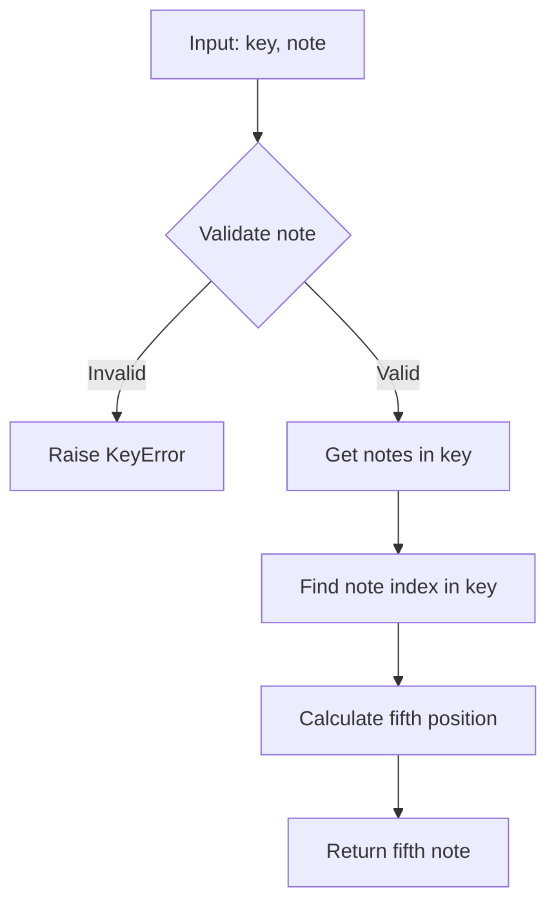
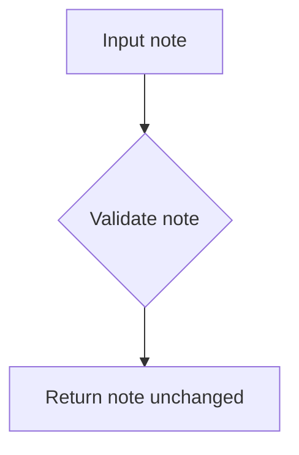
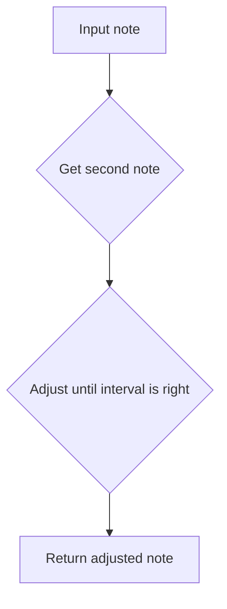
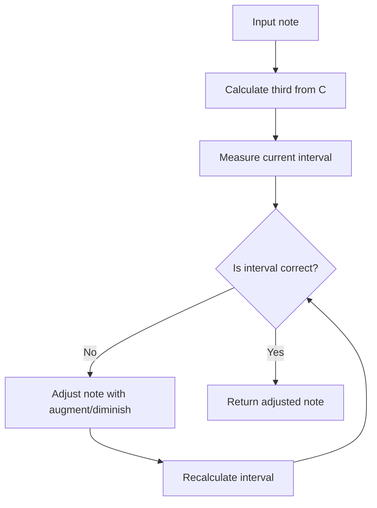
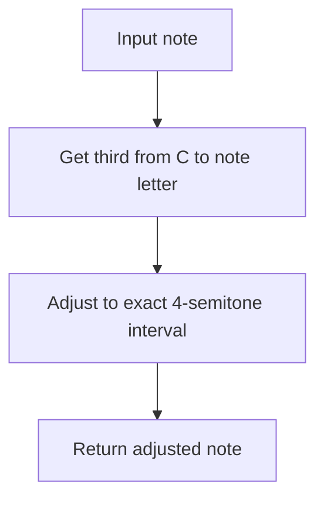

# `intervals.py`

## `mingus.core.intervals.interval` · *function*

## Summary:
Calculates the note at a specified interval distance from a starting note within a musical key.

## Description:
This function computes the musical note that lies a given number of intervals away from a starting note within the context of a specific musical key. It's commonly used in music theory applications to navigate scales and chords.

The function validates the starting note, retrieves all notes in the specified key, locates the starting note within that key's scale, and returns the note at the calculated interval position using modular arithmetic.

## Args:
    key (str): The musical key (e.g., "C", "G", "Dm") for which to calculate the interval
    start_note (str): The starting note (e.g., "C", "E", "G") from which to calculate the interval
    interval (int): The interval distance to move from the starting note (positive or negative)

## Returns:
    str: The musical note at the calculated interval position within the specified key

## Raises:
    KeyError: When the start_note is not a valid musical note

## Constraints:
    Preconditions:
        - The start_note must be a valid musical note according to the notes.is_valid_note() function
        - The key must be a valid musical key according to the keys.is_valid_key() function
    
    Postconditions:
        - The returned note will always be a valid note from the specified key's scale
        - The interval calculation wraps around the 7-note diatonic scale using modulo 7 arithmetic

## Side Effects:
    None

## Control Flow:
```mermaid
flowchart TD
    A[Start interval calculation] --> B{Is start_note valid?}
    B -- No --> C[Raise KeyError]
    B -- Yes --> D[Get notes in key]
    D --> E[Find start_note index in key notes]
    E --> F[Calculate new index: (index + interval) % 7]
    F --> G[Return note at new index]
```

## Examples:
    >>> interval("C", "C", 2)
    "E"
    >>> interval("G", "D", 3)
    "F#"
    >>> interval("Dm", "A", -1)
    "G"

## `mingus.core.intervals.unison` · *function*

## Summary:
Returns the same note as provided, implementing a unison interval with zero semitones.

## Description:
This function implements a unison interval by calling the interval function with the same note as both the starting note and key, and zero as the interval distance. It effectively returns the input note unchanged while performing validation against the musical key if provided.

## Args:
    note (str): A valid musical note string (e.g., 'C', 'D#', 'Bb')
    key (str, optional): The musical key context for note validation. Defaults to None.

## Returns:
    str: The same note string that was passed as input, validated against the key if provided.

## Raises:
    KeyError: When the note is not valid according to the notes.is_valid_note function.
    NoteFormatError: When the key is not recognized by the keys.is_valid_key function.

## Constraints:
    Preconditions:
        - The note must be a valid musical note format (single letter followed by accidentals like # or b)
        - The key, if provided, must be a recognized musical key
    Postconditions:
        - Returns the exact same note string that was passed in
        - Note validation occurs if key is provided

## Side Effects:
    None

## Control Flow:
```mermaid
flowchart TD
    A[unison(note, key=None)] --> B{note valid?}
    B -->|No| C[KeyError]
    B -->|Yes| D{key provided?}
    D -->|No| E[return note]
    D -->|Yes| F[validate note against key]
    F --> G[return note]
```

## Examples:
    >>> unison('C')
    'C'
    
    >>> unison('D#')
    'D#'
    
    >>> unison('Bb', 'C')
    'Bb'

## `mingus.core.intervals.second` · *function*

## Summary:
Returns the second note in a musical key's scale starting from a given note.

## Description:
This function calculates the second degree of a musical scale by taking a starting note and key, then returning the note that is one position higher in the key's note sequence. It's part of a family of interval functions that calculate different degrees of musical scales (first, second, third, fourth, fifth, sixth, seventh, octave).

The function leverages the `interval` helper function with a fixed interval value of 1 to compute the result. This extraction into its own function provides a clean interface for accessing the second degree of any musical scale while maintaining consistency with other interval calculation functions in the module.

## Args:
    note (str): A valid musical note (e.g., 'C', 'D#', 'Eb') to start from
    key (str): The musical key (e.g., 'C', 'G', 'Dm') that defines the scale

## Returns:
    str: The second note in the specified key's scale, following the same format as the input note

## Raises:
    KeyError: When the provided note is not a valid musical note according to `notes.is_valid_note()`

## Constraints:
    Preconditions:
        - The note parameter must be a valid musical note string
        - The key parameter must be a recognized musical key
    Postconditions:
        - Returns a valid musical note that exists in the specified key's scale
        - The returned note maintains the same accidental (sharp/sharp) as the input note when applicable

## Side Effects:
    None

## Control Flow:
```mermaid
flowchart TD
    A[second(note, key)] --> B{Is note valid?}
    B -- No --> C[Raise KeyError]
    B -- Yes --> D[Get notes in key]
    D --> E[Find index of note in key]
    E --> F[Return note at (index + 1) % 7]
```

## Examples:
    >>> second('C', 'C')
    'D'
    >>> second('D', 'G')
    'A'
    >>> second('Eb', 'Bb')
    'F#'

## `mingus.core.intervals.third` · *function*

## Summary:
Computes a note that is two positions away from the starting note in the specified musical key's scale.

## Description:
This function calculates a note that is positioned two intervals away from the specified starting note within the context of the given musical key. It serves as a utility for quickly determining notes that are a specific interval distance from a reference note in a particular key.

The function internally delegates to the `interval` function with a fixed interval value of 2, making it a specialized wrapper for calculating third-degree intervals in musical scales.

## Args:
    note (str): The starting note from which to calculate the interval, e.g., "C", "D#", etc.
    key (str): The musical key in which to calculate the interval, e.g., "C", "G", "A#", etc.

## Returns:
    str: The note that is positioned two intervals away from the starting note in the key's scale.

## Raises:
    KeyError: When the specified start note is not a valid musical note.

## Constraints:
    Preconditions:
    - The note parameter must be a valid musical note string (e.g., "C", "D#", "Bb")
    - The key parameter must be a valid musical key string (e.g., "C", "G", "A#")

    Postconditions:
    - Returns a valid musical note string that exists in the specified key's scale
    - The returned note is positioned at the second index (0-based) relative to the starting note in the key's scale

## Side Effects:
    None

## Control Flow:
```mermaid
flowchart TD
    A[third(note, key)] --> B{Validate note}
    B -- Invalid note --> C[Raise KeyError]
    B -- Valid note --> D[Get notes in key]
    D --> E[Find note index in scale]
    E --> F[Calculate position with interval 2]
    F --> G[Return resulting note]
```

## Examples:
    >>> third("C", "C")
    "E"
    >>> third("D", "G")
    "B"
    >>> third("A", "D")
    "F#"

## `mingus.core.intervals.fourth` · *function*

## Summary:
Computes the note that forms a perfect fourth interval above a given note within a specified musical key.

## Description:
This function calculates the musical note that lies exactly a perfect fourth interval above the specified starting note within the context of the given musical key. It delegates the actual interval calculation to the `interval` function with a fixed interval value of 3.

## Args:
    note (str): A valid musical note identifier to serve as the starting point for the interval calculation.
    key (str): A valid musical key identifier that defines the tonal context for the interval calculation.

## Returns:
    str: The musical note that forms a perfect fourth interval above the input note within the specified key.

## Raises:
    KeyError: When the input note is not a valid musical note format.
    NoteFormatError: When the input key is not a recognized musical key format.

## Constraints:
    Preconditions:
        - The note parameter must be a valid musical note string
        - The key parameter must be a recognized musical key
    Postconditions:
        - The returned note will be a valid musical note within the specified key's scale
        - The returned note will be exactly a perfect fourth interval above the input note

## Side Effects:
    None

## Control Flow:
```mermaid
flowchart TD
    A[Call fourth(note, key)] --> B[Call interval(key, note, 3)]
    B --> C[Return result]
```

## Examples:
    >>> fourth('C', 'F')
    'F'
    >>> fourth('E', 'A')
    'A'
    >>> fourth('B', 'E')
    'E'

## `mingus.core.intervals.fifth` · *function*

## Summary:
Returns the note that is a perfect fifth interval away from a starting note within a musical key.

## Description:
This function calculates the note that is a perfect fifth interval (4 semitones) away from the specified starting note within the given musical key. It internally calls the general interval calculation function with a fixed interval value of 4.

## Args:
    key (str): The musical key (e.g., "C", "G", "Dm") in which to calculate the interval.
    note (str): The starting note from which to calculate the fifth interval. Must be a valid note name.

## Returns:
    str: The note name that represents the perfect fifth interval in the specified key.

## Raises:
    KeyError: When the provided note is not a valid note name according to the notes module validation.

## Constraints:
    Preconditions:
        - The note parameter must be a valid note name recognized by the notes.is_valid_note() function
        - The key parameter must be a valid key name recognized by the keys.is_valid_key() function
    Postconditions:
        - The returned note will be a valid note name in the same octave as the input note
        - The returned note will be positioned at the fifth degree of the specified key's scale

## Side Effects:
    None

## Control Flow:


## Examples:
    >>> fifth('G', 'C')
    'D'
    >>> fifth('A', 'E')
    'B'
    >>> fifth('D', 'A')
    'E'

## `mingus.core.intervals.sixth` · *function*

## Summary:
Returns the note that is five positions away from the starting note in a musical key's scale.

## Description:
This function computes the note that corresponds to the sixth interval in a musical key by calling the general interval function with a fixed interval value of 5. It determines the position of the starting note in the key's diatonic scale and returns the note at position (index + 5) % 7.

## Args:
    note (str): A valid musical note identifier (e.g., 'C', 'D#', 'Bb') to serve as the starting point.
    key (str): A valid musical key identifier (e.g., 'C', 'G', 'Eb') defining the tonal context.

## Returns:
    str: The note that represents the sixth interval in the specified key's scale.

## Raises:
    KeyError: When the provided note is not a valid musical note format.
    NoteFormatError: When the provided key is not a recognized musical key format.

## Constraints:
    Preconditions:
        - The note parameter must be a valid musical note string according to the notes.is_valid_note function.
        - The key parameter must be a valid musical key string according to the keys.is_valid_key function.
    
    Postconditions:
        - The returned note will always be a valid note in the specified key's scale.
        - The result will be one of the seven notes in the key's diatonic scale.

## Side Effects:
    None

## Control Flow:
```mermaid
flowchart TD
    A[Call sixth(note, key)] --> B{Validate note}
    B -- Invalid --> C[Raise KeyError]
    B -- Valid --> D{Validate key}
    D -- Invalid --> E[Raise NoteFormatError]
    D -- Valid --> F[Call interval(key, note, 5)]
    F --> G[Return result]
```

## Examples:
    >>> sixth('C', 'C')
    'A'
    >>> sixth('D', 'G')
    'B'
    >>> sixth('F', 'C')
    'D'

## `mingus.core.intervals.seventh` · *function*

## Summary
Calculates the seventh degree of a musical scale given a starting note and key.

## Description
This function determines the seventh note in a musical scale by leveraging the interval calculation system. It serves as a specialized wrapper around the general interval function to specifically compute seventh intervals.

The function is designed to work within a music theory framework where musical keys and notes are represented as strings, and scales are derived from these keys.

## Args
    note (str): The starting note from which to calculate the seventh interval. Must be a valid musical note (e.g., 'C', 'D#', 'Bb').
    key (str): The musical key that defines the scale context (e.g., 'C', 'G', 'Am').

## Returns
    str: The note that represents the seventh degree of the specified key's scale, starting from the given note.

## Raises
    KeyError: When the provided note is not a valid musical note according to the notes.is_valid_note validation.

## Constraints
    Preconditions:
        - The note parameter must be a valid musical note string recognized by the notes module
        - The key parameter must be a valid musical key recognized by the keys module
    
    Postconditions:
        - The returned value is always a note string that exists within the key's scale
        - The function will always return a note from the same octave as the input note

## Side Effects
    None

## Control Flow
```mermaid
flowchart TD
    A[seventh(note, key)] --> B{Validate note}
    B -- Invalid note --> C[Raise KeyError]
    B -- Valid note --> D[Get notes in key]
    D --> E[Find note position in scale]
    E --> F[Calculate seventh position]
    F --> G[Return seventh note]
```

## Examples
    # Calculate the seventh of C major starting from D
    result = seventh('D', 'C')
    # Returns the note representing the seventh degree of the C major scale
    
    # Calculate the seventh of G major starting from A
    result = seventh('A', 'G')
    # Returns the note representing the seventh degree of the G major scale

## `mingus.core.intervals.minor_unison` · *function*

## Summary:
Returns the diminished version of a musical note, implementing the minor unison interval transformation.

## Description:
This function transforms a musical note into its diminished form, which represents a minor unison interval. In music theory, a minor unison is equivalent to a diminished unison, reducing the pitch by one semitone. The function delegates to the underlying `notes.diminish()` implementation.

## Args:
    note (str or Note): A musical note represented as a string (e.g., 'C', 'D#') or Note object to be diminished.

## Returns:
    str or Note: The diminished version of the input note, one semitone lower than the original note.

## Raises:
    Exception: May raise exceptions from the underlying `notes.diminish()` function when processing invalid note inputs.

## Constraints:
    Preconditions: The input note must be a valid musical note that can be processed by the `notes.diminish()` function.
    Postconditions: The returned note will represent the input note transposed down by one semitone.

## Side Effects:
    None

## Control Flow:
```mermaid
flowchart TD
    A[minor_unison(note)] --> B[notes.diminish(note)]
    B --> C[Return diminished note]
```

## Examples:
    >>> minor_unison('C')
    'Cb'
    >>> minor_unison('A#')
    'A'

## `mingus.core.intervals.major_unison` · *function*

## Summary:
Returns a musical note unchanged, representing the major unison interval.

## Description:
This function implements the major unison interval, which is the interval between a note and itself. It serves as a foundational building block for interval calculations and is particularly useful when working with interval arithmetic where some intervals do not modify the original note.

## Args:
    note: A musical note object, typically represented as a string or note class instance (e.g., "C", "D#", etc.)

## Returns:
    The same note object passed as input, unchanged

## Raises:
    None

## Constraints:
    Preconditions: The input must be a valid musical note representation
    Postconditions: The returned note is identical to the input note

## Side Effects:
    None

## Control Flow:


## Examples:
    >>> major_unison("C")
    "C"
    >>> major_unison("A#")
    "A#"

## `mingus.core.intervals.augmented_unison` · *function*

## Summary:
Returns the augmented (sharpened) version of a musical note.

## Description:
This function applies an augmentation (sharp) to a given musical note by adding a sharp symbol (#) to the note name. It serves as a convenience wrapper around the underlying `notes.augment` function, providing a semantically meaningful name for the operation of sharpening a note.

## Args:
    note (str): A string representing a musical note, such as "C", "D#", or "Bb". The note should be in standard musical notation format.

## Returns:
    str: The augmented (sharpened) version of the input note, with a sharp symbol (#) appended. For flat notes like "Bb", it removes the flat and returns the equivalent sharp note.

## Raises:
    None explicitly raised, though the underlying `notes.augment` function may raise exceptions if the input note format is invalid.

## Constraints:
    Preconditions:
    - The input note must be a valid musical note string in standard notation
    - The note should not contain invalid characters or formatting
    
    Postconditions:
    - The returned note will have a sharp symbol (#) appended, or will be converted from flat to sharp notation

## Side Effects:
    None

## Control Flow:
```mermaid
flowchart TD
    A[Input note] --> B{Note ends with "b"?}
    B -- Yes --> C[Remove last character]
    C --> D[Return note without flat]
    B -- No --> E[Append "#" to note]
    E --> F[Return augmented note]
```

## Examples:
    >>> augmented_unison("C")
    "C#"
    
    >>> augmented_unison("Bb")
    "B"
    
    >>> augmented_unison("F#")
    "F##"

## `mingus.core.intervals.minor_second` · *function*

## Summary
Calculates the note that forms a minor second interval (one semitone) with the given note.

## Description
This function determines the note that creates a minor second (one semitone) interval above the input note. It works by first finding the second degree of the C major scale starting from the note's letter, then adjusting that note upward or downward until it forms exactly a minor second interval with the original note.

The function is extracted into its own component to encapsulate the logic for calculating minor second intervals, separating this specific musical interval calculation from other interval-related operations in the system.

## Args
    note (str): A musical note represented as a string (e.g., "C", "D#", "Bb"). The note must be a valid musical note format.

## Returns
    str: The note that forms a minor second interval with the input note. This will be a note that is one semitone higher than the input note.

## Raises
    KeyError: If the input note is not a valid note format.
    NoteFormatError: If the note format is unknown or invalid.

## Constraints
    Preconditions:
        - The input note must be a valid musical note string
        - The note must be in a format recognized by the notes module
    
    Postconditions:
        - The returned note will be exactly one semitone higher than the input note
        - The returned note will be in a valid musical note format

## Side Effects
    None

## Control Flow


## Examples
    >>> minor_second("C")
    "C#"
    >>> minor_second("D#")
    "E"
    >>> minor_second("Bb")
    "B"
```

## `mingus.core.intervals.major_second` · *function*

## Summary:
Computes the major second interval for a given musical note.

## Description:
This function calculates the major second interval (two semitones) for a specified musical note. It determines the second note in the scale starting from the given note and adjusts it to ensure it forms a proper major second interval. This function is part of the interval calculation utilities in the mingus music theory library.

The function is typically used in music theory applications where interval arithmetic is needed, such as chord construction, scale generation, or melody analysis. It's designed to work with standard Western musical notation where notes are represented as strings (e.g., "C", "D#", "Bb").

## Args:
    note (str): A musical note represented as a string (e.g., "C", "D#", "Bb"). The note should be a valid musical note format where the first character is a letter (C, D, E, F, G, A, B) and subsequent characters are accidentals (# or b).

## Returns:
    str: The note that represents the major second interval above the input note. The returned note maintains proper musical notation conventions (e.g., using sharps or flats appropriately).

## Raises:
    KeyError: Raised by the `interval` function when the start note is not a valid note format.
    NoteFormatError: Raised by `notes.note_to_int` when the note format is invalid.

## Constraints:
    Preconditions:
    - The input note must be a valid musical note string (e.g., "C", "D#", "Bb")
    - The note must follow standard musical notation conventions where the first character is a letter and subsequent characters are accidentals
    
    Postconditions:
    - The returned note will be exactly one major second (two semitones) above the input note
    - The returned note will maintain proper musical notation formatting

## Side Effects:
    None - This function is pure and has no side effects.

## Control Flow:
```mermaid
flowchart TD
    A[Input note] --> B{Validate note}
    B -- Valid --> C[Get second note in scale using note[0] and "C"]
    C --> D[Calculate interval between notes]
    D --> E{Is interval correct?}
    E -- No --> F[Adjust note with augment/diminish]
    F --> G[Recalculate interval]
    G --> E
    E -- Yes --> H[Return adjusted note]
    B -- Invalid --> I[Throw KeyError]
```

## Examples:
```python
# Basic usage
result = major_second("C")  # Returns "D"
result = major_second("A#")  # Returns "B#"
result = major_second("Bb")  # Returns "C"

# Error handling
try:
    major_second("XYZ")  # Raises KeyError
except KeyError:
    print("Invalid note format")
```

## `mingus.core.intervals.minor_third` · *function*

## Summary:
Calculates the minor third interval above a given note.

## Description:
This function determines the minor third interval (exactly 3 semitones above the root note) for a given musical note. It computes the appropriate note that forms a minor third interval with the input note.

The function is extracted into its own component to encapsulate the logic for calculating minor thirds, separating this specific interval calculation from other interval operations and making it reusable throughout the music theory processing system.

## Args:
    note (str): A musical note represented as a string (e.g., "C", "D#", "Bb"). The note should be a valid musical note format.

## Returns:
    str: The note that represents the minor third interval above the input note. The returned note maintains the same accidental (sharp, flat, or natural) as the input note when possible, but may be adjusted to ensure the interval is exactly 3 semitones.

## Raises:
    KeyError: If the input note is not a valid note format.
    NoteFormatError: If the note format is unrecognized or invalid.

## Constraints:
    Preconditions:
        - The input note must be a valid musical note string
        - The note must be in a format recognized by the notes module
    
    Postconditions:
        - The returned note will represent exactly a minor third interval (3 semitones) above the input note
        - The returned note will be in a valid musical note format

## Side Effects:
    None

## Control Flow:


## Examples:
    >>> minor_third("C")
    "Eb"
    >>> minor_third("D#")
    "F##"
    >>> minor_third("Bb")
    "D"
```

## `mingus.core.intervals.major_third` · *function*

## Summary:
Computes the major third interval of a given note by determining the third interval from C and adjusting it to ensure exactly four semitones distance.

## Description:
This function calculates the major third interval for a given musical note. It first determines the third interval from C to the note's letter class, then adjusts the resulting note to ensure it represents exactly a major third (four semitones) above the input note. This approach ensures proper enharmonic spelling of the resulting note.

The logic is extracted into its own function to encapsulate the specific algorithm for computing major thirds, separating this musical interval calculation from general interval arithmetic operations and making it reusable for various musical applications.

## Args:
    note (str): A musical note represented as a string (e.g., "C", "D#", "Bb"). The note can include accidentals.

## Returns:
    str: The major third interval of the input note, represented as a note string with appropriate accidentals to ensure it's exactly four semitones above the input note.

## Raises:
    KeyError: If the input note is not a valid note format according to the notes module validation.

## Constraints:
    Preconditions:
        - The input note must be a valid note string recognized by the notes module
        - The note should be in standard musical notation format (e.g., "C", "D#", "Bb")

    Postconditions:
        - The returned note will be exactly a major third (4 semitones) above the input note
        - The returned note will be in valid musical notation format

## Side Effects:
    None

## Control Flow:


## Examples:
    >>> major_third("C")
    "E"
    >>> major_third("D#")
    "F##"
    >>> major_third("Bb")
    "D"
```

## `mingus.core.intervals.minor_fourth` · *function*

## Summary:
Calculates the note that forms a minor fourth interval with the given note.

## Description:
This function computes the note that creates a minor fourth interval above the input note. It leverages the fourth() function to determine the fourth degree of the C major scale from the note's letter name, then uses augment_or_diminish_until_the_interval_is_right() to adjust the result to ensure it forms the correct interval with the original note.

The function is extracted into its own component to encapsulate the specific logic for calculating minor fourth intervals, providing a clean interface for this particular interval type while maintaining consistency with other interval calculations in the system.

## Args:
    note (str): A musical note represented as a string (e.g., "C", "D#", "Bb"). The note serves as the starting point for calculating the minor fourth interval.

## Returns:
    str: The note that forms a minor fourth interval above the input note. This may involve enharmonic adjustments to ensure proper interval calculation.

## Raises:
    KeyError: If the input note is not a valid note format.
    NoteFormatError: If the note format is unrecognized or invalid.

## Constraints:
    Preconditions:
        - The input note must be a valid musical note string
        - The note must follow standard musical notation conventions (e.g., "C", "D#", "Bb")

    Postconditions:
        - The returned note will form a minor fourth interval with the input note
        - The result will be a valid note string in standard musical notation

## Side Effects:
    None

## Control Flow:
```mermaid
flowchart TD
    A[Input note] --> B[fourth(note[0], "C")]
    B --> C[augment_or_diminish_until_the_interval_is_right(note, frt, 4)]
    C --> D[Return adjusted note]
```

## Examples:
    >>> minor_fourth("C")
    'F'
    >>> minor_fourth("D#")
    'G#'
    >>> minor_fourth("Bb")
    'Eb'
```

## `mingus.core.intervals.major_fourth` · *function*

## Summary:
Computes the note that forms a major fourth interval with the given note.

## Description:
This function calculates the note that creates a major fourth interval (five semitones) above the input note. It first determines the fourth interval from C to the note's pitch, then adjusts it to ensure it represents exactly a major fourth.

## Args:
    note (str): A musical note represented as a string (e.g., "C", "D#", "Bb"). The note should be a valid musical note format.

## Returns:
    str: The note that forms a major fourth interval above the input note. The returned note maintains the same accidental (sharp or flat) as the input note when possible, but may be adjusted to ensure the interval is exactly five semitones.

## Raises:
    KeyError: If the input note is not a valid musical note format.
    NoteFormatError: If the note format is unrecognized or invalid.

## Constraints:
    Preconditions:
        - The input note must be a valid musical note string
        - The note must be in a format recognized by the notes module
    
    Postconditions:
        - The returned note will form exactly a major fourth (5 semitones) interval with the input note
        - The returned note will be in a valid musical note format

## Side Effects:
    None

## Control Flow:
```mermaid
flowchart TD
    A[Input note] --> B[fourth(note[0], "C")]
    B --> C[augment_or_diminish_until_the_interval_is_right(note, frt, 5)]
    C --> D[Return adjusted note]
```

## Examples:
    >>> major_fourth("C")
    "F"
    >>> major_fourth("A#")
    "D#"
    >>> major_fourth("Bb")
    "Eb"
```

## `mingus.core.intervals.perfect_fourth` · *function*

## Summary
Calculates the perfect fourth interval of a given musical note.

## Description
This function serves as an alias for `major_fourth` and computes the perfect fourth interval above the specified note. It's designed to provide a clear, semantically meaningful interface for calculating perfect fourth intervals in musical contexts.

The function delegates to `major_fourth` which implements the complete algorithm involving:
1. Calculating a basic fourth interval using the `fourth` function
2. Adjusting the interval to ensure it's exactly a perfect fourth using `augment_or_diminish_until_the_interval_is_right`

This extraction into a separate function allows for clear semantic distinction between perfect and major fourths while maintaining the same underlying implementation.

## Args
    note (str): A valid musical note string (e.g., 'C', 'D#', 'Bb') representing the starting note for the interval calculation.

## Returns
    str: The note that forms a perfect fourth interval above the input note. Returns a note string in the same format as the input.

## Raises
    KeyError: If the input note is not a valid musical note format.
    NoteFormatError: If the note format is unrecognized by the internal note parsing system.

## Constraints
    Preconditions:
        - The input note must be a valid musical note string recognized by the mingus library
        - The note must conform to standard Western musical notation conventions
    
    Postconditions:
        - The returned note will be a valid musical note string
        - The interval between input and output will be exactly a perfect fourth (5 semitones)

## Side Effects
    None

## Control Flow
```mermaid
flowchart TD
    A[perfect_fourth called with note] --> B[major_fourth(note) called]
    B --> C[fourth(note[0], "C") called]
    C --> D[augment_or_diminish_until_the_interval_is_right called]
    D --> E[Return resulting note]
```

## Examples
    >>> perfect_fourth('C')
    'F'
    >>> perfect_fourth('A#')
    'D#'
    >>> perfect_fourth('Gb')
    'Cb'

## `mingus.core.intervals.minor_fifth` · *function*

## Summary:
Calculates the minor fifth interval of a given musical note.

## Description:
Computes the minor fifth interval by first determining a base fifth interval and then adjusting it to ensure it represents a true minor fifth (six semitones). This function is part of the musical intervals module and follows the same pattern as other interval calculation functions like major_fifth, minor_third, and major_third.

## Args:
    note (str): A musical note represented as a string (e.g., "C", "D#", "Bb"). The note can include accidentals.

## Returns:
    str: The note that forms a minor fifth interval with the input note. The returned note maintains the same accidental structure as the input note but adjusted to form the correct interval.

## Raises:
    KeyError: If the input note is not a valid musical note format.

## Constraints:
    Preconditions:
        - The input note must be a valid musical note string recognized by the notes module
        - The note should follow standard musical notation conventions
    
    Postconditions:
        - The returned note will form exactly a minor fifth (6 semitones) interval with the input note
        - The returned note will maintain a consistent accidental structure

## Side Effects:
    None

## Control Flow:
```mermaid
flowchart TD
    A[Input note] --> B[fifth(note[0], "C")]
    B --> C[augment_or_diminish_until_the_interval_is_right(note, fif, 6)]
    C --> D[Return adjusted note]
```

## Examples:
    >>> minor_fifth("C")
    "G"
    >>> minor_fifth("A#")
    "E#"
    >>> minor_fifth("Bb")
    "F"
```

## `mingus.core.intervals.major_fifth` · *function*

## Summary:
Calculates the major fifth interval of a given musical note.

## Description:
Computes the note that forms a major fifth interval (7 semitones) with the input note. This function handles enharmonic equivalents by adjusting accidentals to ensure the resulting interval is exactly a major fifth.

## Args:
    note (str): A musical note represented as a string (e.g., "C", "D#", "Bb"). The note can include accidentals.

## Returns:
    str: The note that forms a major fifth interval with the input note. May include accidentals to maintain proper interval distance.

## Raises:
    KeyError: If the input note is not a valid musical note format.

## Constraints:
    Preconditions:
        - The input note must be a valid musical note string
        - The note should follow standard musical notation conventions
    
    Postconditions:
        - The returned note will be exactly 7 semitones away from the input note
        - The result maintains proper musical interval relationships

## Side Effects:
    None

## Control Flow:
```mermaid
flowchart TD
    A[Input note] --> B[fifth(note[0], "C")]
    B --> C[augment_or_diminish_until_the_interval_is_right(note, fif, 7)]
    C --> D[Return adjusted note]
```

## Examples:
    >>> major_fifth("C")
    "G"
    >>> major_fifth("D#")
    "B#"
    >>> major_fifth("Bb")
    "F#"
```

## `mingus.core.intervals.perfect_fifth` · *function*

## Summary:
Computes the perfect fifth interval above a given musical note.

## Description:
This function calculates the perfect fifth interval (seven semitones above the given note) by delegating to the major_fifth function. In music theory, a perfect fifth is one of the most consonant intervals and serves as a foundational building block for chord construction and harmonic analysis.

## Args:
    note (str): A valid musical note represented as a string (e.g., 'C', 'D#', 'Bb'). The note must be in a format recognized by the notes module.

## Returns:
    str: The note that is a perfect fifth above the input note. Returns a note string in the same format as the input.

## Raises:
    KeyError: If the input note is not a valid note format according to the notes.is_valid_note function.
    NoteFormatError: If the note format is unrecognized or invalid.

## Constraints:
    Preconditions:
        - The input note must be a valid musical note string recognized by the mingus.core.notes module
        - The note must be in a format that can be processed by the underlying interval calculation functions
    
    Postconditions:
        - The returned note will be exactly seven semitones above the input note
        - The returned note will be in the same enharmonic spelling convention as the input note

## Side Effects:
    None

## Control Flow:
```mermaid
flowchart TD
    A[perfect_fifth called with note] --> B[major_fifth(note) called]
    B --> C[fifth(note[0], "C") called]
    C --> D[interval(key, note, 4) called]
    D --> E[get_notes(key) called]
    E --> F[augment_or_diminish_until_the_interval_is_right called]
    F --> G[measure(note1, note2) called]
    G --> H[notes.note_to_int called]
    H --> I[Return perfect fifth note]
```

## Examples:
    >>> perfect_fifth('C')
    'G'
    >>> perfect_fifth('A#')
    'E#'
    >>> perfect_fifth('Bb')
    'F'

## `mingus.core.intervals.minor_sixth` · *function*

## Summary
Calculates the note that forms a minor sixth interval above the given note.

## Description
Computes the note that is a minor sixth (8 semitones) above the specified musical note. This function internally calculates a sixth interval and adjusts it to ensure the result represents exactly 8 semitones above the input note.

## Args
    note (str): A musical note represented as a string (e.g., "C", "D#", "Bb"). The note must be a valid musical note.

## Returns
    str: The note that forms a minor sixth interval above the input note. The returned note will be properly spelled to represent exactly 8 semitones above the input.

## Raises
    KeyError: If the input note is not a valid musical note.

## Constraints
    Precondition: The input note must be a valid musical note according to the system's note validation rules.
    Postcondition: The returned note will form exactly an 8-semitone interval above the input note.

## Side Effects
    None

## Control Flow
```mermaid
flowchart TD
    A[Input note] --> B[sixth(note[0], "C")]
    B --> C[augment_or_diminish_until_the_interval_is_right(note, sth, 8)]
    C --> D[Return adjusted note]
```

## Examples
    >>> minor_sixth("C")
    "A"
    >>> minor_sixth("D#")
    "B#"
    >>> minor_sixth("Bb")
    "F"

## `mingus.core.intervals.major_sixth` · *function*

## Summary
Calculates the major sixth interval from a given musical note.

## Description
Computes the major sixth interval by first determining a sixth interval from C, then adjusting it to ensure it represents exactly a major sixth (9 semitones) from the input note. This function handles the complexity of interval calculation and adjustment in musical contexts.

## Args
    note (str): A musical note string (e.g., "C", "D#", "Bb") representing the starting note for the interval calculation. The note string should follow standard musical notation where the first character represents the base note (C, D, E, F, G, A, B) and subsequent characters represent accidentals (# or b).

## Returns
    str: The note that represents the major sixth interval from the input note. The returned note maintains the same accidental (sharp/flats) as the input note when possible, but may be adjusted to ensure the interval is exactly 9 semitones.

## Raises
    KeyError: If the input note is not a valid musical note format.

## Constraints
    Preconditions:
        - The input note must be a valid musical note string recognized by the notes module
        - The note should be in standard musical notation format (e.g., "C", "D#", "Bb")

    Postconditions:
        - The returned note represents exactly a major sixth interval (9 semitones) from the input note
        - The result follows standard musical interval naming conventions

## Side Effects
    None

## Control Flow
```mermaid
flowchart TD
    A[Input note] --> B[sixth(note[0], "C")]
    B --> C[augment_or_diminish_until_the_interval_is_right(note, sth, 9)]
    C --> D[Return adjusted note]
```

## Examples
    >>> major_sixth("C")
    "A"
    >>> major_sixth("D#")
    "C##"
    >>> major_sixth("Bb")
    "G"

## `mingus.core.intervals.minor_seventh` · *function*

## Summary:
Calculates the minor seventh interval from a given musical note.

## Description:
This function determines the note that forms a minor seventh interval with the input note. A minor seventh spans 10 semitones. The function first calculates the seventh interval from the input note using a fixed key of "C", then adjusts the resulting note to ensure it represents exactly a minor seventh interval.

## Args:
    note (str): A musical note represented as a string (e.g., "C", "D#", "Bb"). The function extracts the first character of the note string to determine the base note for interval calculation.

## Returns:
    str: The note that forms a minor seventh interval with the input note. The returned note maintains the same letter name but may have accidentals added or removed to achieve the correct interval.

## Raises:
    KeyError: If the input note is not a valid musical note, as validated by the notes.is_valid_note() function.

## Constraints:
    Preconditions:
        - The input note must be a valid musical note string
        - The note should be in a format recognized by the notes module
    
    Postconditions:
        - The returned note will form exactly a minor seventh (10 semitones) interval with the input note
        - The returned note will be in a standard musical notation format

## Side Effects:
    None

## Control Flow:
```mermaid
flowchart TD
    A[Input note] --> B{Extract first char}
    B --> C[Calculate seventh from C]
    C --> D[Adjust to minor seventh (10 semitones)]
    D --> E[Return adjusted note]
```

## Examples:
    >>> minor_seventh("C")
    "Bb"
    >>> minor_seventh("A")
    "G"
    >>> minor_seventh("D#")
    "C"

## `mingus.core.intervals.major_seventh` · *function*

## Summary
Computes the major seventh interval of a given musical note by adjusting the seventh degree to achieve exactly 11 semitones.

## Description
This function calculates the major seventh interval above a specified musical note. It first determines the seventh degree of the note in the key of C, then applies adjustment logic to ensure the resulting interval is exactly 11 semitones (a major seventh) between the input note and the result.

The function serves as a utility for interval calculation in musical applications, specifically for generating major seventh intervals from any given note.

## Args
    note (str): A musical note represented as a string (e.g., "C", "D#", "Bb"). The note must be a valid musical note format.

## Returns
    str: The major seventh interval of the input note, represented as a musical note string. The returned note forms a major seventh interval (11 semitones) with the input note.

## Raises
    KeyError: If the input note is not a valid note format according to the notes.is_valid_note function.

## Constraints
    Preconditions:
        - The input note must be a valid musical note string recognized by the notes module
        - The note should follow standard musical notation conventions (e.g., "C", "D#", "Bb")

    Postconditions:
        - The returned note will form a major seventh interval (11 semitones) with the input note
        - The interval calculation accounts for enharmonic equivalents and proper note spelling

## Side Effects
    None

## Control Flow
```mermaid
flowchart TD
    A[Input note] --> B{Is valid note?}
    B -- No --> C[Raise KeyError]
    B -- Yes --> D[Get seventh in key C]
    D --> E[Adjust interval to 11 semitones]
    E --> F[Return adjusted note]
```

## Examples
    >>> major_seventh("C")
    "B"
    
    >>> major_seventh("A#")
    "G#"
    
    >>> major_seventh("F")
    "E"
```

## `mingus.core.intervals.get_interval` · *function*

## Summary
Computes the musical note that results from applying an interval to a given note within a specific key.

## Description
This function calculates the resulting note when a specified interval is applied to an input note within the context of a musical key. It maps the input note to its position in the key's scale, applies the interval, and returns the appropriate note in the key's scale or a diminished variant if the result falls outside the scale.

## Args
    note (str): A musical note represented as a string (e.g., "C", "D#", "Bb"). The note must be valid.
    interval (int): The interval to apply, expressed as a number of semitones (positive or negative).
    key (str): The musical key in which to calculate the interval. Defaults to "C".

## Returns
    str: The resulting note after applying the interval. If the interval produces a note within the key's scale, returns the standard note. Otherwise, returns a diminished version of the closest note in the scale.

## Raises
    NoteFormatError: When the input note or key is not recognized or invalid.

## Constraints
    Preconditions:
        - The note parameter must be a valid musical note format
        - The key parameter must be a valid musical key
        - The interval parameter should be an integer representing semitones
    
    Postconditions:
        - Always returns a valid musical note string
        - The returned note is either in the key's scale or a diminished variant of a scale note

## Side Effects
    None

## Control Flow
```mermaid
flowchart TD
    A[Start get_interval] --> B[Create intervals from key signature]
    B --> C[Get notes in key]
    C --> D[Loop through key_notes to find note[0] match]
    D --> E[Calculate result = (intervals[index] + interval) % 12]
    E --> F{result in intervals?}
    F -->|Yes| G[Return key_notes[intervals.index(result)] + note[1:]]
    F -->|No| H[Return notes.diminish(key_notes[intervals.index((result+1)%12)] + note[1:])]
```

## Examples
    >>> get_interval("C", 4, "C")
    "E"
    >>> get_interval("C", 12, "C")  
    "C"
    >>> get_interval("C#", 1, "C")
    "Db"
```

## `mingus.core.intervals.measure` · *function*

*No documentation generated.*

## `mingus.core.intervals.augment_or_diminish_until_the_interval_is_right` · *function*

## Summary:
Adjusts a note to achieve a specific interval distance from another note by repeatedly applying augmentation or diminishment operations.

## Description:
This function modifies the second note in a pair until the musical interval between the first and second note matches the desired interval. It works by measuring the current interval, then applying successive augmentations or diminutions to the second note until the target interval is achieved. After achieving the correct interval, it normalizes the resulting note to ensure proper accidentals.

The function is extracted into its own component to encapsulate the complex logic of interval adjustment and normalization, separating concerns from the higher-level musical operations that might need to compute intervals.

## Args:
    note1 (str): The first musical note in standard notation (e.g., "C", "D#", "Bb")
    note2 (str): The second musical note that will be adjusted to achieve the target interval
    interval (int): The target interval size (typically 0-11 representing semitones)

## Returns:
    str: The adjusted note that creates the specified interval with note1

## Raises:
    NoteFormatError: If either note1 or note2 contains invalid note format (propagated from notes.note_to_int())

## Constraints:
    Preconditions:
    - note1 and note2 must be valid note strings recognized by the notes module
    - interval must be an integer between 0 and 11 (inclusive)
    
    Postconditions:
    - The returned note will form the specified interval with note1
    - The note will be properly formatted with appropriate accidentals

## Side Effects:
    None

## Control Flow:
```mermaid
flowchart TD
    A[Start: cur = measure(note1, note2)] --> B{cur != interval?}
    B -- Yes --> C{cur > interval?}
    C -- Yes --> D[note2 = notes.diminish(note2)]
    C -- No --> E[note2 = notes.augment(note2)]
    D --> F[measure(note1, note2)]
    E --> F
    F --> B
    B -- No --> G[Calculate val from note2 accidentals]
    G --> H{val > 6?}
    H -- Yes --> I[val = val % 12; val = -12 + val]
    H -- No --> J{val < -6?}
    J -- Yes --> K[val = val % -12; val = 12 + val]
    J -- No --> L[result = note2[0]]
    I --> L
    K --> L
    L --> M{val > 0?}
    M -- Yes --> N[result = notes.augment(result); val -= 1]
    M -- No --> O{val < 0?}
    O -- Yes --> P[result = notes.diminish(result); val += 1]
    N --> M
    P --> O
    O -- No --> Q[Return result]
```

## Examples:
    # Adjusting a note to create a perfect fifth interval
    result = augment_or_diminish_until_the_interval_is_right("C", "G#", 7)
    
    # Adjusting a note to create a major third interval  
    result = augment_or_diminish_until_the_interval_is_right("A", "C", 4)
```

## `mingus.core.intervals.invert` · *function*

## Summary:
Creates a reversed copy of a musical interval while preserving the original interval unchanged.

## Description:
This function takes a musical interval representation and returns a new list containing the same elements in reverse order. The original interval remains unmodified throughout the operation. This utility function is useful when working with musical intervals that need to be processed in reverse order without affecting the source data.

## Args:
    interval: A mutable sequence-like object representing a musical interval. Must support the `reverse()` method and be convertible to a list.

## Returns:
    list: A new list containing the elements of the input interval in reversed order.

## Raises:
    AttributeError: If the input interval does not have a `reverse()` method.

## Constraints:
    Preconditions: The input interval must be a mutable sequence-like object that supports the `reverse()` method.
    Postconditions: The original interval is restored to its original order after the function completes.

## Side Effects:
    None

## Control Flow:
```mermaid
flowchart TD
    A[Start invert(interval)] --> B{interval.reverse()}
    B --> C[res = list(interval)]
    C --> D{interval.reverse()}
    D --> E[Return res]
```

## Examples:
```python
# Basic usage
original_interval = [0, 4, 7]  # C major triad
reversed_interval = invert(original_interval)
# original_interval remains [0, 4, 7]
# reversed_interval becomes [7, 4, 0]

# With different interval structure
interval = ['C', 'E', 'G']
result = invert(interval)
# interval remains ['C', 'E', 'G']  
# result becomes ['G', 'E', 'C']
```

## `mingus.core.intervals.determine` · *function*

## Summary:
Determines the musical interval between two notes, returning either a descriptive name or shorthand notation.

## Description:
This function calculates the interval between two musical notes, handling both identical note names (unison) and different note names. It provides flexibility in output format through the shorthand parameter, returning either full descriptive names or compact notation. The function is part of the musical interval analysis toolkit in the mingus library.

## Args:
    note1 (str): First musical note in standard notation (e.g., 'C', 'D#', 'Bb')
    note2 (str): Second musical note in standard notation (e.g., 'C', 'D#', 'Bb')  
    shorthand (bool): When True, returns abbreviated notation (e.g., '1', '#1') instead of descriptive names. Defaults to False.

## Returns:
    str: The interval name or shorthand notation. Possible return values include:
        - For unison intervals: "major unison", "augmented unison", "minor unison", "diminished unison", "1", "#1", "b1", "bb1"
        - For other intervals: "perfect fifth", "perfect fourth", "major second", "major third", "major fourth", "major sixth", "major seventh", "augmented second", "augmented third", "augmented fourth", "augmented fifth", "augmented sixth", "augmented seventh", "minor second", "minor third", "minor sixth", "minor seventh", "diminished second", "diminished third", "diminished fourth", "diminished fifth", "diminished sixth", "diminished seventh", or their shorthand equivalents

## Raises:
    None explicitly raised in the function body

## Constraints:
    Preconditions:
        - Both note1 and note2 must be valid musical note strings in standard notation
        - Notes should be represented with proper accidentals (# or b)
        - The notes should be in the same octave range for meaningful interval calculation
    Postconditions:
        - Always returns a string representing a valid musical interval
        - The returned interval is mathematically correct based on the half-step difference between notes

## Side Effects:
    None

## Control Flow:
```mermaid
flowchart TD
    A[Start determine] --> B{note1[0] == note2[0]?}
    B -- Yes --> C[Calculate note values with get_val]
    C --> D{value comparison}
    D --> E{values equal?}
    E -- Yes --> F{shorthand?}
    F -- Yes --> G[Return "1"]
    F -- No --> H[Return "major unison"]
    E -- No --> I{value1 < value2?}
    I -- Yes --> J{shorthand?}
    J -- Yes --> K[Return "#1"]
    J -- No --> L[Return "augmented unison"]
    I -- No --> M{value1 - value2 == 1?}
    M -- Yes --> N{shorthand?}
    N -- Yes --> O[Return "b1"]
    N -- No --> P[Return "minor unison"]
    M -- No --> Q{shorthand?}
    Q -- Yes --> R[Return "bb1"]
    Q -- No --> S[Return "diminished unison"]
    B -- No --> T[Calculate fifth steps from notes.fifths]
    T --> U[Get half notes difference via measure()]
    U --> V[Lookup fifth_steps table]
    V --> W[Compare with maj (major semitone count)]
    W --> X{maj == half_notes?}
    X -- Yes --> Y{current[0] == "fifth"?}
    Y -- Yes --> Z{shorthand?}
    Z -- Yes --> AA[Return "5"]
    Z -- No --> AB[Return "perfect fifth"]
    Y -- No --> AC{current[0] == "fourth"?}
    AC -- Yes --> AD{shorthand?}
    AD -- Yes --> AE[Return "4"]
    AD -- No --> AF[Return "perfect fourth"]
    AC -- No --> AG{shorthand?}
    AG -- Yes --> AH[Return current[1]]
    AG -- No --> AI[Return "major " + current[0]]
    X -- No --> AJ{maj + 1 <= half_notes?}
    AJ -- Yes --> AK{shorthand?}
    AK -- Yes --> AL[Return "#" * (half_notes - maj) + current[1]]
    AK -- No --> AM[Return "augmented " + current[0]]
    AJ -- No --> AN{maj - 1 == half_notes?}
    AN -- Yes --> AO{shorthand?}
    AO -- Yes --> AP[Return "b" + current[1]]
    AO -- No --> AQ[Return "minor " + current[0]]
    AN -- No --> AR{maj - 2 >= half_notes?}
    AR -- Yes --> AS{shorthand?}
    AS -- Yes --> AT[Return "b" * (maj - half_notes) + current[1]]
    AS -- No --> AU[Return "diminished " + current[0]]
```

## Examples:
    >>> determine('C', 'E')
    'major third'
    >>> determine('C', 'E', shorthand=True)
    '3'
    >>> determine('C', 'Cb')
    'diminished unison'
    >>> determine('C', 'C#')
    'augmented unison'
    >>> determine('F', 'C')
    'perfect fifth'
    >>> determine('F', 'C', shorthand=True)
    '5'

## `mingus.core.intervals.from_shorthand` · *function*

## Summary:
Converts musical interval shorthand notation into a specific note based on a starting note and interval specification.

## Description:
This function takes a musical note and an interval shorthand string (like "M2", "m3", "A4", etc.) and returns the resulting note after applying the interval. It handles both ascending and descending intervals and supports accidentals (sharp and flat symbols).

The function parses interval notation where:
- The last character indicates the interval number (1-7)
- Prefix characters indicate the interval quality (M=major, m=minor, A=augmented, d=diminished)
- Accidentals (# or b) modify the resulting note

This logic is extracted into its own function to separate the interval parsing and application logic from the rest of the musical processing code, making it reusable and testable.

## Args:
    note (str): A valid musical note string (e.g., "C", "D#", "Bb")
    interval (str): Interval shorthand string indicating the interval type and quality (e.g., "M2", "m3", "A4")
    up (bool): Direction flag indicating whether to move upward (True) or downward (False) through the interval. Defaults to True.

## Returns:
    str or bool: The resulting note after applying the interval, or False if:
        - The input note is invalid (not recognized by notes.is_valid_note)
        - No matching interval could be found
        - The interval string doesn't contain a valid interval number (1-7)

## Raises:
    None explicitly raised, but may propagate NoteFormatError from underlying functions if note format is invalid.

## Constraints:
    Precondition: The note parameter must be a valid musical note format recognized by the notes module.
    Precondition: The interval parameter must be a valid interval shorthand string ending with a number from 1-7.
    Postcondition: If successful, returns a properly formatted musical note string.
    Postcondition: The returned note will be in the same octave as the input note, adjusted by the interval.

## Side Effects:
    None

## Control Flow:
```mermaid
flowchart TD
    A[Start from_shorthand] --> B{Is note valid?}
    B -- No --> C[Return False]
    B -- Yes --> D[Initialize shorthand_lookup]
    D --> E[Find matching interval number]
    E --> F{Direction up?}
    F -- Yes --> G[Use first function in lookup]
    F -- No --> H[Use second function in lookup]
    G --> I[Set val to result]
    H --> I
    I --> J[Process accidentals in interval]
    J --> K{Accidental is #?}
    K -- Yes --> L{Direction up?}
    L -- Yes --> M[Augment note]
    L -- No --> N[Diminish note]
    K -- No --> O{Accidental is b?}
    O -- Yes --> P{Direction up?}
    P -- Yes --> Q[Diminish note]
    P -- No --> R[Augment note]
    O -- No --> S[Return val]
    M --> S
    N --> S
    Q --> S
    R --> S
```

## Examples:
    from_shorthand("C", "M2")  # Returns "D"
    from_shorthand("C", "m3")  # Returns "Eb"
    from_shorthand("C", "A4")  # Returns "F#"
    from_shorthand("C", "m3", up=False)  # Returns "Ab"
    from_shorthand("X", "M2")  # Returns False (invalid note)
    from_shorthand("C", "9")  # Returns False (interval number not supported)

## `mingus.core.intervals.is_consonant` · *function*

## Summary:
Determines whether two musical notes form a consonant interval by checking both perfect and imperfect consonant conditions.

## Description:
This function evaluates whether two musical notes create a consonant interval according to Western music theory. It combines the results of two separate consonance tests: perfect consonance (unison, fourths, fifths) and imperfect consonance (thirds, sixths). The function is designed to be a convenient interface for consonance checking while maintaining clear separation of concerns between different types of consonant intervals.

## Args:
    note1 (str): The first musical note in standard notation (e.g., 'C', 'D#', 'Bb')
    note2 (str): The second musical note in standard notation (e.g., 'C', 'D#', 'Bb')
    include_fourths (bool): When True, fourth intervals are treated as perfect consonants. When False, fourths are not considered consonant. Defaults to True.

## Returns:
    bool: True if the interval between note1 and note2 is consonant (either perfect or imperfect), False otherwise.

## Raises:
    NoteFormatError: If either note string is not in a valid musical note format.

## Constraints:
    Preconditions:
        - Both note1 and note2 must be valid musical note strings
        - Notes should be in standard notation format (e.g., 'C', 'D#', 'Bb')
    Postconditions:
        - Returns a boolean value indicating consonance status
        - The result is independent of the order of notes (note1, note2) vs (note2, note1) due to the underlying interval measurement

## Side Effects:
    None

## Control Flow:
```mermaid
flowchart TD
    A[is_consonant] --> B{is_perfect_consonant?}
    A --> C{is_imperfect_consonant?}
    B -- Yes --> D[Return True]
    B -- No --> E{is_imperfect_consonant?}
    E -- Yes --> D
    E -- No --> F[Return False]
    C -- Yes --> D
    C -- No --> F
```

## Examples:
    >>> is_consonant('C', 'E')
    True
    >>> is_consonant('C', 'F')
    True
    >>> is_consonant('C', 'F', include_fourths=False)
    False
    >>> is_consonant('C', 'A')
    True
    >>> is_consonant('C', 'D')
    False
```

## `mingus.core.intervals.is_perfect_consonant` · *function*

## Summary:
Determines whether two musical notes form a perfect consonant interval.

## Description:
This function evaluates whether two musical notes create a perfect consonant interval, which includes unison (0 semitones), perfect fifth (7 semitones), or perfect fourth (5 semitones) when included. Perfect consonances are fundamental harmonic intervals that sound stable and resolved.

## Args:
    note1 (str or Note): The first musical note.
    note2 (str or Note): The second musical note.
    include_fourths (bool): Whether to consider perfect fourths as perfect consonants. Defaults to True.

## Returns:
    bool: True if the interval between note1 and note2 is a perfect consonance (0, 5, or 7 semitones), False otherwise.

## Raises:
    NoteFormatError: When either note string is invalid and cannot be parsed.

## Constraints:
    Preconditions:
        - Both note1 and note2 must be valid note representations (e.g., "C", "D#", "Bb")
        - Notes must be in the same octave range for meaningful interval comparison
    
    Postconditions:
        - Returns a boolean value indicating consonance status
        - The function is symmetric: is_perfect_consonant(a,b) == is_perfect_consonant(b,a)

## Side Effects:
    None

## Control Flow:
```mermaid
flowchart TD
    A[Start is_perfect_consonant] --> B{Measure interval}
    B --> C[Calculate dhalf = measure(note1, note2)]
    C --> D{dhalf in [0,7]?}
    D -- Yes --> E[Return True]
    D -- No --> F{include_fourths AND dhalf == 5?}
    F -- Yes --> G[Return True]
    F -- No --> H[Return False]
```

## Examples:
    >>> is_perfect_consonant("C", "G")
    True
    >>> is_perfect_consonant("C", "F")
    True
    >>> is_perfect_consonant("C", "F", include_fourths=False)
    False
    >>> is_perfect_consonant("C", "E")
    False
```

## `mingus.core.intervals.is_imperfect_consonant` · *function*

## Summary:
Determines whether two musical notes form an imperfect consonant interval.

## Description:
This function evaluates if the interval between two musical notes qualifies as an imperfect consonant. In music theory, imperfect consonants are intervals that are neither perfect consonants (unison, perfect fifth, perfect fourth, octave) nor dissonant intervals. The function returns True for intervals 3, 4, 8, and 9 (representing minor third, major third, minor sixth, and major sixth respectively).

## Args:
    note1 (str): The first musical note in standard notation (e.g., 'C', 'D#', 'Bb')
    note2 (str): The second musical note in standard notation (e.g., 'E', 'F#', 'Ab')

## Returns:
    bool: True if the interval between note1 and note2 is an imperfect consonant (3, 4, 8, or 9 semitones), False otherwise.

## Raises:
    NoteFormatError: If either note string is not in a valid format recognized by the notes module.

## Constraints:
    Preconditions:
        - Both note1 and note2 must be valid note strings in standard musical notation
        - Notes must be represented using valid note names (A-G) with optional sharps (#) or flats (b)
    
    Postconditions:
        - The function always returns a boolean value
        - The result is determined solely by the interval between the two notes

## Side Effects:
    None

## Control Flow:
```mermaid
flowchart TD
    A[is_imperfect_consonant] --> B[measure(note1, note2)]
    B --> C{interval in [3,4,8,9]?}
    C -->|Yes| D[return True]
    C -->|No| E[return False]
```

## Examples:
    >>> is_imperfect_consonant('C', 'E')
    True  # Major third interval
    
    >>> is_imperfect_consonant('A', 'C')
    True  # Minor third interval
    
    >>> is_imperfect_consonant('G', 'D')
    True  # Perfect fifth interval (not an imperfect consonant)
    
    >>> is_imperfect_consonant('C', 'G')
    False  # Perfect fifth interval (not an imperfect consonant)
```

## `mingus.core.intervals.is_dissonant` · *function*

## Summary:
Determines whether two musical notes form a dissonant interval by negating the consonance test.

## Description:
This function evaluates whether two musical notes create a dissonant interval by inverting the result of the consonance test. It provides a convenient way to identify intervals that are considered dissonant in Western music theory, which typically include seconds, sevenths, and tritones (augmented fourths/flattened fifths).

## Args:
    note1 (Note): The first musical note in the interval.
    note2 (Note): The second musical note in the interval.
    include_fourths (bool): When False (default), fourths are treated as dissonant intervals. When True, fourths are considered consonant intervals. Note that this parameter is inverted internally before being passed to the underlying consonance test.

## Returns:
    bool: True if the interval between note1 and note2 is dissonant, False if it is consonant.

## Raises:
    None explicitly raised by this function.

## Constraints:
    Preconditions:
        - Both note1 and note2 must be valid musical note objects that can be converted to integers.
        - The notes should represent pitches within the standard 12-tone equal temperament system.
    
    Postconditions:
        - Returns a boolean value indicating the dissonance status of the interval.
        - The result is consistent with standard Western music theory conventions.

## Side Effects:
    None.

## Control Flow:
```mermaid
flowchart TD
    A[is_dissonant called] --> B{include_fourths parameter}
    B --> C{invert include_fourths}
    C --> D[call is_consonant(note1, note2, not include_fourths)]
    D --> E[return not result]
```

## Examples:
    >>> from mingus.core import notes
    >>> note1 = notes.Note("C")
    >>> note2 = notes.Note("D")
    >>> is_dissonant(note1, note2)
    True
    >>> is_dissonant(note1, notes.Note("F"), include_fourths=True)
    False
    >>> is_dissonant(note1, notes.Note("B"), include_fourths=False)
    True

