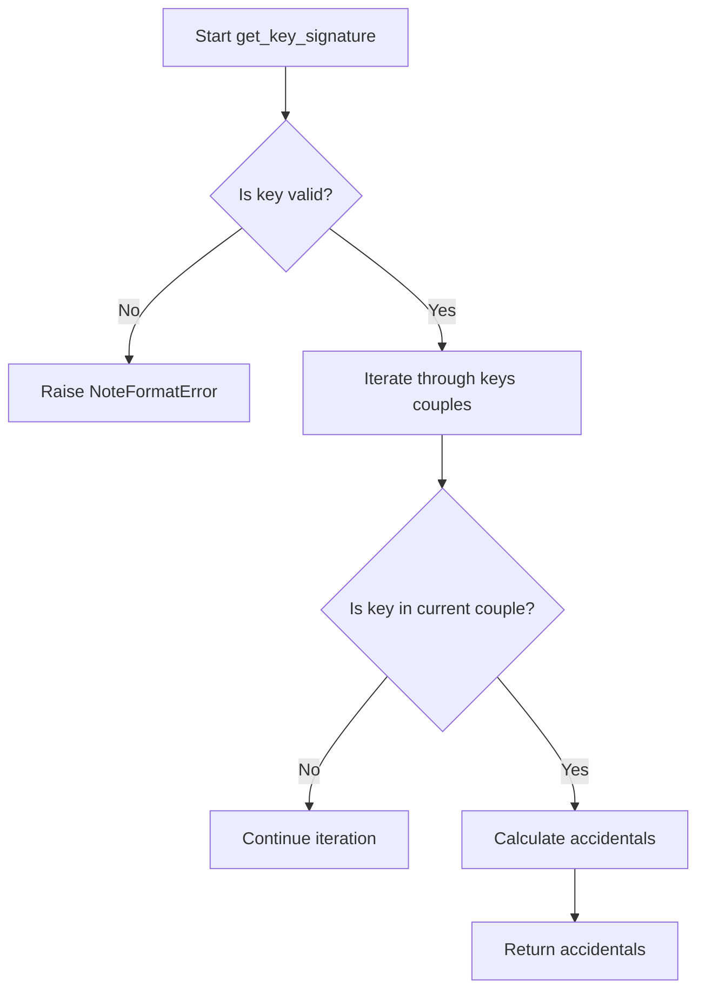
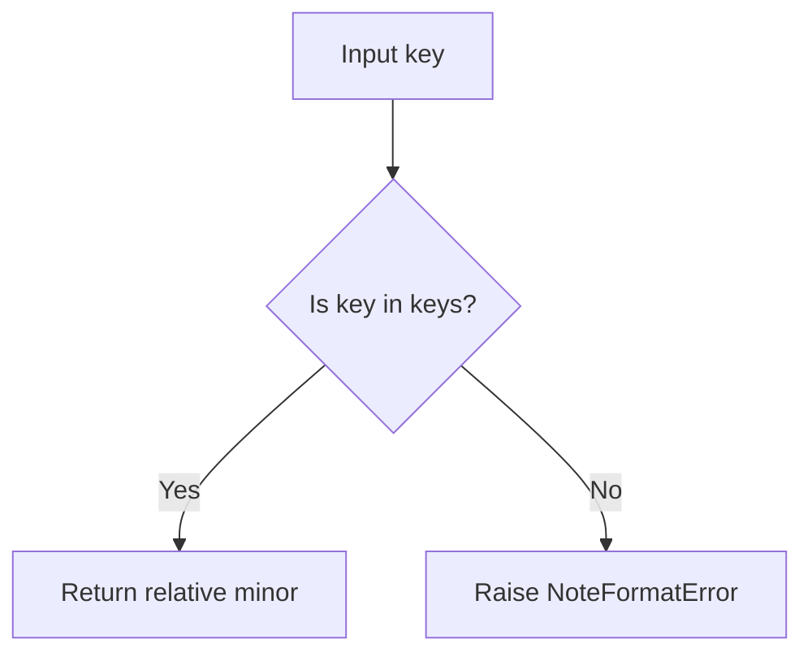
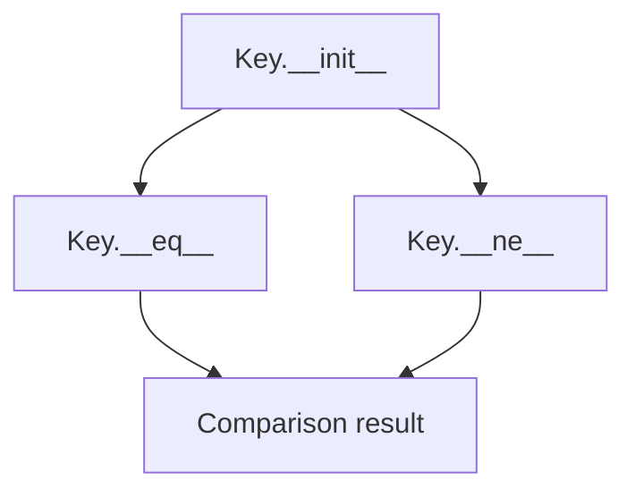

# `keys.py`

## `mingus.core.keys.is_valid_key` · *function*

## Summary:
Validates whether a musical key exists within a collection of predefined key combinations.

## Description:
This function serves as a validation utility to determine if a specified musical key is part of a predefined set of valid key signatures. It iterates through a global collection of key couples and returns True if the key is found in any of them, otherwise returns False. This function is typically used during musical composition or analysis to ensure key specifications conform to established musical conventions.

## Args:
    key: The musical key to validate. This parameter is tested for membership in the global `keys` collection, which contains predefined key combinations.

## Returns:
    bool: True if the key exists in any of the key couples within the global `keys` variable, False otherwise.

## Raises:
    None explicitly raised by this function.

## Constraints:
    Preconditions:
    - The global variable `keys` must be defined and contain iterable collections of key values.
    - The `key` parameter must be compatible with the `in` operator for membership testing against elements in `keys`.

    Postconditions:
    - The function returns a boolean value without modifying any inputs.
    - The global `keys` variable remains unchanged.

## Side Effects:
    None.

## Control Flow:
```mermaid
flowchart TD
    A[Start is_valid_key(key)] --> B{Iterate through keys}
    B --> C{Is key in current couple?}
    C -- Yes --> D[Return True]
    C -- No --> E[Continue iteration]
    E --> F{End of keys?}
    F -- No --> B
    F -- Yes --> G[Return False]
```

## Examples:
    # Assuming keys = [('C', 'D', 'E'), ('F', 'G', 'A')]
    is_valid_key('C')  # Returns True - 'C' is in first couple
    is_valid_key('B')  # Returns False - 'B' is not in any couple
```

## `mingus.core.keys.get_key` · *function*

## Summary:
Returns the musical key corresponding to a specified number of accidentals.

## Description:
This function maps a numeric representation of accidentals (-7 to +7) to a musical key. The mapping uses an internal array where each index corresponds to a specific key based on the number of sharps or flats.

## Args:
    accidentals (int): Number of accidentals, ranging from -7 (seven flats) to +7 (seven sharps). Defaults to 0 (no accidentals).

## Returns:
    The musical key corresponding to the specified number of accidentals. The exact return type depends on the implementation of the internal `keys` array elements.

## Raises:
    RangeError: When the accidentals parameter is outside the valid range of -7 to +7 inclusive.

## Constraints:
    Preconditions:
    - The `accidentals` parameter must be an integer in the range [-7, 7].
    - The `keys` global variable must be properly initialized as a list/array of size 15.
    
    Postconditions:
    - The function returns a valid musical key representation from the internal keys array.
    - The returned value is determined by indexing into the keys array at position `accidentals + 7`.

## Side Effects:
    None

## Control Flow:
```mermaid
flowchart TD
    A[get_key called with accidentals] --> B{accidentals in range [-7,7]?}
    B -- No --> C[Raise RangeError]
    B -- Yes --> D[Return keys[accidentals + 7]]
```

## Examples:
    # Get key with no accidentals (C major/A minor)
    key = get_key(0)
    
    # Get key with 2 sharps (D major/B minor)
    key = get_key(2)
    
    # Get key with 3 flats (Eb major/C minor)
    key = get_key(-3)
```

## `mingus.core.keys.get_key_signature` · *function*

## Summary:
Calculates the number of accidentals (sharps or flats) for a given musical key.

## Description:
This function determines the key signature for a musical key by calculating how many sharps or flats are needed. It's designed to work with standard Western musical keys and returns a value indicating the number of accidentals (positive for sharps, negative for flats).

The function extracts this logic into a separate utility to provide a clean interface for key signature calculations without requiring callers to understand the underlying key organization system.

## Args:
    key (str): A musical key represented as a string (e.g., "C", "G#", "Eb"). Defaults to "C".

## Returns:
    int: Number of accidentals for the key. Positive values indicate sharps, negative values indicate flats. For example:
        - 0 for C major/A minor (no accidentals)
        - 1 for G major/D minor (1 sharp)
        - -1 for F major/D minor (1 flat)
        - 7 for C# major/A# minor (7 sharps)
        - -7 for Cb major/Ab minor (7 flats)

## Raises:
    NoteFormatError: When the provided key string is not recognized as a valid musical key.

## Constraints:
    Preconditions:
        - The key parameter must be a valid musical key string
        - The keys variable must be properly defined in the module scope
    Postconditions:
        - Returns an integer in the range [-7, 7]
        - The returned value accurately represents the key signature

## Side Effects:
    None

## Control Flow:


## Examples:
    # Basic usage
    accidentals = get_key_signature("C")      # Returns 0
    accidentals = get_key_signature("G")      # Returns 1
    accidentals = get_key_signature("F")      # Returns -1
    
    # Error handling
    try:
        accidentals = get_key_signature("InvalidKey")
    except NoteFormatError as e:
        print(f"Error: {e}")

## `mingus.core.keys.get_key_signature_accidentals` · *function*

## Summary:
Returns a list of accidental notes (flats or sharps) required to play in a given musical key.

## Description:
This function determines the specific accidental notes (flats or sharps) needed to play in a particular musical key. It analyzes the key signature and returns the appropriate sequence of notes with accidentals. The function is designed to separate the logic of determining key signatures from the presentation of those signatures as readable note names.

The function is typically called when displaying or working with key signatures in musical notation, particularly when converting a key into its constituent accidental notes.

## Args:
    key (str): The musical key for which to calculate accidentals. Defaults to "C". 
               Should be a valid musical key string (e.g., "C", "G", "D", "A", "E", "B", "F#", "Bb", etc.).

## Returns:
    list[str]: A list of note names with accidentals. Each element is a string representing a note with either "#" (sharp) or "b" (flat) suffix.
               - Empty list if the key has no accidentals (e.g., "C", "A")
               - Notes with "#" suffix for keys with sharps (e.g., ["F#", "C#"])
               - Notes with "b" suffix for keys with flats (e.g., ["Bb", "Eb"])

## Raises:
    NoteFormatError: When the provided key string is not recognized as a valid musical key.

## Constraints:
    Preconditions:
        - The key parameter must be a valid musical key string
        - The key must be supported by the underlying key signature system
    
    Postconditions:
        - Returns a list of strings representing note names with proper accidentals
        - The returned list maintains the correct order of accidentals according to musical theory

## Side Effects:
    None

## Control Flow:
```mermaid
flowchart TD
    A[Start get_key_signature_accidentals] --> B{key_valid?}
    B -- No --> C[NoteFormatError]
    B -- Yes --> D[get_key_signature(key)]
    D --> E{accidentals < 0?}
    E -- Yes --> F[Loop -accidentals times]
    F --> G[Append reversed(fifths)[i] + "b"]
    E -- No --> H{accidentals > 0?}
    H -- Yes --> I[Loop accidentals times]
    I --> J[Append fifths[i] + "#"]
    H -- No --> K[Return empty list]
    G --> L[Return result]
    J --> L
    K --> L
```

## Examples:
    >>> get_key_signature_accidentals("C")
    []
    
    >>> get_key_signature_accidentals("G")
    ['F#']
    
    >>> get_key_signature_accidentals("D")
    ['F#', 'C#']
    
    >>> get_key_signature_accidentals("Bb")
    ['Eb', 'Bb']
```

## `mingus.core.keys.get_notes` · *function*

## Summary:
Generates a list of the seven notes that make up a musical key, including appropriate accidentals.

## Description:
This function computes the set of notes that define a musical key by cycling through the base scale starting from the tonic note, applying sharps or flats as needed based on the key's signature. The result is cached for performance optimization.

## Args:
    key (str): The musical key to generate notes for, e.g., "C", "G#", "Fb". Defaults to "C".

## Returns:
    list[str]: A list of 7 note names representing the notes in the specified key, with proper accidentals applied.

## Raises:
    NoteFormatError: When the provided key string is not recognized or in an invalid format.

## Constraints:
    Preconditions:
    - The key parameter must be a valid musical key string
    - The key must be supported by the module's key definitions
    
    Postconditions:
    - Returns exactly 7 notes for any valid key
    - Notes are returned in proper musical order (tonic to seventh)
    - Accidentals are correctly applied based on key signature

## Side Effects:
    - Modifies the internal `_key_cache` dictionary by storing computed results
    - No external I/O operations or state mutations beyond caching

## Control Flow:
```mermaid
flowchart TD
    A[Start get_notes] --> B{Key in cache?}
    B -- Yes --> C[Return cached result]
    B -- No --> D[Validate key format]
    D --> E{Valid key?}
    E -- No --> F[Raise NoteFormatError]
    E -- Yes --> G[Get altered notes]
    G --> H[Get key signature]
    H --> I{Signature < 0?}
    I -- Yes --> J[Set symbol = "b"]
    I -- No --> K{Signature > 0?}
    K -- Yes --> L[Set symbol = "#"]
    K -- No --> M[Set symbol = ""]
    J --> N
    L --> N
    M --> N
    N --> O[Get tonic index]
    O --> P[Generate 7 notes]
    P --> Q[Apply accidentals]
    Q --> R[Cache result]
    R --> S[Return result]
```

## Examples:
    >>> get_notes("C")
    ['C', 'D', 'E', 'F', 'G', 'A', 'B']
    
    >>> get_notes("G")
    ['G', 'A', 'B', 'C', 'D', 'E', 'F#']
    
    >>> get_notes("F")
    ['F', 'G', 'A', 'Bb', 'C', 'D', 'E']

## `mingus.core.keys.relative_major` · *function*

## Summary:
Maps a minor key to its relative major key in musical theory.

## Description:
This function implements the relationship between minor keys and their relative major keys in Western music theory. Given a minor key (represented as a string), it returns the corresponding relative major key. This mapping is fundamental in music theory where each minor key shares the same key signature as its relative major key.

## Args:
    key (str): A string representation of a minor key (e.g., "c-minor", "a-minor")

## Returns:
    str: The relative major key corresponding to the input minor key

## Raises:
    NoteFormatError: When the input key is not recognized as a valid minor key

## Constraints:
    Preconditions:
    - Input key must be a valid minor key string format recognized by the module
    - The keys variable must contain proper mappings of (relative_major, minor_key) tuples
    
    Postconditions:
    - Returns a valid major key string that corresponds to the relative major of the input minor key
    - Raises NoteFormatError for invalid minor key inputs

## Side Effects:
    None

## Control Flow:
```mermaid
flowchart TD
    A[Input key] --> B{Search keys collection}
    B --> C{Found matching couple[1] == key?}
    C -->|Yes| D[Return couple[0]]
    C -->|No| E[Raise NoteFormatError]
```

## Examples:
    # Basic usage
    relative_major("a-minor")  # Returns "c-major"
    relative_major("c-minor")  # Returns "e-flat-major"
    
    # Error case
    relative_major("invalid-key")  # Raises NoteFormatError
```

## `mingus.core.keys.relative_minor` · *function*

## Summary:
Maps a major key to its relative minor key in music theory.

## Description:
This function takes a major key as input and returns the corresponding relative minor key by searching through a predefined collection of key pairs. The function is designed to encapsulate the logic for determining relative minor keys, separating this musical theory computation from other musical operations.

## Args:
    key (str): A major key represented as a string. Must be a valid major key recognized by the internal keys collection.

## Returns:
    str: The relative minor key corresponding to the input major key. The exact format depends on the internal keys collection structure.

## Raises:
    NoteFormatError: When the input key is not found in the internal keys collection, indicating it's not a recognized major key.

## Constraints:
    Preconditions:
    - Input key must be a string representing a valid major key
    - The global variable `keys` must be properly initialized with key-value pairs where each pair contains a major key and its relative minor key
    
    Postconditions:
    - Function returns a valid relative minor key when input is valid
    - Function raises NoteFormatError when input is invalid

## Side Effects:
    None

## Control Flow:


## Examples:
    # Assuming keys contains proper mappings like [('C', 'Am'), ('G', 'Em'), ...]
    # relative_minor('C') would return 'Am'
    # relative_minor('G') would return 'Em'

## `mingus.core.keys.Key` · *class*

## Summary:
Represents a musical key with major or minor mode, including its signature and formatted name.

## Description:
The Key class encapsulates musical key information, determining whether a key is major or minor based on capitalization, parsing key signatures, and providing a formatted display name. It's used in music theory applications to represent and compare musical keys.

## State:
- key (str): The base key identifier (e.g., "C", "a", "D#", "Eb")
- mode (str): Either "major" or "minor", determined by the case of the first character
- name (str): Formatted string representation like "C major", "A flat minor"
- signature (int): The key signature value representing the number of sharps or flats

## Lifecycle:
- Creation: Instantiate with a key string (default "C")
- Usage: Compare keys using equality operators, access properties
- Destruction: Standard Python object cleanup

## Method Map:


## Raises:
- NoteFormatError: When an unrecognized key format is provided to get_key_signature

## Example:
```python
# Create major key
key1 = Key("C")
print(key1.name)  # "C major"
print(key1.mode)  # "major"

# Create minor key  
key2 = Key("a")
print(key2.name)  # "A minor"
print(key2.mode)  # "minor"

# Compare keys
print(key1 == Key("C"))  # True
print(key1 != Key("D"))  # True
```

### `mingus.core.keys.Key.__init__` · *method*

## Summary:
Initializes a Key object with a musical key, determining its mode and formatting its display name.

## Description:
The Key.__init__ method sets up a musical key object by parsing the input key string to determine if it's major or minor, formatting the display name appropriately, and calculating the key's signature. This method is called during object instantiation to establish the fundamental properties of a musical key.

## Args:
    key (str): The musical key identifier, defaults to "C". Should be in standard notation (e.g., "C", "c", "F#", "Gb").

## Returns:
    None: This method initializes instance attributes but does not return a value.

## Raises:
    NoteFormatError: Raised by get_key_signature when the key format is unrecognized.

## State Changes:
    Attributes READ: None
    Attributes WRITTEN: self.key, self.mode, self.name, self.signature

## Constraints:
    Preconditions: The key parameter should be a valid musical key string in standard notation.
    Postconditions: The Key object will have self.key set to the input key, self.mode set to either "major" or "minor", self.name formatted as "Key Symbol [sharp/flat] mode", and self.signature calculated.

## Side Effects:
    None: This method performs no I/O operations or external service calls. It only manipulates internal object state.

### `mingus.core.keys.Key.__eq__` · *method*

## Summary:
Compares two Key objects for equality based on their musical key values.

## Description:
This method implements the equality comparison operator (==) for Key objects. It determines whether two Key instances represent the same musical key by comparing their underlying key string values. This method is part of the standard Python object protocol and enables using Key objects in comparisons and hash-based collections.

## Args:
    other (Key): Another Key instance to compare with this object

## Returns:
    bool: True if both Key objects have identical key values, False otherwise

## Raises:
    AttributeError: If the other object does not have a key attribute, which can occur when comparing with non-Key objects

## State Changes:
    Attributes READ: self.key, other.key
    Attributes WRITTEN: None

## Constraints:
    Preconditions: The other object must be a Key instance with a key attribute
    Postconditions: Returns a boolean value indicating key equality

## Side Effects:
    None

### `mingus.core.keys.Key.__ne__` · *method*

## Summary:
Implements the "not equal" comparison operation for musical key objects.

## Description:
This special method defines the behavior of the `!=` operator for Key objects. It returns True if the two Key objects are not equivalent, and False if they are equivalent. The comparison is based on the `key` attribute of each Key object.

## Args:
    other (Key): Another Key object to compare against this instance

## Returns:
    bool: True if the keys are not equal, False if they are equal

## Raises:
    None explicitly raised, but may raise NoteFormatError from underlying __eq__ method if other is not a valid Key object

## State Changes:
    Attributes READ: self.key
    Attributes WRITTEN: None

## Constraints:
    Preconditions: The `other` parameter should be a Key object for meaningful comparison
    Postconditions: Returns a boolean value indicating inequality of the two Key objects

## Side Effects:
    None

