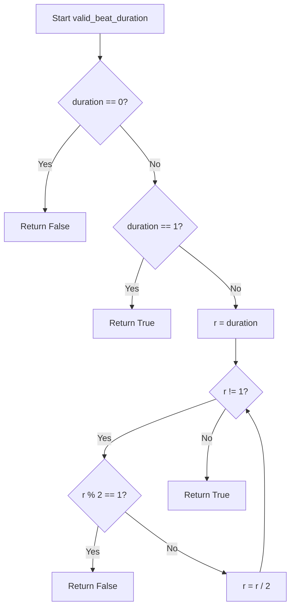

# `meter.py`

## `mingus.core.meter.valid_beat_duration` · *function*

## Summary:
Determines whether a given beat duration is valid by checking if it's a power of two.

## Description:
Validates musical beat durations by ensuring they conform to standard rhythmic patterns. This function is used to verify that a duration value represents a valid rhythmic subdivision, such as whole notes, half notes, quarter notes, eighth notes, etc. The function returns True only for durations that are powers of 2 (1, 2, 4, 8, 16, ...), which represent standard musical note values.

## Args:
    duration (int): The beat duration to validate. Must be a non-negative integer.

## Returns:
    bool: True if the duration is a valid beat duration (power of 2), False otherwise.

## Raises:
    None

## Constraints:
    Preconditions:
        - Input must be an integer
        - Input must be non-negative (duration >= 0)
    
    Postconditions:
        - Returns boolean value indicating validity of the beat duration
        - For duration = 0: Always returns False
        - For duration = 1: Always returns True
        - For other values: Returns True only if the number is a power of 2

## Side Effects:
    None

## Control Flow:


## Examples:
    >>> valid_beat_duration(1)
    True
    >>> valid_beat_duration(2)
    True
    >>> valid_beat_duration(4)
    True
    >>> valid_beat_duration(8)
    True
    >>> valid_beat_duration(3)
    False
    >>> valid_beat_duration(0)
    False
    >>> valid_beat_duration(5)
    False
```

## `mingus.core.meter.is_valid` · *function*

## Summary:
Validates whether a musical meter specification is properly formatted with a positive beat count and a valid beat duration.

## Description:
Checks if a meter tuple contains a positive number of beats and a valid beat duration. This function extracts the validation logic for meter specifications into a reusable component, separating concerns between meter structure validation and beat duration validation. It ensures that musical meters follow proper formatting rules where the beat count is positive and the beat duration follows specific mathematical constraints.

## Args:
    meter (tuple): A two-element tuple where meter[0] represents the number of beats (must be positive integer) and meter[1] represents the beat duration (must be a valid beat duration according to musical theory).

## Returns:
    bool: True if meter[0] > 0 and meter[1] passes the valid_beat_duration check, False otherwise.

## Raises:
    None explicitly raised, but may raise exceptions from valid_beat_duration if called with invalid arguments.

## Constraints:
    Preconditions:
        - meter must be a tuple-like object with at least two elements
        - meter[0] must be a numeric value greater than 0
        - meter[1] must be a numeric value that satisfies valid_beat_duration requirements
    
    Postconditions:
        - Returns boolean value indicating validity of the meter specification

## Side Effects:
    None

## Control Flow:
```mermaid
flowchart TD
    A[is_valid called with meter] --> B{meter[0] > 0?}
    B -- No --> C[Return False]
    B -- Yes --> D[Call valid_beat_duration(meter[1])]
    D --> E{valid_beat_duration result?}
    E -- False --> F[Return False]
    E -- True --> G[Return True]
```

## Examples:
    >>> is_valid((4, 4))
    True
    >>> is_valid((0, 4))
    False
    >>> is_valid((3, 5))
    False
    >>> is_valid((2, 8))
    True
```

## `mingus.core.meter.is_compound` · *function*

## Summary:
Determines whether a musical meter is compound based on its beat count and duration.

## Description:
Checks if a musical meter qualifies as a compound meter by verifying that it's a valid meter with a beat count that is divisible by 3 and at least 6. Compound meters in music theory typically have beats that are naturally divided into three equal parts rather than two.

## Args:
    meter (tuple): A musical meter represented as a tuple of (beat_count, beat_duration) where:
        - beat_count (int): Number of beats per measure, must be positive
        - beat_duration (int): Duration of each beat, must be a power of 2 (1, 2, 4, 8, 16, etc.)

## Returns:
    bool: True if the meter is valid, has a beat count divisible by 3, and beat count is at least 6; False otherwise.

## Raises:
    None explicitly raised, but relies on is_valid() which may raise exceptions for invalid inputs.

## Constraints:
    Preconditions:
        - The meter parameter must be a tuple-like object with at least two elements
        - meter[0] must be a positive integer
        - meter[1] must be a valid beat duration (power of 2)
    
    Postconditions:
        - Returns a boolean value indicating compound meter status
        - Does not modify the input meter parameter

## Side Effects:
    None

## Control Flow:
```mermaid
flowchart TD
    A[is_compound(meter)] --> B{is_valid(meter)?}
    B -- No --> C[Return False]
    B -- Yes --> D{meter[0] % 3 == 0?}
    D -- No --> C
    D -- Yes --> E{meter[0] >= 6?}
    E -- No --> C
    E -- Yes --> F[Return True]
```

## Examples:
    >>> is_compound((6, 8))
    True
    >>> is_compound((9, 4))
    True
    >>> is_compound((4, 4))
    False
    >>> is_compound((3, 8))
    False
    >>> is_compound((12, 16))
    True
```

## `mingus.core.meter.is_simple` · *function*

## Summary
Determines whether a musical meter is simple by validating its numerator and beat duration.

## Description
Checks if a musical meter conforms to standard rhythmic patterns by verifying that the numerator is positive and the denominator represents a valid beat duration (powers of 2 such as 1, 2, 4, 8, 16, etc.). This function serves as a convenience wrapper around the more detailed validation logic.

The function is typically called during meter validation processes when determining if a meter follows conventional rhythmic structures. It's part of the musical meter validation system that ensures meters used in composition and analysis adhere to standard rhythmic conventions.

## Args
    meter (tuple): A musical meter represented as a tuple (numerator, denominator) where:
        - numerator (numeric): Must be greater than 0
        - denominator (int): Must be a power of 2 (1, 2, 4, 8, 16, ...)

## Returns
    bool: True if the meter is considered "simple" (valid according to the criteria), False otherwise.

## Raises
    None explicitly raised, but may propagate exceptions from underlying validation functions if meter structure is malformed.

## Constraints
    Preconditions:
        - The meter parameter must be a tuple-like object with at least two elements
        - meter[0] must be greater than 0 (supports numeric types)
        - meter[1] must be an integer representing a valid beat duration
        
    Postconditions:
        - Returns a boolean value indicating simple meter validity
        - Does not modify the input meter parameter

## Side Effects
    None

## Control Flow
```mermaid
flowchart TD
    A[is_simple called with meter] --> B{meter[0] > 0?}
    B -- No --> C[Return False]
    B -- Yes --> D{valid_beat_duration(meter[1])?}
    D -- No --> C
    D -- Yes --> E[Return True]
```

## Examples
    >>> is_simple((4, 4))
    True
    >>> is_simple((3, 8))
    True
    >>> is_simple((0, 4))
    False
    >>> is_simple((4, 3))
    False
```

## `mingus.core.meter.is_asymmetrical` · *function*

## Summary:
Determines whether a musical meter is asymmetrical by checking if it's valid and has an odd number of beats.

## Description:
This function evaluates whether a given musical meter represents an asymmetrical rhythm pattern. A meter is considered asymmetrical if it passes validation and contains an odd number of beats in its numerator. This function is commonly used in music theory applications to identify rhythmic patterns that don't divide evenly into binary subdivisions.

## Args:
    meter (tuple/list): A musical meter represented as [beats, beat_duration]. The first element (beats) must be a positive integer, and the second element (beat_duration) must be a valid beat duration.

## Returns:
    bool: True if the meter is valid and has an odd number of beats, False otherwise.

## Raises:
    IndexError: If meter does not have at least two elements.
    TypeError: If meter elements are not numeric or cannot be processed by validation functions.

## Constraints:
    Preconditions:
    - The meter parameter must be iterable with at least two elements
    - The first element must be a positive integer
    - The second element must be a valid beat duration (as defined by valid_beat_duration function)
    
    Postconditions:
    - Returns a boolean value indicating asymmetry status
    - Does not modify the input meter parameter

## Side Effects:
    None

## Control Flow:
```mermaid
flowchart TD
    A[is_asymmetrical(meter)] --> B{is_valid(meter)?}
    B -- No --> C[Return False]
    B -- Yes --> D{meter[0] % 2 == 1?}
    D -- No --> C
    D -- Yes --> E[Return True]
```

## Examples:
    >>> is_asymmetrical([3, 4])
    True
    >>> is_asymmetrical([4, 4])
    False
    >>> is_asymmetrical([5, 8])
    True
    >>> is_asymmetrical([0, 4])
    False

