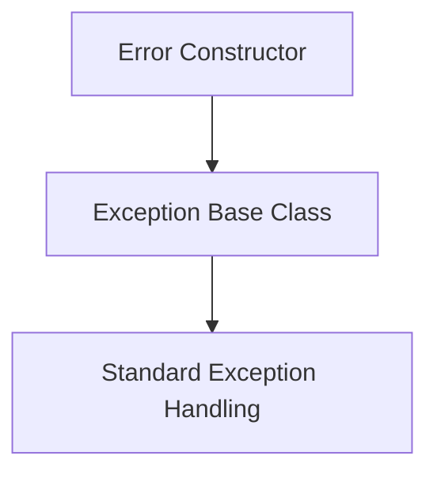
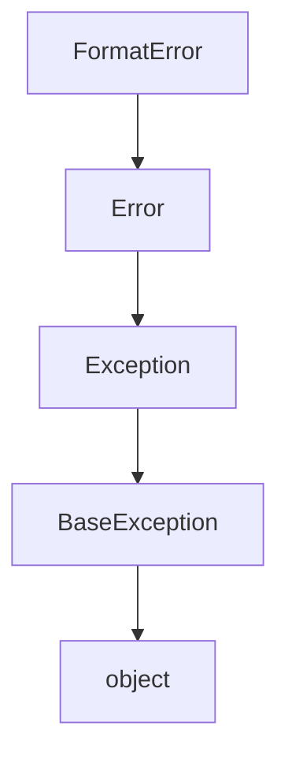
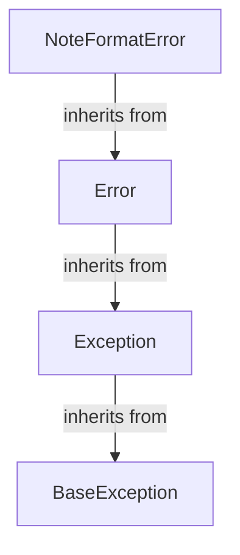
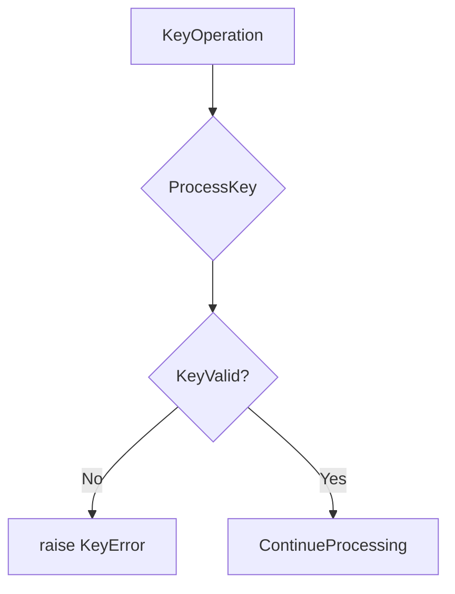
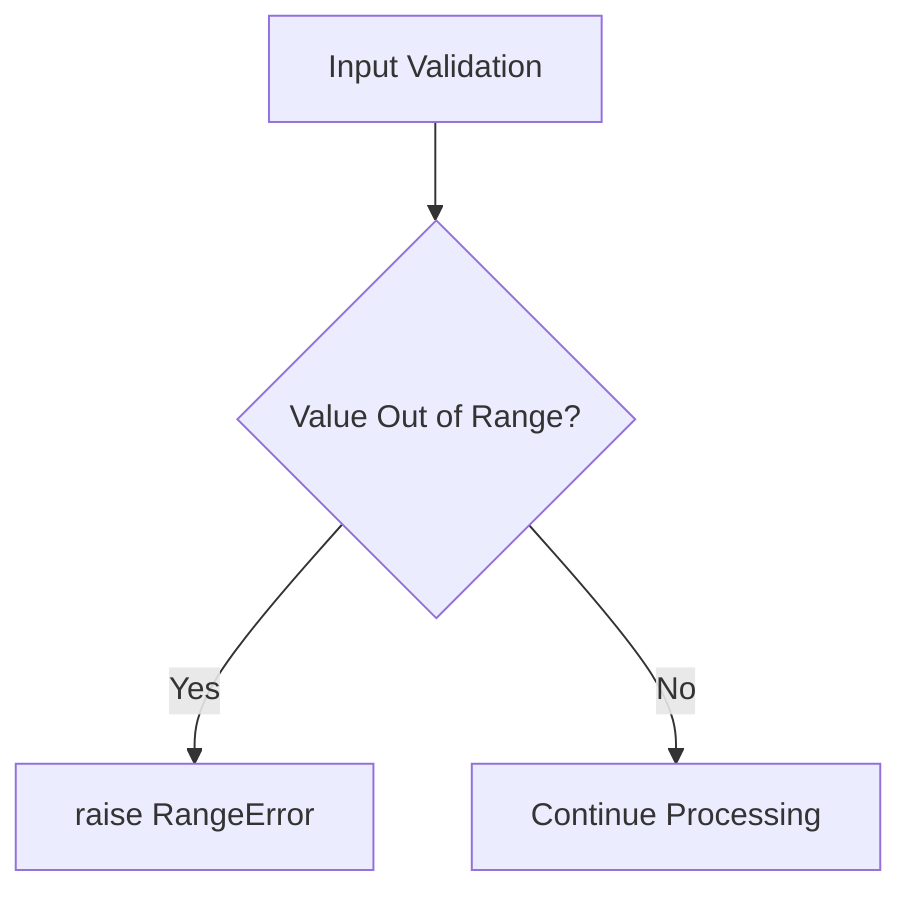
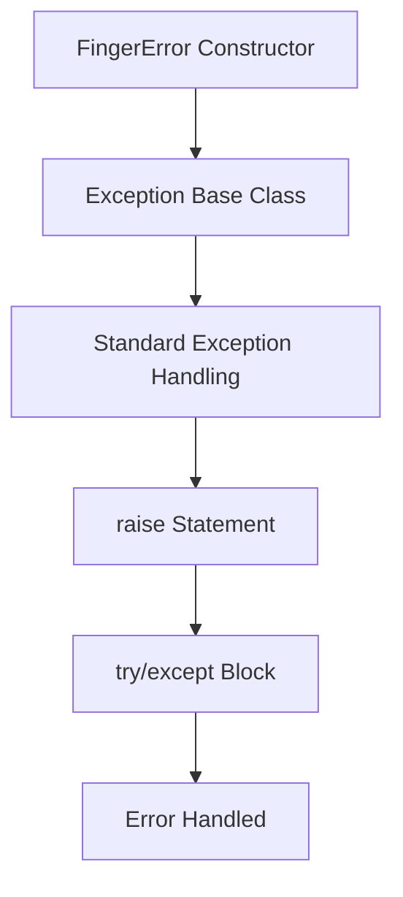

# `mt_exceptions.py`

## `mingus.core.mt_exceptions.Error` · *class*

## Summary:
Base exception class for the mingus core module, providing a domain-specific error handling mechanism.

## Description:
The Error class serves as a specialized base exception for the mingus core module, allowing for more granular error handling and identification compared to using generic Exception objects. It provides a clear distinction between core module errors and other types of exceptions that might occur in the application.

This exception class is intended to be inherited by more specific error types within the mingus core module, creating a hierarchy of domain-specific exceptions that can be caught and handled appropriately by callers.

## State:
The Error class has no instance attributes beyond those inherited from Python's built-in Exception class. It maintains the standard Exception behavior with message, args, and traceback capabilities.

## Lifecycle:
Creation: Instances are created by calling the constructor with optional error messages, e.g., `raise Error("Something went wrong")` or `raise Error()`. 

Usage: The class follows standard Python exception handling patterns where instances are raised to signal exceptional conditions and caught by try/except blocks.

Destruction: No special cleanup is required as the class inherits standard Python exception behavior.

## Method Map:


## Raises:
The Error class itself does not raise any exceptions during initialization. It inherits the standard Exception constructor behavior which may raise TypeError if invalid arguments are passed to the parent Exception class.

## Example:
```python
try:
    # Some operation that might fail
    process_midi_data()
except Error as e:
    # Handle core module specific errors
    print(f"Core module error occurred: {e}")
```

## `mingus.core.mt_exceptions.FormatError` · *class*

## Summary:
A specialized exception for format-related errors in the mingus.core module.

## Description:
FormatError is a custom exception class that extends the core Error exception class. It provides a specific error type for handling format-related issues that occur during processing operations within the mingus.core module. This allows for more granular error handling compared to the general Error class.

## State:
The class has no additional attributes beyond those inherited from Exception. It maintains the standard Exception behavior with no specific constraints or invariants.

## Lifecycle:
- Creation: Instantiated like any other Exception subclass, typically with an optional error message string
- Usage: Raised during format validation or processing operations when format violations are detected
- Destruction: Automatically handled by Python's exception mechanism when caught or allowed to propagate

## Method Map:


## Raises:
This exception can be raised when format validation fails during processing operations in the mingus.core module.

## Example:
```python
try:
    # Some operation that validates format
    validate_midi_format(data)
except FormatError as e:
    print(f"Format error occurred: {e}")
    # Handle the format error appropriately
```

## `mingus.core.mt_exceptions.NoteFormatError` · *class*

## Summary:
Custom exception class for note formatting errors in the mingus music library.

## Description:
NoteFormatError is a specialized exception that inherits from the Error base class in the mingus core module. It is raised when a musical note fails validation due to improper formatting. This exception provides a domain-specific error handling mechanism for note-related validation failures within the mingus library.

## State:
This class maintains no additional state beyond what is inherited from the Error base class. As a minimal exception subclass, it has no instance attributes or parameters.

## Lifecycle:
Creation: Instances are created automatically when note formatting validation fails within the mingus library codebase. The exception is raised by internal validation functions when they encounter improperly formatted notes.

Usage: When raised, this exception follows standard Python exception handling patterns and should be caught by appropriate error handlers in the calling code to manage note formatting validation failures.

Destruction: Like all Python exceptions, cleanup is automatic when the exception object goes out of scope. No special cleanup is required as the class inherits standard Python exception behavior.

## Method Map:


## Raises:
This class itself does not raise any exceptions. It is raised by other components in the mingus library when note formatting validation fails.

## Example:
```python
try:
    # Some operation that validates note format
    validate_note_format("invalid-note")
except NoteFormatError:
    # Handle note format error specifically
    handle_note_format_error()
```

## `mingus.core.mt_exceptions.KeyError` · *class*

## Summary:
A specialized exception type for key-related errors in music theory operations.

## Description:
The KeyError class is a minimal exception type that inherits from the base Error class. It serves as a distinct exception type to indicate key-related errors in the mingus music theory library. This exception is used internally to signal failures or invalid states related to key operations, providing a more specific error type than the generic Error class.

## State:
This class inherits all attributes from its parent Error class. It contains no additional instance variables or properties beyond what is provided by the standard Exception hierarchy.

## Lifecycle:
- Creation: Instantiated using standard exception construction patterns (`KeyError()` or `KeyError(message)`)
- Usage: Raised during key processing operations when a key-related error occurs
- Destruction: Handled automatically by Python's exception mechanism

## Method Map:


## Raises:
- KeyError: Raised when key-related operations encounter invalid key specifications or processing failures

## Example:
```python
# Basic usage
raise KeyError("Invalid key specification")

# In context of key processing
try:
    process_music_key(key_specification)
except KeyError:
    handle_invalid_key_case()
```

## `mingus.core.mt_exceptions.RangeError` · *class*

## Summary:
Represents an error that occurs when a value is outside of an acceptable numerical range.

## Description:
RangeError is a custom exception class that extends Python's built-in Exception class. It is specifically designed to indicate when a numeric value falls outside of a defined acceptable range. This exception is typically raised when input validation detects that a parameter or calculated value exceeds the bounds considered valid for a particular operation or system constraint.

## State:
The class has no instance attributes beyond those inherited from the base Exception class. It serves purely as a semantic marker for range-related errors.

## Lifecycle:
Creation: Instantiated like any other exception using `raise RangeError("message")` or `raise RangeError()`.

Usage: Typically raised during input validation or calculation processes where numeric bounds checking is performed.

Destruction: Automatically handled by Python's exception mechanism when caught or allowed to propagate.

## Method Map:


## Raises:
This class itself doesn't raise exceptions, but it is raised when range validation fails.

## Example:
```python
def set_temperature(value):
    if not 0 <= value <= 100:
        raise RangeError("Temperature must be between 0 and 100 degrees")
    return value

# Usage
try:
    temp = set_temperature(150)
except RangeError as e:
    print(f"Range error occurred: {e}")
```

## `mingus.core.mt_exceptions.FingerError` · *class*

## Summary:
Represents an error condition related to finger positioning or handling in musical contexts.

## Description:
The FingerError class is a custom exception that extends Python's built-in Error class. It serves as a specialized exception type for signaling issues related to finger operations, likely in the context of musical instrument fingering or notation. This exception type allows for more specific error handling compared to generic exceptions, enabling code to differentiate between various types of errors that might occur during finger-related operations.

## State:
This class does not define any additional instance attributes beyond those inherited from the Error base class. As a minimal exception class, it relies entirely on the standard Exception behavior and does not maintain any internal state.

## Lifecycle:
Creation: Instances of FingerError can be created by calling the constructor with optional error message arguments, following standard Python exception conventions. The class can be instantiated directly or through exception raising mechanisms.

Usage: Once created, FingerError instances behave like standard Python exceptions. They can be raised using the 'raise' keyword and caught using try/except blocks. The typical usage pattern involves raising the exception when finger-related operations encounter invalid conditions or unexpected states.

Destruction: Like all Python exceptions, FingerError instances are automatically cleaned up by the garbage collector after being handled or when they go out of scope.

## Method Map:


## Raises:
This class itself does not raise any exceptions during instantiation. However, instances of FingerError may be raised during normal program execution when finger-related operations encounter invalid conditions or unexpected states.

## Example:
```python
# Creating and raising a FingerError
try:
    # Some finger operation that fails
    raise FingerError("Invalid finger position detected")
except FingerError as e:
    print(f"Caught finger error: {e}")
```

