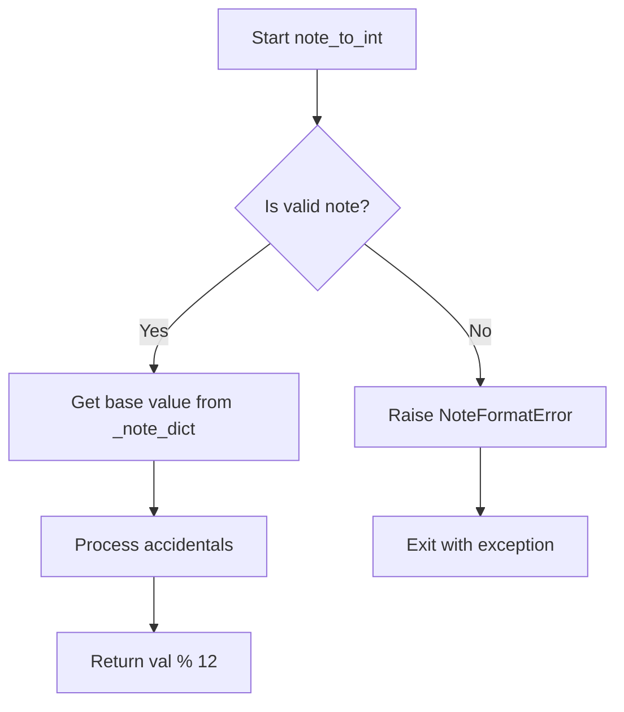

# `notes.py`

## `mingus.core.notes.int_to_note` · *function*

## Summary:
Converts an integer representation of a musical note to its corresponding note name string.

## Description:
Transforms an integer value (0-11) representing a musical note into a standard note name string. Supports both sharps and flats notation systems. This function serves as a utility for converting numeric note representations into human-readable musical notation.

## Args:
    note_int (int): Integer representation of a note (0-11). 0=C, 1=C#, 2=D, ..., 11=B.
    accidentals (str): Accidental type to use for note naming. Defaults to "#". 
        - "#" for sharp notation (C#, D#, F#, G#, A#)
        - "b" for flat notation (Db, Eb, Gb, Ab, Bb)

## Returns:
    str: The note name string corresponding to the input integer. 
        - With "#" accidentals: "C", "C#", "D", "D#", "E", "F", "F#", "G", "G#", "A", "A#", "B"
        - With "b" accidentals: "C", "Db", "D", "Eb", "E", "F", "Gb", "G", "Ab", "A", "Bb", "B"

## Raises:
    RangeError: When note_int is outside the valid range of 0-11.
    FormatError: When accidentals parameter is neither "#" nor "b".

## Constraints:
    Preconditions:
        - note_int must be an integer in the range [0, 11]
        - accidentals must be either "#" or "b"
    Postconditions:
        - Returns a valid musical note name string
        - The returned string corresponds to the correct pitch class

## Side Effects:
    None

## Control Flow:
```mermaid
flowchart TD
    A[Start int_to_note] --> B{note_int in range(12)?}
    B -- No --> C[Raise RangeError]
    B -- Yes --> D{accidentals == "#"?}
    D -- Yes --> E[Return ns[note_int]]
    D -- No --> F{accidentals == "b"?}
    F -- Yes --> G[Return nf[note_int]]
    F -- No --> H[Raise FormatError]
```

## Examples:
    >>> int_to_note(0)
    'C'
    >>> int_to_note(1, "#")
    'C#'
    >>> int_to_note(1, "b")
    'Db'
    >>> int_to_note(12)
    # Raises RangeError
    >>> int_to_note(0, "x")
    # Raises FormatError
```

## `mingus.core.notes.is_enharmonic` · *function*

## Summary:
Determines whether two musical notes are enharmonically equivalent, representing the same pitch but with different names.

## Description:
This function compares two musical notes and returns True if they represent the same pitch class (i.e., they are enharmonically equivalent), such as C# and Db, or False otherwise. It converts each note to its integer representation using the note_to_int function and compares these values.

## Args:
    note1 (str): The first musical note in standard notation (e.g., 'C', 'C#', 'Db', 'A##').
    note2 (str): The second musical note in standard notation (e.g., 'C', 'C#', 'Db', 'A##').

## Returns:
    bool: True if the notes are enharmonically equivalent (same pitch class), False otherwise.

## Raises:
    NoteFormatError: If either note string is not in a valid format recognized by the system.

## Constraints:
    Preconditions: Both note1 and note2 must be valid note strings that follow the standard musical notation conventions.
    Postconditions: The function will always return a boolean value indicating enharmonic equivalence.

## Side Effects:
    None

## Control Flow:
```mermaid
flowchart TD
    A[is_enharmonic(note1, note2)] --> B{Are notes valid?}
    B -->|No| C[NoteFormatError]
    B -->|Yes| D[Convert note1 to int]
    D --> E[Convert note2 to int]
    E --> F[Compare integers]
    F --> G{Are integers equal?}
    G -->|Yes| H[Return True]
    G -->|No| I[Return False]
```

## Examples:
    >>> is_enharmonic('C#', 'Db')
    True
    >>> is_enharmonic('F#', 'Gb')
    True
    >>> is_enharmonic('C', 'D')
    False

## `mingus.core.notes.is_valid_note` · *function*

## Summary:
Validates whether a note string follows proper musical notation format with a valid note name followed by optional accidentals.

## Description:
Checks if a note string is properly formatted according to standard musical notation rules. A valid note consists of a base note (from a predefined set) followed by zero or more accidental symbols ("#" for sharp or "b" for flat). This function serves as a validation utility to ensure note representations conform to expected musical notation standards before further processing.

## Args:
    note (str): A musical note string to validate, such as "C", "D#", "Eb", "A##", etc. Must not be empty.

## Returns:
    bool: True if the note string is valid (starts with a valid note name and contains only valid accidentals), False otherwise.

## Raises:
    IndexError: When an empty string is passed as the note parameter, as accessing note[0] would fail.

## Constraints:
    Precondition: The input note must be a non-empty string.
    Postcondition: Returns a boolean value indicating validity of the note format.

## Side Effects:
    None.

## Control Flow:
```mermaid
flowchart TD
    A[Start is_valid_note] --> B{note[0] in _note_dict?}
    B -- No --> C[Return False]
    B -- Yes --> D[Loop through note[1:]]
    D --> E{char != "b" AND char != "#"?}
    E -- Yes --> F[Return False]
    E -- No --> G[Continue loop]
    G --> H{End of note[1:]?}
    H -- No --> D
    H -- Yes --> I[Return True]
```

## Examples:
    >>> is_valid_note("C")      # Basic note
    True
    >>> is_valid_note("D#")     # Sharp note
    True
    >>> is_valid_note("Eb")     # Flat note
    True
    >>> is_valid_note("A##")    # Double sharp
    True
    >>> is_valid_note("X")      # Invalid note name
    False
    >>> is_valid_note("C#b")    # Mixed accidentals
    True
    >>> is_valid_note("")       # Empty string raises IndexError
    IndexError

## `mingus.core.notes.note_to_int` · *function*

## Summary:
Converts a musical note string representation to its corresponding integer value in semitones.

## Description:
Transforms musical note names (such as "C", "C#", "Db", "Bb") into integer values ranging from 0 to 11, where 0 represents C and 11 represents B. This function handles standard musical note formats including sharps (#) and flats (b).

## Args:
    note (str): A musical note string in standard format (e.g., "C", "C#", "Db", "Bb"). Must start with a letter A-G and can optionally include accidentals (# or b).

## Returns:
    int: An integer value between 0 and 11 representing the semitone position of the note within an octave (C=0, C#=1, Db=1, D=2, etc.).

## Raises:
    NoteFormatError: When the input note string is not in a recognized format or contains invalid characters.

## Constraints:
    Preconditions:
        - The note string must start with a valid note letter (A-G)
        - All characters after the first must be either "#" or "b"
        - The note must be a valid musical note format
    
    Postconditions:
        - The returned integer will always be in the range [0, 11]
        - The function will not modify any external state

## Side Effects:
    None

## Control Flow:


## Examples:
    >>> note_to_int("C")
    0
    >>> note_to_int("C#")
    1
    >>> note_to_int("Db")
    1
    >>> note_to_int("Bb")
    10
    >>> note_to_int("A#")
    10
```

## `mingus.core.notes.reduce_accidentals` · *function*

## Summary:
Normalizes musical note strings with accidentals into their canonical representations.

## Description:
Converts a note string containing accidentals (sharps or flats) into its equivalent canonical form, ensuring proper octave wrapping and consistent accidental representation. This function processes note strings like "C#", "Db", "Ebbb", etc., and returns a standardized note representation that maintains the same pitch class while following musical notation conventions.

## Args:
    note (str): A musical note string that may contain accidentals, such as "C#", "Db", "Eb", etc.

## Returns:
    str: A normalized note string in canonical form, either using sharps or flats depending on the input and resulting pitch.

## Raises:
    NoteFormatError: When the note string contains invalid characters or format that cannot be processed.

## Constraints:
    Preconditions:
        - The input note string must be a valid musical note format
        - The note string must start with a valid note letter (C, D, E, F, G, A, B)
        - Subsequent characters must be valid accidentals ('#' or 'b')
    
    Postconditions:
        - The returned note string represents the same pitch class as the input
        - The result follows standard musical notation conventions

## Side Effects:
    None

## Control Flow:
```mermaid
flowchart TD
    A[Input note string] --> B[Convert base note to integer using note_to_int]
    B --> C[Process remaining tokens as accidentals]
    C --> D{Token is "b"?}
    D -->|Yes| E[val -= 1]
    D -->|No| F{Token is "#"?}
    F -->|Yes| G[val += 1]
    F -->|No| H[Raise NoteFormatError]
    E --> I[val = val % 12]
    G --> I
    I --> J{val >= base_note_value?}
    J -->|Yes| K[Return int_to_note(val % 12)]
    J -->|No| L[Return int_to_note(val % 12, "b")]
```

## Examples:
    >>> reduce_accidentals("C#")
    "C#"
    >>> reduce_accidentals("Db")
    "C#"
    >>> reduce_accidentals("Ebbb")
    "D"
    >>> reduce_accidentals("F#")
    "F#"
    >>> reduce_accidentals("Bb")
    "Bb"
```

## `mingus.core.notes.remove_redundant_accidentals` · *function*

*No documentation generated.*

## `mingus.core.notes.augment` · *function*

## Summary:
Converts musical note representations between sharp and flat forms by appending or removing accidentals.

## Description:
Transforms a musical note string by either adding a sharp (#) suffix to notes that don't end with flat (b) or removing the flat suffix from notes that end with flat. This function serves as a utility for normalizing note representations in musical notation systems.

## Args:
    note (str): A musical note string that may end with '#' (sharp) or 'b' (flat) suffixes.

## Returns:
    str: The transformed note string with normalized accidental representation. If the note doesn't end with 'b', a '#' is appended. If it ends with 'b', the 'b' is removed.

## Raises:
    None: This function does not explicitly raise any exceptions based on the provided source code.

## Constraints:
    Preconditions:
        - The input note must be a string
        - The note string should represent a valid musical note (though no validation is performed)
    
    Postconditions:
        - The returned string will either end with '#' or not end with 'b'
        - The transformation maintains the note's pitch class while changing its accidental representation

## Side Effects:
    None: This function has no side effects and is purely a transformation function.

## Control Flow:
```mermaid
flowchart TD
    A[Start: augment(note)] --> B{note[-1] != "b"?}
    B -- Yes --> C[note + "#"]
    B -- No --> D[note[:-1]]
    C --> E[Return result]
    D --> E
```

## Examples:
    >>> augment("C")
    "C#"
    >>> augment("Db")
    "D"
    >>> augment("A#")
    "A#"
    >>> augment("Bb")
    "B"

## `mingus.core.notes.diminish` · *function*

## Summary:
Reduces a musical note by one semitone, converting sharps to naturals or adding flats to natural notes.

## Description:
The diminish function applies a musical diminishment operation that lowers a note by one semitone. In musical terminology, diminishing a note means reducing it by a half-step (semitone). When applied to a sharp note (ending with #), it removes the sharp to create a natural note. When applied to a natural note (not ending with #), it adds a flat (b) to create a flat note. This function is part of the musical note manipulation utilities in the mingus library, commonly used in music theory applications and note transposition operations.

## Args:
    note (str): A musical note represented as a string, typically in scientific pitch notation (e.g., "C#", "D", "Eb"). Must be a valid note format.

## Returns:
    str: The diminished version of the input note, lowered by one semitone. 
         - If input ends with "#", returns input without the "#"
         - If input does not end with "#", returns input with "b" appended

## Raises:
    None explicitly raised by this function, but invalid note formats may cause errors in higher-level code

## Constraints:
    Precondition: Input must be a valid note string format
    Postcondition: Output is always a valid note string with one semitone reduction

## Side Effects:
    None

## Control Flow:
```mermaid
flowchart TD
    A[Input note] --> B{Last character == "#"}
    B -- No --> C[Append "b"]
    B -- Yes --> D[Remove last character]
    C --> E[Return result]
    D --> E
```

## Examples:
    >>> diminish("C#")
    "C"
    >>> diminish("D")
    "Db"
    >>> diminish("Eb")
    "E"
    >>> diminish("A#")
    "A"
```

