# `scales.py`

## `mingus.core.scales.determine` · *function*

## Summary:
Determines which musical scales correspond to a given set of notes by comparing the notes against all available major and minor scale patterns.

## Description:
This function identifies potential musical scales that could contain the provided notes by systematically testing against all major and minor scale patterns defined in the mingus library. It's designed to help musicians and composers identify scale relationships in a collection of notes.

The function is extracted into its own component to separate the logic of scale identification from other musical operations, allowing for reuse in various contexts such as music analysis, composition tools, or educational applications.

## Args:
    notes (list[str] or set[str]): A collection of musical notes to analyze. Each note should be represented as a string (e.g., 'C', 'D#', 'Bb').

## Returns:
    list[str]: A list of scale names that could potentially contain all the provided notes. Multiple scales may be returned if the notes match multiple scale patterns.

## Raises:
    None explicitly raised by this function, though underlying scale operations may raise NoteFormatError, RangeError, or FormatError from the mingus.core module.

## Constraints:
    Preconditions:
    - Notes should be valid musical note representations
    - The notes parameter should be iterable
    
    Postconditions:
    - Returns a list of strings representing scale names
    - The returned list may be empty if no scales match the notes
    - The returned list may contain duplicates if the same scale matches in multiple ways

## Side Effects:
    None

## Control Flow:
```mermaid
flowchart TD
    A[Start determine()] --> B[Convert notes to set]
    B --> C[Initialize empty result list]
    C --> D[Iterate through all keys]
    D --> E[Iterate through all Scale subclasses]
    E --> F{Scale type is major?}
    F -->|Yes| G[Check if notes ⊆ ascending() OR notes ⊆ descending()]
    F -->|No| H[Check if notes ⊆ ascending() OR notes ⊆ descending()]
    G --> I{Match found?}
    H --> I
    I -->|Yes| J[Add scale name to results]
    I -->|No| K[Continue]
    J --> L[Continue iteration]
    K --> L
    L --> M{More keys/scales?}
    M -->|Yes| D
    M -->|No| N[Return results]
```

## Examples:
    >>> determine(['C', 'E', 'G'])
    ['C Major']
    
    >>> determine(['A', 'C', 'E'])
    ['A Minor']
    
    >>> determine(['C', 'D', 'E', 'F', 'G', 'A', 'B'])
    ['C Major', 'A Minor']
```

## `mingus.core.scales._Scale` · *class*

## Summary:
Abstract base class representing musical scales with methods for ascending, descending, and retrieving scale degrees.

## Description:
The `_Scale` class serves as the foundation for implementing various musical scale types in the mingus library. It provides common functionality for scale operations while requiring concrete implementations for the specific scale pattern through the `ascending()` method. This class handles basic scale properties like tonic note and octave range, and provides utility methods for scale degree retrieval. The `descending()` method is automatically implemented by reversing the ascending scale notes.

## State:
- `tonic` (str): The root note of the scale, represented as a string (e.g., 'C', 'D#'). Must be an uppercase letter or valid note representation.
- `octaves` (int): Number of octaves the scale spans. Must be a positive integer.

## Lifecycle:
- Creation: Instantiate with a tonic note string and number of octaves
- Usage: Call methods like `ascending()`, `descending()`, or `degree()` to retrieve scale information
- Destruction: No special cleanup required; uses standard Python garbage collection

## Method Map:
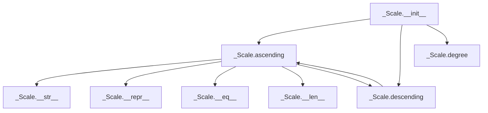

## Raises:
- `NoteFormatError`: Raised when the tonic note parameter contains lowercase letters (invalid format)
- `RangeError`: Raised when attempting to access a scale degree less than 1
- `FormatError`: Raised when an invalid direction parameter is passed to `degree()` method

## Example:
```python
# Create a scale instance (this would typically be done via a concrete subclass)
scale = _Scale('C', 2)  # Creates a C scale spanning 2 octaves

# Access scale information
print(scale.ascending())     # Returns ascending scale notes
print(scale.descending())    # Returns descending scale notes (reversed ascending)
print(scale.degree(3))       # Returns the 3rd degree of the scale
```

### `mingus.core.scales._Scale.__init__` · *method*

## Summary:
Initializes a Scale object with a tonic note and octave range, validating the note format.

## Description:
This method sets up the fundamental properties of a Scale object by storing the tonic note and the number of octaves. It performs validation to ensure the note is properly formatted (not lowercase) before storing it as the scale's tonic.

## Args:
    note (str): The tonic note of the scale, must be a valid note name (uppercase).
    octaves (int): The number of octaves the scale spans.

## Returns:
    None: This method does not return a value.

## Raises:
    NoteFormatError: When the note parameter is lowercase, indicating an unrecognized note format.

## State Changes:
    Attributes READ: None
    Attributes WRITTEN: 
        - self.tonic: Set to the provided note parameter
        - self.octaves: Set to the provided octaves parameter

## Constraints:
    Preconditions:
        - The note parameter must be a string representing a valid musical note
        - The note parameter must not be lowercase (must be uppercase)
        - The octaves parameter must be an integer representing a valid octave count
    Postconditions:
        - The Scale object's tonic attribute will be set to the provided note
        - The Scale object's octaves attribute will be set to the provided octaves value

## Side Effects:
    None: This method does not perform any I/O operations or mutate external objects.

### `mingus.core.scales._Scale.__repr__` · *method*

## Summary:
Returns a string representation of the Scale object showing its name.

## Description:
This method implements Python's `__repr__` protocol to provide a string representation of a Scale object. It returns a formatted string that includes the scale's name, following the convention of displaying the object type and key identifying information. This representation is primarily intended for debugging and development purposes.

## Args:
    None

## Returns:
    str: A formatted string in the pattern "<Scale object ('{name}')>" where {name} represents the scale's name attribute.

## Raises:
    AttributeError: If the Scale object does not have a `name` attribute defined.

## State Changes:
    Attributes READ: self.name
    Attributes WRITTEN: None

## Constraints:
    Preconditions: The Scale object must have a `name` attribute containing a string value.
    Postconditions: The returned string follows the format "<Scale object ('{name}')>" where {name} is the value of the object's name attribute.

## Side Effects:
    None

### `mingus.core.scales._Scale.__str__` · *method*

## Summary:
Returns a formatted string representation showing the ascending and descending notes of the scale.

## Description:
This method provides a human-readable string representation of a scale object, displaying both ascending and descending note sequences. It is called automatically when converting a scale object to a string using str() or when printing the object. The method relies on the abstract `ascending()` method which must be implemented by subclasses to provide the actual note sequences.

## Args:
    None

## Returns:
    str: A formatted string containing two lines - the first showing ascending notes separated by spaces, and the second showing descending notes separated by spaces.

## Raises:
    None explicitly raised

## State Changes:
    Attributes READ: 
    - self.ascending(): calls the ascending method (implementation-dependent)
    - self.descending(): calls the descending method (implementation-dependent)
    
    Attributes WRITTEN: 
    - None

## Constraints:
    Preconditions:
    - The `ascending()` method must be implemented by subclasses and should return a list of note strings
    - The `descending()` method should return a reversed version of the ascending notes
    
    Postconditions:
    - Returns a properly formatted string with ascending and descending notes
    - The returned string contains exactly two lines separated by newline character

## Side Effects:
    None

### `mingus.core.scales._Scale.__eq__` · *method*

## Summary:
Compares two Scale objects for equality based on their ascending and descending note sequences.

## Description:
This method implements the equality operator (`==`) for Scale objects. It determines whether two scale objects represent the same musical scale by comparing both their ascending and descending note sequences. This method is part of the standard Python object comparison protocol and is automatically invoked when using the `==` operator between two Scale instances.

The comparison works by first comparing the ascending note sequences of both scales. If they match, it then compares the descending note sequences. Only if both sequences match will the method return True.

## Args:
    other (Scale): Another Scale object to compare against this instance.

## Returns:
    bool: True if both the ascending and descending forms of the scales are identical, False otherwise.

## Raises:
    AttributeError: If the `other` parameter does not have `ascending()` or `descending()` methods, which would occur when comparing with incompatible object types.

## State Changes:
    Attributes READ: 
    - self.ascending(): Reads the ascending note sequence of this scale
    - self.descending(): Reads the descending note sequence of this scale
    - other.ascending(): Reads the ascending note sequence of the other scale
    - other.descending(): Reads the descending note sequence of the other scale

## Constraints:
    Preconditions:
    - The `other` parameter must be a Scale object (or subclass) that implements `ascending()` and `descending()` methods
    - Both scales must have compatible structures for comparison
    
    Postconditions:
    - Returns a boolean value indicating equality of the two scales
    - Does not modify either scale object

## Side Effects:
    None - This method is read-only and does not mutate any objects.

### `mingus.core.scales._Scale.__ne__` · *method*

## Summary:
Implements the not-equal comparison operation for scale objects by returning the logical negation of equality comparison.

## Description:
This special method defines the behavior of the `!=` operator when comparing two Scale objects. It returns True if the scales are not equal and False if they are equal. The comparison is performed by negating the result of the `__eq__` method, which compares the ascending and descending sequences of both scales.

## Args:
    other (object): Another object to compare this scale against. Typically another Scale instance.

## Returns:
    bool: True if the scales are not equal, False if they are equal.

## Raises:
    None explicitly raised, but may raise exceptions from `__eq__` if `other` is not a Scale instance.

## State Changes:
    Attributes READ: None - this method only reads the implicit `self` reference
    Attributes WRITTEN: None - this method does not modify any attributes

## Constraints:
    Preconditions: 
    - The `other` parameter should ideally be a Scale instance for meaningful comparison
    - If `other` is not a Scale instance, the comparison may fall back to default Python behavior or raise an exception from `__eq__`
    
    Postconditions:
    - Returns a boolean value indicating inequality between the scales
    - Does not modify either scale object

## Side Effects:
    None - this method is purely computational and has no side effects

### `mingus.core.scales._Scale.__len__` · *method*

## Summary:
Returns the number of notes in the scale by counting the ascending sequence of notes.

## Description:
This method provides the length of the scale by returning the count of notes in its ascending sequence. It serves as the standard Python `__len__` interface for scale objects, allowing them to be used with built-in `len()` function.

## Args:
    None

## Returns:
    int: The number of notes in the scale's ascending sequence.

## Raises:
    NotImplementedError: When called on the abstract base class `_Scale` (since `ascending()` is not implemented in the base class).

## State Changes:
    Attributes READ: self.ascending()
    Attributes WRITTEN: None

## Constraints:
    Preconditions: The `ascending()` method must return a sequence-like object that supports `len()`.
    Postconditions: Returns a non-negative integer representing the count of notes in the scale.

## Side Effects:
    None

### `mingus.core.scales._Scale.ascending` · *method*

## Summary:
Returns the notes of the scale in ascending order.

## Description:
This method is intended to be implemented by subclasses to return the notes of a specific musical scale in ascending order. It serves as the core interface for scale representation in the mingus library, providing access to the sequential notes that define a musical scale.

## Args:
    None

## Returns:
    list[str]: A list of note names (as strings) representing the notes of the scale in ascending order, excluding the octave repetition.

## Raises:
    NotImplementedError: This method is not implemented in the base class and must be overridden by subclasses.

## State Changes:
    Attributes READ: self.tonic, self.octaves
    Attributes WRITTEN: None

## Constraints:
    Preconditions: The method should only be called on properly initialized Scale instances
    Postconditions: The returned list contains valid note names in ascending order

## Side Effects:
    None

### `mingus.core.scales._Scale.descending` · *method*

## Summary:
Returns a list of notes representing the scale in descending order by reversing the ascending scale.

## Description:
This method provides the descending form of a musical scale by taking the ascending scale notes and reversing their order. It serves as a convenience method to avoid repeatedly calling `list(reversed(self.ascending()))` throughout the codebase.

The method is called during:
- String representation (`__str__`) to display both ascending and descending scales
- Equality comparison (`__eq__`) to compare descending scale forms  
- Degree calculation with descending direction (`degree` method when direction="d")

This approach centralizes the logic for generating descending scales, making the code more maintainable and consistent.

## Args:
    None

## Returns:
    list[str]: A list of note names in descending order, with the tonic note appearing at the end

## Raises:
    None

## State Changes:
    Attributes READ: self.ascending()
    Attributes WRITTEN: None

## Constraints:
    Preconditions: The `ascending()` method must be implemented by subclasses and return a valid list of notes
    Postconditions: The returned list contains the same notes as the ascending scale but in reverse order

## Side Effects:
    None

### `mingus.core.scales._Scale.degree` · *method*

## Summary:
Returns a specific degree note from the scale's ascending or descending sequence.

## Description:
Retrieves a note at a specified degree position from either the ascending or descending scale sequence. This method provides access to individual degrees of a scale without exposing the full sequence.

## Args:
    degree_number (int): The degree position to retrieve (1-based indexing). Must be >= 1.
    direction (str): Direction of scale traversal. "a" for ascending, "d" for descending. Defaults to "a".

## Returns:
    str: The note at the specified degree position in the requested scale direction.

## Raises:
    RangeError: When degree_number is less than 1.
    FormatError: When direction is not "a" or "d".

## State Changes:
    Attributes READ: self.ascending(), self.descending()
    Attributes WRITTEN: None

## Constraints:
    Preconditions: degree_number must be a positive integer; direction must be "a" or "d"
    Postconditions: Returns a valid note string from the scale

## Side Effects:
    None

## `mingus.core.scales.Diatonic` · *class*

## Summary:
Represents a diatonic scale with customizable semitone pattern and octave range.

## Description:
The Diatonic class generates diatonic scales with configurable interval patterns. It implements the ascending method to produce scale notes based on a specified pattern of semitones, where certain degrees use minor seconds while others use major seconds. This class is typically instantiated by scale generation utilities or directly when creating custom diatonic scales with specific interval structures.

## State:
- tonic (str): The starting note of the scale, inherited from _Scale parent class
- octaves (int): Number of octaves to generate, inherited from _Scale parent class  
- semitones (list[int]): List of degree numbers (1-7) that should use minor seconds instead of major seconds
- name (str): Formatted string describing the scale, combining tonic and semitones pattern

## Lifecycle:
- Creation: Instantiate with a starting note, semitone pattern list, and optional octave count
- Usage: Call ascending() method to retrieve the generated scale notes
- Destruction: No special cleanup required; uses standard Python garbage collection

## Method Map:
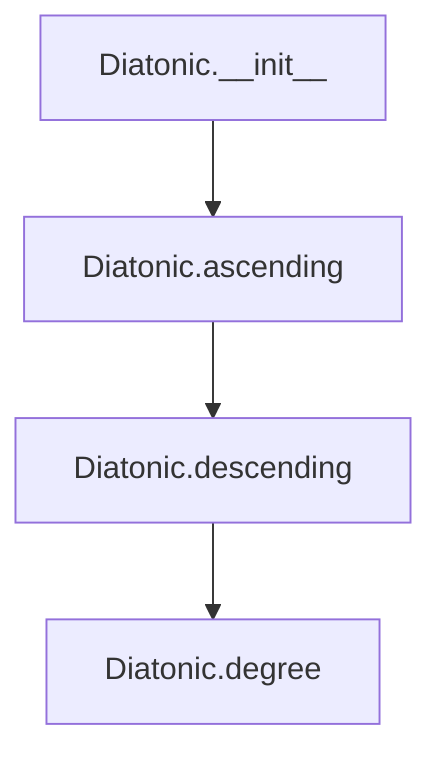

## Raises:
- NoteFormatError: When the provided note parameter contains invalid formatting (lowercase note validation)
- RangeError: When degree number is less than 1 in the degree() method
- FormatError: When an unrecognized direction is provided to the degree() method

## Example:
```python
# Create a diatonic scale with minor seconds at degrees 2 and 5
scale = Diatonic("C", [2, 5], octaves=2)
notes = scale.ascending()  # Returns C, D, Eb, F, G, Ab, Bb, C, D, Eb, F, G, Ab, Bb, C
```

### `mingus.core.scales.Diatonic.__init__` · *method*

## Summary:
Initializes a Diatonic scale object with a tonic note, semitone pattern, and octave count.

## Description:
This method constructs a Diatonic scale instance by initializing the parent _Scale class with the tonic note and octave count, then setting the semitone pattern and constructing a descriptive name for the scale. The method serves as the primary constructor for Diatonic scale objects, establishing their fundamental properties.

## Args:
    note (str): The tonic note of the diatonic scale (e.g., 'C', 'D#')
    semitones (list[int]): A list of integers representing the semitone positions that define the scale pattern
    octaves (int): Number of octaves to include in the scale. Defaults to 1

## Returns:
    None: This is an initializer method that sets up object state rather than returning a value

## Raises:
    NoteFormatError: Raised by the parent _Scale.__init__ method when the note parameter contains invalid formatting

## State Changes:
    Attributes READ: self.tonic (inherited from parent class _Scale)
    Attributes WRITTEN: self.semitones, self.name

## Constraints:
    Preconditions: 
    - The note parameter must be a valid note string format recognized by the system
    - The semitones parameter must be a list of integers representing valid semitone positions
    - The octaves parameter must be a positive integer
    
    Postconditions:
    - self.tonic is set to the provided note parameter
    - self.semitones is set to the provided semitones parameter
    - self.name is constructed using the format "{tonic} diatonic, semitones in {semitones}"

## Side Effects:
    None: This method performs no I/O operations or external service calls

### `mingus.core.scales.Diatonic.ascending` · *method*

## Summary:
Generates an ascending diatonic scale pattern based on the tonic note, semitone configuration, and octave count.

## Description:
Creates a complete ascending scale by starting with the tonic note and applying either minor or major seconds based on the semitone configuration. The resulting scale pattern is repeated for the specified number of octaves and closed by returning to the tonic note.

This method is separated from other scale generation logic because it implements the specific diatonic scale construction algorithm that varies based on the semitone positions defined in the scale configuration.

## Args:
    None (uses instance attributes)

## Returns:
    list[str]: A list of note names representing the ascending diatonic scale, including repeated octaves and closing the scale by returning to the tonic note.

## Raises:
    None explicitly raised

## State Changes:
    Attributes READ: self.tonic, self.semitones, self.octaves
    Attributes WRITTEN: None

## Constraints:
    Preconditions: 
    - self.tonic must be a valid note string
    - self.semitones must be an iterable containing integers representing semitone positions
    - self.octaves must be a positive integer
    
    Postconditions:
    - Returns a list of note strings with length equal to (7 * self.octaves + 1)
    - The first and last elements of the returned list are identical (tonic note)

## Side Effects:
    None

## `mingus.core.scales.Ionian` · *class*

*No documentation generated.*

### `mingus.core.scales.Ionian.__init__` · *method*

## Summary:
Initializes an Ionian scale object with a specified tonic note and octave range.

## Description:
Constructs an Ionian scale instance by calling the parent scale constructor and setting the scale's name attribute to follow the format "{tonic} ionian".

## Args:
    note (str): The tonic note of the scale (e.g., 'C', 'D#').
    octaves (int): Number of octaves to include in the scale. Defaults to 1.

## Returns:
    None: This method initializes the object and does not return a value.

## Raises:
    None explicitly documented: Exceptions may be raised by the parent class constructor if invalid arguments are provided.

## State Changes:
    Attributes READ: self.tonic
    Attributes WRITTEN: self.name

## Constraints:
    Preconditions: The note parameter must be a valid musical note string that the parent class can process.
    Postconditions: The object will have its name attribute set to "{tonic} ionian" format and will be initialized as a scale with the specified tonic and octave range.

## Side Effects:
    None: This method performs no I/O operations or external service calls.

### `mingus.core.scales.Ionian.ascending` · *method*

## Summary:
Generates an ascending scale pattern by creating a diatonic scale with semitone intervals (3, 7), repeating it across octaves, and closing the scale.

## Description:
This method implements the ascending form of an Ionian scale by constructing a diatonic scale with semitone intervals (3, 7) and then repeating the resulting pattern across the specified number of octaves. The method removes the final note from the diatonic pattern to avoid duplication, then appends the first note to properly close the scale.

## Args:
    None: This method does not accept any arguments beyond the implicit self parameter.

## Returns:
    list[str]: A list of note names representing the ascending scale pattern, with the first note repeated at the end to close the scale across octaves.

## Raises:
    NoteFormatError: If self.tonic is not a valid note format.
    RangeError: If degree number is less than 1 in internal operations (inherited from parent classes).

## State Changes:
    Attributes READ: self.tonic, self.octaves
    Attributes WRITTEN: None: This method is read-only and doesn't modify instance state.

## Constraints:
    Preconditions: 
    - self.tonic must be a valid note string
    - self.octaves must be a positive integer
    Postconditions:
    - The returned list represents a complete ascending scale pattern
    - The scale will span the specified number of octaves
    - The first note will appear at the beginning and end of the returned list

## Side Effects:
    None: This method performs no I/O operations or external service calls. It only operates on internal state and returns computed values.

## `mingus.core.scales.Dorian` · *class*

## Summary:
Represents a Dorian scale, an ancient musical scale pattern that follows a specific interval structure.

## Description:
The Dorian scale is a modal scale commonly used in Western music theory. This class implements a specific Dorian scale pattern by extending the base _Scale functionality. It provides a concrete implementation of the ascending() method that generates the characteristic Dorian note sequence.

## State:
- type: str - Set to "ancient" indicating this is an ancient scale type
- tonic: str - The root note of the scale (inherited from _Scale)
- octaves: int - Number of octaves to generate (inherited from _Scale)
- name: str - Formatted name of the scale in the format "{tonic} dorian"

## Lifecycle:
- Creation: Instantiate with a note string (e.g., "C") and optional octaves parameter (default 1)
- Usage: Call ascending() method to retrieve the scale notes in ascending order
- Destruction: No special cleanup required; relies on Python's garbage collection

## Method Map:
```mermaid
graph TD
    A[Dorian.ascending()] --> B[Diatonic.__init__()]
    B --> C[Diatonic.ascending()]
    C --> D[Diatonic.ascending()[:-1]]
    D --> E[Diatonic.ascending() * self.octaves]
    E --> F[E + [notes[0]]]
```

## Raises:
- NoteFormatError: Raised by _Scale.__init__ if the note parameter contains invalid formatting (lowercase note validation)
- RangeError: Raised by degree() method if degree_number is less than 1
- FormatError: Raised by degree() method if direction parameter is not "a" or "d"

## Example:
```python
# Create a Dorian scale starting on C
dorian_scale = Dorian("C")
# Get the ascending notes
notes = dorian_scale.ascending()
# Output would be something like ['C', 'D', 'Eb', 'F', 'G', 'A', 'Bb', 'C']
```

### `mingus.core.scales.Dorian.__init__` · *method*

## Summary:
Initializes a Dorian scale object with a specified tonic note and number of octaves, setting its name attribute to reflect the scale type.

## Description:
This method constructs a Dorian scale instance by calling the parent class constructor and then setting the scale's name attribute to indicate it is a Dorian scale rooted at the specified tonic note. The Dorian scale is an ancient scale pattern that follows a specific interval pattern.

## Args:
    note (str): The tonic note of the scale, represented as a string (e.g., 'C', 'D#'). Must be a valid note name.
    octaves (int): Number of octaves to include in the scale. Defaults to 1.

## Returns:
    None: This method initializes the object's state and does not return a value.

## Raises:
    NoteFormatError: When the provided note string contains invalid characters or is improperly formatted (specifically when the note is lowercase and doesn't conform to expected note format).

## State Changes:
    Attributes READ: self.tonic (accessed via super().__init__ and used in name formatting)
    Attributes WRITTEN: self.tonic (set by parent class), self.octaves (set by parent class), self.name (set by this method)

## Constraints:
    Preconditions: The note parameter must be a valid note string that can be processed by the parent class initialization logic.
    Postconditions: After execution, the object will have its tonic, octaves, and name attributes properly initialized.

## Side Effects:
    None: This method performs no I/O operations or external service calls. It only modifies the object's internal state.

### `mingus.core.scales.Dorian.ascending` · *method*

## Summary:
Returns the ascending notes of a Dorian scale starting from the tonic note.

## Description:
This method implements the Dorian scale pattern by creating a diatonic scale with semitone positions (2, 6) and then constructing the proper scale structure. The Dorian scale follows the interval pattern: whole, half, whole, whole, whole, half, whole.

The method leverages the Diatonic class to generate the basic note sequence and then formats it according to the Dorian scale requirements. This approach allows for reuse of the diatonic scale generation logic while providing the specific Dorian scale implementation.

## Args:
    None

## Returns:
    list[str]: A list of note names representing the ascending Dorian scale, with the first note repeated at the end to complete the octave.

## Raises:
    None explicitly raised

## State Changes:
    Attributes READ: self.tonic, self.octaves
    Attributes WRITTEN: None

## Constraints:
    Preconditions: 
    - self.tonic must be a valid note string
    - self.octaves must be a positive integer
    
    Postconditions:
    - Returns a list of note names in ascending order
    - The returned list represents a complete octave of the Dorian scale
    - The first note appears at the beginning and end of the sequence

## Side Effects:
    None

## `mingus.core.scales.Phrygian` · *class*

## Summary:
Represents the Phrygian scale, an ancient musical scale pattern characterized by a specific interval structure.

## Description:
The Phrygian scale is a modal scale that belongs to the ancient scale family. It is constructed by taking a Diatonic scale with semitone positions (1, 5) and modifying it to create the distinctive Phrygian interval pattern. This class should be instantiated when working with Phrygian scale constructions in music theory applications.

## State:
- `type`: str, set to "ancient" indicating this is an ancient scale type
- `tonic`: str, the base note of the scale (inherited from _Scale parent class)
- `octaves`: int, number of octaves to generate (inherited from _Scale parent class)
- `name`: str, formatted name combining the tonic with "phrygian"

## Lifecycle:
- Creation: Instantiate with a note string and optional octaves parameter (defaults to 1)
- Usage: Call the `ascending()` method to retrieve the scale notes in ascending order
- Destruction: No special cleanup required; relies on Python's garbage collection

## Method Map:
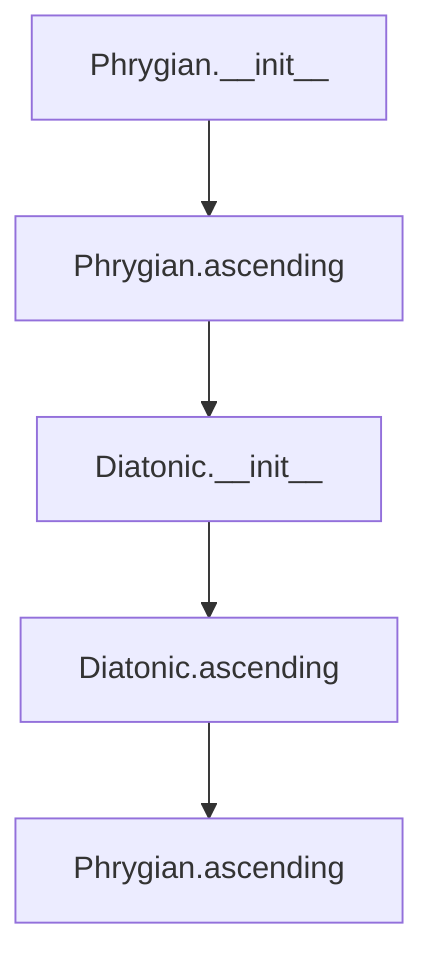

## Raises:
- `NoteFormatError`: Raised by parent _Scale constructor when the note parameter contains invalid formatting (lowercase note validation)
- `RangeError`: Raised by the `degree()` method when degree numbers are less than 1

## Example:
```python
# Create a Phrygian scale starting on 'C'
phrygian_scale = Phrygian('C')

# Get the ascending notes
ascending_notes = phrygian_scale.ascending()
print(ascending_notes)  # ['C', 'Db', 'Eb', 'F', 'G', 'Ab', 'Bb', 'C']

# Create a Phrygian scale spanning 2 octaves
two_octave_scale = Phrygian('A', octaves=2)
```

### `mingus.core.scales.Phrygian.__init__` · *method*

## Summary:
Initializes a Phrygian scale object with a specified tonic note and number of octaves, setting its name attribute to reflect the scale type.

## Description:
This method constructs a Phrygian scale instance by calling the parent _Scale class constructor to handle basic initialization, then formats and assigns a descriptive name to the scale. The Phrygian scale is characterized by its specific interval pattern and is one of the ancient scales.

## Args:
    note (str): The tonic note of the scale (e.g., 'C', 'D#')
    octaves (int): Number of octaves to include in the scale. Defaults to 1.

## Returns:
    None: This method initializes the object's state and does not return a value.

## Raises:
    NoteFormatError: Raised by the parent _Scale.__init__ method when the note parameter contains invalid formatting (specifically when note.islower() is True).

## State Changes:
    Attributes READ: self.tonic (accessed in name formatting)
    Attributes WRITTEN: self.tonic (set by parent class), self.name (set by this method)

## Constraints:
    Preconditions: The note parameter must be a valid note string that doesn't consist entirely of lowercase letters.
    Postconditions: The object will have self.tonic set to the provided note value and self.name set to a formatted string indicating the phrygian scale type.

## Side Effects:
    None: This method performs no I/O operations or external service calls. It only modifies the object's internal state.

### `mingus.core.scales.Phrygian.ascending` · *method*

## Summary:
Returns the ascending notes of a Phrygian scale starting from the tonic note, spanning multiple octaves.

## Description:
Generates the ascending sequence of notes for a Phrygian scale by creating a Diatonic scale with semitone pattern (1,5) and extracting the appropriate notes. The resulting scale follows the Phrygian mode pattern where the second degree is flattened compared to a major scale.

## Args:
    None - Uses instance attributes from the Phrygian class

## Returns:
    list[str]: A list of note names representing the ascending Phrygian scale pattern, repeated across the specified number of octaves with the first note appended at the end to complete the scale

## Raises:
    None explicitly raised - relies on underlying methods that may raise exceptions

## State Changes:
    Attributes READ: self.tonic, self.octaves
    Attributes WRITTEN: None

## Constraints:
    Preconditions: 
    - self.tonic must be a valid note string
    - self.octaves must be a positive integer
    Postconditions:
    - Returns a list of note strings in ascending order
    - The returned list represents a complete scale pattern spanning multiple octaves

## Side Effects:
    None - Pure computation with no external I/O or state mutation

## `mingus.core.scales.Lydian` · *class*

## Summary:
Represents a Lydian scale, an ancient musical scale characterized by a raised fourth degree.

## Description:
The Lydian class implements the Lydian scale, one of the ancient musical modes. It inherits from the base _Scale class and provides a specific implementation of the ascending method that generates the characteristic Lydian interval pattern. This scale is commonly used in Western music theory and has a distinctive sound due to its raised fourth degree.

## State:
- tonic (str): The root note of the scale, validated to be in uppercase format
- octaves (int): Number of octaves to generate, defaults to 1
- name (str): Formatted name of the scale in the format "{tonic} lydian"
- type (str): Class attribute indicating this is an "ancient" scale type

## Lifecycle:
- Creation: Instantiate with a root note (uppercase string) and optional number of octaves
- Usage: Call ascending() method to generate the scale notes in ascending order
- Destruction: No special cleanup required, relies on Python's garbage collection

## Method Map:
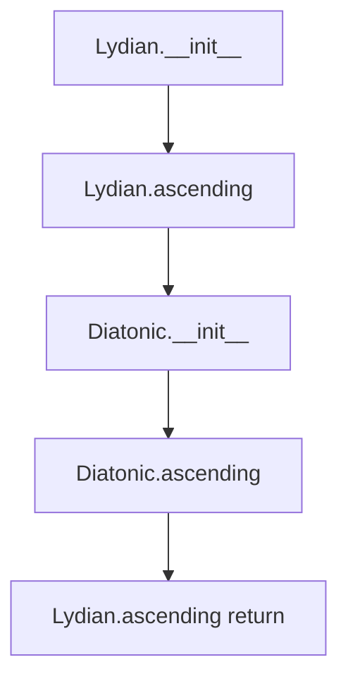

## Raises:
- NoteFormatError: When the note parameter is lowercase (invalid format)
- RangeError: When degree() method is called with invalid degree numbers
- FormatError: When degree() method is called with invalid direction parameter

## Example:
```python
# Create a C Lydian scale
lydian = Lydian("C")
print(lydian.ascending())  # ['C', 'D', 'E', 'F#', 'G', 'A', 'B', 'C']

# Create a G Lydian scale with 2 octaves
lydian_2oct = Lydian("G", 2)
print(lydian_2oct.ascending())  # ['G', 'A', 'B', 'C#', 'D', 'E', 'F#', 'G', 'A', 'B', 'C#', 'D', 'E', 'F#', 'G']
```

### `mingus.core.scales.Lydian.__init__` · *method*

## Summary:
Initializes a Lydian scale object with the specified tonic note and number of octaves, setting its name attribute to reflect the scale type.

## Description:
This method constructs a Lydian scale instance by calling the parent _Scale class constructor to initialize the tonic note and octave count, then formats and assigns a descriptive name to the scale. The Lydian scale is characterized by its augmented fourth interval, making it distinct from other diatonic scales.

## Args:
    note (str): The tonic note of the scale (e.g., 'C', 'D#'). Must be a valid note string.
    octaves (int, optional): The number of octaves to include in the scale. Defaults to 1.

## Returns:
    None: This method initializes the object's state and does not return a value.

## Raises:
    NoteFormatError: Raised by the parent _Scale.__init__ method if the note parameter contains invalid formatting (e.g., lowercase note names that aren't recognized).

## State Changes:
    Attributes READ: self.tonic (accessed to format the name)
    Attributes WRITTEN: self.tonic (set by parent class), self.octaves (set by parent class), self.name (set by this method)

## Constraints:
    Preconditions: The note parameter must be a valid note string that can be processed by the parent class initialization.
    Postconditions: The object will have self.tonic set to the provided note, self.octaves set to the provided value, and self.name set to "{0} lydian" where {0} is the tonic note.

## Side Effects:
    None: This method performs no I/O operations or external service calls. It only modifies the object's internal state.

### `mingus.core.scales.Lydian.ascending` · *method*

## Summary:
Generates the ascending form of a Lydian scale by constructing a diatonic scale with semitone pattern (4,7) and closing it with the tonic note.

## Description:
This method implements the ascending form of a Lydian scale, a seven-note musical scale characterized by a raised fourth degree (the #4). The method creates a diatonic scale using semitone intervals at positions 4 and 7 (minor seconds), removes the final note to create a six-note sequence, repeats this sequence across the specified octaves, and closes the scale by appending the tonic note.

## Args:
    None - This is a method of the Lydian class and operates on instance attributes

## Returns:
    list[str]: A list of note names representing the ascending Lydian scale, with the tonic note repeated at the end to close the scale

## Raises:
    NoteFormatError: If the tonic note is invalid
    RangeError: If octave count is invalid

## State Changes:
    Attributes READ: self.tonic, self.octaves
    Attributes WRITTEN: None - This is a pure method that doesn't modify object state

## Constraints:
    Preconditions: 
    - self.tonic must be a valid note string
    - self.octaves must be a positive integer
    Postconditions:
    - Returns a list of note names forming a complete ascending Lydian scale
    - The returned list contains the tonic note at both the beginning and end

## Side Effects:
    None - This method performs no I/O operations or external service calls

## `mingus.core.scales.Mixolydian` · *class*

## Summary:
Represents a Mixolydian scale, an ancient musical scale pattern that follows a specific interval structure.

## Description:
The Mixolydian scale is a diatonic scale that starts on the fifth degree of the major scale. This class implements the Mixolydian scale pattern by leveraging the Diatonic scale with specific semitone intervals (3, 6) to construct the proper scale structure. It inherits from the base _Scale class and provides the specific ascending() method implementation for Mixolydian scales.

## State:
- tonic (str): The root note of the scale
- octaves (int): Number of octaves to generate (default: 1)
- name (str): Formatted name of the scale including the tonic
- type (str): Scale type identifier set to "ancient"

## Lifecycle:
- Creation: Instantiate with a note string and optional octaves parameter
- Usage: Call ascending() method to retrieve the scale notes in ascending order
- Destruction: No special cleanup required, relies on Python's garbage collection

## Method Map:
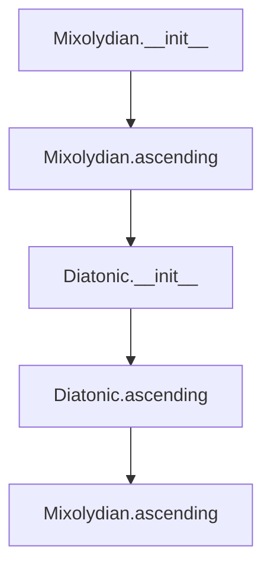

## Raises:
- NoteFormatError: When the provided note string is invalid or lowercase
- RangeError: When degree number is less than 1 (inherited from parent class)
- FormatError: When an invalid direction is provided (inherited from parent class)

## Example:
```python
# Create a C Mixolydian scale
scale = Mixolydian("C")
# Get the ascending notes
notes = scale.ascending()  # Returns ['C', 'D', 'E', 'F', 'G', 'A', 'Bb', 'C']
```

### `mingus.core.scales.Mixolydian.__init__` · *method*

## Summary:
Initializes a Mixolydian scale object with the specified tonic note and octave range.

## Description:
This method constructs a Mixolydian scale instance by initializing the parent scale class with the provided note and octave parameters, then setting an appropriate name for the scale.

## Args:
    note (str): The tonic note of the scale (e.g., 'C', 'D#')
    octaves (int): Number of octaves to include in the scale. Defaults to 1.

## Returns:
    None: This method initializes the object state and returns nothing.

## Raises:
    None explicitly raised in this method. Exceptions may be raised by the parent class constructor.

## State Changes:
    Attributes READ: self.tonic
    Attributes WRITTEN: self.name

## Constraints:
    Preconditions: The note parameter must be a valid musical note string.
    Postconditions: The object will have its name attribute set appropriately by the parent class initialization.

## Side Effects:
    None: This method performs no I/O operations or external service calls.

### `mingus.core.scales.Mixolydian.ascending` · *method*

## Summary:
Returns the ascending notes of a Mixolydian scale by constructing a diatonic pattern with specific semitone positions.

## Description:
This method generates the ascending form of a Mixolydian scale by creating a Diatonic scale with semitone positions (3, 6) and processing the result to form a complete scale pattern. It leverages the Diatonic class to build the basic pattern and then applies octave repetition to create the full scale.

## Args:
    None - This is a method of the Mixolydian class and operates on instance attributes.

## Returns:
    list[str]: A list of note names representing the ascending Mixolydian scale pattern, with the first note repeated at the end to close the octave.

## Raises:
    None - This method doesn't explicitly raise exceptions, though underlying operations may raise NoteFormatError or RangeError from parent classes.

## State Changes:
    Attributes READ: self.tonic, self.octaves
    Attributes WRITTEN: None - This method is read-only and doesn't modify instance state.

## Constraints:
    Preconditions: 
    - self.tonic must be a valid note string
    - self.octaves must be a positive integer
    Postconditions:
    - Returns a list of note names forming a complete ascending Mixolydian scale pattern
    - The returned list represents a closed scale with the tonic note repeated at the end

## Side Effects:
    None - This method performs no I/O operations or external service calls.

## `mingus.core.scales.Aeolian` · *class*

## Summary:
Represents the Aeolian scale, a minor scale pattern commonly used in Western music theory.

## Description:
The Aeolian scale is a diatonic scale that follows the pattern of a natural minor scale. This class implements the Aeolian scale pattern by inheriting from a base scale class and providing a specific implementation of the ascending() method that generates the notes of the Aeolian scale.

## State:
- type: str - Set to "ancient" indicating a historical scale classification
- name: str - Formatted as "{tonic} aeolian" where tonic is the base note
- tonic: str - The base note of the scale (inherited from parent class)
- octaves: int - Number of octaves to generate (inherited from parent class)

## Lifecycle:
- Creation: Instantiate with a note (string) and optional octaves count (int, default 1)
- Usage: Call ascending() method to generate the scale notes in ascending order
- Destruction: No special cleanup required; relies on Python's garbage collection

## Method Map:
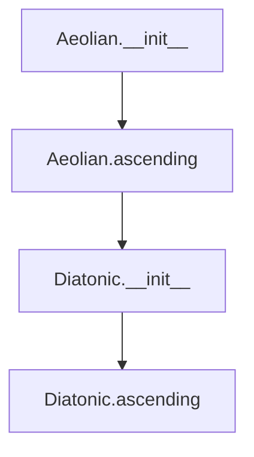

## Raises:
- FormatError: If the note parameter is not in a valid format
- NoteFormatError: If the note cannot be parsed properly
- RangeError: If the octave range is invalid

## Example:
```python
# Create an Aeolian scale starting on C
aeolian_scale = Aeolian("C")
# Generate ascending notes
notes = aeolian_scale.ascending()
# Result would be something like ['C', 'D', 'Eb', 'F', 'G', 'Ab', 'Bb', 'C']
```

### `mingus.core.scales.Aeolian.__init__` · *method*

*No documentation generated.*

### `mingus.core.scales.Aeolian.ascending` · *method*

*No documentation generated.*

## `mingus.core.scales.Locrian` · *class*

## Summary:
Represents the Locrian scale, an ancient musical scale with a distinctive diminished second interval pattern.

## Description:
The Locrian scale is one of the seven modes of the diatonic scale and is considered the most unstable due to its diminished fifth interval. This class implements the Locrian scale by inheriting from the base _Scale class and providing its specific ascending interval pattern. It's typically instantiated when working with ancient or modal music theory applications.

## State:
- tonic (str): The root note of the scale, validated to be uppercase
- octaves (int): Number of octaves to generate, defaults to 1
- name (str): Scale name formatted as "{tonic} locrian"
- type (str): Class attribute set to "ancient" indicating this is an ancient scale

## Lifecycle:
- Creation: Instantiate with a root note (uppercase string) and optional number of octaves
- Usage: Call ascending() method to retrieve the scale notes in ascending order
- Destruction: No special cleanup required, relies on Python's garbage collection

## Method Map:
```mermaid
graph TD
    A[Locrian.__init__] --> B[Scale.__init__]
    B --> C[Set tonic, octaves, name]
    A --> D[Set type="ancient"]
    E[Locrian.ascending] --> F[Diatonic.__init__]
    F --> G[Diatonic.ascending]
    G --> H[Return notes * octaves + [notes[0]]]
```

## Raises:
- NoteFormatError: When the provided note parameter is lowercase (invalid format)
- RangeError: When degree() method is called with invalid degree numbers
- FormatError: When degree() method is called with invalid direction parameter

## Example:
```python
# Create a Locrian scale starting on C
locrian = Locrian("C")
print(locrian.ascending())  # Returns the ascending notes of C Locrian scale

# Create a Locrian scale with multiple octaves
locrian_2oct = Locrian("D", octaves=2)
print(len(locrian_2oct))  # Returns length of 14 notes (2 octaves + 1 octave repeat)
```

### `mingus.core.scales.Locrian.__init__` · *method*

## Summary:
Initializes a Locrian scale object with a specified tonic note and number of octaves.

## Description:
This method constructs a Locrian scale instance by calling the parent _Scale constructor and setting the scale's name attribute. The Locrian scale is an ancient mode characterized by its specific interval pattern.

## Args:
    note (str): The tonic note of the scale (e.g., 'C', 'D#')
    octaves (int): Number of octaves to include in the scale. Defaults to 1.

## Returns:
    None: This is an initializer method that modifies the object's state.

## Raises:
    NoteFormatError: If the provided note string is lowercase (which would be invalid according to the parent class validation).

## State Changes:
    Attributes READ: self.tonic (inherited from _Scale parent class)
    Attributes WRITTEN: self.name (set to "{0} locrian".format(self.tonic))

## Constraints:
    Preconditions: The note parameter must be a valid note string that is not lowercase.
    Postconditions: The object will have self.tonic set to the provided note, self.octaves set to the provided value, and self.name set to the formatted locrian scale name.

## Side Effects:
    None: This method performs no I/O operations or external service calls.

### `mingus.core.scales.Locrian.ascending` · *method*

## Summary:
Returns the ascending notes of a Locrian scale by constructing a diatonic scale with specific semitone intervals and repeating the pattern across octaves.

## Description:
This method implements the Locrian scale by creating a Diatonic scale with semitones (1,4) and extracting its ascending notes. It then repeats these notes for the specified octave range and closes the scale by appending the first note again. This approach leverages the Diatonic class's interval calculation while customizing the semitone pattern to create the Locrian scale structure.

## Args:
    None - Uses instance attributes self.tonic and self.octaves

## Returns:
    list[str]: A list of note names representing the ascending Locrian scale, with the first note repeated at the end to close the scale

## Raises:
    None explicitly raised - inherits any exceptions from Diatonic.ascending()

## State Changes:
    Attributes READ: self.tonic, self.octaves
    Attributes WRITTEN: None

## Constraints:
    Preconditions: self.tonic must be a valid note string, self.octaves must be a positive integer
    Postconditions: The returned list contains the correct Locrian scale pattern with proper octave repetition

## Side Effects:
    None - Pure computation with no external I/O or state mutation

## `mingus.core.scales.Major` · *class*

## Summary:
Represents a major scale for a given tonic note, inheriting from the abstract Scale base class.

## Description:
The Major class implements a major scale generator that produces ascending sequences of notes for a specified tonic note. It is designed to create major scales in music theory applications, where each scale consists of seven notes plus the octave repetition. This class is typically instantiated by users who want to generate major scales for musical composition or analysis.

## State:
- `type` (str): Class attribute set to "major" indicating the scale type
- `tonic` (str): The root note of the scale, inherited from _Scale base class
- `octaves` (int): Number of octaves to include in the scale, inherited from _Scale base class  
- `name` (str): Formatted string combining the tonic with "major" (e.g., "C major")

## Lifecycle:
- Creation: Instantiate with a note string (e.g., "C") and optional octaves parameter (default 1)
- Usage: Call the `ascending()` method to retrieve the scale notes in ascending order
- Destruction: No special cleanup required; uses standard Python garbage collection

## Method Map:
```mermaid
graph TD
    A[Major.__init__] --> B[Super.__init__]
    B --> C[Set name attribute]
    A --> D[Initialize tonic and octaves]
    D --> E[Major.ascending]
    E --> F[get_notes(self.tonic)]
    F --> G[Return notes * octaves + [notes[0]]]
```

## Raises:
- `NoteFormatError`: Raised by parent _Scale.__init__ if the note parameter contains invalid formatting (e.g., lowercase note names)
- `FormatError`: Raised by parent _Scale.degree() if an invalid direction parameter is passed

## Example:
```python
# Create a C major scale spanning one octave
scale = Major("C")
print(scale.ascending())  # ['C', 'D', 'E', 'F', 'G', 'A', 'B', 'C']

# Create a G major scale spanning two octaves
scale = Major("G", octaves=2)
print(scale.ascending())  # ['G', 'A', 'B', 'C', 'D', 'E', 'F#', 'G', 'A', 'B', 'C', 'D', 'E', 'F#', 'G']
```

### `mingus.core.scales.Major.__init__` · *method*

## Summary:
Initializes a Major scale object with a specified tonic note and number of octaves.

## Description:
This method constructs a Major scale instance by calling the parent _Scale constructor and setting the scale's name attribute to follow the format "{tonic} major".

## Args:
    note (str): The tonic note of the major scale
    octaves (int): Number of octaves to include in the scale. Defaults to 1.

## Returns:
    None: This is an initializer method that sets up the object's state.

## Raises:
    NoteFormatError: If the note parameter is in lowercase format (which is considered invalid)

## State Changes:
    Attributes READ: self.tonic (inherited from _Scale parent class)
    Attributes WRITTEN: self.name (sets the name attribute to "{0} major".format(self.tonic))

## Constraints:
    Preconditions: The note parameter must be a valid musical note string in proper case format
    Postconditions: The object will have self.tonic set to the provided note, self.octaves set to the provided value, and self.name set to "{tonic} major"

## Side Effects:
    None: This method performs no I/O operations or external service calls.

### `mingus.core.scales.Major.ascending` · *method*

## Summary:
Generates the ascending scale pattern for a major scale by repeating the key notes across octaves and appending the tonic note.

## Description:
This method constructs the ascending form of a major scale by retrieving the notes in the scale's tonic key, repeating them for the specified number of octaves, and appending the tonic note to complete the scale pattern. This follows the standard major scale construction where the scale ascends through the diatonic notes and returns to the tonic in the next octave.

## Args:
    None

## Returns:
    list[str]: A list of note strings representing the ascending major scale pattern, where each note is in the format "NoteLetter[Accidental]" (e.g., "C", "D#", "Eb"). The length of the returned list is (7 * self.octaves) + 1, where 7 represents the number of diatonic notes in a major scale.

## Raises:
    NoteFormatError: When the tonic note format is invalid or unrecognized.

## State Changes:
    Attributes READ: self.tonic, self.octaves
    Attributes WRITTEN: None

## Constraints:
    Preconditions: 
    - self.tonic must be a valid note string (e.g., "C", "D#", "Eb")
    - self.octaves must be a non-negative integer
    Postconditions:
    - Returns a list of note strings in ascending order
    - The returned list contains exactly (7 * self.octaves) + 1 notes
    - The last note in the list matches the first note (tonic) to complete the scale

## Side Effects:
    None

## `mingus.core.scales.HarmonicMajor` · *class*

*No documentation generated.*

### `mingus.core.scales.HarmonicMajor.__init__` · *method*

## Summary:
Initializes a HarmonicMajor scale object with the specified tonic note and number of octaves, setting its name to include the tonic note.

## Description:
This method constructs a HarmonicMajor scale instance by calling the parent _Scale class constructor to initialize the tonic note and octave count, then formats and assigns a descriptive name to the scale object.

## Args:
    note (str): The tonic note of the scale (e.g., 'C', 'D#')
    octaves (int): Number of octaves to include in the scale. Defaults to 1.

## Returns:
    None: This is an initializer method that modifies the object's state in-place.

## Raises:
    NoteFormatError: If the note parameter contains invalid formatting (specifically when note.islower() is True)

## State Changes:
    Attributes READ: self.tonic (accessed in name formatting)
    Attributes WRITTEN: self.tonic (set by parent constructor), self.octaves (set by parent constructor), self.name (set by this method)

## Constraints:
    Preconditions: The note parameter must be a valid note string that doesn't consist entirely of lowercase letters
    Postconditions: The object will have self.tonic set to the provided note, self.octaves set to the provided octaves value, and self.name set to "{0} harmonic major" formatted with the tonic note

## Side Effects:
    None: This method performs no I/O operations or external service calls. It only modifies the object's internal state.

### `mingus.core.scales.HarmonicMajor.ascending` · *method*

## Summary:
Returns the ascending notes of a harmonic major scale by modifying a major scale pattern.

## Description:
This method generates the ascending form of a harmonic major scale by creating a major scale with the same tonic, removing its last note, diminishing the sixth degree, and repeating the resulting pattern for the specified number of octaves. The result includes the octave repetition pattern typical of scale implementations.

## Args:
    None

## Returns:
    list[str]: A list of note names representing the ascending harmonic major scale pattern. The pattern consists of the first six notes of a major scale with the sixth note diminished, repeated for the specified number of octaves, followed by the first note of the pattern.

## Raises:
    None explicitly raised

## State Changes:
    Attributes READ: self.tonic, self.octaves
    Attributes WRITTEN: None

## Constraints:
    Preconditions: The object must be properly initialized with a valid tonic note and positive octaves count.
    Postconditions: The returned list contains note names following the harmonic major scale pattern with the sixth degree flattened.

## Side Effects:
    None

## `mingus.core.scales.NaturalMinor` · *class*

## Summary:
Represents a natural minor scale, inheriting from the abstract _Scale base class.

## Description:
The NaturalMinor class implements a specific type of musical scale that follows the natural minor pattern. It is designed to generate the ascending form of a natural minor scale starting from a given tonic note. This class is part of the mingus music theory library and provides functionality for working with natural minor scales in musical composition and analysis.

## State:
- tonic (str): The root note of the scale, stored from initialization
- octaves (int): Number of octaves to include in the scale, defaults to 1
- name (str): Formatted string describing the scale (e.g., "C natural minor")
- type (str): Class attribute indicating this is a "minor" scale type

## Lifecycle:
- Creation: Instantiate with a note (string) and optional octaves count (integer)
- Usage: Call the ascending() method to retrieve the scale notes
- Destruction: No special cleanup required, uses standard Python garbage collection

## Method Map:
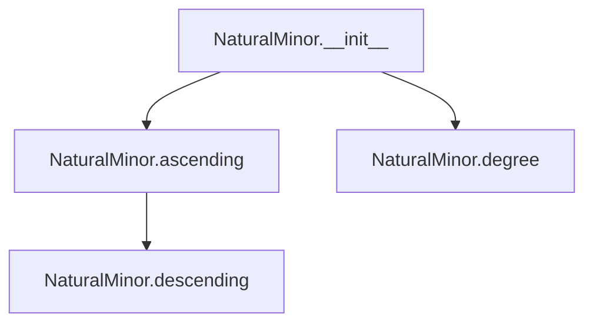

## Raises:
- NoteFormatError: Raised by parent _Scale class when note format is invalid (if note.islower() is true)
- RangeError: Raised by degree() method when degree number is less than 1
- FormatError: Raised by degree() method when direction parameter is not "a" or "d"

## Example:
```python
# Create a C natural minor scale
scale = NaturalMinor("C", octaves=2)

# Get the ascending notes
ascending_notes = scale.ascending()
# Returns: ['C', 'D', 'Eb', 'F', 'G', 'Ab', 'Bb', 'C']

# Access the scale name
print(scale.name)
# Prints: "C natural minor"

# The scale inherits from _Scale, so it also has descending method
descending_notes = scale.descending()
# Returns: ['C', 'Bb', 'Ab', 'G', 'F', 'Eb', 'D', 'C']

# Access individual degrees
first_degree = scale.degree(1)  # Returns: 'C'
third_degree = scale.degree(3)  # Returns: 'Eb'
```

### `mingus.core.scales.NaturalMinor.__init__` · *method*

## Summary:
Initializes a NaturalMinor scale object with a tonic note and optional octave count, setting its name attribute.

## Description:
This constructor creates a NaturalMinor scale instance by calling the parent _Scale class constructor and then formatting the scale's name as "{tonic} natural minor". It's responsible for establishing the basic structure and naming convention for natural minor scales within the mingus music theory library.

## Args:
    note (str): The tonic note of the scale (e.g., 'C', 'D#'). Must be a valid note string.
    octaves (int): Number of octaves to include in the scale. Defaults to 1.

## Returns:
    None: This method initializes the object in-place and does not return a value.

## Raises:
    NoteFormatError: Raised by the parent class when the note parameter is invalid (specifically when note.islower() is True).

## State Changes:
    Attributes READ: self.tonic
    Attributes WRITTEN: self.name

## Constraints:
    Preconditions: 
    - The note parameter must be a valid note string (not lowercase only)
    - The octaves parameter must be a non-negative integer
    
    Postconditions:
    - The object will have self.tonic set to the provided note
    - The object will have self.octaves set to the provided octaves value
    - The object will have self.name set to "{tonic} natural minor"

## Side Effects:
    None: This method performs no I/O operations or external service calls.

### `mingus.core.scales.NaturalMinor.ascending` · *method*

## Summary:
Returns the ascending form of a natural minor scale starting from the tonic note, including the octave repetition.

## Description:
This method generates the ascending sequence of notes for a natural minor scale. It retrieves the standard 7-note pattern for the scale's tonic, repeats it for the specified number of octaves, and appends the tonic note at the end to complete the scale pattern. This creates a proper ascending scale that ends on the same note it started with.

## Args:
    None - This is a method that operates on the instance attributes

## Returns:
    list[str]: A list of note strings representing the ascending natural minor scale. The list contains (7 * self.octaves + 1) notes, where the first and last notes are identical (the tonic note).

## Raises:
    NoteFormatError: When the tonic note format is invalid or unrecognized by the underlying get_notes function

## State Changes:
    Attributes READ: self.tonic, self.octaves
    Attributes WRITTEN: None

## Constraints:
    Preconditions: 
    - self.tonic must be a valid note string (e.g., "C", "D#", etc.) that can be processed by get_notes()
    - self.octaves must be a non-negative integer
    
    Postconditions:
    - The returned list contains exactly (7 * self.octaves + 1) notes
    - The first and last notes in the returned list are identical (the tonic note)
    - All intermediate notes follow the natural minor scale pattern

## Side Effects:
    None - This method is pure and has no side effects

## `mingus.core.scales.HarmonicMinor` · *class*

## Summary:
Represents a harmonic minor scale, which is a variant of the minor scale with the 7th degree raised by a semitone.

## Description:
The HarmonicMinor class implements the harmonic minor scale, a musical scale commonly used in classical and romantic music. It differs from the natural minor scale by raising the 7th degree (leading tone) by a semitone, creating a stronger pull toward the tonic. This class inherits from the base _Scale class and provides the specific implementation for harmonic minor scales.

## State:
- tonic (str): The root note of the scale, represented as a string (e.g., 'C', 'D#')
- octaves (int): Number of octaves to generate, defaults to 1
- name (str): The descriptive name of the scale, formatted as "{tonic} harmonic minor"

## Lifecycle:
- Creation: Instantiate with a root note (string) and optional number of octaves (integer)
- Usage: Call the ascending() method to retrieve the scale notes in ascending order
- Destruction: No special cleanup required; relies on Python's garbage collection

## Method Map:
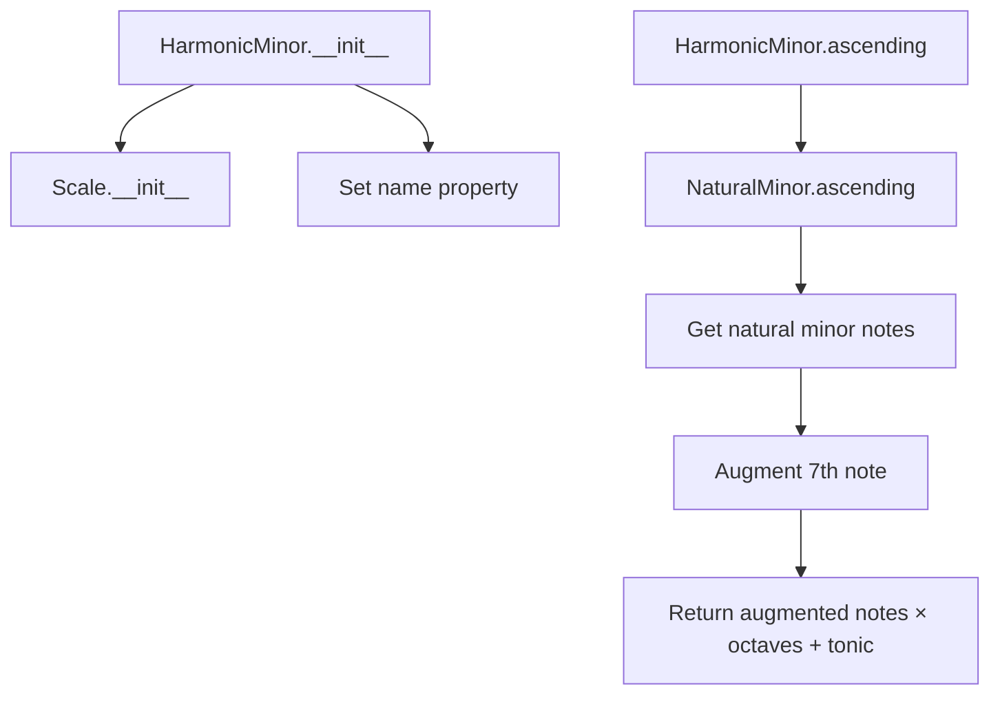

## Raises:
- NoteFormatError: When the provided note string is invalid or lowercase
- RangeError: When degree numbers are less than 1 in the degree() method
- FormatError: When an unrecognized direction is provided in the degree() method

## Example:
```python
# Create a C harmonic minor scale
scale = HarmonicMinor('C')
# Get the ascending notes
notes = scale.ascending()
# Output would be: ['C', 'D', 'Eb', 'F', 'G', 'Ab', 'B', 'C']
```

### `mingus.core.scales.HarmonicMinor.__init__` · *method*

## Summary:
Initializes a HarmonicMinor scale object with the specified tonic note and number of octaves.

## Description:
Constructs a HarmonicMinor scale instance by calling the parent _Scale constructor and setting the scale's name attribute to indicate it is a harmonic minor scale rooted at the specified tonic note.

## Args:
    note (str): The tonic note of the scale (e.g., 'C', 'D#')
    octaves (int, optional): Number of octaves to include in the scale. Defaults to 1.

## Returns:
    None: This method initializes the object's state and does not return a value.

## Raises:
    NoteFormatError: If the provided note string is invalid or in lowercase format.

## State Changes:
    Attributes READ: self.tonic (inherited from _Scale parent class)
    Attributes WRITTEN: self.name (set to formatted string "{0} harmonic minor")

## Constraints:
    Preconditions: The note parameter must be a valid note string that can be processed by the parent _Scale class.
    Postconditions: The object will have self.tonic set to the provided note and self.octaves set to the provided value, with self.name properly formatted.

## Side Effects:
    None: This method performs no I/O operations or external service calls.

### `mingus.core.scales.HarmonicMinor.ascending` · *method*

## Summary:
Returns the ascending form of a harmonic minor scale starting from the tonic note.

## Description:
This method generates the ascending form of a harmonic minor scale by taking the natural minor scale notes, removing the last note, augmenting the 7th degree note, and repeating the pattern for the specified number of octaves before closing the scale with the first note.

## Args:
    None

## Returns:
    list[str]: A list of note names representing the ascending harmonic minor scale. The notes are repeated for the number of octaves specified during initialization, with the first note appended at the end to close the scale.

## Raises:
    None explicitly raised

## State Changes:
    Attributes READ: self.tonic, self.octaves
    Attributes WRITTEN: None

## Constraints:
    Preconditions: The class must be properly initialized with a valid tonic note and octaves count
    Postconditions: The returned list contains the correct harmonic minor scale notes in ascending order

## Side Effects:
    None

## `mingus.core.scales.MelodicMinor` · *class*

## Summary:
Represents a melodic minor scale, which is a diatonic scale that raises the 6th and 7th degrees when ascending but keeps them natural when descending.

## Description:
The MelodicMinor class implements the melodic minor scale pattern, which differs from the natural minor scale in that the 6th and 7th degrees are raised (sharpened) when ascending, but remain natural when descending. This class inherits from the abstract _Scale base class and provides concrete implementations for ascending and descending scale patterns.

This class is typically instantiated by calling its constructor with a tonic note and optional octave count. It's commonly used in music theory applications and composition tools where melodic minor scales need to be generated.

## State:
- `type`: str - Set to "minor" indicating this is a minor scale type
- `tonic`: str - The root note of the scale (inherited from _Scale parent class)
- `octaves`: int - Number of octaves to generate (inherited from _Scale parent class)
- `name`: str - Formatted name of the scale (e.g., "C melodic minor")

## Lifecycle:
- Creation: Instantiate with a note string (e.g., "C") and optional octaves count (default 1)
- Usage: Call ascending() or descending() methods to retrieve scale notes
- Destruction: No special cleanup required; uses standard Python garbage collection

## Method Map:
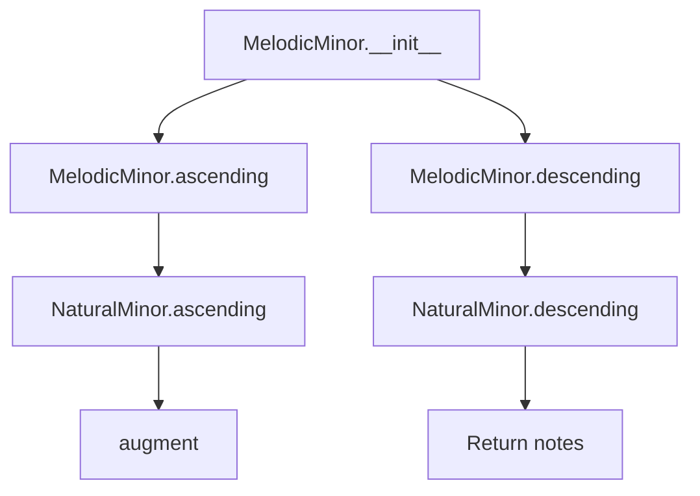

## Raises:
- NoteFormatError: Raised by parent _Scale.__init__ if the note parameter contains invalid formatting
- RangeError: Raised by degree() method if degree number is less than 1
- FormatError: Raised by degree() method if direction parameter is not "a" or "d"

## Example:
```python
# Create a C melodic minor scale
scale = MelodicMinor("C")
print(scale.ascending())  # ['C', 'D', 'Eb', 'F', 'G', 'A', 'B', 'C']
print(scale.descending()) # ['C', 'B', 'A', 'G', 'F', 'Eb', 'D', 'C']

# Create a C melodic minor scale spanning 2 octaves
scale2 = MelodicMinor("C", octaves=2)
print(scale2.ascending())  # ['C', 'D', 'Eb', 'F', 'G', 'A', 'B', 'C', 'D', 'Eb', 'F', 'G', 'A', 'B', 'C']
```

### `mingus.core.scales.MelodicMinor.__init__` · *method*

## Summary:
Initializes a MelodicMinor scale object with the specified tonic note and number of octaves.

## Description:
This constructor creates a melodic minor scale instance by calling the parent _Scale class constructor and setting the appropriate name attribute. The melodic minor scale is characterized by its ascending form which raises the 6th and 7th degrees compared to natural minor.

## Args:
    note (str): The tonic note of the scale (e.g., 'C', 'D#')
    octaves (int): Number of octaves to include in the scale. Defaults to 1.

## Returns:
    None: This is a constructor method that initializes the object state.

## Raises:
    NoteFormatError: If the note parameter contains invalid formatting (specifically if it's lowercase and unrecognized)

## State Changes:
    Attributes READ: self.tonic
    Attributes WRITTEN: self.tonic, self.octaves, self.name

## Constraints:
    Preconditions: The note parameter must be a valid musical note string
    Postconditions: The object will have self.tonic set to the provided note, self.octaves set to the provided value, and self.name set to "{0} melodic minor".format(self.tonic)

## Side Effects:
    None: This method performs no I/O operations or external service calls.

### `mingus.core.scales.MelodicMinor.ascending` · *method*

## Summary:
Returns the ascending melodic minor scale notes with the 6th and 7th degrees augmented.

## Description:
This method generates the ascending form of a melodic minor scale by taking the natural minor scale, augmenting the 6th and 7th degrees, and repeating the pattern across specified octaves. It's specifically designed for melodic minor scales where the ascending form raises the 6th and 7th scale degrees.

## Args:
    None

## Returns:
    list[str]: A list of note names representing the ascending melodic minor scale, with the 6th and 7th degrees augmented and repeated across octaves.

## Raises:
    None explicitly raised

## State Changes:
    Attributes READ: self.tonic, self.octaves
    Attributes WRITTEN: None

## Constraints:
    Preconditions: 
    - self.tonic must be a valid note name (e.g., 'C', 'D#')
    - self.octaves must be a positive integer
    
    Postconditions:
    - Returns a list of note names in ascending melodic minor scale order
    - The returned list contains the 6th and 7th degrees augmented
    - The scale repeats across the specified number of octaves

## Side Effects:
    None

### `mingus.core.scales.MelodicMinor.descending` · *method*

## Summary:
Returns a descending melodic minor scale starting from the tonic note.

## Description:
This method generates a descending melodic minor scale by taking the descending form of the natural minor scale for the same tonic, removing the final note to prevent duplication, and then extending it across multiple octaves before closing the scale with the first note. This follows the standard melodic minor scale construction where the descending form is identical to the natural minor scale.

## Args:
    None

## Returns:
    list[str]: A list of note names representing the descending melodic minor scale, with the first note repeated at the end to close the scale across all octaves.

## Raises:
    None explicitly raised by this method. Exceptions may be raised by underlying methods:
    - NoteFormatError: If the tonic note format is invalid (passed to NaturalMinor constructor)
    - RangeError: If degree calculation attempts to access invalid scale degrees (inherited from _Scale)

## State Changes:
    Attributes READ: self.tonic, self.octaves
    Attributes WRITTEN: None

## Constraints:
    Preconditions: 
    - self.tonic must be a valid note name string
    - self.octaves must be a positive integer
    Postconditions:
    - Returns a list of note names in descending order
    - The returned list represents a complete scale with proper octave extension

## Side Effects:
    None

## `mingus.core.scales.Bachian` · *class*

## Summary:
Represents a Bachian scale, a variant of the melodic minor scale with specific ascending pattern modifications.

## Description:
The Bachian scale is a musical scale that follows a modified ascending pattern derived from the melodic minor scale. It's designed to provide a distinctive sound often associated with Bach's compositional style. This class inherits from the abstract base _Scale class and implements a specific ascending method that differs from standard scales.

This class is typically instantiated when creating a Bachian scale for musical analysis, composition, or educational purposes. It's part of a hierarchy of scale implementations that includes _Scale, NaturalMinor, MelodicMinor, and others.

## State:
- tonic (str): The base note of the scale, represented as a string (e.g., "C", "D#")
- octaves (int): Number of octaves to include in the scale representation, defaults to 1
- name (str): The formatted name of the scale, constructed as "{tonic} Bachian"
- type (str): Class attribute indicating this is a minor scale, always set to "minor"

## Lifecycle:
- Creation: Instantiate with a note (string) and optional octaves count (integer)
- Usage: Call methods like ascending() to retrieve scale notes
- Destruction: No special cleanup required; relies on Python's garbage collection

## Method Map:
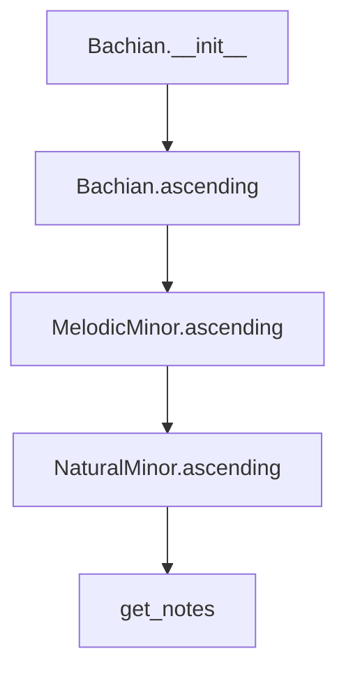

## Raises:
- NoteFormatError: Raised when the provided note parameter contains invalid formatting (specifically when note.islower() returns True)
- RangeError: Raised when degree() method is called with a degree number less than 1
- FormatError: Raised when degree() method is called with an unrecognized direction parameter

## Example:
```python
# Create a Bachian scale starting on C
bachian_scale = Bachian("C")

# Get the ascending notes
ascending_notes = bachian_scale.ascending()
print(ascending_notes)  # Returns notes in Bachian pattern

# Create a Bachian scale spanning 2 octaves
two_octave_bachian = Bachian("A", octaves=2)
```

### `mingus.core.scales.Bachian.__init__` · *method*

## Summary:
Initializes a Bachian scale object with a specified tonic note and number of octaves.

## Description:
This method constructs a Bachian scale instance by calling the parent _Scale constructor and setting an appropriate name for the scale. The Bachian scale is a specific type of minor scale that follows particular melodic patterns.

## Args:
    note (str): The tonic note of the scale (e.g., 'C', 'D#')
    octaves (int): Number of octaves to include in the scale. Defaults to 1.

## Returns:
    None: This is an initializer method that sets up the object's state.

## Raises:
    NoteFormatError: If the note parameter contains invalid formatting (specifically if it's lowercase and unrecognized)

## State Changes:
    Attributes READ: self.tonic
    Attributes WRITTEN: self.name

## Constraints:
    Preconditions: The note parameter must be a valid musical note string
    Postconditions: The object will have self.tonic set to the provided note and self.name set to "{note} Bachian"

## Side Effects:
    None: This method performs no I/O operations or external service calls.

### `mingus.core.scales.Bachian.ascending` · *method*

## Summary:
Generates an ascending Bachian scale pattern by combining melodic minor notes with octave repetition.

## Description:
This method constructs an ascending Bachian scale by first generating a melodic minor scale starting from the tonic note, removing the final note, repeating the remaining notes for the specified number of octaves, and then appending the first note to complete the scale pattern. This creates a distinctive ascending scale characteristic of the Bachian scale system.

## Args:
    None - Uses instance attributes self.tonic and self.octaves

## Returns:
    list[str]: A list of note strings representing the ascending Bachian scale pattern

## Raises:
    NoteFormatError: If the tonic note format is invalid
    RangeError: If degree number is less than 1 (when accessing via degree method)

## State Changes:
    Attributes READ: self.tonic, self.octaves
    Attributes WRITTEN: None

## Constraints:
    Preconditions: 
    - self.tonic must be a valid note string
    - self.octaves must be a positive integer
    Postconditions:
    - Returns a list of note strings forming a complete ascending scale pattern
    - The returned list represents a closed scale with the first note repeated at the end

## Side Effects:
    None - Pure computation with no external dependencies or I/O operations

## `mingus.core.scales.MinorNeapolitan` · *class*

## Summary:
Represents the Minor Neapolitan scale, a variant of the minor scale with specific alterations to the second and seventh degrees.

## Description:
The MinorNeapolitan class implements the Minor Neapolitan scale, which is a variant of the natural minor scale with specific modifications. It inherits from the base _Scale class and provides implementations for both ascending and descending forms of this scale. This class is typically instantiated by users who need to work with the Minor Neapolitan scale in musical applications.

## State:
- tonic (str): The root note of the scale, set during initialization
- octaves (int): Number of octaves to include in the scale representation, defaults to 1
- name (str): Formatted name of the scale including the tonic note, e.g., "C minor Neapolitan"

## Lifecycle:
- Creation: Instantiate with a note string (e.g., "C") and optional octaves parameter
- Usage: Call ascending() and descending() methods to retrieve scale notes
- Destruction: No special cleanup required; uses standard Python garbage collection

## Method Map:
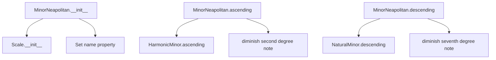

## Raises:
- NoteFormatError: Raised when an invalid note format is provided during initialization
- RangeError: Raised when degree numbers are out of valid range in the degree() method inherited from _Scale

## Example:
```python
# Create a C minor Neapolitan scale
scale = MinorNeapolitan("C")

# Get ascending form
ascending_notes = scale.ascending()
# Returns: ['C', 'Db', 'Eb', 'F', 'G', 'Ab', 'Bb', 'C']

# Get descending form  
descending_notes = scale.descending()
# Returns: ['C', 'Bb', 'Ab', 'G', 'F', 'Eb', 'Db', 'C']
```

### `mingus.core.scales.MinorNeapolitan.__init__` · *method*

## Summary:
Initializes a MinorNeapolitan scale object with the specified tonic note and number of octaves.

## Description:
This method constructs a MinorNeapolitan scale instance by calling the parent scale constructor and setting an appropriate name for the scale. The MinorNeapolitan scale is a specific type of minor scale with particular interval patterns.

## Args:
    note (str): The tonic note of the scale (e.g., 'C', 'D#')
    octaves (int): Number of octaves to include in the scale. Defaults to 1.

## Returns:
    None: This is an initializer method that sets up the object's state.

## Raises:
    NoteFormatError: If the provided note is in an invalid format (e.g., lowercase note that isn't recognized)

## State Changes:
    Attributes READ: self.tonic
    Attributes WRITTEN: self.tonic, self.octaves, self.name

## Constraints:
    Preconditions: The note parameter must be a valid musical note string
    Postconditions: The object will have self.tonic set to the provided note, self.octaves set to the provided value, and self.name set to "{0} minor Neapolitan" format

## Side Effects:
    None: This method performs no I/O operations or external service calls.

### `mingus.core.scales.MinorNeapolitan.ascending` · *method*

## Summary:
Returns the ascending form of a Minor Neapolitan scale starting from the specified tonic note.

## Description:
This method generates the ascending form of the Minor Neapolitan scale by taking the ascending form of the Harmonic Minor scale, removing the last note, diminishing the second degree (index 1), and then repeating the pattern for the specified number of octaves.

## Args:
    None - This is a method of the MinorNeapolitan class and does not accept additional arguments.

## Returns:
    list[str]: A list of note names representing the ascending Minor Neapolitan scale pattern, with the second degree diminished and repeated across the specified octaves.

## Raises:
    None - This method does not explicitly raise exceptions, though underlying methods may raise FormatError, NoteFormatError, or RangeError.

## State Changes:
    Attributes READ: self.tonic, self.octaves
    Attributes WRITTEN: None - This method is read-only and doesn't modify instance state.

## Constraints:
    Preconditions: The class instance must have a valid tonic note and octaves count.
    Postconditions: The returned list contains the proper ascending Minor Neapolitan scale pattern with correct accidentals.

## Side Effects:
    None - This method performs no I/O operations or external service calls.

### `mingus.core.scales.MinorNeapolitan.descending` · *method*

## Summary:
Returns the descending form of the Minor Neapolitan scale with the leading tone flattened.

## Description:
This method generates the descending version of the Minor Neapolitan scale by taking the descending notes from a Natural Minor scale, flattening the seventh degree (leading tone), and repeating the pattern across specified octaves. The Minor Neapolitan scale is a variant of the natural minor scale where the ascending form raises the sixth and seventh degrees, while the descending form typically uses the natural minor pattern with a flattened seventh degree.

## Args:
    None

## Returns:
    list[str]: A list of note names representing the descending Minor Neapolitan scale, with the seventh degree flattened and repeated across octaves.

## Raises:
    None explicitly raised

## State Changes:
    Attributes READ: self.tonic, self.octaves
    Attributes WRITTEN: None

## Constraints:
    Preconditions: 
    - self.tonic must be a valid musical note string
    - self.octaves must be a positive integer
    
    Postconditions:
    - The returned list contains the descending Minor Neapolitan scale pattern
    - The seventh degree (leading tone) is flattened using the diminish function
    - The scale repeats across the specified number of octaves

## Side Effects:
    None

## `mingus.core.scales.Chromatic` · *class*

## Summary:
A chromatic scale generator that produces a chromatic scale for a given musical key, including proper handling of accidentals for smooth transitions.

## Description:
The Chromatic class generates chromatic scales for musical keys by extending the base _Scale class. It creates a chromatic scale that follows the notes of a specific key signature while properly applying accidentals to ensure smooth transitions between notes. The scale maintains musical correctness by detecting major second intervals and adjusting accidentals accordingly.

## State:
- key (str): The musical key for which the chromatic scale is generated
- tonic (str): The first note of the chromatic scale, derived from the key using get_notes()
- octaves (int): Number of octaves to include in the scale, defaults to 1
- name (str): Formatted name of the scale in the form "{tonic} chromatic"
- type (str): Class attribute set to "other" indicating this is a special scale type

## Lifecycle:
- Creation: Instantiate with a key string and optional octaves parameter (defaults to 1)
- Usage: Call ascending() or descending() methods to retrieve scale notes
- Destruction: No special cleanup required, uses standard Python garbage collection

## Method Map:
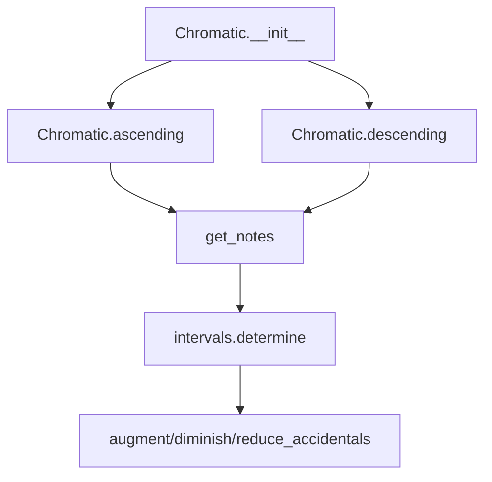

## Raises:
- NoteFormatError: Raised by get_notes() if the key format is invalid
- RangeError: Raised by degree() method if degree number is less than 1
- FormatError: Raised by degree() method if direction is not "a" or "d"

## Example:
```python
# Create a chromatic scale for C major
scale = Chromatic("C")
# Get ascending notes
ascending_notes = scale.ascending()
print(ascending_notes)
# Get descending notes  
descending_notes = scale.descending()
print(descending_notes)
```

### `mingus.core.scales.Chromatic.__init__` · *method*

## Summary:
Initializes a Chromatic scale object with a specified key and number of octaves.

## Description:
This method constructs a Chromatic scale instance by setting the key, calculating the tonic note, defining the number of octaves, and formatting the scale name. It serves as the primary constructor for creating Chromatic scale objects within the mingus music theory library.

## Args:
    key (str): The musical key for the chromatic scale (e.g., "C", "G#", "Fb").
    octaves (int, optional): Number of octaves to include in the scale. Defaults to 1.

## Returns:
    None: This method initializes instance attributes and does not return a value.

## Raises:
    NoteFormatError: Raised by get_notes() when the provided key is not recognized or in an invalid format.

## State Changes:
    Attributes READ: None
    Attributes WRITTEN: self.key, self.tonic, self.octaves, self.name

## Constraints:
    Preconditions: The key parameter must be a valid musical key recognizable by the library's key validation system.
    Postconditions: The instance will have properly initialized attributes representing a chromatic scale.

## Side Effects:
    None: This method performs no I/O operations or external service calls. It only initializes internal object state.

### `mingus.core.scales.Chromatic.ascending` · *method*

## Summary:
Constructs an ascending chromatic scale starting from the tonic, with proper handling of enharmonic equivalents through augmentation.

## Description:
Generates an ascending chromatic scale by traversing the notes of the key and applying augmentation to notes that form major second intervals with their predecessors. This ensures proper enharmonic spelling in the resulting scale. The scale spans the specified number of octaves.

## Args:
    None

## Returns:
    list[str]: A list of note names representing the ascending chromatic scale, repeated for the specified number of octaves. The scale begins and ends with the tonic note.

## Raises:
    NoteFormatError: If the key is invalid or unrecognized.
    RangeError: If octave count is invalid (handled by parent class).

## State Changes:
    Attributes READ: self.tonic, self.key, self.octaves
    Attributes WRITTEN: None

## Constraints:
    Preconditions: 
    - self.key must be a valid musical key
    - self.tonic must be derived from self.key
    - self.octaves must be a positive integer
    
    Postconditions:
    - Returns a list of note names in ascending order
    - The returned list represents a complete chromatic scale with proper accidentals
    - The scale spans exactly self.octaves octaves
    - The first and last elements of the returned list are identical (tonic)

## Side Effects:
    None

### `mingus.core.scales.Chromatic.descending` · *method*

## Summary:
Generates a descending chromatic scale starting from the tonic note, with proper interval handling and accidentals.

## Description:
Creates a descending chromatic scale by processing notes from the key in reverse order. For each note, it determines the interval from the previous note in the sequence. When a major second interval is detected, it adjusts the previous note by reducing accidentals before adding the current note. This ensures proper chromatic scale construction with correct accidentals. The resulting scale is repeated for the specified number of octaves plus the initial note.

This method is separated from the ascending method because descending scales require different interval detection logic and accidental adjustment patterns compared to ascending scales.

## Args:
    None

## Returns:
    list[str]: A list of note strings representing the descending chromatic scale. The list contains the notes in descending order, repeated for self.octaves times, with the first note appended at the end to complete the scale.

## Raises:
    NoteFormatError: When an invalid key format is provided to get_notes().

## State Changes:
    Attributes READ: self.tonic, self.key, self.octaves
    Attributes WRITTEN: None

## Constraints:
    Preconditions: The object must have valid key, tonic, and octaves attributes initialized. The key must be a valid musical key format.
    Postconditions: Returns a properly constructed descending chromatic scale with correct accidentals and appropriate octave repetition.

## Side Effects:
    None

## `mingus.core.scales.WholeTone` · *class*

## Summary:
Represents a whole tone scale, a musical scale consisting entirely of whole steps.

## Description:
The WholeTone class generates a whole tone scale starting from a given note. A whole tone scale consists of six notes where each adjacent pair of notes is separated by a whole step (major second interval). This class inherits from the base _Scale class and provides a concrete implementation of the ascending method that produces the characteristic whole tone pattern.

This class is typically instantiated by calling its constructor with a tonic note and optional number of octaves. It's commonly used in music theory applications and composition to generate whole tone scales.

## State:
- tonic (str): The starting note of the scale (e.g., "C", "D#")
- octaves (int): Number of octaves to include in the scale (default: 1)
- name (str): Formatted name of the scale (e.g., "C whole tone")
- type (str): Scale type identifier, always "other" for this class

## Lifecycle:
- Creation: Instantiate with a note string and optional octaves parameter
- Usage: Call the ascending() method to retrieve the scale notes
- Destruction: No special cleanup required; relies on Python's garbage collection

## Method Map:
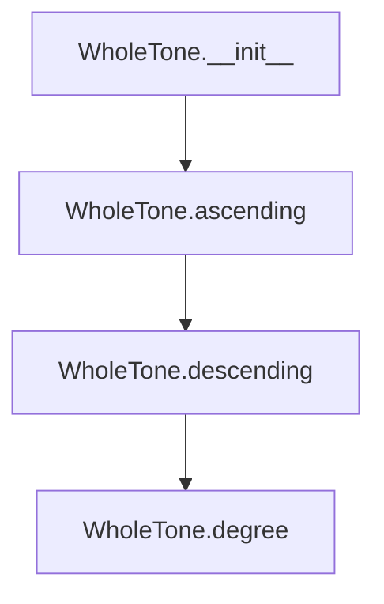

## Raises:
- NoteFormatError: Raised when the input note string is invalid (contains lowercase letters)
- RangeError: Raised when degree() method is called with invalid degree numbers
- FormatError: Raised when degree() method is called with invalid direction parameter

## Example:
```python
# Create a C whole tone scale
scale = WholeTone("C")
notes = scale.ascending()
# Returns: ['C', 'D', 'E', 'F#', 'G#', 'A#', 'C']

# Create a whole tone scale spanning 2 octaves
scale = WholeTone("A", octaves=2)
notes = scale.ascending()
# Returns: ['A', 'B', 'C#', 'D#', 'F', 'G', 'A', 'B', 'C#', 'D#', 'F', 'G', 'A']
```

### `mingus.core.scales.WholeTone.__init__` · *method*

## Summary:
Initializes a WholeTone scale object with a specified tonic note and number of octaves, setting the scale's name attribute.

## Description:
This constructor initializes a WholeTone scale by calling the parent _Scale class constructor to set up the tonic note and octave count, then formats and assigns a descriptive name to the scale object. The WholeTone scale consists of notes spaced by whole tones (major seconds) throughout the specified octaves.

## Args:
    note (str): The tonic note of the scale, represented as a string (e.g., 'C', 'D#').
    octaves (int): Number of octaves to include in the scale. Defaults to 1.

## Returns:
    None: This method initializes the object's state rather than returning a value.

## Raises:
    NoteFormatError: If the provided note string contains lowercase letters that would indicate an unrecognized note format.

## State Changes:
    Attributes READ: self.tonic, self.octaves
    Attributes WRITTEN: self.name

## Constraints:
    Preconditions: The note parameter must be a valid note string format (uppercase letter optionally followed by accidentals).
    Postconditions: The object will have self.tonic set to the provided note, self.octaves set to the provided value, and self.name set to a formatted string indicating the scale type.

## Side Effects:
    None: This method performs no I/O operations or external service calls. It only modifies the object's internal state.

### `mingus.core.scales.WholeTone.ascending` · *method*

## Summary:
Generates a whole tone scale pattern in ascending order by applying major seconds successively.

## Description:
This method constructs a whole tone scale starting from the tonic note. It creates a sequence of 6 notes (including the tonic) where each consecutive pair is separated by a major second interval. The resulting pattern is repeated for the specified number of octaves and closed by returning to the initial tonic note.

## Args:
    None - This is a method of the WholeTone class and uses instance attributes

## Returns:
    list[str]: A list of note names representing the ascending whole tone scale pattern, including octave repetitions and closing the scale

## Raises:
    None explicitly raised - All exceptions would come from underlying functions

## State Changes:
    Attributes READ: self.tonic, self.octaves
    Attributes WRITTEN: None

## Constraints:
    Preconditions: 
    - self.tonic must be a valid note string
    - self.octaves must be a positive integer
    
    Postconditions:
    - Returns a list of note names in ascending whole tone scale pattern
    - The returned list contains exactly (6 * self.octaves + 1) elements
    - The last element matches the first element (tonic) to close the scale

## Side Effects:
    None - Pure computation with no external dependencies or I/O operations

## `mingus.core.scales.Octatonic` · *class*

## Summary:
Represents an octatonic scale, a twelve-note scale that alternates whole and half steps.

## Description:
The Octatonic class implements a specific musical scale pattern that consists of alternating whole tones and semitones. This class inherits from the base _Scale class and provides a concrete implementation of the ascending() method for generating octatonic scale patterns. It is typically used in music theory applications to represent and manipulate octatonic scales.

The octatonic scale follows a specific pattern: starting from the tonic, it alternates between major seconds (whole steps) and minor thirds (three semitones), with a special adjustment to create the characteristic octatonic sound.

## State:
- tonic (str): The starting note of the scale
- octaves (int): Number of octaves to include in the scale (default: 1)
- name (str): Formatted name of the scale (e.g., "C octatonic")
- type (str): Scale type identifier set to "other"

## Lifecycle:
- Creation: Instantiate with a note string and optional octaves parameter
- Usage: Call ascending() method to retrieve the scale notes in ascending order
- Destruction: No special cleanup required; uses standard Python object lifecycle

## Method Map:
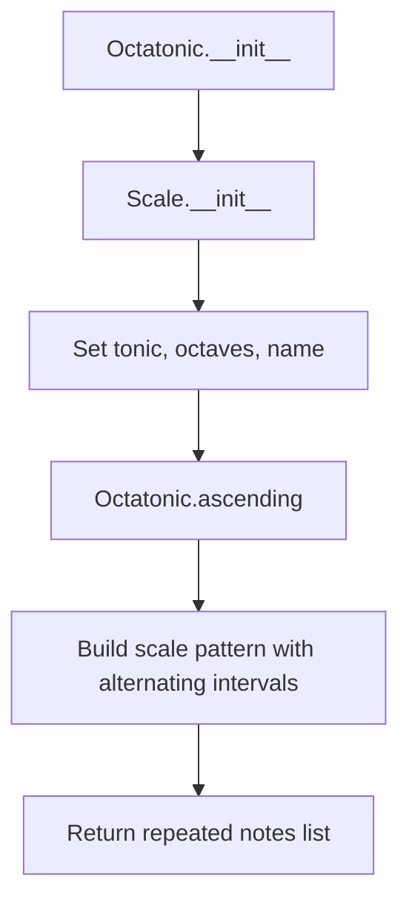

## Raises:
- NoteFormatError: When the provided note string is invalid (lowercase check)
- RangeError: When degree() method is called with invalid degree number

## Example:
```python
# Create an octatonic scale starting on C
scale = Octatonic("C")
# Get ascending notes
notes = scale.ascending()  # Returns list of notes in octatonic pattern
# Example result: ['C', 'D', 'Eb', 'F', 'Gb', 'A', 'Bb', 'C#', 'D#', 'E', 'F#', 'G#', 'A#', 'C']
```

### `mingus.core.scales.Octatonic.__init__` · *method*

## Summary:
Initializes an octatonic scale object with a specified tonic note and number of octaves.

## Description:
Constructs an octatonic scale instance by calling the parent scale constructor and setting the scale's name attribute. This method establishes the fundamental properties of the octatonic scale including its tonic note and octave span.

## Args:
    note (str): The tonic note of the scale (e.g., 'C', 'D#')
    octaves (int): Number of octaves to include in the scale. Defaults to 1.

## Returns:
    None: This method initializes the object state and returns nothing.

## Raises:
    NoteFormatError: If the provided note string is in lowercase format (which is considered invalid)

## State Changes:
    Attributes READ: self.tonic
    Attributes WRITTEN: self.name, self.tonic, self.octaves

## Constraints:
    Preconditions: The note parameter must be a valid note string (uppercase) that can be processed by the scale system
    Postconditions: The object is initialized with the specified tonic note and octave count, and its name attribute is set appropriately

## Side Effects:
    None: This method performs no I/O operations or external service calls. It only initializes internal object state.

### `mingus.core.scales.Octatonic.ascending` · *method*

## Summary:
Generates an ascending octatonic scale pattern consisting of 8 notes, repeated across specified octaves plus one additional copy of the first note.

## Description:
Creates an octatonic scale by applying a specific interval pattern: tonic, major second, minor third, repeated three times, followed by major seventh and major sixth. The resulting 8-note pattern is repeated for the specified number of octaves and concludes with the initial tonic note.

This method is implemented as a separate function because octatonic scales follow a distinctive interval pattern that differs from other scale types, and encapsulating this logic provides clean separation of concerns while maintaining consistency with the abstract Scale interface. It is called by the parent class's __str__ method to display the scale representation.

## Args:
    None - This is a method that operates on instance attributes

## Returns:
    list[str]: A list of note names representing the ascending octatonic scale pattern, with length (8 * self.octaves) + 1, containing 8 distinct notes in the pattern repeated across octaves plus one final copy of the first note

## Raises:
    None explicitly raised - However, underlying interval functions may raise NoteFormatError or other exceptions from the interval module

## State Changes:
    Attributes READ: self.tonic, self.octaves
    Attributes WRITTEN: None

## Constraints:
    Preconditions: 
    - self.tonic must be a valid note string
    - self.octaves must be a non-negative integer
    Postconditions:
    - Returns a list of note strings in ascending order
    - The returned list length equals (8 * self.octaves) + 1
    - The pattern follows the octatonic scale interval structure with 8 notes total

## Side Effects:
    None - Pure function with no external side effects

