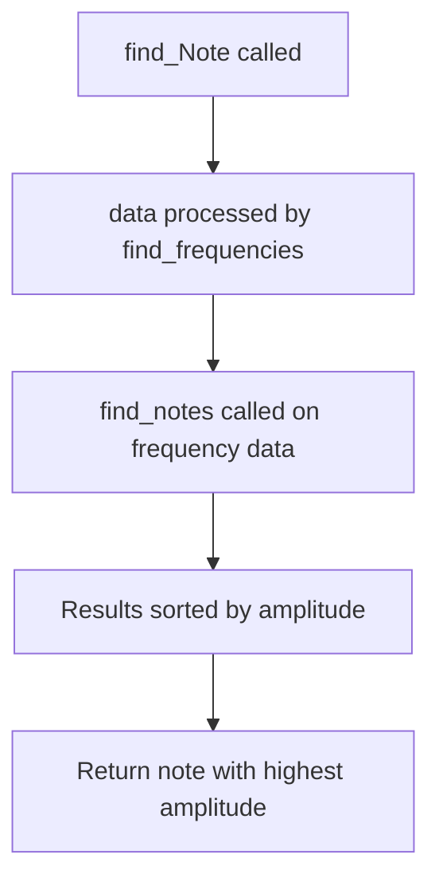

# `fft.py`

## `mingus.extra.fft._find_log_index` · *function*

## Summary:
Maps a frequency value to its corresponding logarithmic index in a pre-computed cache using optimized binary search.

## Description:
This function performs a binary search to find the appropriate index in a logarithmic frequency cache array. It includes an optimization that uses previously computed search results to accelerate subsequent searches when frequencies are accessed in ascending order. This optimization makes the function particularly efficient for processing audio signals where frequency values typically increase monotonically.

## Args:
    f (float): The frequency value to map to a logarithmic index. Must be positive (> 0).

## Returns:
    int: The index in the logarithmic cache array corresponding to the frequency. Returns 128 when frequency is zero or negative, or exceeds the maximum cached value.

## Raises:
    None explicitly raised, but may raise IndexError if global variables are not properly initialized.

## Constraints:
    Preconditions:
        - Global variable `_log_cache` must be initialized as a list/array of at least 128 elements
        - Global variable `_last_asked` must be either None or a tuple of (index, frequency_value)
        - Input frequency `f` must be greater than 0
    Postconditions:
        - Returns an integer index in the range [0, 128]
        - Updates global `_last_asked` to track the most recent search result for optimization

## Side Effects:
    - Modifies the global variable `_last_asked` to cache the most recent search result
    - Accesses the global variable `_log_cache` for lookup operations

## Control Flow:
```mermaid
flowchart TD
    A[Start _find_log_index(f)] --> B{f <= 0 or f > _log_cache[127]}
    B -- Yes --> C[Return 128]
    B -- No --> D{Has _last_asked?}
    D -- No --> E[Set begin=0, end=128]
    D -- Yes --> F{f >= lastval?}
    F -- No --> E
    F -- Yes --> G{f <= _log_cache[lastn]?}
    G -- Yes --> H[Return lastn]
    G -- No --> I{f <= _log_cache[lastn+1]?}
    I -- Yes --> J[Return lastn+1]
    I -- No --> K[Set begin=lastn]
    K --> E
    E --> L[Binary search loop]
    L --> M{begin != end?}
    M -- No --> N[Return begin]
    M -- Yes --> O[Calculate n = (begin + end) // 2]
    O --> P{cp < f <= c?}
    P -- Yes --> Q[Update _last_asked, Return n]
    P -- No --> R{f < c?}
    R -- Yes --> S[Set end = n]
    R -- No --> T[Set begin = n]
    S --> L
    T --> L
```

## Examples:
    # Assuming proper initialization of _log_cache and _last_asked
    # First call - performs full binary search
    index = _find_log_index(440.0)  # Returns index for 440Hz
    
    # Subsequent call with higher frequency - uses optimization
    index = _find_log_index(880.0)  # Uses cached previous result for acceleration
    
    # Edge case - frequency too high
    index = _find_log_index(20000.0)  # Returns 128 for out-of-range frequency
    
    # Edge case - invalid frequency
    index = _find_log_index(0.0)  # Returns 128 for zero frequency
    
    # Edge case - negative frequency
    index = _find_log_index(-100.0)  # Returns 128 for negative frequency

## `mingus.extra.fft.find_frequencies` · *function*

## Summary:
Converts time-domain audio samples into frequency-domain representation with power magnitudes using FFT analysis.

## Description:
Performs Fast Fourier Transform analysis on audio data to extract frequency spectrum information. This function transforms time-domain audio samples into a frequency-domain representation suitable for audio analysis and music processing applications within the mingus library. The function implements standard FFT power spectrum calculation with proper normalization and DC/Nyquist component handling.

## Args:
    data (array-like): Time-domain audio samples to analyze
    freq (int): Sampling frequency in Hz. Defaults to 44100 (standard CD quality)
    bits (int): Audio bit depth. Defaults to 16 bits

## Returns:
    list[tuple[float, float]]: List of (frequency, power) pairs representing the frequency spectrum. Each tuple contains a frequency value in Hz and its corresponding power magnitude. The frequency values span from 0 Hz to the Nyquist frequency (half the sampling rate).

## Raises:
    None explicitly raised in the function body

## Constraints:
    Preconditions:
    - Input data must be a sequence of numeric values representing audio samples
    - Sampling frequency must be positive
    - Bit depth should be a valid audio bit depth value
    
    Postconditions:
    - Returns a list of tuples with increasing frequency values starting at 0 Hz
    - Power values are properly normalized and scaled according to FFT conventions
    - Frequency resolution is determined by sampling frequency and data length

## Side Effects:
    None

## Control Flow:
```mermaid
flowchart TD
    A[Input data] --> B[Calculate length n]
    B --> C[Call _fft(data) - internal FFT implementation]
    C --> D[Calculate uniquePts = ceil((n+1)/2)]
    D --> E[Normalize FFT results: (abs(x)/n)^2 * 2]
    E --> F[Adjust DC component: p[0] = p[0]/2]
    F --> G[Adjust Nyquist component if n is even: p[-1] = p[-1]/2]
    G --> H[Calculate frequency step: s = freq/n]
    H --> I[Generate frequency array: 0 to uniquePts*s with step s]
    I --> J[Zip frequency and power arrays]
    J --> K[Return list of (freq, power) tuples]
```

## Examples:
    # Basic usage with default parameters
    audio_samples = [0.1, 0.2, 0.3, 0.4, 0.5]
    frequencies = find_frequencies(audio_samples)
    
    # Usage with custom sampling frequency
    frequencies = find_frequencies(audio_samples, freq=48000)
```

## `mingus.extra.fft.find_notes` · *function*

## Summary:
Maps frequency-amplitude pairs to musical notes by binning frequencies into MIDI note indices and aggregating amplitudes.

## Description:
Processes a table of frequency-amplitude pairs to convert audio frequencies into musical notes. It bins frequencies into MIDI note indices using logarithmic scaling, aggregates amplitudes for each note, and returns a list mapping each note index to its corresponding musical note object or None for out-of-range frequencies.

This function is extracted from the FFT processing pipeline to handle the conversion from frequency domain data to musical note representations, separating concerns between frequency binning and note mapping logic.

## Args:
    freqTable (list[tuple[float, float]]): List of (frequency, amplitude) tuples representing audio spectrum data. Frequencies should be positive numbers in Hz, amplitudes should be non-negative values.
    maxNote (int): Maximum MIDI note number to consider (default: 100). Frequencies that map to notes above this threshold are aggregated into index 128.

## Returns:
    list[tuple[Note or None, Note]]: List of 129 tuples where each tuple corresponds to a MIDI note index (0-128). For indices 0-127, the first element is a Note instance representing that MIDI note, and the second element is a template Note instance. For index 128, the first element is None (indicating frequencies exceeding maxNote), and the second element is a template Note instance.

## Raises:
    None explicitly raised by this function.

## Constraints:
    Preconditions:
    - freqTable contains tuples of (frequency, amplitude) where frequency > 0 and amplitude >= 0
    - maxNote is a non-negative integer
    
    Postconditions:
    - Returns exactly 129 tuples (one for each MIDI note index 0-128)
    - Index 128 contains aggregated amplitudes for frequencies exceeding maxNote
    - All returned note objects are valid Note instances or None

## Side Effects:
    None.

## Control Flow:
```mermaid
flowchart TD
    A[Start find_notes] --> B[Initialize res = [0] * 129]
    B --> C[Initialize Note() template]
    C --> D[For each (freq, ampl) in freqTable]
    D --> E{freq > 0 AND ampl > 0?}
    E -- Yes --> F[_find_log_index(freq)]
    F --> G{f < maxNote?}
    G -- Yes --> H[res[f] += ampl]
    G -- No --> I[res[128] += ampl]
    E -- No --> J[Skip entry]
    H --> K[Continue]
    I --> K
    J --> K
    K --> L{More entries?}
    L -- Yes --> D
    L -- No --> M[Enumerate res]
    M --> N[Create result tuples]
    N --> O[Return result list]
```

## Examples:
```python
# Basic usage with sample frequency data
freq_data = [(440.0, 0.8), (880.0, 0.5), (220.0, 0.3)]
notes_list = find_notes(freq_data)
# Returns list with Note objects for A4, A5, and A3 respectively, plus aggregated high frequencies

# Usage with custom maxNote limit
freq_data = [(1000.0, 1.0), (2000.0, 0.5)]
notes_list = find_notes(freq_data, maxNote=80)
# Returns list where frequencies above MIDI note 80 are aggregated in index 128
```

## `mingus.extra.fft.data_from_file` · *function*

## Summary:
Extracts mono audio data from the first channel of a WAV audio file along with sampling metadata.

## Description:
Reads a WAV audio file and extracts the first audio channel's amplitude values, alongside the file's sampling frequency and bit depth information. This function is designed to simplify audio data extraction for signal processing tasks by providing a standardized interface for accessing basic audio properties.

## Args:
    file (str): Path to the WAV audio file to be processed.

## Returns:
    tuple: A 3-element tuple containing:
        - channel1 (list[int]): Amplitude values from the first audio channel
        - freq (int): Sampling frequency in Hz  
        - bits (int): Bit depth of the audio samples

## Raises:
    FileNotFoundError: When the specified file path does not exist.
    wave.Error: When the file is not a valid WAV file or cannot be read properly.

## Constraints:
    Preconditions:
        - The input file must be a valid WAV audio file
        - The file must be readable
    Postconditions:
        - The returned channel1 list contains integer amplitude values
        - The frequency and bits values correspond to the WAV file's metadata

## Side Effects:
    - Opens and closes the specified file for reading
    - Performs file I/O operations

## Control Flow:
```mermaid
flowchart TD
    A[Start data_from_file] --> B[Open WAV file in rb mode]
    B --> C[Read all frames from file]
    C --> D[Get audio metadata (channels, freq, bits)]
    D --> E[Unpack binary data to integers]
    E --> F[Extract first channel samples]
    F --> G[Close file handle]
    G --> H[Return (channel1, freq, bits)]
```

## Examples:
```python
# Basic usage
channel_data, sample_rate, bit_depth = data_from_file("audio.wav")

# Typical usage in audio processing pipeline
try:
    channel1, freq, bits = data_from_file("recording.wav")
    print(f"Sample rate: {freq}Hz")
    print(f"Bit depth: {bits} bits")
    print(f"Channel data length: {len(channel1)} samples")
except FileNotFoundError:
    print("Audio file not found")
except wave.Error:
    print("Invalid WAV file")
```

## `mingus.extra.fft.find_Note` · *function*

## Summary:
Determines the most prominent musical note from audio frequency data using FFT analysis.

## Description:
This function analyzes audio data to identify the dominant musical note by performing frequency domain analysis. It processes raw audio samples through a Fast Fourier Transform to convert them into frequency components, then maps these frequencies to musical notes and returns the note with the highest amplitude.

## Args:
    data (array-like): Raw audio sample data to analyze
    freq (int): Sampling frequency in Hz, defaults to 44100
    bits (int): Audio bit depth, defaults to 16

## Returns:
    Note or None: The musical note with the highest amplitude in the frequency spectrum, or None if no note can be determined

## Raises:
    None explicitly raised in the function body

## Constraints:
    Preconditions:
    - data should contain valid audio sample values
    - freq should be a positive integer representing sampling rate
    - bits should be a positive integer representing audio bit depth
    
    Postconditions:
    - Returns a Note object or None
    - The returned note corresponds to the frequency component with maximum amplitude
    - The function selects the note with the highest amplitude among all detected notes

## Side Effects:
    None

## Control Flow:


## Examples:
    # Basic usage with default parameters
    note = find_Note(audio_samples, 44100, 16)
    
    # With custom sampling frequency
    note = find_Note(audio_samples, 22050, 16)

## `mingus.extra.fft.analyze_chunks` · *function*

## Summary:
Processes audio data in chunks to identify the dominant musical note in each segment.

## Description:
Analyzes audio data by dividing it into fixed-size chunks and determining the most prominent musical note present in each chunk. This function is designed for audio signal processing applications where real-time or segmented musical note detection is required.

## Args:
    data (list): Audio samples to process, typically representing amplitude values over time
    freq (int): Sampling frequency of the audio data in Hz, defaults to 44100
    bits (int): Bit depth of the audio samples, typically 8, 16, or 32
    chunksize (int): Size of each data chunk to process, defaults to 512

## Returns:
    list[Note or None]: A list of musical notes (as Note objects) representing the dominant note in each chunk of audio data. When no dominant note is detected, None is returned for that chunk.

## Raises:
    None explicitly raised in the function body

## Constraints:
    Preconditions:
    - Input data must be a non-empty list of numeric values representing audio samples
    - Frequency and bit depth parameters must be positive integers
    - Chunk size must be a positive integer
    
    Postconditions:
    - Returns a list of Note objects or None values for each processed chunk
    - Input data list remains unmodified

## Side Effects:
    None

## Control Flow:
```mermaid
flowchart TD
    A[Start analyze_chunks] --> B{data != []}
    B -- Yes --> C[Get chunk data[:chunksize]]
    C --> D[Call find_frequencies(chunk, freq, bits)]
    D --> E[Call find_notes(frequencies)]
    E --> F[Sort notes by amplitude]
    F --> G[Select strongest note]
    G --> H[Append to result list]
    H --> I[Remove processed chunk from data]
    I --> B
    B -- No --> J[Return result list]
```

## Examples:
    # Basic usage with default chunk size
    audio_samples = [0.1, 0.2, 0.3, 0.4, 0.5, 0.6, 0.7, 0.8]
    notes = analyze_chunks(audio_samples, 44100, 16)
    
    # Custom chunk size
    notes = analyze_chunks(audio_samples, 44100, 16, chunksize=1024)

## `mingus.extra.fft.find_melody` · *function*

## Summary:
Extracts and groups musical notes from audio data by analyzing frequency content in overlapping chunks.

## Description:
Processes audio files to identify musical melodies by performing FFT analysis on audio chunks and grouping consecutive identical notes. This function serves as the main interface for melody detection from WAV audio files.

## Args:
    file (str): Path to the WAV audio file to process. Defaults to "440_480_clean.wav"
    chunksize (int): Size of audio chunks to analyze in samples. Defaults to 512

## Returns:
    list[tuple[Note or None, int]]: List of tuples containing (note, frequency) pairs where note is either a Note object or None for unrecognized frequencies, and frequency is the sample rate from the audio file.

## Raises:
    FileNotFoundError: When the specified audio file cannot be found or opened
    wave.Error: When the audio file is corrupted or not a valid WAV file
    struct.error: When there's an issue unpacking audio frame data

## Constraints:
    Preconditions:
        - Audio file must be a valid WAV file with mono or stereo channels
        - File must be readable and accessible
        - Chunk size must be a positive integer
    Postconditions:
        - Returns a list of note-frequency pairs in chronological order
        - Consecutive identical notes are grouped with frequency counts
        - Note objects represent MIDI note numbers converted from frequencies

## Side Effects:
    - Opens and reads from the specified audio file
    - Closes the audio file after processing
    - May access system resources for file I/O operations

## Control Flow:
```mermaid
flowchart TD
    A[Start find_melody] --> B[data_from_file(file)]
    B --> C[(data, freq, bits)]
    C --> D[analyze_chunks(data, freq, bits, chunksize)]
    D --> E[Process each chunk result]
    E --> F{res empty?}
    F -->|Yes| G[Add (d, 1) to res]
    F -->|No| H[Check if d equals last note]
    H -->|Yes| I[Increment count of last note]
    H -->|No| J[Add (d, 1) to res]
    J --> K[Return [(x, freq) for (x, freq) in res]]
```

## Examples:
    # Basic usage with default parameters
    melody = find_melody("song.wav")
    
    # Custom chunk size
    melody = find_melody("song.wav", chunksize=1024)
    
    # With error handling
    try:
        melody = find_melody("audio.wav")
        print(f"Detected {len(melody)} note events")
        for note, freq in melody:
            print(f"Note: {note}, Frequency: {freq}")
    except FileNotFoundError:
        print("Audio file not found")
    except wave.Error:
        print("Invalid WAV file")
```

