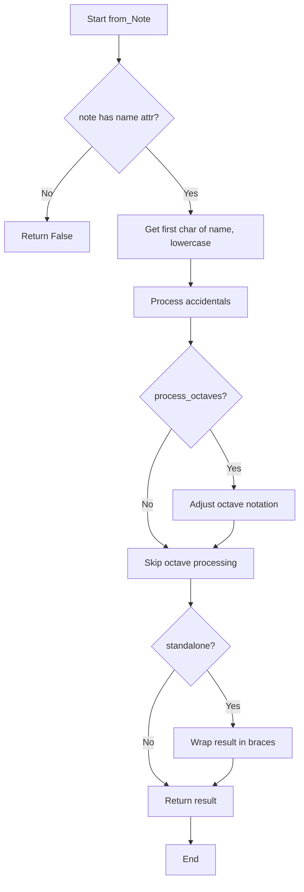
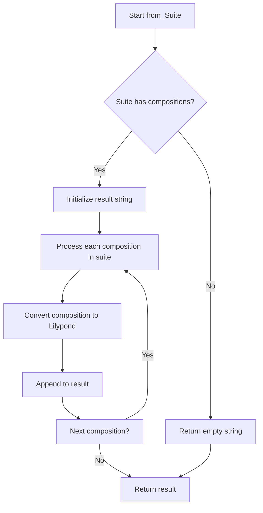
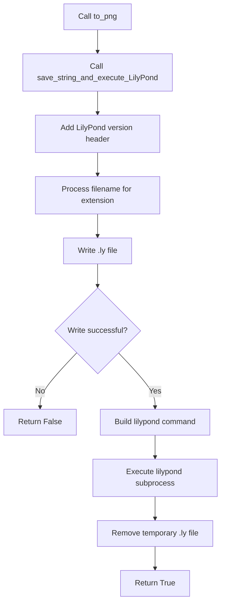
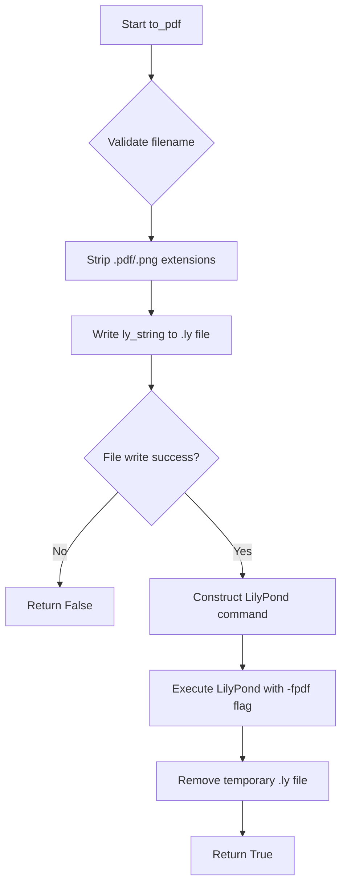

# `lilypond.py`

## `mingus.extra.lilypond.from_Note` · *function*

## Summary:
Converts a mingus Note object into LilyPond musical notation format string.

## Description:
Transforms a Note object into a string representation compatible with LilyPond music notation software. This function handles note names, accidentals, and octave adjustments according to LilyPond conventions where middle C is represented as "c'".

## Args:
    note (Note): A mingus Note object containing name and octave attributes
    process_octaves (bool): Whether to adjust octave notation for LilyPond compatibility. Defaults to True.
    standalone (bool): Whether to wrap the result in curly braces. Defaults to True.

## Returns:
    str or bool: LilyPond formatted note string (e.g., "c'is" for C#4) wrapped in braces when standalone=True, or False if note lacks name attribute.

## Raises:
    None explicitly raised

## Constraints:
    Preconditions:
        - The note parameter must be a valid Note object with a name attribute
        - The note.name attribute must be a string representing a musical note
    
    Postconditions:
        - Returns a string in LilyPond format when note has valid name attribute
        - Returns False when note lacks name attribute

## Side Effects:
    None

## Control Flow:


## Examples:
    >>> note = Note("C#", 4)
    >>> from_Note(note)
    '{ c\'is }'
    
    >>> note = Note("Db", 3)
    >>> from_Note(note, standalone=False)
    'des'
    
    >>> note = Note("A", 2)
    >>> from_Note(note)
    '{ aes }'

## `mingus.extra.lilypond.from_NoteContainer` · *function*

## Summary:
Converts a NoteContainer object into LilyPond music notation format.

## Description:
Transforms a NoteContainer (which can contain single notes or chords) into a string representation compatible with LilyPond music notation software. This function serves as a bridge between mingus's internal note representation and LilyPond's syntax, enabling export of musical structures to LilyPond files.

The function handles three main cases: empty containers (returns rest symbol), single notes (converts to note format), and multiple notes (creates chord notation with angle brackets). It also supports optional duration specification and standalone formatting for integration into larger LilyPond expressions.

## Args:
    nc (NoteContainer or None): Container holding one or more notes. Can be None or empty.
    duration (str or None): Optional duration specification (e.g., "whole", "half", "quarter"). Defaults to None.
    standalone (bool): Whether to wrap the result in curly braces. Defaults to True.

## Returns:
    str or bool: LilyPond formatted string representation of the note container, or False if input is invalid.

## Raises:
    None explicitly raised, though underlying functions may raise exceptions.

## Constraints:
    Preconditions:
    - If nc is provided, it must have a 'notes' attribute
    - NoteContainer should contain valid Note objects if present
    
    Postconditions:
    - Returns properly formatted LilyPond string when valid input provided
    - Returns False for invalid input (non-NoteContainer objects)
    - Duration specifications are properly converted to LilyPond syntax

## Side Effects:
    None

## Control Flow:
```mermaid
flowchart TD
    A[Start from_NoteContainer] --> B{nc is None or empty?}
    B -- Yes --> C[Set result = "r"]
    B -- No --> D{len(nc.notes) == 1?}
    D -- Yes --> E[Call from_Note for single note]
    D -- No --> F[Create chord with <> notation]
    F --> G[Loop through notes]
    G --> H[Append from_Note results]
    H --> I[Close chord with >]
    I --> J{duration specified?}
    J -- Yes --> K[Parse duration with value.determine]
    K --> L{Duration type?}
    L -- longa --> M[Append \\longa]
    L -- breve --> N[Append \\breve]
    L -- other --> O[Append duration number]
    O --> P[Add dots for tuplets]
    P --> Q[Return result]
    J -- No --> Q[Return result]
    Q --> R{standalone?}
    R -- Yes --> S[Wrap in { } brackets]
    R -- No --> T[Return raw result]
```

## Examples:
    # Convert single note container
    nc = NoteContainer([Note("C-4")])
    result = from_NoteContainer(nc)  # Returns "{ c' }"
    
    # Convert chord container
    nc = NoteContainer([Note("C-4"), Note("E-4"), Note("G-4")])
    result = from_NoteContainer(nc)  # Returns "{ < c' e' g' > }"
    
    # With duration specification
    nc = NoteContainer([Note("C-4")])
    result = from_NoteContainer(nc, duration="quarter")  # Returns "{ c'4 }"
    
    # Non-standalone format
    nc = NoteContainer([Note("C-4")])
    result = from_NoteContainer(nc, standalone=False)  # Returns "c'"

## `mingus.extra.lilypond.from_Bar` · *function*

## Summary
Converts a Bar object into LilyPond music notation format with optional key signature and time signature display.

## Description
This function transforms a Bar container object into a string representation compatible with LilyPond music notation software. It processes the musical elements within the bar, including notes, rhythms, and timing information, and formats them according to LilyPond syntax conventions. The function supports optional display of key signatures and time signatures.

The function is designed to be a specialized converter that encapsulates the complexity of translating mingus Bar objects into LilyPond format, separating this concern from the rest of the application logic.

## Args
- bar (object): A Bar container object containing musical data with attributes:
  - `bar`: List of musical entries, each containing duration and note information
  - `key`: Key object with `key` and `mode` attributes
  - `meter`: Time signature tuple (numerator, denominator)
- showkey (bool): Whether to include key signature information in the output. Defaults to True.
- showtime (bool): Whether to include time signature information in the output. Defaults to True.

## Returns
- str: A string representing the bar in LilyPond format enclosed in curly braces, or False if the input bar doesn't have the required attributes.

## Raises
- None explicitly raised, but may propagate exceptions from internal function calls

## Constraints
- Precondition: The input `bar` must have a `bar` attribute (i.e., it must be a valid Bar object)
- Postcondition: If successful, returns a properly formatted LilyPond string with appropriate key and time signatures

## Side Effects
- None

## Control Flow
```mermaid
flowchart TD
    A[Start from_Bar] --> B{Has bar.bar attribute?}
    B -- No --> C[Return False]
    B -- Yes --> D[Initialize result]
    D --> E{showkey is True?}
    E -- Yes --> F[Process key signature]
    E -- No --> G[Skip key processing]
    F --> H[Set result = key]
    G --> H
    H --> I[Initialize latest_ratio=(1,1)]
    I --> J[Initialize ratio_has_changed=False]
    J --> K[Iterate through bar.bar entries]
    K --> L[Parse duration with value.determine]
    L --> M[Extract ratio from parsed value]
    M --> N{ratio == latest_ratio?}
    N -- Yes --> O[Append NoteContainer with standalone=False]
    N -- No --> P{ratio_has_changed?}
    P -- Yes --> Q[Add closing brace }
    P -- No --> R[Skip closing brace]
    Q --> S[Add \\times ratio formatting]
    R --> S
    S --> T[Append NoteContainer with standalone=False]
    T --> U[Update latest_ratio and ratio_has_changed]
    U --> V[End loop]
    V --> W{ratio_has_changed?}
    W -- Yes --> X[Add closing brace }
    W -- No --> Y[Skip closing brace]
    X --> Z[Process time signature]
    Y --> Z
    Z --> AA{showtime is True?}
    AA -- Yes --> AB[Wrap in \\time formatting]
    AA -- No --> AC[Simple wrap]
    AB --> AD[Return formatted string]
    AC --> AD
```

## Examples
```python
# Basic usage with key and time signature
result = from_Bar(my_bar)
# Returns: "{ \\key c \\major \\time 4/4 c'4 d'4 e'4 f'4 }"

# Without key signature
result = from_Bar(my_bar, showkey=False)
# Returns: "{ \\time 4/4 c'4 d'4 e'4 f'4 }"

# Without time signature  
result = from_Bar(my_bar, showtime=False)
# Returns: "{ \\key c \\major c'4 d'4 e'4 f'4 }"
```

## `mingus.extra.lilypond.from_Track` · *function*

## Summary:
Converts a Track object containing musical bars into LilyPond formatted string representation.

## Description:
Transforms a musical track structure into a LilyPond-compatible string format by processing each bar and managing key and time signature changes. This function serves as the main entry point for converting musical tracks to LilyPond notation, handling the sequential processing of bars while tracking key and meter changes to ensure proper formatting.

## Args:
    track (Track): A Track object containing musical bars to convert. Must have a 'bars' attribute containing Bar objects.

## Returns:
    str or bool: A LilyPond-formatted string enclosed in curly braces representing the entire track. Returns False if the input track doesn't have a 'bars' attribute.

## Raises:
    None explicitly raised, but the function may return False when input validation fails.

## Constraints:
    Preconditions:
    - Input track must have a 'bars' attribute
    - Each item in track.bars must be a Bar object with 'key' and 'meter' attributes
    - Bar objects must have a 'bar' attribute
    
    Postconditions:
    - Returns a properly formatted LilyPond string with appropriate key/time signatures
    - Each bar is processed through the from_Bar function with correct showkey/showtime flags

## Side Effects:
    None

## Control Flow:
```mermaid
flowchart TD
    A[Start from_Track] --> B{track.hasattr(bars)?}
    B -- No --> C[Return False]
    B -- Yes --> D[Initialize lastkey=C, lasttime=(4,4)]
    D --> E[Initialize result=""]
    E --> F[For each bar in track.bars]
    F --> G{lastkey != bar.key?}
    G -- Yes --> H[showkey = True]
    G -- No --> H[showkey = False]
    H --> I{lasttime != bar.meter?}
    I -- Yes --> J[showtime = True]
    I -- No --> J[showtime = False]
    J --> K[Call from_Bar(bar, showkey, showtime)]
    K --> L[Append result + " " to result]
    L --> M[Update lastkey = bar.key]
    M --> N[Update lasttime = bar.meter]
    N --> O[Loop to next bar]
    O --> P[Return "{ %s}" % result]
```

## Examples:
    # Basic usage with a populated track
    track = Track()
    # ... add bars to track ...
    lilypond_string = from_Track(track)
    # Returns: "{ \\key c \\major \\time 4/4 { c'4 d'4 e'4 f'4 } \\time 4/4 { g'4 a'4 b'4 c''4 } }"

## `mingus.extra.lilypond.from_Composition` · *function*

## Summary:
Converts a composition object into a LilyPond formatted string representation.

## Description:
Transforms a musical composition into LilyPond markup format, including metadata header and track content. This function serves as the main entry point for converting compositions to LilyPond format within the mingus library.

## Args:
    composition: A composition object that must have the following attributes:
        - tracks: An iterable containing track objects
        - title: String representing the composition title
        - author: String representing the composer/author
        - subtitle: String representing the composition subtitle

## Returns:
    str: A LilyPond formatted string containing the composition header and all tracks.
         Returns False if the composition object lacks a "tracks" attribute.

## Raises:
    None explicitly raised, but may raise exceptions from underlying functions like from_Track.

## Constraints:
    Preconditions:
        - The composition object must have a "tracks" attribute
        - The composition object must have "title", "author", and "subtitle" attributes
        - Each track in composition.tracks must be compatible with from_Track function
    
    Postconditions:
        - Returns a properly formatted LilyPond string with header information
        - All tracks are converted using from_Track function
        - Trailing whitespace is stripped from the final result

## Side Effects:
    None

## Control Flow:
```mermaid
flowchart TD
    A[Start from_Composition] --> B{Has tracks attribute?}
    B -- No --> C[Return False]
    B -- Yes --> D[Create header string]
    D --> E[Iterate through tracks]
    E --> F{Call from_Track on track}
    F --> G[Append result + " " to main result]
    G --> H[Loop until all tracks processed]
    H --> I[Remove trailing space]
    I --> J[Return result]
```

## Examples:
```python
# Basic usage
composition = MyComposition()
composition.title = "My Song"
composition.author = "John Doe"
composition.subtitle = "A beautiful piece"
composition.tracks = [track1, track2]

lilypond_string = from_Composition(composition)
# Returns: "\\header { title = \"My Song\" composer = \"John Doe\" opus = \"A beautiful piece\" } track_content1 track_content2"
```

## `mingus.extra.lilypond.from_Suite` · *function*

## Summary
Converts a Suite object containing multiple musical compositions into Lilypond formatted string representation.

## Description
This function transforms a Suite object (containing multiple compositions) into a Lilypond-compatible string format. It processes each composition in the suite sequentially and combines them into a single Lilypond document. The function leverages existing conversion functions for individual compositions to maintain consistency with the rest of the Lilypond module.

## Args
    suite (Suite): A Suite object containing multiple compositions to be converted to Lilypond format. The Suite object must have a compositions attribute containing Composition objects.

## Returns
    str: A Lilypond formatted string containing all compositions from the suite, properly formatted for Lilypond processing. Returns an empty string if the suite contains no compositions.

## Raises
    None explicitly raised, but may propagate exceptions from underlying conversion functions.

## Constraints
    Precondition: The input suite must be a valid Suite object with a compositions attribute containing Composition objects.
    Postcondition: The returned string is a valid Lilypond format that can be written to a .ly file and processed by Lilypond software.

## Side Effects
    None

## Control Flow


## Examples
```python
# Create a suite with compositions
suite = Suite()
suite.set_title("My Collection", "A sample collection")
suite.set_author("Composer Name")

# Add compositions to suite
suite.add_composition(composition1)
suite.add_composition(composition2)

# Convert suite to Lilypond format
lilypond_output = from_Suite(suite)
# Result is a Lilypond string containing both compositions
```

## `mingus.extra.lilypond.to_png` · *function*

## Summary:
Converts LilyPond music notation string into a PNG image file.

## Description:
This function takes a LilyPond music notation string and converts it into a PNG image file using the LilyPond music engraving program. It serves as a convenience wrapper around the more general `save_string_and_execute_LilyPond` function, specifically configured for PNG output.

## Args:
    ly_string (str): A string containing valid LilyPond music notation markup
    filename (str): Output filename for the PNG image (extension optional)

## Returns:
    bool: True if successful, False if file writing fails

## Raises:
    None explicitly raised, but may raise exceptions from underlying file operations or subprocess execution

## Constraints:
    Preconditions:
    - LilyPond must be installed and available in the system PATH
    - Valid LilyPond syntax must be provided in ly_string
    - Write permissions must exist for the directory where filename is specified
    
    Postconditions:
    - A .png file will be created with the specified filename (or filename.png if no extension provided)
    - The temporary .ly file will be removed after processing

## Side Effects:
    - Creates a temporary .ly file in the working directory
    - Writes a PNG file to disk at the specified location
    - Executes an external subprocess command (lilypond)
    - Removes the temporary .ly file after processing

## Control Flow:


## Examples:
    # Convert a simple melody to PNG
    ly_string = "\\relative c' { c d e f }"
    success = to_png(ly_string, "my_melody.png")
    if success:
        print("PNG created successfully")
    else:
        print("Failed to create PNG")

## `mingus.extra.lilypond.to_pdf` · *function*

## Summary:
Converts a LilyPond music notation string into a PDF file using the LilyPond typesetting engine.

## Description:
This function serves as a convenience wrapper that generates a PDF file from LilyPond music notation. It internally creates a temporary .ly file, executes the LilyPond command with PDF output enabled, and cleans up the temporary file. The function is part of the mingus music theory library's LilyPond integration for creating musical notation documents.

## Args:
    ly_string (str): A string containing valid LilyPond music notation markup
    filename (str): Output filename for the PDF. If ending with .pdf or .png, the extension will be stripped

## Returns:
    bool: True if successful, False if file writing fails or LilyPond execution encounters issues

## Raises:
    None explicitly raised, though underlying file operations and subprocess calls may raise exceptions

## Constraints:
    Preconditions:
    - LilyPond must be installed and available in the system PATH
    - Valid LilyPond syntax must be provided in ly_string
    - Write permissions must exist for the directory where filename is specified
    
    Postconditions:
    - A PDF file will be created with the specified filename (minus .pdf/.png extension)
    - Temporary .ly file will be deleted after processing

## Side Effects:
    - Creates a temporary .ly file in the working directory
    - Executes external LilyPond process via subprocess
    - Removes the temporary .ly file after processing
    - May produce console output showing the executed command

## Control Flow:


## Examples:
    # Basic usage
    ly_content = "\\relative c' { c d e f }"
    success = to_pdf(ly_content, "my_music.pdf")
    
    # With PNG output
    success = to_pdf(ly_content, "my_music.png")
    
    # Error handling
    if not to_pdf(invalid_ly_content, "output.pdf"):
        print("Failed to generate PDF")

## `mingus.extra.lilypond.save_string_and_execute_LilyPond` · *function*

## Summary:
Writes a LilyPond string to a temporary file, executes the LilyPond command to process it, and cleans up the temporary file.

## Description:
This function serves as a convenience wrapper for generating LilyPond files and executing the LilyPond command-line tool. It handles the complete workflow of creating a temporary .ly file from a LilyPond string, running LilyPond with the specified command options, and cleaning up the temporary file afterward. The function is designed to abstract away the file I/O and subprocess execution details for LilyPond processing.

## Args:
    ly_string (str): The LilyPond music notation string to be processed
    filename (str): The base filename for the output (without extension) or with .pdf/.png extension
    command (str): Additional command-line arguments to pass to the LilyPond executable

## Returns:
    bool: True if the LilyPond processing completed successfully, False if file writing failed

## Raises:
    None explicitly raised, though file operations may raise IOError exceptions that are caught and result in False return

## Constraints:
    Preconditions:
    - The LilyPond executable must be available in the system PATH
    - Valid LilyPond syntax must be provided in ly_string
    - Appropriate permissions must exist for file creation and deletion
    
    Postconditions:
    - A temporary .ly file is created and immediately deleted
    - The LilyPond command is executed with the provided parameters
    - No permanent files are left behind (except for the final output if successful)

## Side Effects:
    - Creates a temporary .ly file in the current working directory
    - Executes an external subprocess (LilyPond command)
    - Removes the temporary .ly file after processing
    - Prints the executed command to standard output

## Control Flow:
```mermaid
flowchart TD
    A[Start] --> B{Filename ends with .pdf or .png?}
    B -- Yes --> C[Remove extension from filename]
    B -- No --> C
    C --> D[Prepend \\version "2.10.33" to ly_string]
    D --> E[Open filename.ly for writing]
    E --> F{File write succeeds?}
    F -- No --> G[Return False]
    F -- Yes --> H[Write ly_string to file]
    H --> I[Close file]
    I --> J[Construct LilyPond command]
    J --> K[Print command]
    K --> L[Execute LilyPond subprocess]
    L --> M[Remove temporary .ly file]
    M --> N[Return True]
```

## Examples:
    # Basic usage
    success = save_string_and_execute_LilyPond("\\relative c' { c d e f }", "test", "-f png")
    
    # With PDF output
    success = save_string_and_execute_LilyPond("\\relative c' { c d e f }", "output.pdf", "--pdf")
    
    # Error handling
    if not save_string_and_execute_LilyPond(invalid_ly_string, "test", ""):
        print("Failed to write LilyPond file")
```

