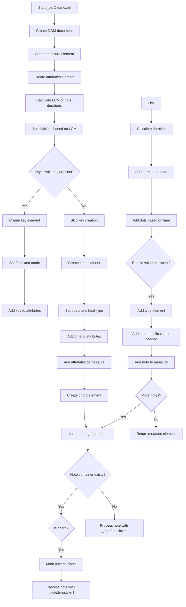
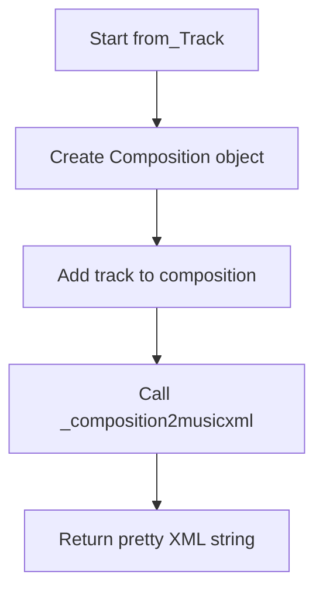
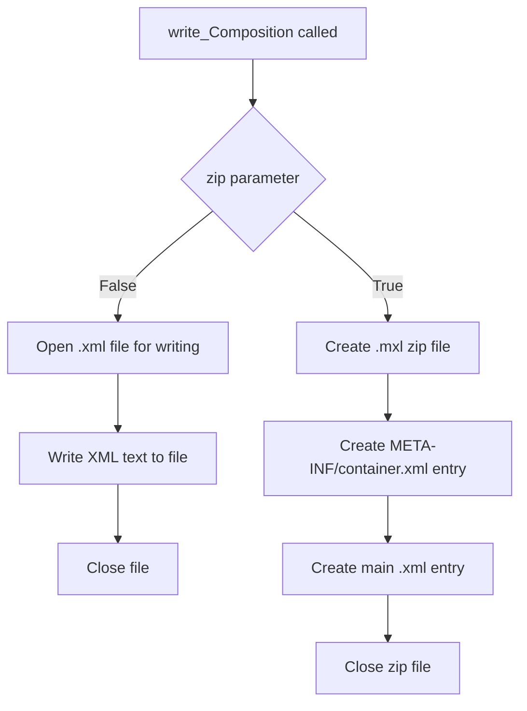

# `musicxml.py`

## `mingus.extra.musicxml._gcd` · *function*

## Summary:
Computes the greatest common divisor (GCD) of two numbers or a list of numbers using the Euclidean algorithm.

## Description:
This helper function implements the Euclidean algorithm to calculate the greatest common divisor of integers. It can handle either two individual numbers or a list of numbers by recursively applying the GCD operation. The function is designed to work with positive integers and serves as a utility for musicXML processing in the mingus library.

## Args:
    a (int, optional): First number for GCD calculation. Defaults to None.
    b (int, optional): Second number for GCD calculation. Defaults to None.
    terms (list[int], optional): List of numbers to compute GCD for. Defaults to None.

## Returns:
    int: The greatest common divisor of the input numbers. For two numbers, returns GCD(a,b). For a list, returns GCD of all elements. Returns None if no arguments are provided.

## Raises:
    TypeError: If arguments are not integers or if terms contains non-integers.
    ZeroDivisionError: If any argument is zero (though this would be handled by the algorithm).

## Constraints:
    Preconditions:
    - When using a and b parameters, both should be integers
    - When using terms parameter, it should be a list of integers
    - All numbers should be non-negative for meaningful results
    
    Postconditions:
    - Returns a positive integer representing the GCD when valid inputs are provided
    - For empty terms list, the reduce function behavior determines the result
    - Function handles negative numbers by taking absolute values implicitly due to modulo operation

## Side Effects:
    None.

## Control Flow:
```mermaid
flowchart TD
    A[Start _gcd] --> B{terms provided?}
    B -- Yes --> C[reduce(lambda x,y: _gcd(x,y), terms)]
    B -- No --> D[while b ≠ 0]
    D --> E[a = b]
    E --> F[b = a mod b]
    F --> G[b ≠ 0?]
    G -- Yes --> D
    G -- No --> H[return a]
```

## Examples:
    # Calculate GCD of two numbers
    result = _gcd(12, 8)  # Returns 4
    
    # Calculate GCD of multiple numbers
    result = _gcd(terms=[12, 8, 16])  # Returns 4
    
    # Edge case with single number
    result = _gcd(15)  # Returns 15 (since b defaults to None)
    
    # Edge case with zero
    result = _gcd(0, 12)  # Returns 12 (due to Euclidean algorithm)
```

## `mingus.extra.musicxml._lcm` · *function*

## Summary:
Computes the least common multiple of two integers or a list of integers.

## Description:
This function calculates the least common multiple (LCM) of two integers or multiple integers using the mathematical relationship LCM(a,b) = (a * b) / GCD(a,b). It serves as a utility for determining common time periods or rhythmic patterns in musical compositions. When multiple integers are provided via the terms parameter, it computes the LCM across all values using reduction.

## Args:
    a (int, optional): First integer operand. Defaults to None.
    b (int, optional): Second integer operand. Defaults to None.
    terms (list[int], optional): List of integers to compute LCM for. Defaults to None.

## Returns:
    int: The least common multiple of the provided integers.

## Raises:
    ZeroDivisionError: When either a or b is zero, causing division by zero in the calculation.

## Constraints:
    Preconditions:
    - All arguments must be integers
    - When using a and b parameters, both should be positive integers for meaningful results
    - When using terms parameter, it should be a list of integers
    - Neither a nor b should be zero to avoid division by zero errors
    
    Postconditions:
    - Returns an integer representing the LCM
    - For two numbers, result is >= max(a,b)
    - For multiple numbers, result is >= max(terms)

## Side Effects:
    None

## Control Flow:
```mermaid
flowchart TD
    A[_lcm function entry] --> B{terms provided?}
    B -- Yes --> C[reduce with _lcm lambda]
    B -- No --> D{Is a or b zero?}
    D -- Yes --> E[ZeroDivisionError]
    D -- No --> F[Calculate (a*b)/_gcd(a,b)]
    C --> G[Return reduced LCM]
    F --> G
```

## Examples:
    # Calculate LCM of two numbers
    lcm_result = _lcm(12, 18)  # Returns 36
    
    # Calculate LCM of multiple numbers
    lcm_result = _lcm(terms=[4, 6, 8])  # Returns 24
    
    # Error case - division by zero
    # _lcm(0, 5)  # Raises ZeroDivisionError

## `mingus.extra.musicxml._note2musicxml` · *function*

## Summary:
Converts a note object into a MusicXML note element structure.

## Description:
Transforms a note container into a properly formatted MusicXML note node that can be embedded in a MusicXML document. This function handles both regular notes and rest notes, extracting pitch information including step, octave, and accidental modifiers from the note's name attribute.

## Args:
    note: A note object or None. When None, creates a rest element; otherwise, extracts pitch information from the note's name and octave attributes.

## Returns:
    xml.dom.minidom.Element: A MusicXML note element containing either a rest element or pitch information (step, octave, and alter if applicable).

## Raises:
    None explicitly raised.

## Constraints:
    Preconditions:
    - If note is not None, the note object must have a 'name' attribute that follows standard musical note naming conventions (e.g., "C", "C#", "Cb", "Bb")
    - If note is not None, the note object must have an 'octave' attribute
    
    Postconditions:
    - Always returns a valid XML Element representing a MusicXML note structure
    - The returned element is properly structured according to MusicXML specifications

## Side Effects:
    None.

## Control Flow:
```mermaid
flowchart TD
    A[Start _note2musicxml] --> B{note == None?}
    B -- Yes --> C[Create rest element]
    B -- No --> D[Create pitch element]
    D --> E[Extract step from note.name[:1]]
    E --> F[Create octave element]
    F --> G[Set octave text content]
    G --> H[Parse accidentals in note.name[1:]]
    H --> I{accidental count != 0?}
    I -- Yes --> J[Create alter element]
    J --> K[Set alter text content]
    K --> L[Append alter to pitch]
    I -- No --> M[Skip alter creation]
    L --> N[Append pitch to note_node]
    M --> N
    N --> O[Return note_node]
    C --> O
```

## Examples:
    # Creating a rest note
    rest_note = _note2musicxml(None)
    
    # Creating a regular note
    note_obj = Note("C", 4)  # Assuming Note class exists
    musicxml_note = _note2musicxml(note_obj)

## `mingus.extra.musicxml._bar2musicxml` · *function*

## Summary:
Converts a musical bar (measure) into a MusicXML measure element containing musical attributes and notes.

## Description:
This function transforms a bar object containing musical information into a structured XML representation compliant with the MusicXML standard. It handles musical attributes such as key signatures, time signatures, and divisions, as well as individual notes with their durations, dots, and rhythmic modifications. The function is part of the MusicXML export functionality in the mingus library.

## Args:
    bar: A bar object containing musical information including key signature, time signature, and notes. The bar must have the following attributes:
        - bar.key: Object with key, signature, and mode attributes
        - bar.meter: Tuple representing time signature (beats, beat_type)
        - bar is iterable, yielding items where each item is a tuple/list with:
          - Index 1: Duration value
          - Index 2: Note container or None

## Returns:
    xml.dom.minidom.Element: A DOM element representing the MusicXML measure node containing all musical attributes and notes.

## Raises:
    None explicitly raised in the function body.

## Constraints:
    Preconditions:
        - The bar object must have key, meter, and be iterable
        - Each item in the bar must be a tuple/list with at least 3 elements
        - The bar.key.key must be a valid key (either major or minor)
        - Note containers in bar must be compatible with _note2musicxml function

    Postconditions:
        - Returns a properly structured XML measure element
        - All musical attributes are correctly calculated and represented
        - Notes are properly formatted with duration, type, and rhythmic modifications

## Side Effects:
    None.

## Control Flow:


## Examples:
    This function is typically called internally by the MusicXML export process when converting a composition to MusicXML format. It processes one bar at a time and returns a properly structured XML measure element that can be incorporated into a complete MusicXML document.

## `mingus.extra.musicxml._track2musicxml` · *function*

## Summary:
Converts a Track object into a MusicXML part element with proper clef information and numbered bars.

## Description:
This function transforms a Track container into a MusicXML part structure by processing each bar in the track. It attempts to infer the musical clef from the track's instrument specification and applies this clef to the appropriate attributes within each bar. The resulting XML structure follows MusicXML standards for musical notation representation.

The function is designed to be a helper component that encapsulates the logic for converting a single track into its XML representation, separating this concern from higher-level composition conversion logic.

## Args:
    track (Track): A Track object containing musical bars and optional instrument information

## Returns:
    Element: An XML Element representing the MusicXML part structure for the track

## Raises:
    None explicitly raised

## Constraints:
    Precondition: The track parameter must be a valid Track object with a bars attribute containing Bar objects
    Postcondition: The returned Element will be a properly structured MusicXML part element with all bars converted and clef information applied where applicable

## Side Effects:
    None

## Control Flow:
```mermaid
flowchart TD
    A[Start _track2musicxml] --> B{track.instrument}
    B -- True --> C[Determine clef from instrument.clef]
    B -- False --> D[clef = None]
    C --> D
    D --> E[Initialize counter = 1]
    E --> F[For each bar in track.bars]
    F --> G[Call _bar2musicxml(bar)]
    G --> H[Set bar number attribute]
    H --> I{clef defined?}
    I -- Yes --> J[Find attributes elements]
    J --> K[Create clef element]
    K --> L[Add clef to attributes]
    L --> M[Append bar to track_node]
    I -- No --> M
    M --> N[Increment counter]
    N --> O{More bars?}
    O -- Yes --> F
    O -- No --> P[Return track_node]
```

## Examples:
```python
# Create a track with an instrument
instrument = MidiInstrument()
instrument.clef = "treble"
track = Track(instrument)
# Add some bars to the track...
# Convert to MusicXML
xml_part = _track2musicxml(track)
```

## `mingus.extra.musicxml._composition2musicxml` · *function*

## Summary:
Converts a Composition object into a MusicXML score-partwise DOM element structure.

## Description:
This function transforms a mingus Composition object into a structured XML representation compliant with the MusicXML 2.0 standard. It creates the foundational structure of a MusicXML document including metadata, part lists, and individual track representations. The function delegates the conversion of individual tracks to the `_track2musicxml` helper function.

This logic is extracted into its own function to separate the concerns of creating the overall MusicXML document structure from the detailed conversion of individual musical elements. This modular approach allows for easier testing, maintenance, and reuse of the MusicXML generation functionality.

## Args:
    comp (Composition): A mingus Composition object containing tracks, title, author, and other metadata to be converted to MusicXML format.

## Returns:
    Element: An XML DOM Element representing the root "score-partwise" node of a MusicXML document structure.

## Raises:
    None explicitly raised by this function, though underlying operations may raise exceptions from XML processing or composition validation.

## Constraints:
    Preconditions:
    - The input `comp` must be a valid Composition object
    - Each track in the composition should be a valid Track object
    - Tracks may optionally have instruments assigned
    
    Postconditions:
    - Returns a properly structured XML DOM Element with version attribute set to "2.0"
    - The returned element contains all necessary metadata elements (title, author, encoding)
    - All tracks in the composition are represented in the part-list and as individual parts

## Side Effects:
    None - This function performs no I/O operations or external state mutations. It only constructs XML DOM elements.

## Control Flow:
```mermaid
flowchart TD
    A[Start _composition2musicxml] --> B{comp.title}
    B -- Yes --> C[Create movement-title element]
    C --> D[Add title text to element]
    D --> E[Append title to score]
    B -- No --> F[Skip title creation]
    
    F --> G[Create identification element]
    G --> H{comp.author}
    H -- Yes --> I[Create creator element]
    I --> J[Set type="composer"]
    J --> K[Add author text]
    K --> L[Append creator to identification]
    H -- No --> M[Skip author creation]
    
    M --> N[Create encoding element]
    N --> O[Create software element]
    O --> P[Set software text to "mingus"]
    P --> Q[Append software to encoding]
    Q --> R[Create encoding-date element]
    R --> S[Set date text to today]
    S --> T[Append encoding-date to encoding]
    T --> U[Append encoding to identification]
    U --> V[Append identification to score]
    
    V --> W[Create part-list element]
    W --> X[Append part-list to score]
    
    X --> Y[Iterate through comp tracks]
    Y --> Z[Call _track2musicxml for each track]
    Z --> AA[Create score-part element]
    AA --> AB[Set id attributes for track and score-part]
    AB --> AC[Create part-name element]
    AC --> AD[Add track name text]
    AD --> AE[Append part-name to score-part]
    
    AE --> AF{Track has instrument?}
    AF -- Yes --> AG[Create score-instrument element]
    AG --> AH[Set id attribute for instrument]
    AH --> AI[Create instrument-name element]
    AI --> AJ[Add instrument name text]
    AJ --> AK[Append instrument-name to score-instrument]
    AK --> AL[Append score-instrument to score-part]
    
    AL --> AM{Instrument is MidiInstrument?}
    AM -- Yes --> AN[Create midi-instrument element]
    AN --> AO[Set id attribute for midi instrument]
    AO --> AP[Create midi-channel element]
    AP --> AQ[Set channel text to "1"]
    AQ --> AR[Create midi-program element]
    AR --> AS[Set program text to instrument_nr]
    AS --> AT[Append midi-channel and midi-program to midi-instrument]
    AT --> AU[Append midi-instrument to score-part]
    
    AU --> AV[Append score-part to part-list]
    AV --> AW[Set track id attribute]
    AW --> AX[Append track to score]
    AX --> Y
    
    Y --> AY[Return score element]
```

## Examples:
```python
# Basic usage
from mingus.containers.composition import Composition
from mingus.extra.musicxml import _composition2musicxml

# Create a simple composition
comp = Composition()
comp.set_title("My Composition")
comp.set_author("Composer Name")

# Add a track
track = Track()
track.name = "Piano"
comp.add_track(track)

# Convert to MusicXML
xml_element = _composition2musicxml(comp)
# xml_element can then be serialized to string using xml.dom.minidom methods
```

## `mingus.extra.musicxml.from_Note` · *function*

## Summary
Converts a single musical note into MusicXML format by wrapping it in a composition and processing it through the MusicXML conversion pipeline.

## Description
This function serves as a convenience wrapper that transforms a single Note object into complete MusicXML markup. It creates a minimal Composition containing only the provided note, then leverages the existing composition-to-MusicXML conversion infrastructure to generate properly formatted XML output. This extraction allows for consistent MusicXML generation regardless of whether the input comes from individual notes or full compositions.

The function is typically called when converting standalone musical notes to MusicXML format for export or further processing in music applications that require XML-based notation.

## Args
    note (Note): A mingus.containers.note.Note object representing a single musical note to be converted to MusicXML format.

## Returns
    str: A formatted MusicXML string containing the note wrapped in proper XML structure with metadata such as title, author, and encoding information.

## Raises
    None explicitly raised by this function, though underlying operations may raise exceptions from:
    - Composition.add_note() when dealing with invalid track selections
    - _composition2musicxml() when processing the composition structure
    - _track2musicxml() when processing track information
    - XML generation errors from minidom operations

## Constraints
    Preconditions:
    - The note parameter must be a valid mingus.containers.note.Note instance
    - The note should have valid note name and octave values
    - The mingus library components must be properly initialized

    Postconditions:
    - Returns a well-formed MusicXML string with proper XML declaration and formatting
    - The returned XML contains all necessary structural elements for MusicXML 2.0 compliance

## Side Effects
    None - This function is pure and does not modify any external state or perform I/O operations beyond XML generation.

## Control Flow
```mermaid
flowchart TD
    A[Start from_Note(note)] --> B[Create empty Composition]
    B --> C[Add note to composition]
    C --> D[Call _composition2musicxml(composition)]
    D --> E[Return pretty-printed XML]
```

## Examples
```python
from mingus.containers import Note
from mingus.extra.musicxml import from_Note

# Create a simple note
note = Note("C", 4)
xml_output = from_Note(note)
print(xml_output)
# Returns formatted MusicXML string for the C4 note
```

## `mingus.extra.musicxml.from_Bar` · *function*

## Summary
Converts a single musical bar into MusicXML format string representation.

## Description
Transforms a mingus Bar object into a complete MusicXML document string. This function provides a simplified interface for converting individual musical bars into the standard MusicXML format, handling the creation of proper composition and track structures internally.

The function is designed to be a convenience wrapper that encapsulates the complexity of building a complete musical composition structure and converting it to MusicXML format. It's particularly useful for applications that need to convert isolated musical bars into standardized XML representations.

## Args
    bar (Bar): A mingus Bar object containing musical notes and metadata. The bar should have proper key, meter, and note information set.

## Returns
    str: A formatted MusicXML string representing the musical bar. The returned string is properly indented using the `toprettyxml()` method for human-readable output.

## Raises
    None explicitly raised by this function. However, underlying functions may raise exceptions if the bar contains invalid data or if there are issues during XML generation.

## Constraints
    Preconditions:
    - The `bar` parameter must be a valid mingus Bar object
    - The bar should contain properly initialized key and meter information
    - The bar should contain valid musical notes or rests
    
    Postconditions:
    - Returns a valid MusicXML-formatted string
    - The resulting XML will contain proper musical metadata including key signatures, time signatures, and note durations

## Side Effects
    None. This function performs no I/O operations or external state mutations. It only processes the input bar and generates an XML string in memory.

## Control Flow
```mermaid
flowchart TD
    A[from_Bar called with bar] --> B[Create empty Composition]
    B --> C[Create empty Track]
    C --> D[Add bar to track using add_bar]
    D --> E[Add track to composition using add_track]
    E --> F[Call _composition2musicxml with composition]
    F --> G[Return result of .toprettyxml()]
```

## Examples
```python
# Basic usage with a simple bar
from mingus.containers import Bar
from mingus.extra.musicxml import from_Bar

# Create a simple bar with some notes
bar = Bar()
bar.place_notes("C", 4)  # Add a quarter note C
bar.place_notes("E", 4)  # Add a quarter note E
bar.place_notes("G", 4)  # Add a quarter note G

# Convert to MusicXML
xml_string = from_Bar(bar)
print(xml_string)
```

## `mingus.extra.musicxml.from_Track` · *function*

## Summary:
Converts a Track object into a formatted MusicXML string representation.

## Description:
Transforms a musical track into MusicXML format by wrapping it in a Composition object and converting it using the internal composition-to-MusicXML conversion function. This function serves as a convenient interface for exporting individual tracks to MusicXML format.

## Args:
    track (Track): A mingus.containers.track.Track object containing musical data to convert to MusicXML format.

## Returns:
    str: A formatted MusicXML string representing the track in standard MusicXML format with proper indentation.

## Raises:
    UnexpectedObjectError: If the provided object is not a valid Track instance (does not have a 'bars' attribute).

## Constraints:
    Preconditions:
        - The input parameter must be a valid Track object with a 'bars' attribute
        - The Track object should contain valid musical data
    
    Postconditions:
        - Returns a properly formatted XML string with correct MusicXML structure
        - The returned XML includes track metadata such as title, author, and instrument information

## Side Effects:
    None

## Control Flow:


## Examples:
```python
# Basic usage
from mingus.containers import Track
from mingus.extra.musicxml import from_Track

track = Track()
# ... add bars and notes to track ...
xml_string = from_Track(track)
print(xml_string)
```

## `mingus.extra.musicxml.from_Composition` · *function*

## Summary
Converts a mingus Composition object into a formatted MusicXML string representation.

## Description
This function serves as the primary interface for converting a musical composition represented in mingus format into MusicXML format. It takes a Composition object containing tracks, instruments, and musical content, and transforms it into a standardized XML-based music notation format that can be processed by various music applications and notation software.

The function delegates the actual conversion process to the internal `_composition2musicxml` helper function, which handles the detailed XML construction, then formats the resulting XML document with proper indentation using `toprettyxml()`.

## Args
    comp (Composition): A mingus Composition object containing musical tracks, instruments, and metadata such as title and author.

## Returns
    str: A formatted MusicXML string representing the composition with proper XML indentation and structure.

## Raises
    None explicitly raised by this function, though underlying XML operations or the internal conversion functions may raise exceptions if the Composition object is malformed.

## Constraints
    Preconditions:
        - The input `comp` must be a valid mingus Composition object
        - The Composition should contain valid tracks with proper musical content
        - Each track should either have an instrument or be instrument-less
        - The Composition should have valid metadata fields (title, author, etc.)

    Postconditions:
        - Returns a well-formed XML string with proper indentation
        - The XML string follows MusicXML 2.0 specification
        - All musical elements from the Composition are preserved in the XML structure

## Side Effects
    None - This function is pure and does not modify the input Composition object or cause any external state changes.

## Control Flow
```mermaid
flowchart TD
    A[Start from_Composition] --> B[Call _composition2musicxml(comp)]
    B --> C[Create XML Document]
    C --> D[Process composition metadata]
    D --> E[Process each track in composition]
    E --> F{Track has instrument?}
    F -->|Yes| G[Process instrument details]
    F -->|No| H[Skip instrument processing]
    G --> I[Create score-part element]
    H --> I
    I --> J[Add part-name and instrument info]
    J --> K[Process track to musicxml]
    K --> L[Append track to score]
    L --> M[Return formatted XML string]
```

## Examples
```python
from mingus.containers import Composition, Track
from mingus.containers.instrument import MidiInstrument
from mingus.extra.musicxml import from_Composition

# Create a simple composition
comp = Composition()
comp.set_title("My Song")
comp.set_author("Composer Name")

# Add a track with an instrument
track = Track(MidiInstrument("Acoustic Grand Piano"))
track.add_notes("C-4", 1)
comp.add_track(track)

# Convert to MusicXML
xml_string = from_Composition(comp)
print(xml_string)
```

## `mingus.extra.musicxml.write_Composition` · *function*

## Summary:
Writes a musical composition to either an XML file or a compressed MXL file format.

## Description:
Converts a Composition object to MusicXML format and saves it to disk. This function serves as the primary interface for persisting musical compositions in MusicXML format, supporting both standard XML files and compressed MXL files that follow the MusicXML container specification.

## Args:
    composition (Composition): The musical composition object to serialize to XML format
    filename (str): Base name for the output file (without extension)
    zip (bool): When True, creates a compressed MXL file; when False, creates a plain XML file. Defaults to False

## Returns:
    None: This function does not return any value

## Raises:
    IOError: When unable to write to the specified file path due to permissions or directory issues

## Constraints:
    Preconditions:
        - The composition parameter must be a valid Composition object
        - The filename parameter must be a string representing a valid file path
        - The composition must contain valid musical data that can be converted to MusicXML
    
    Postconditions:
        - A file is created at the specified location with appropriate extension (.xml or .mxl)
        - The file contains properly formatted MusicXML representation of the composition

## Side Effects:
    - Creates or overwrites files on the filesystem
    - Writes to disk with potential I/O errors if directory permissions are insufficient
    - May create compressed ZIP archives when zip=True

## Control Flow:


## Examples:
    # Write to plain XML file
    write_Composition(my_composition, "my_piece")
    
    # Write to compressed MXL file
    write_Composition(my_composition, "my_piece", zip=True)

