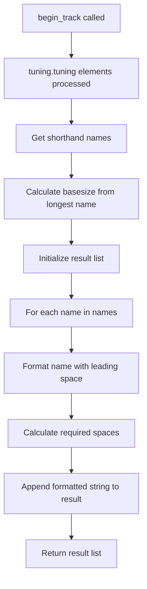
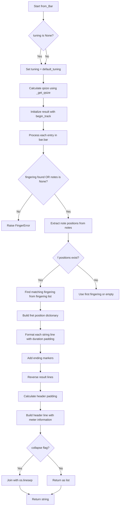
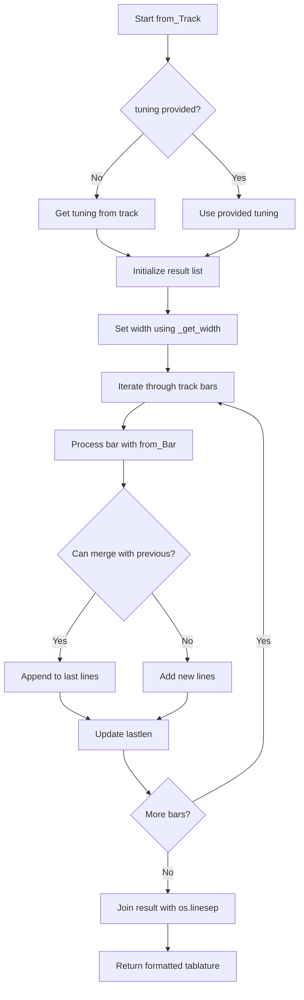
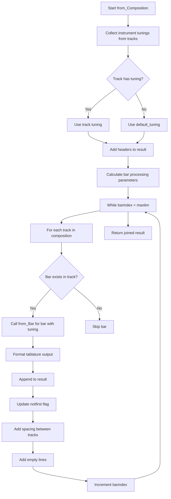

# `tablature.py`

## `mingus.extra.tablature.begin_track` · *function*

## Summary:
Formats tuning information into tablature header strings with proper alignment and spacing.

## Description:
Creates a list of formatted strings representing the header row of a musical tablature, where each string corresponds to a string in the instrument's tuning. The function aligns the tuning names and adds tablature-style separators and padding.

This function is extracted to separate the formatting logic from the tablature generation process, allowing for cleaner code organization and easier testing of the formatting behavior independently.

## Args:
    tuning: A tuning object containing musical note information. Must have a `tuning` attribute that is iterable, where each element has a `to_shorthand()` method.
    padding (int, optional): Number of dash characters to append after the tablature separator. Defaults to 2.

## Returns:
    list[str]: A list of formatted strings, one for each tuning note, with proper spacing and tablature formatting.

## Raises:
    None explicitly raised in the function body.

## Constraints:
    Preconditions:
    - The `tuning` parameter must have a `tuning` attribute that is iterable
    - Each element in `tuning.tuning` must have a `to_shorthand()` method that returns a string
    - The `padding` parameter must be a non-negative integer
    
    Postconditions:
    - Returns a list of strings with consistent formatting
    - Each returned string has the same length pattern based on the longest tuning name

## Side Effects:
    None

## Control Flow:


## Examples:
    # Basic usage with default padding
    tuning = SomeTuningClass()
    header_rows = begin_track(tuning)
    # Returns list of formatted strings for tablature header
    
    # Usage with custom padding
    header_rows = begin_track(tuning, padding=4)
    # Returns list of formatted strings with 4 dashes after separator
```

## `mingus.extra.tablature.add_headers` · *function*

## Summary:
Creates formatted header content for tablature files with metadata and tuning information.

## Description:
Generates a list of formatted string lines that constitute the header section of a tablature file. This function organizes metadata such as title, subtitle, author information, description, and instrument tunings into properly formatted lines that can be written to a file. The function handles text wrapping for long descriptions and formats tuning information in a structured way.

This logic is extracted into its own function to separate the concerns of header formatting from the main tablature generation process, making the code more modular and testable.

## Args:
    width (int): Total width of the formatted lines in characters. Defaults to 80.
    title (str): Main title of the tablature. Defaults to "Untitled".
    subtitle (str): Secondary title or subtitle. Defaults to "".
    author (str): Author name. Defaults to "".
    email (str): Author email address. Defaults to "".
    description (str): Detailed description of the tablature. Defaults to "".
    tunings (list): List of tuning objects containing instrument and description information. Defaults to None (which becomes empty list).

## Returns:
    list[str]: List of formatted header lines ready to be written to a file. Each line is centered according to the specified width.

## Raises:
    None explicitly raised by this function.

## Constraints:
    Preconditions:
    - width must be a positive integer
    - All string parameters should be valid strings
    - tunings parameter, if provided, should contain objects with 'instrument' and 'description' attributes
    
    Postconditions:
    - Returns a list of strings with proper formatting
    - The returned list always starts with an empty string
    - The last two elements of the returned list are empty strings

## Side Effects:
    None.

## Control Flow:
```mermaid
flowchart TD
    A[Start add_headers] --> B{tunings is None?}
    B -- Yes --> C[tunings = []]
    B -- No --> D[Continue]
    C --> E[title = str.upper(title)]
    D --> E
    E --> F[result = ['']]
    F --> G[result += center(title)]
    G --> H{subtitle != ''}
    H -- Yes --> I[result += ['', center(subtitle)]]
    H -- No --> J[Continue]
    I --> J
    J --> K{author != '' OR email != ''}
    K -- Yes --> L[result += ['', '']]
    K -- No --> M[Continue]
    L --> N{email != ''}
    N -- Yes --> O[result += center('Written by: %s <%s>' % (author, email))]
    N -- No --> P[result += center('Written by: %s' % author)]
    O --> Q
    P --> Q
    Q --> R{description != ''}
    R -- Yes --> S[result += ['', '']]
    S --> T[Process description words into lines]
    T --> U[Format wrapped lines]
    U --> V[Add formatted lines to result]
    R -- No --> W[Continue]
    V --> W
    W --> X{tunings != []}
    X -- Yes --> Y[result += ['', '', center('Instruments')]]
    X -- No --> Z[Continue]
    Y --> AA[Process each tuning]
    AA --> AB[Add formatted tuning lines]
    Z --> AC[result += ['', '']]
    AC --> AD[Return result]
```

## Examples:
    # Basic usage with minimal parameters
    headers = add_headers(title="My Song")
    
    # Usage with full metadata
    headers = add_headers(
        width=100,
        title="Amazing Guitar Piece",
        subtitle="A beautiful composition",
        author="John Doe",
        email="john@example.com",
        description="This piece explores advanced chord progressions and finger techniques.",
        tunings=[some_tuning_object]
    )

## `mingus.extra.tablature.from_Note` · *function*

## Summary:
Converts a musical note into a tablature representation showing which string and fret position would play that note.

## Description:
This function generates a visual tablature representation for a given musical note, indicating which string and fret combination would produce that note on a guitar or similar instrument. It handles both direct string/fret specifications and searches for the optimal fret position when given a standard note.

## Args:
    note: A musical note object that either has string and fret attributes, or is a standard note that needs to be mapped to a fret position.
    width (int): The desired width of the resulting tablature output. Defaults to 80 characters.
    tuning: A tuning object specifying the instrument's string tuning. Defaults to the module's default tuning.

## Returns:
    str: A formatted tablature string showing the note's position on the instrument's strings, with proper spacing and formatting.

## Raises:
    RangeError: When no valid fret position can be found for the given note within the instrument's range.

## Constraints:
    Preconditions:
    - The note parameter must be a valid musical note object
    - If note has string and fret attributes, they must be valid indices
    - The tuning parameter must be a valid tuning object with appropriate methods
    
    Postconditions:
    - Returns a properly formatted tablature string with correct positioning
    - The returned string contains the note's position marked appropriately

## Side Effects:
    None

## Control Flow:
```mermaid
flowchart TD
    A[Start from_Note] --> B{tuning is None?}
    B -- Yes --> C[Set tuning = default_tuning]
    B -- No --> C
    C --> D[Call begin_track(tuning)]
    D --> E{note has string and fret?}
    E -- Yes --> F[Get note from tuning.get_Note(string, fret)]
    F --> G{note matches?}
    G -- Yes --> H[Set s,f = string,fret; min = 0]
    G -- No --> I[Continue to fret search]
    E -- No --> I
    I --> J[Find all fret positions for note]
    J --> K{Found valid fret?}
    K -- Yes --> L[Find minimum fret position]
    L --> M[Set s,f = string,fret]
    K -- No --> N[Raise RangeError]
    N --> O[End]
    M --> P[Calculate width parameters]
    P --> Q{min != 1000?}
    Q -- Yes --> R[Format tablature with fret position]
    R --> S[Reverse result]
    S --> T[Join with os.linesep]
    Q -- No --> N
    T --> U[Return formatted tablature]
```

## Examples:
    # Basic usage with a note that has string/fret attributes
    tab = from_Note(some_note_with_string_and_fret)
    
    # Usage with custom width
    tab = from_Note(note, width=100)
    
    # Usage with custom tuning
    tab = from_Note(note, tuning=custom_tuning)

## `mingus.extra.tablature.from_NoteContainer` · *function*

## Summary:
Converts a collection of musical notes into a formatted tablature representation.

## Description:
Transforms a collection of note objects (with string and fret attributes) into a visual tablature format that displays string positions and fret numbers. This function is designed to create readable guitar or similar instrument tablature from musical note data.

## Args:
    notes (list): A collection of note objects, each expected to have 'string' and 'fret' attributes.
    width (int): The desired width of the tablature output in characters. Defaults to 80.
    tuning (object): A tuning object that provides fingering information. If None, uses default_tuning.

## Returns:
    str: A formatted multi-line string representing the tablature with each line showing the position of notes on different strings.

## Raises:
    FingerError: When no playable fingering can be found for the provided notes.

## Constraints:
    Preconditions:
        - Notes must have 'string' and 'fret' attributes if they are to be considered in the output
        - The tuning object must support the find_fingering and get_Note methods
    Postconditions:
        - Returns a properly formatted tablature string with correct spacing
        - All notes in the input are represented in the output when playable fingerings exist

## Side Effects:
    None

## Control Flow:
```mermaid
flowchart TD
    A[Start from_NoteContainer] --> B{tuning is None?}
    B -- Yes --> C[Set tuning = default_tuning]
    B -- No --> C
    C --> D[Call begin_track(tuning)]
    D --> E[Calculate width parameters]
    E --> F[Call tuning.find_fingering(notes)]
    F --> G{fingerings found?}
    G -- No --> H[Raise FingerError]
    G -- Yes --> I[Process existing note objects]
    I --> J[Find matching fingerings]
    J --> K{Matching fingering found?}
    K -- Yes --> L[Select first matching fingering]
    K -- No --> L[Select first fingering]
    L --> M[Build result dictionary]
    M --> N[Format tablature lines]
    N --> O[Reverse result order]
    O --> P[Join with os.linesep]
    P --> Q[Return formatted tablature]
```

## Examples:
    # Basic usage with default tuning
    notes = [Note(string=1, fret=5), Note(string=2, fret=3)]
    tab = from_NoteContainer(notes)
    
    # Usage with custom width
    tab = from_NoteContainer(notes, width=100)
    
    # Usage with custom tuning
    custom_tuning = Tuning(...)
    tab = from_NoteContainer(notes, tuning=custom_tuning)

## `mingus.extra.tablature.from_Bar` · *function*

## Summary:
Converts a musical bar into a text-based tablature representation showing finger positions on strings.

## Description:
Transforms a musical bar containing note information into a visual tablature format that displays which strings and frets should be played. This function renders musical notation in a guitar/tab-style format where each line represents a string and positions are marked with fret numbers.

## Args:
    bar (object): A musical bar object containing musical entries with beat, duration, and note information. Must have a .bar attribute containing tuples of (beat, duration, notes)
    width (int): Maximum width of the resulting tablature output in characters. Defaults to 40
    tuning (object): Musical tuning configuration to use. Defaults to default_tuning if None
    collapse (bool): Whether to join lines with OS-specific line separators. Defaults to True

## Returns:
    str or list: Tablature representation as a string (when collapse=True) or list of lines (when collapse=False). Each line represents a string in the tuning, with fret positions indicated by numbers.

## Raises:
    FingerError: When no playable fingering can be found for the notes in a bar entry

## Constraints:
    Preconditions:
        - The bar parameter must have a bar attribute containing musical entries
        - Each entry in bar.bar must be a tuple of (beat, duration, notes)
        - Notes must either be None or have string and fret attributes
        - Notes must be compatible with the tuning's fingering system
    Postconditions:
        - Returns properly formatted tablature with correct spacing and alignment
        - All strings in the tuning are represented in the output
        - Output maintains proper timing and duration representation

## Side Effects:
    - None

## Control Flow:


## Examples:
    # Basic usage with default parameters
    tablature_string = from_Bar(music_bar)
    
    # Custom width and tuning
    custom_tab = from_Bar(music_bar, width=60, tuning=custom_tuning)
    
    # Return as list instead of string
    tab_list = from_Bar(music_bar, collapse=False)

## `mingus.extra.tablature.from_Track` · *function*

## Summary:
Converts a musical Track object into a formatted tablature representation with line wrapping support.

## Description:
Transforms a sequence of musical bars from a Track object into a text-based tablature format. The function processes each bar using the `from_Bar` function and manages line wrapping to ensure the output doesn't exceed the specified maximum width. When consecutive bars would cause line overflow, it intelligently merges them by appending subsequent bar content to existing lines.

This function is extracted from inline logic to separate concerns between tablature formatting and bar processing, allowing for reusable tablature generation with configurable width limits.

## Args:
    track (Track): A mingus Track object containing musical bars to convert to tablature
    maxwidth (int, optional): Maximum width of output lines in characters. Defaults to 80
    tuning (Tuning, optional): Musical tuning to use for tablature generation. If None, uses track's tuning. Defaults to None

## Returns:
    str: Multi-line tablature string with proper line breaks and formatting

## Raises:
    FingerError: If `from_Bar` function cannot find a playable fingering for notes in any bar
    RangeError: If `from_Bar` function encounters range issues in note processing

## Constraints:
    Preconditions:
    - Track object must be iterable (have bars)
    - Track must contain valid musical bars that can be processed by `from_Bar`
    - maxwidth must be a positive integer
    
    Postconditions:
    - Returns a properly formatted multi-line string
    - Output respects the specified maxwidth constraint
    - Tablature formatting follows standard musical notation conventions

## Side Effects:
    None

## Control Flow:


## Examples:
```python
# Basic usage with default settings
track = Track()
# ... add bars to track ...
tablature = from_Track(track)

# Custom maximum width
tablature = from_Track(track, maxwidth=120)

# With custom tuning
custom_tuning = Tuning("E", "A", "D", "G", "B", "E")
tablature = from_Track(track, tuning=custom_tuning)
```

## `mingus.extra.tablature.from_Composition` · *function*

## Summary:
Converts a musical composition into formatted guitar tablature with headers and multiple track support.

## Description:
Transforms a musical composition object into a text-based guitar tablature representation. This function processes each track in the composition, applies appropriate tunings (falling back to a default tuning if none is specified), and formats the output with headers containing composition metadata and instrument information. The tablature is generated by processing bars in chunks to maintain readability within the specified width constraint.

## Args:
    composition: A musical composition object with the following attributes:
        - title (str): Composition title
        - subtitle (str): Composition subtitle  
        - author (str): Composition author
        - email (str): Author's email
        - description (str): Composition description
        - tracks (list): List of track objects
    width (int): Maximum width of the output tablature in characters. Defaults to 80.

## Returns:
    str: A formatted tablature string containing headers, instrument information, and tablature bars separated by OS-specific line separators.

## Raises:
    FingerError: Raised by the nested from_Bar function when no playable fingering is found for a bar.

## Constraints:
    Precondition: The composition object must have attributes: title, subtitle, author, email, description, and tracks
    Precondition: Each track in composition must support get_tuning() method and be iterable
    Precondition: The composition tracks must contain bars that can be processed by from_Bar
    Postcondition: Returns a properly formatted tablature string with headers, instrument info, and tablature data

## Side Effects:
    None directly observable from this function's interface

## Control Flow:


## Examples:
    # Basic usage with a composition object
    tablature_string = from_Composition(my_composition)
    
    # Usage with custom width
    tablature_string = from_Composition(my_composition, width=120)

## `mingus.extra.tablature.from_Suite` · *function*

## Summary:
Converts a Suite object containing multiple compositions into a formatted tablature string representation.

## Description:
Transforms a musical suite (collection of compositions) into a human-readable tablature format with proper headers, separators, and individual composition representations. This function serves as the main entry point for generating complete tablature documents from suite collections.

## Args:
    suite: A Suite object containing multiple compositions with metadata attributes
    maxwidth (int): Maximum width of the output lines in characters. Defaults to 80.

## Returns:
    str: A formatted tablature string containing the suite title, metadata, and all compositions separated by horizontal rules.

## Raises:
    None explicitly raised in the function body.

## Constraints:
    Preconditions:
    - The suite object must have attributes: title, subtitle, author, email, description, and compositions
    - The suite object must be iterable to allow `for comp in suite` iteration
    - Each composition in the suite must be compatible with the `from_Composition` function
    
    Postconditions:
    - Returns a properly formatted multi-line string with headers, composition content, and visual separators
    - All compositions are rendered using the same maximum width specification

## Side Effects:
    None

## Control Flow:
```mermaid
flowchart TD
    A[Start from_Suite] --> B{suite.subtitle == ""}
    B -- True --> C[subtitle = str(len(suite.compositions)) + " Compositions"]
    B -- False --> D[subtitle = suite.subtitle]
    C --> E[Generate headers with add_headers()]
    D --> E
    E --> F[Create horizontal rule hr = maxwidth * "="]
    F --> G[Build initial result with headers and rules]
    G --> H[Iterate through suite compositions]
    H --> I{More compositions?}
    I -- Yes --> J[Call from_Composition(comp, maxwidth)]
    J --> K[Append composition result + separators]
    K --> L[I]
    I -- No --> M[Return final result]
```

## Examples:
    # Basic usage with a suite containing compositions
    suite = Suite(title="My Collection", author="Composer Name")
    # Add compositions to suite...
    tablature_string = from_Suite(suite)
    
    # Usage with custom width
    tablature_string = from_Suite(suite, maxwidth=120)

## `mingus.extra.tablature._get_qsize` · *function*

## Summary:
Calculates the maximum number of quarter note symbols that can fit in a tablature bar based on string naming length and available width.

## Description:
This function computes how many quarter note symbols can be displayed in a tablature representation by analyzing the character lengths of string names in a tuning and the available horizontal space. It's used internally by the tablature module to dynamically size tablature displays according to available space and string naming conventions.

## Args:
    tuning (object): A tuning object containing string information with a `tuning` attribute that holds string objects with a `to_shorthand()` method
    width (int): The total available width (in characters) for displaying the tablature bar

## Returns:
    int: The maximum number of quarter note symbols that can fit in the tablature bar, or 0 if insufficient space

## Raises:
    None explicitly raised in the function body

## Constraints:
    Preconditions:
    - The `tuning` parameter must have a `tuning` attribute that is iterable
    - Each item in `tuning.tuning` must have a `to_shorthand()` method that returns a string
    - The `width` parameter must be a numeric value
    
    Postconditions:
    - Returns a non-negative integer (0 or positive)
    - The returned value represents a rounded-down count of quarter notes that fit

## Side Effects:
    None

## Control Flow:
```mermaid
flowchart TD
    A[Start _get_qsize] --> B[Get shorthand names from tuning strings]
    B --> C[Calculate basesize = len(max(names)) + 3]
    C --> D[Calculate barsize = width - basesize - 2 - 1]
    D --> E[Calculate qsize = max(0, int(barsize / 4.5))]
    E --> F[Return qsize]
```

## Examples:
    # Example usage:
    # qsize = _get_qsize(some_tuning_object, 80)
    # Returns number of quarter notes that can fit in an 80-character wide tablature bar
    # If barsize = 10, then qsize = max(0, int(10/4.5)) = max(0, 2) = 2

## `mingus.extra.tablature._get_width` · *function*

## Summary:
Calculates an appropriate width value based on a maximum width constraint with conditional scaling.

## Description:
This private utility function determines an optimal width for tablature display by applying different scaling factors based on the input maximum width. It's designed to provide proportional width calculations that adapt to different display constraints while maintaining readability.

## Args:
    maxwidth (float or int): The maximum allowable width value that determines the scaling factor to apply.

## Returns:
    float or int: The calculated width value, which varies based on the input maxwidth according to these rules:
        - If maxwidth <= 60: returns maxwidth unchanged
        - If 60 < maxwidth <= 120: returns maxwidth / 2  
        - If maxwidth > 120: returns maxwidth / 3

## Raises:
    None explicitly raised by this function.

## Constraints:
    Preconditions:
        - maxwidth should be a numeric value (int or float)
        - The function assumes maxwidth is non-negative
    
    Postconditions:
        - The returned width will always be less than or equal to maxwidth
        - The returned width will be scaled appropriately based on the maxwidth range

## Side Effects:
    None.

## Control Flow:
```mermaid
flowchart TD
    A[Start _get_width(maxwidth)] --> B{maxwidth <= 60?}
    B -- Yes --> C[width = maxwidth]
    B -- No --> D{60 < maxwidth <= 120?}
    D -- Yes --> E[width = maxwidth / 2]
    D -- No --> F[width = maxwidth / 3]
    C --> G[Return width]
    E --> G
    F --> G
```

## Examples:
    >>> _get_width(30)
    30
    >>> _get_width(90)
    45.0
    >>> _get_width(150)
    50.0

