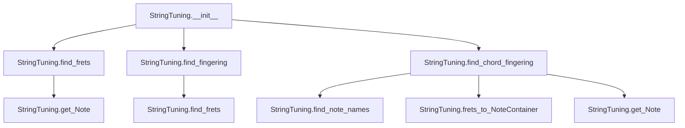
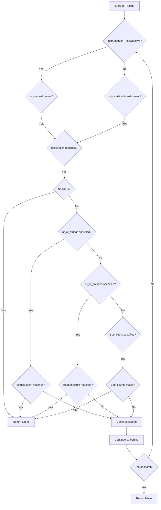

# `tunings.py`

## `mingus.extra.tunings.StringTuning` · *class*

## Summary:
Represents a musical instrument tuning configuration for string instruments, providing methods to calculate fret positions and fingering patterns.

## Description:
The StringTuning class models the tuning of a string instrument, supporting both standard single-string configurations and complex multi-course arrangements (where multiple strings share the same course). It provides functionality to determine which frets correspond to specific notes, find optimal fingerings for chords, and convert between different musical representations. This abstraction enables musicians and music applications to work with various instrument tunings programmatically.

## State:
- instrument (str): Name or identifier of the instrument this tuning represents
- tuning (list): List of Note objects or lists of Note objects representing the base pitch of each string/course
- description (str): Human-readable description of this tuning configuration

## Lifecycle:
- Creation: Instantiate with instrument name, description, and tuning specification where tuning is a list of note specifications (strings or Note objects)
- Usage: Call methods like find_frets(), find_fingering(), find_chord_fingering() to analyze musical positions
- Destruction: No special cleanup required; uses standard Python garbage collection

## Method Map:


## Raises:
- RangeError: When attempting to access invalid string or fret positions in get_Note method

## Example:
```python
# Create a tuning for a guitar
tuning = StringTuning("Guitar", "Standard Tuning", ["E", "A", "D", "G", "B", "E"])

# Find fret positions for a specific note across all strings
frets = tuning.find_frets("C")

# Find optimal fingering for a chord
chord_fingering = tuning.find_chord_fingering(["C", "E", "G"])

# Get a specific note from a string and fret position
note = tuning.get_Note(0, 3)  # First string, 3rd fret
```

### `mingus.extra.tunings.StringTuning.__init__` · *method*

## Summary:
Initializes a StringTuning object with instrument, description, and note tuning specifications.

## Description:
Configures a StringTuning instance by storing the instrument name, description, and processing the tuning specification into Note objects. This method handles both single notes and chord configurations within the tuning specification by converting note representations to Note objects.

## Args:
    instrument (str): Name or identifier of the musical instrument this tuning applies to.
    description (str): Human-readable description of this tuning configuration.
    tuning (list): List containing note specifications, where each element can be either a string representing a single note or a list of strings representing a chord.

## Returns:
    None: This method initializes the object's attributes and does not return a value.

## Raises:
    None explicitly documented: The method may raise exceptions from the Note constructor when invalid note representations are encountered, though specific exception types are not shown in this code snippet.

## State Changes:
    Attributes READ: None
    Attributes WRITTEN: self.instrument, self.tuning, self.description

## Constraints:
    Preconditions: 
    - The tuning parameter must be iterable
    - Note specifications must be valid for the Note class constructor
    
    Postconditions:
    - self.instrument is set to the provided instrument parameter
    - self.description is set to the provided description parameter  
    - self.tuning is initialized as an empty list and populated with Note objects or lists of Note objects

## Side Effects:
    None

### `mingus.extra.tunings.StringTuning.count_strings` · *method*

## Summary:
Returns the number of strings in the tuning configuration.

## Description:
This method provides access to the count of strings defined in the tuning configuration. It is primarily used internally by other methods in the StringTuning class to validate string indices and determine the size of the tuning array.

## Args:
    None

## Returns:
    int: The number of strings in the tuning configuration, which corresponds to the length of the internal `self.tuning` list.

## Raises:
    None

## State Changes:
    Attributes READ: self.tuning
    Attributes WRITTEN: None

## Constraints:
    Preconditions: The object must be properly initialized with a valid tuning configuration.
    Postconditions: The returned value is always a non-negative integer representing the count of strings.

## Side Effects:
    None

### `mingus.extra.tunings.StringTuning.count_courses` · *method*

## Summary:
Calculates the average number of courses (notes) per string in the tuning.

## Description:
This method computes the arithmetic mean of courses (individual notes or note lists) across all strings in the tuning. It's useful for analyzing the complexity or configuration of a musical instrument's tuning setup. The method is called during tuning analysis operations to understand the distribution of notes per string.

## Args:
    None

## Returns:
    float: The average number of courses per string in the tuning.

## Raises:
    None explicitly raised

## State Changes:
    Attributes READ: self.tuning
    Attributes WRITTEN: None

## Constraints:
    Preconditions: 
    - self.tuning must be initialized as a list
    - Each element in self.tuning must be either a Note object or a list of Note objects
    
    Postconditions:
    - Returns a float value representing the average courses per string
    - The returned value is always >= 1.0 when tuning has at least one string

## Side Effects:
    None

### `mingus.extra.tunings.StringTuning.find_frets` · *method*

## Summary:
Calculates fret positions for a given note specification across all strings in the tuning, returning None for strings where the note is out of range.

## Description:
This method determines the fret positions on each string of the tuning where a specified note would occur. It processes each string in the tuning and computes the relative position (fret) needed to play the target note. The method handles both string representations and Note objects as input.

## Args:
    note (str or Note): The target note to find fret positions for. Can be specified as a string representation or Note object.
    maxfret (int): Maximum allowable fret position. Defaults to 24. Notes requiring higher frets will return None for that string.

## Returns:
    list[int or None]: A list where each element corresponds to a string in the tuning. Each element contains either:
        - An integer representing the fret position where the note occurs on that string
        - None if the note is out of range (less than 0 or greater than maxfret) for that string

## Raises:
    None explicitly raised. However, underlying operations may raise exceptions from Note construction or range validation.

## State Changes:
    Attributes READ: self.tuning
    Attributes WRITTEN: None

## Constraints:
    Preconditions:
        - The tuning must be properly initialized with valid note representations
        - The note parameter must be convertible to a valid note representation
    Postconditions:
        - Returns a list with length equal to the number of strings in the tuning
        - All returned integers are within the range [0, maxfret] or None

## Side Effects:
    None

### `mingus.extra.tunings.StringTuning.find_fingering` · *method*

## Summary:
Finds optimal fingerings for a sequence of musical notes on guitar strings, considering string restrictions and maximum fret distance constraints.

## Description:
This method recursively explores all possible combinations of string-fret pairs for a given sequence of musical notes. It evaluates fingerings based on the total fret distance across all strings, returning the most efficient arrangements that meet the maximum distance constraint. The method is designed to help with guitar fingering suggestions by finding combinations that minimize hand movement.

## Args:
    notes (list): A list of musical notes to find fingerings for. Each note should be compatible with the tuning system.
    max_distance (int): Maximum allowed fret distance between the highest and lowest frets in a fingering. Defaults to 4.
    not_strings (list): List of string indices that should be excluded from consideration. Defaults to empty list.

## Returns:
    list: A list of fingerings, where each fingering is a list of (string, fret) tuples. Fingerings are sorted by total fret distance in ascending order.

## Raises:
    None explicitly raised in the code shown.

## State Changes:
    Attributes READ: None - this method only reads from parameters and instance variables accessed via self.find_frets()
    Attributes WRITTEN: None - this method doesn't modify any instance attributes

## Constraints:
    Preconditions: 
    - Notes should be compatible with the tuning system
    - Max_distance should be a non-negative integer
    - Not_strings should contain valid string indices
    
    Postconditions:
    - Returns a list of valid string-fret combinations
    - All returned fingerings satisfy the max_distance constraint
    - Fingerings are sorted by total fret distance

## Side Effects:
    None - this method is pure and doesn't cause any I/O or external service calls.

### `mingus.extra.tunings.StringTuning.find_chord_fingering` · *method*

## Summary:
Finds viable fingerings for a chord on a stringed instrument by exploring possible note positions across strings while respecting physical constraints.

## Description:
This method determines optimal fingerings for playing a given chord on a stringed instrument (like a guitar) by systematically exploring combinations of note positions across available strings. It uses a recursive backtracking algorithm with a lookup table to efficiently search through possible fingering combinations while enforcing constraints such as maximum fret distance between notes and maximum number of fingers required.

The method is designed to work with the StringTuning class and assumes the tuning has been properly initialized with string configurations. It returns either a list of possible fingering combinations or a NoteContainer with the best fingering, depending on the return_best_as_NoteContainer parameter.

## Args:
    notes (list): Either a list of note names (strings) or a NoteContainer object representing the chord to be played
    max_distance (int): Maximum fret distance allowed between notes, defaults to 4
    maxfret (int): Maximum fret number to consider, defaults to 18
    max_fingers (int): Maximum number of fingers allowed for the fingering, defaults to 4
    return_best_as_NoteContainer (bool): If True, returns the best fingering as a NoteContainer with note names; if False, returns a list of fingering combinations

## Returns:
    list or NoteContainer: When return_best_as_NoteContainer is False, returns a list of possible fingerings, each represented as a list of tuples (fret_position, note_name) for each string. When True, returns a NoteContainer with the best fingering where each note has been assigned a name based on the fingering. Returns an empty list if no valid fingering can be found.

## Raises:
    None explicitly raised in the method body

## State Changes:
    Attributes READ: self.tuning, self.find_note_names, self.frets_to_NoteContainer
    Attributes WRITTEN: None (method is read-only)

## Constraints:
    Preconditions: 
    - The notes parameter must be a valid chord representation (list of note names or NoteContainer)
    - The number of notes in the chord must not exceed the number of strings in the tuning
    - The tuning must be properly initialized with string configurations
    
    Postconditions:
    - Returns an empty list if no valid fingering can be found or if the chord has no notes
    - Returns a list of valid fingering combinations that satisfy all constraints
    - When returning NoteContainer, each note in the container has been assigned appropriate note names based on the fingering

## Side Effects:
    None directly observable in the method body, though it calls external methods (find_note_names, frets_to_NoteContainer) that may have side effects

### `mingus.extra.tunings.StringTuning.frets_to_NoteContainer` · *method*

## Summary:
Converts a list of fret positions for each string into a NoteContainer of actual musical notes.

## Description:
This method transforms a fingering representation (list of fret numbers per string) into a NoteContainer containing the corresponding musical notes. It processes each string's fret position, skipping any None values, and uses the StringTuning's get_Note method to convert string/fret combinations into Note objects.

## Args:
    fingering (list[int|None]): A list where each element represents the fret position for a string. None indicates the string is not played.

## Returns:
    NoteContainer: A container holding Note objects representing the musical notes at the specified fret positions.

## Raises:
    RangeError: When a string or fret position is out of valid range, as determined by the get_Note method.

## State Changes:
    Attributes READ: None
    Attributes WRITTEN: None

## Constraints:
    Preconditions: 
    - fingering must be a list of integers or None values
    - Each integer in fingering must represent a valid fret position (0 or greater)
    - The length of fingering must match the number of strings in the tuning
    
    Postconditions:
    - Returns a NoteContainer with notes corresponding to the specified fret positions
    - Notes in the container have their string and fret attributes set appropriately

## Side Effects:
    None

### `mingus.extra.tunings.StringTuning.find_note_names` · *method*

## Summary:
Finds all fret positions on a specified string where notes from a given list appear within a maximum fret range.

## Description:
This method determines which frets on a specific musical string contain notes from a provided list of notes. It's primarily used in chord fingering analysis to identify playable positions for chords on guitar-like instruments. The method handles both string representations of notes and Note objects, converting them appropriately for processing.

## Args:
    notelist (list): A list of notes represented either as strings (e.g., 'C', 'D#') or Note objects.
    string (int): The string index (zero-based) to search on. Defaults to 0.
    maxfret (int): Maximum fret number to search up to. Defaults to 24.

## Returns:
    list[tuple[int, str]]: A list of tuples where each tuple contains (fret_number, note_name) representing the fret position and note name that match the input notes on the specified string.

## Raises:
    None explicitly raised, but may propagate exceptions from underlying operations like NoteContainer construction or note_to_int conversion.

## State Changes:
    Attributes READ: self.tuning
    Attributes WRITTEN: None

## Constraints:
    Preconditions:
        - The string index must be valid for the tuning (0 <= string < number_of_strings)
        - The notelist should contain valid note representations
        - maxfret should be a non-negative integer
    
    Postconditions:
        - Returns a list of tuples with valid fret numbers and note names
        - Fret numbers are within the range [0, maxfret]
        - Note names correspond to the original notelist entries

## Side Effects:
    None

### `mingus.extra.tunings.StringTuning.get_Note` · *method*

## Summary:
Returns a Note object representing the musical note at a specified string and fret position on a tuned instrument.

## Description:
This method calculates and returns the musical note that would be produced by pressing a specific fret on a specific string of a tuned instrument. It validates the string and fret indices against the instrument's tuning configuration and returns a Note object with additional metadata about the string and fret position.

The method is designed to be a core utility for mapping physical instrument positions (string and fret) to musical notes, which is fundamental to guitar and similar stringed instrument notation systems.

## Args:
    string (int): The string number (0-indexed) to query. Defaults to 0.
    fret (int): The fret number to query. Defaults to 0.
    maxfret (int): Maximum allowed fret value for validation. Defaults to 24.

## Returns:
    Note: A Note object representing the musical note at the specified string and fret position, with additional string and fret attributes set.

## Raises:
    RangeError: When the specified string index is outside the valid range [0, count_strings()) or when the fret number exceeds maxfret.

## State Changes:
    Attributes READ: self.tuning, self.count_strings()
    Attributes WRITTEN: The returned Note object has string and fret attributes set to the input parameters

## Constraints:
    Preconditions: 
    - The string parameter must be within the valid range [0, self.count_strings())
    - The fret parameter must be within the valid range [0, maxfret]
    - The tuning configuration must be properly initialized
    
    Postconditions:
    - Returns a valid Note object with proper musical pitch calculation
    - The returned Note object has string and fret attributes set to the input parameters
    - The note's pitch is calculated as: base_note + fret, where base_note comes from self.tuning[string]

## Side Effects:
    None - This method performs no I/O operations or external service calls. It only computes and returns a Note object.

## `mingus.extra.tunings.fingers_needed` · *function*

## Summary:
Calculates the number of fingers required for a given fingering pattern in musical instrument playing.

## Description:
This function determines the minimum number of fingers needed to execute a specific fingering pattern, typically used in guitar or similar stringed instruments. It analyzes a sequence of finger numbers assigned to strings, where 0 indicates an open string, and computes the effective finger count based on positioning constraints. The algorithm accounts for the fact that when an open string is played, subsequent strings cannot be barred with the same hand.

## Args:
    fingering (iterable of int): A sequence representing finger numbers assigned to strings, where 0 indicates an open string and positive integers represent finger positions (1=thumb, 2=index, 3=middle, 4=ring, 5=pinky). Must contain at least one non-zero value to avoid ValueError.

## Returns:
    int: The minimum number of fingers needed to execute the fingering pattern.

## Raises:
    ValueError: When all values in fingering are zero, making it impossible to determine the minimum finger.

## Constraints:
    Preconditions:
    - The fingering iterable should contain non-negative integers
    - The fingering should contain at least one non-zero value (otherwise ValueError is raised)
    
    Postconditions:
    - Returns a non-negative integer representing finger count
    - The result is always less than or equal to the number of non-open strings

## Side Effects:
    None.

## Control Flow:
```mermaid
flowchart TD
    A[Start fingers_needed] --> B{fingering empty?}
    B -- Yes --> C[Return 0]
    B -- No --> D[Initialize split=False, indexfinger=False]
    D --> E[Find minimum non-zero finger (index finger)]
    E --> F{minimum calculation fails?}
    F -- Yes --> G[Raise ValueError]
    F -- No --> H[Initialize result=0]
    H --> I[For each finger in reversed(fingering)]
    I --> J{finger == 0?}
    J -- Yes --> K[split = True]
    K --> L[Continue to next finger]
    J -- No --> M{not split AND finger == minimum?}
    M -- Yes --> N{not indexfinger?}
    N -- Yes --> O[result += 1, indexfinger = True]
    N -- No --> P[Continue]
    M -- No --> Q[result += 1]
    Q --> R[End loop]
    R --> S[Return result]
```

## Examples:
    >>> fingers_needed([0, 2, 3, 4])  # Open string + 3 fingers
    3
    >>> fingers_needed([2, 3, 4])     # 3 fingers, no open string
    3
    >>> fingers_needed([1, 2, 3])     # Index finger + 2 others
    3
    >>> fingers_needed([])            # Empty fingering
    0
    >>> fingers_needed([0, 0, 0])     # All open strings - raises ValueError
    ValueError
```

## `mingus.extra.tunings.add_tuning` · *function*

## Summary:
Registers a new string instrument tuning configuration in the global tuning registry.

## Description:
This function creates a StringTuning object from the provided instrument, description, and tuning parameters, then stores it in the global `_known` dictionary for later retrieval. This allows users to dynamically extend the system with custom instrument tunings that can be accessed by other parts of the music processing system.

## Args:
    instrument (str): Name of the musical instrument (e.g., "Guitar", "Banjo")
    description (str): Human-readable description of the tuning (e.g., "Standard", "Drop D")
    tuning (list): List of note specifications defining the tuning, where each element can be a single note or a list of notes for multi-course strings

## Returns:
    None: This function does not return any value. It modifies the global `_known` dictionary in-place.

## Raises:
    None explicitly raised: The function does not contain explicit try/except blocks or raise statements.

## Constraints:
    Preconditions:
    - The `instrument` parameter must be a string
    - The `description` parameter must be a string  
    - The `tuning` parameter must be a list-like object
    - The `StringTuning` class constructor must accept the provided arguments without error
    
    Postconditions:
    - The global `_known` dictionary will contain an entry for the instrument and description
    - The entry will map to a properly constructed StringTuning object

## Side Effects:
    - Modifies the global `_known` dictionary
    - Creates a new `StringTuning` object instance

## Control Flow:
```mermaid
flowchart TD
    A[add_tuning called] --> B{instrument in _known?}
    B -- Yes --> C[_known[instrument][description] = tuning_obj]
    B -- No --> D[_known[instrument] = (instrument, {description: tuning_obj})]
    C --> E[Return]
    D --> E
```

## Examples:
```python
# Add a standard guitar tuning
add_tuning("Guitar", "Standard", ["E", "A", "D", "G", "B", "E"])

# Add a custom banjo tuning
add_tuning("Banjo", "Open G", ["D", "G", "D", "G", "B"])
```

## `mingus.extra.tunings.get_tuning` · *function*

## Summary:
Retrieves a musical tuning configuration from a known collection based on instrument type, description, and optional string/course specifications.

## Description:
This function searches through a collection of predefined instrument tunings to locate a matching configuration. It performs case-insensitive prefix matching on instrument names and tuning descriptions, with optional filtering by the number of strings or courses in the tuning. The function returns the first matching tuning that satisfies all specified criteria.

## Args:
    instrument (str): The instrument type to search for (case-insensitive prefix match).
    description (str): The tuning description to search for (case-insensitive prefix match).
    nr_of_strings (int, optional): Filter results to only include tunings with this exact number of strings. Defaults to None.
    nr_of_courses (int, optional): Filter results to only include tunings with this exact number of courses. Defaults to None.

## Returns:
    Tuning object: A tuning configuration matching the search criteria, or None if no match is found.

## Raises:
    None explicitly raised in the provided code.

## Constraints:
    Preconditions:
    - The `_known` global variable must be properly initialized with tuning data structure
    - Instrument and description parameters should be non-empty strings
    - nr_of_strings and nr_of_courses should be positive integers if specified
    
    Postconditions:
    - If filtering parameters are provided, the returned tuning matches those specifications
    - The returned tuning object must support `count_strings()` and `count_courses()` methods

## Side Effects:
    None explicitly mentioned in the code.

## Control Flow:


## Examples:
    # Find standard guitar tuning
    tuning = get_tuning("guitar", "standard")
    
    # Find guitar tuning with 6 strings
    tuning = get_tuning("guitar", "drop", nr_of_strings=6)
    
    # Find tuning with 4 courses
    tuning = get_tuning("banjo", "modal", nr_of_courses=4)

## `mingus.extra.tunings.get_tunings` · *function*

## Summary:
Retrieves tuning configurations matching specified instrument and string/course count criteria.

## Description:
This function searches through a collection of predefined tuning configurations and returns those that match the specified instrument name and optional string/course count filters. It enables flexible querying of tuning data based on instrument type and physical characteristics.

## Args:
    instrument (str, optional): The name of the instrument to filter by. If None, all instruments are considered. Defaults to None.
    nr_of_strings (int, optional): Number of strings to filter by. If None, no string count filtering is applied. Defaults to None.
    nr_of_courses (int, optional): Number of courses to filter by. If None, no course count filtering is applied. Defaults to None.

## Returns:
    list: A list of tuning objects that match the specified criteria. The tuning objects are expected to support count_strings() and count_courses() methods for querying their physical specifications.

## Raises:
    None explicitly raised in the function body.

## Constraints:
    Preconditions:
    - The global variable `_known` must be properly initialized with tuning data
    - Instrument names in `_known` should be comparable with string operations
    - String and course counts should be positive integers when specified
    
    Postconditions:
    - Returns a list of tuning objects matching the search criteria
    - Empty list is returned if no matches are found

## Side Effects:
    None

## Control Flow:
```mermaid
flowchart TD
    A[Start get_tunings] --> B{instrument is not None?}
    B -- Yes --> C[search = str.upper(instrument)]
    B -- No --> C
    C --> D[Initialize result = []]
    D --> E[Get keys from _known]
    E --> F{search in keys?}
    F -- Yes --> G[Set inkeys = True]
    F -- No --> G[Set inkeys = False]
    G --> H[Iterate over keys]
    H --> I{instrument is None OR (not inkeys AND key.find(search)==0) OR (inkeys AND search==key)?}
    I -- Yes --> J{nr_of_strings is None AND nr_of_courses is None?}
    J -- Yes --> K[Add all tunings for this instrument]
    J -- No --> L{nr_of_strings is not None AND nr_of_courses is None?}
    L -- Yes --> M[Filter by nr_of_strings]
    L -- No --> N{nr_of_strings is None AND nr_of_courses is not None?}
    N -- Yes --> O[Filter by nr_of_courses]
    N -- No --> P[Filter by both nr_of_strings and nr_of_courses]
    P --> Q[Add filtered tunings to result]
    Q --> R[Return result]
    I -- No --> R
```

## Examples:
    # Get all tunings for guitar
    guitar_tunings = get_tunings(instrument="guitar")
    
    # Get all 6-string tunings regardless of instrument
    six_string_tunings = get_tunings(nr_of_strings=6)
    
    # Get all 4-course tunings regardless of instrument
    four_course_tunings = get_tunings(nr_of_courses=4)
    
    # Get 6-string guitar tunings specifically
    guitar_6_string = get_tunings(instrument="guitar", nr_of_strings=6)
    
    # Get 4-course tunings for guitar specifically
    guitar_4_course = get_tunings(instrument="guitar", nr_of_courses=4)

## `mingus.extra.tunings.get_instruments` · *function*

## Summary:
Returns a sorted list of all known instrument names from the tuning registry.

## Description:
This function provides access to the collection of all instruments that are recognized and supported by the tunings module. It extracts instrument names from an internal registry (_known) and returns them in alphabetical order. This function is useful for applications that need to display available instruments or validate instrument names against the supported set.

## Args:
    None

## Returns:
    list[str]: A sorted list of instrument names as strings. Each instrument name corresponds to a musical instrument that can be used with the tuning system. The list is sorted in ascending alphabetical order.

## Raises:
    IndexError: If any value in the _known dictionary does not contain at least one element, causing an index error when accessing _known[upname][0]. This indicates a corrupted internal registry.

## Constraints:
    Preconditions:
    - The global variable `_known` must be properly initialized as a dictionary
    - Each value in `_known` must be a list with at least one element
    - The first element of each value list must be a string representing an instrument name
    
    Postconditions:
    - Returns a new list object containing instrument names
    - The returned list is sorted in ascending alphabetical order
    - All returned instrument names are unique (assuming no duplicates in source data)

## Side Effects:
    None

## Control Flow:
```mermaid
flowchart TD
    A[get_instruments() called] --> B{Iterate _known keys}
    B --> C[Access _known[upname][0]]
    C --> D[Collect instrument names]
    D --> E[Sort list alphabetically]
    E --> F[Return sorted list]
```

## Examples:
```python
# Get all available instruments for display in a UI
available_instruments = get_instruments()
print("Available instruments:")
for instrument in available_instruments:
    print(f"  - {instrument}")

# Validate if an instrument is supported
def is_instrument_supported(instrument_name):
    return instrument_name in get_instruments()

# Check if Piano is supported
if is_instrument_supported("Piano"):
    print("Piano tuning is available")

# Use with filtering
guitar_instruments = [inst for inst in get_instruments() if "Guitar" in inst]
print(f"Guitar instruments: {guitar_instruments}")
```

