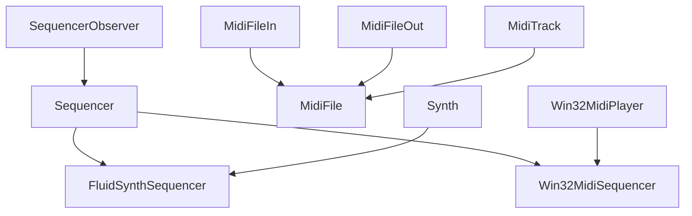

# `mingus.midi`

## Tree:
```
midi/
├── fluidsynth.py
├── midi_file_in.py
├── midi_file_out.py
├── midi_track.py
├── pyfluidsynth.py
├── sequencer.py
├── sequencer_observer.py
├── win32midi.py
└── win32midisequencer.py
```

## Role:
Handles MIDI audio playback, file I/O, and sequencing operations for musical compositions

## Description:
This module provides comprehensive MIDI functionality for the mingus music library, enabling users to play, compose, and manipulate musical compositions through MIDI protocols. It serves as the core interface for MIDI-based audio processing and file handling.

The module is organized around three main subsystems:
1. **Sequencing**: Provides abstract and concrete implementations for playing musical sequences
2. **File I/O**: Handles reading and writing MIDI files in standard formats
3. **Track Management**: Manages musical elements like notes, bars, and compositions

Primary consumers include the main mingus library components that require MIDI playback capabilities, composition creation, and file export/import functionality.

## Components:
*   `FluidSynthSequencer` - Concrete implementation using FluidSynth for audio synthesis
*   `MidiFile` (in midi_file_in.py) - Parses MIDI files into musical compositions
*   `MidiFile` (in midi_file_out.py) - Writes musical compositions to MIDI files
*   `MidiTrack` - Manages MIDI track data and conversion to MIDI format
*   `Synth` (in pyfluidsynth.py) - Low-level FluidSynth wrapper for audio synthesis
*   `Sequencer` - Abstract base class defining the MIDI sequencing interface
*   `SequencerObserver` - Observer pattern implementation for receiving sequencer events
*   `Win32MidiPlayer` - Windows-specific MIDI player using Win32 API
*   `Win32MidiSequencer` - Windows-specific sequencer implementation



## Public API:
*   `MIDI_to_Composition(file)` - Converts MIDI file to Composition object
*   `write_Composition(file, composition, bpm=120, repeat=0, verbose=False)` - Writes Composition to MIDI file
*   `play_Composition(composition, channels=None, bpm=120)` - Plays Composition through sequencer
*   `play_Note(note, channel=1, velocity=100)` - Plays single note
*   `stop_Note(note, channel=1)` - Stops playing note
*   `set_instrument(channel, midi_instr, bank=0)` - Sets MIDI instrument for channel
*   `control_change(channel, control, value)` - Sends MIDI control change message
*   `main_volume(channel, value)` - Sets main volume for channel
*   `pan(channel, value)` - Sets pan position for channel
*   `modulation(channel, value)` - Sets modulation for channel

## Dependencies:
*   Internal: `mingus.core` (for Note, NoteContainer, Bar, Track, Composition objects)
*   External: `pyfluidsynth` (for FluidSynth integration), `wave`, `time`, `struct`, `math`, `os`, `sys`, `ctypes` (for Windows MIDI), `binascii` (for MIDI parsing)

## Constraints:
*   Sequencer implementations must be initialized before use
*   MIDI files must conform to standard MIDI format specifications
*   FluidSynth requires sound font files (.sf2) to be loaded before playback
*   Windows-specific implementations require Windows platform
*   Thread safety: Sequencers are not thread-safe; concurrent access must be synchronized

---

## Files

- [`fluidsynth.py`](midi/fluidsynth.md)
- [`midi_file_in.py`](midi/midi_file_in.md)
- [`midi_file_out.py`](midi/midi_file_out.md)
- [`midi_track.py`](midi/midi_track.md)
- [`pyfluidsynth.py`](midi/pyfluidsynth.md)
- [`sequencer.py`](midi/sequencer.md)
- [`sequencer_observer.py`](midi/sequencer_observer.md)
- [`win32midi.py`](midi/win32midi.md)
- [`win32midisequencer.py`](midi/win32midisequencer.md)

