# `fluidsynth.py`

## `mingus.midi.fluidsynth.FluidSynthSequencer` · *class*

## Summary:
A MIDI sequencer implementation that uses FluidSynth for audio synthesis and playback.

## Description:
The FluidSynthSequencer class provides a concrete implementation of the abstract Sequencer interface, utilizing the FluidSynth library for MIDI event processing and audio generation. It handles MIDI events such as note playback, control changes, and instrument selection, while also supporting audio recording capabilities.

This class serves as a bridge between the abstract MIDI sequencing interface and the concrete FluidSynth audio engine, enabling musical compositions to be played back with realistic synthesized sounds.

## State:
- fs (Synth object): The FluidSynth synthesizer instance created during initialization
- sfid (int): Sound font ID loaded from a sound font file, used for instrument selection
- wav (wave.Wave_write): Wave file object used for audio recording when started
- output: Class attribute set to None, likely intended for future audio output configuration

## Lifecycle:
- Creation: Instantiate with default constructor; initializes internal FluidSynth instance
- Usage: Call methods in typical sequence - load_sound_font() first, then start_audio_output(), followed by play_* and control_change* methods
- Destruction: Automatically cleans up FluidSynth resources via __del__ method when object is garbage collected

## Method Map:
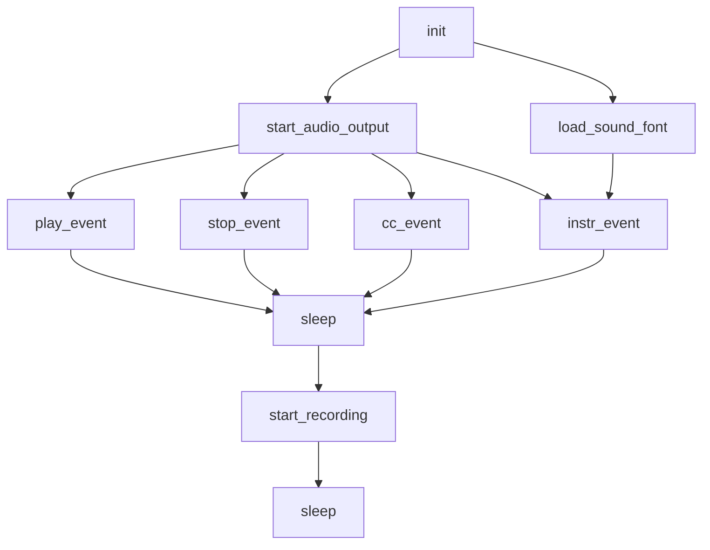

## Raises:
- None explicitly raised by __init__
- The load_sound_font method returns False if sound font loading fails (sfid == -1)

## Example:
```python
# Create sequencer instance
sequencer = FluidSynthSequencer()

# Initialize and configure
sequencer.init()
sequencer.load_sound_font("soundfont.sf2")
sequencer.start_audio_output()

# Play a note
sequencer.play_event(60, 1, 100)  # Play middle C on channel 1
sequencer.sleep(1.0)               # Wait 1 second
sequencer.stop_event(60, 1)       # Stop the note

# Record audio
sequencer.start_recording("output.wav")
sequencer.play_event(64, 1, 100)  # Play E4
sequencer.sleep(0.5)
sequencer.stop_event(64, 1)
# Recording automatically stops when object is destroyed
```

### `mingus.midi.fluidsynth.FluidSynthSequencer.init` · *method*

## Summary:
Initializes a FluidSynth synthesizer instance for audio synthesis.

## Description:
This method creates and stores a new FluidSynth synthesizer object (`fs.Synth()`) as an instance attribute. It is called automatically during object initialization as part of the Sequencer inheritance chain. The method sets up the underlying FluidSynth engine that handles MIDI note playback and audio generation.

## Args:
    None

## Returns:
    None

## Raises:
    None

## State Changes:
    Attributes READ: None
    Attributes WRITTEN: self.fs (stores the FluidSynth synthesizer instance)

## Constraints:
    Preconditions: None
    Postconditions: self.fs is initialized as a FluidSynth synthesizer object

## Side Effects:
    None

### `mingus.midi.fluidsynth.FluidSynthSequencer.__del__` · *method*

## Summary:
Cleans up FluidSynth resources when the sequencer object is being destroyed.

## Description:
This destructor method releases all FluidSynth-related system resources including audio drivers, synthesizer instances, and settings. It is automatically called by Python's garbage collector when the FluidSynthSequencer instance is about to be destroyed, ensuring proper cleanup of native system resources.

## Args:
    None

## Returns:
    None

## Raises:
    None

## State Changes:
    Attributes READ: self.fs
    Attributes WRITTEN: None

## Constraints:
    Preconditions: The object must have been properly initialized with a valid fs.Synth instance
    Postconditions: All FluidSynth resources associated with this instance are released

## Side Effects:
    I/O operations: Calls native C library functions to clean up audio drivers and synthesizer instances
    Resource cleanup: Frees memory and system resources allocated by the FluidSynth library

### `mingus.midi.fluidsynth.FluidSynthSequencer.start_audio_output` · *method*

## Summary:
Initializes the audio output system using the FluidSynth library with an optional audio driver specification.

## Description:
This method starts the audio output subsystem by initializing the underlying FluidSynth synthesizer with the specified audio driver. It serves as a bridge between the mingus sequencing framework and the actual audio hardware/output system. The method is typically called during the setup phase of audio playback to prepare the system for generating sound.

## Args:
    driver (str, optional): Audio driver to use for output. Valid options include 'alsa', 'oss', 'jack', 'portaudio', 'sndmgr', 'coreaudio', 'Direct Sound', 'dsound', 'pulseaudio'. Defaults to None, which uses the default system driver.

## Returns:
    None: This method does not return any value.

## Raises:
    AssertionError: If the specified driver is not in the list of supported audio drivers.

## State Changes:
    Attributes READ: self.fs
    Attributes WRITTEN: None

## Constraints:
    Preconditions: 
    - The FluidSynthSequencer must have been properly initialized (fs attribute must exist)
    - The specified driver must be one of the supported audio drivers if provided
    
    Postconditions:
    - Audio output system is initialized and ready for playback
    - The underlying FluidSynth synthesizer is configured with the specified driver

## Side Effects:
    - Initializes audio system resources
    - May create system-level audio driver connections
    - Calls external FluidSynth library functions

### `mingus.midi.fluidsynth.FluidSynthSequencer.start_recording` · *method*

## Summary:
Initializes a WAV file for audio recording with standard stereo audio parameters.

## Description:
Configures and opens a WAV file for writing audio data. This method prepares the audio recording environment by setting up a WAV file with 2-channel stereo audio, 16-bit samples, and a 44.1kHz sample rate. The file handle is stored in the instance variable `self.wav` for subsequent use by the `sleep` method during audio recording.

## Args:
    file (str): Path to the WAV file to create. Defaults to "mingus_dump.wav".

## Returns:
    None: This method does not return a value.

## Raises:
    IOError: If the specified file cannot be opened for writing.

## State Changes:
    Attributes READ: None
    Attributes WRITTEN: Sets `self.wav` to the opened wave file handle.

## Constraints:
    Preconditions: The method can be called at any time, but should be called before using the `sleep` method for recording.
    Postconditions: The instance variable `self.wav` is set to a valid wave file handle with 2 channels, 2-byte sample width, and 44100 Hz frame rate.

## Side Effects:
    I/O: Creates or overwrites the specified WAV file and opens it for binary writing.

### `mingus.midi.fluidsynth.FluidSynthSequencer.load_sound_font` · *method*

## Summary:
Loads a sound font file into the fluidsynth synthesizer and stores its identifier for later use.

## Description:
Initializes the fluidsynth synthesizer with a sound font file, making musical instruments available for playback. This method is typically called during sequencer initialization or when switching sound fonts. The method returns a boolean indicating whether the sound font was successfully loaded.

## Args:
    sf2 (str): Path to the sound font file (.sf2) to be loaded

## Returns:
    bool: True if the sound font was successfully loaded, False otherwise

## Raises:
    None explicitly raised, but may raise exceptions from underlying fluidsynth library

## State Changes:
    Attributes READ: None
    Attributes WRITTEN: self.sfid (stores the sound font identifier)

## Constraints:
    Preconditions: 
    - The sequencer must be initialized (self.fs must be a valid Synth object)
    - The sound font file path must be valid and accessible
    - The sound font file must be in a supported format (.sf2)
    
    Postconditions:
    - If successful, self.sfid contains a valid sound font identifier
    - If failed, self.sfid contains -1

## Side Effects:
    - I/O operation to read the sound font file from disk
    - Potential external library calls to fluidsynth C library

### `mingus.midi.fluidsynth.FluidSynthSequencer.play_event` · *method*

## Summary:
Plays a musical note using the FluidSynth synthesizer by sending a note-on message.

## Description:
This method sends a note-on message to the FluidSynth synthesizer instance, triggering audio playback of the specified musical note. It is part of the FluidSynthSequencer's event handling system and implements the abstract play_event method defined in the base Sequencer class.

## Args:
    note (int): The MIDI note number to play (typically 0-127)
    channel (int): The MIDI channel number (typically 0-15)
    velocity (int): The velocity/attack level of the note (typically 0-127)

## Returns:
    None: This method does not return a value.

## Raises:
    AttributeError: If self.fs is not initialized (i.e., if init() was not called or failed).

## State Changes:
    Attributes READ: self.fs
    Attributes WRITTEN: None

## Constraints:
    Preconditions: 
    - self.fs must be initialized (typically by calling init() method)
    - note must be a valid MIDI note number (0-127)
    - channel must be a valid MIDI channel (0-15)
    - velocity must be a valid MIDI velocity value (0-127)

    Postconditions:
    - The FluidSynth synthesizer will begin playing the specified note
    - No state changes occur on the FluidSynthSequencer object itself

## Side Effects:
    - Calls the FluidSynth library's noteon() method
    - May produce audible sound through the system's audio output
    - May cause I/O operations if audio is being recorded to a WAV file

### `mingus.midi.fluidsynth.FluidSynthSequencer.stop_event` · *method*

## Summary:
Stops a MIDI note event by sending a note-off message to the FluidSynth synthesizer.

## Description:
This method sends a note-off command to the FluidSynth synthesizer instance, effectively stopping a previously played note. It is part of the FluidSynthSequencer class that implements the abstract Sequencer interface. The method is called internally by the `stop_Note` method when stopping MIDI notes.

## Args:
    note (int): The MIDI note number to stop (0-127)
    channel (int): The MIDI channel number (0-15)

## Returns:
    None: This method does not return any value

## Raises:
    None: This method does not explicitly raise exceptions, though underlying FluidSynth operations may raise exceptions

## State Changes:
    Attributes READ: self.fs
    Attributes WRITTEN: None

## Constraints:
    Preconditions: 
    - The FluidSynth synthesizer must be initialized (self.fs should be a valid Synth instance)
    - The note parameter must be between 0 and 127
    - The channel parameter must be 0 or greater
    
    Postconditions:
    - The specified note on the specified channel will be stopped
    - No changes to the FluidSynthSequencer object's state beyond the note-off command

## Side Effects:
    - Calls the FluidSynth synthesizer's noteoff method
    - May cause audio output to stop for the specified note/channel combination

### `mingus.midi.fluidsynth.FluidSynthSequencer.cc_event` · *method*

## Summary:
Sets a MIDI control change value for a specific channel and control number.

## Description:
This method sends a MIDI control change message to the FluidSynth synthesizer instance. It serves as a bridge between the abstract sequencer interface and the concrete FluidSynth implementation, allowing control changes such as volume, pan, or modulation to be applied to specific MIDI channels.

## Args:
    channel (int): The MIDI channel number (typically 0-15)
    control (int): The control change number (typically 0-127)
    value (int): The control change value (typically 0-127)

## Returns:
    None: This method does not return a value.

## Raises:
    None explicitly raised by this method.

## State Changes:
    Attributes READ: self.fs
    Attributes WRITTEN: None

## Constraints:
    Preconditions: 
    - The FluidSynth synthesizer must be initialized (self.fs should be a valid Synth instance)
    - Channel should be in range 0-15
    - Control should be in range 0-127  
    - Value should be in range 0-127
    
    Postconditions:
    - The control change is sent to the FluidSynth synthesizer instance
    - No state changes occur on the FluidSynthSequencer object itself

## Side Effects:
    - Calls the underlying FluidSynth library's cc() method
    - May cause audio output changes depending on the control and value parameters

### `mingus.midi.fluidsynth.FluidSynthSequencer.instr_event` · *method*

## Summary:
Sets the instrument for a MIDI channel using FluidSynth's program selection mechanism.

## Description:
This method configures a MIDI channel to use a specific instrument from a loaded sound font. It serves as an interface to FluidSynth's program_select API call, allowing the sequencer to change instruments during playback. This method is typically called as part of the instrument setting process in the MIDI sequencing pipeline.

## Args:
    channel (int): The MIDI channel number (typically 0-15) to configure
    instr (int): The instrument number within the selected bank to use
    bank (int): The bank number containing the instrument

## Returns:
    None: This method does not return a value

## Raises:
    None explicitly raised: The underlying FluidSynth API may raise exceptions, but they are not caught or re-raised by this wrapper

## State Changes:
    Attributes READ: self.fs, self.sfid
    Attributes WRITTEN: None

## Constraints:
    Preconditions: 
    - The FluidSynth synthesizer (`self.fs`) must be initialized
    - A sound font must be loaded (setting `self.sfid` via `load_sound_font`)
    - Channel, bank, and instrument numbers must be valid for the loaded sound font
    
    Postconditions: 
    - The specified MIDI channel will use the requested instrument for subsequent notes

## Side Effects:
    - Calls the FluidSynth API which may involve audio processing
    - May cause audible changes in sound output when called during playback

### `mingus.midi.fluidsynth.FluidSynthSequencer.sleep` · *method*

## Summary:
Suspends execution for a specified duration while either capturing audio samples or using standard sleep.

## Description:
This method implements timed suspension for MIDI playback operations. When recording audio to a WAV file, it captures audio samples from the FluidSynth synthesizer and writes them to the file. Otherwise, it performs standard time-based suspension. This override provides audio-aware timing that's essential for proper MIDI playback synchronization.

## Args:
    seconds (float): Number of seconds to suspend execution.

## Returns:
    None: This method does not return a value.

## Raises:
    None explicitly raised, but may propagate exceptions from underlying audio operations.

## State Changes:
    Attributes READ: 
        - self.wav: Checked for existence to determine recording mode
        - self.fs: Used to access the FluidSynth synthesizer instance
    
    Attributes WRITTEN:
        - self.wav: Frames are written to the WAV file in recording mode

## Constraints:
    Preconditions:
        - When in recording mode (self.wav exists), the FluidSynth synthesizer must be initialized
        - The method assumes proper initialization of the FluidSynth engine via self.fs
        
    Postconditions:
        - Execution is suspended for the specified duration
        - In recording mode, audio frames are written to the WAV file
        - No state changes occur beyond the intended sleep behavior

## Side Effects:
    - In recording mode: Writes audio frame data to the WAV file
    - In normal mode: Blocks execution for the specified duration
    - May involve audio processing operations through the FluidSynth library

## `mingus.midi.fluidsynth.init` · *function*

## Summary:
Initializes the FluidSynth MIDI synthesizer with a sound font and configures audio output or recording.

## Description:
Configures the FluidSynth MIDI system for audio playback or recording. This function serves as a lazy initializer that sets up the MIDI synthesizer with the specified sound font and either starts audio output through a specified driver or begins recording to a file. The initialization is performed only once, making subsequent calls no-ops.

## Args:
    sf2 (str): Path to the SoundFont2 file to load for MIDI synthesis.
    driver (str, optional): Audio driver to use for output. Defaults to None, which uses the default driver.
    file (str, optional): Path to a file for recording MIDI output. If provided, recording is started instead of audio output.

## Returns:
    bool: True if initialization was successful or already completed, False if sound font loading failed.

## Raises:
    None explicitly raised in the function body.

## Constraints:
    Preconditions:
    - The sf2 parameter must be a valid path to a SoundFont2 file.
    - The global variable `midi` must be initialized before calling this function.
    - The global variable `initialized` must be accessible as a mutable boolean flag.
    
    Postconditions:
    - If successful, the global `initialized` flag is set to True.
    - The sound font is loaded into the FluidSynth system.
    - Either audio output is started or recording is initiated based on the file parameter.

## Side Effects:
    - Initializes global `midi` object if not already initialized.
    - Sets global `initialized` flag to True upon successful completion.
    - May start audio output through system drivers.
    - May begin recording MIDI data to a file.
    - Loads a SoundFont2 file into memory.

## Control Flow:
```mermaid
flowchart TD
    A[init called] --> B{initialized?}
    B -- No --> C{file provided?}
    C -- Yes --> D[midi.start_recording(file)]
    C -- No --> E[midi.start_audio_output(driver)]
    D --> F[midi.load_sound_font(sf2)]
    E --> F
    F --> G{load_sound_font success?}
    G -- No --> H[return False]
    G -- Yes --> I[midi.fs.program_reset()]
    I --> J[initialized = True]
    J --> K[return True]
    B -- Yes --> L[return True]
```

## Examples:
    # Initialize with default audio output
    init("soundfont.sf2")
    
    # Initialize with specific audio driver
    init("soundfont.sf2", driver="alsa")
    
    # Initialize for recording
    init("soundfont.sf2", file="output.wav")
```

## `mingus.midi.fluidsynth.play_Note` · *function*

## Summary:
Plays a single musical note using the FluidSynth MIDI synthesizer with configurable channel and velocity.

## Description:
This function serves as a simplified interface for playing individual musical notes through the FluidSynth MIDI synthesizer. It delegates the actual note-playing operation to the underlying `midi.play_Note` implementation, providing convenient default values for channel (1) and velocity (100).

## Args:
    note (any): The musical note to play, typically represented as a note name (e.g., 'C-4') or MIDI note number
    channel (int): MIDI channel number, defaults to 1 (range typically 1-16)
    velocity (int): Note velocity (loudness) ranging from 0-127, defaults to 100

## Returns:
    The return value is returned directly from the underlying `midi.play_Note` implementation, which typically indicates the success status or playback state of the operation.

## Raises:
    Any exceptions that may be raised by the underlying `midi.play_Note` implementation, such as MIDI initialization errors or invalid note parameters.

## Constraints:
    Preconditions:
    - The FluidSynth synthesizer must be properly initialized before calling this function
    - The note parameter must be valid for the MIDI system
    - Channel must be within valid MIDI channel range (typically 1-16)
    - Velocity must be within valid range (0-127)

    Postconditions:
    - The note will be initiated for playback through the configured FluidSynth synthesizer
    - The function returns control to the caller once the playback initiation is complete

## Side Effects:
    - Audio output through the system's audio device
    - Interaction with the FluidSynth MIDI synthesizer
    - Potential blocking behavior during note playback duration

## Control Flow:
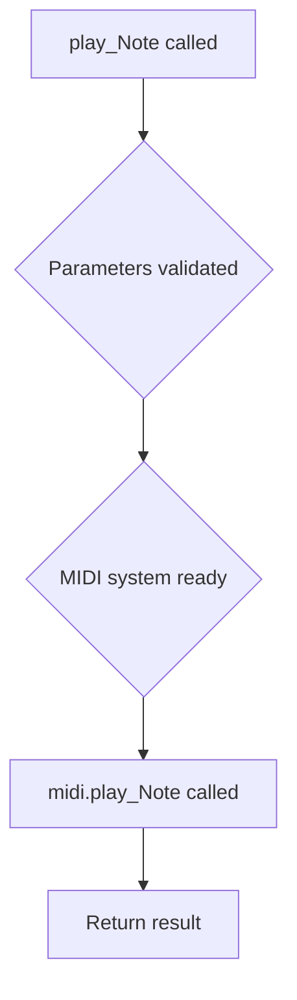

## Examples:
    # Play middle C with default settings
    play_Note('C-4')
    
    # Play a note on channel 2 with specific velocity
    play_Note('E-5', channel=2, velocity=80)
``

## `mingus.midi.fluidsynth.stop_Note` · *function*

## Summary:
Delegates to the fluidsynth MIDI system to stop playback of a specific note on a given channel.

## Description:
This function serves as a wrapper that forwards note stopping requests to the fluidsynth MIDI implementation. It provides a standardized interface for terminating MIDI note playback on a specified channel within the fluidsynth audio system.

## Args:
    note (int): The MIDI note number to stop playback for (typically 0-127).
    channel (int): The MIDI channel number to stop the note on. Defaults to 1.

## Returns:
    The return value is determined by the underlying `midi.stop_Note()` implementation, which typically indicates the success or failure of the stop operation.

## Raises:
    Exceptions are propagated from the underlying `midi.stop_Note()` implementation, which may include errors related to invalid note numbers, invalid channels, or MIDI system errors.

## Constraints:
    Preconditions:
    - The note number should be within valid MIDI note range (typically 0-127)
    - The channel number should be a valid MIDI channel (typically 1-16)
    
    Postconditions:
    - The specified note will cease playback on the given channel
    - The underlying MIDI system state will be updated accordingly

## Side Effects:
    - Interacts with the fluidsynth audio engine to terminate note playback
    - May modify internal state of the MIDI synthesizer system
    - Communicates with the underlying audio subsystem

## Control Flow:
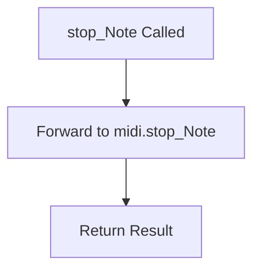

## Examples:
```python
# Stop middle C on channel 1
stop_Note(60)

# Stop note 72 on channel 2
stop_Note(72, channel=2)
```

## `mingus.midi.fluidsynth.play_NoteContainer` · *function*

## Summary:
Plays a container of musical notes using the FluidSynth MIDI synthesizer.

## Description:
This function serves as a standardized interface for playing musical note containers through the FluidSynth audio synthesis system. It delegates the actual playback implementation to the underlying MIDI system, providing a consistent way to trigger note sequences with configurable channel and velocity settings. The function is part of the FluidSynth-based MIDI playback pipeline in the mingus library.

## Args:
    nc (NoteContainer): Container holding musical notes to be played
    channel (int): MIDI channel number (default: 1, range: 1-16)
    velocity (int): Note velocity (default: 100, range: 0-127)

## Returns:
    bool: True if all notes were successfully played, False otherwise

## Raises:
    None explicitly documented - depends on underlying MIDI implementation

## Constraints:
    Preconditions:
    - nc must be a valid NoteContainer object
    - channel must be between 1 and 16 (inclusive)
    - velocity must be between 0 and 127 (inclusive)
    
    Postconditions:
    - All notes in the container are processed for playback through FluidSynth
    - Function returns after attempting to play all notes

## Side Effects:
    - Audio output through FluidSynth synthesizer
    - Potential blocking behavior while notes are being played
    - Interaction with global FluidSynth state management
    - Possible synchronization with audio buffer processing

## Control Flow:
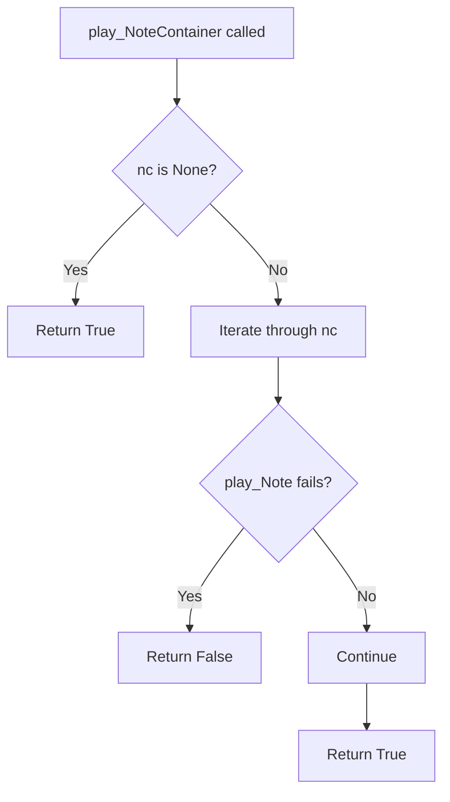

## Examples:
    # Play a sequence of notes on default channel with default velocity
    note_container = NoteContainer([Note('C-4'), Note('E-4'), Note('G-4')])
    success = play_NoteContainer(note_container)
    
    # Play notes on channel 2 with custom velocity
    success = play_NoteContainer(note_container, channel=2, velocity=80)
``

## `mingus.midi.fluidsynth.stop_NoteContainer` · *function*

## Summary:
Delegates to the underlying MIDI implementation to stop playback of a collection of notes (NoteContainer) on a specified MIDI channel.

## Description:
This function acts as a thin wrapper that forwards the stop request for a NoteContainer to the underlying MIDI system. It is part of the FluidSynth MIDI subsystem and is used internally by the MIDI playback system to terminate note events on specific channels.

## Args:
    nc (NoteContainer): The collection of notes to stop playback for. Can be None to indicate no notes to stop.
    channel (int): The MIDI channel number (1-16) on which to stop the notes. Defaults to 1.

## Returns:
    The return value is determined by the underlying midi.stop_NoteContainer implementation.

## Raises:
    Exceptions may be raised by the underlying MIDI implementation if operations fail.

## Constraints:
    Preconditions:
    - The NoteContainer should contain valid note objects
    - The channel number should be between 1 and 16 (inclusive)
    - The MIDI system should be properly initialized
    
    Postconditions:
    - The function delegates to the underlying MIDI system to stop note playback

## Side Effects:
    - Interacts with the FluidSynth MIDI synthesizer to send stop commands
    - May modify internal MIDI state or buffers
    - Causes audible cessation of sound on the specified MIDI channel

## Control Flow:
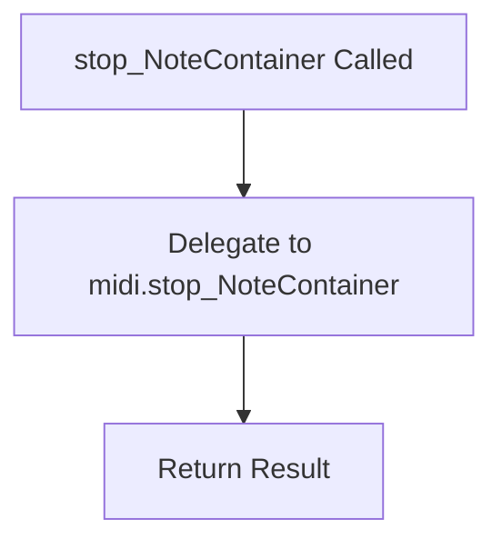

## Examples:
```python
# Stop all notes in a NoteContainer on channel 1
stop_NoteContainer(my_note_container)

# Stop all notes in a NoteContainer on channel 2
stop_NoteContainer(my_note_container, channel=2)
```

## `mingus.midi.fluidsynth.play_Bar` · *function*

## Summary:
Delegates musical bar playback to the underlying MIDI system using FluidSynth.

## Description:
This function serves as a wrapper that forwards musical bar playback requests to the underlying midi.play_Bar implementation. It provides a consistent interface for playing musical bars through FluidSynth audio synthesis with configurable channel and tempo settings.

## Args:
    bar: Musical bar/measure object to be played
    channel (int): MIDI channel number for playback (default: 1)
    bpm (int): Beats per minute tempo setting (default: 120)

## Returns:
    The return value from the underlying midi.play_Bar function, which varies based on the implementation.

## Raises:
    Any exceptions that may be raised by the underlying midi.play_Bar function.

## Constraints:
    Preconditions:
    - The bar parameter must be a valid musical bar object compatible with the FluidSynth backend
    - Channel must be a valid MIDI channel number (typically 1-16)
    - BPM must be a positive integer representing tempo

    Postconditions:
    - The musical bar will be played through FluidSynth audio synthesis
    - The function returns the result of the underlying playback operation

## Side Effects:
    - Audio output through FluidSynth synthesizer
    - Potential system resource usage for audio processing
    - May involve I/O operations for audio buffer management

## Control Flow:
```mermaid
flowchart TD
    A[play_Bar called] --> B[midi.play_Bar(bar, channel, bpm)]
    B --> C[Return result]
```

## Examples:
    # Play a bar with default settings (channel=1, bpm=120)
    play_Bar(my_bar)
    
    # Play a bar on channel 2 with 100 BPM
    play_Bar(my_bar, channel=2, bpm=100)
``

## `mingus.midi.fluidsynth.play_Bars` · *function*

*No documentation generated.*

## `mingus.midi.fluidsynth.play_Track` · *function*

## Summary
Plays a musical track using FluidSynth audio synthesis by delegating to the underlying MIDI playback implementation.

## Description
This function serves as a wrapper that forwards track playback requests to the FluidSynth-based MIDI playback implementation. It handles the basic parameters for track playback including the musical track, MIDI channel, and tempo (BPM). The function acts as an interface layer that abstracts away the specific MIDI implementation details, allowing users to play musical tracks without directly interacting with the low-level FluidSynth APIs.

## Args
- track: The musical track to play, typically containing musical bars and notes (expected type: MidiTrack or compatible iterable)
- channel: MIDI channel number (default: 1, range: 1-16)  
- bpm: Beats per minute tempo setting (default: 120, range: typically 40-300)

## Returns
Returns a dictionary containing the final BPM value after playback completes. If playback encounters an issue, an empty dictionary `{}` may be returned to indicate failure or early termination.

## Raises
This function may raise exceptions that are propagated from the underlying `pyfluidsynth.play_Track` implementation, though specific exceptions are not explicitly defined in this wrapper function.

## Constraints
- Precondition: The track parameter must be a valid musical track object with iterable bars
- Precondition: Channel must be within valid MIDI channel range (1-16)
- Precondition: BPM must be a positive numeric value representing tempo

## Side Effects
- Initiates audio playback through FluidSynth synthesizer
- May modify global audio state through FluidSynth system calls
- Triggers notification events to attached sequencer listeners

## Control Flow
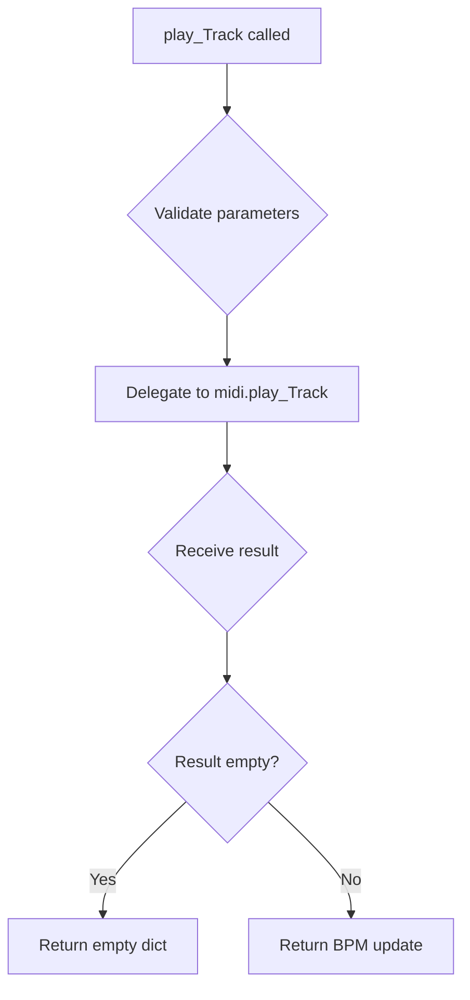

## Examples
```python
# Basic usage
track = MidiTrack()
# ... populate track with music ...
play_Track(track)

# With custom channel and tempo
play_Track(track, channel=2, bpm=140)
```

## `mingus.midi.fluidsynth.play_Tracks` · *function*

## Summary:
Delegates MIDI track playback to the underlying MIDI system using FluidSynth.

## Description:
This function acts as a wrapper that forwards MIDI track playback requests to the core MIDI implementation. It takes a collection of MIDI tracks, their associated channels, and tempo information, then coordinates their playback through the FluidSynth audio engine.

## Args:
    tracks (list): A list of MIDI track objects containing musical data
    channels (list): A list of channel numbers corresponding to each track
    bpm (int, optional): Tempo in beats per minute. Defaults to 120.

## Returns:
    The return value is delegated to the underlying midi.play_Tracks implementation, which typically returns a dictionary containing playback status information.

## Raises:
    None explicitly documented - behavior depends on the underlying implementation.

## Constraints:
    Preconditions:
    - Tracks must be valid MIDI track objects with proper musical data
    - Channels must correspond to valid MIDI channels
    - BPM must be a positive integer
    
    Postconditions:
    - The underlying MIDI system handles the actual playback process

## Side Effects:
    - May initiate audio playback through FluidSynth
    - Could involve file I/O if soundfonts need to be loaded
    - May modify global audio state through FluidSynth library

## Control Flow:
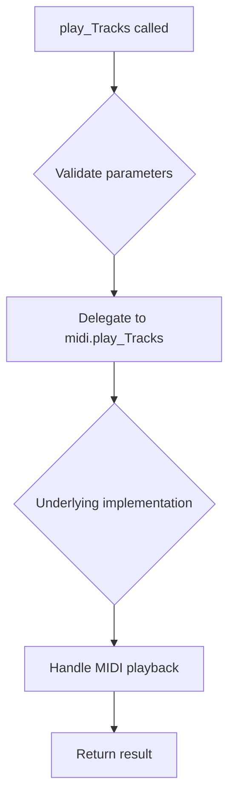

## Examples:
    # Play two tracks on channels 0 and 1 at 120 BPM
    result = play_Tracks([track1, track2], [0, 1], 120)
    
    # Play tracks at 100 BPM
    result = play_Tracks([track1, track2, track3], [0, 1, 2], 100)
``

## `mingus.midi.fluidsynth.play_Composition` · *function*

## Summary:
Plays a musical composition using the FluidSynth MIDI synthesizer by delegating to the underlying MIDI system.

## Description:
This function serves as a wrapper that initiates playback of a musical composition through the FluidSynth MIDI synthesizer. It delegates the actual playback logic to the underlying MIDI system's play_Composition method, handling the coordination of tracks, channels, and tempo settings. The function acts as an interface between the application and the MIDI playback system.

## Args:
    composition: The musical composition object containing tracks to be played
    channels (list[int], optional): List of MIDI channels to assign to each track. If None, automatically assigns channels starting from 1. Defaults to None.
    bpm (int): Tempo setting in beats per minute. Defaults to 120.

## Returns:
    The return value is delegated to the underlying MIDI system's play_Composition implementation. Typically returns a dictionary containing the final BPM setting after playback, or an empty dictionary if playback fails.

## Raises:
    None explicitly raised in this wrapper function, though underlying implementations may raise exceptions related to MIDI playback, invalid compositions, or channel configuration issues.

## Constraints:
    Preconditions:
    - The composition object must have a valid tracks attribute
    - Channels list, if provided, must match the number of tracks in the composition
    - BPM must be a positive integer
    
    Postconditions:
    - The composition will be played through the FluidSynth MIDI synthesizer
    - Channel assignments will be applied to the tracks
    - Playback will occur at the specified tempo

## Side Effects:
    - Initiates MIDI playback through the FluidSynth synthesizer
    - May modify global MIDI state through the underlying sequencer
    - Triggers notification events to attached listeners
    - May cause blocking behavior while playback occurs

## Control Flow:
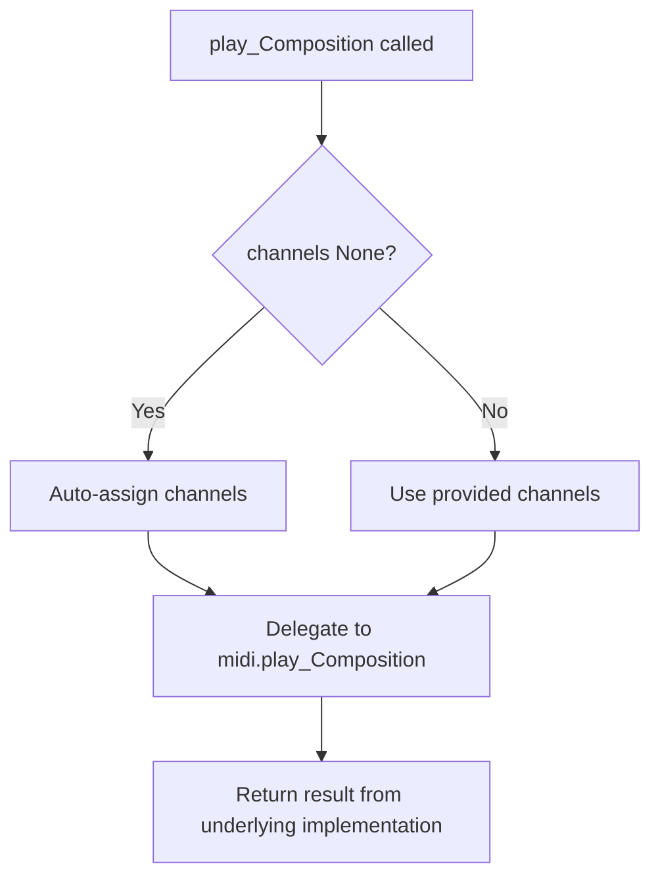

## Examples:
    # Play a composition with default settings
    play_Composition(my_composition)
    
    # Play a composition with custom channels and tempo
    play_Composition(my_composition, channels=[1, 2, 3], bpm=140)
```

## `mingus.midi.fluidsynth.control_change` · *function*

## Summary:
Sends a MIDI control change message to a specified channel with given control and value parameters.

## Description:
This function serves as a wrapper for sending MIDI control change messages to a MIDI synthesizer or sequencer. It forwards the provided channel, control, and value parameters to an underlying MIDI implementation for processing. This abstraction allows for consistent MIDI control change messaging throughout the application.

## Args:
    channel (int): The MIDI channel number (typically 0-15) to send the control change message to.
    control (int): The control number (typically 0-127) identifying which parameter to modify.
    value (int): The control value (typically 0-127) representing the new setting for the specified control.

## Returns:
    The return value is determined by the underlying MIDI implementation that handles the actual control change message processing.

## Raises:
    Exceptions may be raised by the underlying MIDI implementation if invalid parameters are provided or if MIDI communication fails.

## Constraints:
    Preconditions:
    - Channel must be a valid MIDI channel number (typically 0-15)
    - Control must be a valid MIDI control number (typically 0-127)
    - Value must be a valid MIDI value (typically 0-127)
    
    Postconditions:
    - The control change message is forwarded to the MIDI subsystem
    - The function returns whatever result is produced by the underlying MIDI implementation

## Side Effects:
    - Communicates with a MIDI synthesizer or sound device
    - May cause audible changes in sound output if the synthesizer is active
    - May involve I/O operations with MIDI hardware or software synthesizer

## Control Flow:
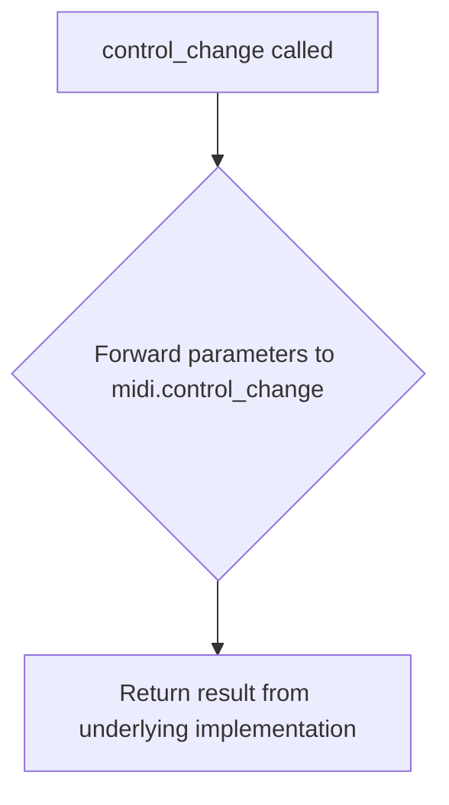

## Examples:
    # Set volume to maximum on channel 1
    result = control_change(0, 7, 127)
    
    # Set pan to center on channel 2  
    result = control_change(1, 10, 64)
    
    # Set modulation wheel to half position on channel 3
    result = control_change(2, 1, 64)
``

## `mingus.midi.fluidsynth.set_instrument` · *function*

## Summary:
Wraps the underlying MIDI set_instrument function to configure a MIDI channel with a specific instrument.

## Description:
This function acts as a thin wrapper that delegates instrument configuration to the underlying MIDI system. It provides a consistent interface for setting MIDI instruments across different MIDI implementations within the mingus library.

## Args:
    channel (int): The MIDI channel number to configure.
    midi_instr (int): The MIDI instrument number to assign to the channel.
    bank (int, optional): The MIDI bank number. Defaults to 0.

## Returns:
    The return value is directly returned from the underlying `midi.set_instrument` function call.

## Raises:
    Exceptions may be raised by the underlying `midi.set_instrument` implementation when invalid parameters are provided.

## Constraints:
    Preconditions:
    - Arguments must be compatible with the underlying MIDI system's expectations
    - Channel, midi_instr, and bank values must be valid for the target MIDI implementation
    
    Postconditions:
    - The function call results in a delegate to `midi.set_instrument` with identical parameters

## Side Effects:
    Side effects are determined by the underlying `midi.set_instrument` implementation and may include modifications to MIDI synthesizer state.

## Control Flow:
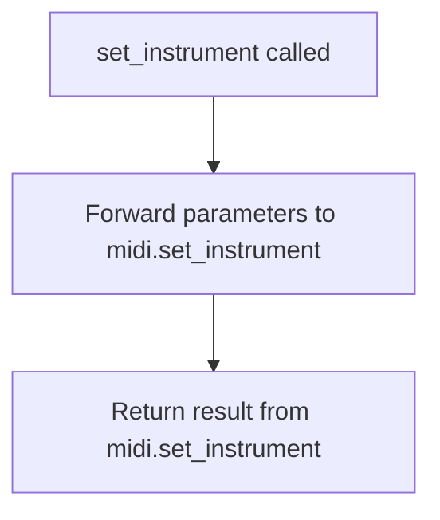

## Examples:
```python
# Configure channel 0 with piano instrument
set_instrument(0, 0)

# Configure channel 1 with drum kit instrument using bank 0
set_instrument(1, 128, 0)
```

## `mingus.midi.fluidsynth.stop_everything` · *function*

## Summary:
Stops all active MIDI playback and related operations in the fluidsynth system.

## Description:
This function serves as a wrapper that delegates MIDI stop operations to the underlying fluidsynth system. It is designed to halt all ongoing MIDI playback, note events, and sequencer operations across all channels and instruments. This function provides a standardized interface for terminating all MIDI activities within the fluidsynth context.

The function calls an underlying `midi.stop_everything()` implementation, which is expected to stop all active MIDI playback and clean up associated resources.

## Args:
    None

## Returns:
    Returns the result of the underlying `midi.stop_everything()` call. The specific return value depends on the implementation of the underlying MIDI system.

## Raises:
    Exception: May raise exceptions from the underlying MIDI system if cleanup operations fail. Specific exception types depend on the implementation of the underlying MIDI system.

## Constraints:
    Preconditions: The fluidsynth system must be initialized and active for the stop operation to have meaningful effect.
    Postconditions: All MIDI playback and related operations should be terminated or interrupted.

## Side Effects:
    - Stops all active MIDI note playback across all channels
    - Releases audio resources associated with MIDI playback
    - Clears pending MIDI events in the processing queue
    - May interrupt audio output generation

## Control Flow:
```mermaid
flowchart TD
    A[stop_everything() called] --> B{Calls midi.stop_everything()}
    B --> C[Returns result from underlying implementation]
```

## Examples:
```python
# Stop all MIDI playback
stop_everything()

# Typically used in cleanup scenarios
try:
    # ... MIDI playback operations ...
    stop_everything()
except Exception as e:
    print(f"Error stopping MIDI: {e}")
```

## `mingus.midi.fluidsynth.modulation` · *function*

## Summary:
Wrapper function for sending MIDI modulation controller messages to a specified channel.

## Description:
This function provides a simplified interface for setting MIDI modulation values on a specific channel. It delegates to the underlying MIDI implementation (specifically `midi.modulation`) to send a modulation controller message. Modulation typically controls the timbre or pitch characteristics of sounds played on the specified MIDI channel.

## Args:
    channel (int): The MIDI channel number to send the modulation message to.
    value (int): The modulation value to set, typically ranging from 0-127.

## Returns:
    The return value from the underlying MIDI implementation, which depends on the specific MIDI library used.

## Raises:
    Exceptions may be raised by the underlying MIDI implementation if invalid parameters are provided or if MIDI communication fails.

## Constraints:
    Preconditions:
    - Channel must be a valid MIDI channel identifier (typically 0-15)
    - Value must be a valid MIDI controller value (typically 0-127)
    
    Postconditions:
    - A modulation controller message is transmitted to the specified MIDI channel
    - The modulation value is set according to the provided value parameter

## Side Effects:
    - Transmits a MIDI control change message (controller 1) to the connected MIDI synthesizer
    - May cause audible changes in sound timbre or pitch on the specified channel

## Control Flow:
```mermaid
flowchart TD
    A[modulation(channel, value)] --> B[Validate parameters]
    B --> C{Parameters valid?}
    C -->|No| D[Propagate error]
    C -->|Yes| E[Call midi.modulation(channel, value)]
    E --> F[Send MIDI CC1 message]
    F --> G[Return result]
```

## Examples:
    # Set modulation to minimum value on channel 0
    modulation(0, 0)
    
    # Set modulation to maximum value on channel 1
    modulation(1, 127)
    
    # Set moderate modulation on channel 5
    modulation(5, 64)
``

## `mingus.midi.fluidsynth.pan` · *function*

## Summary:
Configures the pan position for a specified MIDI channel using FluidSynth.

## Description:
This function sets the stereo pan position for a given MIDI channel by delegating to the underlying MIDI implementation. It serves as a convenience wrapper for applying pan control to MIDI channels in the FluidSynth synthesizer environment.

## Args:
    channel (int): The MIDI channel number to configure (typically 0-15).
    value (int): The pan value to apply (typically 0-127, where 0 = full left, 64 = center, 127 = full right).

## Returns:
    The return value from the underlying MIDI implementation, which varies depending on the specific implementation of `midi.pan`.

## Raises:
    Exceptions may be raised by the underlying `midi.pan` implementation, though specific exceptions cannot be determined without access to that implementation.

## Constraints:
    Preconditions:
    - Channel must be a valid MIDI channel identifier appropriate for the FluidSynth setup
    - Value must be within the valid range for MIDI pan control (typically 0-127)
    
    Postconditions:
    - The pan setting for the specified channel is applied to the FluidSynth synthesizer

## Side Effects:
    - Modifies the audio output configuration of the FluidSynth synthesizer
    - May affect the stereo positioning of audio output from the specified MIDI channel

## Control Flow:
```mermaid
flowchart TD
    A[pan(channel, value)] --> B[midi.pan(channel, value)]
    B --> C[Return result]
```

## Examples:
    # Set channel 0 to center pan position
    pan(0, 64)
    
    # Set channel 1 to full left pan
    pan(1, 0)
    
    # Set channel 2 to full right pan
    pan(2, 127)
```

## `mingus.midi.fluidsynth.main_volume` · *function*

## Summary:
Delegates to the underlying MIDI interface to set the main volume level for a specified MIDI channel.

## Description:
This function acts as a thin wrapper that forwards volume control requests to the underlying MIDI interface's main_volume method. It provides a standardized way to adjust MIDI channel volume levels throughout the mingus library ecosystem.

## Args:
    channel (int): The MIDI channel number to set the volume for.
    value (int): The volume level to set (0-127).

## Returns:
    bool: The return value from the underlying MIDI interface's main_volume method.

## Raises:
    None explicitly raised by this function, but may propagate exceptions from the underlying MIDI interface.

## Constraints:
    Preconditions:
        - The `midi` object must be properly initialized and available in the module scope
        - Channel and value parameters must be compatible with the underlying MIDI interface requirements
    
    Postconditions:
        - The operation result is returned directly from the underlying implementation

## Side Effects:
    - Communicates with the underlying MIDI synthesizer interface
    - May trigger MIDI control change messages to the hardware/software synthesizer
    - May notify registered sequencer listeners of the volume change

## Control Flow:
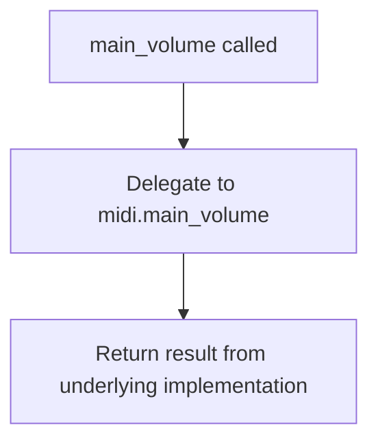

## Examples:
    # Set channel 1 volume to maximum
    success = main_volume(0, 127)
    
    # Set channel 2 volume to half
    success = main_volume(1, 64)

