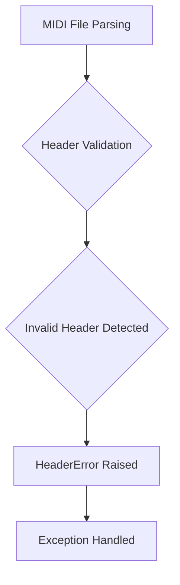
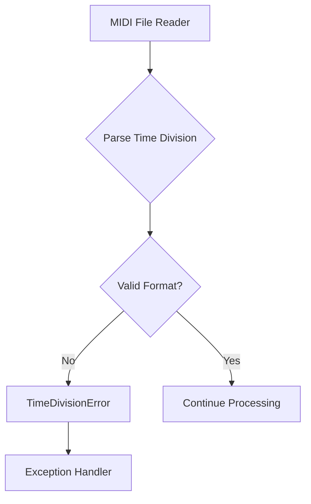
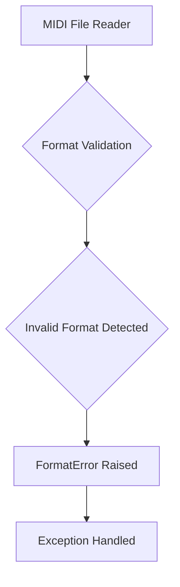

# `midi_file_in.py`

## `mingus.midi.midi_file_in.MIDI_to_Composition` · *function*

## Summary:
Converts a MIDI file into a mingus Composition object with associated metadata.

## Description:
This function serves as a convenience wrapper that takes a MIDI file path and converts it into a mingus Composition object. It creates a MidiFile parser instance and delegates the conversion process to its MIDI_to_Composition method. The function handles parsing of MIDI events including notes, instruments, tempo changes, key signatures, and time signatures to construct a proper musical composition structure.

## Args:
    file (str): Path to the MIDI file to be converted

## Returns:
    tuple: A tuple containing (Composition, bpm) where Composition is the parsed musical structure and bpm is the tempo in beats per minute

## Raises:
    IOError: When the MIDI file cannot be opened or read
    HeaderError: When the MIDI file has an invalid header
    FormatError: When the MIDI file format is unsupported or invalid
    TimeDivisionError: When the MIDI file contains invalid time division information

## Constraints:
    Precondition: The file parameter must be a valid path to an existing MIDI file
    Postcondition: Returns a tuple with a valid Composition object and numeric BPM value

## Side Effects:
    Reads from the filesystem to open and parse the MIDI file
    May print diagnostic messages to stdout for unsupported MIDI events or meta events

## Control Flow:
```mermaid
flowchart TD
    A[Start MIDI_to_Composition] --> B{Create MidiFile instance}
    B --> C{Call MidiFile.MIDI_to_Composition}
    C --> D{Parse MIDI file header}
    D --> E{Parse MIDI tracks}
    E --> F{Process track events}
    F --> G{Handle MIDI events}
    G --> H{Build Composition structure}
    H --> I{Return (Composition, bpm)}
```

## Examples:
```python
# Basic usage
composition, bpm = MIDI_to_Composition("my_song.mid")

# Error handling
try:
    composition, bpm = MIDI_to_Composition("nonexistent.mid")
except IOError:
    print("Could not read MIDI file")
```

## `mingus.midi.midi_file_in.HeaderError` · *class*

## Summary:
Represents an exception raised when a MIDI file header is invalid or malformed during parsing.

## Description:
The HeaderError exception is specifically designed to indicate problems encountered when processing MIDI file headers. This exception is raised when the MIDI file parser detects issues with the file's header structure, such as incorrect format, unsupported header versions, or corrupted header data. It serves as a distinct error type to differentiate header-related problems from other types of MIDI parsing errors.

This class is part of the MIDI file input processing system in the mingus library, which handles reading and interpreting MIDI files for music composition and manipulation.

## State:
This class has no instance attributes beyond those inherited from Exception. It functions purely as a type marker for header-related errors.

## Lifecycle:
- Creation: Instantiated directly with optional error message string
- Usage: Raised during MIDI file parsing operations when header validation fails
- Destruction: Automatically cleaned up by Python's exception handling mechanism

## Method Map:


## Raises:
- HeaderError: Raised when MIDI file header contains invalid data, incorrect format, or unsupported version during parsing operations

## Example:
```python
try:
    midi_parser = MidiFileIn("invalid_midi_file.mid")
    midi_parser.parse()
except HeaderError as e:
    print(f"MIDI header error: {e}")
    # Handle invalid header case
```

## `mingus.midi.midi_file_in.TimeDivisionError` · *class*

## Summary:
Custom exception raised when encountering invalid or unsupported time division formats in MIDI files.

## Description:
The TimeDivisionError exception is specifically designed to handle errors related to MIDI file time division specifications. In MIDI files, time division determines how timing information is interpreted - either as ticks per beat or as frames per second. This exception is raised when the time division format encountered in a MIDI file is invalid, unsupported, or cannot be properly processed by the MIDI file reader.

This exception serves as a clear indicator that there's a fundamental issue with the temporal structure of the MIDI file being processed, allowing higher-level code to handle these parsing errors appropriately.

## State:
The class inherits directly from Exception and has no additional attributes or state. It functions purely as a semantic marker for time division-related errors.

## Lifecycle:
- Creation: Instantiated when invalid time division data is detected during MIDI file parsing
- Usage: Raised during MIDI file reading operations when time division format is problematic
- Destruction: Standard exception cleanup when caught and handled

## Method Map:


## Raises:
- TimeDivisionError: Raised when MIDI file contains invalid time division specification
  - Triggered when time division format is neither valid SMPTE (frames/second) nor valid ticks/beat
  - Triggered when time division value is outside acceptable ranges for MIDI specification

## Example:
```python
try:
    midi_reader = MidiFileIn("example.mid")
    midi_reader.read()
except TimeDivisionError as e:
    print(f"Invalid time division in MIDI file: {e}")
    # Handle the error appropriately
```

## `mingus.midi.midi_file_in.FormatError` · *class*

## Summary:
Represents an error that occurs when a MIDI file has an invalid or unsupported format.

## Description:
FormatError is a custom exception class used throughout the mingus MIDI file processing system to indicate that a MIDI file being read does not conform to the expected format specifications. This exception is raised when the MIDI file parser encounters structural issues, unsupported MIDI events, or format violations that prevent proper parsing of the file.

## State:
This class has no instance attributes beyond those inherited from Exception. It serves purely as an exception type marker.

## Lifecycle:
- Creation: Instantiated when MIDI file format validation fails during parsing operations
- Usage: Raised by MIDI file reading functions when format inconsistencies are detected
- Destruction: Automatically cleaned up by Python's exception handling mechanism

## Method Map:


## Raises:
- FormatError: Raised when MIDI file format validation fails during parsing operations

## Example:
```python
try:
    midi_file = MidiFile("invalid.mid")
    midi_file.read()
except FormatError as e:
    print(f"MIDI file format error: {e}")
```

## `mingus.midi.midi_file_in.MidiFile` · *class*

## Summary:
Parses MIDI files and converts them into mingus Composition objects with associated metadata.

## Description:
The MidiFile class provides functionality to read MIDI files and translate their contents into mingus container objects (Composition, Track, Bar, Note, etc.). It handles various MIDI event types including note events, instrument changes, and metadata events like tempo and key signatures. This class serves as the primary interface for importing MIDI data into the mingus music composition framework.

The class maintains state during parsing including current tempo (bpm), time signature (meter), and total bytes read. It processes MIDI files according to the standard MIDI file format specification, supporting formats 0, 1, and 2.

## State:
- bpm (int): Current tempo in beats per minute, initialized to 120, updated during parsing
- meter (tuple): Time signature as (numerator, denominator), initialized to (4, 4), updated during parsing  
- bytes_read (int): Total number of bytes read from the file during parsing, reset to 0 at start of parsing

## Lifecycle:
- Creation: Instantiate without arguments
- Usage: Call MIDI_to_Composition() with a file path to convert MIDI to Composition
- Destruction: No explicit cleanup required, uses standard Python file handling

## Method Map:
```mermaid
graph TD
    A[MIDI_to_Composition] --> B[parse_midi_file]
    B --> C[parse_midi_file_header]
    B --> D[parse_track] --> E[parse_track_header]
    D --> F[parse_varbyte_as_int]
    D --> G[parse_midi_event] --> H[bytes_to_int]
    G --> I[parse_varbyte_as_int]
    A --> J[Bar/Track creation]
    A --> K[Note/Instrument processing]
    A --> L[Metadata parsing]
    L --> M[Tempo parsing (meta_event 81)]
    L --> N[Time signature parsing (meta_event 88)]
    L --> O[Key signature parsing (meta_event 89)]
```

## Raises:
- IOError: When file operations fail or invalid data is encountered
- HeaderError: When MIDI file header is invalid
- FormatError: When MIDI file format is unsupported
- TimeDivisionError: When time division specification is invalid

## Example:
```python
# Create MidiFile instance and convert MIDI to Composition
midi_file = MidiFile()
try:
    composition, tempo = midi_file.MIDI_to_Composition("example.mid")
    
    # Access the converted data
    print(f"Tempo: {tempo} BPM")
    print(f"Number of tracks: {len(composition.tracks)}")
    
    # Process first track
    if composition.tracks:
        first_track = composition.tracks[0]
        print(f"Track name: {first_track.name}")
        print(f"Number of bars: {len(first_track.bars)}")
        
except IOError as e:
    print(f"Error reading MIDI file: {e}")
except FormatError as e:
    print(f"Invalid MIDI format: {e}")
```

### `mingus.midi.midi_file_in.MidiFile.MIDI_to_Composition` · *method*

## Summary:
Converts a MIDI file into a mingus Composition object with tracks, bars, and notes while parsing MIDI events and meta-information.

## Description:
This method reads a MIDI file and translates its contents into a structured mingus Composition object. It processes MIDI events including note-on/off events, instrument changes, and meta-events such as tempo, time signature, and key signatures. The method handles multiple tracks by creating separate Track objects, each containing Bars with Notes arranged according to timing information in the MIDI file.

The method is designed as a standalone conversion utility that encapsulates the complexity of MIDI parsing into a clean interface for creating musical compositions in the mingus framework.

## Args:
    file (str): Path to the MIDI file to be converted

## Returns:
    tuple: A tuple containing (Composition, bpm) where Composition is a musical composition object and bpm represents the tempo in beats per minute. Note: bpm may be undefined if no tempo meta-event is present in the MIDI file.

## Raises:
    IOError: When the MIDI file cannot be opened or read properly
    FormatError: When the MIDI file has invalid formatting
    HeaderError: When the MIDI file header is invalid
    TimeDivisionError: When the MIDI time division is invalid

## State Changes:
    Attributes READ: 
    - self.bytes_read (used in parse operations)
    - self.bpm (initially set, but may be overwritten by meta-event 81)
    - self.meter (initially set, but may be overwritten by meta-event 88)
    
    Attributes WRITTEN:
    - self.bpm (potentially updated by meta-event 81)
    - self.meter (potentially updated by meta-event 88)

## Constraints:
    Preconditions:
    - The file parameter must be a valid path to a readable MIDI file
    - The MIDI file must conform to standard MIDI format specifications
    
    Postconditions:
    - Returns a Composition object that contains musical data parsed from the MIDI file
    - The returned bpm value reflects the tempo from the MIDI file's meta-events, if present
    - All notes are properly positioned within bars according to timing information

## Side Effects:
    - Reads from the filesystem to open and parse the MIDI file
    - Prints diagnostic messages to stdout for unsupported MIDI events
    - May modify internal state variables (bpm, meter) based on MIDI meta-events

### `mingus.midi.midi_file_in.MidiFile.parse_midi_file_header` · *method*

## Summary:
Parses the MIDI file header to extract format type, number of tracks, and time division information from a file pointer.

## Description:
This method reads and validates the standard MIDI file header structure, extracting key metadata about the MIDI file's organization. It's designed to be called during the MIDI file parsing process as part of the `parse_midi_file` method, which orchestrates the complete file parsing workflow. The method handles validation of the header signature, reads the chunk size, format type, and track information, and performs basic format validation.

## Args:
    fp (file-like object): A file pointer positioned at the beginning of the MIDI file header

## Returns:
    tuple or bool: Returns a tuple of (format_type, number_of_tracks, time_division) if successful, or False if the chunk size is less than 6 bytes

## Raises:
    IOError: When unable to read from the file pointer or when reading fails at any step
    HeaderError: When the file doesn't start with the expected "MThd" signature
    FormatError: When the format type is not one of [0, 1, 2], or when the chunk size validation fails

## State Changes:
    Attributes READ: self.bytes_read
    Attributes WRITTEN: self.bytes_read (incremented by 4, 4, 2, and additional bytes)

## Constraints:
    Preconditions: The file pointer must be positioned at the start of a valid MIDI file header
    Postconditions: The file pointer will be positioned after the header data, and self.bytes_read will reflect the total bytes processed

## Side Effects:
    Reads from the provided file pointer, potentially advancing its position
    Modifies the self.bytes_read attribute to track parsing progress

### `mingus.midi.midi_file_in.MidiFile.bytes_to_int` · *method*

## Summary:
Converts binary byte data to integer values for MIDI file processing.

## Description:
Converts bytes or integer values to integers for use in MIDI file parsing operations. This utility method handles the conversion of binary data read from MIDI files into numeric representations that can be processed by the MIDI parser.

## Args:
    _bytes (bytes or int): Binary byte data or integer to convert to integer representation

## Returns:
    int: Integer representation of the input bytes or the input integer itself

## Raises:
    TypeError: When _bytes is neither bytes nor int type

## State Changes:
    Attributes READ: None
    Attributes WRITTEN: None

## Constraints:
    Preconditions: _bytes must be either bytes (binary_type) or int
    Postconditions: Returns an integer value representing the input data

## Side Effects:
    None

### `mingus.midi.midi_file_in.MidiFile.parse_time_division` · *method*

## Summary:
Parses MIDI time division data from 2 bytes into either ticks-per-beat or SMPTE format specifications.

## Description:
This method interprets the MIDI file header's time division field, which can represent either ticks per beat (standard MIDI timing) or SMPTE (frames per second) timing. It's called during MIDI file header parsing to extract timing information for subsequent processing.

## Args:
    bytes (bytes): Exactly 2 bytes representing the time division value from a MIDI file header.

## Returns:
    dict: Dictionary containing timing information with one of two possible structures:
        - When fps=False: {"fps": False, "ticks_per_beat": int}
        - When fps=True: {"fps": True, "SMPTE_frames": int, "clock_ticks": int}

## Raises:
    TimeDivisionError: When parsing SMPTE format and the number of SMPTE frames is not one of [24, 25, 29, 30].

## State Changes:
    Attributes READ: None
    Attributes WRITTEN: None

## Constraints:
    Preconditions: Input bytes must be exactly 2 bytes long
    Postconditions: Returns a properly formatted dictionary with timing information

## Side Effects:
    None

### `mingus.midi.midi_file_in.MidiFile.parse_track` · *method*

*No documentation generated.*

### `mingus.midi.midi_file_in.MidiFile.parse_midi_event` · *method*

## Summary:
Parses a single MIDI event from a file pointer and returns the event data along with the chunk size consumed.

## Description:
This method reads and interprets MIDI events from a file pointer, handling different MIDI event types including meta events, controller events, and note events. It's designed to be called by the track parsing logic to extract individual MIDI events from a MIDI track.

The method handles three main categories of MIDI events:
1. Meta events (type 0x0F) - These contain metadata about the MIDI file
2. Controller events (types 12 and 13) - These contain single parameter data
3. Note events and other standard MIDI events - These contain two parameter values

## Args:
    fp (file-like object): A file pointer positioned at the start of a MIDI event

## Returns:
    tuple: A tuple containing:
        dict: Event data dictionary with keys based on event type:
            - For meta events: "event", "meta_event", "data"
            - For controller events: "event", "channel", "param1"  
            - For standard events: "event", "channel", "param1", "param2"
        int: The total chunk size consumed by this event in bytes

## Raises:
    IOError: When unable to read from the file pointer
    FormatError: When encountering an unknown or invalid MIDI event type

## State Changes:
    Attributes READ: self.bytes_read
    Attributes WRITTEN: self.bytes_read (incremented by the number of bytes read)

## Constraints:
    Preconditions: 
    - The file pointer must be positioned at the beginning of a valid MIDI event
    - The event type byte must be properly formatted according to MIDI specifications
    
    Postconditions:
    - The file pointer is advanced to the next unread position after the parsed event
    - self.bytes_read is updated to reflect the total bytes read from the file

## Side Effects:
    - Reads from the provided file pointer
    - Modifies the self.bytes_read attribute
    - May raise IOError or FormatError exceptions

### `mingus.midi.midi_file_in.MidiFile.parse_track_header` · *method*

## Summary:
Parses and validates the track header from a MIDI file stream, returning the track chunk size.

## Description:
This method reads and verifies the track header from a MIDI file stream. It ensures the track starts with the proper "MTrk" identifier and extracts the track chunk size for further processing. This method is part of the MIDI file parsing pipeline and is called by `parse_track` to prepare for reading track events.

## Args:
    fp (file-like object): A file pointer positioned at the start of a MIDI track header.

## Returns:
    int: The size of the track chunk in bytes.

## Raises:
    IOError: When unable to read from the file stream.
    HeaderError: When the track header does not begin with the expected "MTrk" identifier.

## State Changes:
    Attributes READ: None
    Attributes WRITTEN: self.bytes_read (incremented by 8 total)

## Constraints:
    Preconditions: The file pointer must be positioned at the beginning of a track header.
    Postconditions: The file pointer is advanced past the track header data.

## Side Effects:
    I/O: Reads 8 bytes from the file pointer (4 bytes for header identifier + 4 bytes for chunk size).

### `mingus.midi.midi_file_in.MidiFile.parse_midi_file` · *method*

## Summary:
Parses a complete MIDI file into its header and track data components for further processing.

## Description:
This method opens and parses a MIDI file, extracting the file header information and all track events. It serves as the entry point for MIDI file parsing operations, providing structured access to the raw MIDI data that can be processed into musical objects like compositions, tracks, and notes.

The method is called by `MIDI_to_Composition` during the conversion of MIDI files to Composition objects, where the parsed data is used to reconstruct musical elements such as notes, timing information, and metadata.

## Args:
    file (str): Path to the MIDI file to be parsed

## Returns:
    tuple: A tuple containing (header_info, track_events_list) where:
        - header_info is a tuple with (format_type, number_of_tracks, time_division)
        - track_events_list is a list of track data, where each track contains a list of events

## Raises:
    IOError: When the specified file cannot be opened or read

## State Changes:
    Attributes READ: None
    Attributes WRITTEN: self.bytes_read (set to 0 at start of parsing)

## Constraints:
    Preconditions: The file parameter must be a valid path to an existing MIDI file
    Postconditions: The file handle is properly closed after parsing completes

## Side Effects:
    I/O: Opens and closes the specified MIDI file for reading
    External service calls: None
    Mutations to objects outside self: Modifies self.bytes_read attribute

### `mingus.midi.midi_file_in.MidiFile.parse_varbyte_as_int` · *method*

## Summary:
Parses a variable-length integer from a MIDI file stream, handling the MIDI-specific encoding format where continuation bits indicate multi-byte values.

## Description:
This method implements the MIDI variable-length integer decoding algorithm, where each byte contains 7 bits of data and the most significant bit indicates if more bytes follow. It's used extensively throughout the MIDI file parsing process to decode delta times and meta-event lengths.

The method is called during the parsing of MIDI tracks and meta-events, making it a critical component for correctly interpreting MIDI file structure.

## Args:
    fp (file-like object): File pointer from which to read bytes
    return_bytes_read (bool): When True (default), returns tuple of (value, bytes_read); when False, returns only the parsed value

## Returns:
    When return_bytes_read=True: tuple of (int, int) representing (parsed_value, bytes_read)
    When return_bytes_read=False: int representing the parsed value only

## Raises:
    IOError: When unable to read from the file pointer, indicating a corrupted or incomplete MIDI file

## State Changes:
    Attributes READ: None
    Attributes WRITTEN: self.bytes_read (incremented by 1 for each byte read)

## Constraints:
    Preconditions: 
    - File pointer must be positioned at a valid location in a MIDI file
    - The file pointer must support read() method returning bytes
    - Method assumes proper MIDI file format with valid variable-length encodings
    
    Postconditions:
    - File pointer position advances by the number of bytes read
    - self.bytes_read is incremented by the number of bytes consumed

## Side Effects:
    - Reads from the provided file pointer
    - Modifies the self.bytes_read attribute to track parsing progress

