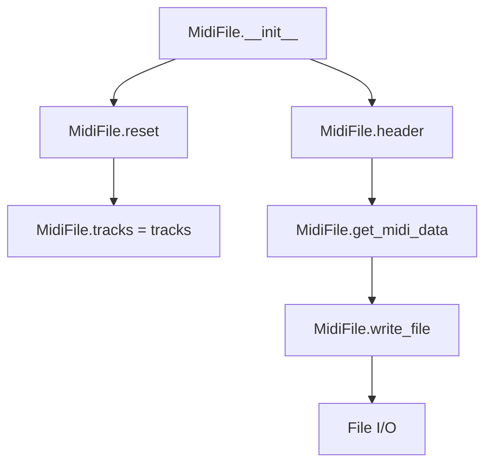
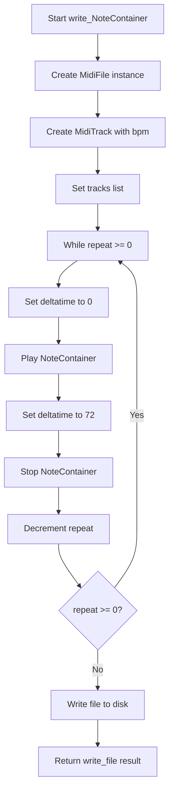
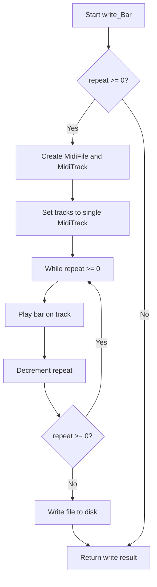

# `midi_file_out.py`

## `mingus.midi.midi_file_out.MidiFile` · *class*

## Summary:
MidiFile represents a container for managing MIDI tracks and generating complete MIDI file data for output.

## Description:
The MidiFile class serves as the main interface for creating MIDI files from musical data. It manages a collection of MidiTrack objects and provides functionality to generate complete MIDI file data including headers and track information. This class is typically instantiated by higher-level components in the mingus library when users want to export musical compositions to MIDI file format.

## State:
- tracks: list of MidiTrack objects, initially empty
- time_division: bytes representing the MIDI time division (default b"\x00\x48" = 72 ticks per beat)

## Lifecycle:
- Creation: Instantiate with optional list of MidiTrack objects; the constructor calls reset() on existing tracks before assigning new ones
- Usage: Call get_midi_data() to generate complete MIDI data, or write_file() to save directly to disk
- Destruction: No explicit cleanup required; relies on Python's garbage collection

## Method Map:


## Raises:
- IOError: When write_file() cannot open or write to the specified file path
- AssertionError: May occur in underlying MidiTrack methods if invalid MIDI parameters are provided

## Example:
```python
# Create a MidiFile with tracks
track1 = MidiTrack()
# ... add notes to track1 ...
midi_file = MidiFile([track1])

# Get MIDI data for further processing
midi_data = midi_file.get_midi_data()

# Write directly to file
midi_file.write_file("output.mid", verbose=True)
```

### `mingus.midi.midi_file_out.MidiFile.__init__` · *method*

## Summary:
Initializes a MidiFile object with optional tracks and resets its internal state.

## Description:
The MidiFile constructor creates a new MIDI file container with an optional list of tracks. It ensures proper initialization by resetting the object's state before setting the provided tracks. This method serves as the primary entry point for creating MidiFile instances and prepares the object for MIDI data processing.

This constructor is designed to provide a clean initialization interface for MIDI file creation. By calling `self.reset()` before assigning tracks, it ensures that any previous state is cleared and that all tracks are in a consistent starting state. This pattern prevents potential issues with leftover data from previous uses of the same MidiFile instance.

## Args:
    tracks (list[MidiTrack], optional): A list of MidiTrack objects representing the tracks to include in the MIDI file. Defaults to an empty list if None is provided.

## Returns:
    None: This method initializes the object and does not return a value.

## Raises:
    None explicitly raised: The constructor itself doesn't raise exceptions, though underlying operations might fail during later processing.

## State Changes:
    Attributes READ: None
    Attributes WRITTEN: 
    - self.tracks: Set to the provided tracks parameter or an empty list
    - self.time_division: Set to b"\x00\x48" (default value from class definition)
    - All tracks in self.tracks: Reset via self.reset() call

## Constraints:
    Preconditions:
    - The tracks parameter should contain valid MidiTrack objects or be None
    - The MidiFile instance should not be in an inconsistent state before calling
    
    Postconditions:
    - self.tracks will contain the provided tracks or an empty list
    - All existing tracks will have been reset to their initial state via self.reset()
    - The MidiFile object will be ready for MIDI data processing

## Side Effects:
    - Calls self.reset() which resets all existing tracks in the tracks list by calling reset() on each track
    - May cause I/O operations when tracks are processed later (not in init)

### `mingus.midi.midi_file_out.MidiFile.get_midi_data` · *method*

## Summary:
Generates complete MIDI file data by combining the file header with processed track data from all non-empty tracks.

## Description:
This method constructs a complete MIDI file by aggregating header information and MIDI data from all tracks that contain actual data. It filters out empty tracks (those with no track_data) and combines them with the standard MIDI file header to produce a complete binary MIDI file structure.

## Args:
    None

## Returns:
    bytes: Complete MIDI file data containing header and all non-empty track data

## Raises:
    None explicitly raised

## State Changes:
    Attributes READ: 
    - self.tracks: Collection of MidiTrack objects
    - self.time_division: Time division setting for the MIDI file
    
    Attributes WRITTEN: 
    - None

## Constraints:
    Preconditions:
    - self.tracks should be a list of MidiTrack objects
    - Each track should have a track_data attribute that can be compared to b""
    - self.header() method should be implemented and return proper MIDI header bytes
    
    Postconditions:
    - Returns valid MIDI file data with proper header structure
    - Only includes tracks with non-empty track_data
    - Result is suitable for writing to a MIDI file

## Side Effects:
    None

### `mingus.midi.midi_file_out.MidiFile.header` · *method*

## Summary:
Constructs and returns the MIDI file header chunk containing metadata about the file format, number of tracks, and time division.

## Description:
This method generates the standard MIDI file header chunk that precedes all MIDI track data in a MIDI file. It counts the non-empty tracks in the MIDI file and encodes this count into the proper binary format for the header. The header follows the standard MIDI specification with a 6-byte header section containing format type and track count, followed by the time division information.

The method is called by `get_midi_data()` during the process of assembling complete MIDI file data for output.

## Args:
    None

## Returns:
    bytes: A byte string representing the complete MIDI header chunk, including:
           - "MThd" header signature
           - Fixed header size (6 bytes)
           - Format type (1 for multiple simultaneous tracks)
           - Track count encoded as 2 bytes
           - Time division information from self.time_division

## Raises:
    None explicitly raised

## State Changes:
    - Attributes READ: self.tracks, self.time_division
    - Attributes WRITTEN: None

## Constraints:
    - Preconditions: self.tracks must be a list of track objects with track_data attributes
    - Postconditions: The returned bytes form a valid MIDI header chunk that can be concatenated with track data

## Side Effects:
    None

### `mingus.midi.midi_file_out.MidiFile.reset` · *method*

## Summary:
Resets all tracks in the MIDI file by clearing their internal data buffers.

## Description:
This method clears the internal state of all tracks in the MIDI file by calling the reset() method on each track. It's primarily used during object initialization to ensure a clean state before adding new content.

## Args:
    None

## Returns:
    None

## Raises:
    None

## State Changes:
    Attributes READ: self.tracks
    Attributes WRITTEN: Each track's track_data and delta_time attributes are reset to empty bytes and null byte respectively

## Constraints:
    Preconditions: self.tracks must be iterable and each item in self.tracks must have a reset() method
    Postconditions: All tracks in self.tracks will have their track_data cleared and delta_time reset to b"\x00"

## Side Effects:
    None

### `mingus.midi.midi_file_out.MidiFile.write_file` · *method*

## Summary:
Writes the MIDI data contained in this MidiFile object to a specified file on disk.

## Description:
This method serializes the MIDI data stored in the MidiFile instance and writes it to a file in binary format. It is designed to be the final step in the MIDI file creation process, taking the constructed MIDI data and persisting it to storage. The method handles file I/O operations with appropriate error handling and can optionally provide verbose feedback about the operation.

## Args:
    file (str): The path to the file where the MIDI data will be written. Must be a valid filesystem path.
    verbose (bool): If True, prints diagnostic information about the write operation including the number of bytes written. Defaults to False.

## Returns:
    bool: True if the file was successfully written, False if either the file could not be opened or an error occurred during the write operation.

## Raises:
    None explicitly raised, but file I/O operations may raise standard Python exceptions like IOError or OSError.

## State Changes:
    Attributes READ: 
    - self.tracks (accessed via get_midi_data())
    - self.time_division (accessed via get_midi_data() and header())

    Attributes WRITTEN: 
    - None (this method does not modify the MidiFile object's state)

## Constraints:
    Preconditions:
    - The MidiFile object must have been properly initialized with tracks
    - The file path must be writable (permissions and directory access must allow writing)
    - The file path must not be None or empty
    
    Postconditions:
    - The file at the specified path will contain valid MIDI data if the method returns True
    - The MidiFile object remains unchanged after the operation

## Side Effects:
    - Performs file I/O operations (opening, writing, closing files)
    - May print diagnostic messages to stdout when verbose=True
    - May raise file system related exceptions if the file cannot be written to

## `mingus.midi.midi_file_out.write_Note` · *function*

## Summary:
Writes a MIDI file containing a single note played for a specified number of repetitions.

## Description:
This function generates a MIDI file that plays a single note with specified timing and repetition parameters. It creates a minimal MIDI structure with a single track and writes the note events to that track. The function is designed to create simple MIDI files for individual notes, useful for testing or basic sound generation.

## Args:
    file (str): Path to the output MIDI file to be created.
    note: A note object containing note information (pitch, channel, velocity).
    bpm (int, optional): Tempo in beats per minute. Defaults to 120.
    repeat (int, optional): Number of times to repeat the note playback. Defaults to 0.
    verbose (bool, optional): If True, prints detailed output about the writing process. Defaults to False.

## Returns:
    bool: True if the file was successfully written, False otherwise.

## Raises:
    None explicitly raised in the function body, but underlying file operations may raise IOError or other file-related exceptions.

## Constraints:
    Preconditions:
    - The note parameter must be a valid note object with appropriate attributes (channel, velocity).
    - The repeat parameter should be non-negative integer.
    - The file path must be writable.
    
    Postconditions:
    - A valid MIDI file is created at the specified location if successful.
    - The MIDI file contains the note played according to the specified parameters.

## Side Effects:
    - Creates a file on disk at the specified file path.
    - May print messages to stdout if verbose=True.
    - Opens and closes a file handle during execution.

## Control Flow:
```mermaid
flowchart TD
    A[Start write_Note] --> B[Create MidiFile instance]
    B --> C[Create MidiTrack with bpm]
    C --> D[Set tracks list]
    D --> E{repeat >= 0?}
    E -->|True| F[Set deltatime to 0]
    F --> G[Play note]
    G --> H[Set deltatime to 72 (0x48)]
    H --> I[Stop note]
    I --> J[Decrement repeat]
    J --> K{repeat >= 0?}
    K -->|True| E
    K -->|False| L[Write file to disk]
    L --> M[Return write result]
```

## Examples:
    # Basic usage - play a single note
    write_Note("test.mid", note_obj)
    
    # Play a note twice at 140 BPM
    write_Note("test.mid", note_obj, bpm=140, repeat=1)
    
    # Play a note with verbose output
    write_Note("test.mid", note_obj, verbose=True)

## `mingus.midi.midi_file_out.write_NoteContainer` · *function*

## Summary:
Writes a NoteContainer object to a MIDI file with configurable tempo, repetition, and verbosity options.

## Description:
This function creates a MIDI file containing the musical notes represented by a NoteContainer object. It constructs a MidiFile with a single MidiTrack, plays the notes from the container, and optionally repeats the playback sequence. The function handles the complete MIDI file creation process including setting appropriate deltatimes for note onset and offset events.

## Args:
    file (str): Path to the output MIDI file to be created.
    notecontainer (NoteContainer): Container holding the musical notes to be written to the MIDI file.
    bpm (int, optional): Tempo in beats per minute. Defaults to 120.
    repeat (int, optional): Number of times to repeat the note sequence. Defaults to 0 (single playback). Note that when repeat=0, the sequence is played once, and when repeat=n, the sequence is played n+1 times total.
    verbose (bool, optional): Whether to print detailed output during file writing. Defaults to False.

## Returns:
    bool: True if the file was successfully written, False otherwise.

## Raises:
    None explicitly raised, but may raise exceptions from file operations or MIDI data construction.

## Constraints:
    Preconditions:
    - The notecontainer must contain valid Note objects with proper channel and velocity attributes
    - The file path must be writable
    - bpm must be a positive integer
    - repeat must be a non-negative integer
    
    Postconditions:
    - A valid MIDI file is created at the specified file path
    - The MIDI file contains the note sequence from the NoteContainer
    - The file is closed properly after writing

## Side Effects:
    - Creates a new file at the specified file path
    - Writes binary data to disk
    - May print messages to stdout if verbose=True

## Control Flow:


## Examples:
    # Basic usage
    note_container = NoteContainer(['C-4', 'E-4', 'G-4'])
    success = write_NoteContainer('output.mid', note_container)
    
    # With custom tempo and repetition
    success = write_NoteContainer('output.mid', note_container, bpm=140, repeat=2, verbose=True)

## `mingus.midi.midi_file_out.write_Bar` · *function*

## Summary:
Writes a musical bar to a MIDI file with configurable tempo and repetition settings.

## Description:
Creates a MIDI file containing the musical content of a single bar, allowing for tempo specification and repeated playback. This function abstracts the process of converting a Bar container into MIDI data and writing it to disk, making it easy to generate MIDI files from musical bars without dealing with low-level MIDI construction details.

## Args:
    file (str): Path to the output MIDI file to be created
    bar (Bar): A Bar container object containing musical notes and timing information
    bpm (int, optional): Tempo in beats per minute. Defaults to 120
    repeat (int, optional): Number of times to repeat the bar. Defaults to 0 (no repetition)
    verbose (bool, optional): Whether to print detailed output during file writing. Defaults to False

## Returns:
    bool: True if the file was successfully written, False otherwise

## Raises:
    None explicitly raised, but underlying file operations may raise IOError or other file-related exceptions

## Constraints:
    Preconditions:
        - The `file` parameter must be a valid writable file path
        - The `bar` parameter must be a valid Bar container object
        - The `bpm` parameter should be a positive integer
        - The `repeat` parameter should be a non-negative integer
    
    Postconditions:
        - A MIDI file will be created at the specified path with the bar's musical content
        - The file will contain properly formatted MIDI data according to standard MIDI specifications

## Side Effects:
    - Creates a new file at the specified path
    - Writes binary data to the filesystem
    - May print messages to stdout if verbose=True

## Control Flow:


## Examples:
    # Basic usage - write a single bar to a MIDI file
    bar = Bar('C', (4, 4))
    bar.place_notes(NoteContainer([Note('C', 4), Note('E', 4), Note('G', 4)]), 1.0)
    success = write_Bar('output.mid', bar)
    
    # Write with custom tempo and repetition
    success = write_Bar('output.mid', bar, bpm=140, repeat=3, verbose=True)
```

## `mingus.midi.midi_file_out.write_Track` · *function*

## Summary:
Writes a Track object to a MIDI file with optional repetition and tempo control.

## Description:
Converts a Track container into a MIDI file by creating a MidiTrack representation and playing the track data into it. The function supports repeating the track playback multiple times and provides verbose output options.

This function serves as a bridge between the abstract Track container and concrete MIDI file output, encapsulating the process of MIDI conversion and file writing. It is designed to handle the conversion of musical data from the mingus library's Track abstraction into standard MIDI file format.

## Args:
    file (str): Path to the output MIDI file to be created
    track (Track): A Track container object containing musical data to convert to MIDI
    bpm (int, optional): Tempo in beats per minute. Defaults to 120.
    repeat (int, optional): Number of times to repeat the track playback. Defaults to 0.
    verbose (bool, optional): Whether to print detailed output during file creation. Defaults to False.

## Returns:
    bool: True if the file was written successfully, False otherwise.

## Raises:
    None explicitly raised in the function body, but underlying file operations may raise IOError or related exceptions.

## Constraints:
    Preconditions:
    - The file path must be writable
    - The track parameter must be a valid Track object
    - The bpm parameter should be a positive integer
    - The repeat parameter should be a non-negative integer
    
    Postconditions:
    - A MIDI file will be created at the specified path if successful
    - The file will contain the musical data from the track

## Side Effects:
    - Creates a new file at the specified path
    - Writes binary MIDI data to disk
    - May print messages to stdout if verbose=True

## Control Flow:
```mermaid
flowchart TD
    A[Start write_Track] --> B{repeat >= 0?}
    B -- Yes --> C[Create MidiFile]
    C --> D[Create MidiTrack with bpm]
    D --> E[Set MidiFile tracks]
    E --> F[Loop while repeat >= 0]
    F --> G[t.play_Track(track)]
    G --> H[repeat -= 1]
    H --> I{repeat >= 0?}
    I -- Yes --> F
    I -- No --> J[Return m.write_file(file, verbose)]
    J --> K[End]
```

## Examples:
    # Basic usage
    track = Track()
    # ... add bars and notes to track ...
    success = write_Track('output.mid', track)
    
    # With custom tempo and repetition
    success = write_Track('output.mid', track, bpm=140, repeat=2, verbose=True)
    
    # Note: The repeat parameter has a logical issue in the current implementation.
    # When repeat > 0, the loop condition 'repeat >= 0' causes infinite execution.
    # The intended behavior should likely be 'repeat > 0'.

## `mingus.midi.midi_file_out.write_Composition` · *function*

## Summary:
Converts a Composition object into a MIDI file by processing each track and writing the resulting MIDI data to disk.

## Description:
Writes a Composition object to a MIDI file by creating corresponding MIDI tracks, playing each track from the composition into its MIDI counterpart, and then serializing the complete MIDI data to disk. This function handles multi-track compositions and supports repeating the composition multiple times.

## Args:
    file (str): Path to the output MIDI file to be created
    composition: A Composition object containing tracks to be converted to MIDI
    bpm (int, optional): Tempo in beats per minute. Defaults to 120
    repeat (int, optional): Number of times to repeat the composition. Defaults to 0. 
        Note: When repeat=0, the composition is played once. When repeat=n, the composition is played n+1 times total.
    verbose (bool, optional): Whether to print progress information. Defaults to False

## Returns:
    bool: True if the file was successfully written, False otherwise

## Raises:
    None explicitly raised in the function body, but may raise exceptions from file operations or MIDI conversion

## Constraints:
    Preconditions:
        - The composition parameter must be a valid Composition object with a tracks attribute
        - Each track in composition.tracks must be compatible with MidiTrack.play_Track method
        - The file path must be writable
    Postconditions:
        - A MIDI file is created at the specified location
        - The MIDI file contains the musical data from the composition

## Side Effects:
    - Creates a new file at the specified file path
    - Writes binary MIDI data to disk
    - May print messages to stdout if verbose=True

## Control Flow:
```mermaid
flowchart TD
    A[Start write_Composition] --> B{repeat >= 0?}
    B -- Yes --> C[Initialize MidiFile]
    C --> D[Create MidiTracks for each composition track]
    D --> E[Loop while repeat >= 0]
    E --> F[For each composition track]
    F --> G[Play track into corresponding MidiTrack]
    G --> H[Decrement repeat counter]
    H --> I[Return m.write_file(file, verbose)]
    I --> J[End]
    B -- No --> J
```

## Examples:
    # Basic usage
    success = write_Composition("output.mid", my_composition)
    
    # With custom tempo and repetition
    success = write_Composition("output.mid", my_composition, bpm=140, repeat=2, verbose=True)
    
    # Play composition twice (once initially + once more)
    success = write_Composition("output.mid", my_composition, repeat=1)

