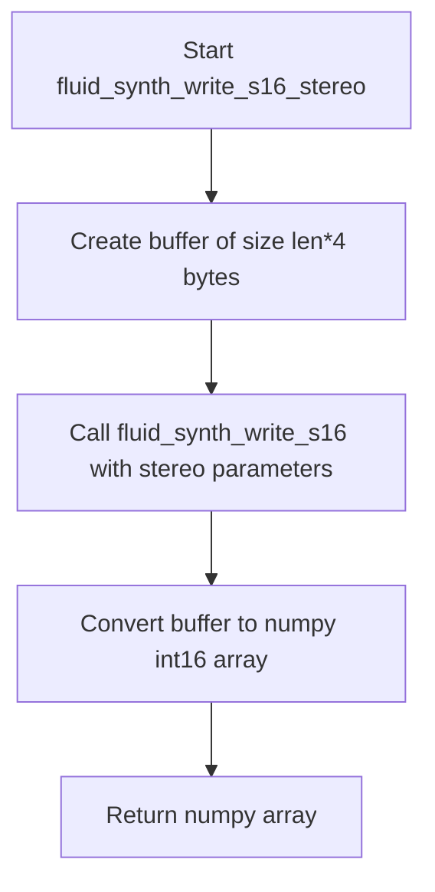

# `pyfluidsynth.py`

## `mingus.midi.pyfluidsynth.cfunc` · *function*

## Summary:
Creates a ctypes function prototype for interfacing with C library functions.

## Description:
A factory function that constructs ctypes function prototypes with specified parameter types and calling conventions. This function is used to create callable interfaces to C library functions, particularly useful for binding to audio libraries like FluidSynth.

## Args:
    name (str): The name of the C function to interface with
    result (type): The return type of the C function
    *args: Variable length argument list where each argument is a tuple describing a parameter with structure [param_name, param_type, param_flag, ...]

## Returns:
    ctypes.CFUNCTYPE: A ctypes function prototype that can be used to create callable C function interfaces

## Raises:
    None explicitly raised in the function body

## Constraints:
    Preconditions:
    - The `_fl` variable must be defined in the module scope (likely a library handle)
    - Each arg in *args must be a tuple with at least 3 elements: [param_name, param_type, param_flag]
    
    Postconditions:
    - Returns a properly configured ctypes.CFUNCTYPE object ready for use with ctypes

## Side Effects:
    None - This function only creates a function prototype, it doesn't perform any I/O or state changes

## Control Flow:
```mermaid
flowchart TD
    A[Start cfunc] --> B{Process args}
    B --> C[Extract atypes and aflags]
    C --> D[Create CFUNCTYPE with result and atypes]
    D --> E[Return CFUNCTYPE with (name,_fl) and aflags]
```

## Examples:
```python
# Typical usage would be:
# cfunc("fluid_synth_noteon", c_int, ("synth", c_void_p, 1), ("channel", c_int, 1))

# This creates a function prototype for a C function that:
# - Takes a synth pointer and channel integer as parameters
# - Returns an integer
# - Uses standard calling convention
```

## `mingus.midi.pyfluidsynth.fluid_synth_write_s16_stereo` · *function*

## Summary:
Generates stereo 16-bit signed integer audio samples from a FluidSynth synthesizer instance.

## Description:
This function produces stereo audio data by calling the underlying FluidSynth synthesis engine and converting the raw byte data into a numpy array of 16-bit signed integers. It's designed to provide a convenient interface for extracting stereo audio samples from a synthesizer for further processing or playback.

The function internally allocates a buffer and calls fluid_synth_write_s16 with parameters configured for stereo output (left and right channels interleaved).

## Args:
    synth: FluidSynth synthesizer instance used to generate audio
    len: Number of stereo frames to generate (each frame contains two 16-bit samples - left and right channels)

## Returns:
    numpy.ndarray: 1D array of int16 values representing stereo audio samples, where consecutive pairs represent left/right channel samples for each frame.

## Raises:
    None explicitly documented in source code

## Constraints:
    Preconditions:
    - synth must be a valid FluidSynth synthesizer instance
    - len must be a positive integer representing number of stereo frames to generate
    
    Postconditions:
    - Returns a numpy array of int16 values with length equal to 2 * len (since each frame contains 2 samples for stereo)
    - Audio data is generated using the current synthesizer state and settings

## Side Effects:
    None explicitly documented in source code

## Control Flow:


## Examples:
```python
# Generate 1024 stereo frames of audio
synth = create_fluid_synth()  # Assume this exists
audio_samples = fluid_synth_write_s16_stereo(synth, 1024)
print(f"Generated {len(audio_samples)} 16-bit samples")
# Result: array of 2048 int16 values (1024 frames × 2 channels)
```

## `mingus.midi.pyfluidsynth.str_binary` · *function*

## Summary:
Converts text strings to bytes while preserving binary data, for Python 2/3 compatibility.

## Description:
This utility function ensures proper string encoding for cross-version Python compatibility. It detects if the input is a text type (unicode in Python 2, str in Python 3) and encodes it to bytes using the default encoding. When the input is already bytes, it returns it unchanged. This function is commonly used when interfacing with C libraries or systems requiring byte data.

## Args:
    s (Union[str, bytes]): Input string that may be either text (str/unicode) or bytes. In Python 2, this would be unicode; in Python 3, this would be str.

## Returns:
    bytes: If input was a text type, returns the encoded bytes representation. If input was already bytes, returns it unchanged.

## Raises:
    UnicodeEncodeError: If the text string cannot be encoded using the default encoding.

## Constraints:
    Preconditions: Input must be either a text string or bytes object.
    Postconditions: Output is always bytes if input was text, or unchanged if input was already bytes.

## Side Effects:
    None

## Control Flow:
```mermaid
flowchart TD
    A[Input s] --> B{isinstance(s, six.text_type)?}
    B -- Yes --> C[s.encode()]
    B -- No --> D[s]
    C --> E[Return bytes]
    D --> E
```

## Examples:
    >>> str_binary("hello")
    b'hello'
    >>> str_binary(b"hello")
    b'hello'
    >>> str_binary(u"hello")
    b'hello'

## `mingus.midi.pyfluidsynth.Synth` · *class*

*No documentation generated.*

### `mingus.midi.pyfluidsynth.Synth.__init__` · *method*

## Summary:
Initializes a FluidSynth synthesizer with configurable audio parameters and sets up the underlying audio synthesis engine.

## Description:
This method configures and initializes a FluidSynth synthesizer instance by creating the necessary settings structure, setting audio parameters like gain and sample rate, and establishing the core synthesizer object. It prepares the object for MIDI playback by setting up the underlying FluidSynth C library components.

## Args:
    gain (float): Audio gain level for the synthesizer output. Defaults to 0.2.
    samplerate (int): Audio sample rate in Hz. Defaults to 44100.

## Returns:
    None: This method initializes instance attributes but does not return a value.

## Raises:
    None explicitly raised in the code shown.

## State Changes:
    Attributes READ: None
    Attributes WRITTEN: 
        - self.settings: Stores the FluidSynth settings structure
        - self.synth: Stores the FluidSynth synthesizer instance
        - self.audio_driver: Initialized to None

## Constraints:
    Preconditions: 
        - The FluidSynth C library must be properly installed and accessible
        - The ctypes library must be able to load the FluidSynth shared library
    Postconditions:
        - self.settings contains a valid FluidSynth settings structure
        - self.synth contains a valid FluidSynth synthesizer instance
        - self.audio_driver is initialized to None

## Side Effects:
    - Creates and initializes C-level FluidSynth objects through ctypes bindings
    - May trigger loading of the FluidSynth shared library if not already loaded

### `mingus.midi.pyfluidsynth.Synth.start` · *method*

## Summary:
Configures and initializes the audio driver for MIDI synthesis within the fluidsynth engine.

## Description:
This method sets up the audio driver for the synthesizer instance, allowing it to output audio. It accepts an optional driver parameter to specify which audio system to use, and then creates an audio driver instance that connects the synth settings to the actual audio output system. This method is typically called after initializing the Synth object and before beginning MIDI playback.

## Args:
    driver (str, optional): Audio driver name to use for audio output. Must be one of: 'alsa', 'oss', 'jack', 'portaudio', 'sndmgr', 'coreaudio', 'Direct Sound', 'dsound', 'pulseaudio'. If None, uses the default audio driver configured in the system.

## Returns:
    None: This method does not return any value.

## Raises:
    AssertionError: When the driver parameter is provided but is not one of the supported audio driver names.

## State Changes:
    Attributes READ: self.settings, self.synth
    Attributes WRITTEN: self.audio_driver

## Constraints:
    Preconditions: The Synth object must be initialized with valid settings and synth instances.
    Postconditions: The self.audio_driver attribute will be set to a new fluid audio driver instance, or remain None if no driver was specified.

## Side Effects:
    Creates a new audio driver instance via C library call to new_fluid_audio_driver.
    May configure audio system settings via C library call to fluid_settings_setstr.

### `mingus.midi.pyfluidsynth.Synth.delete` · *method*

## Summary:
Cleans up fluidsynth resources including audio driver, synthesizer, and settings.

## Description:
This method performs proper cleanup of all fluidsynth resources managed by the Synth instance. It should be called before the object is destroyed to prevent memory leaks. The method safely handles cases where some resources may not have been initialized.

## Args:
    None

## Returns:
    None

## Raises:
    None explicitly raised

## State Changes:
    Attributes READ: self.audio_driver, self.synth, self.settings
    Attributes WRITTEN: None

## Constraints:
    Preconditions: The Synth object must be in a valid state where these attributes have been initialized
    Postconditions: All fluidsynth resources are freed and the object's attributes are left in a clean state

## Side Effects:
    Calls C library functions that may perform I/O operations to release system resources
    May cause audio driver shutdown if active

### `mingus.midi.pyfluidsynth.Synth.sfload` · *method*

## Summary:
Loads a SoundFont file into the synthesizer to enable playback of musical notes using the instrument samples defined in that font.

## Description:
This method provides access to the FluidSynth library's soundfont loading functionality. It allows the synthesizer to load SoundFont files (.sf2 extension) which contain sampled instrument sounds that can be played through MIDI messages. The loaded soundfonts become available for use in program selection and note playback operations.

## Args:
    filename (str): Path to the SoundFont file to load. Can be a string or bytes object.
    update_midi_preset (int): Flag indicating whether to update MIDI presets after loading. Defaults to 0 (false).

## Returns:
    int: Return value from the underlying FluidSynth library function, typically indicating success (0) or failure (-1).

## Raises:
    None explicitly documented - behavior depends on underlying FluidSynth library implementation.

## State Changes:
    Attributes READ: self.synth
    Attributes WRITTEN: None directly modified, but indirectly affects synthesizer state

## Constraints:
    Preconditions: 
    - The Synth instance must be properly initialized
    - The filename must point to a valid SoundFont file
    - The file must be readable by the application
    
    Postconditions:
    - The SoundFont is loaded into the synthesizer's memory
    - The soundfont becomes available for program selection and note playback

## Side Effects:
    - File I/O operation to read the SoundFont file
    - Memory allocation for soundfont data in the synthesizer
    - Potential modification of the synthesizer's internal state to include new instrument samples

### `mingus.midi.pyfluidsynth.Synth.sfunload` · *method*

## Summary:
Unloads a soundfont from the synthesizer by its ID.

## Description:
This method removes a previously loaded soundfont from the FluidSynth synthesizer instance. It is the counterpart to the `sfload` method and provides a clean Python interface for managing soundfont resources. This method wraps the underlying C library function `fluid_synth_sfunload`.

## Args:
    sfid (int): The soundfont ID to unload from the synthesizer. This ID should correspond to a previously loaded soundfont.
    update_midi_preset (int, optional): Flag indicating whether to update MIDI presets after unloading. Defaults to 0 (false). When set to 1, MIDI program changes may be updated to reflect the removal.

## Returns:
    int: Status code returned by the underlying FluidSynth C library function. Typically 0 indicates success, while non-zero values indicate errors.

## Raises:
    None explicitly documented - behavior depends on underlying C library implementation.

## State Changes:
    Attributes READ: self.synth
    Attributes WRITTEN: None

## Constraints:
    Preconditions: 
    - The soundfont ID (`sfid`) must correspond to a previously loaded soundfont
    - The synthesizer must be properly initialized
    - The `sfid` parameter should be a valid integer identifier returned by a previous `sfload` call
    
    Postconditions:
    - The specified soundfont is removed from the synthesizer's memory
    - Resources associated with the soundfont are freed
    - If `update_midi_preset` is set, MIDI program mappings may be adjusted

## Side Effects:
    - Calls into the FluidSynth C library
    - May modify internal state of the FluidSynth synthesizer instance
    - Potential I/O operations when freeing soundfont resources

### `mingus.midi.pyfluidsynth.Synth.program_select` · *method*

## Summary:
Selects a soundfont program for a MIDI channel by specifying the SoundFont ID, bank, and preset numbers.

## Description:
This method configures a MIDI channel to use a specific soundfont program by setting the SoundFont ID, bank number, and preset number. It serves as a wrapper around the FluidSynth C library's fluid_synth_program_select function, allowing fine-grained control over which soundfont program is assigned to a particular MIDI channel.

The method is typically called during MIDI synthesis setup or when changing instrument sounds for specific channels. It's part of the standard MIDI soundfont programming workflow where each channel can be assigned to a specific soundfont program.

## Args:
    chan (int): The MIDI channel number (typically 0-15) to configure
    sfid (int): The SoundFont ID that identifies which SoundFont to use
    bank (int): The bank number within the SoundFont to select
    preset (int): The preset number within the bank to select

## Returns:
    int: Return value from the underlying FluidSynth C function, typically indicating success (0) or failure (-1)

## Raises:
    None explicitly documented - depends on underlying C library behavior

## State Changes:
    Attributes READ: self.synth
    Attributes WRITTEN: None

## Constraints:
    Preconditions: 
    - The synth instance must be initialized and valid
    - Channel number should be within valid MIDI channel range
    - SoundFont ID, bank, and preset should correspond to valid identifiers in loaded SoundFonts
    
    Postconditions:
    - The specified MIDI channel will be configured to use the selected soundfont program
    - The configuration change takes effect immediately for subsequent MIDI events on that channel

## Side Effects:
    None beyond the internal state changes in the FluidSynth synthesizer instance

### `mingus.midi.pyfluidsynth.Synth.noteon` · *method*

## Summary:
Sends a MIDI note-on message to the synthesizer with validated parameters.

## Description:
This method sends a MIDI note-on event to the FluidSynth synthesizer instance. It validates that the channel, key, and velocity values are within valid MIDI ranges before forwarding the command to the underlying C library. This method is part of the MIDI control interface for the synthesizer.

## Args:
    chan (int): MIDI channel number, must be non-negative (typically 0-15)
    key (int): MIDI note number, must be between 0 and 128 inclusive
    vel (int): MIDI velocity value, must be between 0 and 128 inclusive

## Returns:
    bool: True if the note-on message was successfully sent, False if validation failed

## Raises:
    None explicitly raised, but validation failures return False

## State Changes:
    Attributes READ: self.synth
    Attributes WRITTEN: None

## Constraints:
    Preconditions:
        - Channel number must be non-negative
        - Key must be between 0 and 128 inclusive
        - Velocity must be between 0 and 128 inclusive
    
    Postconditions:
        - If validation passes, the underlying FluidSynth C function is called
        - If validation fails, False is returned without calling the C function

## Side Effects:
    - Calls external C library function fluid_synth_noteon
    - May produce audible sound through the audio driver if properly configured

### `mingus.midi.pyfluidsynth.Synth.noteoff` · *method*

## Summary:
Sends a MIDI note off message to the synthesizer for a specific channel and key.

## Description:
This method sends a MIDI note off command to the FluidSynth synthesizer instance. It validates the input parameters and then delegates to the underlying FluidSynth C library function. This method is part of the MIDI control interface for managing note events in a synthesizer.

## Args:
    chan (int): MIDI channel number, must be non-negative
    key (int): MIDI note number, must be between 0 and 128 inclusive

## Returns:
    bool: True if the operation succeeds, False if validation fails (invalid key or negative channel)

## Raises:
    None explicitly raised, but may raise exceptions from underlying C library if called incorrectly

## State Changes:
    Attributes READ: self.synth
    Attributes WRITTEN: None

## Constraints:
    Preconditions: 
    - Channel number must be non-negative
    - Key must be between 0 and 128 inclusive
    Postconditions:
    - If validation passes, the underlying FluidSynth library is called with the parameters
    - If validation fails, False is returned immediately

## Side Effects:
    Calls to FluidSynth C library function fluid_synth_noteoff
    May cause audio output changes if the note was currently playing

### `mingus.midi.pyfluidsynth.Synth.pitch_bend` · *method*

## Summary:
Adjusts the pitch of a MIDI channel by applying a pitch bend value to the synthesizer.

## Description:
This method applies a pitch bend value to a specified MIDI channel using the underlying fluidsynth library. It serves as a wrapper around the fluid_synth_pitch_bend C function, converting the input value from a signed range to an unsigned representation expected by the library.

## Args:
    chan (int): The MIDI channel number (typically 0-15) to apply pitch bend to.
    val (int): The pitch bend value in the range [-8192, 8191]. Values are converted internally to [0, 16383] by adding 8192.

## Returns:
    The return value of the underlying fluid_synth_pitch_bend function, typically indicating success or failure of the operation.

## Raises:
    This method does not explicitly raise exceptions, but the underlying fluid_synth_pitch_bend function may raise exceptions depending on the fluidsynth library implementation.

## State Changes:
    Attributes READ: self.synth
    Attributes WRITTEN: None

## Constraints:
    Preconditions: 
    - The Synth instance must be initialized and active
    - Channel number should be valid for the MIDI setup (typically 0-15)
    - Pitch bend value should be within the expected signed range [-8192, 8191]
    
    Postconditions:
    - The pitch bend value is applied to the specified MIDI channel
    - The underlying fluidsynth library state is modified accordingly

## Side Effects:
    - Calls the fluidsynth C library function fluid_synth_pitch_bend
    - May cause audio output changes depending on the current soundfont and channel state

### `mingus.midi.pyfluidsynth.Synth.cc` · *method*

## Summary:
Sets a MIDI control change value for a specific channel and controller.

## Description:
This method sends a MIDI Control Change (CC) message to the synthesizer, allowing real-time modification of various synthesis parameters such as volume, pan, modulation, etc. It serves as a wrapper around the FluidSynth C library's fluid_synth_cc function.

## Args:
    chan (int): MIDI channel number (0-15)
    ctrl (int): Control change number (0-127)
    val (int): Control change value (0-127)

## Returns:
    int: Return value from the underlying FluidSynth C function, typically indicating success or failure status

## Raises:
    None explicitly raised - behavior depends on underlying C library implementation

## State Changes:
    Attributes READ: self.synth
    Attributes WRITTEN: None

## Constraints:
    Preconditions: 
    - Channel number should be within valid MIDI channel range (0-15)
    - Control number should be within valid MIDI CC range (0-127)
    - Control value should be within valid MIDI range (0-127)
    
    Postconditions: 
    - The control change message is sent to the FluidSynth synthesizer
    - No changes are made to the Synth object's state beyond the C library call

## Side Effects:
    - Calls the FluidSynth C library function fluid_synth_cc
    - May cause audio synthesis changes depending on the control number and value

### `mingus.midi.pyfluidsynth.Synth.program_change` · *method*

## Summary:
Changes the MIDI program (instrument preset) for a specified channel on the synthesizer.

## Description:
This method sends a MIDI program change message to the synthesizer, selecting a new instrument preset for the specified MIDI channel. It serves as a thin wrapper around the FluidSynth C library's `fluid_synth_program_change` function.

## Args:
    chan (int): The MIDI channel number (typically 0-15) to change the program for.
    prg (int): The program number (preset index) to select (typically 0-127).

## Returns:
    int: The return value from the underlying FluidSynth C library function, typically 0 for success or non-zero for error conditions.

## Raises:
    None explicitly raised, but the underlying C function may raise errors depending on invalid parameters.

## State Changes:
    Attributes READ: self.synth
    Attributes WRITTEN: None

## Constraints:
    Preconditions: 
    - The channel number should be valid for the synthesizer (typically 0-15)
    - The program number should be within the valid range (typically 0-127)
    - The synthesizer must be properly initialized
    
    Postconditions:
    - The specified channel will use the new program/preset
    - The return value indicates success or failure of the operation

## Side Effects:
    - Calls into the FluidSynth C library
    - May affect audio output by changing the instrument sound for the specified channel

### `mingus.midi.pyfluidsynth.Synth.bank_select` · *method*

## Summary:
Sets the bank number for a specified MIDI channel in the fluidsynth synthesizer.

## Description:
Configures the bank selection for a given MIDI channel by delegating to the fluidsynth library's bank selection function. This method provides direct access to the underlying fluidsynth API for bank selection operations, commonly used in MIDI programming to specify which bank of sound fonts to use for program changes.

## Args:
    chan (int): The MIDI channel number to configure the bank for.
    bank (int): The bank number to select.

## Returns:
    int: Return value from the fluid_synth_bank_select C library function.

## Raises:
    None explicitly defined - behavior depends on the underlying fluidsynth library implementation.

## State Changes:
    Attributes READ: self.synth
    Attributes WRITTEN: None - modifies internal state of the fluidsynth engine indirectly

## Constraints:
    Preconditions:
    - The synth instance must be properly initialized
    - Channel and bank parameters should be valid integers for the fluidsynth library
    
    Postconditions:
    - The specified MIDI channel's bank setting is updated in the fluidsynth engine

## Side Effects:
    - Calls the fluidsynth C library function fluid_synth_bank_select
    - May affect subsequent program selection behavior on the specified channel

### `mingus.midi.pyfluidsynth.Synth.sfont_select` · *method*

## Summary:
Assigns a soundfont to a specific MIDI channel in the synthesizer.

## Description:
This method selects a previously loaded soundfont (identified by sfid) for use with a specific MIDI channel. This enables different channels to play notes using different soundfonts, supporting polyphonic playback with varied instrument sounds. The method acts as a thin wrapper around the FluidSynth C library function fluid_synth_sfont_select.

This method is typically called after loading a soundfont with sfload() and before playing notes on a specific channel that should use that soundfont. It's part of the standard FluidSynth soundfont management workflow.

## Args:
    chan (int): MIDI channel number (typically 0-15) to assign the soundfont to.
    sfid (int): Soundfont ID returned by the sfload() method.

## Returns:
    int: Return value from the underlying FluidSynth library function. The exact semantics depend on the FluidSynth implementation.

## Raises:
    None explicitly documented - behavior depends on underlying FluidSynth library implementation.

## State Changes:
    Attributes READ: self.synth
    Attributes WRITTEN: None - modifies internal FluidSynth state indirectly

## Constraints:
    Preconditions: 
    - The synth instance must be initialized and valid
    - The channel number must be valid (typically 0-15)
    - The sfid must correspond to a previously loaded soundfont
    - The underlying FluidSynth library must be properly initialized

    Postconditions:
    - The specified MIDI channel will use the selected soundfont for subsequent note playback
    - The operation result is returned as an integer status code

## Side Effects:
    - Calls into the FluidSynth C library
    - Modifies internal state of the FluidSynth synthesizer instance
    - May affect audio output when notes are played on the specified channel

### `mingus.midi.pyfluidsynth.Synth.program_reset` · *method*

## Summary:
Resets program (instrument) settings for all MIDI channels to their default state.

## Description:
This method resets the program (instrument) selection for all MIDI channels back to their default values. It serves as a wrapper around the FluidSynth C library function `fluid_synth_program_reset`, which performs the actual reset operation on the synthesizer instance.

## Args:
    None

## Returns:
    The return value is determined by the underlying FluidSynth C library function `fluid_synth_program_reset`. Typically, this returns an integer status code indicating success (0) or failure (-1).

## Raises:
    None explicitly documented, but the underlying C function may raise exceptions if the synthesizer instance is invalid or if there are system errors during the reset operation.

## State Changes:
    Attributes READ: self.synth
    Attributes WRITTEN: None (this method doesn't modify object attributes directly)

## Constraints:
    Preconditions: The Synth instance must be properly initialized with a valid synthesizer instance (`self.synth` must not be None)
    Postconditions: All MIDI channels will have their program (instrument) settings reset to defaults

## Side Effects:
    Calls the FluidSynth C library function `fluid_synth_program_reset`
    May cause temporary audio glitches during reset operation

### `mingus.midi.pyfluidsynth.Synth.system_reset` · *method*

## Summary:
Resets the synthesizer system to its initial state, clearing all MIDI state and restoring default configuration.

## Description:
This method performs a complete system reset on the FluidSynth synthesizer instance, returning it to its initial state as if newly created. It clears all active notes, resets MIDI channel states, and restores default synthesizer settings. This method is typically used to cleanly reset the synthesizer before loading new soundfonts or starting fresh playback sessions.

## Args:
    None

## Returns:
    The return value depends on the underlying C library function `fluid_synth_system_reset`. Typically, this returns an integer status code indicating success (0) or failure (non-zero).

## Raises:
    None explicitly raised, though the underlying C function may raise errors depending on the state of the synthesizer instance.

## State Changes:
    Attributes READ: self.synth
    Attributes WRITTEN: None

## Constraints:
    Preconditions: The synthesizer instance (`self.synth`) must be properly initialized and not deleted.
    Postconditions: The synthesizer state is reset to initial conditions, with all MIDI channels cleared and default settings restored.

## Side Effects:
    None beyond the internal state changes of the FluidSynth synthesizer instance.

### `mingus.midi.pyfluidsynth.Synth.get_samples` · *method*

## Summary:
Generates stereo audio samples from the synthesizer as a numpy array of 16-bit integers.

## Description:
This method produces audio samples by calling the underlying fluidsynth library function that writes stereo 16-bit samples to a buffer. It's typically used to generate audio data for playback or processing in real-time applications.

## Args:
    len (int): Number of sample frames to generate. Defaults to 1024.

## Returns:
    numpy.ndarray: Array of 16-bit signed integers representing stereo audio samples. The array contains interleaved left and right channel samples.

## Raises:
    None explicitly raised, but underlying fluidsynth functions may raise exceptions if invalid parameters are passed.

## State Changes:
    Attributes READ: self.synth
    Attributes WRITTEN: None

## Constraints:
    Preconditions: The synth instance must be properly initialized and the underlying fluidsynth library must be available.
    Postconditions: Returns a numpy array containing the requested number of stereo sample frames.

## Side Effects:
    Calls into the fluidsynth C library which may perform I/O operations for audio generation.

## `mingus.midi.pyfluidsynth.raw_audio_string` · *function*

## Summary:
Converts audio data to a raw binary string format using 16-bit signed integers.

## Description:
This function takes input audio data and converts it to a raw binary string representation. It performs two key operations: first casting the data to 16-bit signed integers (int16), then converting it to a binary string format. This is typically used in audio processing contexts where raw binary audio data is required for output to audio devices or file formats.

## Args:
    data (array-like): Input audio data that supports numpy array conversion and the astype() method for int16 conversion.

## Returns:
    bytes: Binary string representation of the audio data in 16-bit signed integer format.

## Raises:
    AttributeError: If the input data does not have the required numpy methods (astype, tostring).
    TypeError: If the input data cannot be properly converted to numpy array or cast to int16.

## Constraints:
    Preconditions:
        - Input data must be compatible with numpy array conversion
        - Input data must support the astype() method for int16 conversion
        - Input data must support the tostring() method for binary conversion
    Postconditions:
        - Output is a bytes object containing 16-bit signed integer values
        - The exact byte order depends on the system's native byte order

## Side Effects:
    None

## Control Flow:
```mermaid
flowchart TD
    A[Start raw_audio_string] --> B[Convert data to numpy array]
    B --> C[Cast to int16 using astype()]
    C --> D[Convert to binary string using tostring()]
    D --> E[Return bytes]
```

## Examples:
```python
# Basic usage with list of numbers
audio_data = [0.5, -0.3, 0.8, -0.1]
raw_string = raw_audio_string(audio_data)
# Returns bytes representing the audio data in int16 format

# Usage with numpy array
import numpy as np
audio_array = np.array([0.1, -0.2, 0.3])
raw_string = raw_audio_string(audio_array)
# Returns bytes representing the audio data in int16 format
```

