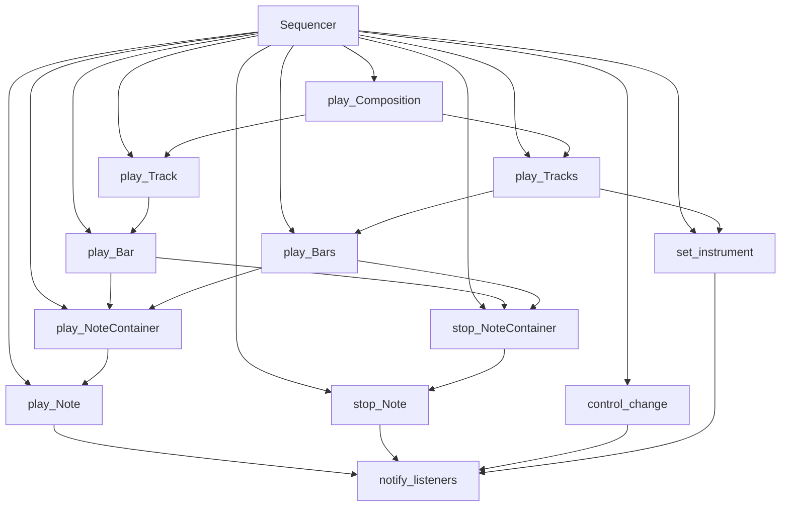

# `sequencer.py`

## `mingus.midi.sequencer.Sequencer` · *class*

## Summary:
A MIDI sequencer that manages playback of musical elements including notes, bars, tracks, and compositions.

## Description:
The Sequencer class provides a framework for playing musical sequences through MIDI events. It handles note playback, instrument control, and timing for complex musical structures like bars, tracks, and compositions. The class follows a listener pattern where interested parties can register to receive notifications about sequencing events.

This class serves as the core interface for MIDI playback operations in the mingus library, abstracting away the complexity of timing and event management while providing hooks for custom implementations through the abstract methods.

## State:
- listeners: list of objects that will be notified of sequencing events
- output: class attribute representing the MIDI output device (currently None)
- Message constants: Various integer constants defining message types for event notifications

## Lifecycle:
- Creation: Instantiate with `Sequencer()` constructor, which initializes an empty listeners list and calls the init() method
- Usage: Call methods like `play_Note()`, `play_Bar()`, `play_Track()`, or `play_Composition()` to initiate playback
- Destruction: No explicit cleanup required; relies on Python garbage collection

## Method Map:


## Raises:
- None explicitly raised by __init__
- control_change returns False for invalid control/value ranges (0-128) rather than raising exceptions

## Example:
```python
# Create a sequencer instance
seq = Sequencer()

# Play a single note
seq.play_Note(60, channel=1, velocity=100)  # Play middle C

# Stop the note
seq.stop_Note(60, channel=1)

# Play a bar of music
# (requires proper bar structure)
# seq.play_Bar(bar, channel=1, bpm=120)

# Set instrument
seq.set_instrument(1, 1)  # Set channel 1 to piano

# Control volume
seq.main_volume(1, 64)  # Set volume to mid-level
```

### `mingus.midi.sequencer.Sequencer.__init__` · *method*

## Summary:
Initializes a Sequencer instance by setting up an empty listeners list and performing base initialization.

## Description:
This method serves as the constructor for the Sequencer class, establishing the initial state of the sequencer object. It creates an empty list for event listeners and invokes the base initialization method to prepare the sequencer for MIDI operations.

## Args:
    None

## Returns:
    None

## Raises:
    None

## State Changes:
    Attributes READ: None
    Attributes WRITTEN: 
    - self.listeners: Initialized to an empty list
    - self.init(): Called to perform base initialization

## Constraints:
    Preconditions: None
    Postconditions: The sequencer object is initialized with an empty listeners list and base initialization completed

## Side Effects:
    None

### `mingus.midi.sequencer.Sequencer.init` · *method*

## Summary:
Initializes the sequencer's internal state and prepares it for MIDI playback operations.

## Description:
This method serves as a placeholder for initialization logic that should be implemented by subclasses. It is automatically called during the Sequencer's initialization process and provides a hook for backend-specific setup operations such as initializing MIDI drivers, setting up audio contexts, or configuring hardware interfaces.

## Args:
    self: The Sequencer instance being initialized.

## Returns:
    None: This method does not return any value.

## Raises:
    None: This method does not raise any exceptions.

## State Changes:
    Attributes READ: None
    Attributes WRITTEN: None

## Constraints:
    Preconditions: The Sequencer instance must be properly instantiated before calling this method.
    Postconditions: The sequencer's internal state is initialized and ready for MIDI operations.

## Side Effects:
    None: This base implementation performs no side effects. Subclasses may implement side effects such as opening MIDI ports, initializing audio drivers, or connecting to hardware devices.

### `mingus.midi.sequencer.Sequencer.play_event` · *method*

## Summary:
Plays a MIDI note event by sending the note, channel, and velocity to the MIDI output device.

## Description:
This method serves as an abstract interface for playing MIDI note events. It is intended to be overridden by subclasses to implement actual MIDI output functionality. The method sends a note-on message to the MIDI output device with the specified note, channel, and velocity parameters.

## Args:
    note (int): The MIDI note number (0-127) to play
    channel (int): The MIDI channel number (0-15) to play the note on
    velocity (int): The velocity (0-127) indicating note attack strength

## Returns:
    None: This method does not return a value

## Raises:
    None: This base implementation does not raise any exceptions

## State Changes:
    Attributes READ: None
    Attributes WRITTEN: None

## Constraints:
    Preconditions: 
    - note must be an integer between 0 and 127 (inclusive)
    - channel must be an integer between 0 and 15 (inclusive)  
    - velocity must be an integer between 0 and 127 (inclusive)
    
    Postconditions: 
    - The MIDI output device receives a note-on message for the specified note, channel, and velocity
    - No changes are made to the Sequencer object's state

## Side Effects:
    I/O: Writes MIDI data to the MIDI output device via the sequencer's output property
    External service calls: Depends on underlying MIDI implementation in subclasses

### `mingus.midi.sequencer.Sequencer.stop_event` · *method*

## Summary:
Stops a MIDI note event on a specific channel by sending the appropriate MIDI stop message.

## Description:
This method serves as an abstract interface for stopping MIDI note events on a given channel. It is designed to be overridden by subclasses to provide actual MIDI communication functionality. The method is called internally by the `stop_Note` method to perform the low-level MIDI stop operation. It follows the same pattern as other event handler methods in the Sequencer class (`play_event`, `cc_event`, `instr_event`) but implements the stop rather than start functionality.

## Args:
    note (int): The MIDI note number to stop (typically in range 0-127)
    channel (int): The MIDI channel number (typically in range 0-15)

## Returns:
    None: This method does not return any value

## Raises:
    None: This method does not explicitly raise exceptions

## State Changes:
    Attributes READ: 
    - self.listeners (used for notification)
    - self.MSG_STOP_INT (constant for stop message type)
    - self.MSG_STOP_NOTE (constant for stop note message type)

    Attributes WRITTEN: 
    - No direct attribute modifications

## Constraints:
    Preconditions:
    - The note parameter should represent a valid MIDI note number (0-127)
    - The channel parameter should represent a valid MIDI channel (0-15)
    - The Sequencer instance must be properly initialized
    - This method should be implemented by subclasses to provide actual MIDI functionality

    Postconditions:
    - The MIDI stop command should be sent for the specified note on the specified channel
    - Listeners are notified of the stop event via `notify_listeners` method

## Side Effects:
    - Sends MIDI stop commands to the underlying MIDI output system (implementation-dependent)
    - Notifies attached listeners about the stop event
    - May involve I/O operations to communicate with MIDI hardware/software

### `mingus.midi.sequencer.Sequencer.cc_event` · *method*

## Summary:
Processes MIDI Control Change events by handling channel, control number, and value parameters for concrete MIDI output implementations.

## Description:
This method serves as an abstract interface for handling MIDI Control Change (CC) events within the sequencer framework. It is designed to be overridden by concrete subclasses to implement specific MIDI output behavior for Control Change messages. When called, it receives MIDI channel, control number, and control value parameters and processes them according to the specific MIDI implementation.

The method is invoked internally by the `control_change()` method after parameter validation, making it part of the standard MIDI CC event processing pipeline in the sequencer system.

## Args:
    channel (int): MIDI channel number (typically 0-15)
    control (int): Control change number (0-127)
    value (int): Control change value (0-127)

## Returns:
    None: This method does not return a value

## Raises:
    None: This method does not explicitly raise exceptions

## State Changes:
    Attributes READ: None
    Attributes WRITTEN: None

## Constraints:
    Preconditions: 
    - Channel should be a valid MIDI channel (typically 0-15)
    - Control should be a valid MIDI control number (0-127)
    - Value should be a valid MIDI control value (0-127)
    - These validations are performed by the calling `control_change()` method
    
    Postconditions: 
    - The method is called as part of the control_change() workflow
    - The method should process the CC event appropriately for the concrete implementation

## Side Effects:
    None: This method is intended to be overridden by subclasses that may perform I/O operations or communicate with MIDI devices. Concrete implementations may produce MIDI output or interact with MIDI hardware/software synthesizers.

### `mingus.midi.sequencer.Sequencer.instr_event` · *method*

## Summary:
Sets the instrument for a specific MIDI channel with optional bank selection.

## Description:
This method handles the low-level MIDI event for changing instruments on a given channel. It is called by the `set_instrument` method and should be implemented by subclasses to send the appropriate MIDI program change commands. The method allows for both instrument selection and bank switching through the bank parameter.

## Args:
    channel (int): The MIDI channel number (typically 0-15) to set the instrument on.
    instr (int): The MIDI instrument/program number to select.
    bank (int): The MIDI bank number for bank switching (default is 0).

## Returns:
    None: This method does not return a value.

## Raises:
    None: This method does not explicitly raise exceptions, though subclasses may raise errors related to MIDI device communication.

## State Changes:
    Attributes READ: None
    Attributes WRITTEN: None

## Constraints:
    Preconditions: 
    - Channel should be a valid MIDI channel number (typically 0-15)
    - Instrument should be a valid MIDI program number
    - Bank should be a valid MIDI bank number
    
    Postconditions:
    - The instrument on the specified channel is changed according to the MIDI protocol
    - Subclasses should ensure proper MIDI message formatting and transmission

## Side Effects:
    - Sends MIDI commands to the underlying MIDI output device
    - May involve I/O operations with MIDI hardware or software synthesizer

### `mingus.midi.sequencer.Sequencer.sleep` · *method*

## Summary:
Pauses execution for the specified number of seconds to synchronize musical events in a MIDI sequencer.

## Description:
The sleep method introduces a time delay in the sequencer's playback, allowing musical notes and events to be properly spaced according to their timing requirements. This method is essential for creating accurate musical timing in MIDI playback systems.

## Args:
    seconds (float): The number of seconds to pause execution. Must be non-negative.

## Returns:
    None: This method does not return any value.

## Raises:
    None: This method does not explicitly raise exceptions.

## State Changes:
    Attributes READ: None
    Attributes WRITTEN: None

## Constraints:
    Preconditions: The seconds parameter must be a non-negative number.
    Postconditions: Execution is paused for exactly the specified number of seconds.

## Side Effects:
    I/O: This method likely performs I/O operations to implement the time delay.
    External service calls: May involve system-level timing functions.
    Mutations to objects outside self: None

### `mingus.midi.sequencer.Sequencer.attach` · *method*

## Summary:
Adds a listener to the sequencer's notification list if it's not already registered.

## Description:
Registers a listener object to receive notifications from the sequencer when MIDI events occur. This implements the observer pattern where the sequencer maintains a collection of listeners that are notified of various MIDI events such as note plays, stops, control changes, and instrument updates.

The method ensures no duplicate listeners are added to the internal listeners list. This prevents potential issues with multiple notifications being sent to the same listener.

## Args:
    listener: An object that implements a `notify(msg_type, params)` method. The listener will receive event notifications from the sequencer.

## Returns:
    None

## Raises:
    None

## State Changes:
    Attributes READ: self.listeners
    Attributes WRITTEN: self.listeners

## Constraints:
    Preconditions: The listener parameter must be a valid object that implements a notify method
    Postconditions: The listener will be present in self.listeners if it was not already there

## Side Effects:
    None

### `mingus.midi.sequencer.Sequencer.detach` · *method*

## Summary:
Removes a listener from the sequencer's notification system.

## Description:
Detaches a listener from the sequencer so that it will no longer receive notifications when sequencer events occur. This method implements the observer pattern by removing the specified listener from the internal listeners list.

## Args:
    listener: The listener object to be removed from the sequencer's notification system. Must be an object that has a `notify` method.

## Returns:
    None

## Raises:
    None

## State Changes:
    Attributes READ: self.listeners
    Attributes WRITTEN: self.listeners

## Constraints:
    Preconditions: The listener must be an object that was previously added via the `attach` method.
    Postconditions: The listener will no longer receive notifications from the sequencer, and will be removed from the listeners list if it was present.

## Side Effects:
    None

### `mingus.midi.sequencer.Sequencer.notify_listeners` · *method*

## Summary:
Notifies all registered listeners with a message type and associated parameters.

## Description:
This method broadcasts events to all attached listeners by invoking their notify method with the specified message type and parameters. It serves as the central mechanism for event propagation within the MIDI sequencer system, allowing components to communicate changes in playback state, instrument settings, or other MIDI events to interested observers.

## Args:
    msg_type (int): The type of message being sent, typically one of the predefined MSG_* constants in the Sequencer class.
    params (dict): A dictionary containing event-specific parameters that provide context about the notification.

## Returns:
    None: This method does not return any value.

## Raises:
    AttributeError: If any listener in self.listeners does not implement a notify method.

## State Changes:
    Attributes READ: self.listeners
    Attributes WRITTEN: None

## Constraints:
    Preconditions: 
    - self.listeners must be iterable (list-like structure)
    - Each item in self.listeners must have a notify method
    - msg_type and params should be appropriately formatted for the listeners' notify method
    
    Postconditions:
    - All registered listeners will have their notify method called exactly once per invocation
    - No modifications are made to the Sequencer's internal state

## Side Effects:
    None: This method does not perform I/O operations or modify external state. However, it may cause side effects in listener objects through their notify method invocations.

### `mingus.midi.sequencer.Sequencer.set_instrument` · *method*

## Summary:
Sets the instrument for a specified MIDI channel and notifies attached listeners of the change.

## Description:
Configures a MIDI channel to use a specific instrument. This method is responsible for both updating the internal state of the sequencer and informing any registered listeners about the instrument change. It is commonly used during playback setup to assign instruments to channels before playing musical content.

## Args:
    channel (int): The MIDI channel number (typically 1-16) to assign the instrument to.
    instr (int): The instrument number to assign to the channel.
    bank (int): The MIDI bank number (default: 0) to use for instrument selection. Must be a non-negative integer.

## Returns:
    None: This method does not return any value.

## Raises:
    None: This method does not explicitly raise exceptions, though underlying implementations in subclasses may raise errors related to invalid channel, instrument, or bank numbers.

## State Changes:
    Attributes READ: self.listeners, self.MSG_INSTR
    Attributes WRITTEN: None (modifies internal state through instr_event and notify_listeners calls)

## Constraints:
    Preconditions: 
    - The channel parameter should be a valid MIDI channel number (typically 1-16)
    - The instr parameter should be a valid MIDI instrument number
    - The bank parameter should be a valid MIDI bank number (non-negative integer)
    
    Postconditions:
    - The specified channel will be configured to use the given instrument
    - All attached listeners will be notified of the instrument change via MSG_INSTR message

## Side Effects:
    - Calls the instr_event method which may interact with MIDI hardware or software synthesizer
    - Notifies all registered listeners through the notify_listeners mechanism
    - May cause MIDI messages to be sent to connected devices or software synthesizers

### `mingus.midi.sequencer.Sequencer.control_change` · *method*

## Summary:
Sets a MIDI control change parameter for a specific channel and notifies registered listeners of the change.

## Description:
This method sends a MIDI Control Change message with the specified control number and value to the given channel. It validates that both control and value parameters are within the valid range [0, 128] and returns False if validation fails. The method delegates to the underlying MIDI implementation via cc_event() and notifies all attached listeners of the change through the MSG_CC message type.

Control Change messages are used in MIDI to modify various aspects of sound generation such as volume, pan position, modulation, and other controller parameters. This method serves as the core interface for sending these messages to MIDI devices.

## Args:
    channel (int): The MIDI channel number (typically 0-15)
    control (int): The control number (0-128) specifying which parameter to change
    value (int): The control value (0-128) to set for the specified control

## Returns:
    bool: True if the control change was successfully sent, False if validation failed due to invalid control or value parameters

## Raises:
    None explicitly raised - returns False for invalid parameters instead

## State Changes:
    Attributes READ: None
    Attributes WRITTEN: None

## Constraints:
    Preconditions: 
    - Channel must be a valid integer representing a MIDI channel
    - Control must be an integer in the range [0, 128] inclusive
    - Value must be an integer in the range [0, 128] inclusive
    
    Postconditions:
    - If validation passes, the MIDI control change is sent via cc_event()
    - If validation passes, listeners are notified of the change
    - If validation fails, no MIDI event is sent and no notification occurs

## Side Effects:
    - Calls self.cc_event() to send the actual MIDI control change to the device
    - Calls self.notify_listeners() to broadcast the change to registered observers

### `mingus.midi.sequencer.Sequencer.play_Note` · *method*

## Summary:
Plays a musical note through the MIDI sequencer and notifies registered listeners of the playback event.

## Description:
This method plays a musical note by converting it to MIDI format and sending the appropriate MIDI event. It supports both simple note values (integers) and note objects that may contain additional metadata like velocity and channel information. The method notifies all attached listeners about the note playback using two different message types: MSG_PLAY_INT for integer-based note representation and MSG_PLAY_NOTE for the original note object.

## Args:
    note (int or object): The musical note to play. Can be either an integer representing the MIDI note number or an object with a note attribute. If the note object has velocity or channel attributes, those values override the respective parameters.
    channel (int): The MIDI channel to play the note on. Defaults to 1.
    velocity (int): The velocity (volume) of the note playback. Defaults to 100.

## Returns:
    bool: Always returns True to indicate successful processing.

## Raises:
    None explicitly raised.

## State Changes:
    Attributes READ: None
    Attributes WRITTEN: None

## Constraints:
    Preconditions: 
    - The note parameter must be convertible to an integer
    - Channel must be a valid MIDI channel number (typically 1-16)
    - Velocity must be a valid MIDI velocity value (typically 0-127)
    
    Postconditions:
    - The note is sent to the MIDI output device via play_event with note value incremented by 12
    - Two notification messages are sent to all registered listeners:
      * MSG_PLAY_INT with integer note value (note + 12) 
      * MSG_PLAY_NOTE with original note object
    - The method always returns True

## Side Effects:
    - Calls play_event to send MIDI note-on message to the output device with note value incremented by 12
    - Calls notify_listeners twice to broadcast playback events to registered listeners
    - May modify the internal state of the MIDI output device through play_event

### `mingus.midi.sequencer.Sequencer.stop_Note` · *method*

## Summary:
Stops a MIDI note by sending a stop event and notifying registered listeners of the note stopping.

## Description:
This method handles the stopping of a MIDI note by converting the note to its MIDI representation (adding 12 to the note value), sending a stop event to the underlying MIDI system, and notifying all attached listeners about the note stopping event. It follows a similar pattern to the `play_Note` method but for stopping notes.

## Args:
    note: The note to stop. Can be either an integer representing the MIDI note number or an object with a note attribute.
    channel (int): The MIDI channel to stop the note on. Defaults to 1. If the note object has a channel attribute, this is overridden.

## Returns:
    bool: Always returns True to indicate successful processing of the stop command.

## Raises:
    None explicitly raised. However, underlying implementations may raise exceptions if the MIDI system fails.

## State Changes:
    Attributes READ: 
        - self.MSG_STOP_INT
        - self.MSG_STOP_NOTE
        - self.listeners
    
    Attributes WRITTEN: 
        - None directly modified, but indirectly affects the MIDI state through stop_event calls

## Constraints:
    Preconditions:
        - The note parameter must be convertible to an integer
        - The channel parameter must be convertible to an integer
        - The underlying MIDI system must be initialized and available
        
    Postconditions:
        - The note is stopped in the MIDI system
        - Two listener notifications are sent (one with integer note, one with original note)
        - The method returns True

## Side Effects:
    - Calls the underlying MIDI system's stop_event method
    - Notifies all registered listeners with two different message types
    - May cause I/O operations if the MIDI system requires communication with hardware/software

### `mingus.midi.sequencer.Sequencer.stop_everything` · *method*

## Summary:
Stops all MIDI notes across all available channels by calling stop_Note for each note-channel combination.

## Description:
This method provides a way to immediately halt all currently playing MIDI notes across all 16 channels and 118 possible note values. It systematically calls the stop_Note method for every combination of note number (0-117) and channel (0-15), effectively silencing the entire MIDI output. This is useful for emergency stops or resetting the sequencer state.

## Args:
    None

## Returns:
    None

## Raises:
    None

## State Changes:
    Attributes READ: None
    Attributes WRITTEN: None

## Constraints:
    Preconditions: The Sequencer instance must be initialized and capable of sending MIDI messages
    Postconditions: All notes across all channels will be stopped, though the underlying MIDI system may still be active

## Side Effects:
    Calls the stop_Note method 1888 times (118 notes × 16 channels)
    May trigger MIDI message sending to the output device
    Triggers notification listeners for each stop event

### `mingus.midi.sequencer.Sequencer.play_NoteContainer` · *method*

## Summary:
Plays all notes contained in a NoteContainer using the sequencer's playback mechanism.

## Description:
This method processes a NoteContainer by notifying attached listeners of the playback event, then sequentially plays each note in the container using the sequencer's play_Note method. It serves as a batch playback operation for multiple notes.

## Args:
    nc (NoteContainer or None): The container holding notes to be played. If None, the method returns True immediately.
    channel (int): MIDI channel number to use for playback. Defaults to 1.
    velocity (int): MIDI velocity value for note playback. Defaults to 100.

## Returns:
    bool: True if all notes were successfully played, False if any note failed to play.

## Raises:
    None explicitly raised. However, underlying play_Note method may raise exceptions if note playback fails.

## State Changes:
    Attributes READ: self.listeners, self.MSG_PLAY_NC
    Attributes WRITTEN: None directly modified, but indirectly affects playback state through play_Note calls

## Constraints:
    Preconditions: 
    - The sequencer must be properly initialized
    - Notes in the container must be compatible with the play_Note method
    - Channel must be a valid MIDI channel number
    - Velocity must be a valid MIDI velocity value (0-127)
    
    Postconditions:
    - All notes in the container are played via the sequencer
    - Listeners are notified of the playback event
    - Method returns appropriate success status

## Side Effects:
    - Notifies all registered listeners with MSG_PLAY_NC message
    - Triggers MIDI playback events through play_Note method calls
    - May cause I/O operations through underlying MIDI output mechanisms

### `mingus.midi.sequencer.Sequencer.stop_NoteContainer` · *method*

## Summary:
Stops all notes contained in a NoteContainer and notifies listeners of the stop event.

## Description:
This method is responsible for stopping all notes within a given NoteContainer. It sends a notification to all registered listeners indicating that a NoteContainer stop event has occurred, then iterates through each note in the container and calls the individual stop_Note method for each. This provides a convenient way to stop multiple notes simultaneously while maintaining proper event notification.

## Args:
    nc (NoteContainer or None): The container of notes to stop, or None to indicate no notes to stop
    channel (int): MIDI channel number to use for stopping notes, defaults to 1

## Returns:
    bool: True if all notes were stopped successfully, False if any note failed to stop

## Raises:
    None explicitly raised

## State Changes:
    Attributes READ: self.listeners, self.MSG_STOP_NC
    Attributes WRITTEN: None directly modified

## Constraints:
    Preconditions: 
    - The Sequencer instance must be properly initialized
    - The nc parameter can be None or a valid NoteContainer-like object
    - The channel parameter should be a valid MIDI channel number
    
    Postconditions:
    - All notes in the container will have their stop_Note method called
    - Listeners will be notified of the stop event via notify_listeners
    - The method returns True only if all individual note stops succeed

## Side Effects:
    - Calls notify_listeners with MSG_STOP_NC message type
    - Invokes stop_Note method for each note in the container
    - May cause MIDI events to be sent through the underlying MIDI system

### `mingus.midi.sequencer.Sequencer.play_Bar` · *method*

## Summary:
Plays a musical bar by sequentially executing its NoteContainers with proper timing and BPM adjustments.

## Description:
This method plays a musical bar by iterating through its constituent NoteContainers, playing each one with appropriate timing based on note durations and BPM. It handles dynamic BPM changes within the bar and notifies listeners of playback events. The method is part of the sequencer's playback pipeline and is typically called during composition or track playback.

## Args:
    bar: An iterable of tuples/lists where each element follows the structure (duration, channel, NoteContainer) or similar format, with NoteContainer being the musical notes to play
    channel (int): MIDI channel number to play on, defaults to 1
    bpm (int): Initial beats per minute for playback timing, defaults to 120

## Returns:
    dict: Contains the final BPM value after processing the bar as {"bpm": bpm}, or empty dict {} if play_NoteContainer fails during execution

## Raises:
    None explicitly raised, but may propagate exceptions from underlying methods like play_NoteContainer

## State Changes:
    Attributes READ: None
    Attributes WRITTEN: None

## Constraints:
    Preconditions: 
    - Bar must be iterable with elements that support indexing [1] and [2]
    - Channel must be a valid MIDI channel number
    - BPM must be a positive number
    
    Postconditions:
    - All NoteContainers in the bar are played sequentially
    - Final BPM reflects any changes made during playback
    - Playback timing respects note durations and tempo changes

## Side Effects:
    - Calls external methods: play_NoteContainer, stop_NoteContainer, sleep
    - Notifies listeners of playback events (MSG_PLAY_BAR, MSG_SLEEP)
    - May modify global state through MIDI output

### `mingus.midi.sequencer.Sequencer.play_Bars` · *method*

## Summary:
Plays musical bars (sequences of notes) using MIDI with proper timing and tempo management.

## Description:
This method orchestrates the playback of musical bars by managing note timing, channel assignment, and tempo changes. It processes multiple bars simultaneously, handling note onset and release timing while maintaining proper musical rhythm. The method coordinates with MIDI instruments through channel assignments and updates tempo dynamically when notes specify their own BPM values.

## Args:
    bars (list): List of NoteContainer objects representing musical bars to play
    channels (list): List of MIDI channel numbers corresponding to each bar
    bpm (int, optional): Base beats per minute for playback. Defaults to 120

## Returns:
    dict: Dictionary containing the final BPM value used during playback

## Raises:
    None explicitly raised in the code shown

## State Changes:
    Attributes READ: MSG_PLAY_BARS, MSG_SLEEP
    Attributes WRITTEN: None directly modified, but indirectly affects MIDI state through method calls

## Constraints:
    Preconditions: 
    - Bars must be iterable with NoteContainer objects
    - Channels must match the number of bars
    - Bars must have a length attribute
    - NoteContainer objects must be playable via play_NoteContainer method
    
    Postconditions:
    - All notes in the bars will be played according to their timing
    - Tempo will be updated if any NoteContainer has a bpm attribute
    - Final BPM value reflects any tempo changes that occurred during playback

## Side Effects:
    - Calls play_NoteContainer for each note to be played
    - Calls stop_NoteContainer for notes that finish playing
    - Calls sleep to manage timing between notes
    - Notifies listeners of play events and sleep durations
    - May modify global MIDI state through instrument operations

### `mingus.midi.sequencer.Sequencer.play_Track` · *method*

## Summary:
Plays a sequence of musical bars by sequentially executing each bar with the specified channel and BPM settings.

## Description:
This method orchestrates the playback of a complete musical track by iterating through its constituent bars. It serves as a higher-level interface that coordinates the playback of individual bars while maintaining and updating tempo information throughout the sequence.

## Args:
    track: A sequence of musical bars to be played
    channel (int): MIDI channel number for playback, defaults to 1
    bpm (int): Beats per minute for playback tempo, defaults to 120

## Returns:
    dict: A dictionary containing the final BPM value after playback completes

## Raises:
    None explicitly raised

## State Changes:
    Attributes READ: self.listeners, self.MSG_PLAY_TRACK
    Attributes WRITTEN: None directly modified, but indirectly affects playback state through method calls

## Constraints:
    Preconditions: 
    - The track parameter must be iterable containing musical bars
    - Each bar should be compatible with the play_Bar method
    - Channel must be a valid MIDI channel number
    - BPM must be a positive numeric value
    
    Postconditions:
    - All bars in the track are played sequentially
    - The final BPM value reflects any tempo changes that occurred during playback

## Side Effects:
    - Notifies attached listeners of the playback event via notify_listeners
    - Calls play_Bar for each bar in the track
    - May modify global playback state through MIDI events

### `mingus.midi.sequencer.Sequencer.play_Tracks` · *method*

## Summary:
Plays multiple MIDI tracks simultaneously by setting up instruments and calling play_Bars for each bar.

## Description:
This method orchestrates the playback of multiple MIDI tracks concurrently. It first configures the appropriate instruments for each track's channel, then sequentially plays each bar across all tracks using the existing play_Bars infrastructure. The method handles dynamic BPM changes that may occur during playback and notifies all attached listeners about the playback operation.

## Args:
    tracks (list): A list of MIDI track objects to be played simultaneously
    channels (list): A list of MIDI channels corresponding to each track
    bpm (int, optional): Initial beats per minute for playback. Defaults to 120

## Returns:
    dict: A dictionary containing the final BPM value, or an empty dict if playback is interrupted

## Raises:
    None explicitly raised, but may propagate exceptions from underlying methods

## State Changes:
    Attributes READ: self.listeners, self.MSG_PLAY_TRACKS
    Attributes WRITTEN: None directly modified, but indirectly affects playback state through method calls

## Constraints:
    Preconditions: 
    - tracks list must not be empty
    - tracks and channels lists must have the same length
    - tracks[0] must have a defined length (max_bar calculation)
    - All tracks must have valid instrument attributes
    
    Postconditions:
    - Instruments are set for each channel according to track instruments
    - All tracks are played sequentially from bar 0 to max_bar - 1
    - Final BPM value is returned in result dictionary

## Side Effects:
    - Notifies all registered listeners with MSG_PLAY_TRACKS message
    - Calls set_instrument for each channel to configure instruments
    - Invokes play_Bars method for each bar iteration
    - May modify global playback state through instrument and note events

### `mingus.midi.sequencer.Sequencer.play_Composition` · *method*

## Summary:
Notifies listeners of a composition playback request and delegates to play_Tracks for actual execution.

## Description:
This method serves as a bridge between composition-level playback requests and the underlying track-based playback system. It notifies all registered listeners about the upcoming composition playback with metadata, then delegates the actual playback to the play_Tracks method. This separation allows for proper event notification while maintaining clean code organization.

The method handles automatic channel assignment when no channels are provided by creating a list of sequential channels starting from 1 based on the number of tracks in the composition.

## Args:
    composition: The Composition object containing tracks to be played
    channels (list[int], optional): List of MIDI channels to use for each track. If None, automatically assigns channels starting from 1 based on track count
    bpm (int): Tempo in beats per minute. Defaults to 120

## Returns:
    dict: Dictionary containing the final BPM value after playback completes

## Raises:
    Exception: May propagate exceptions from play_Tracks method if playback fails

## State Changes:
    Attributes READ: self.MSG_PLAY_COMPOSITION, self.listeners
    Attributes WRITTEN: None directly modified

## Constraints:
    Preconditions: 
    - composition must be a valid Composition object with tracks attribute
    - composition.tracks must be iterable and contain valid Track objects
    - channels, when provided, must be a list of integers matching track count
    
    Postconditions:
    - All registered listeners are notified of the playback event
    - The composition's tracks are played sequentially using play_Tracks
    - Returns the final BPM value from play_Tracks execution

## Side Effects:
    - Notifies all registered listeners via notify_listeners method
    - Calls play_Tracks method which may cause MIDI output and timing delays
    - May modify instrument settings through set_instrument calls within play_Tracks

### `mingus.midi.sequencer.Sequencer.modulation` · *method*

## Summary:
Sets the modulation value for a MIDI channel using control change message.

## Description:
This method provides a convenient way to send a MIDI modulation control change message to a specific channel. It wraps the general `control_change` method with a fixed controller number of 1, which corresponds to the standard MIDI modulation controller. This method is typically called during MIDI sequence playback to dynamically modify the sound characteristics of instruments.

## Args:
    channel (int): The MIDI channel number (typically 0-15) to send the modulation message to.
    value (int): The modulation value to set (typically 0-127).

## Returns:
    bool: True if the control change was successfully sent, False if the channel or value parameters were out of valid range (0-127).

## Raises:
    None explicitly raised, but indirectly raises exceptions from the underlying `control_change` method if invalid parameters are provided.

## State Changes:
    Attributes READ: None
    Attributes WRITTEN: None

## Constraints:
    Preconditions: 
    - Channel must be a valid integer representing a MIDI channel (typically 0-15)
    - Value must be an integer between 0 and 127 inclusive
    
    Postconditions:
    - A MIDI control change message with controller 1 is sent to the specified channel
    - The method returns True if successful, False if parameters are invalid

## Side Effects:
    - Sends a MIDI control change message to the connected MIDI output device
    - Notifies registered listeners of the control change event

### `mingus.midi.sequencer.Sequencer.main_volume` · *method*

## Summary:
Sets the main volume for a MIDI channel using controller number 7.

## Description:
This method provides a convenient way to set the main volume for a specific MIDI channel. It is a wrapper around the general-purpose `control_change` method, specifically configured for MIDI controller 7, which is the standard controller for main volume in MIDI specifications.

## Args:
    channel (int): The MIDI channel number (typically 0-15)
    value (int): The volume level (0-127, where 0 is silent and 127 is maximum)

## Returns:
    bool: True if the volume change was successfully processed, False if the channel or value parameters were out of valid range (0-127)

## Raises:
    None explicitly raised, but indirectly raises exceptions through the underlying `control_change` method if validation fails

## State Changes:
    Attributes READ: None
    Attributes WRITTEN: None

## Constraints:
    Preconditions: 
    - Channel must be a valid integer within the range 0-15 (typical MIDI channel range)
    - Value must be an integer within the range 0-127 (standard MIDI volume range)
    
    Postconditions:
    - The volume setting is applied to the specified MIDI channel
    - A control change event is sent to connected MIDI devices
    - Listeners are notified of the control change event

## Side Effects:
    - Sends a MIDI control change message to the connected MIDI output
    - Notifies all registered listeners of the control change event
    - May cause audible changes in the audio output if MIDI devices are connected

### `mingus.midi.sequencer.Sequencer.pan` · *method*

## Summary:
Sets the pan value for a MIDI channel using controller number 10.

## Description:
This method configures the stereo pan position for a specified MIDI channel. It serves as a convenience wrapper around the general `control_change` method, specifically targeting the MIDI pan controller (controller number 10). The pan value determines the spatial positioning of the audio signal between left and right speakers, with 0 representing full left, 64 representing center, and 127 representing full right.

## Args:
    channel (int): The MIDI channel number (typically 0-15) to set the pan for.
    value (int): The pan value to set, ranging from 0 (full left) to 127 (full right), with 64 being center.

## Returns:
    bool: True if the pan change was successfully processed, False if the channel or value parameters were out of valid range (0-127).

## Raises:
    None explicitly raised, but indirectly raises exceptions through the underlying `control_change` method if validation fails.

## State Changes:
    Attributes READ: None
    Attributes WRITTEN: None

## Constraints:
    Preconditions: 
    - Channel must be a valid integer within the MIDI channel range (typically 0-15)
    - Value must be an integer between 0 and 127 inclusive
    
    Postconditions:
    - The pan controller (10) for the specified channel will be updated with the provided value
    - If successful, the change will be sent via MIDI and listeners will be notified

## Side Effects:
    - Calls the underlying `control_change` method which sends MIDI control change messages
    - Notifies registered listeners of the control change event
    - May result in I/O operations to send MIDI messages to the output device

