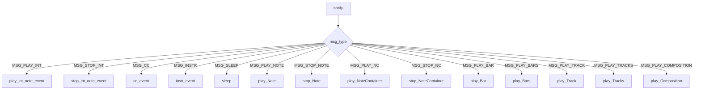

# `sequencer_observer.py`

## `mingus.midi.sequencer_observer.SequencerObserver` · *class*

## Summary:
Base class for receiving MIDI event notifications from a sequencer, implementing a listener pattern for MIDI event handling.

## Description:
The SequencerObserver class serves as an abstract base class that defines a standard interface for receiving notifications about various MIDI events from a Sequencer instance. It implements a listener pattern where concrete implementations can register with a sequencer to receive callbacks when specific MIDI events occur. The class provides a set of abstract methods that must be implemented by subclasses to handle different types of MIDI events such as note playback, control changes, instrument changes, and timing events.

This class is designed to be subclassed rather than instantiated directly, with subclasses implementing the specific event handling logic for their use cases. Subclasses register with a Sequencer instance using the attach() method, and the sequencer automatically calls the appropriate notification methods when MIDI events occur.

## State:
The class has no instance attributes beyond those inherited from object. All state management is handled by subclasses that implement the event handlers.

## Lifecycle:
- Creation: Instances are created by subclassing SequencerObserver and implementing the required event handler methods
- Usage: Subclasses register with a Sequencer instance using the attach() method. When users call sequencer methods like play_Note(), play_Bar(), etc., the sequencer internally notifies all registered listeners by calling their notify() method
- Destruction: No special cleanup is required; standard Python object destruction applies

## Method Map:


## Raises:
The class itself does not raise any exceptions in its base implementation. However, subclasses implementing the event handlers may raise exceptions based on their specific logic.

## Example:
```python
class MyMIDIPlayer(SequencerObserver):
    def play_int_note_event(self, int_note, channel, velocity):
        print(f"Playing note {int_note} on channel {channel} with velocity {velocity}")
    
    def stop_int_note_event(self, int_note, channel):
        print(f"Stopping note {int_note} on channel {channel}")

# Usage
observer = MyMIDIPlayer()
sequencer = Sequencer()
sequencer.attach(observer)
# When users call sequencer methods like sequencer.play_Note(), 
# the observer's methods will be called automatically
```

### `mingus.midi.sequencer_observer.SequencerObserver.play_int_note_event` · *method*

## Summary:
Handles the playback of a MIDI note event represented as an integer value.

## Description:
This method is part of the observer pattern implementation that responds to MIDI note playing events from a sequencer. It is called when the sequencer receives a request to play a note, specifically when the note is represented as an integer value. This is an abstract method that must be implemented by concrete subclasses to perform the actual MIDI playback operation.

The method is invoked by the sequencer's notification system when a `MSG_PLAY_INT` message is received, typically as a result of calling `Sequencer.play_Note()`.

## Args:
    int_note (int): The MIDI note number to play, typically in the range 0-127.
    channel (int): The MIDI channel number, typically in the range 0-15.
    velocity (int): The note velocity (loudness), typically in the range 0-127.

## Returns:
    None: This method does not return a value.

## Raises:
    This method is intended to be implemented by subclasses and may raise exceptions specific to the MIDI implementation.

## State Changes:
    Attributes READ: None
    Attributes WRITTEN: None

## Constraints:
    Preconditions: 
    - int_note must be a valid MIDI note number (typically 0-127)
    - channel must be a valid MIDI channel (typically 0-15)
    - velocity must be a valid velocity value (typically 0-127)
    
    Postconditions: 
    - The method should initiate playback of the specified MIDI note on the given channel with the specified velocity
    - No state changes occur on the SequencerObserver instance itself

## Side Effects:
    - May cause MIDI output to the audio device
    - May involve system calls to MIDI libraries or drivers
    - May block execution while waiting for MIDI playback to complete

### `mingus.midi.sequencer_observer.SequencerObserver.stop_int_note_event` · *method*

## Summary:
Abstract callback method that stops a previously played integer note event on the specified MIDI channel.

## Description:
This method serves as an abstract callback handler for MIDI note stopping events. When a Sequencer receives a MSG_STOP_INT message, it notifies all attached observers by calling this method. The method is designed to be implemented by concrete subclasses to provide actual MIDI note stopping functionality. It follows the same parameter pattern as the corresponding play_int_note_event method.

## Args:
    int_note (int): The integer representation of the MIDI note to stop (typically 0-127).
    channel (int): The MIDI channel number (typically 0-15) on which to stop the note.

## Returns:
    None: This method is intended to be overridden by subclasses to provide implementation.

## Raises:
    None: This base class implementation does not raise exceptions, but subclasses may raise appropriate exceptions based on their implementation.

## State Changes:
    Attributes READ: None
    Attributes WRITTEN: None

## Constraints:
    Preconditions: 
    - The int_note parameter should be a valid MIDI note number (typically 0-127)
    - The channel parameter should be a valid MIDI channel number (typically 0-15)
    - The note should have been previously started with a matching play_int_note_event call
    
    Postconditions: 
    - The specified note will be stopped on the given channel
    - No further note events will be generated for this note/channel combination

## Side Effects:
    None: This method does not have any direct side effects in the base class. Concrete implementations may have side effects such as sending MIDI messages to hardware or software synthesizers, or updating internal state to reflect the stopped note.

### `mingus.midi.sequencer_observer.SequencerObserver.cc_event` · *method*

## Summary:
Handles MIDI Control Change events by processing channel, control number, and value parameters.

## Description:
This method serves as a callback handler for MIDI Control Change (CC) events in the sequencer observer pattern. When the sequencer receives a CC event, it notifies all registered observers by calling their `cc_event` method with the appropriate parameters. This method is intended to be overridden by subclasses to implement specific handling logic for different types of control change messages.

The method is invoked internally by the `notify` method when `msg_type == Sequencer.MSG_CC` is detected, typically triggered by calls to `Sequencer.control_change()` or related convenience methods like `modulation()`, `main_volume()`, and `pan()`.

## Args:
    channel (int): The MIDI channel number (0-15) for the control change event
    control (int): The control number (0-127) identifying the type of control change
    value (int): The control value (0-127) representing the control's current setting

## Returns:
    None: This method does not return any value

## Raises:
    None: This method does not explicitly raise exceptions

## State Changes:
    Attributes READ: None
    Attributes WRITTEN: None

## Constraints:
    Preconditions: 
    - Channel must be in the range 0-15 (standard MIDI channel range)
    - Control must be in the range 0-127 (standard MIDI control number range)
    - Value must be in the range 0-127 (standard MIDI control value range)
    
    Postconditions: 
    - The method executes without raising exceptions
    - The method properly processes the control change parameters

## Side Effects:
    None: This base implementation performs no I/O operations or external service calls. Subclasses may implement side effects such as sending MIDI commands, updating UI elements, or modifying application state.

### `mingus.midi.sequencer_observer.SequencerObserver.instr_event` · *method*

## Summary:
Processes MIDI instrument change events for a specific channel with the given instrument and bank settings.

## Description:
This method serves as a callback interface for handling MIDI instrument change messages (MSG_INSTR) in the sequencer observer pattern. When a sequencer receives an instrument change event, it notifies all registered observers by calling their `instr_event` method. This method is intended to be implemented by subclasses to define the specific behavior for handling instrument changes.

The method is part of the observer pattern implementation where SequencerObserver instances listen for various MIDI events and respond accordingly. This particular method handles instrument change events specifically, receiving the channel, instrument number, and bank information.

## Args:
    channel (int): The MIDI channel number (typically 0-15) where the instrument change occurs.
    instr (int): The instrument number to change to (MIDI program number, typically 0-127).
    bank (int): The MIDI bank number (typically 0-127) for the instrument.

## Returns:
    None: This method does not return any value.

## Raises:
    None: This method does not explicitly raise any exceptions in its current implementation.

## State Changes:
    Attributes READ: None - This method doesn't appear to read any instance attributes directly.
    Attributes WRITTEN: None - This method doesn't appear to modify any instance attributes directly.

## Constraints:
    Preconditions: 
    - The channel parameter should be a valid MIDI channel number (typically 0-15)
    - The instr parameter should be a valid MIDI instrument number (typically 0-127)
    - The bank parameter should be a valid MIDI bank number (typically 0-127)
    
    Postconditions: 
    - The method should process the instrument change event appropriately for the sequencer
    - No state changes occur on the SequencerObserver instance itself

## Side Effects:
    None: This method doesn't appear to have direct side effects. However, in practice, subclasses implementing this method would likely communicate with MIDI hardware or software to change the instrument on the specified channel.

### `mingus.midi.sequencer_observer.SequencerObserver.sleep` · *method*

## Summary:
Pauses execution for the specified number of seconds, implementing timing control in MIDI sequencing operations.

## Description:
This method serves as a timing control mechanism in the MIDI sequencing system. When called, it pauses execution for the specified duration, allowing for proper timing between musical events. This is an abstract method that must be implemented by subclasses to provide actual sleep functionality. It is invoked by the sequencer when processing MSG_SLEEP messages.

## Args:
    seconds (float): Number of seconds to pause execution. Must be non-negative.

## Returns:
    None: This method does not return a value.

## Raises:
    None: No exceptions are explicitly raised by this base implementation.

## State Changes:
    Attributes READ: None
    Attributes WRITTEN: None

## Constraints:
    Preconditions: The seconds parameter must be a non-negative number.
    Postconditions: Execution is suspended for the specified duration (implementation-dependent).

## Side Effects:
    I/O: In subclasses, this method causes the process to sleep, blocking execution for the specified time period.

### `mingus.midi.sequencer_observer.SequencerObserver.play_Note` · *method*

## Summary:
Abstract method for playing a musical note, intended to be overridden by subclasses to implement actual note-playing functionality.

## Description:
This method serves as a callback handler in the sequencer's observer pattern implementation. When the sequencer receives a `MSG_PLAY_NOTE` notification, it calls this method to process the note playback event. As an abstract method, it provides the interface contract but does not implement the actual note-playing behavior - this must be implemented by subclasses.

The method follows the standard MIDI note representation where note values are typically integers representing semitones above C0, and channel/velocity parameters specify the MIDI channel and note velocity respectively.

## Args:
    note: The musical note to play, typically represented as a note object or integer value
    channel (int): MIDI channel number (typically 1-16) where the note should be played
    velocity (int): Note velocity (loudness) value, typically 0-127

## Returns:
    None: This method does not return a value

## Raises:
    None: This method does not explicitly raise exceptions

## State Changes:
    Attributes READ: None
    Attributes WRITTEN: None

## Constraints:
    Preconditions: 
    - The note parameter should be a valid note representation (integer or note object)
    - Channel should be a valid MIDI channel number (typically 1-16)
    - Velocity should be a valid MIDI velocity value (typically 0-127)
    
    Postconditions: 
    - The method should properly handle the note event according to the implementing subclass's logic
    - The method should not modify the observer's internal state

## Side Effects:
    None: This method is a stub that does not perform any I/O operations or external service calls. Actual note-playing behavior should be implemented in subclasses.

### `mingus.midi.sequencer_observer.SequencerObserver.stop_Note` · *method*

## Summary:
Abstract method for handling note stop events in the MIDI sequencer observer pattern.

## Description:
This method is part of the SequencerObserver abstract interface and is designed to handle note stop events in the MIDI sequencer system. It is called by the sequencer's notify mechanism when a MSG_STOP_NOTE event occurs, allowing observers to respond to note stopping commands on specific MIDI channels.

As a placeholder method in the base SequencerObserver class, this method must be implemented by concrete subclasses to provide specific behavior for note stopping operations, such as sending MIDI stop messages to hardware devices or updating internal state tracking.

## Args:
    note (int or Note): The musical note to stop, either as an integer pitch value or a Note object representing the note to be stopped
    channel (int): The MIDI channel number (typically 1-16) on which the note stop command should be applied

## Returns:
    None: This method does not return a value in its current implementation

## Raises:
    None explicitly raised: This method does not raise exceptions in its current form

## State Changes:
    Attributes READ: None - This method does not read any instance attributes directly
    Attributes WRITTEN: None - This method does not modify any instance attributes directly

## Constraints:
    Preconditions: 
    - The note parameter must represent a valid musical note that was previously started
    - The channel parameter must be a valid MIDI channel number (typically 1-16)
    - This method should only be invoked during the sequencer's notification cycle when MSG_STOP_NOTE events are processed
    
    Postconditions:
    - The note stop event should be properly handled by the implementing subclass
    - No return value is expected from this method

## Side Effects:
    None: This method is currently a stub with no side effects. Concrete implementations should handle appropriate MIDI communication or state updates.

### `mingus.midi.sequencer_observer.SequencerObserver.play_NoteContainer` · *method*

## Summary:
Plays a collection of musical notes contained in a NoteContainer on the specified MIDI channel.

## Description:
This method serves as an observer callback that handles playback requests for NoteContainer objects. It is invoked by the Sequencer when a MSG_PLAY_NC notification is received, typically during playback of musical structures that contain multiple simultaneous notes such as chords or polyphonic passages.

The method is designed to be overridden by subclasses to provide specific MIDI playback behavior for collections of notes. This separation allows for flexible implementation of different playback strategies while maintaining a consistent interface.

## Args:
    notes: A NoteContainer object containing musical notes to be played
    channel: Integer representing the MIDI channel number (typically 1-16) where the notes should be played

## Returns:
    bool: True if successful, False otherwise (exact behavior depends on implementation)

## Raises:
    None explicitly defined in the stub implementation

## State Changes:
    Attributes READ: None
    Attributes WRITTEN: None

## Constraints:
    Preconditions: 
    - The notes parameter should be iterable and contain valid note objects
    - The channel parameter should be a valid MIDI channel number
    - The underlying MIDI system should be properly initialized
    
    Postconditions:
    - The method should schedule playback of the notes in the container on the specified channel
    - The return value indicates success/failure status

## Side Effects:
    I/O: Interaction with MIDI output hardware through the underlying sequencer
    External service calls: Calls to MIDI playback functions that may interact with OS audio subsystem
    Mutations: May modify internal MIDI state through sequencer operations

### `mingus.midi.sequencer_observer.SequencerObserver.stop_NoteContainer` · *method*

## Summary:
Stops all notes contained in a NoteContainer on the specified MIDI channel.

## Description:
This method is part of the SequencerObserver pattern and is designed to stop all musical notes contained within a NoteContainer object on a specific MIDI channel. It is invoked by the notification system when a MSG_STOP_NC message is received, typically during playback termination of musical compositions or bars.

The method follows the established pattern in the system where NoteContainer operations are handled by iterating through individual notes and applying the appropriate stop operation to each note. This mirrors the behavior of the related play_NoteContainer method and stop_Note method.

## Args:
    notes (NoteContainer): A collection of musical notes to be stopped
    channel (int): The MIDI channel number on which to stop the notes (typically 0-15)

## Returns:
    bool: True if all notes were successfully stopped, False otherwise

## Raises:
    None explicitly raised, but may propagate exceptions from underlying stop operations

## State Changes:
    Attributes READ: None
    Attributes WRITTEN: None

## Constraints:
    Preconditions: 
    - The notes parameter should be a valid NoteContainer or None
    - The channel parameter should be a valid MIDI channel number (typically 0-15)
    
    Postconditions:
    - All notes in the NoteContainer will be stopped on the specified channel
    - The method returns a boolean indicating success status

## Side Effects:
    None directly, but may cause downstream side effects through the sequencer notification system

### `mingus.midi.sequencer_observer.SequencerObserver.play_Bar` · *method*

## Summary:
Handles playback of a musical bar in a MIDI sequencing system.

## Description:
This method is designed to process and play a musical bar at a specified channel and tempo. It follows the observer pattern interface for MIDI sequencer notifications, though the current implementation is empty (pass).

## Args:
    bar: The musical bar data structure to be played
    channel (int): The MIDI channel number for playback
    bpm (int): The tempo in beats per minute for playback

## Returns:
    None: The method currently returns None as it contains no implementation

## Raises:
    None: No explicit exceptions are defined in the current implementation

## State Changes:
    Attributes READ: None
    Attributes WRITTEN: None

## Constraints:
    Preconditions:
    - The bar parameter should contain valid musical data
    - Channel should be a valid MIDI channel identifier
    - BPM should be a positive integer representing tempo
    
    Postconditions:
    - Method should be implemented to handle bar playback
    - No state changes occur in the base implementation

## Side Effects:
    None: The base implementation performs no external operations or side effects

### `mingus.midi.sequencer_observer.SequencerObserver.play_Bars` · *method*

## Summary:
Interface method for playing multiple musical bars simultaneously across different channels.

## Description:
This method serves as an observer callback in the SequencerObserver class that handles the playback of multiple musical bars concurrently across different channels. It implements the interface required for observing sequencer events and is invoked when the sequencer sends a MSG_PLAY_BARS notification. The method follows the same signature as the Sequencer's play_Bars method to maintain consistency in the observer pattern.

## Args:
    bars (list): A list of bar objects containing musical note containers to play
    channels (list): A list of channel numbers corresponding to each bar for playback
    bpm (int, optional): Beats per minute for playback timing. Defaults to 120.

## Returns:
    dict: A dictionary containing the final BPM setting used for playback, or an empty dictionary if playback cannot be completed successfully.

## Raises:
    None explicitly raised in the stub implementation, but would propagate exceptions from underlying sequencer operations.

## State Changes:
    Attributes READ: None
    Attributes WRITTEN: None

## Constraints:
    Preconditions: 
    - bars must be a list of bar objects with valid musical content
    - channels must be a list of integers with matching length to bars
    - bpm must be a positive integer representing beats per minute
    
    Postconditions:
    - Method signature matches Sequencer.play_Bars for interface consistency
    - Should coordinate concurrent playback of multiple bar sequences

## Side Effects:
    - Would initiate MIDI note playback through underlying sequencer methods
    - Would cause delays via sleep operations for timing synchronization
    - Would trigger notification events to listeners for each played note container

### `mingus.midi.sequencer_observer.SequencerObserver.play_Track` · *method*

## Summary:
Processes and plays a musical track on a specified MIDI channel at the given tempo as part of the observer pattern.

## Description:
This method serves as a callback interface for the MIDI sequencer's observer pattern implementation. When the sequencer sends a MSG_PLAY_TRACK notification, this method is invoked to handle the actual playback of the musical track. It processes each bar in the track sequentially, playing them at the specified MIDI channel and tempo. This method is intended to be overridden by concrete implementations to provide actual playback functionality.

## Args:
    track: The musical track to play, typically containing a sequence of bars or musical events
    channel (int): The MIDI channel number (0-15) on which to play the track
    bpm (int): The beats per minute tempo for playback

## Returns:
    dict: A dictionary containing the final BPM value after playback completion, or an empty dict if playback encounters an error

## Raises:
    None explicitly raised in the stub implementation

## State Changes:
    Attributes READ: None
    Attributes WRITTEN: None

## Constraints:
    Preconditions: 
    - track should be iterable containing musical bars/events
    - channel should be an integer between 0 and 15 (inclusive)
    - bpm should be a positive integer representing tempo
    
    Postconditions:
    - Each bar in the track is processed sequentially
    - The method returns the final BPM value or empty dict on failure
    - No state changes occur on the observer instance itself

## Side Effects:
    None explicitly defined in the stub implementation
    In a complete implementation, this would typically involve MIDI output operations or other I/O operations to actually play the musical notes

### `mingus.midi.sequencer_observer.SequencerObserver.play_Tracks` · *method*

## Summary:
Plays multiple musical tracks concurrently by synchronizing their bar-based playback.

## Description:
This method coordinates the simultaneous playback of multiple musical tracks, ensuring that bars from different tracks are played in sync. It sets up instruments for each track's channel and then plays the tracks bar-by-bar, maintaining synchronization across all tracks. This method is typically called by the SequencerObserver when receiving a MSG_PLAY_TRACKS notification.

## Args:
    tracks (list): A list of musical tracks to play, where each track contains bars of musical data
    channels (list): A list of MIDI channels corresponding to each track for playback
    bpm (int, optional): The tempo in beats per minute. Defaults to 120.

## Returns:
    dict: A dictionary containing the final BPM value after playback completes, or an empty dict if playback fails due to an error in processing any of the tracks.

## Raises:
    None explicitly raised, but may propagate exceptions from underlying methods like play_Bars.

## State Changes:
    Attributes READ: None
    Attributes WRITTEN: None

## Constraints:
    Preconditions:
    - Tracks must be lists of bars with compatible lengths (all tracks should have the same number of bars)
    - Channels must correspond to valid MIDI channel numbers
    - All tracks must have the same number of bars for proper synchronization
    - Instruments in tracks must be valid MidiInstrument instances or convertible to MIDI instrument numbers
    
    Postconditions:
    - All tracks are played in synchronization
    - Instruments are properly set for each channel
    - Playback proceeds at the specified BPM
    - Method returns successfully if all tracks are processed without errors

## Side Effects:
    - Calls Sequencer.set_instrument() for each track's channel to configure instruments
    - Invokes Sequencer.play_Bars() to handle concurrent bar playback
    - May trigger MIDI output through the sequencer's notification system
    - Triggers MSG_PLAY_TRACKS notification to listeners

### `mingus.midi.sequencer_observer.SequencerObserver.play_Composition` · *method*

## Summary:
Stub method for composition playback in the sequencer observer pattern.

## Description:
This method represents a placeholder implementation in the SequencerObserver class for handling composition playback events. Based on the naming convention and usage pattern (called from notify method when MSG_PLAY_COMPOSITION is received), this method is intended to process composition playback requests. The current implementation contains only a pass statement and requires full implementation to handle actual composition playback.

## Args:
    composition: The musical composition object to be played
    channels: List of MIDI channels to use for playing the composition tracks (defaults to auto-generated channels)
    bpm: Beats per minute tempo for playback (defaults to 120)

## Returns:
    None: The current implementation returns None due to the pass statement

## Raises:
    None: No explicit exceptions are defined in the current implementation

## State Changes:
    Attributes READ: None
    Attributes WRITTEN: None

## Constraints:
    Preconditions: 
    - The composition object must be compatible with the expected interface for playback
    - Channels list should be appropriately sized for the composition's track structure
    - Valid BPM value must be provided
    
    Postconditions:
    - Method should be implemented to handle composition playback through MIDI events
    - Should integrate with the sequencer's notification system

## Side Effects:
    - Intended to generate MIDI events for note playback when properly implemented
    - Would cause I/O operations through the sequencer's MIDI output when implemented
    - Would trigger notification of other listeners in the sequencer system when implemented

### `mingus.midi.sequencer_observer.SequencerObserver.notify` · *method*

*No documentation generated.*

