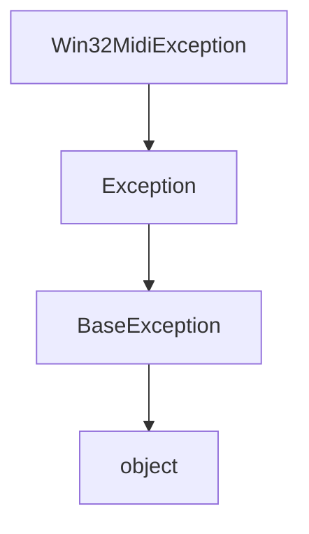
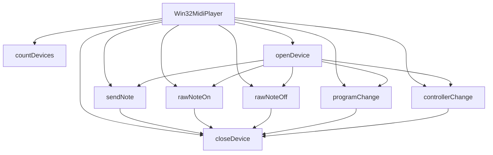

# `win32midi.py`

## `mingus.midi.win32midi.Win32MidiException` · *class*

## Summary:
Custom exception class for Win32 MIDI-related errors in the mingus library.

## Description:
Win32MidiException is a specialized exception type designed to handle errors specific to Windows MIDI operations within the mingus music library. It inherits from Python's standard Exception class and serves as a distinct error type that allows callers to catch MIDI-specific exceptions separately from general Python exceptions. This exception is likely raised when Windows MIDI API calls fail or encounter invalid states during MIDI device communication or operation.

## State:
The class has no instance attributes beyond those inherited from Exception. It maintains the standard Exception behavior including message storage and traceback information.

## Lifecycle:
Creation: Instances are created by raising the exception directly or through exception propagation from underlying Windows MIDI API calls. No special instantiation method is required beyond standard Python exception creation patterns.

Usage: The exception should be caught using standard try/except blocks when performing Windows MIDI operations. Typical usage involves catching this exception specifically to handle MIDI-related failures while allowing other exceptions to propagate normally.

Destruction: Like all Python exceptions, cleanup is handled automatically by the Python runtime when the exception object goes out of scope.

## Method Map:


## Raises:
This class itself does not raise exceptions. It is raised by other components in the win32midi module when Windows MIDI operations fail.

## Example:
```python
try:
    # Some Windows MIDI operation
    midi_device.open()
except Win32MidiException as e:
    print(f"MIDI operation failed: {e}")
    # Handle MIDI-specific error
```

## `mingus.midi.win32midi.Win32MidiPlayer` · *class*

## Summary:
Win32MidiPlayer provides a Windows-specific interface for playing MIDI messages through the Windows Multimedia API.

## Description:
This class serves as a wrapper around Windows' winmm.dll MIDI functions, enabling applications to send MIDI messages to connected MIDI devices on Windows systems. It is designed specifically for Windows environments and provides methods for opening MIDI devices, sending note events, and controlling MIDI channels. The class handles the complexity of Windows MIDI API calls and translates them into convenient Python methods.

## State:
- `midiOutOpenErrorCodes` (dict): Maps MIDI error codes to descriptive error messages for device opening operations
- `midiOutShortErrorCodes` (dict): Maps MIDI error codes to descriptive error messages for short message operations  
- `winmm` (ctypes.windll.winmm): Reference to the Windows Multimedia DLL for MIDI operations
- `hmidi` (c_void_p): Handle to the opened MIDI device (set during openDevice call, initially None)

## Lifecycle:
- Creation: Instantiate with `Win32MidiPlayer()` constructor
- Usage: Call `openDevice()` to connect to a MIDI device, then use various send methods like `sendNote()`, `rawNoteOn()`, `rawNoteOff()`, `programChange()`, or `controllerChange()`
- Destruction: Call `closeDevice()` to release system resources when MIDI playback is complete

## Method Map:


## Raises:
- `Win32MidiException`: Raised when Windows MIDI API calls return non-zero error codes in any of the methods that interact with the MIDI device

## Example:
```python
player = Win32MidiPlayer()
player.openDevice()  # Opens default MIDI device
player.sendNote(60, duration=1.0, volume=100)  # Play middle C for 1 second
player.closeDevice()  # Close the device
```

### `mingus.midi.win32midi.Win32MidiPlayer.__init__` · *method*

## Summary:
Initializes a Win32MidiPlayer instance by setting up error code mappings and loading the Windows multimedia library.

## Description:
This constructor method initializes the Win32MidiPlayer object by configuring error code dictionaries for MIDI operations and loading the Windows multimedia DLL (winmm). These initialized attributes are used by other methods in the class to handle MIDI device operations and error reporting.

## Args:
    None

## Returns:
    None

## Raises:
    None

## State Changes:
    Attributes READ: None
    Attributes WRITTEN: 
    - self.midiOutOpenErrorCodes: Dictionary mapping MIDI output open error codes to descriptive messages
    - self.midiOutShortErrorCodes: Dictionary mapping MIDI output short message error codes to descriptive messages  
    - self.winmm: Reference to the loaded Windows multimedia DLL

## Constraints:
    Preconditions: None
    Postconditions: The instance has error code dictionaries and winmm library reference ready for MIDI operations

## Side Effects:
    None

### `mingus.midi.win32midi.Win32MidiPlayer.countDevices` · *method*

## Summary:
Returns the total number of MIDI output devices available on the Windows system.

## Description:
This method provides access to the Windows Multimedia API function `midiOutGetNumDevs()` which enumerates all available MIDI output devices installed on the system. It's used to determine how many MIDI synthesizers or output ports are accessible for playback.

The method is part of the Win32MidiPlayer class which serves as a bridge between Python and the Windows MIDI subsystem. This method is particularly useful for applications that need to discover available MIDI hardware before attempting to open a specific device.

## Args:
    None

## Returns:
    int: The number of MIDI output devices available on the system. Returns 0 if no MIDI output devices are found.

## Raises:
    None explicitly raised, though underlying Windows API may raise system-level errors not caught by this wrapper.

## State Changes:
    Attributes READ: self.winmm
    Attributes WRITTEN: None

## Constraints:
    Preconditions: The Win32MidiPlayer instance must have been initialized (self.winmm should be set to windll.winmm)
    Postconditions: The method returns a non-negative integer representing device count

## Side Effects:
    None - This is a read-only operation that doesn't modify any state or perform I/O beyond calling the Windows API.

### `mingus.midi.win32midi.Win32MidiPlayer.openDevice` · *method*

## Summary:
Opens a MIDI output device for sending MIDI messages, setting up the internal handle for subsequent MIDI operations.

## Description:
Initializes a connection to a MIDI output device using the Windows Multimedia API. This method prepares the Win32MidiPlayer instance for sending MIDI messages by establishing a device handle. When called, it attempts to open the specified MIDI output device and stores the resulting handle in the instance for future use.

This method is separated from other initialization logic to allow for flexible device selection and proper resource management. It's typically called early in the object's lifecycle before attempting to send MIDI messages.

## Args:
    deviceNumber (int): The MIDI device number to open. Defaults to -1, which selects the default device as configured in the MIDI mapper. Valid values are typically 0 to (countDevices()-1) for available devices.

## Returns:
    None: This method does not return a value.

## Raises:
    Win32MidiException: Raised when the MIDI device cannot be opened, typically due to invalid device number, device being in use, or other Windows multimedia API errors. Error messages include specific codes from midiOutOpenErrorCodes dictionary.

## State Changes:
    Attributes READ: self.winmm, self.midiOutOpenErrorCodes
    Attributes WRITTEN: self.hmidi

## Constraints:
    Preconditions: The Win32MidiPlayer instance must be initialized and the winmm library must be accessible. The deviceNumber must refer to an existing MIDI output device or be -1 for the default device.
    Postconditions: On successful execution, self.hmidi will contain a valid handle to the opened MIDI device. On failure, no state changes occur.

## Side Effects:
    I/O: Makes a system call to the Windows Multimedia API via winmm.midiOutOpen to establish a MIDI device connection.

### `mingus.midi.win32midi.Win32MidiPlayer.closeDevice` · *method*

## Summary:
Closes the currently opened MIDI output device and releases associated system resources.

## Description:
This method terminates communication with the MIDI device that was previously opened using the `openDevice` method. It calls the Windows Multimedia MIDI API function `midiOutClose` to properly close the device handle. This method should be called to cleanly release system resources when MIDI playback is complete.

## Args:
    None

## Returns:
    None

## Raises:
    Win32MidiException: When the Windows MIDI API returns a non-zero error code indicating failure to close the device.

## State Changes:
    Attributes READ: self.hmidi, self.winmm
    Attributes WRITTEN: None

## Constraints:
    Preconditions: The MIDI device must have been previously opened using `openDevice` method, making `self.hmidi` a valid handle.
    Postconditions: The MIDI device handle (`self.hmidi`) becomes invalid and cannot be used for further MIDI operations until a new device is opened.

## Side Effects:
    I/O: Calls Windows Multimedia API function midiOutClose to release the MIDI device handle.
    Resource cleanup: Frees system resources associated with the MIDI output device.

### `mingus.midi.win32midi.Win32MidiPlayer.sendNote` · *method*

## Summary:
Sends a complete MIDI note message with specified pitch, duration, channel, and volume, including automatic note-off after the duration expires.

## Description:
This method sends a MIDI note-on message followed by a note-off message after the specified duration, effectively playing a complete note. It's designed to be a convenient way to play notes with a defined duration without requiring separate calls for note-on and note-off.

The method constructs MIDI status bytes and parameters according to the MIDI protocol, then uses Windows multimedia API calls to send these messages to the MIDI device. It handles both the note-on and note-off events in sequence with appropriate timing.

## Args:
    pitch (int): MIDI pitch value (0-127) representing the note to play
    duration (float): Duration in seconds to hold the note (default: 1.0)
    channel (int): MIDI channel number (1-16, default: 1)
    volume (int): Note velocity/volume (0-127, default: 60)

## Returns:
    None: This method does not return any value

## Raises:
    Win32MidiException: When MIDI device fails to process either the note-on or note-off message, with specific error codes from the Windows multimedia API

## State Changes:
    Attributes READ: self.winmm, self.hmidi, self.midiOutShortErrorCodes
    Attributes WRITTEN: None

## Constraints:
    Preconditions: 
    - MIDI device must be opened via openDevice() before calling this method
    - Pitch must be between 0 and 127
    - Channel must be between 1 and 16
    - Volume must be between 0 and 127
    - Duration must be non-negative
    
    Postconditions:
    - A complete note event is sent to the MIDI device
    - The method blocks execution for the specified duration

## Side Effects:
    - Makes Windows multimedia API calls (midiOutShortMsg)
    - Blocks execution for the duration of the note
    - May cause audible sound output if MIDI device is connected to audio equipment

### `mingus.midi.win32midi.Win32MidiPlayer.rawNoteOn` · *method*

## Summary:
Sends a raw MIDI note-on message to the currently opened MIDI device.

## Description:
This method constructs and sends a MIDI note-on message using Windows multimedia API functions. It's designed to send a single note-on event without automatically handling the corresponding note-off event, allowing for more fine-grained control over MIDI message sequences. This method is typically used when building more complex MIDI operations that require manual control over note durations or when implementing custom MIDI protocols.

## Args:
    pitch (int): The MIDI pitch value (0-127) for the note to play.
    channel (int): The MIDI channel number (1-16), defaults to 1.
    v (int): The velocity value (0-127) for the note, defaults to 60.

## Returns:
    None: This method does not return any value.

## Raises:
    Win32MidiException: When the MIDI message cannot be sent successfully, including cases such as invalid device handle, hardware busy conditions, or bad open mode errors.

## State Changes:
    Attributes READ: self.winmm, self.hmidi, self.midiOutShortErrorCodes
    Attributes WRITTEN: None directly, but indirectly modifies the MIDI device state through winmm API calls.

## Constraints:
    Preconditions: 
    - The MIDI device must be opened via `openDevice()` before calling this method.
    - The pitch value must be between 0 and 127.
    - The channel value must be between 1 and 16.
    - The velocity value must be between 0 and 127.
    
    Postconditions:
    - The MIDI note-on event is sent to the device.
    - If successful, the device state reflects the note being played.
    - If failed, a Win32MidiException is raised with detailed error information.

## Side Effects:
    - Makes a Windows API call to winmm.midiOutShortMsg.
    - May cause audible sound output from the MIDI device if properly configured.
    - Does not perform any I/O operations beyond the Windows API call.

### `mingus.midi.win32midi.Win32MidiPlayer.rawNoteOff` · *method*

## Summary:
Sends a MIDI note-off message to stop a currently playing note on the specified channel.

## Description:
This method sends a raw MIDI note-off message using the Windows Multimedia API. It constructs a MIDI short message with the appropriate status byte (0x80) and sends it to the currently opened MIDI device. This method is typically used internally by higher-level functions like `sendNote()` to turn off notes after a specified duration.

## Args:
    pitch (int): The MIDI pitch value (0-127) of the note to stop.
    channel (int): The MIDI channel number (1-16). Defaults to 1.

## Returns:
    None: This method does not return a value.

## Raises:
    Win32MidiException: When the MIDI message cannot be sent successfully. Error codes include MIDIERR_BADOPENMODE and MIDIERR_NOTREADY.

## State Changes:
    Attributes READ: 
        - self.winmm: Windows Multimedia API library reference
        - self.hmidi: Handle to the currently opened MIDI device
        - self.midiOutShortErrorCodes: Dictionary mapping error codes to descriptive messages
    
    Attributes WRITTEN: None

## Constraints:
    Preconditions:
        - The MIDI device must be opened via `openDevice()` before calling this method
        - The pitch value must be between 0 and 127
        - The channel value must be between 1 and 16
    
    Postconditions:
        - A MIDI note-off message is sent to the device
        - If successful, the note stops playing on the specified channel

## Side Effects:
    - Calls the Windows Multimedia API (winmm.midiOutShortMsg)
    - May raise Win32MidiException if the MIDI operation fails

### `mingus.midi.win32midi.Win32MidiPlayer.programChange` · *method*

## Summary:
Changes the MIDI program (instrument sound) for a specified channel.

## Description:
Sends a MIDI program change message to the currently opened MIDI device. This method allows changing the instrument or sound preset for a specific MIDI channel. The program change message uses MIDI status byte 0xC0 followed by the program number and channel.

## Args:
    program (int): The program number (0-127) to change to.
    channel (int): The MIDI channel number (1-16) to send the program change on. Defaults to 1.

## Returns:
    None: This method does not return a value.

## Raises:
    Win32MidiException: When the MIDI device fails to process the program change message. This can occur due to invalid device handle, hardware unavailability, or other Windows MIDI system errors.

## State Changes:
    Attributes READ: 
        - self.winmm: Windows Multimedia API interface
        - self.hmidi: MIDI device handle
        - self.midiOutShortErrorCodes: Error code mapping dictionary
    
    Attributes WRITTEN: 
        - None: This method does not modify any instance attributes.

## Constraints:
    Preconditions:
        - The MIDI device must be opened via `openDevice()` before calling this method.
        - The program parameter must be in the range [0, 127].
        - The channel parameter must be in the range [1, 16].
    
    Postconditions:
        - The MIDI device will receive a program change message for the specified channel.
        - The program change is sent immediately to the MIDI hardware.

## Side Effects:
    - Makes a Windows API call to `midiOutShortMsg` which communicates with the MIDI hardware.
    - May cause audible change in the instrument/sound if the MIDI device supports the program number.

### `mingus.midi.win32midi.Win32MidiPlayer.controllerChange` · *method*

## Summary:
Sends a MIDI controller change message to the connected MIDI device.

## Description:
This method constructs and transmits a MIDI controller change message using the Windows multimedia MIDI API. It allows control of various MIDI parameters such as volume, pan, modulation, and other controller settings on a specified MIDI channel.

## Args:
    controller (int): The controller number (0-127) to change.
    val (int): The controller value (0-127) to set.
    channel (int): The MIDI channel number (1-16), defaults to 1.

## Returns:
    None: This method does not return a value.

## Raises:
    Win32MidiException: When the Windows MIDI output function fails to send the message, with an error code indicating the specific failure reason.

## State Changes:
    Attributes READ: 
        - self.winmm: Windows multimedia library reference
        - self.hmidi: Handle to the MIDI output device
        - self.midiOutShortErrorCodes: Dictionary mapping error codes to descriptive strings
    Attributes WRITTEN: None

## Constraints:
    Preconditions:
        - The MIDI device must be properly initialized and opened
        - Controller number must be between 0 and 127
        - Controller value must be between 0 and 127
        - Channel must be between 1 and 16
    Postconditions:
        - The controller change message is sent to the MIDI device
        - If successful, the MIDI device state is updated accordingly

## Side Effects:
    - Calls Windows multimedia API function midiOutShortMsg
    - May cause I/O operations on the MIDI device
    - Potential system-level MIDI communication

