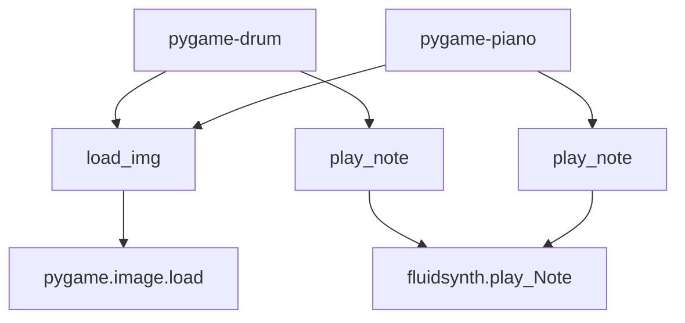

# `mingus_examples`

## Tree:
mingus_examples/
├── pygame-drum/
│   ├── __init__.py
│   └── pygame-drum.py
└── pygame-piano/
    ├── __init__.py
    └── pygame-piano.py

## Role:
Provides interactive pygame-based visual demonstrations of musical instrument playback using the mingus music library

## Description:
This module contains example implementations that demonstrate how to create interactive musical instrument interfaces using pygame for visualization and mingus for music processing. The examples showcase how to build GUI applications that can play musical notes and visualize musical interactions in real-time.

The module serves as educational material and reference implementations for developers who want to create similar interactive music applications using the mingus library ecosystem.

## Components:
*   **pygame-drum**: Python module implementing a drum interface with visual representation of drum pads and note playback functionality
*   **pygame-piano**: Python module implementing a piano keyboard interface with visual representation of keys and chord detection
*   **load_img**: Utility function for loading and converting images for pygame display
*   **play_note**: Function for playing musical notes through fluidsynth with appropriate visual feedback

## Public API:
*   **pygame-drum**: Module providing drum interface functionality with visual representation and note playback
*   **pygame-piano**: Module providing piano interface functionality with visual representation and chord detection
*   **load_img(name)**: Loads and converts images for pygame display
*   **play_note(note)**: Plays a musical note through fluidsynth and updates visual state

## Dependencies:
*   **Internal**: 
    *   mingus.core.notes.Note - for musical note representation and comparison
    *   mingus.core.chords - for chord detection capabilities
    *   mingus.core.fluidsynth - for audio synthesis and playback
*   **External**:
    *   pygame - for GUI rendering and event handling
    *   sys - for system-level operations

## Constraints:
*   Requires pygame to be installed and properly configured
*   Requires fluidsynth to be available for audio playback
*   Must initialize pygame display before using any visual components
*   The drum and piano examples require specific note mappings and key configurations to function correctly

