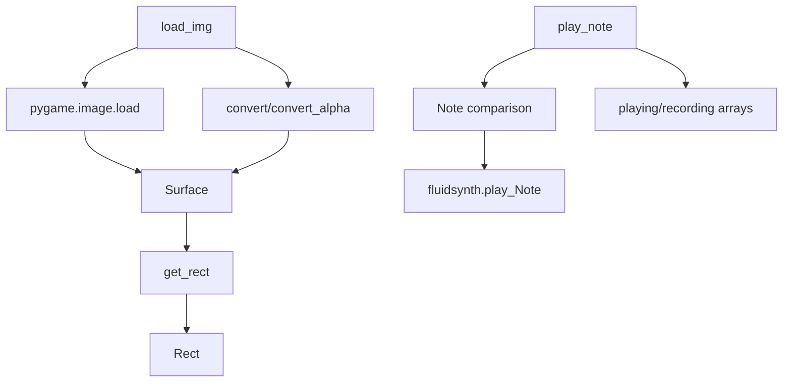

# `mingus_examples.pygame-drum`

## Tree:
pygame-drum/
└── pygame-drum.py

## Role:
Provides pygame-based drum functionality including image loading and note playback capabilities for a musical interface.

## Description:
This module serves as the core implementation for handling drum-related graphics and audio in a pygame-based musical application. It provides the foundational components needed to display drum interfaces and play corresponding sounds. The module is primarily consumed by the main application loop and user interface components that require drum functionality.

The separation of this module allows for clean organization of pygame-specific rendering and audio playback logic, keeping it distinct from other musical instrument implementations like piano.

## Components:
- load_img(name: str) -> tuple[Surface, Rect]: Loads and processes an image for pygame display
- play_note(note: Note) -> None: Plays a drum note and records it if in recording mode

## Public API:
- load_img(name: str) -> tuple[Surface, Rect]: Loads an image file and returns the surface and rectangle for positioning
- play_note(note: Note) -> None: Processes a musical note by checking if it's a drum note and plays it through fluidsynth

## Dependencies:
- pygame: Required for image loading and surface operations
- fluidsynth: Audio synthesis library for playing musical notes
- mingus.core.notes.Note: Musical note representation for comparison and playback

## Constraints:
- All image paths passed to load_img must be valid file paths
- The play_note function assumes specific note mappings for drum sounds
- The module depends on global variables (status, playing, recorded, recorded_buffer, tick) being properly initialized

---

## Files

- [`pygame-drum.py`](pygame-drum/pygame-drum.md)

