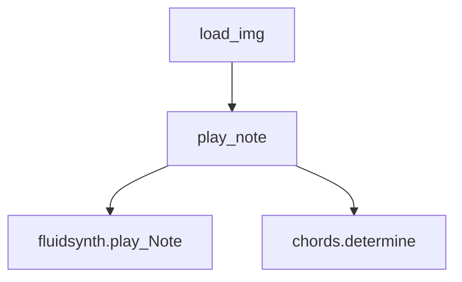

# `mingus_examples.pygame-piano`

## Tree:
    pygame-piano/
    └── pygame-piano.py

## Role:
    Provides pygame-based piano visualization and audio playback functionality

## Description:
    This module implements a graphical piano interface using Pygame that displays a virtual piano keyboard and handles musical note playback through audio synthesis. It combines visual representation of piano keys with audio generation to create an interactive musical experience. The module is designed to be integrated into larger music applications requiring piano visualization and playback capabilities.

    This module is consumed by main application entry points that require piano functionality. It's separated from other musical instrument implementations (such as drum kits) to maintain architectural modularity and clear component boundaries.

## Components:
    - load_img(name): Loads and processes image files for pygame display with appropriate color conversion
    - play_note(note): Processes musical notes for both visual key highlighting and audio playback

## Public API:
    - load_img(name): Loads and processes an image file for pygame display
      Usage: Call with image filename to get processed pygame surface and rect tuple
    - play_note(note): Plays a musical note on the virtual piano interface
      Usage: Call with a note object to trigger visual key highlighting and audio playback

## Dependencies:
    - Internal:
      - chords module for chord detection and analysis
      - fluidsynth module for MIDI-based audio synthesis
    - External:
      - pygame for graphics rendering and event handling
      - mingus.core.notes for musical note objects and data structures

## Constraints:
    - Requires pygame initialization before use
    - Depends on global variables being properly initialized (text, playing_w, playing_b, etc.)
    - Note objects must conform to mingus.core.notes.Note structure
    - Audio playback requires fluidsynth to be properly configured and loaded
    - Assumes predefined constants like WHITE_KEYS, BLACK_KEYS, LOWEST, width, white_key_width, etc.
    - Requires proper initialization of pygame display surface and font rendering

---

## Files

- [`pygame-piano.py`](pygame-piano/pygame-piano.md)

