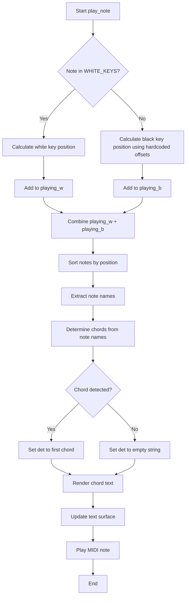

# `pygame-piano.py`

## `mingus_examples.pygame-piano.pygame-piano.load_img` · *function*

## Summary:
Loads an image file and prepares it for rendering with appropriate surface conversion.

## Description:
This utility function loads an image from disk using pygame and applies the correct surface conversion based on the image's alpha channel properties. It ensures optimal performance and proper transparency handling when displaying images in pygame applications.

## Args:
    name (str): Path to the image file to be loaded.

## Returns:
    tuple[pygame.Surface, pygame.Rect]: A tuple containing the loaded image surface and its rectangular bounds.

## Raises:
    SystemExit: When the image file cannot be loaded, causing the application to terminate.

## Constraints:
    Precondition: The file path must point to a valid image file that pygame can load.
    Postcondition: The returned surface is properly converted for efficient rendering.

## Side Effects:
    I/O: Reads from the file system to load the image file.
    Memory allocation: Creates new pygame Surface objects.

## Control Flow:
```mermaid
flowchart TD
    A[Start load_img] --> B{Load image}
    B -->|Success| C{Has alpha channel?}
    C -->|No| D[Convert surface]
    C -->|Yes| E[Convert alpha surface]
    D --> F[Return (image, rect)]
    E --> F
    B -->|Failure| G[Print error]
    G --> H[Exit application]
```

## Examples:
```python
# Basic usage
try:
    image, rect = load_img("assets/player.png")
    screen.blit(image, rect)
except SystemExit:
    print("Failed to load image, exiting...")
```

## `mingus_examples.pygame-piano.pygame-piano.play_note` · *function*

## Summary:
Processes and plays a musical note in a pygame piano application, handling key positioning, chord detection, and visual feedback.

## Description:
This function serves as the core note-handling mechanism in a pygame-based piano application. It calculates the appropriate position for a note on the virtual piano keyboard (handling both white and black keys), manages the collection of currently playing notes, detects chords being played, and renders chord names to the display. The function integrates with MIDI playback to produce audible sounds.

## Args:
    note: A musical note object with 'name' and 'octave' attributes representing the musical note to be played. The note object should be compatible with the mingus music library.

## Returns:
    None: This function does not return any value.

## Raises:
    KeyError: When a note name is not found in the predefined WHITE_KEYS or BLACK_KEYS arrays.
    AttributeError: When the note parameter lacks required 'name' or 'octave' attributes.

## Constraints:
    Preconditions:
    - Global variables must be initialized: text, playing_w, playing_b, width, LOWEST, WHITE_KEYS, BLACK_KEYS, white_key_width, tick, font, channel
    - The note parameter must have 'name' and 'octave' attributes
    - Constants WHITE_KEYS and BLACK_KEYS must contain valid note names
    - The LOWEST constant defines the lowest playable octave
    
    Postconditions:
    - The note is added to either playing_w or playing_b list based on its key type
    - Visual display is updated with current chord information
    - MIDI playback is initiated for the note

## Side Effects:
    - Modifies global lists playing_w and playing_b by appending [position, tick, note] tuples
    - Updates the global text surface with rendered chord names
    - Calls fluidsynth.play_Note() to produce audible sound
    - Renders text to the pygame display surface

## Control Flow:


## Examples:
    # Typical usage in a piano application event loop
    note = Note("C", 4)
    play_note(note)
    
    # In keyboard event handling
    if event.type == pygame.KEYDOWN:
        note = Note("E", 5)
        play_note(note)
```

