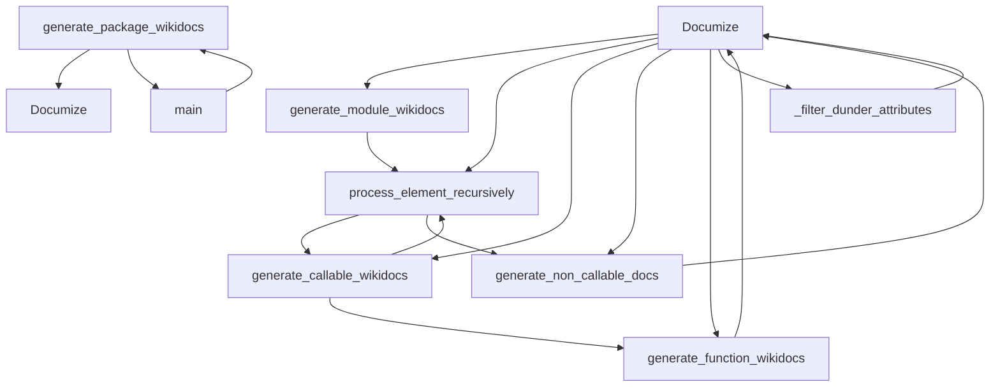

# `scripts`

## Tree:
    scripts/
    └── api_doc_generator.py

## Role:
    Generates reStructuredText API documentation for Python modules and packages

## Description:
    The scripts module provides tools for automatically generating API documentation from Python modules and packages. It is primarily used during the documentation generation process to create technical reference documentation for software libraries by introspecting Python objects and generating structured documentation in reStructuredText format.

    This module is specifically used to generate API documentation for the mingus music library, automatically documenting its core, midi, containers, and extra modules.

## Components:
    * `Documize` - Main class for generating documentation from Python modules
    * `_is_class` - Helper function to identify class objects
    * `_is_method` - Helper function to identify method objects  
    * `generate_package_wikidocs` - Function to generate documentation for entire packages
    * `main` - Entry point function that orchestrates documentation generation for core modules

## Public API:
    * `Documize(module_string='')` - Constructor for the documentation generator. Creates a new Documize instance for documenting the specified module string.
    * `generate_package_wikidocs(package_string, file_prefix='ref', file_suffix='.wiki')` - Generate documentation for an entire package by iterating through its elements and generating individual module documentation files.
    * `main()` - Main entry point that handles command-line arguments and orchestrates documentation generation for core mingus modules (core, midi, containers, extra).

## Dependencies:
    * Internal: None
    * External: 
        * `inspect` - For introspecting Python objects and extracting function signatures (uses `getargspec`)
        * `types` - For type checking operations
        * `os` - For file system operations (path joining)
        * `sys` - For system-specific parameters and functions (command-line arguments)

## Constraints:
    * The module requires that all target modules be importable via `eval()` 
    * Documentation generation assumes standard Python module structure
    * Output files are written to a specified directory provided as command-line argument
    * The module uses `eval()` which can be a security risk if processing untrusted input
    * The `inspect.getargspec()` function is used to extract function signatures, which is deprecated in Python 3.3+ but still functional in the target environment

---

## Files

- [`api_doc_generator.py`](scripts/api_doc_generator.md)

