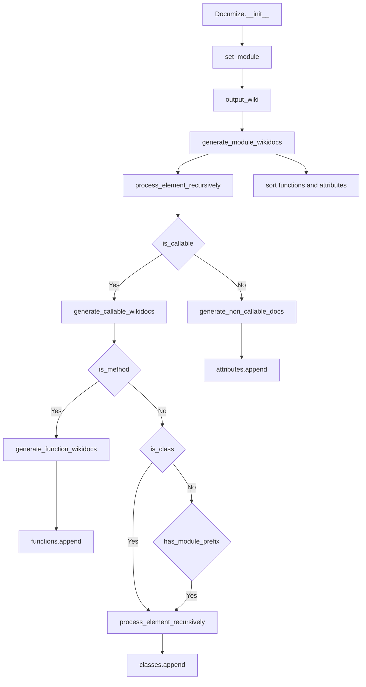

# `api_doc_generator.py`

## `scripts.api_doc_generator._is_class` · *function*

## Summary:
Determines whether a class should be included in API documentation generation.

## Description:
This utility function serves as a filter to exclude certain base classes from API documentation. It evaluates whether a given class should be documented by ensuring it is a proper class type (inherits from object) while excluding specific superclasses that are designated for skipping during documentation generation.

## Args:
    cls (type): A Python class object to evaluate for documentation inclusion

## Returns:
    bool: True if the class should be included in documentation, False if it should be skipped

## Raises:
    TypeError: If cls is not a class/type object (would occur during issubclass() call)

## Constraints:
    Preconditions:
        - cls must be a valid Python class/type object
        - cls must be compatible with subclass relationship checks
    
    Postconditions:
        - Returns a boolean value indicating documentation eligibility
        - The result is determined by two conditions: 
          1. The class inherits from object (ensures it's a proper class)
          2. The class does not inherit from _SKIPPED_CLASS_SUPERTYPES (excludes specific base classes)

## Side Effects:
    None

## Control Flow:
```mermaid
flowchart TD
    A[Input: cls] --> B{issubclass(cls, object)?}
    B -- Yes --> C{issubclass(cls, _SKIPPED_CLASS_SUPERTYPES)?}
    C -- No --> D[Return True]
    C -- Yes --> E[Return False]
    B -- No --> F[Return False]
```

## Examples:
    # Usage in documentation generator
    documented_classes = [cls for cls in all_classes if _is_class(cls)]
    
    # Check individual class
    if _is_class(MyCustomClass):
        # Generate documentation for MyCustomClass
        pass
    else:
        # Skip MyCustomClass from documentation
        pass
```

## `scripts.api_doc_generator._is_method` · *function*

## Summary:
Determines whether an object is a method type by checking its type against predefined method type constants.

## Description:
This utility function checks if a given object is an instance of a method type, which is commonly needed when performing introspection on callable objects. It serves as a helper function for identifying methods in API documentation generation processes.

The function is extracted into its own utility to provide a clean abstraction for method type detection, separating the type-checking logic from the higher-level API documentation generation logic.

## Args:
    obj (Any): The object to check for being a method type.

## Returns:
    bool: True if the object is of a method type (as defined in _METHOD_TYPES), False otherwise.

## Raises:
    None: This function does not raise any exceptions.

## Constraints:
    Preconditions: The input object can be of any type.
    Postconditions: The return value is always a boolean indicating method type membership.

## Side Effects:
    None: This function performs no I/O operations or external state mutations.

## Control Flow:
```mermaid
flowchart TD
    A[Input obj] --> B{type(obj) in _METHOD_TYPES?}
    B -->|Yes| C[Return True]
    B -->|No| D[Return False]
```

## Examples:
```python
# Check if a bound method is recognized
class MyClass:
    def my_method(self):
        pass

obj = MyClass()
result = _is_method(obj.my_method)  # Returns True

# Check if a regular function is not recognized as a method
def regular_func():
    pass

result = _is_method(regular_func)  # Returns False
```

## `scripts.api_doc_generator.Documize` · *class*

## Summary:
Generates reStructuredText wiki documentation for Python modules by recursively analyzing their elements.

## Description:
The Documize class is designed to automatically generate comprehensive documentation for Python modules in reStructuredText format. It recursively examines modules, classes, functions, and attributes, creating appropriate documentation directives for each element. This class serves as a utility for creating API documentation by introspecting Python objects and formatting their metadata into standardized documentation markup.

## State:
- functions: list[str] - Stores generated documentation for functions and methods, sorted alphabetically
- classes: list[str] - Stores generated documentation for classes, sorted alphabetically  
- attributes: list[str] - Stores generated documentation for non-callable attributes, sorted alphabetically
- _ALLOWED_DUNDER_METHODS: set[str] - Set of special methods that should be documented despite starting with double underscores (e.g., __init__, __str__, __len__)
- module_string: str - The string representation of the module being documented
- module: module - The actual module object being analyzed

## Lifecycle:
- Creation: Instantiate with optional module_string parameter to specify which module to document
- Usage: Call set_module() to specify the target module, then call output_wiki() to generate documentation
- Destruction: No explicit cleanup required; reset() method clears internal state

## Method Map:


## Raises:
- None explicitly raised by __init__ (though eval() in set_module could raise NameError if module_string is invalid)

## Example:
```python
# Create documentation generator for a module
documizer = Documize('mingus.core.meters')

# Generate documentation
wiki_output = documizer.output_wiki()

# The result contains reStructuredText formatted documentation
print(wiki_output)
```

### `scripts.api_doc_generator.Documize.__init__` · *method*

## Summary:
Initializes the Documize object with a module string to be documented.

## Description:
The `__init__` method sets up the Documize instance by storing the module string and initializing the documentation generation process for that module. This method serves as the entry point for configuring which module will be processed for documentation generation.

## Args:
    module_string (str): The string representation of the module to be documented. Defaults to empty string.

## Returns:
    None: This method does not return any value.

## Raises:
    None: This method does not explicitly raise exceptions.

## State Changes:
    Attributes READ: None
    Attributes WRITTEN: 
    - self.module_string: Set to the provided module_string parameter
    - self.module: Set to the evaluated module object from module_string
    - self.functions: Reset to empty list
    - self.classes: Reset to empty list  
    - self.attributes: Reset to empty list

## Constraints:
    Preconditions: 
    - The module_string should be a valid Python module identifier that can be evaluated
    - If module_string is empty, the object will be initialized but no module will be loaded for documentation
    
    Postconditions:
    - The Documize instance is configured with the specified module
    - All documentation tracking lists (functions, classes, attributes) are reset to empty

## Side Effects:
    None: This method does not perform any I/O operations or external service calls.

### `scripts.api_doc_generator.Documize._filter_dunder_attributes` · *method*

## Summary:
Filters attribute names to exclude most dunder methods while preserving specific allowed ones for API documentation generation.

## Description:
This method processes a collection of attribute names and filters out most double underscore prefixed attributes (dunder methods) that are typically considered private or internal implementation details. However, it preserves a predefined set of dunder methods that are considered important for API documentation purposes. This filtering is crucial for generating clean, user-friendly API documentation by excluding implementation internals.

The method is called during the recursive processing of module elements in the `process_element_recursively` method, ensuring that only relevant attributes are documented.

## Args:
    attrs (iterable[str]): An iterable of attribute names (strings) to be filtered.

## Returns:
    generator[str]: A generator yielding attribute names that pass the filtering criteria.

## Raises:
    None explicitly raised.

## State Changes:
    Attributes READ: 
    - self._ALLOWED_DUNDER_METHODS: Set of dunder method names that are explicitly allowed through the filter.

## Constraints:
    Preconditions:
    - The `attrs` parameter must be iterable containing string attribute names.
    - The `self._ALLOWED_DUNDER_METHODS` attribute must be properly initialized as a set of strings.
    
    Postconditions:
    - The returned generator will yield only attribute names that either don't start with '__' OR are in the allowed set.
    - No modification is made to the input `attrs` iterable.

## Side Effects:
    None.

### `scripts.api_doc_generator.Documize.process_element_recursively` · *method*

## Summary:
Processes all attributes of an object recursively, generating documentation for callable and non-callable elements separately.

## Description:
This method iterates through all attributes of a given object (excluding dunder attributes unless explicitly allowed), evaluates each attribute, and delegates documentation generation to appropriate handler methods based on whether the attribute is callable or not. It serves as a core recursive processing mechanism for API documentation generation.

The method is called during the module documentation generation process, specifically from `generate_module_wikidocs()` when processing the top-level module elements. It enables recursive exploration of nested objects and their attributes, making it possible to document entire module hierarchies.

This logic is separated into its own method rather than being inlined because it provides reusable recursive traversal functionality that can be applied to any object, not just the top-level module, and it encapsulates the complex filtering and dispatch logic for handling different types of attributes.

## Args:
    element_string (str): The string representation of the object's namespace (e.g., 'module.submodule.ClassName')
    element_evaled: The actual evaluated object whose attributes are being processed
    is_class (bool, optional): Flag indicating whether the current element is a class. Defaults to False

## Returns:
    None: This method doesn't return anything directly, but modifies instance attributes of the Documize class

## Raises:
    None explicitly raised: However, the method may raise exceptions during evaluation or attribute access (such as AttributeError when accessing non-existent attributes)

## State Changes:
    Attributes READ: 
    - self._filter_dunder_attributes
    - self.generate_non_callable_docs
    - self.generate_callable_wikidocs
    
    Attributes WRITTEN:
    - self.functions (via generate_callable_wikidocs)
    - self.classes (via generate_callable_wikidocs and generate_non_callable_docs)
    - self.attributes (via generate_non_callable_docs)

## Constraints:
    Preconditions:
    - element_evaled must be a valid Python object that can be inspected with dir()
    - element_string must properly represent the namespace of element_evaled
    - The Documize instance must be properly initialized with a valid module_string
    
    Postconditions:
    - All non-callable attributes of element_evaled are processed and added to self.attributes or self.classes
    - All callable attributes of element_evaled are processed and added to self.functions or self.classes
    - The recursion depth is controlled by the recursive calls to process_element_recursively from generate_callable_wikidocs

## Side Effects:
    - Evaluates arbitrary code using eval() which could pose security risks
    - Modifies internal state variables (functions, classes, attributes lists)
    - May trigger additional recursive calls that process nested objects

### `scripts.api_doc_generator.Documize.generate_module_wikidocs` · *method*

## Summary:
Generates comprehensive wiki-formatted documentation for an entire Python module by processing all contained classes, functions, and attributes recursively.

## Description:
This method serves as the primary interface for generating complete module documentation. It orchestrates the documentation generation process by:
1. Resetting internal state to ensure clean documentation collection
2. Creating module header information with proper formatting
3. Extracting and formatting module-level documentation if present
4. Recursively processing all elements within the module using process_element_recursively
5. Sorting collected components alphabetically for consistent presentation
6. Assembling all documentation components into a properly formatted wiki documentation string

The method is designed to work with the Documize class which maintains collections of functions, classes, and attributes that are populated during the recursive processing phase.

## Args:
    None - This is a method of the Documize class that operates on instance state

## Returns:
    str: A formatted wiki documentation string containing:
    - Module declaration directive
    - Module header with title and underline
    - Module docstring if available
    - Sorted list of classes, attributes, and functions
    - Footer with back-to-index link

## Raises:
    None explicitly raised - However, underlying operations may raise exceptions during:
    - Module evaluation via eval() calls
    - Documentation extraction from functions and classes
    - String formatting operations

## State Changes:
    Attributes READ: 
    - self.module_string: Module name identifier used for evaluation and documentation
    - self.module: The actual module object being documented
    - self.functions: List of function documentation strings to be sorted and appended
    - self.attributes: List of attribute documentation strings to be sorted and appended  
    - self.classes: List of class documentation strings to be sorted and appended
    
    Attributes WRITTEN:
    - self.functions: Reset to empty list, then populated with function documentation strings
    - self.attributes: Reset to empty list, then populated with attribute documentation strings
    - self.classes: Reset to empty list, then populated with class documentation strings

## Constraints:
    Preconditions:
    - self.module_string must be a valid Python module name that can be evaluated
    - self.module must be successfully imported/evaluated from self.module_string
    - All internal collections (functions, attributes, classes) should be properly initialized
    
    Postconditions:
    - All internal documentation collections are sorted alphabetically
    - The returned string contains properly formatted wiki documentation with:
      * Module declaration directive
      * Formatted module header
      * Module docstring (if present)
      * Alphabetically sorted documentation for classes, attributes, and functions
      * Footer with back-to-index navigation

## Side Effects:
    - Resets internal state via self.reset() call, clearing all previously collected documentation
    - Evaluates module strings using eval() which may have security implications
    - Processes elements recursively through self.process_element_recursively()
    - Generates formatted documentation strings for all module components
    - Modifies internal state collections (functions, attributes, classes) during execution

### `scripts.api_doc_generator.Documize.generate_non_callable_docs` · *method*

## Summary:
Generates reStructuredText documentation for non-callable attributes and data elements in Python modules.

## Description:
Processes Python attributes and data elements that are not callable (functions, methods, classes) and formats them into reStructuredText documentation blocks. This method is part of the API documentation generation system that creates wikidocs for Python modules by analyzing their contents recursively.

This method is specifically designed to handle data attributes and variables, distinguishing them from callable elements like functions and methods. It's called during the recursive processing of module elements in the `process_element_recursively` method when an element is determined to be non-callable.

The method filters out private attributes (those starting with underscore '_') and module types to avoid documenting internal implementation details or entire modules as attributes.

## Args:
    module_string (str): The full module path string used for evaluation and context
    element_string (str): The name of the element being processed  
    evaled (any): The actual evaluated value of the element
    is_class (bool): Flag indicating whether this is being processed as a class attribute (default: False)

## Returns:
    None: This method doesn't return anything directly, but appends formatted documentation strings to either self.attributes or self.classes lists

## Raises:
    None explicitly raised: The method doesn't contain explicit try/except blocks that raise exceptions

## State Changes:
    Attributes READ: self.attributes, self.classes
    Attributes WRITTEN: self.attributes, self.classes (appended to)

## Constraints:
    Preconditions:
    - element_string must be a valid string identifier
    - evaled must be a valid Python object that can be evaluated
    - module_string must be a valid module path that can be evaluated
    - element_string must not start with underscore ('_') to be processed
    - evaled must not be of type types.ModuleType to be processed
    
    Postconditions:
    - If is_class is False, the formatted documentation is appended to self.attributes
    - If is_class is True, the formatted documentation is appended to self.classes
    - The method filters out private elements (starting with '_') and module types

## Side Effects:
    None: This method performs no I/O operations or external service calls. It only manipulates internal state by appending to lists.

### `scripts.api_doc_generator.Documize.generate_callable_wikidocs` · *method*

## Summary:
Generates and categorizes documentation for callable elements (methods, classes, and module-level callables) within a module.

## Description:
Processes callable objects encountered during module documentation generation, determining their type and creating appropriate reStructuredText documentation entries. This method serves as a dispatcher that routes different types of callable elements to their respective documentation generation handlers.

This method is called during recursive processing of module elements in the `process_element_recursively` method, which iterates through all attributes of a module or class and determines whether they are callable. It specifically handles three categories of callable elements: methods, classes, and module-level callables that belong to the current module.

## Args:
    module_string (str): The dotted path string representing the module namespace
    element_string (str): The name of the element being processed
    evaled: The actual evaluated object being documented
    is_class (bool): Flag indicating if the current context is within a class definition

## Returns:
    None: This method does not return a value but modifies instance state through side effects

## Raises:
    None explicitly raised: The method doesn't raise exceptions directly but may propagate exceptions from called methods

## State Changes:
    Attributes READ: 
        - self.functions: Used to append function documentation when appropriate
        - self.classes: Used to append class documentation and method documentation
        - self.module_string: Used for constructing full module paths
    
    Attributes WRITTEN:
        - self.functions: Appended with function documentation strings when evaled is a method and is_class is False
        - self.classes: Appended with class documentation strings or method documentation when evaled is a class or module-level callable

## Constraints:
    Preconditions:
        - The method assumes that `evaled` is a callable object
        - The `module_string` should represent a valid module path
        - The `element_string` should be a valid identifier for the element
        
    Postconditions:
        - The appropriate documentation entry is appended to either self.functions or self.classes
        - For class elements, the method initiates recursive processing of the class's members

## Side Effects:
    - Modifies instance attributes self.functions and self.classes by appending documentation strings
    - Calls `generate_function_wikidocs` to create function/method documentation
    - Calls `process_element_recursively` to handle nested class member processing
    - Uses eval() internally to access module elements (security consideration)

### `scripts.api_doc_generator.Documize.generate_function_wikidocs` · *method*

## Summary:
Generates reStructuredText documentation for a function or method including parameter signatures and cleaned docstring content.

## Description:
This method creates documentation in reStructuredText format for Python functions or methods. It handles parameter listing with default values and properly formats docstrings, including special handling for code examples that start with '>>>'.

## Args:
    func_string (str): The function or method name and signature as a string
    func (function): The actual function object to document
    is_class (bool): Flag indicating whether the function is a class method (defaults to False)

## Returns:
    str: Formatted reStructuredText documentation string containing function signature and formatted docstring

## Raises:
    None explicitly raised - though the method contains a bare 'except:' clause that could catch unexpected errors during parameter processing

## State Changes:
    Attributes READ: None - this method doesn't read any instance attributes
    Attributes WRITTEN: None - this method doesn't modify any instance attributes

## Constraints:
    Preconditions: 
    - func_string should be a valid string representation of a function signature
    - func should be a callable Python function object
    - is_class should be a boolean value
    
    Postconditions:
    - Returns a properly formatted reStructuredText string
    - The returned string includes parameter information and docstring formatting
    - Parameter defaults are correctly handled when present

## Side Effects:
    None - this method performs no I/O operations or external service calls

## Implementation Details:
- Uses inspect.getargspec() to extract function signature information
- Handles default parameter values by matching them with parameter names
- Formats docstrings by cleaning them with inspect.cleandoc()
- Special handling for docstring lines starting with '>>>' to preserve code example formatting
- Generates appropriate RST directives ('.. function' or '.. method') based on is_class flag
- When is_class=False, generates '----\n\n.. function' directive
- When is_class=True, generates '   .. method' directive
- Properly formats parameter lists with commas and spaces
- Removes trailing commas from parameter lists

### `scripts.api_doc_generator.Documize.reset` · *method*

## Summary:
Clears all accumulated documentation elements from the Documize instance.

## Description:
Resets the internal tracking lists for functions, classes, and attributes to empty lists. This method is called at the beginning of module processing to ensure a clean state before documenting a new module.

## Args:
    None

## Returns:
    None

## Raises:
    None

## State Changes:
    Attributes READ: None
    Attributes WRITTEN: 
    - self.functions: Reset to empty list
    - self.classes: Reset to empty list  
    - self.attributes: Reset to empty list

## Constraints:
    Preconditions: None
    Postconditions: All three instance attributes (functions, classes, attributes) are empty lists

## Side Effects:
    None

### `scripts.api_doc_generator.Documize.set_module` · *method*

## Summary:
Sets the module to be documented by evaluating the module string and resetting the documentation cache.

## Description:
Configures the Documize instance to document a specific module by evaluating the provided module string. This method updates internal state to track the current module and clears existing documentation data to prepare for new documentation generation. The method is typically called during initialization or when switching between different modules for documentation generation.

## Args:
    module_string (str): The string representation of the module to be documented. Must be a valid Python module name that can be evaluated.

## Returns:
    None: This method does not return any value.

## Raises:
    NameError: If the module_string cannot be evaluated or does not correspond to an existing module.
    SyntaxError: If the module_string contains invalid Python syntax.

## State Changes:
    Attributes READ: None
    Attributes WRITTEN: 
        - self.module_string: Set to the provided module_string value
        - self.module: Set to the result of eval(module_string)

## Constraints:
    Preconditions: 
        - The module_string must be a valid Python module identifier that can be evaluated
        - The module must be importable in the current Python environment
    Postconditions:
        - self.module_string is updated to the provided value
        - self.module is updated to the evaluated module object
        - All documentation caches (functions, classes, attributes) are cleared via reset()

## Side Effects:
    - Calls self.reset() which clears internal documentation tracking lists
    - Evaluates the module_string using Python's eval() function
    - May cause import side effects if the module has initialization code

### `scripts.api_doc_generator.Documize.output_wiki` · *method*

## Summary:
Returns wiki-formatted documentation for the currently configured module by delegating to the module documentation generator.

## Description:
This method provides a public interface for generating wiki-formatted documentation of a module. It serves as a simple wrapper that delegates the actual documentation generation to the `generate_module_wikidocs` method, which performs the complex task of parsing module elements, organizing them into appropriate documentation sections, and formatting them according to wiki conventions.

The method is typically called during the documentation generation pipeline when a complete wiki-formatted documentation string is needed for a specific module.

## Args:
    None

## Returns:
    str: A formatted wiki documentation string containing module-level documentation, class definitions, attributes, and function signatures organized in alphabetical order.

## Raises:
    None explicitly raised

## State Changes:
    Attributes READ: self.module_string, self.module
    Attributes WRITTEN: None (the method itself doesn't modify instance state, though it indirectly calls reset() internally via generate_module_wikidocs())

## Constraints:
    Preconditions: The Documize instance must have a valid module_string set via set_module() method before calling this method.
    Postconditions: Returns a complete wiki-formatted documentation string for the currently configured module.

## Side Effects:
    None

## `scripts.api_doc_generator.generate_package_wikidocs` · *function*

## Summary:
Generates wiki documentation files for all non-callable attributes of a specified Python package.

## Description:
This function dynamically analyzes a Python package and creates individual wiki documentation files for each non-callable attribute within the package. It leverages the Documize class to generate the documentation content and writes the output to files in a specified directory.

The function is designed to be part of a larger documentation generation system for the mingus music library, processing packages to create reference documentation in wiki format. It processes elements returned by dir() on the package, filtering out callable objects and special methods.

## Args:
    package_string (str): The string representation of the Python package to document (e.g., 'mingus.containers'). This string is evaluated to obtain the actual package object.
    file_prefix (str): Prefix for the generated wiki filenames. Defaults to 'ref'.
    file_suffix (str): Suffix for the generated wiki filenames. Defaults to '.wiki'.

## Returns:
    None: This function does not return any value. It performs file I/O operations to write documentation files.

## Raises:
    None explicitly raised: The function contains try/except blocks but doesn't raise exceptions explicitly. It prints error messages to stdout when file operations fail or when evaluation fails.

## Constraints:
    Preconditions:
    - The package_string must be a valid Python module path that can be evaluated with eval()
    - sys.argv[1] must contain a valid directory path where documentation files can be written
    - The package must exist and be importable
    - Elements in the package must be evaluatable
    
    Postconditions:
    - Wiki documentation files are created in the directory specified by sys.argv[1]
    - Each file contains documentation for a single non-callable attribute of the package
    - Function prints status messages during execution

## Side Effects:
    - Creates files in the directory specified by sys.argv[1]
    - Writes documentation content to these files
    - Prints status messages to standard output during execution
    - Uses eval() to dynamically access package elements (security consideration)
    - Modifies global state through sys.argv access

## Control Flow:
```mermaid
flowchart TD
    A[Start generate_package_wikidocs] --> B[Create Documize instance]
    B --> C[Evaluate package_string to get package object]
    C --> D[Print documentation generation message]
    D --> E[Iterate through package elements using dir()]
    E --> F{Element is callable?}
    F -->|Yes| G[Skip element]
    F -->|No| H{Element starts with '__'?}
    H -->|Yes| I[Skip element]
    H -->|No| J[Build full element name]
    J --> K[Evaluate full element name]
    K --> L[Set module in Documize]
    L --> M[Generate wiki filename]
    M --> N[Output wiki content]
    N --> O[Open file for writing]
    O --> P{File opened successfully?}
    P -->|No| Q[Print file opening error]
    P -->|Yes| R[Write content to file]
    R --> S{Write successful?}
    S -->|No| T[Print write error]
    S -->|Yes| U[Print OK status]
    U --> V[End iteration]
    Q --> V
    T --> V
```

## Examples:
```python
# Generate documentation for the mingus.containers package
generate_package_wikidocs('mingus.containers', 'ref', '.wiki')

# Generate documentation with custom prefix and suffix
generate_package_wikidocs('mingus.core', 'core_', '_docs.wiki')

# Generate documentation for a specific submodule
generate_package_wikidocs('mingus.midi', 'midi_')
```

## `scripts.api_doc_generator.main` · *function*

## Summary:
Entry point for generating API documentation for the mingus music library across its core subpackages.

## Description:
This function serves as the primary command-line interface for generating comprehensive API documentation for the mingus library. It validates command-line arguments, prints version information, and orchestrates the documentation generation process for the core mingus subpackages (core, midi, containers, extra). The function is designed to be invoked from the command line with a single argument specifying the output directory where documentation files will be written.

## Args:
    None - This function reads command-line arguments via sys.argv rather than accepting parameters.

## Returns:
    None - This function exits the program with sys.exit() upon completion or error conditions.

## Raises:
    SystemExit - Raised when command-line arguments are invalid or when the specified output directory doesn't exist.

## Constraints:
    Preconditions:
    - Must be called from command line with exactly one argument (output directory path)
    - Output directory must exist and be a valid directory path
    - The mingus library must be properly installed and importable
    
    Postconditions:
    - API documentation files are generated and written to the specified output directory
    - Program terminates with exit code 0 on successful completion
    - Program terminates with exit code 1 on error conditions

## Side Effects:
    - Prints version information and usage instructions to standard output
    - Creates multiple documentation files in the specified output directory
    - Writes to the file system in the specified output directory
    - Calls sys.exit() which terminates the program execution

## Control Flow:
```mermaid
flowchart TD
    A[Start main()] --> B{Command-line args provided?}
    B -- No --> C[Print usage info]
    C --> D[Exit with code 1]
    B -- Yes --> E{Output directory valid?}
    E -- No --> F[Print error message]
    F --> G[Exit with code 1]
    E -- Yes --> H[Generate docs for mingus.core]
    H --> I[Generate docs for mingus.midi]
    I --> J[Generate docs for mingus.containers]
    J --> K[Generate docs for mingus.extra]
    K --> L[End]
```

## Examples:
Example usage from command line:
```
python api_doc_generator.py /path/to/output/directory
```

Expected behavior:
1. Prints version information to console
2. Validates that `/path/to/output/directory` exists and is a directory
3. Generates documentation files for mingus.core, mingus.midi, mingus.containers, and mingus.extra
4. Writes resulting .rst files to the specified output directory

