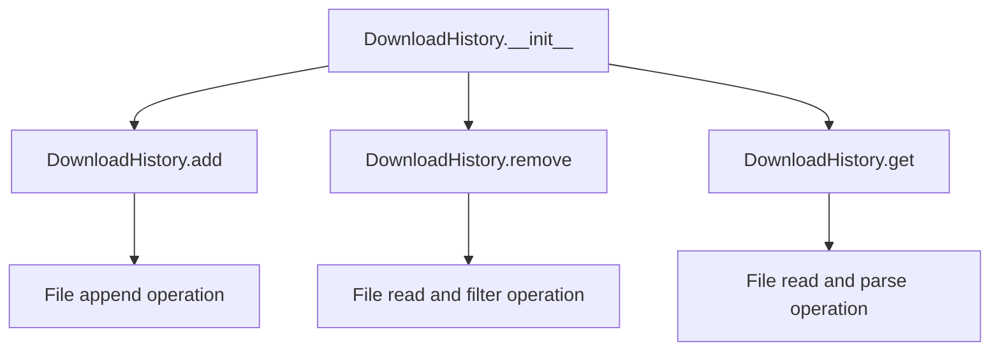

# `download_history.py`

## `onlinejudge_command.download_history.DownloadHistory` · *class*

## Summary:
Manages download history for competitive programming problems in a JSONL file format.

## Description:
The DownloadHistory class maintains a persistent record of downloaded problems, storing metadata like timestamp, directory location, and problem URLs. It's designed to track which problems have been downloaded to a specific directory, enabling features like avoiding redundant downloads or tracking progress.

This class serves as a distinct abstraction for managing download history separately from the main download logic, providing persistence across sessions and supporting efficient lookup operations.

## State:
- path: pathlib.Path - The file path where download history is stored. Defaults to utils.user_cache_dir / 'download-history.jsonl'
- The class maintains no other internal state beyond the file path

## Lifecycle:
- Creation: Instantiate with optional custom path parameter
- Usage: 
  - Call add(problem, directory=...) to record a download
  - Call get(directory=...) to retrieve history for a directory  
  - Call remove(directory=...) to clear all history entries for a directory
- Destruction: No explicit cleanup required; relies on filesystem for persistence

## Method Map:


## Raises:
- File-related exceptions may occur during file operations

## Example:
```python
# Create history instance
history = DownloadHistory()

# Add a download entry
problem = Problem("https://example.com/problem")
history.add(problem, directory=pathlib.Path("/path/to/downloads"))

# Retrieve history for a directory
urls = history.get(directory=pathlib.Path("/path/to/downloads"))

# Remove history for a directory
history.remove(directory=pathlib.Path("/path/to/downloads"))
```

### `onlinejudge_command.download_history.DownloadHistory.__init__` · *method*

## Summary:
Initializes a DownloadHistory object with a specified file path for storing download history data.

## Description:
Configures the DownloadHistory instance to use the provided file path for persisting download history records. This method sets up the storage location for tracking downloaded problems, defaulting to a JSONL-formatted file in the user's cache directory.

## Args:
    path (pathlib.Path): Absolute path to the file where download history will be stored. Defaults to `utils.user_cache_dir / 'download-history.jsonl'`.

## Returns:
    None: This method does not return a value.

## Raises:
    None: This method does not explicitly raise exceptions.

## State Changes:
    Attributes READ: None
    Attributes WRITTEN: self.path

## Constraints:
    Preconditions: The path parameter should be a valid pathlib.Path object.
    Postconditions: The instance will have its path attribute set to the provided value or the default cache path.

## Side Effects:
    None: This method performs no I/O operations or external service calls. It only stores the path reference.

### `onlinejudge_command.download_history.DownloadHistory.add` · *method*

## Summary:
Appends a download history entry containing problem URL, directory, and timestamp to the history file.

## Description:
This method records information about a downloaded problem by appending a JSON-formatted entry to the download history file. The entry includes the problem's URL, the directory where it was downloaded, and the current timestamp. This allows tracking of previously downloaded problems for deduplication purposes.

The method ensures the history file's parent directory exists before writing, creates a new entry with the current timestamp, and flushes the history to prevent excessive growth.

## Args:
    problem (Problem): An onlinejudge Problem object containing metadata about the problem being downloaded.
    directory (pathlib.Path): The filesystem path where the problem was downloaded.

## Returns:
    None: This method does not return any value.

## Raises:
    None explicitly raised: This method does not declare any exceptions to be raised, though underlying I/O operations may raise exceptions.

## State Changes:
    Attributes READ: 
        - self.path: Used to determine the history file location
    Attributes WRITTEN: 
        - None: This method doesn't modify any instance attributes directly, but affects the file system state via file I/O.

## Constraints:
    Preconditions:
        - The `problem` argument must be a valid Problem object with a `get_url()` method
        - The `directory` argument must be a valid pathlib.Path object
        - The parent directory of `self.path` must be writable
    Postconditions:
        - A new line is appended to the history file at `self.path`
        - The history file contains a JSON object with keys: 'timestamp', 'directory', and 'url'
        - The file size may be reduced via `_flush()` if it exceeds 1MB

## Side Effects:
    - Creates parent directories for the history file if they don't exist
    - Writes to the filesystem at `self.path`
    - May truncate the history file if it grows beyond 1MB (via `_flush()`)
    - Logs informational messages about the operation

### `onlinejudge_command.download_history.DownloadHistory.remove` · *method*

## Summary:
Removes download history entries for a specific directory from the history file.

## Description:
Clears all entries in the download history file that correspond to the given directory path. This method is used to clean up historical records of downloaded problems for a particular problem directory. If the history file does not exist, the method returns immediately without performing any operation.

## Args:
    directory (pathlib.Path): The directory path for which to remove history entries.

## Returns:
    None: This method does not return any value.

## Raises:
    IOError: Raised when there are issues reading from or writing to the history file.
    OSError: Raised when there are OS-related issues with file operations.

## State Changes:
    Attributes READ: self.path
    Attributes WRITTEN: None

## Constraints:
    Preconditions: The history file must be readable and writable if it exists.
    Postconditions: All entries in the history file matching the given directory are removed.

## Side Effects:
    I/O: Reads from and writes to the file at self.path.
    External service calls: None.
    Mutations to objects outside self: None.

### `onlinejudge_command.download_history.DownloadHistory._flush` · *method*

## Summary:
Truncates the history file to half its size when it exceeds 1MB to prevent excessive growth.

## Description:
This method is called internally by the `add` method to manage the size of the download history file. When the file size reaches or exceeds 1MB (1024 * 1024 bytes), it removes the oldest half of the entries while preserving the most recent ones. This prevents the history file from growing indefinitely and consuming excessive disk space.

## Args:
    None

## Returns:
    None

## Raises:
    FileNotFoundError: If the history file does not exist when trying to check its size or read from it.
    PermissionError: If there are insufficient permissions to read from or write to the history file.
    OSError: If there are general OS-level errors during file operations.
    json.decoder.JSONDecodeError: If the history file contains malformed JSON entries (though this would be handled elsewhere in the class).

## State Changes:
    Attributes READ: self.path
    Attributes WRITTEN: None

## Constraints:
    Preconditions: The history file must exist and be readable/writable.
    Postconditions: If the file size was >= 1MB, the file will be truncated to half its previous size, keeping the most recent entries.

## Side Effects:
    I/O operations: Reads entire history file into memory, then writes back half of the lines to the same file.
    External service calls: None
    Mutations to objects outside self: Modifies the contents of the file at self.path

### `onlinejudge_command.download_history.DownloadHistory.get` · *method*

## Summary:
Retrieves a list of problem URLs from the history file that match the specified directory.

## Description:
This method reads a JSON-lines formatted history file and filters entries to return only those that were associated with the given directory. It's designed to help identify previously downloaded problems for a specific directory, supporting features like avoiding redundant downloads. The method is part of the DownloadHistory class and operates on the history file specified by self.path.

## Args:
    directory (pathlib.Path): The directory path to filter history entries by.

## Returns:
    List[str]: A list of unique problem URLs that were previously recorded for the specified directory. Returns an empty list if the history file doesn't exist.

## Raises:
    None explicitly raised, but may raise exceptions from file I/O operations or JSON parsing.

## State Changes:
    Attributes READ: self.path
    Attributes WRITTEN: None

## Constraints:
    Preconditions:
        - The history file path (self.path) must be accessible for reading
        - The directory parameter must be a valid pathlib.Path instance
    
    Postconditions:
        - Returns a list of unique URLs (no duplicates)
        - Returns an empty list if the history file doesn't exist or contains no matching entries

## Side Effects:
    - Reads from the filesystem at self.path
    - Writes to logs via logger.info() and logger.warning() when processing the history file
    - May log debug information when encountering corrupted lines

