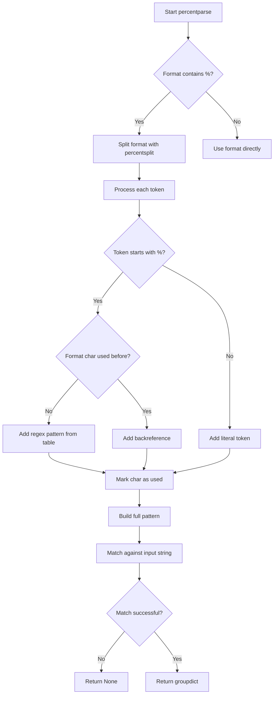
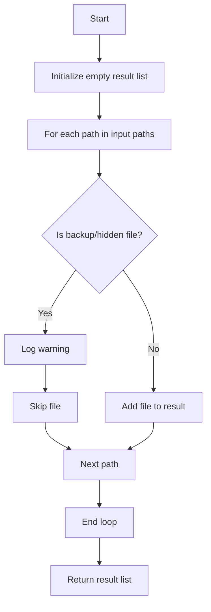
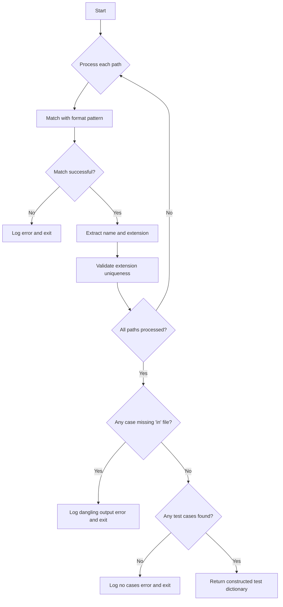

# `format_utils.py`

## `onlinejudge_command.format_utils.percentsplit` · *function*

## Summary:
Tokenizes a string by identifying individual characters and percent-character combinations.

## Description:
This function processes a string and yields tokens for each character in the string. Characters that are not percent signs are yielded individually, while percent signs followed by any character are yielded as single tokens. This is useful for parsing strings that contain percent escapes where percent-character pairs should be preserved as atomic units.

## Args:
    s (str): Input string to be tokenized.

## Returns:
    Generator[str, None, None]: A generator yielding tokens from the input string. Each token is either:
        - A single character that is not a percent sign, or
        - A percent sign followed by any single character (as a unit)

## Raises:
    None explicitly raised.

## Constraints:
    Preconditions:
        - Input must be a string
    Postconditions:
        - All characters from the input string are represented in the output tokens
        - Percent-character combinations are preserved as single tokens

## Side Effects:
    None.

## Control Flow:
```mermaid
flowchart TD
    A[Start percentsplit(s)] --> B{Process string from left to right}
    B --> C{Character is not %?}
    C -->|Yes| D[Yield single character]
    C -->|No| E[Yield % + next character]
    D --> F{More characters?}
    E --> F
    F -->|Yes| B
    F -->|No| G[End generator]
```

## Examples:
    >>> list(percentsplit("hello%world"))
    ['h', 'e', 'l', 'l', 'o', '%w', 'o', 'r', 'l', 'd']
    
    >>> list(percentsplit("a%%b%c"))
    ['a', '%', '%', 'b', '%c']
    
    >>> list(percentsplit("no_percents"))
    ['n', 'o', '_', 'p', 'e', 'r', 'c', 'e', 'n', 't', 's']
```

## `onlinejudge_command.format_utils.percentformat` · *function*

## Summary:
Formats a string by replacing percent-encoded placeholders with values from a lookup table.

## Description:
Processes a string containing percent-encoded placeholders (like %a, %b) and substitutes them with corresponding values from a provided mapping table. This function handles escaped percent signs (%%) properly and ensures that the percent character itself can be used as a literal value.

## Args:
    s (str): Input string containing percent-encoded placeholders to be formatted
    table (Dict[str, str]): Mapping of placeholder characters to their replacement values. Must contain a mapping for '%' character if '%' appears in the table.

## Returns:
    str: Formatted string with percent placeholders replaced by their corresponding values from the table

## Raises:
    AssertionError: When '%' key exists in table but is not mapped to '%'

## Constraints:
    Preconditions:
        - The input string `s` should be a valid string
        - The `table` parameter should be a dictionary mapping single-character keys to string values
        - If '%' is present as a key in the table, it must map to '%'
    
    Postconditions:
        - The returned string contains no percent-encoded placeholders
        - All valid percent placeholders (%a, %b, etc.) are replaced with their corresponding values
        - Escaped percent signs (%%) become single percent signs in the output

## Side Effects:
    None

## Control Flow:
```mermaid
flowchart TD
    A[Start percentformat] --> B{Table has '%' key?}
    B -- Yes --> C{Table['%'] == '%'?}
    C -- No --> D[Assertion Error]
    C -- Yes --> E[Set table['%'] = '%']
    B -- No --> E
    E --> F[Initialize result = '']
    F --> G[Iterate percentsplit(s)]
    G --> H{Token starts with '%'?}
    H -- Yes --> I[Lookup table[token[1]]]
    I --> J[Append to result]
    H -- No --> K[Append token to result]
    J --> L[result += ...]
    K --> L
    L --> M[Return result]
```

## Examples:
    >>> percentformat("Hello %n!", {'n': 'world'})
    'Hello world!'
    
    >>> percentformat("Price: %p%", {'p': '$100'})
    'Price: $100%'
    
    >>> percentformat("Test %% escape", {})
    'Test % escape'

## `onlinejudge_command.format_utils.percentparse` · *function*

## Summary:
Parses a string according to a format template with percent placeholders, extracting named groups into a dictionary.

## Description:
This function parses an input string against a format template containing percent placeholders (like %d, %s) and returns a dictionary of matched named groups. It's designed to handle format strings where percent characters indicate capture groups, with support for repeated placeholders using backreferences.

The function is typically used in command-line tools for parsing structured input data, such as problem solutions or test case outputs, where a consistent format needs to be validated and parsed.

## Args:
    s (str): The input string to parse
    format (str): Format template containing percent placeholders (e.g., "%d %s" or "User: %s Score: %d")
    table (Dict[str, str]): Mapping from format character to regex pattern (e.g., {'d': r'\d+', 's': r'[a-zA-Z]+'})

## Returns:
    Optional[Dict[str, str]]: Dictionary mapping format names to matched substrings, or None if the input doesn't match the format

## Raises:
    None explicitly raised - relies on re.match behavior which doesn't raise exceptions

## Constraints:
    Preconditions:
    - The format string must be properly escaped if it contains literal percent signs (use \\% for literal %)
    - The table must contain regex patterns for all format characters referenced in the format string
    - Input string must match the constructed regex pattern completely
    
    Postconditions:
    - If return value is not None, all keys in the returned dict correspond to format characters in the format string
    - If return value is None, the input string did not match the expected format

## Side Effects:
    None

## Control Flow:


## Examples:
    # Parse a simple integer and string
    result = percentparse("123 abc", "%d %s", {"d": r"\d+", "s": r"[a-zA-Z]+"})
    # Returns: {'d': '123', 's': 'abc'}
    
    # Parse with repeated format characters (backreference)
    result = percentparse("hello hello", "%s %s", {"s": r"[a-zA-Z]+"})
    # Returns: {'s': 'hello'}
    
    # Parse fails due to mismatch
    result = percentparse("123 abc", "%d %s", {"d": r"\d+", "s": r"[0-9]+"})
    # Returns: None

## `onlinejudge_command.format_utils.glob_with_format` · *function*

## Summary:
Finds files in a directory that match a format pattern with special wildcard substitutions.

## Description:
This function searches for files in a specified directory that match a format pattern, where special format specifiers ('s' and 'e') are replaced with glob wildcards. It handles cross-platform path separators and provides debug logging for matched files.

## Args:
    directory (pathlib.Path): The directory path to search for files.
    format (str): Format pattern string where 's' and 'e' are replaced with '*' wildcards.

## Returns:
    List[pathlib.Path]: A list of pathlib.Path objects representing matched files.

## Raises:
    None explicitly raised in the function body.

## Constraints:
    Preconditions:
    - The directory parameter must be a valid pathlib.Path object.
    - The format parameter must be a string.
    
    Postconditions:
    - Returns a list of pathlib.Path objects (empty list if no matches).
    - All returned paths are absolute paths (as converted by glob.glob).

## Side Effects:
    - Writes debug log messages to the logger with pattern 'testcase globbed: %s'.
    - Performs filesystem operations via glob.glob().

## Control Flow:
```mermaid
flowchart TD
    A[Start glob_with_format] --> B{os.name == 'nt'?}
    B -- Yes --> C[Replace / with \\ in format]
    B -- No --> C
    C --> D[Initialize table with 's':'*' and 'e':'*']
    D --> E[Escape directory path]
    E --> F[Escape format string]
    F --> G[Replace escaped % with %]
    G --> H[Apply percentformat with table]
    H --> I[Concatenate directory and pattern]
    I --> J[Execute glob.glob()]
    J --> K[Convert results to pathlib.Path]
    K --> L[Log each path with debug]
    L --> M[Return list of paths]
```

## Examples:
    # Find all files ending with .in in the testcases directory
    paths = glob_with_format(pathlib.Path('testcases'), '%s.in')
    
    # Find all files starting with test in the data directory  
    paths = glob_with_format(pathlib.Path('data'), 'test%s')
```

## `onlinejudge_command.format_utils.match_with_format` · *function*

## Summary:
Matches a file path against a format pattern to validate naming conventions for competitive programming problems.

## Description:
This function validates whether a given file path conforms to a specified naming format pattern. It's primarily used in competitive programming platforms to ensure input and output files follow expected naming conventions like `problem_name.in` or `problem_name.out`. The function handles cross-platform path separator differences and converts format specifiers into appropriate regex patterns for validation.

## Args:
    directory (pathlib.Path): The base directory path to match against
    format (str): Format string containing placeholders like `%s` for problem name and `%e` for file extension (in/out)
    path (pathlib.Path): The file path to validate against the format

## Returns:
    Optional[Match[str]]: A regex match object if the path matches the format pattern, or None if it doesn't match

## Raises:
    None explicitly raised

## Constraints:
    Preconditions:
    - All paths must be valid and existable
    - Format string must contain valid placeholders (%s, %e) or other characters
    - Directory and path must be absolute paths for proper matching
    
    Postconditions:
    - Returns either a regex match object or None
    - The returned match object contains named groups 'name' and 'ext' when successful

## Side Effects:
    None

## Control Flow:
```mermaid
flowchart TD
    A[Start match_with_format] --> B{os.name == 'nt'?}
    B -- Yes --> C[Replace / with \\ in format]
    B -- No --> C
    C --> D[Create table mapping]
    D --> E[Set table['s'] = '(?P<name>.+)' ]
    E --> F[Set table['e'] = '(?P<ext>in|out)' ]
    F --> G[Build regex pattern]
    G --> H[Compile regex pattern]
    H --> I[Match against resolved path]
    I --> J{Match successful?}
    J -- Yes --> K[Return match object]
    J -- No --> L[Return None]
    K --> M[End]
    L --> M
```

## Examples:
    # Validate input file naming convention
    directory = pathlib.Path('/problems/problem1')
    format = '%s.%e'  # Matches pattern like problem1.in or problem1.out
    path = pathlib.Path('/problems/problem1.in')
    match = match_with_format(directory, format, path)
    if match:
        print(f"Name: {match.group('name')}, Extension: {match.group('ext')}")
        # Output: Name: problem1, Extension: in
    
    # Validate output file naming convention  
    path = pathlib.Path('/problems/problem1.out')
    match = match_with_format(directory, format, path)
    if match:
        print(f"Name: {match.group('name')}, Extension: {match.group('ext')}")
        # Output: Name: problem1, Extension: out

## `onlinejudge_command.format_utils.path_from_format` · *function*

## Summary:
Constructs a file path by substituting placeholders in a format string with provided name and extension values.

## Description:
This function generates a file path by replacing placeholders in a format string with the given name and extension values. It's designed to create standardized file paths for test cases or problem files in competitive programming contexts. The function uses a simple percent-based formatting system where '%s' represents the name and '%e' represents the extension.

## Args:
    directory (pathlib.Path): The base directory path where the file should be located
    format (str): Format string containing placeholders '%s' (for name) and '%e' (for extension)
    name (str): The name value to substitute for '%s' placeholder
    ext (str): The extension value to substitute for '%e' placeholder

## Returns:
    pathlib.Path: A new path object constructed by joining the directory with the formatted filename

## Raises:
    KeyError: If the format string contains placeholders other than '%s' or '%e' that don't exist in the replacement table
    AssertionError: If the replacement table contains a '%' key that is not equal to '%'

## Constraints:
    Preconditions:
    - The format string must only contain '%s', '%e', or other literal characters
    - The directory parameter must be a valid pathlib.Path object
    - The name and ext parameters must be strings
    
    Postconditions:
    - The returned value is a pathlib.Path object representing the full path
    - The path is constructed by joining directory and the formatted filename

## Side Effects:
    None

## Control Flow:
```mermaid
flowchart TD
    A[Start path_from_format] --> B[Initialize table with {'s': name, 'e': ext}]
    B --> C[Call percentformat(format, table)]
    C --> D{percentformat processes format string}
    D --> E[Replace %s with name, %e with ext]
    E --> F[Return directory / formatted_result]
```

## Examples:
```python
# Basic usage
directory = pathlib.Path("/problems")
result = path_from_format(directory, "input_%s.%e", "sample", "txt")
# Returns: /problems/input_sample.txt

# With different format
result = path_from_format(directory, "output_%s_%e", "test", "out")
# Returns: /problems/output_test_out

# With literal % characters
result = path_from_format(directory, "data_%%s_file.%e", "test", "txt")
# Returns: /problems/data_%s_file.txt
```

## `onlinejudge_command.format_utils.is_backup_or_hidden_file` · *function*

## Summary:
Determines whether a file path refers to a backup, hidden, or temporary file that should typically be ignored.

## Description:
This function identifies common file patterns that represent backup files, vim swap files, or hidden files. It's designed to filter out these types of files during file processing operations. The function is commonly used in file discovery and filtering operations where such files should be excluded from normal processing.

## Args:
    path (pathlib.Path): The file path to check for backup or hidden file patterns

## Returns:
    bool: True if the file is a backup file (ends with ~), vim swap file (starts and ends with #), or hidden file (starts with .), False otherwise

## Raises:
    None

## Constraints:
    Preconditions:
        - The input path must be a valid pathlib.Path object
        - The path should refer to an actual file or directory in the filesystem
    
    Postconditions:
        - Returns a boolean value indicating file type classification
        - Does not modify the input path or filesystem

## Side Effects:
    None

## Control Flow:
```mermaid
flowchart TD
    A[Input path] --> B{basename.endswith('~')?}
    B -- Yes --> C[Return True]
    B -- No --> D{basename.startswith('#') AND basename.endswith('#')?}
    D -- Yes --> E[Return True]
    D -- No --> F{basename.startswith('.')?}
    F -- Yes --> G[Return True]
    F -- No --> H[Return False]
```

## Examples:
    >>> import pathlib
    >>> is_backup_or_hidden_file(pathlib.Path("test.txt"))
    False
    >>> is_backup_or_hidden_file(pathlib.Path("test.txt~"))
    True
    >>> is_backup_or_hidden_file(pathlib.Path("#test.txt#"))
    True
    >>> is_backup_or_hidden_file(pathlib.Path(".hidden"))
    True
```

## `onlinejudge_command.format_utils.drop_backup_or_hidden_files` · *function*

## Summary:
Filters out backup files and hidden files from a list of file paths.

## Description:
Removes files that are typically considered backup files or hidden files from the input list. This function is used to clean file listings before processing, ensuring that temporary or backup files are not accidentally processed. The filtering criteria include files ending with '~', files starting and ending with '#', and files starting with '.'.

## Args:
    paths (List[pathlib.Path]): A list of file paths to filter.

## Returns:
    List[pathlib.Path]: A new list containing only the paths that are not backup or hidden files.

## Raises:
    None explicitly raised, but may raise exceptions from pathlib.Path operations if invalid paths are provided.

## Constraints:
    Preconditions:
        - Input paths should be valid pathlib.Path objects
        - Paths should be absolute or relative paths that can be processed by pathlib
    
    Postconditions:
        - The returned list contains only non-backup and non-hidden files
        - Original input list is not modified (immutable operation)

## Side Effects:
    - Writes warning messages to the logger when backup or hidden files are encountered
    - No file I/O operations performed beyond logging

## Control Flow:


## Examples:
    >>> import pathlib
    >>> paths = [pathlib.Path('file1.txt'), pathlib.Path('file2~'), pathlib.Path('.hidden')]
    >>> result = drop_backup_or_hidden_files(paths)
    >>> print(result)
    [PosixPath('file1.txt')]
```

## `onlinejudge_command.format_utils.construct_relationship_of_files` · *function*

## Summary
Constructs a hierarchical mapping of test case files by extracting names and extensions from file paths according to a specified format pattern.

## Description
This function processes a list of file paths to build a nested dictionary structure where each test case is represented by its name and associated input/output files. It validates that each test case has both input and output files, and ensures proper file naming conventions based on the provided format pattern.

The function is extracted from inline logic to provide a clean separation between file processing and test case relationship construction, making the code more modular and testable.

## Args
- paths (List[pathlib.Path]): List of file paths to process
- directory (pathlib.Path): Directory path used for pattern matching
- format (str): Format string specifying how to extract test case names and extensions from filenames

## Returns
- Dict[str, Dict[str, pathlib.Path]]: Nested dictionary mapping test case names to their file extensions and corresponding file paths. Each entry contains keys like 'in' and 'out' for input and output files respectively.

## Raises
- SystemExit: When encountering unrecognizable files, dangling output files, or when no test cases are found

## Constraints
- Preconditions: All paths must be valid file paths that match the specified format pattern
- Postconditions: Returned dictionary will contain at least one test case with both 'in' and 'out' files for each case

## Side Effects
- Writes error messages to stderr via logger.error() when invalid files are encountered
- Writes informational messages to stdout via logger.info() about number of test cases found
- Terminates the program with exit code 1 in error conditions

## Control Flow


## Examples
```python
# Basic usage with standard format
paths = [Path("sample.in"), Path("sample.out")]
directory = Path(".")
format = "%s.%e"
result = construct_relationship_of_files(paths, directory, format)
# Returns: {'sample': {'in': PosixPath('sample.in'), 'out': PosixPath('sample.out')}}
```

