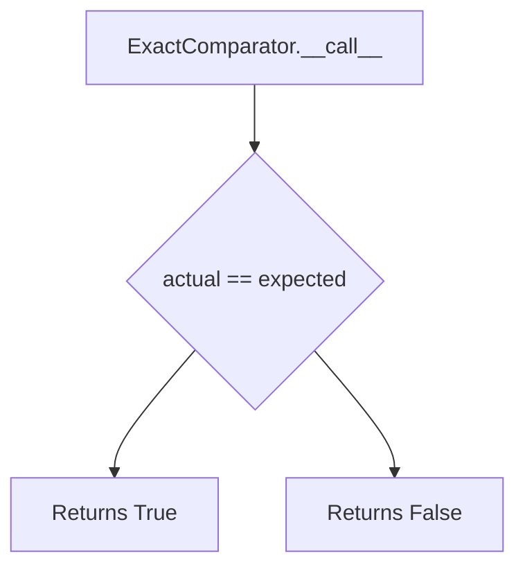
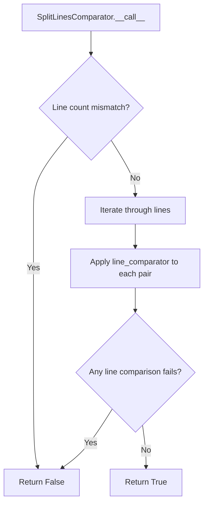
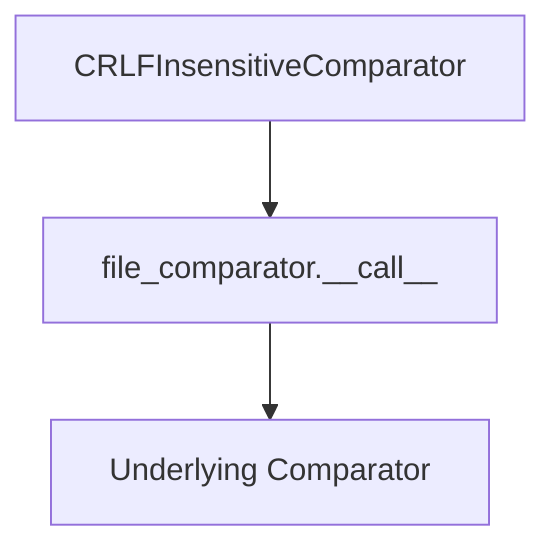
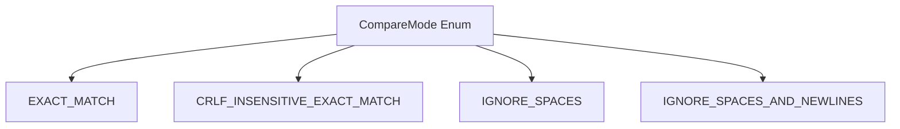

# `output_comparators.py`

## `onlinejudge_command.output_comparators.OutputComparator` · *class*

## Summary:
Abstract base class defining the interface for comparing actual and expected output bytes in competitive programming problem testing.

## Description:
The OutputComparator class serves as an abstract interface for implementing various output comparison strategies used in competitive programming platforms. It defines a standardized way to compare the actual output produced by a solution against the expected output, returning a boolean indicating whether they match according to the specific comparison logic implemented by concrete subclasses.

This abstraction allows different comparison strategies (exact match, token-based comparison, floating-point tolerance, etc.) to be used interchangeably while maintaining a consistent API for the testing framework.

## State:
- No instance attributes are defined in this abstract base class
- The class itself has no state beyond its abstract method interface
- All state and behavior must be implemented by concrete subclasses

## Lifecycle:
- Creation: Instances cannot be created directly due to the abstract nature of the class
- Usage: Concrete subclasses must implement the `__call__` method to provide specific comparison logic
- Destruction: No special cleanup required as this is an abstract base class

## Method Map:
```mermaid
graph TD
    A[OutputComparator] --> B[__call__(actual: bytes, expected: bytes) -> bool]
    B --> C[Concrete Implementation]
```

## Raises:
- NotImplementedError: Raised when the abstract `__call__` method is called directly on the base class (before being overridden by subclasses)

## Example:
```python
# Abstract usage - concrete implementations would be used in practice
from abc import ABC, abstractmethod

class ExactOutputComparator(OutputComparator):
    def __call__(self, actual: bytes, expected: bytes) -> bool:
        return actual == expected

# Usage would be:
comparator = ExactOutputComparator()
result = comparator(b"hello", b"hello")  # Returns True
```

### `onlinejudge_command.output_comparators.OutputComparator.__call__` · *method*

## Summary:
Compares actual program output with expected output and returns whether they match.

## Description:
This abstract method defines the interface for comparing program output in competitive programming contexts. It is designed to be implemented by subclasses that define specific comparison strategies (such as exact matching, floating-point tolerance, or whitespace normalization). The method is called during the judging process to determine if a submission's output is correct.

## Args:
    actual (bytes): The actual output produced by the program being tested
    expected (bytes): The expected output that the program should produce

## Returns:
    bool: True if the actual output matches the expected output according to the comparison strategy, False otherwise

## Raises:
    NotImplementedError: This is an abstract method that must be implemented by subclasses

## State Changes:
    Attributes READ: None
    Attributes WRITTEN: None

## Constraints:
    Preconditions: 
    - Both `actual` and `expected` parameters must be bytes objects
    - This method should not be called directly on the abstract base class
    
    Postconditions:
    - Returns a boolean value indicating match status
    - Implementation determines the specific comparison logic

## Side Effects:
    None

## `onlinejudge_command.output_comparators.ExactComparator` · *class*

## Summary:
Compares output bytes exactly for equality, implementing the OutputComparator interface.

## Description:
The ExactComparator class provides a strict byte-for-byte comparison between actual and expected output. It implements the OutputComparator abstract base class and is designed to be used in competitive programming environments where exact output matching is required. This comparator is typically used when solutions must produce identical output to the expected result, including whitespace and formatting.

## State:
- None: This is a stateless comparator that only uses the input parameters during comparison.

## Lifecycle:
- Creation: Instantiated directly with no constructor arguments required
- Usage: Called with two bytes objects (actual and expected) to compare them
- Destruction: No special cleanup required as it's stateless

## Method Map:


## Raises:
- NotImplementedError: Inherited from the abstract base class, though this implementation doesn't raise it directly

## Example:
```python
comparator = ExactComparator()
result = comparator(b"hello world", b"hello world")  # Returns True
result = comparator(b"hello world", b"hello world\n")  # Returns False
```

### `onlinejudge_command.output_comparators.ExactComparator.__call__` · *method*

## Summary:
Compares two byte sequences for exact equality and returns whether they match.

## Description:
This method performs a precise byte-by-byte comparison between the actual output and expected output. It is the core implementation of the exact matching strategy for output validation in competitive programming problem solving tools.

## Args:
    actual (bytes): The actual output produced by the solution
    expected (bytes): The expected output to compare against

## Returns:
    bool: True if the actual and expected byte sequences are identical, False otherwise

## Raises:
    None: This method does not raise any exceptions

## State Changes:
    Attributes READ: None
    Attributes WRITTEN: None

## Constraints:
    Preconditions: Both arguments must be bytes objects
    Postconditions: Returns a boolean indicating exact match status

## Side Effects:
    None: This method performs no I/O operations or external service calls

## `onlinejudge_command.output_comparators.FloatingPointNumberComparator` · *class*

## Summary:
Compares output data as floating-point numbers with configurable relative and absolute tolerance.

## Description:
This comparator treats output data as floating-point numbers and uses math.isclose() for comparison with configurable tolerance levels. When either value cannot be converted to a float, it falls back to exact byte string comparison. This is useful for comparing numerical outputs where small floating-point precision differences should be ignored.

## State:
- rel_tol: float, relative tolerance for floating-point comparison, must be >= 0
- abs_tol: float, absolute tolerance for floating-point comparison, must be >= 0
- Both tolerances should generally be <= 1 to avoid overly loose comparisons

## Lifecycle:
- Creation: Instantiate with rel_tol and abs_tol keyword arguments
- Usage: Call instance with actual and expected byte strings as arguments
- Destruction: No special cleanup required

## Method Map:
```mermaid
graph TD
    A[FloatingPointNumberComparator.__init__] --> B[FloatingPointNumberComparator.__call__]
    B --> C{Both convertible to float?}
    C -->|Yes| D[math.isclose()]
    C -->|No| E[bytes == bytes]
```

## Raises:
- None explicitly raised by __init__, but logs a warning via logger.warning() when max(rel_tol, abs_tol) > 1

## Example:
```python
comparator = FloatingPointNumberComparator(rel_tol=1e-9, abs_tol=1e-12)
result = comparator(b'3.14159', b'3.14160')  # Returns True if within tolerance
result = comparator(b'hello', b'world')     # Returns False (string comparison)
```

### `onlinejudge_command.output_comparators.FloatingPointNumberComparator.__init__` · *method*

## Summary:
Initializes a floating-point number comparator with relative and absolute tolerance settings.

## Description:
Configures the tolerance parameters for comparing floating-point numbers in output validation. This method sets up the relative and absolute tolerance values that will be used by the `math.isclose()` function when comparing numerical outputs.

## Args:
    rel_tol (float): Relative tolerance for floating-point comparison. Must be non-negative and typically less than or equal to 1.
    abs_tol (float): Absolute tolerance for floating-point comparison. Must be non-negative and typically less than or equal to 1.

## Returns:
    None: This method does not return a value.

## Raises:
    None: This method does not explicitly raise exceptions.

## State Changes:
    Attributes READ: None
    Attributes WRITTEN: 
        - self.rel_tol: Stores the relative tolerance parameter
        - self.abs_tol: Stores the absolute tolerance parameter

## Constraints:
    Preconditions:
        - Both `rel_tol` and `abs_tol` must be non-negative floats
        - Values should typically be ≤ 1 for meaningful comparisons
    Postconditions:
        - Instance attributes `self.rel_tol` and `self.abs_tol` are set to the provided values
        - If either tolerance exceeds 1, a warning is logged but the values are still stored

## Side Effects:
    - Issues a warning message via the logger if either tolerance exceeds 1

### `onlinejudge_command.output_comparators.FloatingPointNumberComparator.__call__` · *method*

## Summary:
Compares two byte sequences as floating-point numbers with configurable relative and absolute tolerance, falling back to exact string comparison when conversion fails.

## Description:
This method implements a custom comparison logic for competitive programming output validation. It attempts to convert both actual and expected byte sequences to floating-point numbers using float(). If both conversions succeed, it uses math.isclose() with the instance's relative and absolute tolerance settings (self.rel_tol and self.abs_tol) to determine equality. If either conversion fails, it performs exact byte-wise string comparison instead.

This comparison strategy is particularly useful for handling floating-point precision issues in competitive programming problems where small numerical differences should be considered equivalent.

## Args:
    actual (bytes): The actual output from program execution to compare
    expected (bytes): The expected output to compare against

## Returns:
    bool: True if both values are valid floats and are close within tolerance, or if both values are invalid floats and are exactly equal as bytes

## Raises:
    None explicitly raised

## State Changes:
    Attributes READ: self.rel_tol, self.abs_tol
    Attributes WRITTEN: None

## Constraints:
    Preconditions: 
    - Both arguments must be bytes objects
    - Class instance must have rel_tol and abs_tol attributes properly initialized
    - The method assumes these attributes are numeric values suitable for math.isclose()
    Postconditions:
    - Returns boolean indicating equality according to the comparison strategy

## Side Effects:
    None

## `onlinejudge_command.output_comparators.SplitComparator` · *class*

*No documentation generated.*

### `onlinejudge_command.output_comparators.SplitComparator.__init__` · *method*

## Summary:
Initializes a SplitComparator with a word comparator for comparing individual words.

## Description:
This method sets up a SplitComparator instance by storing the provided word comparator that will be used to compare individual words when the comparator is invoked. The SplitComparator splits input byte strings into words and applies this stored comparator to each corresponding pair of words.

## Args:
    word_comparator (OutputComparator): An OutputComparator instance that will be used to compare individual words from the actual and expected byte strings.

## Returns:
    None: This method does not return a value.

## Raises:
    None: This method does not explicitly raise exceptions.

## State Changes:
    Attributes READ: None
    Attributes WRITTEN: self.word_comparator

## Constraints:
    Preconditions: The word_comparator parameter must be an instance of OutputComparator or a subclass thereof.
    Postconditions: After execution, self.word_comparator will reference the provided word_comparator instance.

## Side Effects:
    None: This method performs no I/O operations or external service calls.

### `onlinejudge_command.output_comparators.SplitComparator.__call__` · *method*

*No documentation generated.*

## `onlinejudge_command.output_comparators.SplitLinesComparator` · *class*

## Summary:
A line-based output comparator that splits input into lines and applies a line comparator to each pair of lines.

## Description:
The SplitLinesComparator processes multi-line output by splitting both actual and expected outputs into lines, verifying they have equal line counts, and applying a provided line comparator to each corresponding line pair.

This comparator enables testing of programs that produce multi-line output by leveraging existing line comparison logic.

## State:
- line_comparator: OutputComparator instance used to compare individual lines
  - Type: OutputComparator
  - Valid range: Any concrete implementation of OutputComparator
  - Invariant: Must be a valid OutputComparator instance that accepts bytes arguments

## Lifecycle:
- Creation: Instantiate with a line_comparator parameter (required)
- Usage: Call the instance with actual and expected bytes to compare
- Destruction: No special cleanup required (uses composition, no resources to manage)

## Method Map:


## Raises:
- None explicitly raised by __init__
- Any exceptions raised by the wrapped line_comparator during comparison

## Example:
```python
# Create a line comparator (e.g., for exact string matching)
exact_line_comp = ExactLineComparator()

# Wrap it with SplitLinesComparator
split_comparator = SplitLinesComparator(exact_line_comp)

# Compare multi-line outputs
actual_output = b"line1\nline2\nline3"
expected_output = b"line1\nline2\nline3"
result = split_comparator(actual_output, expected_output)  # Returns True
```

### `onlinejudge_command.output_comparators.SplitLinesComparator.__init__` · *method*

## Summary:
Initializes a SplitLinesComparator with a line-by-line comparator for comparing multi-line output.

## Description:
Constructs a SplitLinesComparator that splits output into lines and applies the provided comparator to each corresponding pair of lines. This enables flexible comparison strategies where individual lines can be compared using different criteria (exact match, floating-point tolerance, etc.).

## Args:
    line_comparator (OutputComparator): An OutputComparator instance that will be used to compare individual lines of actual and expected output.

## Returns:
    None: This method initializes the object's state and does not return a value.

## Raises:
    None: This method does not explicitly raise exceptions.

## State Changes:
    Attributes READ: None
    Attributes WRITTEN: self.line_comparator

## Constraints:
    Preconditions: The line_comparator parameter must be a valid OutputComparator instance
    Postconditions: After initialization, self.line_comparator will reference the provided line_comparator instance

## Side Effects:
    None: This method performs no I/O operations or external service calls.

### `onlinejudge_command.output_comparators.SplitLinesComparator.__call__` · *method*

## Summary:
Compares two byte sequences line by line using an embedded line comparator.

## Description:
This method splits both actual and expected byte sequences into lines, then compares each corresponding pair of lines using the embedded line_comparator. It returns False immediately if the number of lines differs between sequences, otherwise it performs line-by-line comparison.

## Args:
    actual (bytes): The actual output bytes to compare
    expected (bytes): The expected output bytes to compare against

## Returns:
    bool: True if both sequences have the same number of lines and all corresponding lines match, False otherwise

## Raises:
    None explicitly raised

## State Changes:
    Attributes READ: self.line_comparator
    Attributes WRITTEN: None

## Constraints:
    Preconditions: Both actual and expected must be valid bytes objects
    Postconditions: Returns a boolean indicating line-by-line equality of the sequences

## Side Effects:
    None

## `onlinejudge_command.output_comparators.CRLFInsensitiveComparator` · *class*

## Summary:
A decorator that normalizes CRLF line endings to LF before performing output comparison.

## Description:
This class wraps another `OutputComparator` instance and normalizes all CRLF (carriage return + line feed) sequences to LF (line feed) sequences before passing the normalized data to the wrapped comparator. This ensures that output comparisons are insensitive to platform-specific line ending differences.

## State:
- `file_comparator`: The wrapped `OutputComparator` instance used for the actual comparison
  - Type: `OutputComparator`
  - Valid range/values: Must be a valid `OutputComparator` instance
  - Invariant: Must be a valid comparator that accepts two bytes arguments and returns a boolean

## Lifecycle:
- Creation: Instantiate with a valid `OutputComparator` instance
- Usage: Call the instance with `actual` and `expected` bytes parameters
- Destruction: No special cleanup required

## Method Map:


## Raises:
- No explicit exceptions raised by `__init__` or `__call__` methods
- The wrapped `file_comparator` may raise exceptions during comparison, which will propagate upward

## Example:
```python
# Create a basic exact byte comparator
exact_comparator = ExactByteComparator()

# Wrap it to make it CRLF insensitive
crlf_comparator = CRLFInsensitiveComparator(exact_comparator)

# Compare outputs with different line endings
actual_output = b"Hello\r\nWorld\r\n"
expected_output = b"Hello\nWorld\n"

result = crlf_comparator(actual_output, expected_output)  # Returns True
```

### `onlinejudge_command.output_comparators.CRLFInsensitiveComparator.__init__` · *method*

## Summary:
Initializes a CRLFInsensitiveComparator with a nested file comparator for handling line ending differences in output comparison.

## Description:
This constructor creates a CRLFInsensitiveComparator instance that wraps another OutputComparator to normalize CRLF (carriage return + line feed) line endings to LF (line feed) before performing comparisons. This is useful for comparing program outputs where the line ending convention may differ between systems (Windows vs Unix-style).

## Args:
    file_comparator (OutputComparator): Another output comparator instance to be used for the actual comparison after normalizing line endings. Must be a valid OutputComparator implementation.

## Returns:
    None: This method initializes the instance and does not return a value.

## Raises:
    None: This method does not explicitly raise exceptions.

## State Changes:
    Attributes READ: None
    Attributes WRITTEN: self.file_comparator

## Constraints:
    Preconditions: The file_comparator parameter must be a valid OutputComparator instance.
    Postconditions: The instance will store the provided file_comparator and use it in subsequent comparison operations.

## Side Effects:
    None: This method performs no I/O operations or external service calls. It only stores a reference to the provided comparator.

### `onlinejudge_command.output_comparators.CRLFInsensitiveComparator.__call__` · *method*

## Summary:
Normalizes CRLF line endings in byte sequences before comparing them using the wrapped comparator.

## Description:
This method implements the comparison logic for the CRLFInsensitiveComparator class. It takes two byte sequences (actual and expected output) and normalizes any CRLF (\r\n) line endings to LF (\n) before passing them to the underlying file_comparator. This ensures that output comparisons are insensitive to the line ending format used by different operating systems.

The method is part of the output comparison pipeline in the online judge system, where it's used to handle platform-specific line ending differences while maintaining the core comparison logic.

## Args:
    actual (bytes): The actual output bytes to compare
    expected (bytes): The expected output bytes to compare

## Returns:
    bool: True if the normalized actual and expected bytes are considered equivalent by the wrapped file_comparator, False otherwise

## Raises:
    Exception: Any exceptions raised by the wrapped file_comparator during comparison

## State Changes:
    Attributes READ: self.file_comparator
    Attributes WRITTEN: None

## Constraints:
    Preconditions: 
    - Both actual and expected parameters must be bytes objects
    - self.file_comparator must be a callable that accepts two bytes arguments and returns a bool
    
    Postconditions:
    - The returned boolean value represents the comparison result after CRLF normalization
    - The original byte sequences remain unchanged

## Side Effects:
    None - This method is pure and doesn't cause any I/O operations or external service calls

## `onlinejudge_command.output_comparators.CompareMode` · *class*

## Summary:
Enumeration defining different modes for comparing program output in competitive programming contexts.

## Description:
The CompareMode enum provides various strategies for determining whether two output strings are equivalent, accounting for different formatting requirements commonly encountered in competitive programming problem solving. This abstraction allows for flexible output validation that can handle variations in whitespace, line endings, and formatting while maintaining strict comparison when needed.

## State:
- EXACT_MATCH: 'exact-match' - Strict character-by-character comparison
- CRLF_INSENSITIVE_EXACT_MATCH: 'crlf-insensitive-exact-match' - Comparison ignoring Windows-style line endings (CRLF vs LF)
- IGNORE_SPACES: 'ignore-spaces' - Comparison ignoring whitespace characters
- IGNORE_SPACES_AND_NEWLINES: 'ignore-spaces-and-newlines' - Comparison ignoring both spaces and newline characters

## Lifecycle:
- Creation: Instantiated automatically as part of the enum definition
- Usage: Used as a parameter to output comparison functions or methods that require different comparison strategies
- Destruction: Managed automatically by Python's garbage collection

## Method Map:


## Raises:
None - This is a simple enum class with no constructor or methods that raise exceptions.

## Example:
```python
from onlinejudge_command.output_comparators import CompareMode

# Using the enum values
mode1 = CompareMode.EXACT_MATCH
mode2 = CompareMode.IGNORE_SPACES

# These can be passed to comparison functions
def validate_output(actual, expected, mode):
    if mode == CompareMode.EXACT_MATCH:
        return actual == expected
    elif mode == CompareMode.IGNORE_SPACES:
        return actual.strip() == expected.strip()
    # ... other comparison logic
```

## `onlinejudge_command.output_comparators.check_lines_match` · *function*

## Summary
Compares two string outputs using various comparison modes to determine if they match according to specified rules.

## Description
This function performs line-by-line comparison of two string outputs using different comparison strategies based on the provided compare_mode parameter. It serves as a centralized interface for output validation in testing scenarios, allowing flexible matching criteria such as exact matching, whitespace-insensitive matching, or CRLF-insensitive matching.

The function is designed to be used in testing contexts where output validation needs to accommodate different formatting requirements while maintaining strict control over which comparison modes are allowed.

## Args
- a (str): First string to compare (typically actual output)
- b (str): Second string to compare (typically expected output)
- compare_mode (CompareMode): The comparison strategy to use, one of:
  - EXACT_MATCH: Strict byte-for-byte comparison
  - CRLF_INSENSITIVE_EXACT_MATCH: Strict comparison but treats CRLF and LF the same
  - IGNORE_SPACES: Compares by splitting on whitespace and comparing individual tokens
  - IGNORE_SPACES_AND_NEWLINES: Not allowed for this function (raises RuntimeError)

## Returns
bool: True if the strings match according to the specified comparison mode, False otherwise

## Raises
RuntimeError: When compare_mode is set to IGNORE_SPACES_AND_NEWLINES, as this comparison mode is not supported by this function

## Constraints
Preconditions:
- Both input strings must be valid UTF-8 strings
- compare_mode must be one of the defined CompareMode enum values
- The IGNORE_SPACES_AND_NEWLINES mode is explicitly forbidden for this function

Postconditions:
- The function always returns a boolean value
- Input strings are encoded to bytes before processing
- All comparison modes except IGNORE_SPACES_AND_NEWLINES are supported

## Side Effects
None

## Control Flow
```mermaid
flowchart TD
    A[check_lines_match called] --> B{compare_mode}
    B -->|EXACT_MATCH| C[Create ExactComparator]
    B -->|CRLF_INSENSITIVE_EXACT_MATCH| D[Create CRLFInsensitiveComparator(ExactComparator)]
    B -->|IGNORE_SPACES| E[Create SplitComparator(ExactComparator)]
    B -->|IGNORE_SPACES_AND_NEWLINES| F[raise RuntimeError]
    B -->|Invalid mode| G[assert False]
    C --> H[comparator(a.encode(), b.encode())]
    D --> H
    E --> H
    F --> I[Return False]
    G --> I
    H --> I[Return result]
```

## Examples
```python
# Exact match comparison
result = check_lines_match("hello\nworld", "hello\nworld", compare_mode=CompareMode.EXACT_MATCH)
# Returns True

# CRLF insensitive comparison
result = check_lines_match("hello\r\nworld", "hello\nworld", compare_mode=CompareMode.CRLF_INSENSITIVE_EXACT_MATCH)
# Returns True

# Space insensitive comparison
result = check_lines_match("hello world", "hello   world", compare_mode=CompareMode.IGNORE_SPACES)
# Returns True
```

