# `pretty_printers.py`

## `onlinejudge_command.pretty_printers._PrettyTokenType` · *class*

## Summary:
Defines token types used for pretty-printing output with different visual formatting and highlighting.

## Description:
This private enumeration represents the various token types that can be used when formatting output for display. It provides a standardized set of categories that help distinguish different kinds of content in formatted output, enabling features like syntax highlighting, difference highlighting, and proper formatting of whitespace and structural elements.

The enum is primarily used internally by the pretty printing system to categorize different parts of output content so they can be rendered with appropriate styling or formatting.

## State:
- All attributes are enum members with string values representing their type names:
  - BODY: Represents main content body text
  - BODY_HIGHLIGHT_LEFT: Left-side highlighted content in comparisons
  - BODY_HIGHLIGHT_RIGHT: Right-side highlighted content in comparisons  
  - WHITESPACE: Whitespace characters that should be preserved
  - NEWLINE: Newline characters
  - HINT: Additional hint or annotation text
  - LINENO: Line number information
  - OTHERS: Other unspecified content types

## Lifecycle:
- Creation: Instantiated automatically when the enum class is defined
- Usage: Enum members are accessed directly as class attributes (e.g., `_PrettyTokenType.BODY`)
- Destruction: Managed automatically by Python's garbage collection

## Method Map:
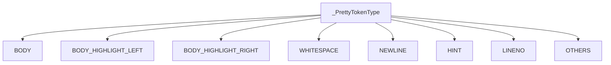

## Raises:
- No exceptions are raised during initialization as this is a simple enum definition

## Example:
```python
# Accessing enum values
token_type = _PrettyTokenType.BODY
token_type = _PrettyTokenType.WHITESPACE

# Using in pretty printing context
# (Typical usage would involve passing these to formatting functions)
```

## `onlinejudge_command.pretty_printers._PrettyToken` · *class*

## Summary:
Represents a token used in pretty printing with a type and string value.

## Description:
A named tuple that encapsulates a token for pretty printing output. Each token consists of a type from the `_PrettyTokenType` enum and a string value. This class serves as a building block for constructing formatted output representations, particularly for comparing and displaying program outputs with visual highlighting.

## State:
- `type`: `_PrettyTokenType` - The type of the token, indicating its semantic role in the output (e.g., BODY, HIGHLIGHT, WHITESPACE)
- `value`: `str` - The actual string content of the token

## Lifecycle:
- Creation: Instantiated using positional arguments matching the field names (`_PrettyTokenType`, `str`)
- Usage: Tokens are typically created and consumed as part of a tokenization pipeline for pretty printing
- Destruction: No special cleanup required as it's a simple named tuple

## Method Map:
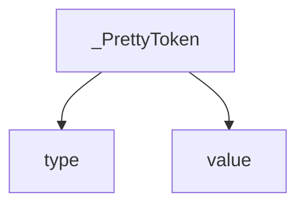

## Raises:
No exceptions are raised during initialization as it's a simple named tuple.

## Example:
```python
from onlinejudge_command.pretty_printers import _PrettyToken, _PrettyTokenType

# Create a token representing body text
token = _PrettyToken(_PrettyTokenType.BODY, "Hello World")
print(token.type)   # _PrettyTokenType.BODY
print(token.value)  # "Hello World"
```

## `onlinejudge_command.pretty_printers._optimize_tokens` · *function*

## Summary:
Merges consecutive tokens of the same type into single tokens with concatenated values.

## Description:
This function optimizes a list of pretty-printing tokens by combining adjacent tokens that have identical types. It reduces the number of tokens by merging their string values while preserving the token types. This optimization helps reduce overhead in subsequent processing steps and improves efficiency when rendering formatted output.

The function is typically called during the tokenization and formatting process of output comparison and presentation in the online judge command system.

## Args:
    tokens (List[_PrettyToken]): A list of pretty-printing tokens to optimize. Each token consists of a type (_PrettyTokenType) and a string value.

## Returns:
    List[_PrettyToken]: A new list of tokens where consecutive tokens of the same type have been merged into single tokens with concatenated values.

## Raises:
    None explicitly raised

## Constraints:
    Preconditions:
    - Input tokens list can be empty
    - Each token in the input list must have valid _PrettyTokenType and string value
    
    Postconditions:
    - Output list contains the same total content as input but with fewer tokens
    - Tokens of the same type are merged consecutively
    - Order of token types is preserved
    - All original token values are preserved (just concatenated)

## Side Effects:
    None

## Control Flow:
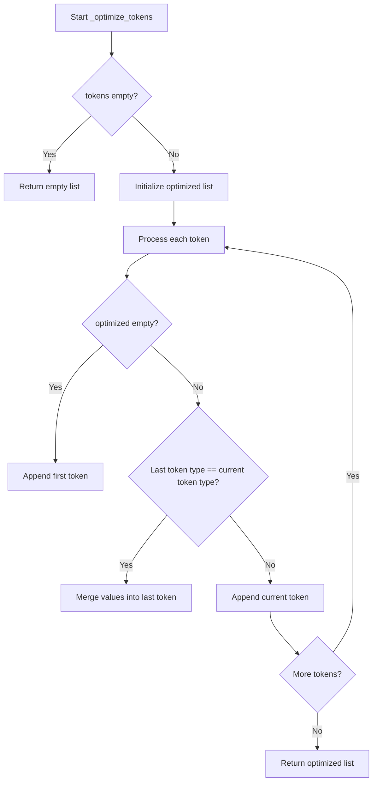

## Examples:
Example 1: Merging consecutive BODY tokens
Input: [BODY("hello"), BODY(" "), BODY("world")]
Output: [BODY("hello world")]

Example 2: Mixed token types
Input: [BODY("line1"), NEWLINE("\n"), BODY("line2"), BODY("end")]
Output: [BODY("line1\n"), BODY("line2end")]

Example 3: Empty input
Input: []
Output: []

## `onlinejudge_command.pretty_printers._tokenize_str` · *function*

## Summary:
Breaks a string into tokens based on whitespace and non-whitespace character groups.

## Description:
This function processes a string and splits it into tokens where consecutive whitespace characters form one token and consecutive non-whitespace characters form another token. This is used for pretty-printing and formatting operations where whitespace handling is important.

## Args:
    s (str): The input string to tokenize.

## Returns:
    List[_PrettyToken]: A list of tokens where each token contains a type (_PrettyTokenType) and its string value. Whitespace characters are grouped into WHITESPACE tokens, and non-whitespace characters are grouped into BODY tokens.

## Raises:
    None explicitly raised.

## Constraints:
    Precondition: Input must be a string.
    Postcondition: The returned list of tokens will contain at least one token, and the concatenation of all token values will equal the original input string.

## Side Effects:
    None.

## Control Flow:
```mermaid
flowchart TD
    A[Start _tokenize_str] --> B{len(s) > 0?}
    B -- Yes --> C[Initialize tokens=[], l=0]
    C --> D{l < len(s)?}
    D -- Yes --> E[r = l+1]
    E --> F{r < len(s) AND (s[l] in ' \\t') == (s[r] in ' \\t')?}
    F -- Yes --> G[r++]
    G --> F
    F -- No --> H{is whitespace?}
    H -- Yes --> I[typ = WHITESPACE]
    H -- No --> J[typ = BODY]
    I --> K[Create _PrettyToken(typ, s[l:r])]
    J --> K
    K --> L[tokens.append(token)]
    L --> M[l = r]
    M --> D
    D -- No --> N[Return tokens]
    B -- No --> N
```

## Examples:
    >>> _tokenize_str("hello world")
    [_PrettyToken(type=_PrettyTokenType.BODY, value="hello"), _PrettyToken(type=_PrettyTokenType.WHITESPACE, value=" "), _PrettyToken(type=_PrettyTokenType.BODY, value="world")]
    
    >>> _tokenize_str("  hello   world  ")
    [_PrettyToken(type=_PrettyTokenType.WHITESPACE, value="  "), _PrettyToken(type=_PrettyTokenType.BODY, value="hello"), _PrettyToken(type=_PrettyTokenType.WHITESPACE, value="   "), _PrettyToken(type=_PrettyTokenType.BODY, value="world"), _PrettyToken(type=_PrettyTokenType.WHITESPACE, value="  ")]

## `onlinejudge_command.pretty_printers._tokenize_line` · *function*

## Summary:
Breaks a line of text into structured tokens for pretty printing, separating body content from trailing whitespace and newlines.

## Description:
This function processes a line of text by splitting it into meaningful components for formatting and display purposes. It handles the separation of actual content (body) from trailing whitespace and newline characters, making it easier to apply different formatting styles to different parts of the line.

The function is designed to be used in pretty printing contexts where visual distinction between different types of content is important, such as when displaying differences between expected and actual output in competitive programming problem solving tools.

## Args:
    line (str): A string representing a line of text that may contain trailing whitespace and newlines.

## Returns:
    List[_PrettyToken]: A list of _PrettyToken objects representing the structured components of the input line. Each token contains a type from _PrettyTokenType and its corresponding string value.

## Raises:
    None explicitly raised by this function.

## Constraints:
    Preconditions:
    - Input line must be a string
    - The function assumes proper handling of line endings and whitespace
    
    Postconditions:
    - All characters from the input line are represented in the returned tokens
    - Tokens are ordered according to their position in the original line
    - Newline tokens are properly identified and separated from body content

## Side Effects:
    None.

## Control Flow:
```mermaid
flowchart TD
    A[Start _tokenize_line] --> B{Is body non-empty?}
    B -- Yes --> C[Call _tokenize_str(body)]
    B -- No --> D[Skip body processing]
    C --> E[Append _tokenize_str results]
    D --> E
    E --> F{Is newline non-empty?}
    F -- Yes --> G{Is newline in ('\\n', '\\r\\n')?}
    G -- Yes --> H[Add NEWLINE token]
    G -- No --> I[Extract whitespace]
    I --> J[Add WHITESPACE token if exists]
    J --> K[Add HINT token]
    K --> L[Add NEWLINE token if exists]
    F -- No --> M[Return tokens]
    H --> M
    L --> M
```

## Examples:
    Example 1: Processing a normal line
    Input: "hello world\n"
    Output: [_PrettyToken(_PrettyTokenType.BODY, "hello world"), _PrettyToken(_PrettyTokenType.NEWLINE, "\n")]

    Example 2: Processing a line with trailing whitespace
    Input: "test   \r\n"
    Output: [_PrettyToken(_PrettyTokenType.BODY, "test"), _PrettyToken(_PrettyTokenType.WHITESPACE, "   "), _PrettyToken(_PrettyTokenType.HINT, "(trailing whitespace)"), _PrettyToken(_PrettyTokenType.NEWLINE, "\r\n")]

## `onlinejudge_command.pretty_printers._decode_with_recovery` · *function*

## Summary:
Decodes bytes to text with graceful error recovery, returning formatting tokens and the decoded content.

## Description:
Handles byte-to-text conversion while providing error recovery mechanisms. When the initial decode attempt fails due to UnicodeDecodeError, it captures the error as a hint token and continues with error replacement decoding. This function is designed to prevent complete failure when encountering malformed or unexpected byte sequences in text processing.

## Args:
    content (bytes): Raw byte data to be decoded into text format

## Returns:
    Tuple[List[_PrettyToken], str]: A tuple containing:
        - List of _PrettyToken objects representing formatting information (including error hints)
        - Decoded text string with recovered content

## Raises:
    None: This function handles all potential UnicodeDecodeError exceptions internally

## Constraints:
    Preconditions:
        - Input content must be of type bytes
    Postconditions:
        - Always returns a valid string (even if recovered with replacement characters)
        - Tokens list may contain error hint tokens when decoding issues occur

## Side Effects:
    None: This function performs no I/O operations or external state mutations

## Control Flow:
```mermaid
flowchart TD
    A[Start _decode_with_recovery] --> B{Try decode()}
    B -- Success --> C[Return tokens=[], text]
    B -- UnicodeDecodeError --> D[Add hint token]
    D --> E[Decode with errors='replace']
    E --> F[Return tokens, text]
```

## Examples:
```python
# Normal case - successful decode
content = b"Hello World"
tokens, text = _decode_with_recovery(content)
# Returns ([], "Hello World")

# Error case - decode failure with recovery
content = b"\xff\xfe\xfd"
tokens, text = _decode_with_recovery(content)
# Returns ([_PrettyToken(HINT, "codec can't decode...")], "���")
```

## `onlinejudge_command.pretty_printers._warn_if_empty` · *function*

## Summary:
Adds contextual warning tokens to a list of pretty-printed tokens when the content is empty or lacks proper formatting.

## Description:
This utility function enhances tokenized output by appending hint tokens when specific formatting conditions are detected. It serves as a diagnostic aid in pretty-printing systems to alert users about potentially problematic output states such as empty content, missing trailing newlines, or only newline characters.

## Args:
    tokens (List[_PrettyToken]): A list of pretty-printing tokens, each containing a type and value. The tokens are typically generated during the pretty-printing process of formatted output.

## Returns:
    List[_PrettyToken]: The original list of tokens with additional hint tokens appended when applicable. Returns a new list with a single HINT token if the input was empty.

## Raises:
    None explicitly raised by this function.

## Constraints:
    Preconditions:
    - Input tokens must be a list of _PrettyToken objects
    - Each token must have a valid _PrettyTokenType type
    
    Postconditions:
    - The returned list contains all original tokens plus zero or more hint tokens
    - The original tokens list is not mutated (a new list is returned)

## Side Effects:
    None

## Control Flow:
```mermaid
flowchart TD
    A[Start _warn_if_empty] --> B{tokens empty?}
    B -- Yes --> C[Return [(empty)] hint]
    B -- No --> D[tokens[-1] BODY?]
    D -- Yes --> E[Append (no trailing newline) hint]
    D -- No --> F[All tokens NEWLINE?]
    F -- Yes --> G[Append (only newline) hint]
    F -- No --> H[Return original tokens]
    E --> H
    G --> H
```

## Examples:
    Example 1 - Empty tokens:
        Input: []
        Output: [(_PrettyTokenType.HINT, '(empty)')]

    Example 2 - Tokens with body content:
        Input: [(_PrettyTokenType.BODY, 'content')]
        Output: [(_PrettyTokenType.BODY, 'content'), (_PrettyTokenType.HINT, '(no trailing newline)')]

    Example 3 - Only newlines:
        Input: [(_PrettyTokenType.NEWLINE, '\n'), (_PrettyTokenType.NEWLINE, '\n')]
        Output: [(_PrettyTokenType.NEWLINE, '\n'), (_PrettyTokenType.NEWLINE, '\n'), (_PrettyTokenType.HINT, '(only newline)')]

## `onlinejudge_command.pretty_printers._tokenize_large_file_content` · *function*

## Summary:
Processes large file content by tokenizing it into displayable chunks while respecting size limits and preserving formatting.

## Description:
This function handles the tokenization of large file content for pretty printing, applying different strategies based on content characteristics to ensure efficient display. It's designed to prevent overwhelming output when dealing with very large files by selectively showing portions of content with appropriate hints.

The function implements three different strategies for handling large content:
1. Do nothing strategy - processes all content normally
2. Line-based strategy - shows head and tail portions with line count hint
3. Character-based strategy - shows head and tail portions with character count hint

This logic is extracted into its own function to separate the concerns of large file handling from the general tokenization process, making the code more modular and testable.

## Args:
    content (bytes): Raw byte content to tokenize
    limit (int): Maximum number of lines/characters to display before applying truncation strategies
    head (int): Number of lines/characters to show from the beginning of content
    tail (int): Number of lines/characters to show from the end of content
    char_in_line (int): Average number of characters per line used for character-based truncation

## Returns:
    List[_PrettyToken]: A list of formatted tokens representing the processed content, suitable for pretty printing

## Raises:
    AssertionError: When head + tail >= limit, indicating invalid configuration parameters

## Constraints:
    Preconditions:
    - head + tail must be less than limit (assertion enforced)
    - content should be valid bytes that can be decoded to text
    - limit, head, and tail should be non-negative integers
    
    Postconditions:
    - The returned list of tokens will never be empty (empty content results in a hint token)
    - All tokens will be properly formatted for pretty printing

## Side Effects:
    None

## Control Flow:
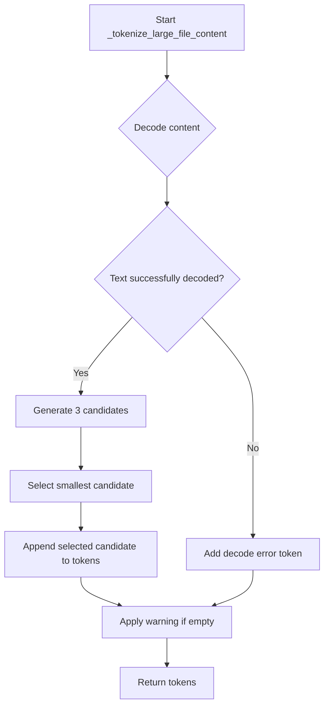

## Examples:
    # Basic usage with line-based truncation
    content = b"line1\nline2\nline3\n..."  
    tokens = _tokenize_large_file_content(
        content=content,
        limit=100,
        head=10,
        tail=10,
        char_in_line=80
    )
    
    # Usage with character-based truncation
    long_content = b"very long content..." * 1000
    tokens = _tokenize_large_file_content(
        content=long_content,
        limit=50,
        head=20,
        tail=20,
        char_in_line=100
    )

## `onlinejudge_command.pretty_printers._replace_whitespace` · *function*

## Summary:
Replaces common whitespace characters with visible representations for clearer display.

## Description:
Transforms space, tab, and carriage return characters into visible alternatives (_ for space, \\t for tab, \\r for carriage return) to make whitespace characters more distinguishable in output.

## Args:
    s (str): Input string containing whitespace characters to be replaced.

## Returns:
    str: String with whitespace characters replaced by their visible representations.

## Raises:
    None: This function does not raise any exceptions.

## Constraints:
    Preconditions: Input must be a string.
    Postconditions: All space, tab, and carriage return characters are replaced with their respective visual representations.

## Side Effects:
    None: This function has no side effects.

## Control Flow:
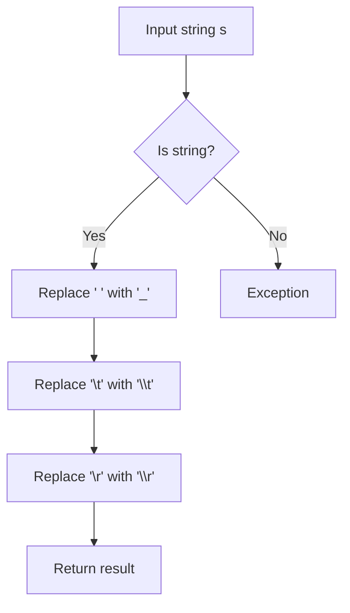

## Examples:
    >>> _replace_whitespace("hello world")
    'hello_world'
    
    >>> _replace_whitespace("line1\ttabbed")
    'line1\\ttabbed'
    
    >>> _replace_whitespace("carriage\rreturn")
    'carriage\\rreturn'
```

## `onlinejudge_command.pretty_printers._render_tokens` · *function*

## Summary:
Formats a list of styled tokens into a colored, formatted string for display.

## Description:
Processes a list of token-value pairs, applying different visual formatting (colors, bolding) based on token types. This function serves as a centralized formatter for pretty-printed output, separating presentation logic from content generation.

## Args:
    tokens (List[_PrettyToken]): A list of token-type and value pairs to format.
    font_bold (Optional[Callable[[str], str]]): Function to apply bold formatting. Defaults to colorama-based bold.
    font_dim (Optional[Callable[[str], str]]): Function to apply dim/dark formatting. Defaults to colorama-based dim.
    font_red (Optional[Callable[[str], str]]): Function to apply red color formatting. Defaults to colorama-based red.
    font_blue (Optional[Callable[[str], str]]): Function to apply blue color formatting. Defaults to colorama-based blue.
    font_normal (Optional[Callable[[str], str]]): Function to apply normal formatting. Defaults to identity function.

## Returns:
    str: A formatted string with appropriate styling applied to each token based on its type.

## Raises:
    AssertionError: When an unexpected token type is encountered (should not happen with valid inputs).

## Constraints:
    Preconditions:
        - All tokens must be valid _PrettyToken tuples with proper _PrettyTokenType keys
        - Token values must be strings
    Postconditions:
        - Returns a properly formatted string with all tokens processed
        - No side effects occur during execution

## Side Effects:
    - Uses colorama for terminal formatting (stdout side effects)
    - May modify the appearance of terminal output through ANSI escape codes

## Control Flow:
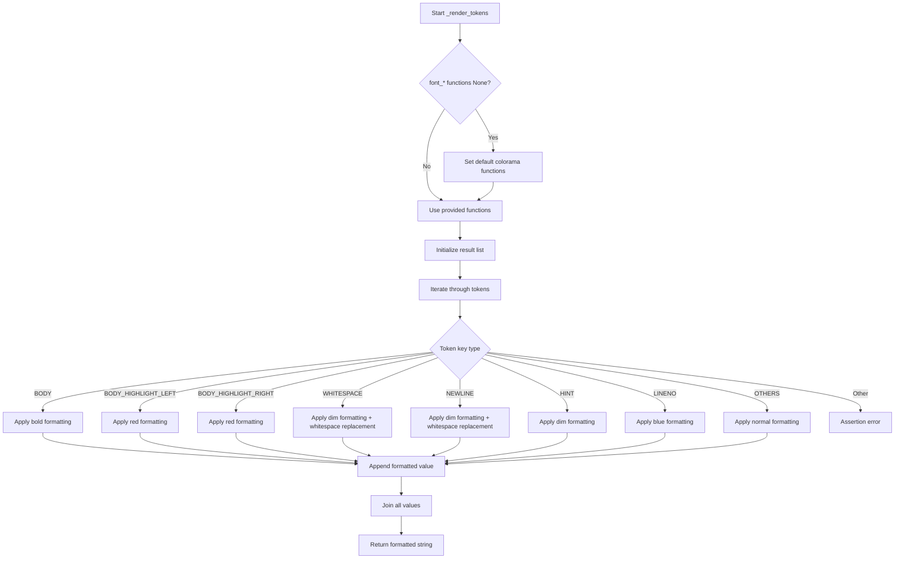

## Examples:
    # Basic usage with default formatting
    tokens = [(_PrettyTokenType.BODY, "Hello"), (_PrettyTokenType.WHITESPACE, " "), (_PrettyTokenType.BODY, "World")]
    result = _render_tokens(tokens=tokens)
    # Returns: "Hello World" with appropriate formatting
    
    # Usage with custom formatting functions
    def custom_bold(text):
        return f"**{text}**"
    
    tokens = [(_PrettyTokenType.BODY, "Important")]
    result = _render_tokens(tokens=tokens, font_bold=custom_bold)
    # Returns: "**Important**" with custom bold formatting

## `onlinejudge_command.pretty_printers._get_terminal_size` · *function*

## Summary:
Returns the terminal width for formatting output, with a minimum width of 40 characters.

## Description:
This function retrieves the current terminal width using `shutil.get_terminal_size()` and ensures a minimum width of 40 characters. It's designed to prevent formatting issues when the terminal is too narrow.

## Args:
    None

## Returns:
    int: The terminal width in characters, guaranteed to be at least 40.

## Raises:
    OSError: When `shutil.get_terminal_size()` fails to determine terminal size.

## Constraints:
    Preconditions: The environment must support terminal size detection.
    Postconditions: The returned value is always >= 40.

## Side Effects:
    None

## Control Flow:
```mermaid
flowchart TD
    A[Call get_terminal_size] --> B{Success?}
    B -- Yes --> C[Get width]
    C --> D[Return max(width, 40)]
    B -- No --> E[Raise OSError]
```

## Examples:
    >>> _get_terminal_size()
    80
```

## `onlinejudge_command.pretty_printers.make_pretty_large_file_content` · *function*

## Summary:
Formats large binary file content into a readable string representation with truncation and highlighting.

## Description:
This function processes large binary file content by converting it to a human-readable string format. It intelligently truncates content based on configurable limits while preserving important structural elements like line numbers, whitespace, and highlighting. The function is designed to handle files that are too large to display in their entirety, making them suitable for terminal output.

The function extracts this logic into its own component to separate the concerns of content processing, tokenization, and rendering, allowing for easier testing and reuse of each individual step.

## Args:
    content (bytes): Binary content of the file to be formatted
    limit (int): Maximum number of lines to display before truncation occurs
    head (int): Number of lines to show from the beginning of the file
    tail (int): Number of lines to show from the end of the file

## Returns:
    str: Formatted string representation of the file content with appropriate truncation and styling

## Raises:
    AssertionError: When head + tail >= limit (invalid configuration)

## Constraints:
    Preconditions:
        - head + tail must be less than limit to avoid invalid truncation
        - content should be valid bytes that can be decoded to text
    Postconditions:
        - Returns a properly formatted string with appropriate truncation markers
        - Always returns a string, even for empty content

## Side Effects:
    - Calls shutil.get_terminal_size() to determine terminal width
    - Uses colorama for terminal formatting
    - May print warnings to log if content is empty or contains only newlines

## Control Flow:
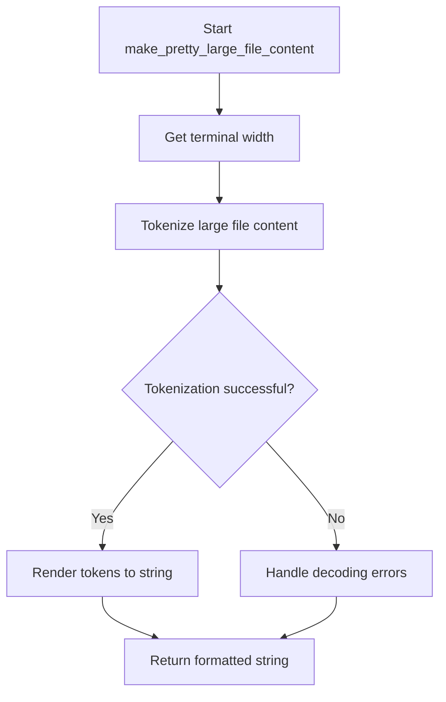

## Examples:
    # Basic usage with default settings
    content = b"Line 1\nLine 2\nLine 3\nLine 4\nLine 5"
    result = make_pretty_large_file_content(content, limit=3, head=1, tail=1)
    # Returns formatted string showing first line, truncation hint, and last line
    
    # Usage with larger content
    large_content = b"Line " + b"\nLine ".join(str(i).encode() for i in range(1000))
    result = make_pretty_large_file_content(large_content, limit=10, head=3, tail=3)
    # Returns formatted string with first 3 lines, truncation hint, and last 3 lines
```

## `onlinejudge_command.pretty_printers._tokenize_file_content_without_snipping` · *function*

## Summary:
Converts raw byte content into a structured list of formatted tokens for pretty printing without snipping.

## Description:
Processes binary file content by decoding it with error recovery, tokenizing each line, and adding appropriate formatting hints. This function serves as the core tokenizer for pretty-printing file content while preserving formatting information and handling edge cases like empty files or missing newlines.

## Args:
    content (bytes): Raw binary content to be tokenized for pretty printing

## Returns:
    List[_PrettyToken]: A list of formatted tokens representing the content with type information and formatting hints

## Raises:
    None explicitly raised - all exceptions are handled internally by helper functions

## Constraints:
    Preconditions:
        - Input content must be valid bytes object
        - The function assumes the content represents text data that may have encoding issues
    
    Postconditions:
        - Returned tokens will always include at least one token (empty file gets a hint token)
        - Tokens will have appropriate type information for pretty printing
        - Trailing newlines and whitespace will be properly tokenized

## Side Effects:
    None - This function is pure and has no side effects

## Control Flow:
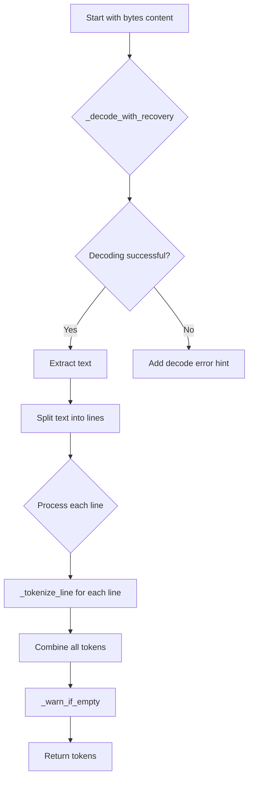

## Examples:
```python
# Basic usage with valid content
content = b"Hello\nWorld\n"
tokens = _tokenize_file_content_without_snipping(content)
# Returns list of tokens representing "Hello\nWorld\n"

# Usage with encoding errors
content = b"\xff\xfeInvalid UTF-8 content"
tokens = _tokenize_file_content_without_snipping(content)
# Returns tokens with decode error hint and replacement characters
```

## `onlinejudge_command.pretty_printers.make_pretty_all` · *function*

## Summary:
Converts raw byte content into a colorized, formatted string representation with proper tokenization and rendering.

## Description:
This function processes raw byte content by first tokenizing it into structured elements and then rendering those tokens into a visually formatted string. It serves as the main entry point for pretty-printing content in the online judge command system, providing colored output with proper formatting for different content types like body text, whitespace, newlines, and hints.

The function is designed to be a clean interface that orchestrates the tokenization and rendering process, separating concerns between content analysis and visual presentation. This extraction allows for easier testing of individual components and maintains a clear separation between parsing logic and display logic.

## Args:
    content (bytes): Raw byte content to be converted into pretty-printed string format

## Returns:
    str: Colorized and formatted string representation of the input content

## Raises:
    None explicitly raised - All exceptions are handled internally by the helper functions

## Constraints:
    Preconditions:
    - Input content must be valid bytes that can be processed by the tokenization functions
    - The helper functions (_tokenize_file_content_without_snipping and _render_tokens) must be properly implemented
    
    Postconditions:
    - Returns a properly formatted string with appropriate coloring and spacing
    - All content is preserved in the output, with proper tokenization and rendering

## Side Effects:
    None - This function is pure and doesn't cause any external state changes or I/O operations

## Control Flow:
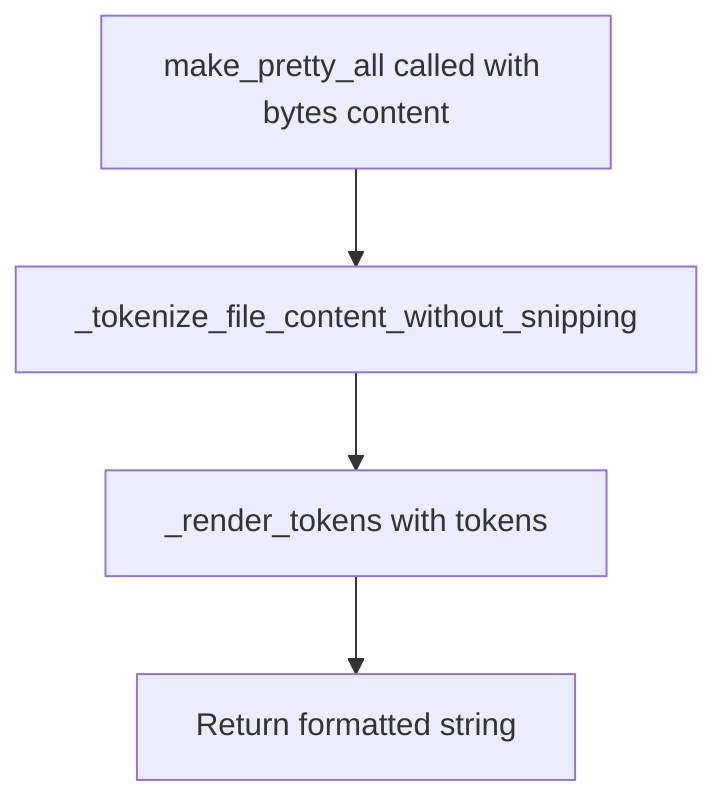

## Examples:
    # Basic usage with simple content
    content = b"Hello\nWorld"
    pretty_output = make_pretty_all(content)
    # Returns a colorized string representation of the content
    
    # Usage with content that has special formatting
    content = b"Test   \n\t\n"
    pretty_output = make_pretty_all(content)
    # Returns a formatted string with proper highlighting of whitespace and newlines
```

## `onlinejudge_command.pretty_printers._skip_whitespaces` · *function*

## Summary:
Skips whitespace characters in a string and converts them into token representations.

## Description:
Processes consecutive whitespace characters (spaces, tabs, carriage returns, and newlines) starting from a given index in a string, converting each character into a corresponding token type. This function is used to handle formatting and tokenization in pretty-printing operations.

## Args:
    i (int): Starting index in the string to process whitespace characters.
    s (str): Input string containing characters to process.

## Returns:
    Tuple[int, List[_PrettyToken]]: A tuple containing the new index position after skipping whitespace characters and a list of _PrettyToken objects representing the skipped whitespace characters.

## Raises:
    None explicitly raised.

## Constraints:
    Preconditions:
    - The input index `i` must be within the bounds of the string `s` (0 <= i < len(s))
    - The input string `s` must be a valid string object
    
    Postconditions:
    - The returned index will be equal to or greater than the input index `i`
    - The returned tokens will represent only whitespace characters from the input string
    - The returned tokens will be optimized using the _optimize_tokens function

## Side Effects:
    None.

## Control Flow:
```mermaid
flowchart TD
    A[Start _skip_whitespaces] --> B{Index i < len(s) AND s[i] in ' \\t\\r\\n'}
    B -- True --> C{Character is space/tab}
    C -- True --> D[Set token type to WHITESPACE]
    C -- False --> E[Set token type to NEWLINE]
    D --> F[Create _PrettyToken and append to tokens]
    E --> F
    F --> G[Increment i]
    G --> B
    B -- False --> H[Call _optimize_tokens(tokens)]
    H --> I[Return (i, optimized_tokens)]
```

## Examples:
    Example 1: _skip_whitespaces(0, "   hello")
    Returns: (3, [_PrettyToken(WHITESPACE, "   ")])
    
    Example 2: _skip_whitespaces(2, "\t\n  world")
    Returns: (6, [_PrettyToken(WHITESPACE, "\t\n  "), _PrettyToken(NEWLINE, "\n")])

## `onlinejudge_command.pretty_printers._make_diff_between_line_and_line_by_comparing_word_by_word` · *function*

## Summary:
Compares two strings word-by-word and generates tokenized representations with visual highlighting for differing words.

## Description:
This function performs a detailed word-by-word comparison between two strings, producing tokenized representations that can be used for pretty-printing diff output. When words differ between the two strings, they are marked with special highlight token types to visually distinguish differences. The function preserves the original structure including whitespace characters while identifying word boundaries.

This function is part of the competitive programming problem solution diffing system, specifically designed to provide detailed visual feedback when comparing expected vs actual output.

## Args:
    a (str): First string to compare
    b (str): Second string to compare

## Returns:
    Tuple[List[_PrettyToken], List[_PrettyToken]]: A pair of token lists where:
        - First list contains tokens representing the first string (a) with highlighting for differences
        - Second list contains tokens representing the second string (b) with highlighting for differences
        Each token is a NamedTuple with a type (_PrettyTokenType) and value (str)

## Raises:
    AssertionError: When the two input strings do not contain the same number of words after stripping whitespace

## Constraints:
    Preconditions:
        - Both input strings must contain the same number of words (after stripping whitespace)
        - Input strings must be valid Python strings
    
    Postconditions:
        - Both returned token lists will have the same total length
        - All characters from both input strings will be represented in the token lists
        - The tokenization preserves the original structure including whitespace

## Side Effects:
    None

## Control Flow:
```mermaid
flowchart TD
    A[Start function] --> B{Input validation}
    B --> C[Initialize token lists and position pointers]
    C --> D[Skip initial whitespaces]
    D --> E[While loop: l_a < len(a) AND l_b < len(b)]
    E --> F[Find word boundary in a]
    F --> G[Find word boundary in b]
    G --> H[Extract words]
    H --> I{Words equal?}
    I -->|Yes| J[Add BODY tokens to both lists]
    I -->|No| K[Add BODY_HIGHLIGHT tokens to respective lists]
    J --> L[Update position pointers]
    K --> L
    L --> M[Skip trailing whitespaces]
    M --> E
    E --> N[Assert end conditions]
    N --> O[Return token lists]
```

## Examples:
```python
# Basic usage with identical words
tokens_a, tokens_b = _make_diff_between_line_and_line_by_comparing_word_by_word("hello world", "hello world")
# Returns two lists of tokens with BODY type for each word

# Usage with different words
tokens_a, tokens_b = _make_diff_between_line_and_line_by_comparing_word_by_word("hello world", "hello there")
# Returns tokens with BODY_HIGHLIGHT_LEFT for "world" and BODY_HIGHLIGHT_RIGHT for "there"
```

## `onlinejudge_command.pretty_printers._tokenize_str_with_highlight` · *function*

## Summary:
Transforms a string into a list of highlighted tokens by converting body tokens to left or right highlight variants.

## Description:
Processes a string into tokens using the standard tokenizer, then applies highlighting to body tokens by converting them to either left or right highlight variants based on the `is_right` parameter. This function is used to prepare text for pretty printing with visual highlighting.

## Args:
    s (str): The input string to tokenize and highlight
    is_right (bool): Flag indicating whether to apply right-side highlighting (True) or left-side highlighting (False)

## Returns:
    List[_PrettyToken]: A list of tokens where body tokens are converted to highlighted variants while preserving other token types

## Raises:
    None explicitly raised

## Constraints:
    Preconditions:
    - Input string `s` must be a valid string
    - The `_tokenize_str` function must be available and working correctly
    
    Postconditions:
    - All returned tokens will be instances of `_PrettyToken`
    - Body tokens in the input will be converted to either `BODY_HIGHLIGHT_LEFT` or `BODY_HIGHLIGHT_RIGHT` based on `is_right` flag
    - Non-body tokens will retain their original types and values

## Side Effects:
    None

## Control Flow:
```mermaid
flowchart TD
    A[Input string s] --> B[_tokenize_str(s) to get tokens]
    B --> C{token.type == BODY?}
    C -->|Yes| D[Select highlight type based on is_right]
    D --> E[Create _PrettyToken with highlight type]
    C -->|No| F[Keep original token]
    E --> G[Add to result list]
    F --> G
    G --> H[Return tokens list]
```

## Examples:
    # Highlighting for left-side comparison
    tokens = _tokenize_str_with_highlight("hello world", is_right=False)
    # Returns tokens with BODY tokens converted to BODY_HIGHLIGHT_LEFT
    
    # Highlighting for right-side comparison  
    tokens = _tokenize_str_with_highlight("hello world", is_right=True)
    # Returns tokens with BODY tokens converted to BODY_HIGHLIGHT_RIGHT
```

## `onlinejudge_command.pretty_printers._make_diff_between_line_and_line_by_difflib` · *function*

## Summary:
Computes character-level differences between two strings and generates colored tokens for pretty-printing, using difflib for efficient diff computation.

## Description:
This function compares two strings character-by-character using difflib's SequenceMatcher to identify insertions, deletions, replacements, and equal segments. It converts these differences into formatted tokens with appropriate coloring to highlight changes, making output comparisons more readable in competitive programming environments.

## Args:
    a (str): First string to compare (typically expected output)
    b (str): Second string to compare (typically actual output)

## Returns:
    Tuple[List[_PrettyToken], List[_PrettyToken]]: A pair of token lists where the first list represents formatted tokens for string 'a' and the second list represents formatted tokens for string 'b'. Each token contains a type and value for proper formatting and highlighting.

## Raises:
    AssertionError: When difflib produces an unexpected opcode tag (should not occur under normal circumstances)

## Constraints:
    Preconditions:
        - Both input strings are valid Python strings
    Postconditions:
        - Returned token lists are properly formatted with appropriate highlighting
        - Trailing newline characters are preserved in the output tokens
        - Token optimization has been applied to merge adjacent tokens of same type

## Side Effects:
    None

## Control Flow:
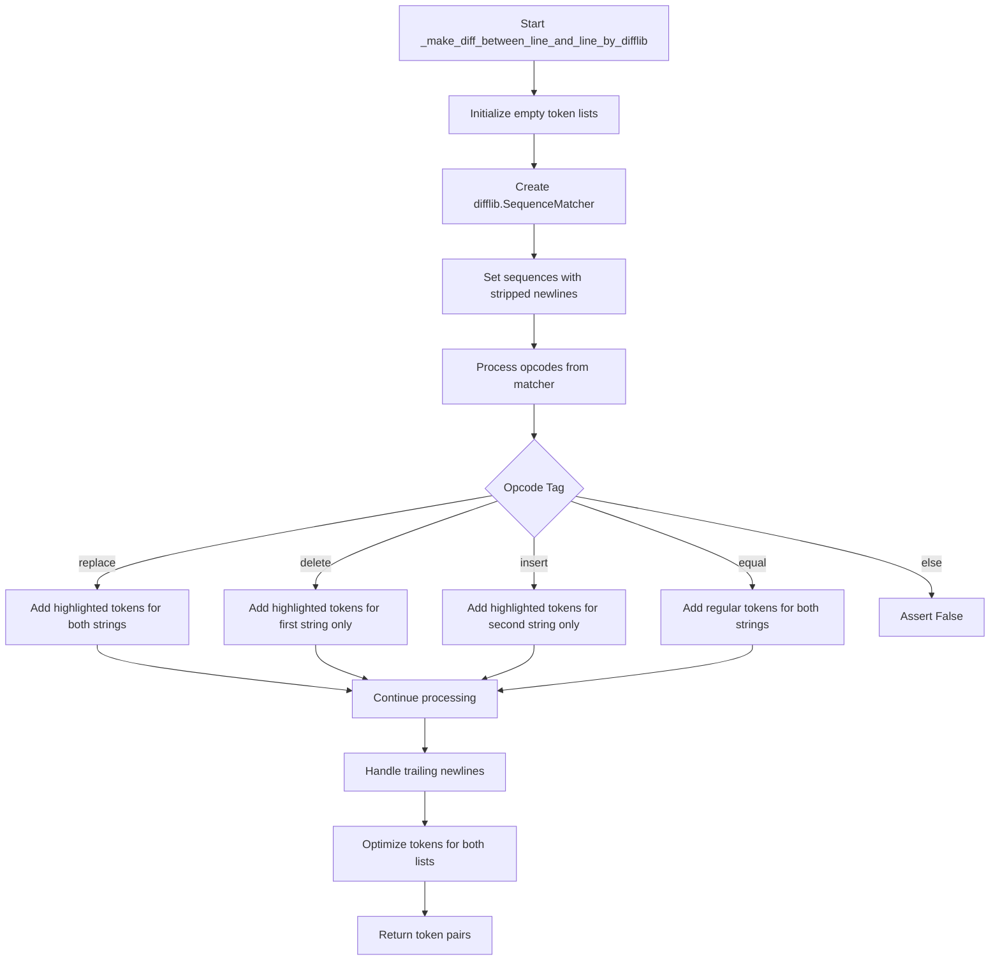

## Examples:
    # Basic usage for comparing two strings
    tokens_a, tokens_b = _make_diff_between_line_and_line_by_difflib("hello\nworld", "hello\nworld!")
    
    # Usage with differing content
    tokens_a, tokens_b = _make_diff_between_line_and_line_by_difflib("abc", "xyz")
    
    # Usage with identical strings
    tokens_a, tokens_b = _make_diff_between_line_and_line_by_difflib("same", "same")

## `onlinejudge_command.pretty_printers._make_diff_between_line_and_line` · *function*

## Summary
Compares two strings line-by-line and generates colored diff tokens for pretty printing, choosing between word-by-word comparison or difflib-based comparison based on word count equality.

## Description
This function serves as a dispatcher that selects the appropriate algorithm for comparing two strings based on their word counts. When both strings have the same number of words, it uses a word-by-word comparison that preserves whitespace structure and highlights differences at the word level. When the word counts differ, it falls back to difflib-based comparison which handles structural differences more robustly.

The function is part of the pretty printing system used in the online judge command to display differences between expected and actual output in a visually distinguishable format.

## Args
- a (str): First string to compare
- b (str): Second string to compare

## Returns
- Tuple[List[_PrettyToken], List[_PrettyToken]]: A pair of lists containing _PrettyToken objects representing the formatted tokens for each string. The first list corresponds to string 'a' and the second to string 'b'. Each token contains a type indicating its formatting role and a value string.

## Raises
- AssertionError: When the word-by-word comparison path is taken but the strings don't have equal word counts (this should not occur in normal operation as the function guards against this)

## Constraints
- Preconditions: Both arguments must be strings
- Postconditions: The returned tuples will contain _PrettyToken objects that can be processed by the pretty printing system to generate colored output

## Side Effects
- None

## Control Flow
```mermaid
flowchart TD
    A[Start _make_diff_between_line_and_line] --> B{len(a.strip().split()) == len(b.strip().split())?}
    B -- Yes --> C[_make_diff_between_line_and_line_by_comparing_word_by_word]
    B -- No --> D[_make_diff_between_line_and_line_by_difflib]
    C --> E[Return tokens_a, tokens_b]
    D --> E
```

## `onlinejudge_command.pretty_printers._LineDiffOp` · *class*

## Summary:
Represents a single line difference operation in a line-by-line comparison between two outputs.

## Description:
This immutable data structure encapsulates the result of comparing two lines (or sets of lines) during output diff operations. It serves as a record of changes between expected and actual outputs, storing both the line number and the tokenized representations of the content on each side of the comparison.

## State:
- lineno: int (0-based index) - The line number in the comparison context, which may refer to the left side, right side, or both sides of the comparison
- left: Optional[List[_PrettyToken]] - Tokenized representation of content from the left side of comparison, or None if no left-side content
- right: Optional[List[_PrettyToken]] - Tokenized representation of content from the right side of comparison, or None if no right-side content

## Lifecycle:
- Creation: Instantiated by diff algorithms when comparing outputs, typically created with all three fields populated
- Usage: Used as elements in sequences representing complete diff operations between two outputs
- Destruction: No special cleanup required as it's an immutable NamedTuple

## Method Map:
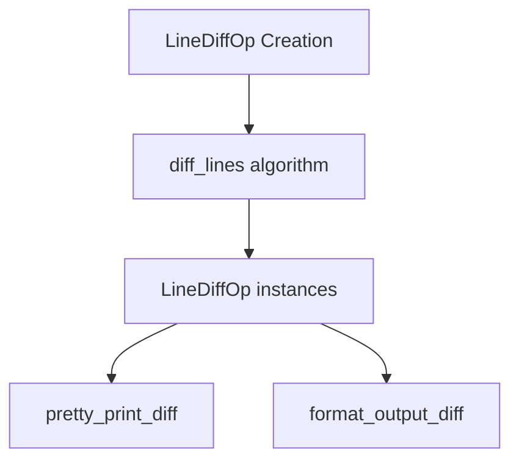

## Raises:
No exceptions are raised during instantiation as this is a simple data structure.

## Example:
```python
# Creating a LineDiffOp for a matching line
matching_line = _LineDiffOp(
    lineno=5,
    left=[_PrettyToken(type=_PrettyTokenType.BODY, value="Hello World")],
    right=[_PrettyToken(type=_PrettyTokenType.BODY, value="Hello World")]
)

# Creating a LineDiffOp for a differing line
differing_line = _LineDiffOp(
    lineno=10,
    left=[_PrettyToken(type=_PrettyTokenType.BODY, value="Expected")],
    right=[_PrettyToken(type=_PrettyTokenType.BODY, value="Actual")]
)
```

## `onlinejudge_command.pretty_printers._make_diff_between_file_and_file_by_comparing_line_by_line` · *function*

## Summary:
Compares two file contents line by line and generates line diff operations containing tokenized representations of differing lines.

## Description:
This function performs a line-by-line comparison between two file contents, identifying differences between corresponding lines. When lines differ, it breaks them down into tokenized representations for detailed diff display. The function respects the specified comparison mode and handles various edge cases such as extra lines in either file.

The function is extracted from inline logic to provide a clean separation of concerns for file-level diff operations, allowing the diff generation to be reused in different contexts while maintaining consistent behavior for line-by-line comparisons.

## Args:
    a (str): First file content as a string
    b (str): Second file content as a string  
    compare_mode (CompareMode): Comparison strategy to use (exact match, ignore spaces, etc.)

## Returns:
    List[_LineDiffOp]: A list of line diff operations, where each operation describes:
        - lineno: 0-based line index
        - left: Tokenized representation of the line from first file (or None if only in second file)
        - right: Tokenized representation of the line from second file (or None if only in first file)

## Raises:
    AssertionError: When compare_mode is CompareMode.IGNORE_SPACES_AND_NEWLINES (this mode is not supported)
    AssertionError: When the number of lines in both files don't match (except for exact match modes)

## Constraints:
    Preconditions:
        - Both input strings must have the same number of lines for non-exact match modes
        - compare_mode cannot be CompareMode.IGNORE_SPACES_AND_NEWLINES
    Postconditions:
        - Returns a list of _LineDiffOp objects containing tokenized line representations
        - All returned operations have valid 0-based line numbers

## Side Effects:
    None

## Control Flow:
```mermaid
flowchart TD
    A[Start function] --> B{compare_mode != IGNORE_SPACES_AND_NEWLINES?}
    B -- No --> C[Assertion Error]
    B -- Yes --> D{Number of lines equal?}
    D -- No --> E[Assertion Error]
    D -- Yes --> F[Initialize empty ops list]
    F --> G[Split files into lines]
    G --> H[Process matching lines]
    H --> I{Lines match?}
    I -- No --> J[Tokenize differing lines]
    J --> K[Create _LineDiffOp]
    K --> L[Add to ops list]
    I -- Yes --> M[Continue to next line]
    L --> N{More lines to process?}
    N -- Yes --> H
    N -- No --> O{Exact match mode?}
    O -- Yes --> P[Handle extra lines in file A]
    P --> Q[Handle extra lines in file B]
    O -- No --> R[Return ops list]
    Q --> R
```

## Examples:
    # Basic usage with exact match
    result = _make_diff_between_file_and_file_by_comparing_line_by_line(
        "line1\nline2\n", 
        "line1\nline3\n", 
        compare_mode=CompareMode.EXACT_MATCH
    )
    # Returns list with one _LineDiffOp for line 1 containing tokenized representations
    
    # Usage with space-insensitive comparison
    result = _make_diff_between_file_and_file_by_comparing_line_by_line(
        "word1 word2\n", 
        "word1   word2\n", 
        compare_mode=CompareMode.IGNORE_SPACES
    )
    # Returns empty list since lines match with space normalization

## `onlinejudge_command.pretty_printers._tokenize_line_with_highlight` · *function*

## Summary:
Processes a line of text and adds highlight styling to body tokens for diff visualization.

## Description:
Transforms tokens from a line by applying highlight styling to body content, enabling visual distinction between left and right sides in comparison displays. This function is part of the pretty printing system used for formatting output comparisons in competitive programming tools.

## Args:
    line (str): The input line to tokenize and highlight
    is_right (bool): Flag indicating whether to apply right-side highlighting style. When True, uses BODY_HIGHLIGHT_RIGHT; when False, uses BODY_HIGHLIGHT_LEFT.

## Returns:
    List[_PrettyToken]: A list of tokens where body tokens are replaced with highlighted versions based on the is_right flag, while other token types remain unchanged.

## Raises:
    None explicitly raised

## Constraints:
    Preconditions:
    - Input line must be a valid string
    - The function assumes `_tokenize_line` and `_tokenize_str` functions work correctly
    
    Postconditions:
    - All returned tokens are instances of `_PrettyToken`
    - Body tokens are converted to appropriate highlight token types
    - Non-body tokens retain their original types and values

## Side Effects:
    None

## Control Flow:
```mermaid
flowchart TD
    A[Input line] --> B[_tokenize_line(line)]
    B --> C{token.type == BODY?}
    C -->|Yes| D[Convert to highlight type]
    C -->|No| E[Keep original token]
    D --> F[Add to result]
    E --> F
    F --> G[Return tokens list]
```

## Examples:
    # Example 1: Left highlighting
    tokens = _tokenize_line_with_highlight("hello world", is_right=False)
    # Returns tokens with BODY tokens converted to BODY_HIGHLIGHT_LEFT
    
    # Example 2: Right highlighting  
    tokens = _tokenize_line_with_highlight("hello world", is_right=True)
    # Returns tokens with BODY tokens converted to BODY_HIGHLIGHT_RIGHT

## `onlinejudge_command.pretty_printers._make_diff_between_file_and_file_by_difflib` · *function*

## Summary:
Creates a detailed line-by-line difference representation between two text files using difflib for comparison.

## Description:
Processes two text strings and generates a sequence of line difference operations representing the differences between them. Each operation describes how a single line from the first string relates to a line in the second string, including replacements, deletions, insertions, and equal lines. This function is designed to support rich, formatted diff display in command-line interfaces.

## Args:
    a (str): First text content to compare (typically represents the expected output)
    b (str): Second text content to compare (typically represents the actual output)

## Returns:
    List[_LineDiffOp]: A list of _LineDiffOp objects, where each _LineDiffOp represents a single line difference operation containing:
        - lineno: 0-based line number
        - left: Tokens representing the line from the first text (or None if deleted)
        - right: Tokens representing the line from the second text (or None if inserted)

## Raises:
    AssertionError: When internal assumptions about the difflib opcodes are violated (should not occur under normal circumstances)

## Constraints:
    Preconditions:
        - Both input strings must be valid text content
        - The function assumes proper initialization of difflib.SequenceMatcher
    
    Postconditions:
        - The returned list is ordered by line numbers
        - All operations are properly formed _LineDiffOp instances
        - The function handles all difflib opcode types ('replace', 'delete', 'insert', 'equal')

## Side Effects:
    None

## Control Flow:
```mermaid
flowchart TD
    A[Start with two text strings] --> B[Split into lines with keepends=True]
    B --> C[Initialize difflib.SequenceMatcher]
    C --> D[Get opcodes from matcher]
    D --> E{Process each opcode}
    E --> F{tag == 'replace'}
    F --> G[Handle replacement operations]
    G --> H[Add LineDiffOps for replaced lines]
    H --> I{tag == 'delete'}
    I --> J[Handle deletion operations]
    J --> K[Add LineDiffOps for deleted lines]
    K --> L{tag == 'insert'}
    L --> M[Handle insertion operations]
    M --> N[Add LineDiffOps for inserted lines]
    N --> O{tag == 'equal'}
    O --> P[Skip equal lines]
    P --> Q[Process next opcode]
    Q --> R{All opcodes processed?}
    R -->|No| E
    R -->|Yes| S[Return list of operations]
```

## Examples:
    # Basic usage for comparing two strings
    result = _make_diff_between_file_and_file_by_difflib("line1\nline2", "line1\nline3")
    # Returns operations showing line 2 was replaced with line 3

## `onlinejudge_command.pretty_printers._make_diff_between_file_and_file` · *function*

## Summary:
Generates a detailed line-by-line difference between two text files using appropriate comparison strategies based on line count and comparison mode.

## Description:
This function compares two text files (represented as strings) and produces a structured diff showing line-by-line differences. It selects between two different comparison strategies based on whether the files have the same number of lines. When line counts differ, it falls back to a general diff algorithm using difflib. The function handles special comparison modes like ignoring carriage returns and provides appropriate warnings when mode changes occur.

## Args:
    a (str): First file content as a string
    b (str): Second file content as a string  
    compare_mode (CompareMode): Comparison strategy to use for matching lines. Must not be CompareMode.IGNORE_SPACES_AND_NEWLINES.

## Returns:
    List[_LineDiffOp]: A list of line difference operations describing the differences between the two files. Each operation contains line numbers and tokenized representations of differing content. Empty list is returned when files are identical.

## Raises:
    AssertionError: When compare_mode is CompareMode.IGNORE_SPACES_AND_NEWLINES, which is not supported.

## Constraints:
    Preconditions:
        - Both input strings should be valid text content
        - compare_mode must not be CompareMode.IGNORE_SPACES_AND_NEWLINES
    Postconditions:
        - Returns a list of _LineDiffOp objects representing differences
        - If line counts are equal, uses line-by-line comparison strategy
        - If line counts differ, uses difflib-based comparison strategy

## Side Effects:
    - Logs warning messages via logger when:
      * Changing compare_mode from IGNORE_SPACES or IGNORE_SPACES_AND_NEWLINES to CRLF_INSENSITIVE_EXACT_MATCH
      * Removing carriage returns ('\r') from content when using CRLF_INSENSITIVE_EXACT_MATCH mode

## Control Flow:
```mermaid
flowchart TD
    A[Start _make_diff_between_file_and_file] --> B{Same line count?}
    B -- Yes --> C[Use line-by-line comparison]
    B -- No --> D[Check compare_mode]
    D --> E{compare_mode in IGNORE_SPACES, IGNORE_SPACES_AND_NEWLINES?}
    E -- Yes --> F[Change compare_mode to CRLF_INSENSITIVE_EXACT_MATCH]
    E -- No --> G[Continue with current compare_mode]
    G --> H{compare_mode == CRLF_INSENSITIVE_EXACT_MATCH?}
    H -- Yes --> I{Contains \\r?}
    I -- Yes --> J[Remove \\r\\n and replace with \\n]
    I -- No --> K[Skip carriage return processing]
    H -- No --> K
    K --> L[Use difflib-based comparison]
    C --> M[Return result]
    L --> M
    F --> G
```

## `onlinejudge_command.pretty_printers._MergedDiffOp` · *class*

## Summary:
Represents a merged diff operation between two versions of formatted output for pretty printing comparison results.

## Description:
This class serves as a data structure to represent a single operation in a diff between two formatted outputs. It encapsulates the comparison result of two lines (or portions of lines) from left and right outputs, including their line numbers, tokens, and whether they differ. This class is primarily used internally by the pretty printing system to organize and display differences between expected and actual output in a human-readable format.

## State:
- left_lineno: Optional[int] - Zero-based line number from the left (expected) output, or None if not applicable
- left: List[_PrettyToken] - List of formatted tokens representing the left-side content
- right_lineno: Optional[int] - Zero-based line number from the right (actual) output, or None if not applicable  
- right: List[_PrettyToken] - List of formatted tokens representing the right-side content
- has_diff: bool - Boolean flag indicating whether the left and right sides have differences

## Lifecycle:
- Creation: Instantiated by providing all five fields as specified in the NamedTuple constructor
- Usage: Typically created by diff processing functions and consumed by pretty printing routines to display differences
- Destruction: Managed automatically by Python's garbage collection as a NamedTuple

## Method Map:
```mermaid
graph TD
    A[_MergedDiffOp] --> B[Constructor]
    B --> C[Access fields via .left, .right, etc.]
    C --> D[Pretty printer consumes these fields]
```

## Raises:
- No exceptions are raised during instantiation as this is a simple data structure
- All fields are expected to be properly initialized by the creating code

## Example:
```python
# Creating a MergedDiffOp instance
diff_op = _MergedDiffOp(
    left_lineno=5,
    left=[_PrettyToken(type=_PrettyTokenType.BODY, value="Hello")],
    right_lineno=5,
    right=[_PrettyToken(type=_PrettyTokenType.BODY_HIGHLIGHT_RIGHT, value="Hello")],
    has_diff=True
)

# Accessing fields
print(diff_op.left_lineno)  # 5
print(diff_op.has_diff)     # True
```

## `onlinejudge_command.pretty_printers._reconstruct_entire_diff` · *function*

## Summary:
Reconstructs a complete diff representation by merging line operations with tokenized line content for pretty printing.

## Description:
This function processes two string inputs and a list of line diff operations to produce a comprehensive diff representation suitable for pretty printing. It merges raw line operations with tokenized versions of actual lines, handling insertions, deletions, and modifications appropriately. The function ensures all lines from both inputs are processed exactly once and produces a complete diff structure for display purposes.

## Args:
    a (str): First string to compare (typically expected output)
    b (str): Second string to compare (typically actual output)
    ops (List[_LineDiffOp]): List of line diff operations to process, where each operation contains line numbers and tokenized content for comparison. This is a keyword-only argument.

## Returns:
    List[_MergedDiffOp]: A list of merged diff operations containing:
    - left_lineno: Optional 0-based line number from first string, or None
    - left: List of _PrettyToken objects from first string, or empty list
    - right_lineno: Optional 0-based line number from second string, or None  
    - right: List of _PrettyToken objects from second string, or empty list
    - has_diff: Boolean flag indicating whether this represents a difference

## Raises:
    AssertionError: When the reconstruction process encounters inconsistent state during stack processing, specifically when remaining stack items don't match expected patterns

## Constraints:
    Preconditions:
    - Both input strings must be valid and non-empty
    - The ops list must contain valid _LineDiffOp objects with proper line numbers
    - Line numbers in ops must be properly ordered and correspond to actual line indices
    - Operations must be compatible with the string lengths
    
    Postconditions:
    - All lines from both input strings are processed exactly once
    - The returned list covers the complete diff between the two strings
    - Stack is emptied completely after processing
    - Final indices equal string lengths (i_a == len(lines_a) and i_b == len(lines_b))

## Side Effects:
    None

## Control Flow:
```mermaid
flowchart TD
    A[Start] --> B{While i_a < len(lines_a) AND i_b < len(lines_b)}
    B -- Yes --> C{Stack not empty AND op.left and op.right not None AND i_a == op.lineno}
    C -- Yes --> D[Add merged op with both sides]
    D --> E[Pop from stack]
    E --> F[Increment i_a, i_b]
    C -- No --> G{Stack not empty AND op.left not None AND op.right is None AND i_a == op.lineno}
    G -- Yes --> H[Add merged op with only left side]
    H --> I[Pop from stack]
    I --> J[Increment i_a]
    G -- No --> K{Stack not empty AND op.left is None AND op.right not None AND i_b == op.lineno}
    K -- Yes --> L[Add merged op with only right side]
    L --> M[Pop from stack]
    M --> N[Increment i_b]
    K -- No --> O[Tokenize lines and add merged op without diff]
    O --> P[Increment i_a, i_b]
    B -- No --> Q[Process remaining stack items]
    Q --> R{Stack not empty AND op.left not None AND op.right is None AND i_a == op.lineno}
    R -- Yes --> S[Add merged op with only left side]
    S --> T[Pop from stack]
    T --> U[Increment i_a]
    R -- No --> V{Stack not empty AND op.left is None AND op.right not None AND i_b == op.lineno}
    V -- Yes --> W[Add merged op with only right side]
    W --> X[Pop from stack]
    X --> Y[Increment i_b]
    V -- No --> Z[Assert False]
    Z --> AA[End]
```

## Examples:
    # Basic usage with simple diff operations
    a = "line1\\nline2\\n"
    b = "line1\\nline3\\n"
    ops = [_LineDiffOp(lineno=1, left=["line2"], right=["line3"])]
    result = _reconstruct_entire_diff(a, b, ops=ops)
    # Returns list of _MergedDiffOp objects representing the diff
    
    # Usage with deletion operation
    a = "line1\\nline2\\nline3\\n"
    b = "line1\\nline3\\n"
    ops = [_LineDiffOp(lineno=1, left=["line2"], right=None)]
    result = _reconstruct_entire_diff(a, b, ops=ops)
    # Handles deletion case properly

## `onlinejudge_command.pretty_printers._add_lines_around_diff_lines` · *function*

## Summary:
Adds contextual lines around diff operations to provide better visual context in diff output.

## Description:
This function processes a sequence of diff operations and adds a specified number of surrounding lines to highlight differences in a more readable format. When a difference is detected, it includes a configurable number of preceding lines before the diff, and continues showing subsequent lines for context.

## Args:
    a (str): First string (typically the expected output) to compare against.
    b (str): Second string (typically the actual output) to compare against.
    ops (List[_LineDiffOp]): List of line diff operations representing the differences between the two strings.
    size (int): Number of contextual lines to include before and after each diff operation.

## Returns:
    List[_MergedDiffOp]: A list of merged diff operations where diff operations are interspersed with contextual lines, maintaining proper line numbering and tokenization for display purposes.

## Raises:
    None explicitly raised by this function.

## Constraints:
    Preconditions:
    - The `ops` parameter must contain valid `_LineDiffOp` objects that represent valid line differences between strings `a` and `b`
    - The `size` parameter must be a non-negative integer
    - Strings `a` and `b` should be valid strings that can be split into lines
    
    Postconditions:
    - The returned list contains `_MergedDiffOp` objects that represent either diff operations or contextual lines
    - All diff operations are preserved in the result with proper line numbering
    - Contextual lines are added according to the specified size parameter

## Side Effects:
    None.

## Control Flow:
```mermaid
flowchart TD
    A[Start _add_lines_around_diff_lines] --> B[_reconstruct_entire_diff(a,b,ops)]
    B --> C{op.has_diff}
    C -- Yes --> D[result += unused[-size:]]
    D --> E[unused = []]
    E --> F[result.append(op)]
    F --> G[use = size]
    C -- No --> H{use > 0}
    H -- Yes --> I[result.append(op)]
    I --> J[use -= 1]
    H -- No --> K[unused.append(op)]
    J --> L[Loop to next op]
    K --> L
    L --> M[Return result]
```

## Examples:
    Example usage in a diff display context:
    ```python
    # Given two strings with differences and diff operations
    expected_output = "line1\\nline2\\nline3\\n"
    actual_output = "line1\\nline2_modified\\nline3\\n"
    
    # Assuming we have diff operations from difflib
    diff_ops = [some_line_diff_operations]
    
    # Add 2 lines of context around differences
    result = _add_lines_around_diff_lines(expected_output, actual_output, ops=diff_ops, size=2)
    ```

## `onlinejudge_command.pretty_printers._add_dots_between_gaps` · *function*

*No documentation generated.*

## `onlinejudge_command.pretty_printers._len_of_tokens` · *function*

## Summary:
Calculates the display length of a sequence of formatted tokens, accounting for special whitespace handling.

## Description:
Computes the visual length of tokens that would be displayed when rendered, with special handling for whitespace characters. This function is used internally to calculate spacing and alignment when pretty-printing output comparisons.

## Args:
    tokens (List[_PrettyToken]): A list of formatted tokens containing type and value information

## Returns:
    int: The total display length of all tokens, where whitespace and newline characters are processed to account for their visual representation

## Raises:
    None explicitly raised

## Constraints:
    Preconditions:
    - tokens must be a list of objects with 'type' and 'value' attributes
    - Each token's type must be from the _PrettyTokenType enum
    - Each token must have a string value
    
    Postconditions:
    - Returns a non-negative integer representing the computed display length
    - The calculation accounts for special handling of whitespace characters

## Side Effects:
    None

## Control Flow:
```mermaid
flowchart TD
    A[Start _len_of_tokens] --> B{token.type in WHITESPACE,NEWLINE?}
    B -- Yes --> C[Process whitespace with _replace_whitespace]
    B -- No --> D[Use raw token.value length]
    C --> E[Replace \\n with space]
    E --> F[Add to result]
    D --> F
    F --> G[Next token?]
    G -- Yes --> B
    G -- No --> H[Return result]
```

## Examples:
    Example 1: Processing a token list with whitespace
        Input: [token(type=WHITESPACE, value="   "), token(type=BODY, value="hello")]
        Output: 6 (3 spaces + 5 characters after processing)
        
    Example 2: Processing a token list with newlines
        Input: [token(type=NEWLINE, value="\\n"), token(type=BODY, value="world")]
        Output: 5 (1 space + 5 characters after processing)

## `onlinejudge_command.pretty_printers._tokens_from_line_diff_ops` · *function*

## Summary:
Converts line diff operations into formatted pretty tokens for displaying differences between output and expected results.

## Description:
Transforms a list of merged diff operations into a list of pretty tokens that can be rendered to show line-by-line differences between actual output and expected output. This function formats the diff display with line numbers, proper alignment, and appropriate token types for coloring and formatting.

This logic is extracted into its own function to separate the concerns of diff operation processing from the rendering logic, making it easier to test and modify the display formatting independently of the diff computation.

## Args:
    ops (List[_MergedDiffOp]): List of merged diff operations containing line numbers and tokenized content for both left (actual) and right (expected) sides
    char_in_line (int): Total width available for the formatted output, used to calculate column widths

## Returns:
    List[_PrettyToken]: Formatted tokens ready for rendering with appropriate token types for display formatting

## Raises:
    AssertionError: When calculated line number widths exceed available space in the display area

## Constraints:
    Preconditions:
    - The `char_in_line` parameter must be large enough to accommodate line numbers and content
    - All operations in `ops` must be valid `_MergedDiffOp` instances
    - The `ops` list should not contain invalid states that would cause assertion failures
    
    Postconditions:
    - Returns a list of `_PrettyToken` objects with appropriate types and values
    - The returned tokens are properly formatted for display with line numbers and alignment

## Side Effects:
    None

## Control Flow:
```mermaid
flowchart TD
    A[Start _tokens_from_line_diff_ops] --> B{ops empty?}
    B -- Yes --> C[Return hint token "(no diff)"]
    B -- No --> D[Calculate max line numbers]
    D --> E[Calculate left width as char_in_line // 2]
    E --> F[Calculate line number widths]
    F --> G[Assertion checks on width constraints]
    G --> H[Initialize tokens list]
    H --> I[Add header row "output:" and "expected:" aligned]
    I --> J[Process each op in ops]
    J --> K{op equals _MergedDiffOpDots?}
    K -- Yes --> L[Add dots tokens "..."]
    L --> M[Continue to next op]
    K -- No --> N{left_lineno exists?}
    N -- Yes --> O[Add left line number]
    O --> P[Add separator "| "]
    P --> Q[Add left tokens with newline replacement]
    Q --> R[Calculate padding space]
    R --> S{padding >= 0?}
    S -- Yes --> T[Add padding spaces]
    S -- No --> U[Add newline]
    T --> V[Set left_exists flag]
    U --> V
    V --> W{right_lineno exists?}
    W -- Yes --> X[Add right line number]
    X --> Y[Add separator "| "]
    Y --> Z[Add right tokens]
    W -- No --> AA{left_exists?}
    AA -- Yes --> AB[Add newline]
    J --> AC[Return tokens]
```

## Examples:
    # Basic usage with diff operations
    tokens = _tokens_from_line_diff_ops([
        _MergedDiffOp(
            left_lineno=0,
            left=[_PrettyToken(_PrettyTokenType.BODY, "line1")],
            right_lineno=0,
            right=[_PrettyToken(_PrettyTokenType.BODY, "line1")],
            has_diff=False
        )
    ], char_in_line=80)
    
    # Usage with no diff operations
    tokens = _tokens_from_line_diff_ops([], char_in_line=80)
    # Returns: [_PrettyToken(_PrettyTokenType.HINT, '(no diff)')]

## `onlinejudge_command.pretty_printers._summary_token_of_diff_ops` · *function*

## Summary:
Generates a summary token indicating the count of deleted and added lines from diff operations.

## Description:
This function processes a list of merged diff operations to count how many lines were removed and added, then returns a formatted summary token. It's designed to provide a concise overview of changes when there are differences detected in the comparison process. The function is extracted into its own component to encapsulate the logic for summarizing diff statistics separately from the main diff processing flow.

## Args:
    ops (List[_MergedDiffOp]): A list of merged diff operations containing line information and diff status.

## Returns:
    List[_PrettyToken]: A list containing a hint-type pretty token with formatted summary text showing deleted and added line counts, or an empty list if no changes were detected.

## Raises:
    None explicitly raised.

## Constraints:
    Preconditions:
    - The input list `ops` should contain valid `_MergedDiffOp` objects
    - Each `_MergedDiffOp` object should have proper `has_diff`, `left_lineno`, and `right_lineno` attributes
    
    Postconditions:
    - Returns either an empty list when no changes are detected (both removed and added counts are zero)
    - Returns a list with one hint-type token when changes are detected
    - The returned token contains properly formatted text with accurate counts

## Side Effects:
    None.

## Control Flow:
```mermaid
flowchart TD
    A[Start _summary_token_of_diff_ops] --> B{ops is empty?}
    B -- Yes --> C[Return empty list]
    B -- No --> D[Initialize removed=0, added=0]
    D --> E[For each op in ops]
    E --> F{op.has_diff?}
    F -- No --> G[Continue to next op]
    F -- Yes --> H{op.left_lineno is not None?}
    H -- Yes --> I[removed += 1]
    H -- No --> J[Skip removed count]
    J --> K{op.right_lineno is not None?}
    K -- Yes --> L[added += 1]
    K -- No --> M[Skip added count]
    M --> N[Next op or End loop]
    G --> N
    I --> N
    L --> N
    N --> O{removed == 0 AND added == 0?}
    O -- Yes --> P[Return empty list]
    O -- No --> Q[Create hint token with counts]
    Q --> R[Return list with hint token]
```

## Examples:
    Example 1 - No changes detected:
    Input: []
    Output: []

    Example 2 - Changes detected:
    Input: [MergedDiffOp(has_diff=True, left_lineno=1, right_lineno=None), MergedDiffOp(has_diff=True, left_lineno=None, right_lineno=2)]
    Output: [A _PrettyToken with hint type and formatted string showing 1 deleted and 1 added line]

## `onlinejudge_command.pretty_printers._tokenize_pretty_diff` · *function*

## Summary
Processes output and expected strings to generate formatted diff tokens for pretty printing, including line numbers, highlighting differences, and truncating results based on a limit.

## Description
This function orchestrates the creation of formatted diff tokens that represent the differences between actual output and expected output. It handles various comparison modes, adds surrounding context lines, inserts ellipsis markers for gaps, and formats the final output for display. The function is designed to be a central processing unit for creating human-readable diff representations.

The logic is extracted into its own function rather than being inlined because it encapsulates the complete workflow of diff tokenization, which involves multiple processing steps that would make the calling code cluttered and hard to maintain.

## Args
- output (str): The actual output string to compare against expected
- expected (str): The expected output string for comparison  
- compare_mode (CompareMode): Comparison mode to use for determining matches
- char_in_line (int): Maximum number of characters to display per line in the diff output
- limit (int): Maximum number of diff operations to include in the result (-1 means no limit)

## Returns
- List[_PrettyToken]: A list of formatted tokens representing the diff, suitable for pretty printing with color and formatting

## Raises
- None explicitly raised, but underlying functions may raise exceptions

## Constraints
- Preconditions: All arguments must be valid strings and compare_mode must be a valid CompareMode enum value
- Postconditions: The returned list of tokens will contain properly formatted diff information with line numbers and highlighting

## Side Effects
- May emit warning messages to the logger when comparing modes are adjusted
- No external state mutations or I/O operations beyond logging

## Control Flow
```mermaid
flowchart TD
    A[Start _tokenize_pretty_diff] --> B{compare_mode == IGNORE_SPACES_AND_NEWLINES?}
    B -- Yes --> C[Log warning]
    C --> D[Set compare_mode = IGNORE_SPACES]
    B -- No --> D
    D --> E[Call _make_diff_between_file_and_file]
    E --> F[Call _add_lines_around_diff_lines]
    F --> G[Call _add_dots_between_gaps]
    G --> H[Call _tokens_from_line_diff_ops]
    H --> I{limit != -1?}
    I -- Yes --> J[Append summary tokens]
    I -- No --> J
    J --> K[Return tokens]
```

## Examples
```python
# Basic usage with exact matching
tokens = _tokenize_pretty_diff(
    output="Hello world\nTest",
    expected="Hello world\nTest\n",
    compare_mode=CompareMode.EXACT_MATCH,
    char_in_line=80,
    limit=-1
)

# Usage with limit to truncate results
tokens = _tokenize_pretty_diff(
    output="Line1\nLine2\nLine3\nLine4",
    expected="Line1\nLine2\nLine5\nLine4",
    compare_mode=CompareMode.IGNORE_SPACES,
    char_in_line=80,
    limit=2
)
```

## `onlinejudge_command.pretty_printers.make_pretty_diff` · *function*

## Summary:
Formats and colorsizes the difference between actual output and expected output for display in terminal environments.

## Description:
This function takes raw byte output and compares it against expected content, generating a human-readable, colorized diff that highlights differences between the two. It handles encoding recovery, terminal sizing, and token-based rendering to produce a visually appealing output suitable for command-line interfaces.

## Args:
    output_bytes (bytes): Raw bytes representing the actual program output to compare
    expected (str): The expected output string for comparison
    compare_mode (CompareMode): Comparison mode to use when determining matches (e.g., ignoring whitespace, newlines)
    limit (int): Maximum number of diff lines to display (-1 for unlimited)

## Returns:
    str: A formatted, colorized string representation of the diff showing differences between actual and expected output

## Raises:
    None explicitly raised - though underlying functions may raise exceptions during decoding or rendering

## Constraints:
    Preconditions:
    - output_bytes should be valid bytes that can be decoded to text
    - expected should be a valid string
    - compare_mode should be a valid CompareMode enum value
    - limit should be a non-negative integer or -1
    
    Postconditions:
    - Returns a properly formatted string with ANSI color codes for terminal display
    - The returned string is safe for printing to terminals

## Side Effects:
    None directly - but the function may cause I/O through terminal size detection via shutil.get_terminal_size()

## Control Flow:
```mermaid
flowchart TD
    A[make_pretty_diff called] --> B[_decode_with_recovery]
    B --> C[_get_terminal_size]
    C --> D[_tokenize_pretty_diff]
    D --> E[_render_tokens]
    E --> F[Return formatted diff string]
```

## Examples:
    # Basic usage with exact matching
    actual_output = b"Hello World\n"
    expected_output = "Hello World\n"
    from onlinejudge_command.output_comparators import CompareMode
    diff = make_pretty_diff(actual_output, expected=expected_output, compare_mode=CompareMode.EXACT_MATCH, limit=10)
    
    # Usage with whitespace ignoring
    actual_output = b"Hello   World\n"
    expected_output = "Hello World\n"
    from onlinejudge_command.output_comparators import CompareMode
    diff = make_pretty_diff(actual_output, expected=expected_output, compare_mode=CompareMode.IGNORE_SPACES, limit=-1)

