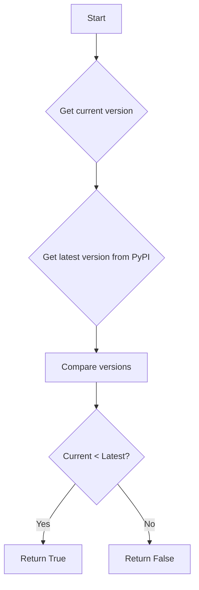
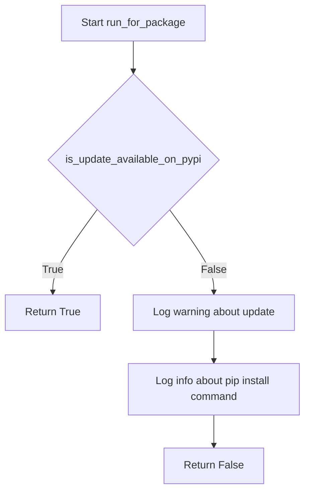

# `update_checking.py`

## `onlinejudge_command.update_checking.describe_status_code` · *function*

## Summary:
Formats an HTTP status code into a readable string including both the numeric code and its standard response message.

## Description:
Converts an HTTP status code integer into a formatted string that displays both the numeric code and its corresponding standard HTTP response message. This utility function provides a consistent way to represent HTTP status codes for display purposes, particularly useful in debugging and logging scenarios.

## Args:
    status_code (int): The HTTP status code to format. Must be a valid HTTP status code that exists in http.client.responses.

## Returns:
    str: A formatted string in the format "{status_code} {response_message}" where response_message is the standard HTTP response phrase for the given status code.

## Raises:
    KeyError: When the provided status_code is not found in http.client.responses dictionary. This occurs when an invalid or unsupported HTTP status code is provided.

## Constraints:
    Preconditions: The status_code argument must be an integer that corresponds to a valid HTTP status code defined in the http.client.responses dictionary.
    Postconditions: The returned string will always contain exactly two space-separated parts: the numeric status code followed by its standard response message.

## Side Effects:
    None: This function has no side effects and is purely a transformation function.

## Control Flow:
```mermaid
flowchart TD
    A[Input status_code] --> B{Valid HTTP code?}
    B -->|Yes| C[Lookup http.client.responses[status_code]]
    C --> D[Format "{status_code} {response_message}"]
    D --> E[Return formatted string]
    B -->|No| F[KeyError raised]
```

## Examples:
    >>> describe_status_code(200)
    '200 OK'
    
    >>> describe_status_code(404)
    '404 Not Found'
    
    >>> describe_status_code(500)
    '500 Internal Server Error'

## `onlinejudge_command.update_checking.request` · *function*

## Summary:
Makes HTTP requests with standardized logging and redirect handling.

## Description:
A wrapper around `requests.Session.request()` that provides consistent logging of request details and response status codes. This function centralizes HTTP request handling with standardized behavior for logging and redirect tracking.

## Args:
    method (str): HTTP method to use ('GET' or 'POST')
    url (str): Target URL for the HTTP request
    session (requests.Session): Session object to use for making the request
    raise_for_status (bool, optional): Whether to raise an exception for HTTP error status codes. Defaults to True.
    **kwargs: Additional arguments passed to the underlying `requests.Session.request()` method

## Returns:
    requests.Response: The response object from the HTTP request

## Raises:
    AssertionError: When method is not 'GET' or 'POST'
    requests.exceptions.RequestException: When raise_for_status is True and the HTTP response indicates an error

## Constraints:
    Preconditions:
        - method must be either 'GET' or 'POST'
        - session must be a valid requests.Session instance
    Postconditions:
        - Response object contains the full HTTP response data
        - All HTTP redirects are logged
        - Status code is logged with its descriptive message

## Side Effects:
    - Writes log messages to the module's logger at INFO and DEBUG levels
    - Makes actual HTTP network requests through the provided session
    - May trigger HTTP redirects which are logged

## Control Flow:
```mermaid
flowchart TD
    A[Start request] --> B{Method valid?}
    B -- No --> C[AssertionError]
    B -- Yes --> D[Set default allow_redirects=True]
    D --> E[Log method and URL]
    E --> F{Data in kwargs?}
    F -- Yes --> G[Log data]
    G --> H[Make HTTP request]
    F -- No --> H
    H --> I{Response redirected?}
    I -- Yes --> J[Log redirect URL]
    I -- No --> K[Continue]
    J --> K
    K --> L{raise_for_status=True?}
    L -- Yes --> M[Check status code]
    M --> N{Status error?}
    N -- Yes --> O[raise_for_status()]
    N -- No --> P[Return response]
    L -- No --> P
```

## Examples:
```python
import requests
session = requests.Session()
response = request('GET', 'https://api.example.com/data', session)
# Logs the request and response status, raises exception for HTTP errors

response = request('POST', 'https://api.example.com/submit', session, raise_for_status=False)
# Makes POST request without raising exceptions for errors
```

## `onlinejudge_command.update_checking.get_latest_version_from_pypi` · *function*

## Summary:
Retrieves the latest version of a specified package from PyPI, using cached data when available to reduce network requests.

## Description:
This function fetches the latest version information for a given package from the Python Package Index (PyPI) API. It implements a caching mechanism to avoid frequent network requests by storing version data locally for 8 hours. When the cache is valid, it returns the cached version; otherwise, it makes a network request to PyPI and updates the cache.

The function is designed to be lightweight and resilient - if network requests fail, it gracefully falls back to returning version '0.0.0' rather than crashing.

## Args:
    package_name (str): The name of the PyPI package to check for the latest version

## Returns:
    str: The latest version string of the specified package, or '0.0.0' if network requests fail

## Raises:
    None explicitly raised - though network-related exceptions may occur internally during HTTP requests

## Constraints:
    Preconditions:
        - The package_name parameter must be a valid string representing a PyPI package name
        - Network connectivity must be available for fetching from PyPI (though failures are handled gracefully)
        
    Postconditions:
        - The function returns a valid version string (even if it's '0.0.0' on failure)
        - Cache file is updated with fresh timestamp and version information

## Side Effects:
    - Makes a network request to PyPI using a request utility function
    - Reads from and writes to a local cache file at {user_cache_dir}/pypi.json
    - Logs debug messages about cache loading/storing operations
    - Logs warning messages when cache loading fails
    - Logs error messages when network requests fail

## Control Flow:
```mermaid
flowchart TD
    A[Start get_latest_version_from_pypi] --> B{Cache exists?}
    B -- Yes --> C{Cache valid (within 8h)?}
    C -- Yes --> D[Return cached version]
    C -- No --> E[Fetch from PyPI]
    B -- No --> E
    E --> F[Make network request to PyPI]
    F --> G{Request successful?}
    G -- Yes --> H[Parse JSON response]
    H --> I[Extract version info]
    G -- No --> J[Set version to '0.0.0']
    J --> K[Update cache with new data]
    I --> K
    K --> L[Store cache to file]
    L --> M[Return version]
```

## Examples:
    # Get latest version of a package
    latest_version = get_latest_version_from_pypi("onlinejudge")
    print(f"Latest version: {latest_version}")
    
    # Handle potential fallback to '0.0.0'
    version = get_latest_version_from_pypi("nonexistent-package")
    if version == "0.0.0":
        print("Could not fetch version information")
```

## `onlinejudge_command.update_checking.is_update_available_on_pypi` · *function*

## Summary
Determines whether a newer version of a package is available on PyPI compared to the currently installed version.

## Description
This function compares the provided current version with the latest version available on PyPI for the specified package. It's designed to be used as part of an automated update checking system that helps users stay informed about available package upgrades.

The function extracts the latest version from PyPI using `get_latest_version_from_pypi` and performs semantic version comparison using `distutils.version.StrictVersion`.

## Args
- package_name (str): The name of the PyPI package to check for updates
- current_version (str): The currently installed version of the package

## Returns
- bool: True if a newer version is available on PyPI, False otherwise

## Raises
- None explicitly raised, though underlying calls to `distutils.version.StrictVersion` and HTTP requests may raise exceptions

## Constraints
- Preconditions: Both arguments must be valid version strings that can be parsed by `distutils.version.StrictVersion`
- Postconditions: Returns a boolean indicating version status without side effects

## Side Effects
- Makes HTTP requests to PyPI to fetch version information
- May read from/write to local cache files for version data
- Uses network I/O and file system operations

## Control Flow


## Examples
```python
# Check if onlinejudge-command has updates
is_update_available_on_pypi("onlinejudge-command", "1.0.0")
# Returns True if newer version exists, False otherwise

# Check if onlinejudge has updates  
is_update_available_on_pypi("onlinejudge", "2.5.1")
# Returns True if newer version exists, False otherwise
```

## `onlinejudge_command.update_checking.run_for_package` · *function*

## Summary:
Checks if a package is up-to-date by comparing its current version with the latest version available on PyPI, and logs appropriate update notifications.

## Description:
This function determines whether the currently installed version of a package is the latest available on PyPI. It's designed to be called periodically to notify users when updates are available. The function leverages cached version information to reduce network requests and provides informative log messages when updates are detected.

## Args:
    package_name (str): The name of the package to check for updates
    current_version (str): The currently installed version of the package

## Returns:
    bool: True if the package is up-to-date (no newer version available), False if an update is available

## Raises:
    None explicitly raised - though underlying network operations may raise exceptions that are handled internally

## Constraints:
    Preconditions:
        - package_name must be a valid PyPI package identifier
        - current_version must be a valid version string that can be parsed by distutils.version.StrictVersion
    Postconditions:
        - Function returns immediately with a boolean result
        - Appropriate log messages are generated based on update status

## Side Effects:
    - Writes to filesystem cache at user cache directory (using user_cache_dir)
    - Makes HTTP requests to PyPI API endpoint
    - Logs warning messages to console when updates are available
    - Logs info messages to console with installation instructions

## Control Flow:


## Examples:
```python
# Check if the onlinejudge package is up-to-date
is_up_to_date = run_for_package(package_name="onlinejudge", current_version="1.0.0")
if not is_up_to_date:
    print("An update is available!")
```

## `onlinejudge_command.update_checking.run` · *function*

## Summary:
Performs version checking for onlinejudge packages to determine if updates are available.

## Description:
This function checks for available updates for two onlinejudge-related packages by calling `run_for_package` with package name and version information obtained from internal version modules. It aggregates the results to indicate whether both packages are up-to-date. If any error occurs during the update check, it logs the error and returns True to avoid blocking the application.

## Args:
    None

## Returns:
    bool: True if both packages are up-to-date or if an error occurs during update checking, False if updates are available for either package.

## Raises:
    Exception: Any exception that occurs during the update checking process is caught and logged, but re-raised as a handled error.

## Constraints:
    Preconditions:
    - The function assumes that internal modules providing version information are accessible
    - Both modules must have `__package_name__` and `__version__` attributes
    - Network connectivity is required to check PyPI for latest versions
    
    Postconditions:
    - The function returns a boolean indicating update status
    - Error conditions are logged but do not cause program termination

## Side Effects:
    - Makes HTTP requests to PyPI to fetch version information
    - Writes log messages to stderr using the logger
    - May write warning and info level messages to console if updates are available

## Control Flow:
```mermaid
flowchart TD
    A[Start run()] --> B{Try block}
    B --> C[Call run_for_package for main package]
    C --> D[Call run_for_package for API package]
    D --> E[Return is_updated AND is_api_updated]
    B --> F{Exception caught}
    F --> G[Log error message]
    G --> H[Return True]
```

## Examples:
    # Typical usage in command-line tool
    update_status = onlinejudge_command.update_checking.run()
    if not update_status:
        print("Updates are available for one or both packages")

