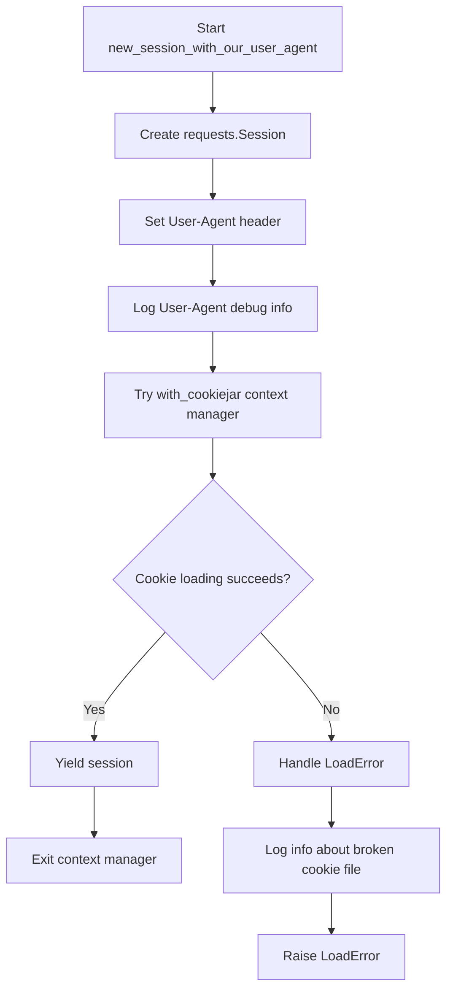
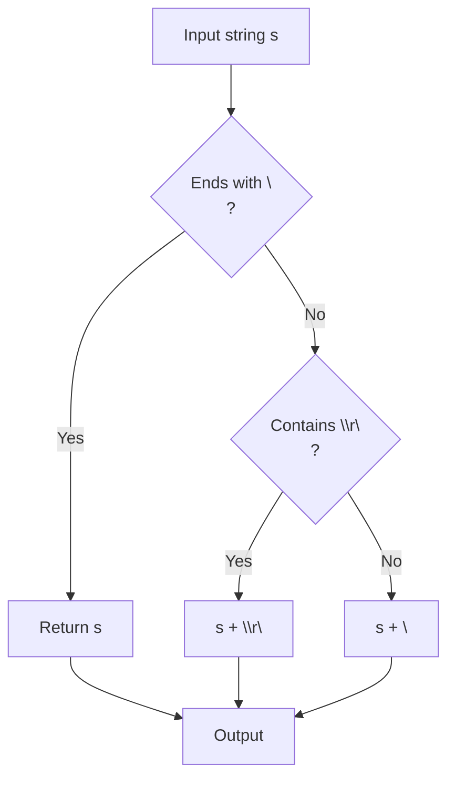
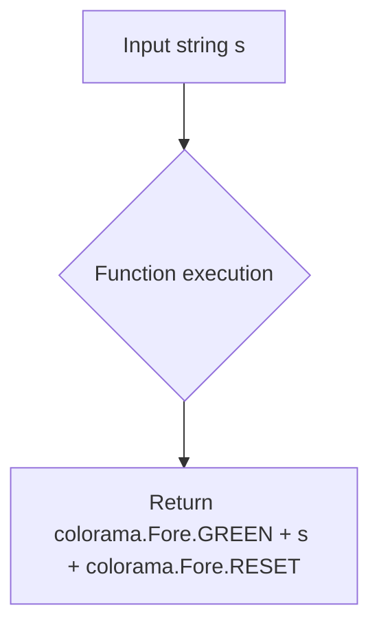
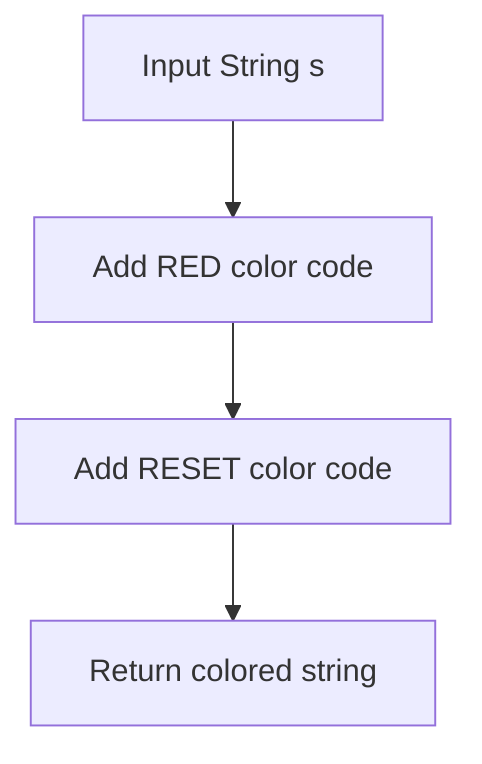
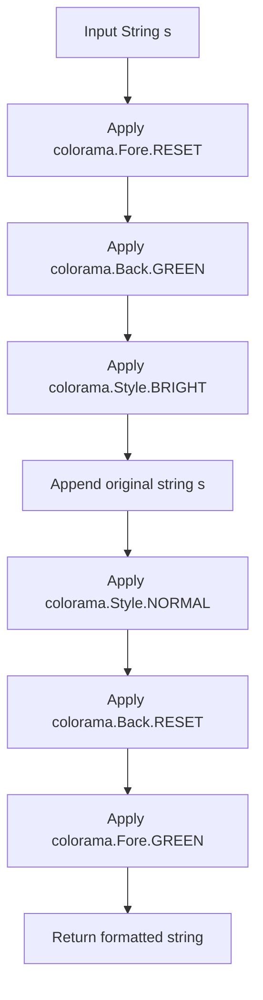
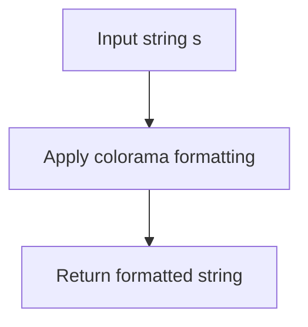
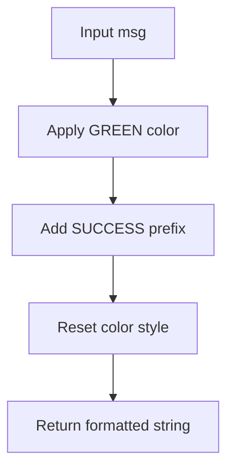
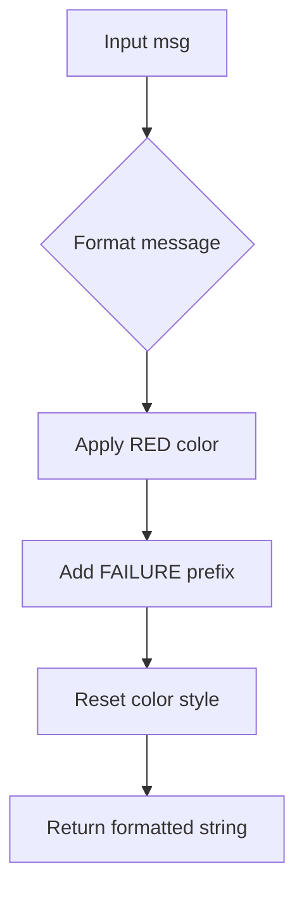
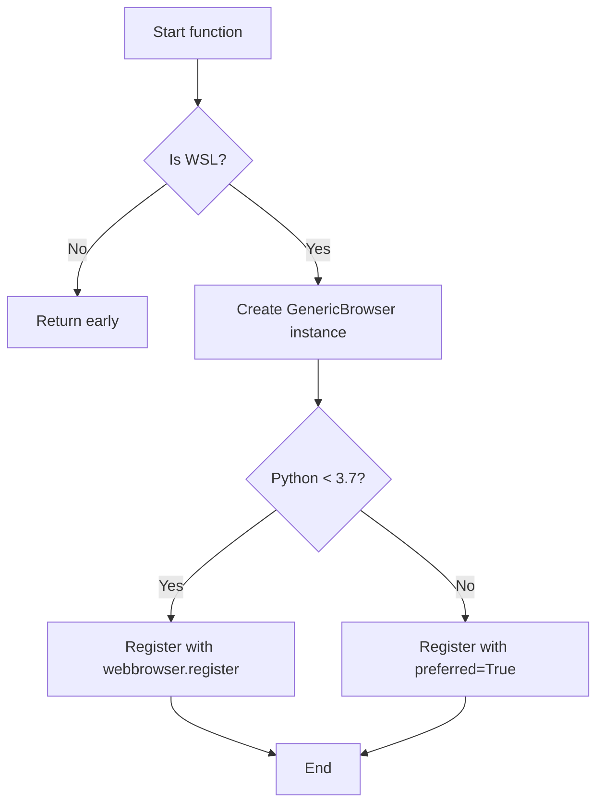

# `utils.py`

## `onlinejudge_command.utils.new_session_with_our_user_agent` · *function*

## Summary:
Creates a requests session with a custom user agent and cookie handling for online judge interactions.

## Description:
This function initializes a requests.Session object with a standardized User-Agent header that identifies the online judge command tool. It wraps the session with cookie management functionality to persist authentication state across requests. The function is designed to be used as a context manager to ensure proper cleanup of the session and cookie jar.

## Args:
    path (pathlib.Path): Path to the cookie jar file used to store and load HTTP cookies for persistent sessions.

## Returns:
    Iterator[requests.Session]: A context manager yielding a requests.Session configured with the custom User-Agent and cookie handling.

## Raises:
    http.cookiejar.LoadError: When the cookie jar file cannot be loaded due to corruption or format issues.

## Constraints:
    Preconditions:
        - The path parameter must point to a valid file location where cookies can be read from/written to
        - The file system must allow read/write operations at the specified path
    
    Postconditions:
        - The returned session will have a properly formatted User-Agent header
        - The session will manage cookies through the provided file path
        - The session will be properly closed after exiting the context

## Side Effects:
    - Creates or modifies a cookie jar file at the specified path
    - Makes network requests when the yielded session is used
    - Logs debug information about the User-Agent header
    - May log informational messages about broken cookie files

## Control Flow:


## Examples:
```python
# Basic usage
from pathlib import Path
import requests

cookie_path = Path("cookies.jar")
with new_session_with_our_user_agent(path=cookie_path) as session:
    response = session.get("https://example.com")
    # Session automatically handles cookies
```

## `onlinejudge_command.utils.textfile` · *function*

## Summary:
Normalizes text content by ensuring it ends with a standard newline character.

## Description:
This utility function standardizes text formatting by guaranteeing that the returned string ends with a newline character. It handles various line ending conventions and ensures consistent text output formatting. The function prioritizes Windows-style line endings (\r\n) when they are present in the input.

## Args:
    s (str): Input text string that may or may not end with a newline character

## Returns:
    str: The input string with a trailing newline character added if necessary. If the input contains Windows-style line endings (\r\n), it preserves those and adds \r\n at the end. Otherwise, it adds Unix-style newline (\n).

## Raises:
    None

## Constraints:
    Precondition: Input must be a string
    Postcondition: Output string will always end with a newline character ('\n')

## Side Effects:
    None

## Control Flow:


## Examples:
    >>> textfile("hello")
    'hello\\n'
    
    >>> textfile("hello\\n")
    'hello\\n'
    
    >>> textfile("hello\\r\\n")
    'hello\\r\\n'
    
    >>> textfile("hello\\r\\nworld")
    'hello\\r\\nworld\\r\\n'
```

## `onlinejudge_command.utils.exec_command` · *function*

## Summary:
Executes shell commands with optional stdin input, timeout, and memory profiling capabilities.

## Description:
This function provides a standardized way to execute shell commands while handling various execution scenarios including input redirection, timeout management, and resource monitoring via GNU time. It encapsulates the complexity of subprocess management, proper cleanup of child processes, and cross-platform compatibility considerations.

The function is extracted to centralize subprocess execution logic and ensure consistent error handling, resource cleanup, and cross-platform behavior across the application. This abstraction allows callers to focus on the command execution intent rather than implementation details of process management.

## Args:
- command_str (str): The shell command to execute as a string
- stdin (Optional[BinaryIO]): Input stream to connect to the process standard input
- input (Optional[bytes]): Direct input bytes to send to the process
- timeout (Optional[float]): Maximum time in seconds to wait for command completion
- gnu_time (Optional[str]): Path to GNU time executable for memory profiling

## Returns:
A tuple containing:
- info (Dict[str, Any]): Execution metadata with keys:
  - 'answer' (Optional[bytes]): Output from the command's stdout
  - 'elapsed' (float): Execution time in seconds
  - 'memory' (Optional[float]): Peak memory usage in megabytes (when gnu_time is used)
- proc (subprocess.Popen): The process object for further inspection

## Raises:
- FileNotFoundError: When the command executable doesn't exist
- PermissionError: When the command executable lacks execution permissions

## Constraints:
- Preconditions: 
  - command_str must be a valid shell command string
  - If input is provided, stdin must be None (they are mutually exclusive)
- Postconditions:
  - The process is properly terminated/cleaned up regardless of execution outcome
  - Memory profiling data is parsed correctly when gnu_time is used

## Side Effects:
- Executes external shell commands
- May write temporary files when gnu_time is used
- Writes log messages to the logger (from logging module)
- Modifies process group membership when using gnu_time on POSIX systems
- May terminate child processes if timeout occurs or cleanup is needed
- Exits the program with status 1 on FileNotFoundError or PermissionError

## Control Flow:
```mermaid
flowchart TD
    A[Start exec_command] --> B{input provided?}
    B -- Yes --> C[Assert stdin is None and set stdin to PIPE]
    B -- No --> C
    C --> D{gnu_time provided?}
    D -- Yes --> E[Create temp file context]
    D -- No --> F[Use ExitStack context]
    E --> G
    F --> G
    G --> H[Split command string with shlex.split]
    H --> I{gnu_time provided?}
    I -- Yes --> J[Prepend GNU time arguments]
    I -- No --> K
    J --> K
    K --> L{Windows OS?}
    L -- Yes --> M[Encode/decode command string for Windows compatibility]
    L -- No --> N
    M --> N
    N --> O[Record start time with perf_counter]
    O --> P{gnu_time + POSIX?}
    P -- Yes --> Q[Set preexec_fn to os.setsid]
    P -- No --> R
    Q --> R
    R --> S[Create subprocess.Popen with specified parameters]
    S --> T{Process creation failed?}
    T -- Yes --> U[Log error and exit with sys.exit(1)]
    T -- No --> V[Call proc.communicate with input and timeout]
    V --> W{Timeout occurred?}
    W -- Yes --> X[Continue with partial result]
    W -- No --> Y
    X --> Y
    Y --> Z[Cleanup child process with proper termination]
    Z --> AA[Record end time with perf_counter]
    AA --> AB{gnu_time provided?}
    AB -- Yes --> AC[Read memory data from temp file]
    AC --> AD[Parse memory value from GNU time output]
    AD --> AE[Return results]
    AB -- No --> AE
```

## Examples:
```python
# Basic command execution
info, proc = exec_command("echo Hello World")
print(f"Output: {info['answer']}")
print(f"Elapsed time: {info['elapsed']}s")

# Command with input
info, proc = exec_command("cat", input=b"Hello\nWorld\n")
print(f"Output: {info['answer']}")

# Command with timeout
info, proc = exec_command("sleep 10", timeout=5.0)
print(f"Elapsed time: {info['elapsed']}s (likely truncated)")

# Command with memory profiling
info, proc = exec_command("your_program", gnu_time="/usr/bin/time")
print(f"Memory usage: {info['memory']} MB")

# Error handling example
try:
    info, proc = exec_command("nonexistent_command")
except (FileNotFoundError, PermissionError) as e:
    print(f"Command failed: {e}")
```

## `onlinejudge_command.utils.green` · *function*

## Summary:
Returns a colored string with green foreground text using ANSI color codes.

## Description:
Applies green text coloring to the input string using colorama library for terminal display. This function is used to make text appear in green when printed to terminals that support ANSI color codes.

## Args:
    s (str): The input string to be colored green

## Returns:
    str: The input string wrapped with colorama green foreground and reset ANSI escape sequences

## Raises:
    None

## Constraints:
    Preconditions:
    - Input must be a string
    - Colorama must be properly initialized in the environment
    
    Postconditions:
    - Output string contains ANSI escape codes for green text
    - Original string content is preserved with added color formatting

## Side Effects:
    None

## Control Flow:


## Examples:
    >>> green("Success!")
    '\x1b[32mSuccess!\x1b[0m'
    
    >>> print(green("This is green text"))
    This is green text (displayed in green)

## `onlinejudge_command.utils.red` · *function*

## Summary:
Returns a string with ANSI red color formatting applied.

## Description:
This function wraps the input string with colorama ANSI escape codes to render text in red color when displayed in terminals that support ANSI color codes. It is used for visual emphasis in command-line output.

## Args:
    s (str): The input string to be colored red

## Returns:
    str: The input string with ANSI red color codes prepended and reset codes appended

## Raises:
    None

## Constraints:
    Preconditions:
        - Input must be a string
    Postconditions:
        - Output string contains ANSI color codes for red text
        - Original string content is preserved

## Side Effects:
    None

## Control Flow:


## Examples:
    >>> red("Error message")
    '\x1b[31mError message\x1b[0m'

## `onlinejudge_command.utils.green_diff` · *function*

## Summary:
Formats a string with a green background and bright text for terminal display.

## Description:
Applies ANSI color codes using the colorama library to render text with a green background and bright white text. This function is used to highlight differences or important text elements in command-line output.

## Args:
    s (str): The input string to be formatted with green background and bright text.

## Returns:
    str: The input string wrapped with ANSI color escape sequences for green background and bright text formatting.

## Raises:
    None: This function does not raise any exceptions.

## Constraints:
    Preconditions:
        - Input must be a string
        - colorama library must be properly initialized
    
    Postconditions:
        - Output string contains ANSI escape sequences for terminal formatting
        - Original string content is preserved within the formatting

## Side Effects:
    None: This function has no side effects beyond returning a formatted string.

## Control Flow:


## Examples:
```python
# Basic usage
formatted_text = green_diff("This is important text")
print(formatted_text)  # Displays with green background and bright text

# In context of diff highlighting
diff_output = green_diff("Added line content")
print(diff_output)
```

## `onlinejudge_command.utils.red_diff` · *function*

## Summary:
Formats a string with bright red background and white text for terminal display.

## Description:
Applies colorama terminal formatting to make text appear with a bright red background and normal text styling. This function is typically used for highlighting differences or errors in command-line output.

## Args:
    s (str): The input string to be formatted with red coloring.

## Returns:
    str: The input string wrapped with colorama escape sequences for red background and bright text formatting.

## Raises:
    None: This function does not raise any exceptions.

## Constraints:
    Preconditions:
        - Input must be a string
        - Colorama must be properly initialized in the environment
    
    Postconditions:
        - Output string contains proper ANSI escape codes for terminal coloring
        - Original string content is preserved within the formatting

## Side Effects:
    None: This function has no side effects beyond returning a formatted string.

## Control Flow:


## Examples:
    >>> red_diff("error message")
    '\x1b[0m\x1b[41m\x1b[1merror message\x1b[22m\x1b[49m\x1b[31m'
    
    >>> print(red_diff("test"))
    # Displays "test" with bright red background in terminal

## `onlinejudge_command.utils.success` · *function*

## Summary:
Formats a success message with green color coding for terminal output.

## Description:
This function takes a message string and wraps it with ANSI color codes to display it in green, indicating a successful operation. It's designed to provide consistent visual feedback in command-line interfaces by standardizing success message formatting.

The function is extracted into its own utility to centralize the formatting logic for success messages, ensuring consistent appearance across the application without duplicating color formatting code throughout the codebase.

## Args:
    msg (str): The success message to be formatted with green coloring.

## Returns:
    str: A formatted string with green color codes that displays 'SUCCESS: ' followed by the original message in green text.

## Raises:
    None

## Constraints:
    None

## Side Effects:
    Uses colorama library to apply terminal color formatting.

## Control Flow:


## Examples:
```python
# Basic usage
result = success("File downloaded successfully")
print(result)  # Prints: SUCCESS: File downloaded successfully (in green)

# In a command-line context
status = success("Submission completed")
print(status)  # Prints: SUCCESS: Submission completed (in green)
```

## `onlinejudge_command.utils.failure` · *function*

## Summary:
Formats an error message with red coloring for terminal display.

## Description:
Creates a standardized error message format by prefixing "FAILURE" with red color coding using colorama. This utility function ensures consistent error messaging across the application with visual distinction in terminal output.

## Args:
    msg (str): The error message to be formatted and displayed.

## Returns:
    str: A formatted error message string with "FAILURE" prefixed in red color followed by the original message.

## Raises:
    None: This function does not raise any exceptions.

## Constraints:
    Preconditions:
        - The input message should be a string
        - Colorama must be properly initialized for terminal color support
    
    Postconditions:
        - The returned string contains the original message wrapped with red color formatting
        - The returned string follows the pattern: "\033[31mFAILURE\033[0m: {original_message}"

## Side Effects:
    None: This function has no side effects beyond returning a formatted string.

## Control Flow:


## Examples:
    >>> failure("Connection failed")
    '\x1b[31mFAILURE\x1b[0m: Connection failed'
    
    >>> failure("Invalid input provided")
    '\x1b[31mFAILURE\x1b[0m: Invalid input provided'

## `onlinejudge_command.utils.remove_suffix` · *function*

## Summary:
Removes a specified suffix from the end of a string after validating that the string ends with that suffix.

## Description:
This utility function removes a given suffix from a string by slicing off the last n characters, where n equals the length of the suffix. The function performs an assertion check to ensure the input string actually ends with the specified suffix before performing the removal operation. This extraction into a separate function provides a clear interface for suffix removal operations while enforcing the precondition that the suffix must be present.

## Args:
    s (str): The input string from which to remove the suffix. Must end with the specified suffix.
    suffix (str): The suffix to remove from the end of the input string. Must be a non-empty string.

## Returns:
    str: A new string with the specified suffix removed from the end of the input string.

## Raises:
    AssertionError: When the input string `s` does not end with the specified `suffix`.

## Constraints:
    Preconditions:
        - The input string `s` must end with the specified `suffix`
        - Both `s` and `suffix` must be non-empty strings
    Postconditions:
        - The returned string will have the same content as `s` except for the removed suffix
        - The returned string will be exactly `len(s) - len(suffix)` characters long

## Side Effects:
    None: This function has no side effects. It only performs string manipulation and assertion checking.

## Control Flow:
```mermaid
flowchart TD
    A[Start remove_suffix] --> B{Does s end with suffix?}
    B -- No --> C[AssertionError]
    B -- Yes --> D[Return s[:-len(suffix)]]
    C --> E[Exit with error]
    D --> F[End remove_suffix]
```

## Examples:
    >>> remove_suffix("example.txt", ".txt")
    'example'
    
    >>> remove_suffix("test.html", ".html")
    'test'
    
    >>> remove_suffix("file.py", ".py")
    'file'
    
    >>> remove_suffix("hello", "lo")
    'hel'
    
    # This would raise an AssertionError:
    # remove_suffix("hello", "world")
```

## `onlinejudge_command.utils.is_windows_subsystem_for_linux` · *function*

## Summary:
Determines whether the current execution environment is Windows Subsystem for Linux (WSL).

## Description:
Checks if the operating system is Linux and if the kernel release string contains 'microsoft' (case-insensitive), which is a distinctive characteristic of Windows Subsystem for Linux environments. This detection method leverages the fact that WSL kernel releases include the string "microsoft" to identify the virtualized Linux environment.

## Returns:
    bool: True if running under Windows Subsystem for Linux, False otherwise.

## Constraints:
    Preconditions: The platform module must be available and properly reporting system information.
    Postconditions: Always returns a boolean value representing WSL detection status.

## Side Effects:
    None: This function performs no I/O operations or external state mutations.

## Control Flow:
```mermaid
flowchart TD
    A[Start] --> B{platform.uname().system == 'Linux'?}
    B -- No --> C[Return False]
    B -- Yes --> D{'microsoft' in platform.uname().release.lower()?}
    D -- No --> C
    D -- Yes --> E[Return True]
```

## `onlinejudge_command.utils.webbrowser_register_explorer_exe` · *function*

## Summary:
Registers the Windows Explorer browser for use in Windows Subsystem for Linux environments.

## Description:
This function specifically configures the webbrowser module to use 'explorer.exe' as the default browser when running in Windows Subsystem for Linux (WSL). It addresses compatibility issues with terminal output clearing when using wslview via www-browser. The registration is only performed when running in WSL, and uses different approaches for Python versions before and after 3.7.

## Args:
    None

## Returns:
    None

## Raises:
    None

## Constraints:
    Preconditions:
    - Must be running in Windows Subsystem for Linux environment
    - The 'explorer.exe' executable must be available in the system PATH
    
    Postconditions:
    - The 'explorer' browser is registered with the webbrowser module
    - Registration is only performed when in WSL environment

## Side Effects:
    - Modifies global webbrowser module state by registering a new browser
    - No external I/O operations beyond the webbrowser module registration

## Control Flow:


## Examples:
```python
# This function is typically called internally by the application
# and doesn't require direct user invocation
webbrowser_register_explorer_exe()

# After execution, webbrowser.get('explorer') would work in WSL
# browser = webbrowser.get('explorer')
# browser.open('https://example.com')
```

## `onlinejudge_command.utils.get_default_command` · *function*

## Summary:
Returns the default executable filename based on the operating system platform.

## Description:
This function provides the appropriate default executable filename for the current operating system. On Windows systems, it returns '.\\a.exe', while on Unix-like systems (Linux, macOS, etc.), it returns './a.out'. This abstraction allows the codebase to work consistently across different platforms without hardcoding platform-specific executable names.

## Args:
    None

## Returns:
    str: Platform-specific default executable filename:
         - '.\\a.exe' on Windows systems
         - './a.out' on Unix-like systems (Linux, macOS, etc.)

## Raises:
    None

## Constraints:
    Preconditions:
        - The platform module must be available and functional
        - The system must be one of the supported platforms (Windows or Unix-like)
    
    Postconditions:
        - Always returns a valid string representing an executable filename
        - The returned string follows the appropriate path format for the platform

## Side Effects:
    None

## Control Flow:
```mermaid
flowchart TD
    A[Start get_default_command] --> B{platform.system() == 'Windows'?}
    B -- Yes --> C[Return '.\\a.exe']
    B -- No --> D[Return './a.out']
    C --> E[End]
    D --> E
```

## Examples:
    # On Windows
    >>> get_default_command()
    '.\\a.exe'
    
    # On Linux/macOS
    >>> get_default_command()
    './a.out'

