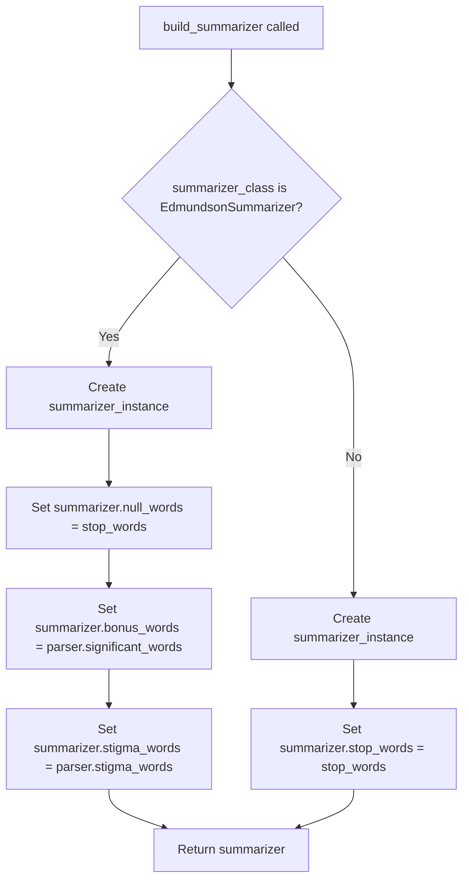

# `__main__.py`

## `sumy.__main__.main` · *function*

## Summary:
Entry point for the sumy command-line interface that processes text documents and generates summaries using various summarization algorithms.

## Description:
This function serves as the primary command-line interface for the sumy library. It parses command-line arguments using docopt, configures the appropriate summarizer and parser based on user input, performs text summarization, and outputs the results to standard output. The function supports multiple input sources (stdin, files, URLs) and various summarization methods through command-line flags.

## Args:
    args (list[str], optional): Command-line arguments to parse. If None, sys.argv[1:] is used. Arguments are parsed using docopt based on the module's docstring.

## Returns:
    int: Exit status code (0 for successful execution).

## Raises:
    ValueError: When an unsupported document format is specified (inferred from handle_arguments function).

## Constraints:
    Preconditions:
    - The sumy package must be properly installed
    - Valid command-line arguments must be provided according to the docopt specification
    - Required dependencies for parsers and summarizers must be available
    
    Postconditions:
    - Standard output contains the generated summary sentences
    - Function returns successfully with exit code 0

## Side Effects:
    - Reads from stdin, files, or URLs based on command-line arguments
    - Writes summary sentences to standard output
    - May read from filesystem when file arguments are provided
    - May make HTTP requests when URL arguments are provided

## Control Flow:
```mermaid
flowchart TD
    A[Start main()] --> B{Parse args with docopt}
    B --> C[Call handle_arguments()]
    C --> D[Get summarizer, parser, items_count]
    D --> E[Iterate over summarized sentences]
    E --> F{PY3?}
    F -->|Yes| G[Print with to_unicode]
    F -->|No| H[Print with to_bytes]
    G --> I[Return 0]
    H --> I
```

## Examples:
    # Summarize text from stdin using default settings
    echo "This is sample text to summarize." | python -m sumy
    
    # Summarize HTML content from URL with 5 sentences
    python -m sumy --url="http://example.com/article.html" --length=5
    
    # Summarize plaintext file with TextRank algorithm
    python -m sumy --file="document.txt" --text-rank

## `sumy.__main__.handle_arguments` · *function*

## Summary:
Processes command-line arguments to configure and initialize text summarization components including parsers, stemmers, and summarizers.

## Description:
This function serves as the argument handler for the sumy command-line interface, parsing input arguments to determine the document source, processing method, and summarization parameters. It orchestrates the setup of the entire summarization pipeline by selecting appropriate parsers, stemmers, and summarizers based on user-provided options.

The function extracts document content from various sources (URL, file, text input, or stdin), configures language processing components like tokenizers and stemmers, and selects the appropriate summarization algorithm based on command-line flags. It's extracted into its own function to separate argument parsing and pipeline initialization concerns from the main execution logic.

## Args:
    args (dict): Dictionary containing parsed command-line arguments with keys such as '--url', '--file', '--text', '--format', '--length', '--language', '--stopwords'
    default_input_stream (TextIO, optional): Default input stream for reading from stdin when no other input source is specified. Defaults to sys.stdin

## Returns:
    tuple: A tuple containing three elements:
        - summarizer: An instance of a summarizer class configured with stop words, stemmer, and parser
        - parser: An instance of a parser class initialized with document content and tokenizer
        - items_count: An ItemsCount object representing the desired summary length

## Raises:
    ValueError: When an unsupported document format is specified in --format argument

## Constraints:
    Preconditions:
        - args dictionary must contain required keys with appropriate types
        - At least one input source must be specified (--url, --file, --text, or stdin)
        - Language must be supported by the system
        - Stop word files (if specified via --stopwords) must be readable
    
    Postconditions:
        - Returns a valid summarizer instance ready for text processing
        - Parser is properly initialized with document content and tokenizer
        - ItemsCount is created with valid length specification

## Side Effects:
    - Reads from external sources (URL via HTTP, files from disk, stdin)
    - May read from filesystem when --stopwords file is specified
    - Makes HTTP requests when --url is provided

## Control Flow:
```mermaid
flowchart TD
    A[Start handle_arguments] --> B{--url specified?}
    B -- Yes --> C[Select HTML parser]
    B -- No --> D{--file specified?}
    D -- Yes --> E[Select plaintext parser]
    D -- No --> F{--text specified?}
    F -- Yes --> G[Select plaintext parser]
    F -- No --> H[Select plaintext parser]
    C --> I[Fetch URL content]
    E --> J[Read file content]
    G --> K[Use --text content]
    H --> L[Read from stdin]
    I --> M[Continue]
    J --> M
    K --> M
    L --> M
    M --> N[Create ItemsCount]
    N --> O{--stopwords specified?}
    O -- Yes --> P[Read custom stop words]
    O -- No --> Q[Get default stop words]
    P --> R[Initialize parser]
    Q --> R
    R --> S[Initialize stemmer]
    S --> T[Select summarizer class]
    T --> U[Build summarizer instance]
    U --> V[Return (summarizer, parser, items_count)]
```

## Examples:
```python
# Typical usage with URL input
args = {
    '--url': 'https://example.com/article',
    '--format': 'html',
    '--length': 5,
    '--language': 'english'
}
summarizer, parser, count = handle_arguments(args)

# Usage with file input and custom stopwords
args = {
    '--file': '/path/to/document.txt',
    '--length': 10,
    '--language': 'english',
    '--stopwords': '/path/to/custom-stopwords.txt'
}
summarizer, parser, count = handle_arguments(args)

# Usage with text input
args = {
    '--text': 'This is the text to summarize.',
    '--length': 3,
    '--language': 'english'
}
summarizer, parser, count = handle_arguments(args)
```

## `sumy.__main__.build_summarizer` · *function*

## Summary:
Creates and configures a summarizer instance with appropriate parameters based on the summarizer type.

## Description:
This function implements a factory pattern for creating summarizer instances. It handles the initialization of different summarizer types with their specific configuration requirements. The function ensures that each summarizer receives the correct parameters and attributes needed for proper operation, with special handling for EdmundsonSummarizer which requires additional word collections beyond standard stop words.

## Args:
    summarizer_class (type): The class of the summarizer to instantiate (e.g., LuhnSummarizer, EdmundsonSummarizer)
    stop_words (frozenset): Collection of stop words to be used for filtering
    stemmer (Stemmer): Stemmer instance for word normalization
    parser: Parser instance containing document-specific data (particularly significant_words and stigma_words for EdmundsonSummarizer)

## Returns:
    AbstractSummarizer: Configured summarizer instance ready for use in document summarization

## Raises:
    None explicitly raised by this function

## Constraints:
    Preconditions:
    - summarizer_class must be a valid summarizer class that accepts a stemmer in its constructor
    - stop_words must be a frozenset of words
    - stemmer must be a valid Stemmer instance
    - parser must have significant_words and stigma_words attributes when EdmundsonSummarizer is used

    Postconditions:
    - Returns a properly initialized summarizer instance
    - For EdmundsonSummarizer: null_words, bonus_words, and stigma_words are set appropriately
    - For other summarizers: stop_words attribute is set appropriately

## Side Effects:
    None

## Control Flow:


## Examples:
```python
# Creating a Luhn summarizer
from summarizers.luhn import LuhnSummarizer
from nlp.stemmers import Stemmer
from parsers.plaintext import PlaintextParser

parser = PlaintextParser.from_string("Sample text", Tokenizer('english'))
stemmer = Stemmer('english')
stop_words = frozenset(['the', 'and', 'or'])

summarizer = build_summarizer(LuhnSummarizer, stop_words, stemmer, parser)
# Returns LuhnSummarizer instance with stop_words set

# Creating an Edmundson summarizer
from summarizers.edmundson import EdmundsonSummarizer

summarizer = build_summarizer(EdmundsonSummarizer, stop_words, stemmer, parser)
# Returns EdmundsonSummarizer instance with null_words, bonus_words, and stigma_words set
```

