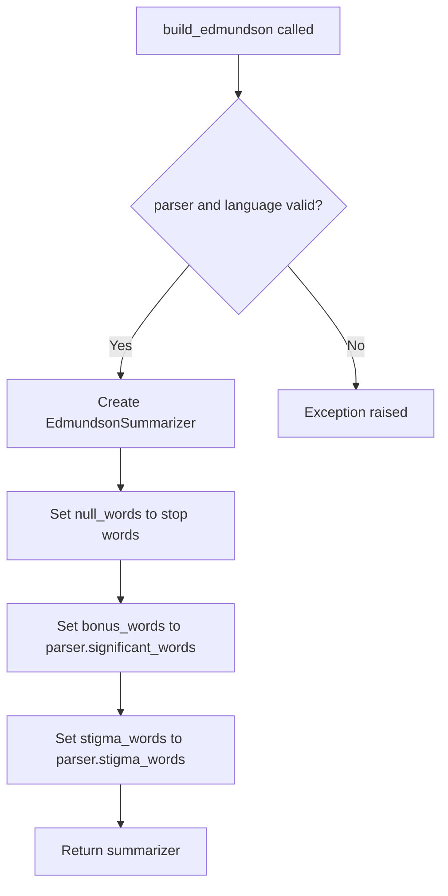
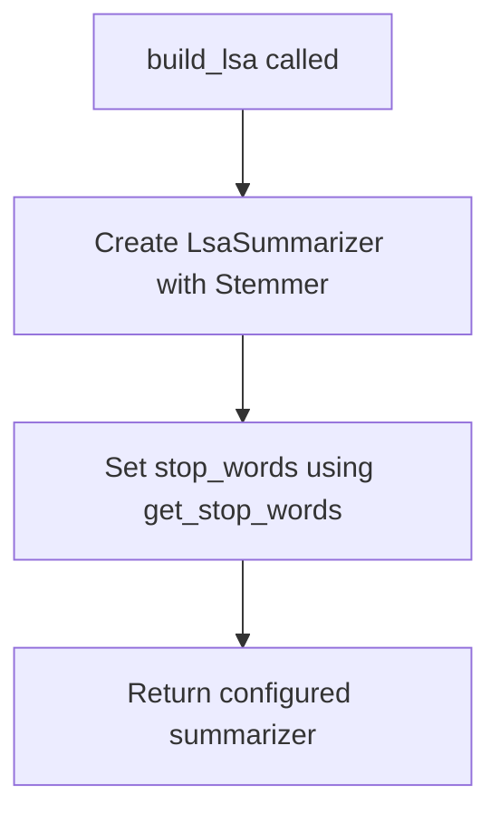
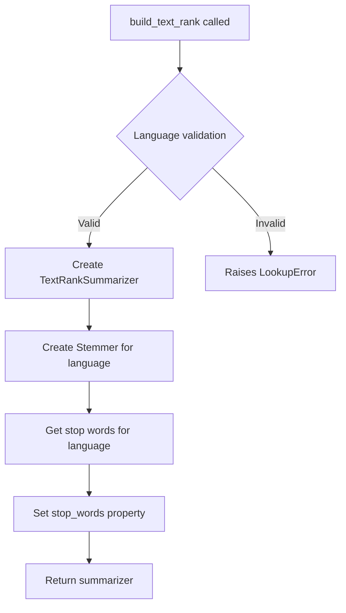
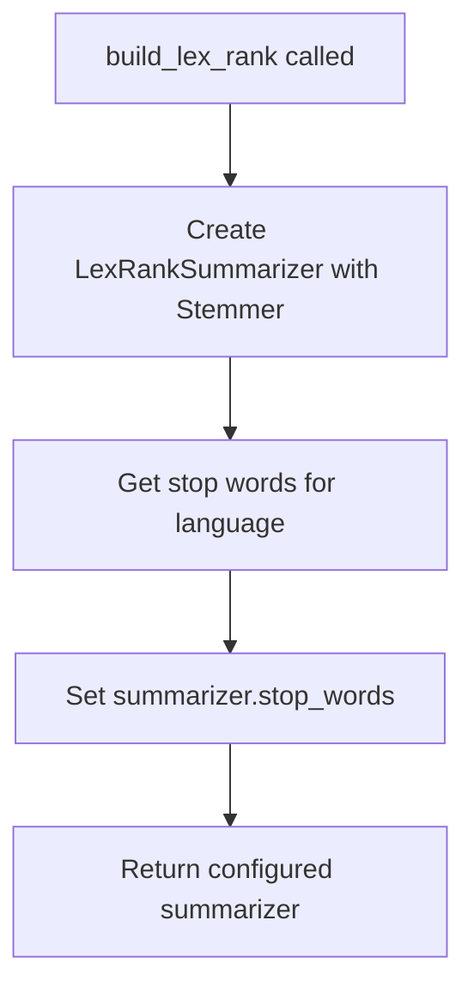
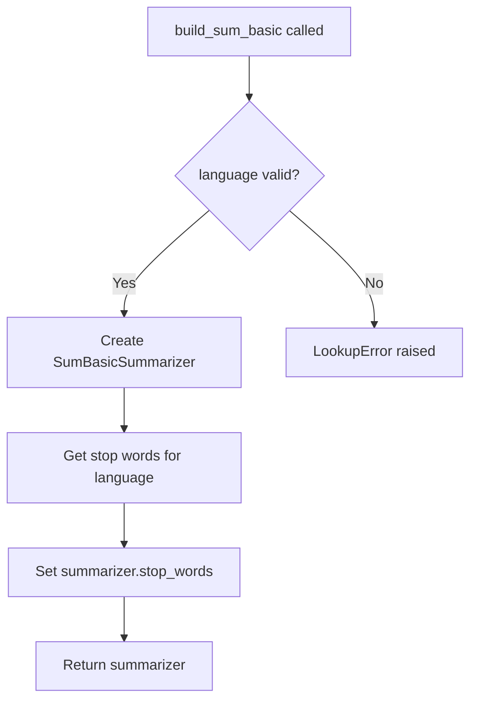
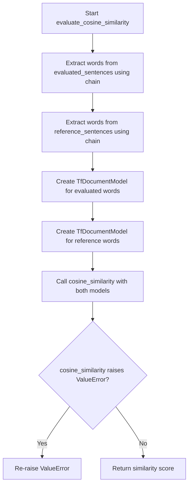
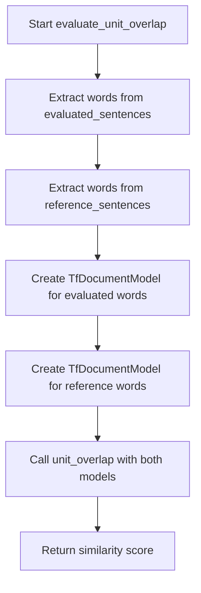
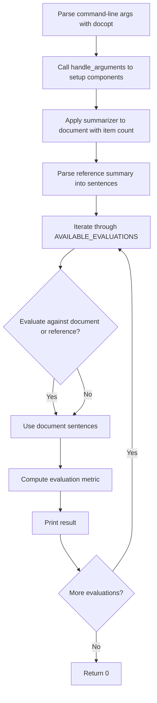

# `__main__.py`

## `sumy.evaluation.__main__.build_random` · *function*

## Summary:
Creates and returns a RandomSummarizer instance without using the provided parser or language parameters.

## Description:
This function serves as a factory method for creating RandomSummarizer objects. It follows the same interface pattern as other build functions in the module (like build_lex_rank, build_text_rank, etc.) by accepting parser and language parameters, but ignores them since the RandomSummarizer does not require language-specific or parser-specific configuration. The function is designed to be used in command-line interfaces where different summarizer types are selected dynamically through a factory pattern.

## Args:
    parser: A parser object (unused in this implementation)
    language: Language identifier string (unused in this implementation)

## Returns:
    RandomSummarizer: An instance of the RandomSummarizer class configured with default settings.

## Raises:
    None explicitly raised by this function.

## Constraints:
    Preconditions: None required for function invocation.
    Postconditions: Always returns a RandomSummarizer instance.

## Side Effects:
    None.

## Control Flow:
```mermaid
flowchart TD
    A[build_random called] --> B{Parameters ignored}
    B --> C[Return RandomSummarizer()]
```

## Examples:
```python
# Typical usage in command-line interface context
parser = PlaintextParser.from_string("Sample text", Tokenizer("english"))
summarizer = build_random(parser, "english")
result = summarizer(document, 3)
```

## `sumy.evaluation.__main__.build_luhn` · *function*

## Summary:
Creates and configures a Luhn summarizer with language-specific stemming and stop words.

## Description:
Factory function that constructs a LuhnSummarizer instance with appropriate language processing capabilities. This function encapsulates the setup logic for creating a Luhn summarizer, ensuring proper initialization with language-specific stemmers and stop words. The function follows a consistent pattern with other build_* functions in this module for creating various summarizer types.

## Args:
    parser: Parser object (unused in Luhn implementation, maintained for interface consistency)
    language (str): Language code string for determining appropriate stemmer and stop words

## Returns:
    LuhnSummarizer: Configured summarizer instance ready for text summarization

## Raises:
    LookupError: When the specified language is not supported or stop-words data is unavailable for the language

## Constraints:
    Preconditions:
        - language parameter must be a valid language code recognized by the system
        - Stop-word data files must exist for the specified language
    
    Postconditions:
        - Returned summarizer is properly initialized with stemmer and stop words
        - The summarizer's stop_words property contains normalized stop words for the language

## Side Effects:
    None

## Control Flow:
```mermaid
flowchart TD
    A[build_luhn called] --> B[Create LuhnSummarizer]
    B --> C[Initialize with Stemmer(language)]
    C --> D[Set stop_words from get_stop_words(language)]
    D --> E[Return configured summarizer]
```

## Examples:
```python
# Basic usage
parser = PlaintextParser.from_file("document.txt", Tokenizer("english"))
summarizer = build_luhn(parser, "english")
```

## `sumy.evaluation.__main__.build_edmundson` · *function*

## Summary:
Configures and returns an EdmundsonSummarizer instance with language-specific stemming and word lists from a parsed document.

## Description:
Creates an EdmundsonSummarizer with a stemmer appropriate for the specified language, and configures it with stop words, significant words (bonus words), and stigma words extracted from the provided parser. This function encapsulates the setup logic for the Edmundson summarization algorithm, separating the configuration concerns from the main summarization process.

## Args:
    parser: Document parser instance (either HtmlParser or PlaintextParser) containing document analysis results
        - Must have significant_words and stigma_words properties
    language (str): Language code string (e.g., 'english', 'french') for stemmer selection and stop-word lookup

## Returns:
    EdmundsonSummarizer: Configured summarizer instance ready for document summarization

## Raises:
    LookupError: When stop-words are not available for the specified language
    ValueError: When negative weights are provided to the summarizer (though not directly raised by this function)

## Constraints:
    Preconditions:
        - Parser must be an instance of HtmlParser or PlaintextParser
        - Parser must have significant_words and stigma_words attributes
        - Language must be a valid language code supported by the stemmer
    Postconditions:
        - Returned summarizer is properly initialized with stemmer
        - Summarizer's null_words attribute is set to stop words for the language
        - Summarizer's bonus_words attribute is set to parser's significant_words
        - Summarizer's stigma_words attribute is set to parser's stigma_words

## Side Effects:
    None

## Control Flow:


## Examples:
```python
# Basic usage with HTML parser
parser = HtmlParser.from_string(html_content, "http://example.com", Tokenizer("english"))
summarizer = build_edmundson(parser, "english")

# Basic usage with plaintext parser  
parser = PlaintextParser.from_string(text_content, Tokenizer("english"))
summarizer = build_edmundson(parser, "english")
```

## `sumy.evaluation.__main__.build_lsa` · *function*

## Summary
Creates and configures an LSA (Latent Semantic Analysis) summarizer with language-specific stemming and stop words.

## Description
This function constructs an LsaSummarizer instance with appropriate language processing capabilities. It initializes the summarizer with a stemmer for the specified language and configures it with language-specific stop words. The function serves as a factory method for creating properly configured LSA summarizers.

The logic is extracted into its own function to encapsulate the configuration process and provide a clean interface for creating LSA summarizers with proper language support, separating the concerns of summarizer creation from the rest of the application logic.

## Args
    parser: Document parser instance (parameter accepted for interface consistency but not used in current implementation)
    language (str): Language code string for determining stemmer and stop words

## Returns
    LsaSummarizer: Configured summarizer instance ready for text summarization

## Raises
    LookupError: When stop-words are not available for the specified language
    ValueError: When NumPy dependency is missing for LSA algorithm execution

## Constraints
    Preconditions:
        - Language parameter must be a valid language code recognized by the system
        - Stop-word data files must exist for the specified language
        - NumPy must be installed for LSA algorithm operations
    
    Postconditions:
        - Returned summarizer instance has properly configured stemmer
        - Returned summarizer instance has stop_words property set with language-appropriate stop words

## Side Effects
    None

## Control Flow


## Examples
```python
# Basic usage
parser = PlaintextParser.from_string("Sample text content", Tokenizer("english"))
summarizer = build_lsa(parser, "english")
```

## `sumy.evaluation.__main__.build_text_rank` · *function*

## Summary:
Creates and configures a TextRank summarizer with language-specific stemming and stop words.

## Description:
This function serves as a factory for creating properly initialized TextRankSummarizer instances. It takes a parser and language specification, creates a TextRankSummarizer with the appropriate stemmer for the language, and configures it with language-specific stop words. This extraction allows for consistent initialization of TextRank summarizers across different parts of the application. Note that while the parser parameter is accepted, it's not directly used in the configuration process - the TextRankSummarizer is initialized with a stemmer and stop words independently of the parser.

## Args:
    parser: A document parser instance (likely HtmlParser or PlaintextParser) - note that this parameter is not directly used in configuration
    language (str): Language code string (e.g., 'english', 'german') specifying the language for processing

## Returns:
    TextRankSummarizer: A configured TextRankSummarizer instance ready for document summarization

## Raises:
    LookupError: When the specified language is not supported or stop-words data is not available for the language

## Constraints:
    Preconditions:
        - The language parameter must be a valid language identifier recognized by the system
        - The parser must be compatible with the TextRankSummarizer interface
    
    Postconditions:
        - Returns a fully configured TextRankSummarizer instance
        - The returned summarizer has stop_words properly set for the specified language

## Side Effects:
    - None

## Control Flow:


## Examples:
```python
# Basic usage with plaintext parser
parser = PlaintextParser.from_string("Sample text content...", Tokenizer("english"))
summarizer = build_text_rank(parser, "english")

# Usage with HTML parser
parser = HtmlParser.from_file("document.html", Tokenizer("english"))
summarizer = build_text_rank(parser, "english")
```

## `sumy.evaluation.__main__.build_lex_rank` · *function*

## Summary:
Creates and configures a LexRank summarizer with language-specific stemming and stop words.

## Description:
This function constructs a LexRankSummarizer instance with appropriate language processing capabilities. It initializes the summarizer with a stemmer for the specified language and configures it with language-specific stop words to improve summarization quality. The function serves as a factory method for creating properly configured LexRank summarizers.

## Args:
    language (str): Language code string specifying the language for processing (e.g., 'english', 'german')

## Returns:
    LexRankSummarizer: A configured LexRankSummarizer instance ready for document summarization

## Raises:
    LookupError: When stop-words are not available for the specified language
    ValueError: When NumPy dependency is missing for LexRank algorithm execution

## Constraints:
    Preconditions:
    - The language parameter must be a valid language code recognized by the system
    - Stop-word files must exist for the specified language
    - NumPy must be installed for LexRank algorithm execution
    
    Postconditions:
    - Returns a fully configured LexRankSummarizer instance
    - The returned summarizer has stop_words property properly set
    - The summarizer is initialized with appropriate stemmer for the language

## Side Effects:
    None

## Control Flow:


## Examples:
```python
# Basic usage
summarizer = build_lex_rank("english")

# Using with different language
summarizer = build_lex_rank("german")

# Typical usage in summarization pipeline
from parsers.plaintext import PlaintextParser
from nlp.tokenizers import Tokenizer

parser = PlaintextParser.from_file("document.txt", Tokenizer("english"))
summarizer = build_lex_rank("english")
# Then use summarizer with parser and desired sentence count
```

## `sumy.evaluation.__main__.build_sum_basic` · *function*

## Summary:
Creates and configures a SumBasic summarizer with language-specific stemming and stop words.

## Description:
This function constructs a SumBasicSummarizer instance initialized with a language-specific stemmer and stop words. It serves as a factory function for creating properly configured SumBasic summarizers. The function is designed to be part of a larger summarization framework where different summarizer types are created through similar factory methods.

## Args:
    parser: Parser object (unused in current implementation)
    language (str): Language code for language-specific processing (e.g., 'english', 'german')

## Returns:
    SumBasicSummarizer: A configured summarizer instance ready for text summarization

## Raises:
    LookupError: When stop-words or stemmer are not available for the specified language

## Constraints:
    Preconditions:
        - language parameter must be a valid language identifier recognized by the system
        - The language must have corresponding stop-word data files available
    
    Postconditions:
        - Returns a SumBasicSummarizer instance with properly initialized stemmer and stop words
        - The returned summarizer is ready to be used for text summarization

## Side Effects:
    None

## Control Flow:


## Examples:
```python
# Basic usage
parser = PlaintextParser.from_string("Sample text for summarization.", Tokenizer("english"))
summarizer = build_sum_basic(parser, "english")
```

## `sumy.evaluation.__main__.build_kl` · *function*

## Summary:
Creates and configures a Kullback-Leibler divergence-based summarizer with language-specific stemming and stop words.

## Description:
This function constructs a KLSummarizer instance initialized with a stemmer appropriate for the specified language and configures its stop words collection. It serves as a factory function for creating KL-summarizer instances with proper language processing setup.

The function is extracted into its own component to encapsulate the instantiation and configuration logic for KLSummarizer, promoting reuse and maintaining clean separation between configuration concerns and the summarization algorithm itself. This allows different summarizer factories to be implemented consistently while keeping the core summarization logic separate.

## Args:
    language (str): Language code string (e.g., 'english', 'french') that determines the stemmer and stop words to use

## Returns:
    KLSummarizer: A configured instance of the Kullback-Leibler divergence summarizer with appropriate stemmer and stop words set

## Raises:
    LookupError: When stop-words are not available for the specified language
    LookupError: When a stemmer is not available for the specified language

## Constraints:
    Preconditions:
    - The language parameter must be a valid language code recognized by the system
    
    Postconditions:
    - Returns a fully configured KLSummarizer instance
    - The returned summarizer has its stop_words attribute properly initialized
    - The summarizer uses the appropriate stemmer for the specified language

## Side Effects:
    None

## Control Flow:
```mermaid
flowchart TD
    A[build_kl called with language] --> B[Create KLSummarizer with Stemmer(language)]
    B --> C[Get stop words for language using get_stop_words]
    C --> D[Set summarizer.stop_words = stop_words]
    D --> E[Return configured KLSummarizer]
```

## Examples:
```python
# Basic usage with English language
summarizer = build_kl(None, "english")

# Using with French language
summarizer = build_kl(None, "french")

# The returned summarizer can then be used for document summarization
# sentences = document.sentences
# summary = summarizer(document, 3)  # Get 3 most important sentences
```

## `sumy.evaluation.__main__.evaluate_cosine_similarity` · *function*

## Summary:
Computes the cosine similarity between two sets of sentences by converting them into TF document models and calculating their vector similarity.

## Description:
This function evaluates the semantic similarity between an evaluated set of sentences and a reference set of sentences using cosine similarity. It aggregates all words from each set of sentences, converts them into TF (Term Frequency) document models, and computes the cosine similarity between these models. This approach is commonly used in text summarization evaluation to measure how similar the generated summary is to the reference summary.

The function is extracted into its own component to separate the similarity calculation logic from the summarization process, enabling reuse across different evaluation scenarios and making the code more modular and testable.

## Args:
    evaluated_sentences (Iterable[sumy.nlp.Sentence]): An iterable of sentence objects containing word tokens to be evaluated
    reference_sentences (Iterable[sumy.nlp.Sentence]): An iterable of sentence objects containing word tokens to serve as reference

## Returns:
    float: The cosine similarity score between 0.0 and 1.0, where 1.0 indicates identical documents and 0.0 indicates no similarity

## Raises:
    ValueError: When either of the document models becomes empty (magnitude equals zero), which occurs when no words are present in the input sentences

## Constraints:
    Preconditions:
        - Both evaluated_sentences and reference_sentences must be non-empty iterables
        - Each sentence object in both iterables must have a 'words' attribute containing tokenized words
        - All words in sentences must be hashable and convertible to strings
    
    Postconditions:
        - Returns a float value in the range [0.0, 1.0]
        - The returned value represents the cosine similarity between the two document models

## Side Effects:
    None

## Control Flow:


## Examples:
```python
# Basic usage with sentence objects
from sumy.evaluation.__main__ import evaluate_cosine_similarity

# Assuming sentence_objects contains Sentence instances with .words attribute
similarity = evaluate_cosine_similarity(evaluated_sentences, reference_sentences)
print(f"Similarity score: {similarity:.3f}")

# Example with actual sentence objects
from sumy.nlp import Sentence
from sumy.evaluation.__main__ import evaluate_cosine_similarity

# Create sample sentences
sent1 = Sentence("This is the first sentence.", tokenizer=None)
sent2 = Sentence("This is the second sentence.", tokenizer=None)

# Evaluate similarity
similarity = evaluate_cosine_similarity([sent1], [sent2])
print(f"Similarity score: {similarity:.3f}")

# Error handling example
try:
    similarity = evaluate_cosine_similarity([], [])
except ValueError as e:
    print(f"Error: {e}")
```

## `sumy.evaluation.__main__.evaluate_unit_overlap` · *function*

## Summary:
Computes the unit overlap similarity between two sets of sentences by converting them into TF document models and calculating their term overlap ratio.

## Description:
This function evaluates the similarity between an evaluated summary and a reference summary using the unit overlap metric. It extracts words from sentence objects, constructs TF (Term Frequency) document models for both sets, and computes their similarity based on common terms. This function is typically used in automatic text summarization evaluation to measure how much the terms in the evaluated summary overlap with those in the reference summary.

The logic is extracted into its own function to separate the preprocessing of sentences into TF models from the actual similarity computation, enabling reuse across different evaluation methods and maintaining clean separation of concerns.

## Args:
    evaluated_sentences (Iterable[Sentence]): Collection of sentence objects containing word tokens to be evaluated as a summary
    reference_sentences (Iterable[Sentence]): Collection of sentence objects containing word tokens serving as the reference summary

## Returns:
    float: The unit overlap similarity score between 0 and 1, where 1 indicates identical term sets and 0 indicates no overlapping terms

## Raises:
    ValueError: If the arguments are not valid TfDocumentModel instances or if both documents are empty

## Constraints:
    Preconditions:
    - Both evaluated_sentences and reference_sentences must be iterable collections of sentence objects
    - Each sentence object must have a 'words' attribute containing tokenized words
    - Sentence objects should not be empty
    
    Postconditions:
    - Returns a float value in the range [0, 1]
    - The returned value represents the normalized overlap between term sets

## Side Effects:
    None

## Control Flow:


## Examples:
```python
# Basic usage with sentence objects
from sumy.evaluation.__main__ import evaluate_unit_overlap
from sumy.models import Sentence

# Create sample sentences with words
evaluated = [Sentence("This is the first sentence"), Sentence("Here is another sentence")]
reference = [Sentence("This is the reference sentence"), Sentence("Another reference sentence")]

# Calculate overlap similarity
similarity = evaluate_unit_overlap(evaluated, reference)
print(f"Overlap similarity: {similarity}")
```

## `sumy.evaluation.__main__.main` · *function*

## Summary:
Processes command-line arguments to evaluate text summarization quality by comparing generated summaries against reference summaries using multiple evaluation metrics.

## Description:
This function acts as the primary entry point for evaluating automatic text summarization methods. It parses command-line arguments using docopt, constructs a summarizer with specified parameters, applies the summarizer to an input document, and then computes various evaluation metrics comparing the generated summary against either the original document sentences or a reference summary.

## Args:
    args (list[str], optional): Command-line arguments to parse. If None, sys.argv is used. Expected arguments include summarization method selection, input source specifications, language settings, and reference summary file paths.

## Returns:
    int: Always returns 0 to indicate successful completion.

## Raises:
    ValueError: When unsupported document format is specified in arguments.
    IOError: When input files cannot be accessed or reference summary file cannot be read.
    KeyError: When required arguments are missing from parsed options.

## Constraints:
    Preconditions:
    - Command-line arguments must be properly formatted according to docopt specification
    - Input document must be accessible (file, URL, or stdin)
    - Reference summary file must exist and be readable
    - Selected summarization method must be available in the system
    
    Postconditions:
    - Evaluation results are printed to standard output
    - Function terminates with exit code 0

## Side Effects:
    - Reads input from stdin, files, or URLs based on command-line arguments
    - Reads reference summary from a file
    - Prints evaluation results to standard output
    - May fetch content from remote URLs via HTTP requests

## Control Flow:


## Examples:
    # Evaluate Luhn summarizer against reference summary from file
    python -m sumy.evaluation --method=luhn --file=document.txt --reference=summary.txt
    
    # Evaluate TextRank summarizer with URL input
    python -m sumy.evaluation --method=text_rank --url=https://example.com/article --reference=ref.txt
```

## `sumy.evaluation.__main__.handle_arguments` · *function*

## Summary
Configures and validates input parameters for document summarization evaluation by processing command-line arguments.

## Description
This function processes parsed command-line arguments to prepare all necessary components for evaluating document summarization methods. It handles document input from URLs, files, or standard input, validates document formats, selects an appropriate summarization algorithm, and loads reference summaries for comparison.

The function centralizes the complex logic of argument parsing and configuration, separating it from the core evaluation logic to improve maintainability and testability. It ensures proper initialization of parsers, summarizers, and evaluation parameters before passing them to the evaluation workflow.

## Args
    args (dict): Dictionary of parsed command-line arguments from docopt, expected to contain:
        --format (str, optional): Document format identifier (e.g., 'html', 'plaintext')
        --url (str, optional): URL of document to summarize  
        --file (str, optional): Path to local document file
        --language (str): Language code for tokenization and processing
        --length (int): Number of items to include in summary
        <reference_summary> (str): Path to reference summary file
        Boolean flags for various summarization methods (e.g., --luhn, --text-rank)

## Returns
    tuple: Four-element tuple containing:
        - summarizer_builder: Function that constructs a summarizer instance with parser and language
        - parser.document: Parsed document object ready for summarization
        - items_count: ItemsCount instance specifying summary length constraint
        - reference_summmary: UTF-8 decoded string content of reference summary file

## Raises
    ValueError: When an unsupported document format is specified in --format argument

## Constraints
    Preconditions:
        - args dictionary must contain all required keys with appropriate types
        - At least one input source (--url, --file, or stdin) must be specified
        - Reference summary file must exist and be readable
        - Language parameter must be compatible with available tokenizers
        
    Postconditions:
        - All returned components are properly initialized and configured
        - Parser is constructed with valid document content and tokenizer
        - Reference summary is successfully decoded as UTF-8 string

## Side Effects
    - Reads from filesystem when --file is specified
    - Makes HTTP request when --url is specified via fetch_url function
    - Reads from stdin when neither --url nor --file is specified
    - Reads from filesystem when reference summary file is specified

## Control Flow
```mermaid
flowchart TD
    A[Start handle_arguments] --> B{--format provided?}
    B -- Yes --> C{--format valid?}
    C -- No --> D[raise ValueError]
    C -- Yes --> E{--url provided?}
    B -- No --> E
    E -- Yes --> F[set html parser]
    E -- No --> G{--file provided?}
    F --> H[fetch_url(--url)]
    G -- Yes --> I[set format parser or plaintext]
    G -- No --> J[set plaintext parser]
    I --> K[open(--file)]
    J --> L[read from stdin]
    H --> M[document_content = fetch_url result]
    K --> M
    L --> M
    M --> N[select luhn summarizer as default]
    N --> O{any method flag set?}
    O -- Yes --> P[set summarizer_builder to matching method]
    O -- No --> P
    P --> Q[create ItemsCount(--length)]
    Q --> R[create parser(document_content, Tokenizer(--language))]
    R --> S[open reference_summary file]
    S --> T[decode reference summary as utf-8]
    T --> U[return summarizer_builder, parser.document, items_count, reference_summmary]
```

## Examples
    # Basic usage in evaluation pipeline
    args = docopt(docstring)
    summarizer_builder, document, items_count, reference_summary = handle_arguments(args)
    
    # Complete example with file input
    args = {
        '--format': 'plaintext',
        '--url': None,
        '--file': '/path/to/article.txt',
        '--language': 'english',
        '--length': 10,
        '<reference_summary>': '/path/to/reference.txt',
        '--luhn': True,
        '--text-rank': False
    }
    summarizer, doc, count, ref = handle_arguments(args)
    
    # Usage with URL input
    args = {
        '--format': None,
        '--url': 'https://example.com/article',
        '--file': None,
        '--language': 'english',
        '--length': 15,
        '<reference_summary>': '/path/to/reference.txt',
        '--lexrank': True,
        '--luhn': False
    }
    summarizer, doc, count, ref = handle_arguments(args)

