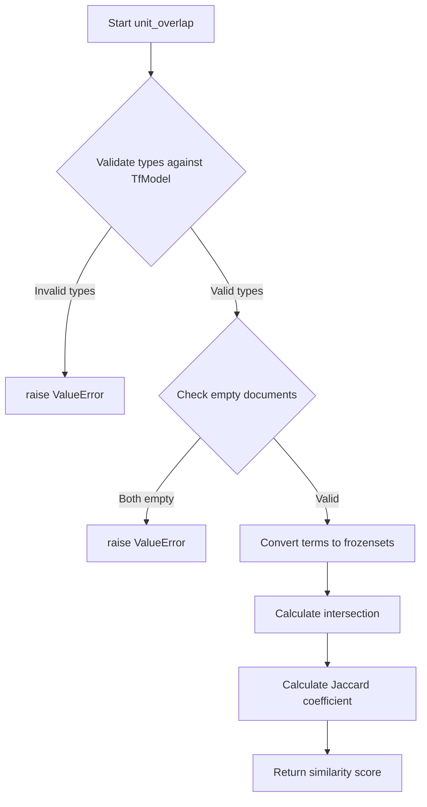

# `content_based.py`

## `sumy.evaluation.content_based.cosine_similarity` · *function*

## Summary:
Calculates the cosine similarity between two document models based on their term frequencies and magnitudes.

## Description:
This function computes the cosine similarity between two document representations using TF-IDF vectors. It's commonly used in text summarization and document comparison tasks to measure the similarity between documents or sentences. The function implements the mathematical formula for cosine similarity: (A·B)/(||A||×||B||) where A and B are the document vectors.

The function extracts all unique terms from both documents, computes the dot product of their term frequencies, and normalizes by the product of their magnitudes. This approach ensures that documents of different lengths can be compared fairly.

## Args:
    evaluated_model (TfDocumentModel): The first document model to compare, containing term frequencies and magnitude information
    reference_model (TfDocumentModel): The second document model to compare, containing term frequencies and magnitude information

## Returns:
    float: A similarity score between 0 and 1, where 1 indicates identical documents and 0 indicates no similarity. Values closer to 1 represent higher similarity.

## Raises:
    ValueError: If either argument is not an instance of 'sumy.models.TfDocumentModel', or if both document models are empty (magnitude is zero)

## Constraints:
    Preconditions:
        - Both arguments must be instances of TfDocumentModel class
        - Neither document model should be empty (magnitude must be greater than 0)
    Postconditions:
        - Returns a float value in the range [0, 1]
        - The result is symmetric: cosine_similarity(a,b) equals cosine_similarity(b,a)

## Side Effects:
    - None

## Control Flow:
```mermaid
flowchart TD
    A[Start cosine_similarity] --> B{Valid TfDocumentModel?}
    B -- No --> C[Raise ValueError]
    B -- Yes --> D[Get union of terms]
    D --> E[Initialize numerator=0.0]
    E --> F[For each term in union]
    F --> G[numerator += tf1(term) * tf2(term)]
    G --> H[Calculate denominator]
    H --> I{Denominator == 0?}
    I -- Yes --> J[Raise ValueError]
    I -- No --> K[Return numerator/denominator]
```

## Examples:
    # Basic usage with two document models
    similarity = cosine_similarity(doc1_model, doc2_model)
    
    # Error handling for invalid inputs
    try:
        similarity = cosine_similarity(invalid_object, doc2_model)
    except ValueError as e:
        print(f"Invalid input: {e}")
        
    # Error handling for empty documents
    try:
        similarity = cosine_similarity(empty_model, doc2_model)
    except ValueError as e:
        print(f"Empty document error: {e}")
```

## `sumy.evaluation.content_based.unit_overlap` · *function*

## Summary:
Computes the unit overlap similarity between two document models based on their term sets using a Jaccard-like coefficient.

## Description:
This function calculates a similarity score between two document representations using a variant of the Jaccard coefficient formula. It's designed for content-based evaluation of text summarization systems to measure term overlap between an evaluated summary and a reference summary.

The function validates that both arguments are instances of `TfModel` (as referenced in the isinstance check, though the import statement shows `TfDocumentModel`), and computes a normalized similarity score based on overlapping terms.

## Args:
    evaluated_model (object): The document model to evaluate against the reference
    reference_model (object): The reference document model for comparison

## Returns:
    float: A similarity score between 0 and 1, where 1 indicates identical term sets and 0 indicates no overlap. The score is calculated using the formula: |A ∩ B| / (|A| + |B| - |A ∩ B|)

## Raises:
    ValueError: If either argument is not an instance of 'sumy.models.TfDocumentModel' (as checked by isinstance), or if both documents are empty (contain no terms)

## Constraints:
    Preconditions:
        - Both arguments must be instances of TfModel class (as validated by isinstance check)
        - Neither document should be empty (must contain at least one term)
    
    Postconditions:
        - Returns a float value in the range [0, 1]
        - The result represents normalized term overlap between documents

## Side Effects:
    None

## Control Flow:


## Examples:
```python
# Basic usage
from sumy.models import TfDocumentModel
from sumy.evaluation.content_based import unit_overlap

# Create two document models
doc1 = TfDocumentModel(['hello', 'world', 'test'])
doc2 = TfDocumentModel(['world', 'test', 'example'])

# Calculate overlap
similarity = unit_overlap(doc1, doc2)
print(similarity)  # Output depends on term overlap
```

