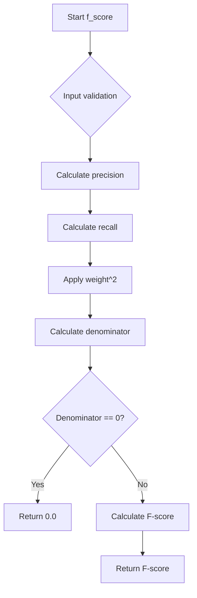

# `coselection.py`

## `sumy.evaluation.coselection.f_score` · *function*

## Summary:
Computes the F-score (F1-score) for evaluating sentence selection quality by combining precision and recall metrics with a configurable beta parameter.

## Description:
This function implements the F-score metric commonly used in information retrieval and text summarization evaluation. It calculates a weighted harmonic mean of precision and recall, where the weight parameter controls the relative importance of recall versus precision. The function is designed to evaluate how well a set of selected sentences matches a reference set of important sentences.

The function extracts precision and recall values using helper functions, then applies the F-score formula with the specified weight parameter. This separation of concerns allows for modular testing and reuse of the precision and recall calculations independently.

## Args:
    evaluated_sentences (list): Collection of sentences that were selected/evaluated for inclusion in a summary or selection process
    reference_sentences (list): Collection of sentences considered to be the ground truth or reference set for comparison
    weight (float): Weight parameter controlling the balance between precision and recall (default: 1.0). When weight=1.0, equal emphasis is placed on precision and recall (standard F1-score)

## Returns:
    float: The computed F-score value between 0.0 and 1.0, where higher values indicate better performance. Returns 0.0 when both precision and recall are zero (no common elements between sets).

## Raises:
    ValueError: When either evaluated_sentences or reference_sentences contains fewer than 1 sentence, as division by zero would occur in the underlying calculation

## Constraints:
    Preconditions:
        - Both evaluated_sentences and reference_sentences must contain at least one sentence
        - All sentences should be comparable (same format/type)
    Postconditions:
        - Returns a floating-point value in the range [0.0, 1.0]
        - If both sets are empty or have no intersection, returns 0.0

## Side Effects:
    None

## Control Flow:


## Examples:
```python
# Basic usage with default weight (F1-score)
evaluated = ["Sentence one.", "Sentence two."]
reference = ["Sentence one.", "Sentence three."]
score = f_score(evaluated, reference)  # Returns F1-score

# Usage with custom weight favoring recall
score = f_score(evaluated, reference, weight=2.0)  # Higher recall emphasis

# Edge case: no matching sentences
evaluated = ["Sentence one."]
reference = ["Sentence two."]
score = f_score(evaluated, reference)  # Returns 0.0
```

## `sumy.evaluation.coselection.precision` · *function*

## Summary:
Calculates the precision metric for sentence selection evaluation by measuring the proportion of selected sentences that are relevant to the reference set.

## Description:
This function computes precision as the ratio of correctly identified relevant sentences (intersection of reference and evaluated sets) to the total number of selected sentences. It's commonly used in automatic summarization evaluation to measure how many of the selected sentences were actually relevant.

The function delegates to `_divide_evaluation` with the arguments reordered to maintain consistency in the underlying calculation logic.

## Args:
    evaluated_sentences (Iterable[str]): Collection of sentences that were selected or evaluated by the system
    reference_sentences (Iterable[str]): Collection of sentences considered as relevant or reference gold standard

## Returns:
    float: Precision value between 0.0 and 1.0, representing the proportion of selected sentences that are relevant

## Raises:
    ValueError: When either evaluated_sentences or reference_sentences collection contains zero elements

## Constraints:
    Preconditions:
        - Both evaluated_sentences and reference_sentences must contain at least one sentence
        - Sentences should be comparable (same format/type)
    
    Postconditions:
        - Returns a float value in the range [0.0, 1.0]
        - Raises ValueError if either input collection is empty

## Side Effects:
    None

## Control Flow:
```mermaid
flowchart TD
    A[precision() called] --> B{Both collections non-empty?}
    B -- No --> C[raise ValueError]
    B -- Yes --> D[_divide_evaluation called]
    D --> E[Return precision value]
```

## Examples:
```python
# Basic usage
evaluated = ["Sentence A", "Sentence B", "Sentence C"]
reference = ["Sentence A", "Sentence D"]
result = precision(evaluated, reference)
# Returns 0.333... (1 out of 3 selected sentences is relevant)

# Edge case - no overlap
evaluated = ["Sentence A", "Sentence B"]
reference = ["Sentence C", "Sentence D"]
result = precision(evaluated, reference)
# Returns 0.0 (no relevant sentences selected)
```

## `sumy.evaluation.coselection.recall` · *function*

## Summary:
Computes the recall metric for evaluating sentence selection by measuring the proportion of reference sentences correctly identified.

## Description:
This function calculates recall, a key information retrieval metric that quantifies how well the evaluated sentences capture the reference sentences. Recall is defined as the number of correctly identified sentences divided by the total number of reference sentences.

The function delegates to `_divide_evaluation` to perform the actual computation, which typically implements: recall = true_positives / (true_positives + false_negatives).

## Args:
    evaluated_sentences (iterable): Collection of sentences identified by the evaluation process as relevant or selected.
    reference_sentences (iterable): Collection of sentences considered as the ground truth or reference set of relevant sentences.

## Returns:
    float: The recall score ranging from 0.0 to 1.0, where:
        - 1.0 indicates perfect recall (all reference sentences were correctly identified)
        - 0.0 indicates no overlap between evaluated and reference sentences
        - Values between 0.0 and 1.0 represent partial recall

## Raises:
    None explicitly documented in the source code.

## Constraints:
    Preconditions:
    - Both parameters must be iterable collections
    - Elements in both collections should support equality comparison
    - The function assumes proper alignment between evaluated and reference sentences
    
    Postconditions:
    - Returns a float value in the range [0.0, 1.0]
    - The result represents the ratio of correctly identified sentences to total relevant sentences

## Side Effects:
    None

## Control Flow:
```mermaid
flowchart TD
    A[recall function called] --> B[_divide_evaluation called]
    B --> C[Calculate true_positives]
    C --> D[Calculate false_negatives]
    D --> E[Return true_positives / (true_positives + false_negatives)]
```

## Examples:
    # Basic usage
    evaluated = ["Sentence one.", "Sentence two."]
    reference = ["Sentence one.", "Sentence three."]
    score = recall(evaluated, reference)
    # Returns 0.5 (1 out of 2 reference sentences correctly identified)
    
    # Perfect recall
    evaluated = ["Sentence one.", "Sentence two."]
    reference = ["Sentence one."]
    score = recall(evaluated, reference)
    # Returns 1.0 (all reference sentences correctly identified)

## `sumy.evaluation.coselection._divide_evaluation` · *function*

## Summary:
Calculates the ratio of common sentences between two collections of sentences.

## Description:
This function computes the Jaccard similarity coefficient between two sets of sentences by determining what fraction of the denominator set is also present in the numerator set. It's commonly used in text summarization evaluation to measure overlap between generated and reference summaries.

## Args:
    numerator_sentences (Iterable[str]): Collection of sentences to be compared against the denominator set. Must contain at least one sentence.
    denominator_sentences (Iterable[str]): Collection of sentences serving as the reference set for comparison. Must contain at least one sentence.

## Returns:
    float: The ratio of common sentences to total sentences in the denominator set. Returns a value between 0.0 and 1.0 inclusive.

## Raises:
    ValueError: When either numerator_sentences or denominator_sentences contains zero elements.

## Constraints:
    Preconditions:
        - Both arguments must be iterable collections containing at least one sentence
        - Sentences should be represented as strings
    Postconditions:
        - Returns a float in the range [0.0, 1.0]
        - The result represents the proportion of sentences in denominator that are also in numerator

## Side Effects:
    None

## Control Flow:
```mermaid
flowchart TD
    A[Start] --> B{len(numerator) == 0 OR len(denominator) == 0?}
    B -- Yes --> C[raise ValueError]
    B -- No --> D[numerator_sentences = frozenset(numerator_sentences)]
    D --> E[denominator_sentences = frozenset(denominator_sentences)]
    E --> F[common_count = len(denominator & numerator)]
    F --> G[choosen_count = len(denominator)]
    G --> H[assert choosen_count != 0]
    H --> I[return common_count / choosen_count]
```

## Examples:
    >>> _divide_evaluation(['Hello world', 'Foo bar'], ['Hello world', 'Baz qux'])
    0.5
    >>> _divide_evaluation(['A', 'B', 'C'], ['A', 'B', 'C'])
    1.0
    >>> _divide_evaluation(['A', 'B'], ['C', 'D'])
    0.0

