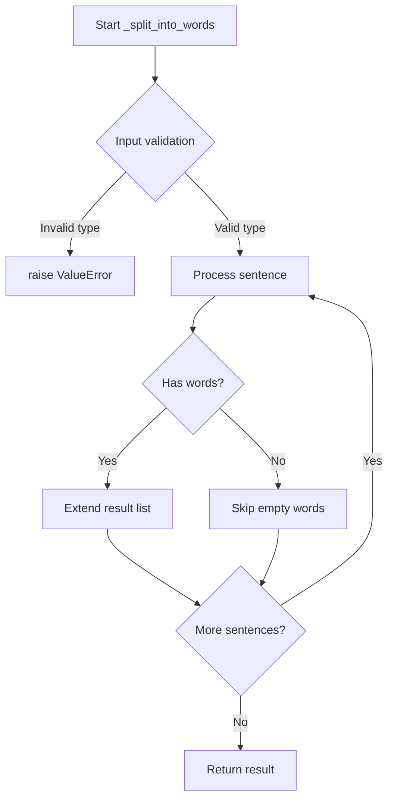
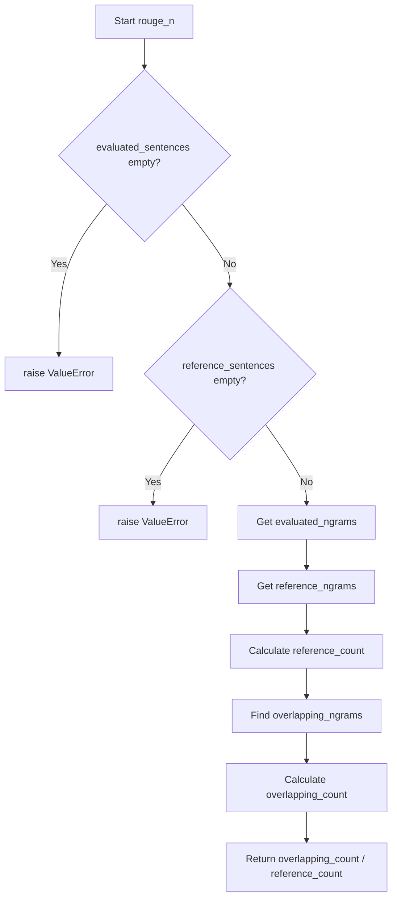
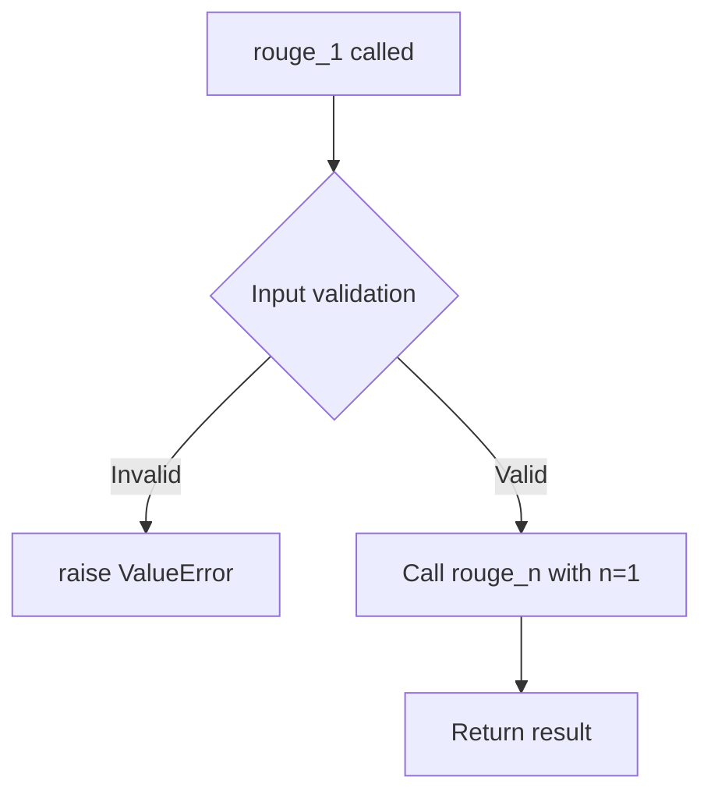
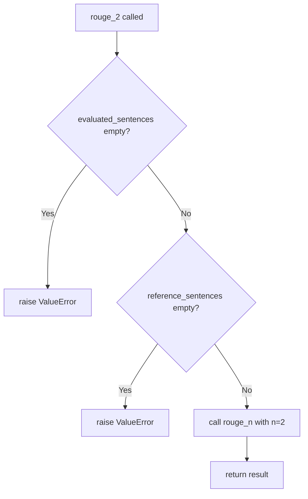
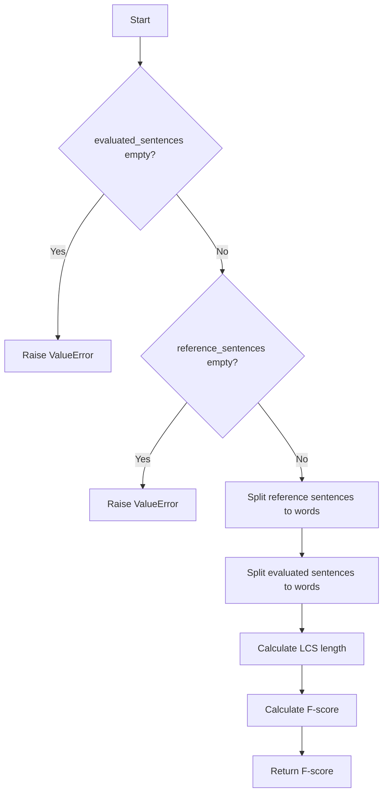
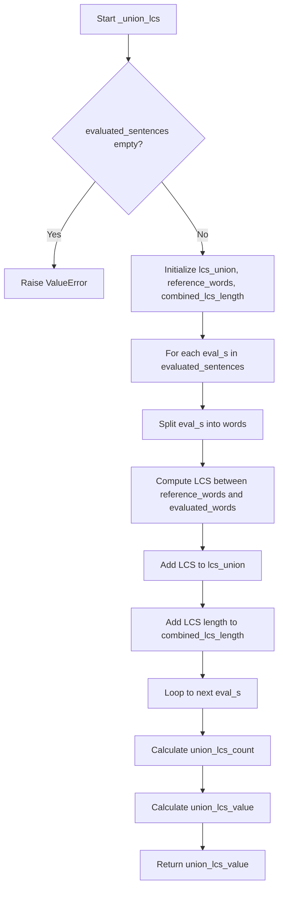

# `rouge.py`

## `sumy.evaluation.rouge._get_ngrams` · *function*

## Summary:
Generates a set of n-grams from the provided text sequence.

## Description:
Creates all possible contiguous subsequences of length n from the input text and returns them as a set of tuples. This utility function is commonly used in text evaluation metrics like ROUGE to compare overlapping sequences between reference and candidate texts.

## Args:
    n (int): The size of n-grams to generate. Must be a non-negative integer.
    text (iterable): The input sequence from which to extract n-grams. Should support indexing operations (e.g., list, tuple, string).

## Returns:
    set[tuple]: A set containing all unique n-grams found in the text, represented as tuples of elements from the original text.

## Raises:
    TypeError: If text doesn't support indexing operations (e.g., iterators without index access).
    ValueError: If n is negative.

## Constraints:
    Preconditions:
    - n must be a non-negative integer
    - text must be iterable and support indexing operations
    
    Postconditions:
    - Returns a set with no duplicate n-grams
    - Each n-gram is returned as a tuple of the same type as elements in text
    - Empty set is returned if n is greater than the length of text or if n is negative

## Side Effects:
    None

## Control Flow:
```mermaid
flowchart TD
    A[Start _get_ngrams(n, text)] --> B{Is n < 0?}
    B -- Yes --> C[Raise ValueError]
    B -- No --> D{Is n > len(text)?}
    D -- Yes --> E[Return empty set]
    D -- No --> F[Initialize ngram_set]
    F --> G[Loop through text indices from 0 to len(text)-n]
    G --> H[Extract n-gram slice text[i:i+n]]
    H --> I[Add n-gram tuple to set]
    I --> J[Return ngram_set]
```

## Examples:
    >>> _get_ngrams(2, ['a', 'b', 'c', 'd'])
    {('a', 'b'), ('b', 'c'), ('c', 'd')}
    
    >>> _get_ngrams(3, "hello")
    {('h', 'e', 'l'), ('e', 'l', 'l'), ('l', 'l', 'o')}
    
    >>> _get_ngrams(5, "hi")
    set()
    
    >>> _get_ngrams(0, "test")
    set()
```

## `sumy.evaluation.rouge._split_into_words` · *function*

## Summary:
Extracts and flattens word lists from a collection of Sentence objects into a single list.

## Description:
Processes a collection of Sentence objects and aggregates all words from each sentence into a single flat list. This utility function serves as a bridge between sentence-level text processing and word-level analysis operations commonly required in text evaluation metrics like ROUGE.

The function is designed to work exclusively with Sentence objects, ensuring type safety and preventing errors from incompatible data types. This extraction pattern is commonly needed when computing text similarity metrics that operate at the word level rather than the sentence level.

## Args:
    sentences (Iterable[Sentence]): A collection of Sentence objects from which to extract words. Each item must be an instance of the Sentence class.

## Returns:
    list[str]: A flat list containing all words from all input sentences, preserving the order of sentences and words within each sentence.

## Raises:
    ValueError: When any object in the input collection is not an instance of the Sentence class.

## Constraints:
    Preconditions:
        - Input must be iterable
        - All elements in the iterable must be instances of Sentence class
        - Sentence objects must have a valid `words` property that returns a list of strings
    
    Postconditions:
        - Returns a list of strings representing all words from input sentences
        - Order of words is preserved from input sentences
        - Empty sentences contribute empty lists to the result

## Side Effects:
    None

## Control Flow:


## Examples:
```python
# Basic usage with valid Sentence objects
from models.dom import Sentence
from sumy.evaluation.rouge import _split_into_words

sentence1 = Sentence("Hello world", tokenizer)
sentence2 = Sentence("Goodbye universe", tokenizer)
words = _split_into_words([sentence1, sentence2])
# Returns: ['Hello', 'world', 'Goodbye', 'universe']

# Error case - invalid input type
try:
    _split_into_words(["not_a_sentence"])
except ValueError as e:
    print(e)  # Prints: "Object in collection must be of type Sentence"
```

## `sumy.evaluation.rouge._get_word_ngrams` · *function*

## Summary:
Generates a set of n-grams from a collection of sentences by extracting words and creating contiguous sequences of specified length.

## Description:
This function extracts all unique n-grams (contiguous sequences of n words) from a list of sentences. It serves as a utility for computing ROUGE metrics by converting textual content into n-gram representations. The function internally processes each sentence by extracting its constituent words and then generates n-grams of the specified size.

## Args:
    n (int): The size of n-grams to generate. Must be a positive integer (> 0).
    sentences (list): A list of Sentence objects containing word data. Must contain at least one sentence.

## Returns:
    set[tuple[str]]: A set of tuples, where each tuple contains n consecutive words forming an n-gram. Duplicate n-grams are automatically removed due to the use of a set data structure.

## Raises:
    AssertionError: If the sentences list is empty (len(sentences) <= 0).
    AssertionError: If n is less than or equal to zero (n <= 0).

## Constraints:
    Preconditions:
        - The sentences list must contain at least one Sentence object
        - The n parameter must be a positive integer
        - Each item in sentences must be of type Sentence (validated by _split_into_words)
    
    Postconditions:
        - Returns a set of unique n-grams (no duplicates)
        - All returned n-grams contain exactly n words
        - The function preserves the order of sentences but not the order of n-grams within the result set

## Side Effects:
    None

## Control Flow:
```mermaid
flowchart TD
    A[Start _get_word_ngrams(n, sentences)] --> B{sentences empty?}
    B -- Yes --> C[Assertion Error]
    B -- No --> D{n <= 0?}
    D -- Yes --> E[Assertion Error]
    D -- No --> F[Initialize empty set words]
    F --> G[For each sentence in sentences]
    G --> H[Call _split_into_words(sentence)]
    H --> I[Call _get_ngrams(n, split_result)]
    I --> J[Update words set with n-grams]
    J --> K[Return words set]
```

## Examples:
    # Basic usage with unigrams
    sentences = [Sentence("Hello world"), Sentence("World peace")]
    unigrams = _get_word_ngrams(1, sentences)
    # Returns: {('Hello',), ('world',), ('Peace',)}
    
    # Usage with bigrams
    sentences = [Sentence("Natural language processing")]
    bigrams = _get_word_ngrams(2, sentences)
    # Returns: {('Natural', 'language'), ('language', 'processing')}

## `sumy.evaluation.rouge._get_index_of_lcs` · *function*

## Summary:
Returns the lengths of two input sequences, likely intended for use in Longest Common Subsequence calculations.

## Description:
This function takes two sequences (x and y) and returns their respective lengths as a tuple. Based on the function name "_get_index_of_lcs", it appears to be related to computing the longest common subsequence between two sequences, though the current implementation simply returns the lengths rather than calculating any actual index.

## Args:
    x (sequence): First sequence for length calculation
    y (sequence): Second sequence for length calculation

## Returns:
    tuple[int, int]: A tuple containing (len(x), len(y)) representing the lengths of both input sequences

## Raises:
    None explicitly raised

## Constraints:
    Preconditions:
    - Both x and y must be sequences (supporting len() function)
    - Input parameters should be of compatible types that support the len() operation
    
    Postconditions:
    - Returns a tuple of two integers representing the lengths of the input sequences
    - Function execution time is O(1) as it only calls len() on both inputs

## Side Effects:
    None

## Control Flow:
```mermaid
flowchart TD
    A[Start _get_index_of_lcs(x,y)] --> B{Input validation}
    B --> C[Return (len(x), len(y))]
    C --> D[End]
```

## Examples:
    >>> _get_index_of_lcs("hello", "world")
    (5, 5)
    
    >>> _get_index_of_lcs([1,2,3], [4,5])
    (3, 2)
    
    >>> _get_index_of_lcs("", "test")
    (0, 4)
```

## `sumy.evaluation.rouge._len_lcs` · *function*

## Summary:
Computes the length of the longest common subsequence between two sequences.

## Description:
This function calculates the length of the longest common subsequence (LCS) between two input sequences using dynamic programming. It is part of the ROUGE evaluation framework used for evaluating summarization systems by measuring overlap between reference and candidate summaries.

## Args:
    x (list or tuple or str): First sequence to compare (typically a list of tokens or characters).
    y (list or tuple or str): Second sequence to compare (typically a list of tokens or characters).

## Returns:
    int: The length of the longest common subsequence between x and y.

## Raises:
    None explicitly raised, but may raise exceptions from underlying helper functions if inputs are invalid.

## Constraints:
    Preconditions:
    - Both x and y should be sequences (lists, tuples, strings, etc.) that support indexing
    - Elements in the sequences should be comparable for equality
    
    Postconditions:
    - Returns a non-negative integer representing the LCS length
    - The function is deterministic for the same input sequences

## Side Effects:
    None

## Control Flow:
```mermaid
flowchart TD
    A[Start _len_lcs(x,y)] --> B[Call _lcs(x,y)]
    B --> C[Get table from _lcs]
    C --> D[Call _get_index_of_lcs(x,y)]
    D --> E[Get indices n,m]
    E --> F[Return table[n,m]]
```

## Examples:
    >>> _len_lcs([1, 2, 3], [2, 3, 4])
    2
    >>> _len_lcs("abc", "ac")
    2
    >>> _len_lcs([], [1, 2, 3])
    0

## `sumy.evaluation.rouge._lcs` · *function*

## Summary:
Computes the dynamic programming table for the Longest Common Subsequence (LCS) algorithm between two sequences.

## Description:
Implements the classic dynamic programming approach to find the longest common subsequence between two sequences. This function constructs a 2D table where each cell [i,j] represents the length of the LCS between the first i elements of sequence x and the first j elements of sequence y. The table is returned as a dictionary for efficient lookup.

This function is part of the ROUGE evaluation framework used in automatic text summarization to measure similarity between generated and reference texts. The computed table can be used to reconstruct the actual LCS by backtracking through the dynamic programming solution.

## Args:
    x (sequence): First sequence (typically words or tokens) to compare
    y (sequence): Second sequence (typically words or tokens) to compare

## Returns:
    dict: A dictionary mapping coordinate tuples (i, j) to LCS lengths, where (i, j) represents the LCS length between the first i elements of x and first j elements of y. The table enables reconstruction of the actual longest common subsequence through backtracking.

## Raises:
    None explicitly raised

## Constraints:
    Preconditions:
    - Both x and y should be iterable sequences
    - The sequences should support indexing operations (x[i-1], y[j-1])

    Postconditions:
    - The returned dictionary contains keys for all coordinate pairs (i, j) where 0 ≤ i ≤ len(x) and 0 ≤ j ≤ len(y)
    - All values in the dictionary represent valid LCS lengths (non-negative integers)

## Side Effects:
    None

## Control Flow:
```mermaid
flowchart TD
    A[Start _lcs(x,y)] --> B[Get dimensions n,m = _get_index_of_lcs(x,y)]
    B --> C[Initialize empty table dict]
    C --> D[For i in range(0,n+1)]
    D --> E[For j in range(0,m+1)]
    E --> F{Is i=0 or j=0?}
    F -->|Yes| G[table[i,j] = 0]
    F -->|No| H{x[i-1] == y[j-1]?}
    H -->|Yes| I[table[i,j] = table[i-1,j-1] + 1]
    H -->|No| J[table[i,j] = max(table[i-1,j], table[i,j-1])]
    J --> K[Continue loop]
    I --> K
    G --> K
    K --> L[Return table]
```

## Examples:
```python
# Basic usage with lists of words
x = ['the', 'cat', 'sat', 'on', 'the', 'mat']
y = ['the', 'dog', 'sat', 'on', 'the', 'car']
table = _lcs(x, y)
# Returns a dictionary with LCS lengths for all subsequence combinations

# Usage with strings (character-level comparison)
x = "hello"
y = "world"
table = _lcs(x, y)
# Returns a dictionary with character-level LCS computation results
```

## `sumy.evaluation.rouge._recon_lcs` · *function*

## Summary:
Reconstructs the longest common subsequence from two sequences using dynamic programming table.

## Description:
This function performs the reconstruction phase of the longest common subsequence algorithm. Given two sequences, it first computes the dynamic programming table using the `_lcs` helper function, then traces back through the table to reconstruct the actual longest common subsequence. This is typically used in ROUGE evaluation metrics to compute similarity between reference and candidate texts.

## Args:
    x (sequence): First sequence to compare (typically a list of tokens or characters)
    y (sequence): Second sequence to compare (typically a list of tokens or characters)

## Returns:
    tuple: A tuple containing the reconstructed longest common subsequence elements in order

## Raises:
    None explicitly raised

## Constraints:
    Preconditions:
    - Both x and y should be sequences (lists, tuples, strings, etc.)
    - The sequences should support indexing operations
    
    Postconditions:
    - The returned tuple contains elements that appear in both input sequences
    - The elements in the returned tuple maintain their relative order from both input sequences
    - The length of the returned tuple equals the length of the longest common subsequence

## Side Effects:
    None

## Control Flow:
```mermaid
flowchart TD
    A[Start _recon_lcs(x,y)] --> B[Compute LCS table with _lcs(x,y)]
    B --> C[Get indices of LCS with _get_index_of_lcs(x,y)]
    C --> D[Call _recon(i,j) with indices]
    D --> E{Base case: i==0 or j==0?}
    E -->|Yes| F[Return empty list]
    E -->|No| G{Elements equal?}
    G -->|Yes| H[Recursively call _recon(i-1,j-1) + [(x[i-1],i)]]
    G -->|No| I{table[i-1,j] > table[i,j-1]?}
    I -->|Yes| J[Recursively call _recon(i-1,j)]
    I -->|No| K[Recursively call _recon(i,j-1)]
    H --> L[Process result to extract elements]
    J --> L
    K --> L
    L --> M[Return tuple of elements]
```

## Examples:
    # Basic usage with lists
    x = ['a', 'b', 'c', 'd']
    y = ['b', 'c', 'e']
    result = _recon_lcs(x, y)
    # Returns ('b', 'c') - the longest common subsequence
    
    # Usage with strings (converted to lists)
    x = list("hello")
    y = list("world")
    result = _recon_lcs(x, y)
    # Returns ('l', 'o') - common characters in order

## `sumy.evaluation.rouge.rouge_n` · *function*

## Summary:
Computes the ROUGE-N metric by calculating the overlap ratio of n-grams between evaluated and reference sentences.

## Description:
This function implements the ROUGE-N (Recall-Oriented Understudy for Gisting Evaluation) metric for n-grams of a specified order. It measures the similarity between a set of evaluated sentences and a set of reference sentences by computing the ratio of overlapping n-grams to total reference n-grams. The ROUGE-N metric is commonly used in automatic summarization evaluation to assess the quality of generated summaries against reference summaries.

The function extracts n-grams from both evaluated and reference sentences, then calculates the intersection of these n-grams to determine overlap. This implementation specifically focuses on word-based n-grams.

## Args:
    evaluated_sentences (list[Sentence]): Collection of sentences to evaluate. Must contain at least one Sentence object.
    reference_sentences (list[Sentence]): Collection of reference sentences to compare against. Must contain at least one Sentence object.
    n (int): The order of n-grams to compute (default: 2). Must be a positive integer.

## Returns:
    float: The ROUGE-N score, representing the ratio of overlapping n-grams to total reference n-grams. Returns 0.0 if there are no reference n-grams.

## Raises:
    ValueError: If either evaluated_sentences or reference_sentences collections are empty or contain no elements.

## Constraints:
    Preconditions:
        - Both evaluated_sentences and reference_sentences must contain at least one Sentence object
        - n must be a positive integer (> 0)
        - Each element in both collections must be of type Sentence
    
    Postconditions:
        - Returns a float value between 0.0 and 1.0 (inclusive)
        - If reference_sentences contains no n-grams, returns 0.0

## Side Effects:
    None

## Control Flow:


## Examples:
```python
# Basic usage with default n=2 (bigrams)
from models.dom import Sentence
evaluated = [Sentence("The cat sat on the mat")]
reference = [Sentence("The cat was sitting on the mat")]
score = rouge_n(evaluated, reference, n=2)
print(score)  # Output depends on n-gram overlap

# Usage with trigrams
score = rouge_n(evaluated, reference, n=3)
print(score)  # Computes trigram overlap
```

## `sumy.evaluation.rouge.rouge_1` · *function*

## Summary:
Computes the ROUGE-1 score between evaluated and reference sentence collections by calculating the overlap of unigrams.

## Description:
ROUGE-1 is a variant of the ROUGE metric that evaluates summarization quality by measuring the overlap of unigram (single-word) n-grams between the evaluated summary and reference summary. This function serves as a convenience wrapper that calls the general rouge_n function with n=1.

The ROUGE metric is commonly used in natural language processing to evaluate the quality of automatic text summarization systems by comparing generated summaries against reference summaries.

## Args:
    evaluated_sentences (list[Sentence]): Collection of sentences from the evaluated summary. Each sentence must be a Sentence object.
    reference_sentences (list[Sentence]): Collection of sentences from the reference summary. Each sentence must be a Sentence object.

## Returns:
    float: The ROUGE-1 score, representing the ratio of overlapping unigrams between evaluated and reference sentences. Returns 0.0 when either collection is empty or when there are no overlapping n-grams.

## Raises:
    ValueError: When either evaluated_sentences or reference_sentences contains zero sentences.

## Constraints:
    Preconditions:
        - Both evaluated_sentences and reference_sentences must be non-empty lists
        - Each item in both collections must be of type Sentence
        - The Sentence objects must have valid text content
    
    Postconditions:
        - Returns a floating-point value between 0.0 and 1.0 inclusive
        - The returned value represents the proportion of reference unigrams that appear in the evaluated text

## Side Effects:
    None

## Control Flow:


## Examples:
```python
# Basic usage
from sumy.models.dom import Sentence
from sumy.evaluation.rouge import rouge_1

evaluated = [Sentence("The cat sat on the mat")]
reference = [Sentence("The cat was sitting on the mat")]

score = rouge_1(evaluated, reference)
print(score)  # Output: 0.8 or similar depending on exact word overlap

# Error case
try:
    rouge_1([], [])
except ValueError as e:
    print(e)  # Output: "Collections must contain at least 1 sentence."
```

## `sumy.evaluation.rouge.rouge_2` · *function*

## Summary:
Computes the ROUGE-2 score between evaluated and reference sentence collections by calculating the overlap of 2-word n-grams.

## Description:
This function implements the ROUGE-2 metric, which evaluates summarization quality by measuring the overlap of 2-word consecutive sequences (bigrams) between generated and reference texts. It serves as a convenience wrapper around the more general `rouge_n` function with a fixed n-value of 2.

The ROUGE-2 metric is commonly used in automatic summarization evaluation because it captures phrase-level similarity while being computationally efficient. It's particularly useful for assessing how well generated summaries preserve important word sequences from reference summaries.

## Args:
    evaluated_sentences (list[Sentence]): Collection of sentences from the evaluated summary. Each sentence must be a Sentence object containing tokenized words.
    reference_sentences (list[Sentence]): Collection of sentences from the reference summary. Each sentence must be a Sentence object containing tokenized words.

## Returns:
    float: The ROUGE-2 score as a ratio of overlapping bigrams to total reference bigrams. Returns 0.0 when there are no reference sentences or when there are no overlapping bigrams.

## Raises:
    ValueError: When either evaluated_sentences or reference_sentences contains zero sentences.

## Constraints:
    Preconditions:
        - Both evaluated_sentences and reference_sentences must contain at least one Sentence object
        - Each Sentence object must be properly initialized with text and tokenizer
    Postconditions:
        - Returns a float value between 0.0 and 1.0 (inclusive)
        - The result is undefined when both collections are empty

## Side Effects:
    None

## Control Flow:


## Examples:
```python
# Basic usage
from sumy.models.dom import Sentence
from sumy.evaluation.rouge import rouge_2

# Create sample sentences
evaluated = [Sentence("The cat sat on the mat.", tokenizer)]
reference = [Sentence("The cat was sitting on the mat.", tokenizer)]

# Calculate ROUGE-2 score
score = rouge_2(evaluated, reference)
print(f"ROUGE-2 Score: {score}")
```

## `sumy.evaluation.rouge._f_lcs` · *function*

## Summary:
Computes the F-measure (F-beta score) for ROUGE evaluation using longest common subsequence statistics.

## Description:
This function calculates the F-measure (also known as F-beta score) used in ROUGE (Recall-Oriented Understudy for Gisting Evaluation) metrics. It computes a weighted harmonic mean of precision and recall based on the longest common subsequence between two sequences. The function is typically called during ROUGE score calculations to combine precision and recall into a single metric.

## Args:
    llcs (float): Length of the longest common subsequence between two sequences
    m (float): Length of the first sequence (reference)
    n (float): Length of the second sequence (candidate)

## Returns:
    float: The F-measure value between 0 and 1, representing the harmonic mean of precision and recall

## Raises:
    ZeroDivisionError: When either m or n is zero, causing division by zero in intermediate calculations

## Constraints:
    Preconditions:
    - llcs must be non-negative (0 ≤ llcs ≤ min(m,n))
    - m must be positive (m > 0)
    - n must be positive (n > 0)
    
    Postconditions:
    - Returns a value between 0 and 1 inclusive
    - If llcs is 0, returns 0
    - If llcs equals both m and n, returns 1

## Side Effects:
    None

## Control Flow:
```mermaid
flowchart TD
    A[Start _f_lcs(llcs,m,n)] --> B[r_lcs = llcs/m]
    B --> C[p_lcs = llcs/n]
    C --> D[beta = p_lcs/r_lcs]
    D --> E[num = (1 + beta²) × r_lcs × p_lcs]
    E --> F[denom = r_lcs + (beta² × p_lcs)]
    F --> G[result = num/denom]
    G --> H[Return result]
```

## Examples:
    >>> _f_lcs(4, 6, 5)
    0.7272727272727273
    
    >>> _f_lcs(0, 5, 4)
    0.0
    
    >>> _f_lcs(5, 5, 5)
    1.0
```

## `sumy.evaluation.rouge.rouge_l_sentence_level` · *function*

## Summary:
Computes the ROUGE-L sentence-level evaluation metric by calculating the F-score based on longest common subsequence between reference and evaluated sentences.

## Description:
Implements the ROUGE-L metric for evaluating sentence-level text similarity. This function compares two collections of sentences (reference and evaluated) by computing their longest common subsequence and returning an F-score that balances precision and recall. The ROUGE-L metric is particularly useful for evaluating summarization systems where sequential word order matters.

This logic is extracted into its own function to separate the core evaluation computation from the higher-level processing logic, enabling reuse across different evaluation contexts while maintaining clean responsibility boundaries.

## Args:
    evaluated_sentences (list[Sentence]): Collection of Sentence objects representing the generated/evaluated text to be compared against references
    reference_sentences (list[Sentence]): Collection of Sentence objects representing the reference/ground truth text for comparison

## Returns:
    float: ROUGE-L F-score between 0.0 and 1.0, where 1.0 indicates perfect overlap and 0.0 indicates no common subsequences

## Raises:
    ValueError: When either evaluated_sentences or reference_sentences collection contains zero elements

## Constraints:
    Preconditions:
        - Both evaluated_sentences and reference_sentences must contain at least one Sentence object
        - Each Sentence object must be of type Sentence from models.dom module
        - All Sentence objects must have valid text content
    
    Postconditions:
        - Returns a floating-point value between 0.0 and 1.0 inclusive
        - Function execution is deterministic for identical inputs

## Side Effects:
    None

## Control Flow:


## Examples:
```python
# Basic usage with valid sentence collections
from models.dom import Sentence
from sumy.evaluation.rouge import rouge_l_sentence_level

# Create sample sentences
ref_sentence = Sentence("The cat sat on the mat", tokenizer)
eval_sentence = Sentence("The cat was sitting on the mat", tokenizer)

# Calculate ROUGE-L score
score = rouge_l_sentence_level([eval_sentence], [ref_sentence])
print(f"ROUGE-L Score: {score}")  # Returns a float between 0.0 and 1.0

# Error case - empty collections
try:
    rouge_l_sentence_level([], [ref_sentence])
except ValueError as e:
    print(f"Error: {e}")  # "Collections must contain at least 1 sentence."
```

## `sumy.evaluation.rouge._union_lcs` · *function*

## Summary:
Computes the union-based Longest Common Subsequence (LCS) ratio between a reference sentence and multiple evaluated sentences.

## Description:
This function calculates a normalized LCS metric that measures the similarity between a reference sentence and a collection of evaluated sentences. It computes the LCS for each evaluated sentence against the reference, unions all unique common words, and returns a normalized ratio representing the overall similarity.

The function is part of the ROUGE (Recall-Oriented Understudy for Gisting Evaluation) framework used for evaluating text summarization and generation tasks. It's specifically designed to measure the overlap between generated text and reference text using the union of common subsequences.

## Args:
    evaluated_sentences (list[Sentence]): Collection of sentences to evaluate against the reference. Must contain at least one sentence.
    reference_sentence (Sentence): The reference sentence to compare against.

## Returns:
    float: Normalized union LCS ratio between 0 and 1, where 1 indicates perfect match and 0 indicates no common elements.

## Raises:
    ValueError: If evaluated_sentences collection contains zero elements.

## Constraints:
    Preconditions:
        - evaluated_sentences must contain at least one Sentence object
        - Each Sentence object in evaluated_sentences must be of type Sentence
        - reference_sentence must be of type Sentence
    
    Postconditions:
        - Returns a float value in the range [0, 1]
        - The result represents the normalized union LCS count divided by total LCS length

## Side Effects:
    None

## Control Flow:


## Examples:
```python
# Basic usage with two evaluated sentences
reference = Sentence("The cat sat on the mat")
evaluated = [
    Sentence("The cat was sitting on the mat"),
    Sentence("A cat sat on the rug")
]
score = _union_lcs(evaluated, reference)
print(score)  # Returns normalized LCS ratio between 0 and 1
```

## `sumy.evaluation.rouge.rouge_l_summary_level` · *function*

## Summary
Computes the ROUGE-L summary-level metric by calculating the F-measure based on longest common subsequences between evaluated and reference sentences.

## Description
This function implements the ROUGE-L summary-level evaluation metric, which measures the similarity between a set of evaluated sentences and a set of reference sentences using longest common subsequence (LCS) analysis. It aggregates LCS information across all reference sentences and computes the final F-measure score.

The function is designed to be called as part of automated text summarization evaluation pipelines where the quality of generated summaries needs to be quantitatively assessed against reference summaries.

## Args
    evaluated_sentences (list[Sentence]): Collection of sentences from the evaluated summary. Must contain at least one Sentence object.
    reference_sentences (list[Sentence]): Collection of sentences from the reference summary. Must contain at least one Sentence object.

## Returns
    float: The ROUGE-L summary-level F-measure score ranging from 0.0 to 1.0, where 1.0 indicates perfect overlap and 0.0 indicates no overlap.

## Raises
    ValueError: If either evaluated_sentences or reference_sentences contains zero elements.

## Constraints
    Preconditions:
        - Both evaluated_sentences and reference_sentences must be non-empty lists
        - All elements in both collections must be of type Sentence
        - Each Sentence object must have a valid 'words' attribute containing word tokens
    
    Postconditions:
        - Returns a floating-point value between 0.0 and 1.0 inclusive
        - Function execution does not modify the input collections

## Side Effects
    None

## Control Flow
```mermaid
flowchart TD
    A[Start] --> B{evaluated_sentences empty?}
    B -- Yes --> C[Raise ValueError]
    B -- No --> D{reference_sentences empty?}
    D -- Yes --> C
    D -- No --> E[Calculate m = len(reference_words)]
    E --> F[Calculate n = len(evaluated_words)]
    F --> G[Initialize union_lcs_sum = 0]
    G --> H[For each reference_sentence]
    H --> I[Call _union_lcs(evaluated_sentences, reference_sentence)]
    I --> J[Add result to union_lcs_sum]
    J --> K[Return _f_lcs(union_lcs_sum, m, n)]
```

## Examples
```python
# Basic usage with valid inputs
from models.dom import Sentence

# Create sample sentences
evaluated = [Sentence("The cat sat on the mat."), Sentence("Dogs are loyal animals.")]
reference = [Sentence("The cat was sitting on the mat."), Sentence("Dogs are faithful pets.")]

# Compute ROUGE-L score
score = rouge_l_summary_level(evaluated, reference)
print(f"ROUGE-L Score: {score}")  # Output: float between 0.0 and 1.0

# Error case - empty evaluated sentences
try:
    rouge_l_summary_level([], reference)
except ValueError as e:
    print(e)  # Output: "Collections must contain at least 1 sentence."
```

