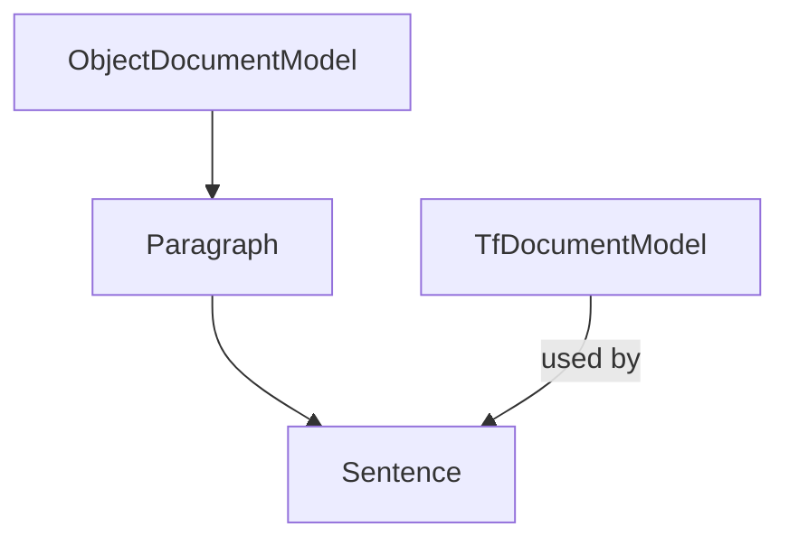

# `sumy.models`

## Tree:
models/
├── dom/
│   ├── _document.py
│   ├── _paragraph.py
│   └── _sentence.py
└── tf.py

## Role:
Provides core data models for document representation and term frequency calculations in the summarization pipeline.

## Description:
This module encapsulates the fundamental data structures used throughout the sumy library for representing documents, paragraphs, sentences, and term frequencies. It serves as the foundational layer for all text processing operations in the summarization framework.

The module is divided into two main areas:
1. Document Object Model (DOM) components for hierarchical document representation
2. Term Frequency (TF) models for statistical analysis of word occurrences

Primary consumers of this module include:
- Summarizer algorithms that operate on document structures
- Text preprocessing pipelines that build document models
- Evaluation modules that analyze document features

The cohesion principle is based on the shared concept of document representation and text analysis - all components work together to model textual content in ways that support various summarization techniques.

## Components:
- **ObjectDocumentModel**: Hierarchical document model that aggregates paragraphs, sentences, headings, and words
- **Paragraph**: Container for sentences with cached properties for headings and regular sentences  
- **Sentence**: Basic text unit with heading detection and word tokenization capabilities
- **TfDocumentModel**: Term frequency model for calculating word importance statistics

## Public API:
- **ObjectDocumentModel**: Main document model class for hierarchical text representation
- **Paragraph**: Paragraph container with sentence filtering capabilities  
- **Sentence**: Text unit with heading detection and word extraction
- **TfDocumentModel**: Term frequency calculation and analysis interface

## Dependencies:
- Internal: Uses cached_property for lazy evaluation
- Internal: References Sentence class from same module
- External: Uses collections.Counter for term counting
- External: Uses math for magnitude calculations
- External: Uses itertools.chain for flattening sequences
- External: Uses six.string_types for string type checking
- External: Uses six.moves.pprint for pretty printing

## Constraints:
- Sentence objects must be created with proper Sentence instances in Paragraph constructor
- TfDocumentModel requires either a sequence of words or a tokenizer when given a string
- All document models are immutable once constructed
- Thread-safe for read operations but not for modification

---

## Files

- [`tf.py`](models/tf.md)

