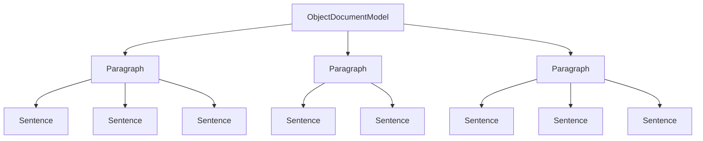

# `sumy.models.dom`

## Tree:
dom/
├── _document.py
├── _paragraph.py
└── _sentence.py

## Role:
The DOM (Document Object Model) module provides a hierarchical representation of textual documents, enabling structured processing of text content through nested objects representing sentences, paragraphs, and entire documents.

## Description:
This module implements a document model hierarchy that organizes text content in a structured way. It's primarily used by summarization algorithms and text processing components throughout the system to work with documents as structured data rather than raw text. The module provides abstractions for sentences, paragraphs, and complete documents, allowing downstream components to efficiently access different levels of document structure.

The components are grouped together because they represent a cohesive conceptual layer for document representation - they form a hierarchical data structure where sentences compose paragraphs, and paragraphs compose documents. This architectural grouping enables clean separation between document structure modeling and text processing logic.

## Components:
- **ObjectDocumentModel**: Represents a complete document composed of multiple paragraphs
- **Paragraph**: Represents a paragraph containing multiple sentences, distinguishing between regular sentences and headings
- **Sentence**: Represents a single sentence with text content and metadata

## Public API:
- **ObjectDocumentModel(paragraphs)**: Creates a document model from a collection of paragraphs
  - Usage: Initialize with a list/tuple of Paragraph objects
- **Paragraph(sentences)**: Creates a paragraph from a collection of sentences
  - Usage: Initialize with a list/tuple of Sentence objects
- **Sentence(text, tokenizer, is_heading=False)**: Creates a sentence with associated text and tokenizer
  - Usage: Initialize with text string, tokenizer instance, and optional heading flag

## Dependencies:
- Internal: `sumy.utils.cached_property` - for memoized property computation
- Internal: `sumy._compat.to_unicode` and `sumy._compat.to_string` - for text encoding handling
- External: `itertools.chain` - for flattening nested collections

## Constraints:
- Paragraph objects must be initialized with only Sentence instances
- Sentence objects require a tokenizer for word extraction
- All objects are immutable once created (properties are cached)
- Thread-safe for read operations due to cached properties

---

## Files

- [`_document.py`](dom/_document.md)
- [`_paragraph.py`](dom/_paragraph.md)
- [`_sentence.py`](dom/_sentence.md)

