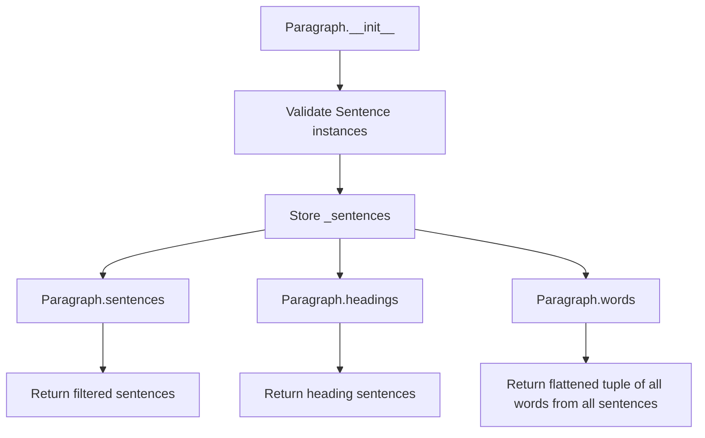

# `_paragraph.py`

## `sumy.models.dom._paragraph.Paragraph` · *class*

## Summary:
Represents a paragraph containing multiple sentences, separating headings from regular sentences and providing access to aggregated word lists.

## Description:
The Paragraph class serves as a container for organizing and accessing collections of Sentence objects. It distinguishes between heading sentences and regular sentences, providing separate access to each type. The class is designed to efficiently manage paragraph-level text data while maintaining clean separation between different types of content within a paragraph.

This abstraction exists to provide a structured interface for working with paragraphs that may contain both headings and regular sentences, making it easier to process and analyze document structure.

## State:
- `_sentences` (tuple[Sentence]): Immutable collection of all sentences in the paragraph
- `_cached_property_sentences` (tuple[Sentence]): Cached result of filtered sentences (excluding headings)
- `_cached_property_headings` (tuple[Sentence]): Cached result of heading sentences
- `_cached_property_words` (tuple[str]): Cached result of all words from all sentences

The constructor requires a sequence of Sentence objects, which are validated to ensure they are all instances of the Sentence class.

## Lifecycle:
Creation: Instantiate with a sequence of Sentence objects via `Paragraph(sentences)` constructor
Usage: Access properties like `sentences`, `headings`, and `words` which are lazily computed and cached
Destruction: No explicit cleanup required; relies on Python's garbage collection

## Method Map:


## Raises:
- TypeError: Raised during initialization when any item in the sentences sequence is not an instance of the Sentence class

## Example:
```python
# Create sentences
heading = Sentence("Introduction", tokenizer, is_heading=True)
body_sentence = Sentence("This is a regular sentence.", tokenizer, is_heading=False)
paragraph = Paragraph([heading, body_sentence])

# Access paragraph components
print(paragraph.headings)     # Returns tuple with heading sentence
print(paragraph.sentences)    # Returns tuple with body sentence
print(paragraph.words)        # Returns tuple of all words from all sentences
```

### `sumy.models.dom._paragraph.Paragraph.__init__` · *method*

## Summary:
Initializes a Paragraph object with a collection of validated Sentence instances.

## Description:
Constructs a Paragraph by converting the input iterable to a tuple of Sentence objects and validating each item is an instance of the Sentence class. This method ensures data integrity by enforcing strict type checking on sentence inputs.

## Args:
    sentences (iterable): An iterable of Sentence objects to form the paragraph content.

## Returns:
    None: This method initializes the object's internal state and returns nothing.

## Raises:
    TypeError: When any item in the sentences iterable is not an instance of the Sentence class.

## State Changes:
    Attributes READ: None
    Attributes WRITTEN: self._sentences

## Constraints:
    Preconditions: 
    - All items in the sentences parameter must be instances of Sentence class
    - The sentences parameter must be iterable
    
    Postconditions:
    - self._sentences is set to a tuple of Sentence objects
    - All items in self._sentences are validated Sentence instances

## Side Effects:
    None: This method performs no I/O operations or external service calls.

### `sumy.models.dom._paragraph.Paragraph.sentences` · *method*

## Summary:
Returns a tuple of all non-heading sentences contained in this paragraph.

## Description:
This cached property provides filtered access to the paragraph's sentences by excluding any sentences marked as headings. The filtering is performed lazily on first access and cached for subsequent accesses to improve performance.

## Args:
    None

## Returns:
    tuple[Sentence]: A tuple containing only the non-heading sentences from the paragraph's sentence collection.

## Raises:
    None

## State Changes:
    Attributes READ: self._sentences, self._sentences.is_heading
    Attributes WRITTEN: None

## Constraints:
    Preconditions: The paragraph must have been initialized with a collection of Sentence objects
    Postconditions: The returned tuple contains only Sentence objects where is_heading is False

## Side Effects:
    None

### `sumy.models.dom._paragraph.Paragraph.headings` · *method*

## Summary:
Returns a tuple of all heading sentences contained within this paragraph.

## Description:
This method provides access to all sentences in the paragraph that are identified as headings. It filters the internal collection of sentences and returns only those where the `is_heading` property evaluates to True. This method is implemented as a cached property, making repeated calls efficient.

The method is typically called during document summarization processes where different treatment is needed for heading and regular sentences. It's part of the Document Object Model (DOM) structure that organizes text content into paragraphs and sentences.

## Args:
    None

## Returns:
    tuple[Sentence]: A tuple containing all Sentence objects in this paragraph that have their `is_heading` property set to True. Returns an empty tuple if no headings exist in the paragraph.

## Raises:
    None

## State Changes:
    Attributes READ: self._sentences
    Attributes WRITTEN: None

## Constraints:
    Preconditions: The Paragraph instance must have been properly initialized with a sequence of Sentence objects.
    Postconditions: The returned tuple contains only Sentence objects where `sentence.is_heading` is True.

## Side Effects:
    None

### `sumy.models.dom._paragraph.Paragraph.words` · *method*

## Summary:
Returns a flattened tuple of all words from all sentences in the paragraph.

## Description:
This method provides access to all words contained within the paragraph by aggregating words from each sentence. It's implemented as a cached property, meaning the computation is performed only once and the result is stored for future accesses.

The method iterates through all sentences in `self._sentences` and collects the `words` property from each sentence, flattening them into a single tuple using `itertools.chain`.

## Args:
    None

## Returns:
    tuple[str]: A tuple containing all words from all sentences in the paragraph, in order. Each word is represented as a string.

## Raises:
    None

## State Changes:
    Attributes READ: 
        - self._sentences: The internal storage of Sentence objects in the paragraph
    Attributes WRITTEN: 
        - None

## Constraints:
    Preconditions:
        - The paragraph must have been initialized with valid Sentence objects
        - Each item in `self._sentences` must be an instance of the Sentence class
    Postconditions:
        - Returns a tuple of strings representing all words in the paragraph
        - The returned tuple maintains the sequential order of words from sentences

## Side Effects:
    None

### `sumy.models.dom._paragraph.Paragraph.__unicode__` · *method*

## Summary:
Returns a string representation of the paragraph showing heading and sentence counts.

## Description:
This method provides a human-readable string representation of a Paragraph object, displaying the number of headings and regular sentences it contains. It is called automatically when the built-in `unicode()` function is applied to a Paragraph instance or when the object is used in string contexts requiring a unicode representation.

## Args:
    None

## Returns:
    str: A formatted string in the pattern "<Paragraph with X headings & Y sentences>" where X is the count of heading sentences and Y is the count of regular sentences.

## Raises:
    None

## State Changes:
    Attributes READ: 
    - self.headings (cached property)
    - self.sentences (cached property)

## Constraints:
    Preconditions:
    - The Paragraph object must have been properly initialized with a collection of Sentence objects
    - The `headings` and `sentences` cached properties must be accessible
    
    Postconditions:
    - The returned string format is consistent and follows the pattern "<Paragraph with %d headings & %d sentences>"
    - The counts represent the current state of the paragraph's sentences

## Side Effects:
    None

### `sumy.models.dom._paragraph.Paragraph.__repr__` · *method*

## Summary:
Returns the string representation of the paragraph by invoking its string conversion method.

## Description:
This method provides the official string representation (repr) of a Paragraph object by delegating to its string conversion method (`__str__`). This is typically used for debugging and development purposes to display a readable representation of the paragraph object. When called, it returns whatever value `self.__str__()` produces, which in this implementation relies on the parent class's string conversion behavior or falls back to the `__unicode__` method if no explicit `__str__` is defined.

## Args:
    None

## Returns:
    str: A string representation of the paragraph object, typically showing paragraph statistics such as heading and sentence counts.

## Raises:
    None explicitly raised

## State Changes:
    Attributes READ: None
    Attributes WRITTEN: None

## Constraints:
    Preconditions: The object must be properly initialized with sentences
    Postconditions: Returns a string representation of the paragraph

## Side Effects:
    None

