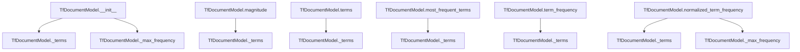

# `tf.py`

## `sumy.models.tf.TfDocumentModel` · *class*

## Summary:
Represents a document model that computes term frequencies and related statistics from word sequences.

## Description:
The TfDocumentModel class processes document words to calculate term frequencies and related metrics. It accepts either a sequence of words or a string with a tokenizer for processing. This class serves as a foundational abstraction for text analysis tasks that require term frequency computations, such as TF-IDF calculations or document similarity measurements.

## State:
- `_terms`: Counter object storing lowercase terms and their frequencies, type Counter[unicode, int]
- `_max_frequency`: Maximum frequency value among all terms, type int, always >= 1

## Lifecycle:
Creation: Instantiate with either a sequence of words or a string with tokenizer parameter
Usage: Access properties like magnitude and terms, call methods like term_frequency() and normalized_term_frequency()
Destruction: No explicit cleanup required; uses standard Python garbage collection

## Method Map:


## Raises:
- ValueError: When words is a string but tokenizer is None, or when words is neither a string nor a sequence

## Example:
```python
# Create from sequence of words
model1 = TfDocumentModel(['hello', 'world', 'hello'])

# Create from string with tokenizer
model2 = TfDocumentModel("Hello world hello", tokenizer=my_tokenizer)

# Access term frequencies
freq = model1.term_frequency('hello')  # Returns 2
norm_freq = model1.normalized_term_frequency('hello')  # Returns 1.0 (normalized)
magnitude = model1.magnitude  # Returns sqrt(6)
most_common = model1.most_frequent_terms(2)  # Returns ('hello', 'world')
```

### `sumy.models.tf.TfDocumentModel.__init__` · *method*

## Summary:
Initializes a term frequency document model from words, normalizing text and computing term frequencies.

## Description:
Constructs a TfDocumentModel instance by processing input words into a standardized format. The method accepts either a string (with tokenizer) or a sequence of words, converts them to lowercase, and computes term frequencies while tracking the maximum frequency for normalization purposes.

## Args:
    words (str or Sequence): Input words as a string or sequence of strings. When provided as a string, a tokenizer must also be given.
    tokenizer (object, optional): Tokenizer object used to split strings into words. Required when words is a string.

## Returns:
    None: This method initializes the object's internal state and does not return a value.

## Raises:
    ValueError: Raised when words is a string but tokenizer is None, or when words is neither a string nor a sequence.

## State Changes:
    Attributes READ: None
    Attributes WRITTEN: 
        - self._terms: Stores term frequencies as a Counter object with lowercase terms
        - self._max_frequency: Stores the maximum term frequency value (1 if no terms)

## Constraints:
    Preconditions:
        - If words is a string, tokenizer must be provided
        - If words is not a string, it must be a sequence-like object
    Postconditions:
        - self._terms contains lowercase word frequencies
        - self._max_frequency is set to the highest frequency or 1 if no terms

## Side Effects:
    None: This method performs no I/O operations or external service calls.

### `sumy.models.tf.TfDocumentModel.magnitude` · *method*

## Summary:
Calculates the Euclidean norm (magnitude) of the document's term frequency vector.

## Description:
This property computes the magnitude of the document's term frequency representation using the formula √(Σ(term_frequency²)). The magnitude is commonly used for normalizing document vectors in text processing applications such as cosine similarity calculations.

## Args:
    None

## Returns:
    float: The Euclidean norm of the document's term frequency vector. Returns 0.0 for empty documents.

## Raises:
    None

## State Changes:
    Attributes READ: self._terms
    Attributes WRITTEN: None

## Constraints:
    Preconditions: 
    - self._terms must be a dictionary-like object with numeric values
    - All values in self._terms must be non-negative (as they represent term frequencies)
    
    Postconditions:
    - Returns a non-negative floating-point number
    - For documents with no terms, returns 0.0

## Side Effects:
    None

### `sumy.models.tf.TfDocumentModel.terms` · *method*

## Summary:
Returns the collection of unique terms present in the document.

## Description:
Provides access to all unique terms (words) found in the document represented by this model. This method serves as a read-only interface to the underlying term collection stored in `_terms`.

## Args:
    None

## Returns:
    dict_keys: An iterable view of the unique terms (keys) in the document's term frequency counter.

## Raises:
    None

## State Changes:
    Attributes READ: self._terms
    Attributes WRITTEN: None

## Constraints:
    Preconditions: The TfDocumentModel instance must be properly initialized with terms.
    Postconditions: The returned iterable contains all unique terms from the document.

## Side Effects:
    None

### `sumy.models.tf.TfDocumentModel.most_frequent_terms` · *method*

## Summary:
Returns terms from the document sorted by frequency in descending order, with optional limit on the number of returned terms.

## Description:
This method provides access to the terms in a document ordered by their frequency of occurrence, allowing clients to retrieve either all terms or a subset of the most frequent terms. It's designed to support document analysis workflows where term frequency information is needed for ranking, filtering, or statistical purposes.

## Args:
    count (int): Maximum number of most frequent terms to return. Defaults to 0 (return all terms). Must be non-negative.

## Returns:
    tuple[str]: A tuple containing term strings sorted by frequency in descending order. Returns all terms when count=0, or the first count terms when count>0.

## Raises:
    ValueError: When count is negative, indicating invalid parameter value.

## State Changes:
    Attributes READ: self._terms
    Attributes WRITTEN: None

## Constraints:
    Preconditions: 
    - self._terms must be a Counter or dict-like object with string keys and numeric values
    - count must be a non-negative integer
    
    Postconditions:
    - Returned tuple contains only terms that existed in the document
    - Terms in result are sorted by frequency in descending order
    - If count > 0 and count < total terms, only count terms are returned

## Side Effects:
    None

### `sumy.models.tf.TfDocumentModel.term_frequency` · *method*

## Summary:
Returns the frequency count of a specified term within the document model.

## Description:
Retrieves the term frequency from the internal term counter. This method provides a safe way to access term frequencies without raising KeyError exceptions for unknown terms.

## Args:
    term (str): The term whose frequency is to be retrieved.

## Returns:
    int: The frequency count of the specified term. Returns 0 if the term is not found in the document.

## Raises:
    None: This method does not raise any exceptions.

## State Changes:
    Attributes READ: self._terms
    Attributes WRITTEN: None

## Constraints:
    Preconditions: The method assumes that `self._terms` is properly initialized as a Counter object containing term frequencies.
    Postconditions: The method returns an integer representing the term frequency or zero for unseen terms.

## Side Effects:
    None: This method performs no I/O operations or external service calls. It only accesses internal state.

### `sumy.models.tf.TfDocumentModel.normalized_term_frequency` · *method*

## Summary:
Computes the normalized term frequency for a given term using the document's maximum frequency and optional smoothing.

## Description:
This method calculates the normalized term frequency by dividing the term's frequency by the document's maximum term frequency, then applies smoothing if specified. It's commonly used in text processing and information retrieval to normalize term frequencies across documents.

## Args:
    term (str): The term for which to calculate the normalized frequency.
    smooth (float): Smoothing factor between 0.0 and 1.0. Defaults to 0.0. When smooth=0.0, no smoothing is applied.

## Returns:
    float: The normalized term frequency value, typically between 0.0 and 1.0, inclusive.

## Raises:
    None explicitly raised by this method.

## State Changes:
    Attributes READ: self._max_frequency, self.term_frequency
    Attributes WRITTEN: None

## Constraints:
    Preconditions: The term must be a string, and the TfDocumentModel instance must have been initialized with valid word data.
    Postconditions: The returned value will be in the range [0.0, 1.0] when smooth=0.0, or in the range [smooth, 1.0] when smooth>0.0.

## Side Effects:
    None

### `sumy.models.tf.TfDocumentModel.__repr__` · *method*

## Summary:
Returns a string representation of the TfDocumentModel instance showing its internal term frequencies.

## Description:
This method provides a human-readable string representation of the TfDocumentModel object, displaying the internal term frequency counter in a formatted manner. It is automatically called when the object is printed or converted to a string in debugging contexts.

## Args:
    None

## Returns:
    str: A formatted string representation in the form "<TfDocumentModel {formatted_terms}>", where formatted_terms is a pretty-printed version of the internal Counter object containing term frequencies.

## Raises:
    None

## State Changes:
    Attributes READ: self._terms
    Attributes WRITTEN: None

## Constraints:
    Preconditions: The object must be properly initialized with a valid _terms attribute (Counter object)
    Postconditions: The method returns a string representation without modifying the object's state

## Side Effects:
    None

