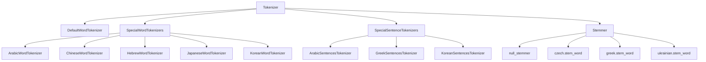

# `sumy.nlp`

## Tree:
```
nlp/
├── stemmers/
│   ├── __init__.py
│   ├── czech.py
│   ├── greek.py
│   └── ukrainian.py
└── tokenizers.py
```

## Role:
Provides natural language processing capabilities for text preprocessing, including tokenization and stemming operations for multiple languages.

## Description:
This module serves as the core NLP toolkit for the sumy library, offering standardized text processing utilities that support multi-language text analysis. It provides both sentence and word tokenization as well as language-specific stemming functionality to prepare text for summarization algorithms.

The module is used throughout the sumy library for preprocessing input text before applying various summarization techniques. It handles language-specific nuances in tokenization and stemming to ensure accurate text processing across different languages.

## Components:
*   `sumy.nlp.stemmers.Stemmer`: Main stemmer interface that selects appropriate language-specific stemmer based on language specification
*   `sumy.nlp.stemmers.null_stemmer`: Basic stemmer that converts text to lowercase
*   `sumy.nlp.stemmers.czech.stem_word`: Czech-specific word stemming algorithm with multiple morphological rules
*   `sumy.nlp.stemmers.greek.stem_word`: Greek-specific word stemming algorithm using external greek_stemmer library
*   `sumy.nlp.stemmers.ukrainian.stem_word`: Ukrainian-specific word stemming algorithm with complex suffix removal rules
*   `sumy.nlp.tokenizers.Tokenizer`: Main tokenizer interface that handles sentence and word tokenization for various languages
*   `sumy.nlp.tokenizers.DefaultWordTokenizer`: Standard NLTK-based word tokenizer
*   `sumy.nlp.tokenizers.ArabicSentencesTokenizer`: Arabic-specific sentence tokenizer using pyarabic library
*   `sumy.nlp.tokenizers.ArabicWordTokenizer`: Arabic-specific word tokenizer using pyarabic library
*   `sumy.nlp.tokenizers.ChineseWordTokenizer`: Chinese-specific word tokenizer using jieba library
*   `sumy.nlp.tokenizers.GreekSentencesTokenizer`: Greek-specific sentence tokenizer using NLTK
*   `sumy.nlp.tokenizers.HebrewWordTokenizer`: Hebrew-specific word tokenizer using hebrew_tokenizer library
*   `sumy.nlp.tokenizers.JapaneseWordTokenizer`: Japanese-specific word tokenizer using tinysegmenter library
*   `sumy.nlp.tokenizers.KoreanSentencesTokenizer`: Korean-specific sentence tokenizer using konlpy library
*   `sumy.nlp.tokenizers.KoreanWordTokenizer`: Korean-specific word tokenizer using konlpy library



## Public API:
*   `sumy.nlp.Tokenizer(language)`: Constructor for creating language-aware tokenizer instances
*   `sumy.nlp.Tokenizer.to_sentences(paragraph)`: Splits a paragraph into sentences
*   `sumy.nlp.Tokenizer.to_words(sentence)`: Splits a sentence into words
*   `sumy.nlp.Stemmer(language)`: Constructor for creating language-aware stemmer instances
*   `sumy.nlp.Stemmer.__call__(word)`: Applies stemming to a single word

## Dependencies:
*   Internal: `_compat` module for Unicode handling
*   External: `nltk`, `jieba`, `tinysegmenter`, `konlpy`, `greek_stemmer`, `hebrew_tokenizer`, `pyarabic`

## Constraints:
*   Language specifications must be valid ISO language codes or aliases recognized by the module
*   Specialized tokenizers require additional external packages to be installed
*   All text processing methods expect Unicode strings as input
*   Thread-safe for concurrent use with different language configurations

---

## Files

- [`tokenizers.py`](nlp/tokenizers.md)

