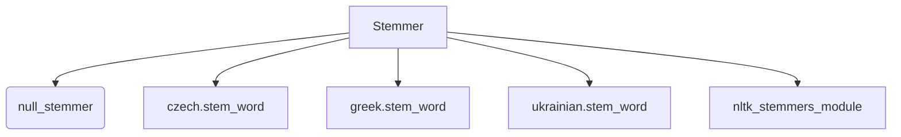

# `sumy.nlp.stemmers`

## Tree:
stemmers/
├── __init__.py
├── czech.py
├── greek.py
└── ukrainian.py

## Role:
Provides language-specific text stemming capabilities for natural language processing tasks.

## Description:
This module implements a unified interface for applying stemming operations to words in various languages. It serves as a central hub that selects appropriate stemmer algorithms based on language specifications, handling both specialized language stemmers and falling back to NLTK-based stemmers for other languages.

The module is primarily consumed by summarization components in the sumy library that require normalized word forms for analysis and processing. It groups together language-specific stemming logic to provide a consistent API regardless of the underlying implementation details.

## Components:
- **Stemmer**: Main class that provides language-aware stemming functionality by delegating to appropriate language-specific stemmers
- **null_stemmer**: Default fallback stemmer that converts text to lowercase unicode
- **czech.stem_word**: Czech language specific stemming algorithm that removes inflectional suffixes
- **greek.stem_word**: Greek language specific stemming algorithm using external greek-stemmer library
- **ukrainian.stem_word**: Ukrainian language specific stemming algorithm using regex-based morphological rules

## Public API:
- **Stemmer(language)**: Constructor that creates a language-specific stemmer instance
- **Stemmer.__call__(word)**: Apply stemming to a single word using the appropriate language-specific algorithm
- **null_stemmer(word)**: Default fallback stemmer that converts text to lowercase unicode
- **czech.stem_word(word, aggressive=False)**: Czech word stemming with optional aggressive mode for more extensive suffix removal
- **greek.stem_word(word)**: Greek word stemming using external greek-stemmer library
- **ukrainian.stem_word(word)**: Ukrainian word stemming using regex-based morphological rules

## Dependencies:
- Internal: `sumy._compat.to_unicode` for Unicode handling
- Internal: `sumy.utils.normalize_language` for language code normalization
- Internal: `sumy.nlp.stemmers.czech`, `sumy.nlp.stemmers.greek`, `sumy.nlp.stemmers.ukrainian` for language-specific implementations
- External: `nltk.stemmers` for fallback NLTK-based stemmers
- External: `greek_stemmer` library for Greek stemming (optional dependency)

## Constraints:
- The Stemmer class requires a valid language identifier to instantiate properly
- Greek stemming requires the external `greek-stemmer-pos` package to be installed
- Language codes are normalized using the standard language normalization utility
- Thread-safe for concurrent use with different language instances
- No initialization prerequisites beyond standard Python environment setup

---

## Files

- [`__init__.py`](stemmers/__init__.md)
- [`czech.py`](stemmers/czech.md)
- [`greek.py`](stemmers/greek.md)
- [`ukrainian.py`](stemmers/ukrainian.md)

