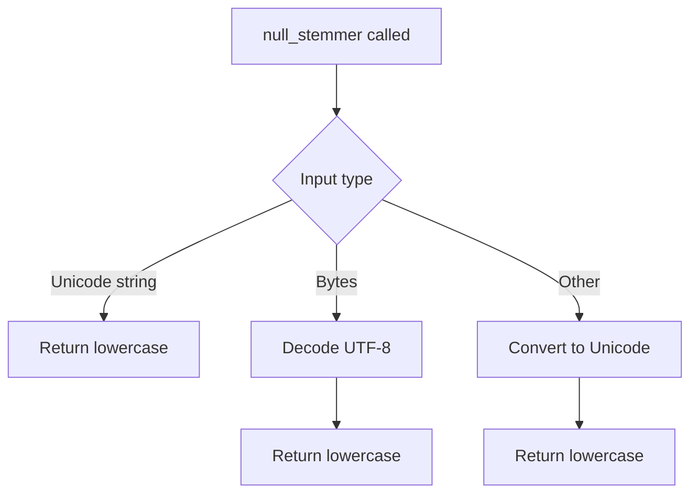

# `__init__.py`

## `sumy.nlp.stemmers.__init__.null_stemmer` · *function*

## Summary:
Converts an object to lowercase Unicode string representation.

## Description:
Normalizes input objects to lowercase Unicode strings. This function serves as a basic text normalization utility that ensures consistent string formatting regardless of input type. It is typically used as a fallback stemmer when language-specific stemming is not available or appropriate.

## Args:
    object (Any): Any object that can be converted to a Unicode string. This could be a string, bytes, or other data types that support Unicode conversion.

## Returns:
    str: Lowercase Unicode string representation of the input object.

## Raises:
    None explicitly raised, but underlying conversion operations may raise exceptions if the input object cannot be processed.

## Constraints:
    Preconditions:
    - Input object must be convertible to Unicode string
    - Function assumes proper encoding handling for byte inputs
    
    Postconditions:
    - Return value is always a lowercase Unicode string
    - Return value maintains the semantic content of the original input

## Side Effects:
    None

## Control Flow:


## Examples:
```python
# Basic usage
result = null_stemmer("Hello World")
# Returns: "hello world"

# With bytes input
result = null_stemmer(b"HELLO WORLD")
# Returns: "hello world"

# With mixed case
result = null_stemmer("HeLLo WoRLd")
# Returns: "hello world"
```

## `sumy.nlp.stemmers.__init__.Stemmer` · *class*

## Summary:
A language-aware stemmer that applies appropriate stemming algorithms based on the specified language, falling back to NLTK stemmers for unsupported languages.

## Description:
The Stemmer class provides a unified interface for applying stemming operations to text in various languages. It maintains special handling for specific languages that require custom stemming logic while delegating to NLTK's snowball stemmers for standard languages. This abstraction allows users to apply stemming without needing to know the underlying implementation details for each language.

The class is designed to be instantiated once with a target language and then called repeatedly with words to be stemmed. It handles language normalization internally and provides appropriate error messages when stemmers are unavailable for requested languages.

## State:
- `_stemmer`: callable function that performs the actual stemming operation
  - Type: callable function
  - Valid range: Any callable that accepts a string and returns a string
  - Invariant: Always refers to a valid stemming function after initialization

## Lifecycle:
- Creation: Instantiate with a language string parameter (e.g., Stemmer('english'))
- Usage: Call the instance with individual words (e.g., stemmer('running'))
- Destruction: No explicit cleanup required; relies on Python's garbage collection

## Method Map:
```mermaid
graph TD
    A[Stemmer.__init__] --> B{Language in SPECIAL_STEMMERS?}
    B -- Yes --> C[Set _stemmer to special stemmer]
    B -- No --> D[Get NLTK stemmer class]
    D --> E{NLTK stemmer found?}
    E -- No --> F[raise LookupError]
    E -- Yes --> G[Set _stemmer to stem method]
    H[Stemmer.__call__] --> I[_stemmer(word)]
```

## Raises:
- `LookupError`: Raised when a stemmer is not available for the specified language and no suitable NLTK stemmer can be found

## Example:
```python
# Create a stemmer for English
english_stemmer = Stemmer('english')

# Stem individual words
result = english_stemmer('running')  # Returns 'run'

# Create a stemmer for Czech (uses special stemmer)
czech_stemmer = Stemmer('czech')
result = czech_stemmer('běží')  # Uses Czech-specific stemming logic

# This will raise LookupError for unsupported language
try:
    unsupported_stemmer = Stemmer('unsupported_language')
except LookupError:
    print("Stemmer not available for this language")
```

### `sumy.nlp.stemmers.__init__.Stemmer.__init__` · *method*

## Summary:
Initializes a stemmer instance for the specified language by selecting an appropriate stemming algorithm.

## Description:
Configures the stemmer instance to use either a specialized stemmer for specific languages or a standard NLTK stemmer for supported languages. This method determines the appropriate stemming strategy based on language support and prepares the internal _stemmer attribute for use. The initialization process follows these steps:
1. Normalizes the language parameter
2. Sets a default null stemmer
3. Checks if a special stemmer exists for the language
4. Falls back to NLTK stemmer if no special stemmer is available
5. Assigns the appropriate stemmer method to internal storage

## Args:
    language (str): Language code or name for which to initialize the stemmer. Supports standard ISO language codes and common aliases like 'czech', 'slovak', 'hebrew', 'chinese', 'japanese', 'korean', 'ukrainian', 'greek'.

## Returns:
    None: This method initializes the object's internal state and returns nothing.

## Raises:
    LookupError: When a stemmer is not available for the specified language and no special stemmer exists for that language. This occurs when the language is not in SPECIAL_STEMMERS and no corresponding NLTK stemmer class can be found.

## State Changes:
    Attributes READ: None
    Attributes WRITTEN: self._stemmer

## Constraints:
    Preconditions: The language parameter must be a valid string that can be processed by normalize_language().
    Postconditions: The self._stemmer attribute will reference either a special stemmer function (for Czech, Slovak, Hebrew, Chinese, Japanese, Korean, Ukrainian, Greek) or an NLTK stemmer method (for other supported languages).

## Side Effects:
    None: This method performs no I/O operations or external service calls. It only configures internal state.

### `sumy.nlp.stemmers.__init__.Stemmer.__call__` · *method*

## Summary:
Invokes the stemmer on a given word and returns its stemmed form.

## Description:
This method provides a callable interface for the Stemmer class, allowing instances to be invoked directly like functions. It delegates the stemming operation to the appropriate stemmer based on the language configured during initialization.

## Args:
    word (str): The input word to be stemmed.

## Returns:
    str: The stemmed version of the input word.

## Raises:
    None explicitly raised by this method.

## State Changes:
    Attributes READ: self._stemmer
    Attributes WRITTEN: None

## Constraints:
    Preconditions: The Stemmer instance must have been properly initialized with a supported language.
    Postconditions: The returned value is the stemmed form of the input word according to the selected stemmer algorithm.

## Side Effects:
    None

